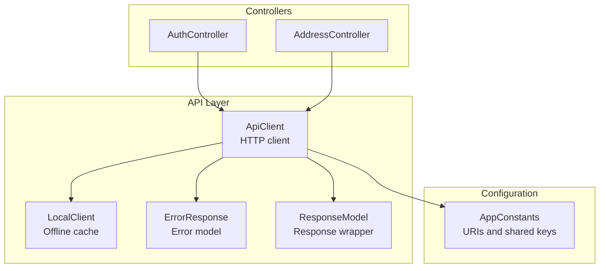
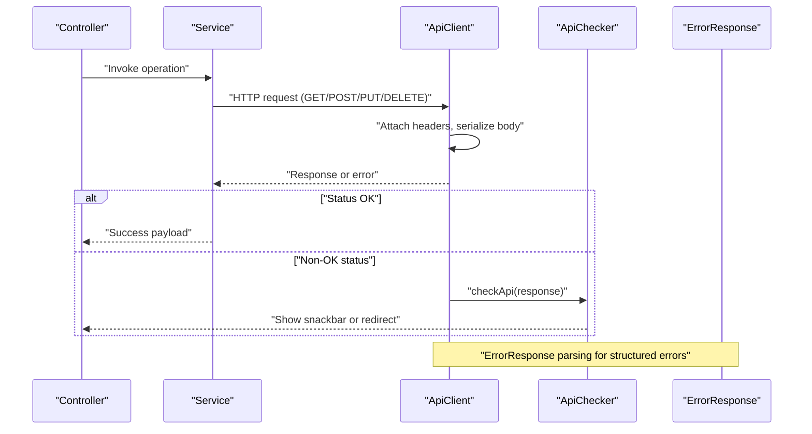
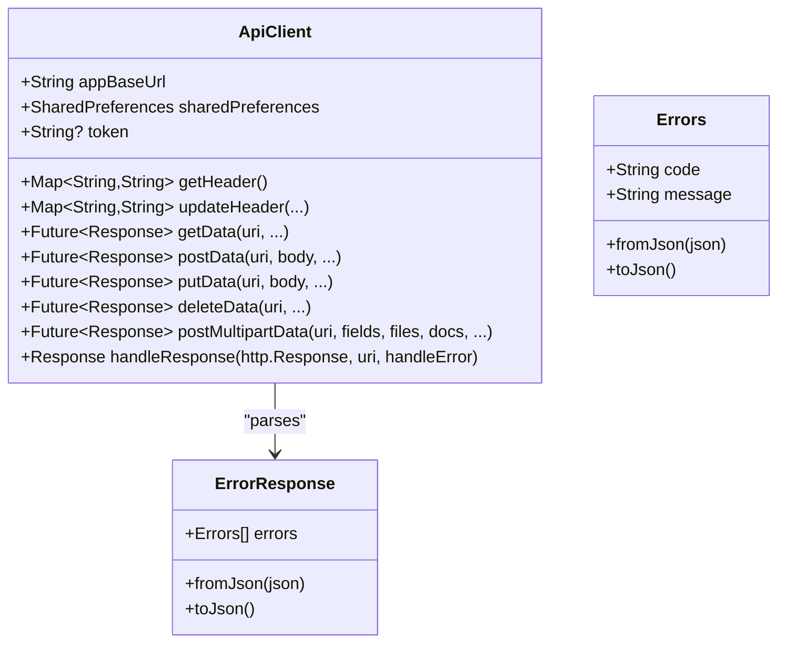
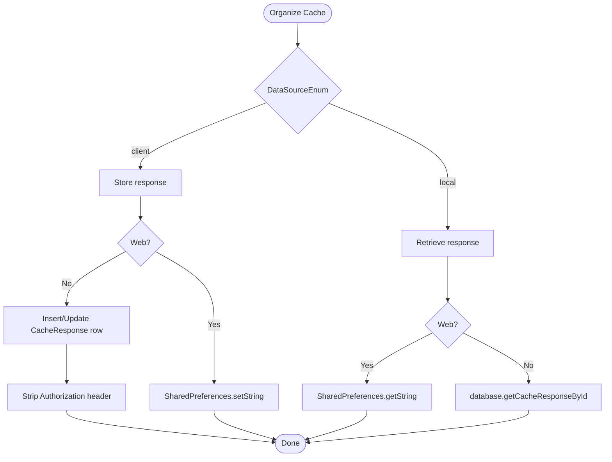
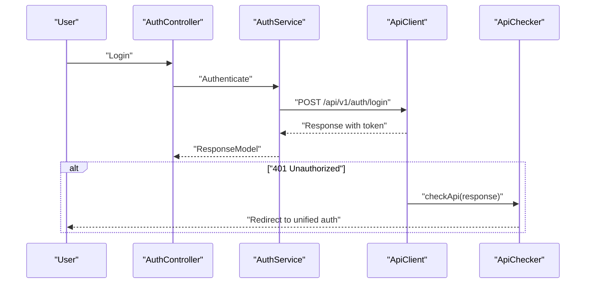
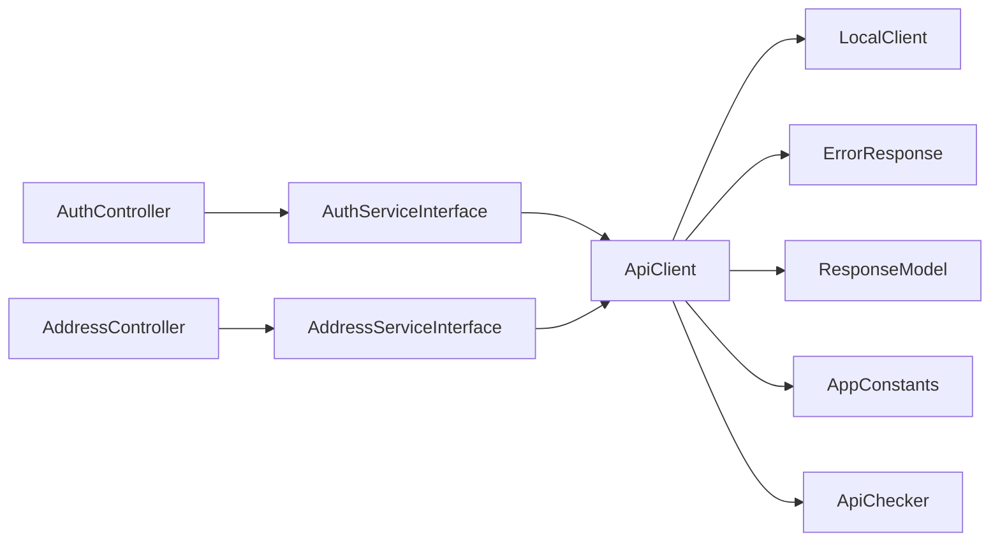

# API Integration

<cite>
**Referenced Files in This Document**
- [api_client.dart](file://lib/api/api_client.dart)
- [local_client.dart](file://lib/api/local_client.dart)
- [app_constants.dart](file://lib/util/app_constants.dart)
- [error_response.dart](file://lib/common/models/error_response.dart)
- [response_model.dart](file://lib/common/models/response_model.dart)
- [api_checker.dart](file://lib/api/api_checker.dart)
- [auth_controller.dart](file://lib/features/auth/controllers/auth_controller.dart)
- [address_controller.dart](file://lib/features/address/controllers/address_controller.dart)
</cite>

## Table of Contents
1. [Introduction](#introduction)
2. [Project Structure](#project-structure)
3. [Core Components](#core-components)
4. [Architecture Overview](#architecture-overview)
5. [Detailed Component Analysis](#detailed-component-analysis)
6. [Dependency Analysis](#dependency-analysis)
7. [Performance Considerations](#performance-considerations)
8. [Troubleshooting Guide](#troubleshooting-guide)
9. [Conclusion](#conclusion)
10. [Appendices](#appendices)

## Introduction
This document describes the RESTful API integration system used by the application. It covers HTTP methods, URL patterns, request/response schemas, authentication headers, automatic header management, error handling, and offline caching strategies. It also documents endpoint specifications for major API groups (authentication, user management, product catalog, order processing, and location services), along with security considerations, data serialization, and performance optimization techniques.

## Project Structure
The API integration is centered around a Dart-based HTTP client that encapsulates request construction, header management, response parsing, and error handling. Supporting components include constants for endpoint URIs, models for error and response structures, and offline caching utilities.

**Diagram sources**
- [api_client.dart:18-245](file://lib/api/api_client.dart#L18-L245)
- [local_client.dart:10-62](file://lib/api/local_client.dart#L10-L62)
- [app_constants.dart:6-424](file://lib/util/app_constants.dart#L6-L424)
- [error_response.dart:1-52](file://lib/common/models/error_response.dart#L1-L52)
- [response_model.dart:4-14](file://lib/common/models/response_model.dart#L4-L14)
- [auth_controller.dart:19-414](file://lib/features/auth/controllers/auth_controller.dart#L19-L414)
- [address_controller.dart:8-79](file://lib/features/address/controllers/address_controller.dart#L8-L79)

**Section sources**
- [api_client.dart:18-245](file://lib/api/api_client.dart#L18-L245)
- [local_client.dart:10-62](file://lib/api/local_client.dart#L10-L62)
- [app_constants.dart:6-424](file://lib/util/app_constants.dart#L6-L424)

## Core Components
- ApiClient: Centralized HTTP client providing GET, POST, PUT, DELETE, and multipart upload methods. Manages headers, timeouts, and response/error handling.
- LocalClient: Provides offline caching for API responses with safe header stripping for non-web platforms.
- AppConstants: Defines base URL and all endpoint URIs grouped by functional areas.
- ErrorResponse: Parses and exposes server-side error messages.
- ResponseModel: Wraps API responses with success flags and contextual data.
- ApiChecker: Global error handler that reacts to specific HTTP statuses (e.g., 401) by clearing session and redirecting to unified auth.

**Section sources**
- [api_client.dart:18-245](file://lib/api/api_client.dart#L18-L245)
- [local_client.dart:10-62](file://lib/api/local_client.dart#L10-L62)
- [app_constants.dart:6-424](file://lib/util/app_constants.dart#L6-L424)
- [error_response.dart:1-52](file://lib/common/models/error_response.dart#L1-L52)
- [response_model.dart:4-14](file://lib/common/models/response_model.dart#L4-L14)
- [api_checker.dart:7-18](file://lib/api/api_checker.dart#L7-L18)

## Architecture Overview
The system follows a layered architecture:
- Controllers orchestrate business logic and call services.
- Services delegate to ApiClient for network operations.
- ApiClient constructs requests, manages headers, serializes bodies, and parses responses.
- LocalClient optionally caches responses for offline use.
- ApiChecker centralizes error handling and redirects on authentication failures.

**Diagram sources**
- [api_client.dart:70-231](file://lib/api/api_client.dart#L70-L231)
- [api_checker.dart:8-17](file://lib/api/api_checker.dart#L8-L17)
- [error_response.dart:10-25](file://lib/common/models/error_response.dart#L10-L25)

## Detailed Component Analysis

### ApiClient
- Responsibilities:
  - Build and send HTTP requests with automatic headers.
  - Serialize request bodies and parse responses.
  - Handle timeouts and network errors.
  - Centralize error handling via ApiChecker.
- Automatic Header Management:
  - Content-Type: application/json; charset=UTF-8
  - Authorization: Bearer <token>
  - Localization: X-localization
  - Location: latitude, longitude
  - Zone context: zoneId
  - Optional module context: moduleId
- Methods:
  - getData(uri, query, headers): GET
  - postData(uri, body, headers, timeout): POST
  - putData(uri, body, headers): PUT
  - deleteData(uri, headers): DELETE
  - postMultipartData(uri, fields, files, docs, headers): Multipart uploads
- Error Handling:
  - Attempts to parse ErrorResponse for structured errors.
  - Converts non-OK responses to user-friendly messages.
  - On network exceptions, returns a standardized “no internet” response.

**Diagram sources**
- [api_client.dart:18-245](file://lib/api/api_client.dart#L18-L245)
- [error_response.dart:1-52](file://lib/common/models/error_response.dart#L1-L52)

**Section sources**
- [api_client.dart:18-245](file://lib/api/api_client.dart#L18-L245)
- [error_response.dart:1-52](file://lib/common/models/error_response.dart#L1-L52)

### LocalClient (Offline API Handling)
- Responsibilities:
  - Organize and persist cached responses keyed by endpoint identifiers.
  - Strip sensitive headers (e.g., Authorization) before storing on-device.
  - Retrieve cached responses for offline playback.
- Behavior:
  - Web: Uses SharedPreferences for storage.
  - Native: Uses Drift database with a CacheResponse table.
- Security:
  - Removes Authorization header from stored cache metadata.

**Diagram sources**
- [local_client.dart:12-61](file://lib/api/local_client.dart#L12-L61)

**Section sources**
- [local_client.dart:10-62](file://lib/api/local_client.dart#L10-L62)

### Authentication and Authorization
- Authentication Method:
  - Bearer token via Authorization header.
  - Tokens are persisted and automatically attached to all requests.
- Token Lifecycle:
  - Loaded from shared preferences during ApiClient initialization.
  - On 401 responses, ApiChecker clears session data and routes to unified auth.
- Rate Limiting:
  - No explicit client-side rate limiting headers observed in the codebase.
- API Versioning:
  - All endpoints use the /api/v1/ prefix.

**Diagram sources**
- [auth_controller.dart:62-82](file://lib/features/auth/controllers/auth_controller.dart#L62-L82)
- [api_client.dart:70-112](file://lib/api/api_client.dart#L70-L112)
- [api_checker.dart:8-17](file://lib/api/api_checker.dart#L8-L17)

**Section sources**
- [api_client.dart:24-66](file://lib/api/api_client.dart#L24-L66)
- [api_checker.dart:8-17](file://lib/api/api_checker.dart#L8-L17)
- [app_constants.dart:31-40](file://lib/util/app_constants.dart#L31-L40)

### Endpoint Specifications

Note: All endpoints below are prefixed with the base URL defined in AppConstants. The base URL is configured in the constants file.

- Authentication
  - POST /api/v1/auth/login
  - POST /api/v1/auth/sign-up
  - POST /api/v1/auth/forgot-password
  - POST /api/v1/auth/verify-token
  - POST /api/v1/auth/reset-password
  - POST /api/v1/auth/verify-phone
  - POST /api/v1/auth/check-email
  - POST /api/v1/auth/verify-email
  - POST /api/v1/auth/social-login
  - POST /api/v1/auth/social-register
  - POST /api/v1/auth/guest/request
  - POST /api/v1/auth/firebase-verify-token
  - POST /api/v1/auth/firebase-reset-password
  - POST /api/v1/auth/update-info

- User Management
  - GET /api/v1/customer/info
  - PUT /api/v1/customer/update-profile
  - PUT /api/v1/customer/order/payment-method
  - PUT /api/v1/customer/update-zone
  - POST /api/v1/customer/cm-firebase-token
  - POST /api/v1/customer/live-activity-token
  - POST /api/v1/customer/remove-account
  - POST /api/v1/customer/wallet/add-fund
  - POST /api/v1/customer/wallet/transactions
  - POST /api/v1/customer/loyalty-point/transactions
  - POST /api/v1/customer/loyalty-point/point-transfer
  - POST /api/v1/customer/order/refund-request
  - POST /api/v1/customer/order/refund-reasons
  - POST /api/v1/customer/order/cancel
  - POST /api/v1/customer/order/reorder
  - POST /api/v1/customer/order/place
  - POST /api/v1/customer/order/prescription/place
  - POST /api/v1/customer/order/offline-payment
  - POST /api/v1/customer/order/offline-payment-update
  - POST /api/v1/customer/order/get-Tax
  - POST /api/v1/customer/order/get-surge-price
  - POST /api/v1/customer/toggle-hide-phone
  - GET /api/v1/customer/order/track?order_id=
  - GET /api/v1/customer/order/list
  - GET /api/v1/customer/order/running-orders
  - GET /api/v1/customer/order/details?order_id=
  - GET /api/v1/customer/notifications
  - GET /api/v1/customer/wish-list
  - POST /api/v1/customer/wish-list/add?...
  - POST /api/v1/customer/wish-list/remove?...
  - POST /api/v1/customer/message/get
  - POST /api/v1/customer/message/send
  - POST /api/v1/customer/message/list
  - POST /api/v1/customer/message/search-list
  - POST /api/v1/customer/message/details
  - POST /api/v1/customer/message/mark-read

- Product Catalog
  - GET /api/v1/categories
  - GET /api/v1/categories/childes/{id}
  - GET /api/v1/categories/items/{id}
  - GET /api/v1/categories/stores/{id}
  - GET /api/v1/items/latest
  - GET /api/v1/items/popular
  - GET /api/v1/items/most-reviewed
  - GET /api/v1/items/details/{id}
  - GET /api/v1/items/reviews/submit
  - GET /api/v1/items/suggested
  - GET /api/v1/items/recommended
  - GET /api/v1/items/discounted
  - GET /api/v1/items/basic
  - GET /api/v1/items/ramadan-featured
  - GET /api/v1/items/item-or-store-search
  - GET /api/v1/categories/popular
  - GET /api/v1/flash-sales
  - GET /api/v1/flash-sales/items
  - GET /api/v1/brand
  - GET /api/v1/brand/items
  - GET /api/v1/campaigns/basic
  - GET /api/v1/campaigns/item
  - GET /api/v1/campaigns/basic-campaign-details?basic_campaign_id=

- Stores
  - GET /api/v1/stores/get-stores
  - GET /api/v1/stores/popular
  - GET /api/v1/stores/latest
  - GET /api/v1/stores/top-offer-near-me
  - GET /api/v1/stores/details/{id}
  - GET /api/v1/stores/reviews
  - GET /api/v1/stores/recommended
  - GET /api/v1/stores/similar
  - GET /api/v1/stores/{id}

- Coupons and Offers
  - GET /api/v1/coupon/list
  - GET /api/v1/coupon/apply?code=
  - GET /api/v1/coupon/list/taxi
  - GET /api/v1/rental/coupon/list
  - GET /api/v1/rental/coupon/apply

- Banners and Promotions
  - GET /api/v1/banners
  - GET /api/v1/banners/{id}
  - GET /api/v1/other-banners
  - GET /api/v1/other-banners/why-choose
  - GET /api/v1/other-banners/video-content
  - GET /api/v1/promotional-banner
  - GET /api/v1/banners/taxi
  - GET /api/v1/places/banners/featured

- Location and Configuration
  - GET /api/v1/config
  - GET /api/v1/config/get-zone-id
  - GET /api/v1/zone/check
  - GET /api/v1/zone/list
  - GET /api/v1/config/distance-api
  - GET /api/v1/config/place-api-autocomplete
  - GET /api/v1/config/place-api-details
  - GET /api/v1/config/geocode-api
  - GET /api/v1/config/direction-api

- Addresses
  - GET /api/v1/customer/address/list
  - POST /api/v1/customer/address/add
  - PUT /api/v1/customer/address/update/{id}
  - DELETE /api/v1/customer/address/delete?address_id=

- Cart
  - GET /api/v1/customer/cart/list
  - POST /api/v1/customer/cart/add
  - PUT /api/v1/customer/cart/update
  - DELETE /api/v1/customer/cart/remove
  - DELETE /api/v1/customer/cart/remove-item

- Taxi/Rental
  - GET /api/v1/rental/vehicle/top-rated
  - GET /api/v1/rental/banners
  - GET /api/v1/rental/vehicle/get-vehicle-details
  - GET /api/v1/rental/vehicle/category-list
  - GET /api/v1/rental/vehicle/search/{query}
  - GET /api/v1/rental/vehicle/search/suggestion
  - POST /api/v1/rental/user/cart/add-to-cart
  - POST /api/v1/rental/user/cart/update-cart
  - POST /api/v1/rental/user/cart/remove-vehicle
  - GET /api/v1/rental/user/cart/get-cart
  - POST /api/v1/rental/user/trip/trip-booking
  - POST /api/v1/rental/user/trip/payment
  - POST /api/v1/rental/user/cart/update-user-data
  - GET /api/v1/rental/user/trip/get-trip-list
  - GET /api/v1/rental/user/trip/get-trip-details
  - POST /api/v1/rental/user/trip/cancel-trip
  - GET /api/v1/rental/provider/get-provider-details
  - GET /api/v1/rental/vehicle/get-provider-vehicles
  - GET /api/v1/rental/vehicle/brand-list
  - POST /api/v1/rental/user/review/add
  - GET /api/v1/rental/vehicle/popular-suggestion/{id}
  - GET /api/v1/rental/provider/get-provider-reviews
  - GET /api/v1/rental/user/trip/get-tax
  - GET /api/v1/vehicles/list
  - GET /api/v1/vehicles/top-rated/list
  - GET /api/v1/vehicles/brand/list
  - GET /api/v1/get-vehicles
  - GET /api/v1/trip/place
  - GET /api/v1/trip/list
  - POST /api/v1/vehicle/extra_charge

- XP and Leveling System
  - GET /api/v1/customer/xp/level
  - GET /api/v1/customer/xp/levels
  - GET /api/v1/customer/xp/challenges
  - POST /api/v1/customer/xp/challenges/{id}
  - GET /api/v1/customer/xp/prizes
  - POST /api/v1/customer/xp/prizes/{id}
  - GET /api/v1/customer/xp/checkout-prizes
  - GET /api/v1/xp/config
  - GET /api/v1/customer/xp/level-details
  - GET /api/v1/customer/xp/history
  - GET /api/v1/customer/xp/leaderboard

- Places to Visit
  - GET /api/v1/places
  - GET /api/v1/places/categories
  - GET /api/v1/places/leaderboard
  - GET /api/v1/places/trending
  - GET /api/v1/places/tags
  - GET /api/v1/places/favorites/my
  - GET /api/v1/places/submissions
  - GET /api/v1/places/submissions/my

- Messaging
  - GET /api/v1/customer/message/list
  - GET /api/v1/customer/message/search-list
  - GET /api/v1/customer/message/details
  - POST /api/v1/customer/message/send
  - POST /api/v1/customer/message/mark-read

- Subscription
  - GET /api/v1/vendor/business_plan
  - POST /api/v1/vendor/subscription/payment/api
  - GET /api/v1/vendor/package-view

- Miscellaneous
  - GET /api/v1/about-us
  - GET /api/v1/privacy-policy
  - GET /api/v1/terms-and-conditions
  - POST /api/v1/newsletter/subscribe
  - GET /api/v1/module
  - GET /api/v1/parcel-category
  - GET /api/v1/flutter-landing-page
  - GET /api/v1/most-tips
  - GET /api/v1/cashback/list
  - GET /api/v1/cashback/getCashback

**Section sources**
- [app_constants.dart:18-424](file://lib/util/app_constants.dart#L18-L424)

### Request and Response Schemas

- Request Bodies
  - JSON objects are serialized for POST/PUT requests.
  - Empty or null values are filtered out before sending.
- Responses
  - Successful responses are parsed as JSON when possible; otherwise returned as raw strings.
  - Structured errors are parsed into ErrorResponse with a list of errors containing code and message.
- Status Codes and Handling
  - 200 OK: Success payload returned.
  - Non-200: Parsed via ErrorResponse or message field; ApiChecker invoked for error handling.
  - 401 Unauthorized: Session cleared and user redirected to unified auth route.

**Section sources**
- [api_client.dart:70-231](file://lib/api/api_client.dart#L70-L231)
- [error_response.dart:10-25](file://lib/common/models/error_response.dart#L10-L25)
- [api_checker.dart:8-17](file://lib/api/api_checker.dart#L8-L17)

### Authentication Headers
- Required Headers
  - Authorization: Bearer <token>
  - Content-Type: application/json; charset=UTF-8
- Optional/Context Headers
  - X-localization: language code
  - latitude: current latitude
  - longitude: current longitude
  - zoneId: selected zone IDs (JSON array)
  - moduleId: active module ID (when applicable)

**Section sources**
- [api_client.dart:46-66](file://lib/api/api_client.dart#L46-L66)
- [app_constants.dart:312-319](file://lib/util/app_constants.dart#L312-L319)

### Error Handling Strategies
- Parsing:
  - ErrorResponse model handles arrays of errors with code and message.
- Global Handling:
  - ApiChecker.checkApi routes unauthorized sessions to unified auth and displays snackbars for other errors.
- Network Failures:
  - Timeouts and connectivity issues return a standardized “connection to API server failed” message.

**Section sources**
- [error_response.dart:1-52](file://lib/common/models/error_response.dart#L1-L52)
- [api_checker.dart:8-17](file://lib/api/api_checker.dart#L8-L17)
- [api_client.dart:21-22](file://lib/api/api_client.dart#L21-L22)

### Offline API Handling
- Storage:
  - Web: SharedPreferences string cache keyed by endpoint.
  - Native: Drift database with CacheResponse rows; sensitive headers removed before insertion.
- Retrieval:
  - LocalClient returns cached response bodies when available.
- Security:
  - Authorization header is stripped from cached metadata on native platforms.

**Section sources**
- [local_client.dart:12-61](file://lib/api/local_client.dart#L12-L61)

## Dependency Analysis

**Diagram sources**
- [auth_controller.dart:19-414](file://lib/features/auth/controllers/auth_controller.dart#L19-L414)
- [address_controller.dart:8-79](file://lib/features/address/controllers/address_controller.dart#L8-L79)
- [api_client.dart:18-245](file://lib/api/api_client.dart#L18-L245)
- [local_client.dart:10-62](file://lib/api/local_client.dart#L10-L62)
- [error_response.dart:1-52](file://lib/common/models/error_response.dart#L1-L52)
- [response_model.dart:4-14](file://lib/common/models/response_model.dart#L4-L14)
- [app_constants.dart:6-424](file://lib/util/app_constants.dart#L6-L424)
- [api_checker.dart:7-18](file://lib/api/api_checker.dart#L7-L18)

**Section sources**
- [auth_controller.dart:19-414](file://lib/features/auth/controllers/auth_controller.dart#L19-L414)
- [address_controller.dart:8-79](file://lib/features/address/controllers/address_controller.dart#L8-L79)
- [api_client.dart:18-245](file://lib/api/api_client.dart#L18-L245)

## Performance Considerations
- Timeout: Default 40 seconds per request.
- Body Filtering: Null/empty fields are excluded from POST/PUT payloads to reduce payload size.
- Header Management: Reusable main headers avoid redundant recomputation.
- Caching: LocalClient reduces network load by serving cached responses; strip Authorization to minimize sensitive data retention.

[No sources needed since this section provides general guidance]

## Troubleshooting Guide
- 401 Unauthorized
  - Action: Session cleared and user redirected to unified auth.
  - Evidence: ApiChecker checks status and routes accordingly.
- Connectivity Issues
  - Action: Standardized “connection to API server failed” message.
  - Evidence: Catch-all exception handling returns a predefined status text.
- Structured Errors
  - Action: Parse ErrorResponse and surface message to user.
  - Evidence: handleResponse detects error envelopes and extracts messages.

**Section sources**
- [api_checker.dart:8-17](file://lib/api/api_checker.dart#L8-L17)
- [api_client.dart:21-22](file://lib/api/api_client.dart#L21-L22)
- [api_client.dart:198-231](file://lib/api/api_client.dart#L198-L231)
- [error_response.dart:10-25](file://lib/common/models/error_response.dart#L10-L25)

## Conclusion
The API integration system provides a robust, centralized HTTP client with automatic header management, structured error handling, and offline caching capabilities. Endpoints are consistently versioned under /api/v1/, and authentication relies on bearer tokens. Controllers orchestrate operations while ApiClient ensures reliable request/response handling and error remediation.

[No sources needed since this section summarizes without analyzing specific files]

## Appendices

### Example API Requests and Responses (by group)

- Authentication
  - POST /api/v1/auth/login
    - Request: JSON body with credentials and optional metadata.
    - Response: Auth token and user info on success; ErrorResponse on failure.
  - POST /api/v1/auth/sign-up
    - Request: Registration payload.
    - Response: Success confirmation or ErrorResponse.

- User Management
  - PUT /api/v1/customer/update-profile
    - Request: Profile fields to update.
    - Response: Updated profile or ErrorResponse.
  - POST /api/v1/customer/order/place
    - Request: Order details and payment method.
    - Response: Order confirmation or ErrorResponse.

- Product Catalog
  - GET /api/v1/items/details/{id}
    - Response: Item details or ErrorResponse.
  - GET /api/v1/categories
    - Response: Category list or ErrorResponse.

- Stores
  - GET /api/v1/stores/details/{id}
    - Response: Store details or ErrorResponse.

- Coupons and Offers
  - GET /api/v1/coupon/apply?code={couponCode}
    - Response: Discount details or ErrorResponse.

- Banners and Promotions
  - GET /api/v1/banners
    - Response: Banner list or ErrorResponse.

- Location and Configuration
  - GET /api/v1/config/get-zone-id
    - Response: Zone ID or ErrorResponse.
  - GET /api/v1/zone/check
    - Response: Zone eligibility or ErrorResponse.

- Addresses
  - POST /api/v1/customer/address/add
    - Request: Address fields.
    - Response: Address created or ErrorResponse.

- Cart
  - POST /api/v1/customer/cart/add
    - Request: Item and quantity.
    - Response: Cart updated or ErrorResponse.

- Taxi/Rental
  - POST /api/v1/rental/user/cart/add-to-cart
    - Request: Vehicle and trip details.
    - Response: Cart updated or ErrorResponse.
  - POST /api/v1/rental/user/trip/trip-booking
    - Request: Booking payload.
    - Response: Trip confirmation or ErrorResponse.

- XP and Leveling System
  - GET /api/v1/customer/xp/levels
    - Response: XP level list or ErrorResponse.

- Places to Visit
  - GET /api/v1/places
    - Response: Places list or ErrorResponse.

- Messaging
  - POST /api/v1/customer/message/send
    - Request: Message content.
    - Response: Sent confirmation or ErrorResponse.

- Subscription
  - POST /api/v1/vendor/subscription/payment/api
    - Request: Payment details.
    - Response: Payment result or ErrorResponse.

**Section sources**
- [app_constants.dart:18-424](file://lib/util/app_constants.dart#L18-L424)

### Parameter Validation and Error Codes
- Validation:
  - Empty/null fields are filtered from request bodies.
  - Structured ErrorResponse is parsed for server-side validation messages.
- Common Error Codes:
  - 400 Bad Request: Validation failures.
  - 401 Unauthorized: Authentication required or invalid token.
  - 404 Not Found: Resource missing.
  - 5xx Server Errors: Backend issues; consider retry with exponential backoff.

**Section sources**
- [api_client.dart:94-101](file://lib/api/api_client.dart#L94-L101)
- [error_response.dart:10-25](file://lib/common/models/error_response.dart#L10-L25)

### Retry Mechanisms and Offline Strategies
- Retry:
  - For transient 5xx and specific client-side timeouts, consider implementing exponential backoff and retry limits.
- Offline:
  - Use LocalClient to serve cached responses when offline; strip Authorization before storing on-device.

**Section sources**
- [local_client.dart:12-61](file://lib/api/local_client.dart#L12-L61)