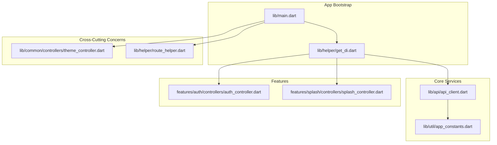
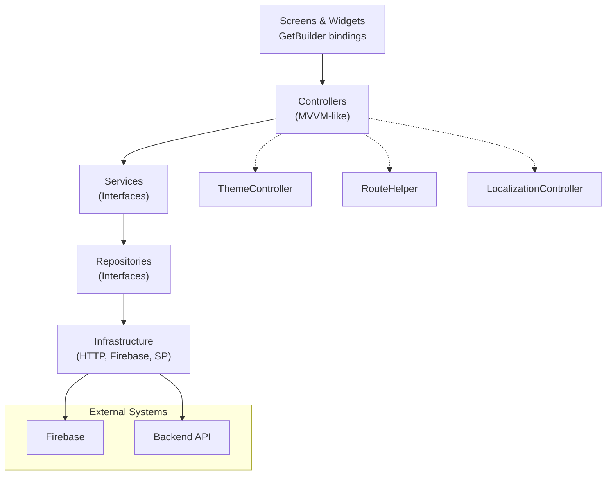
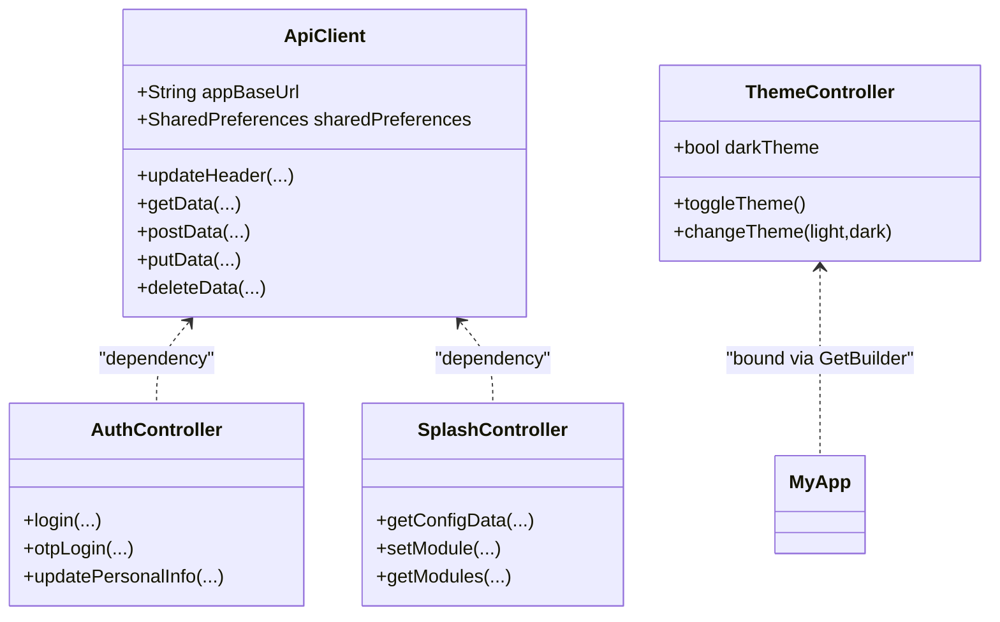
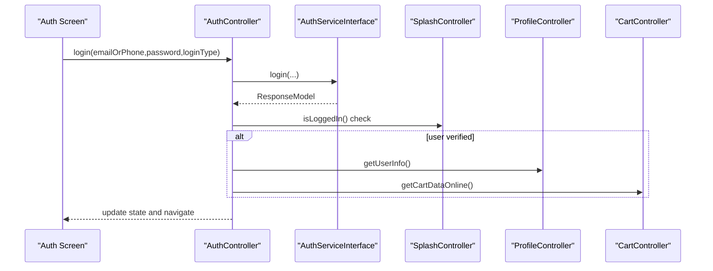
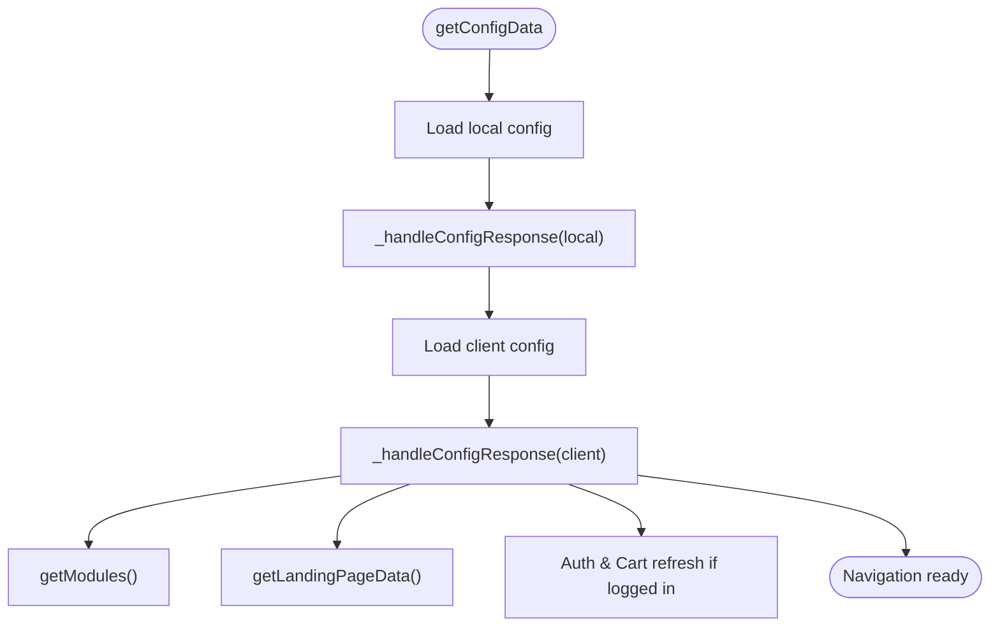
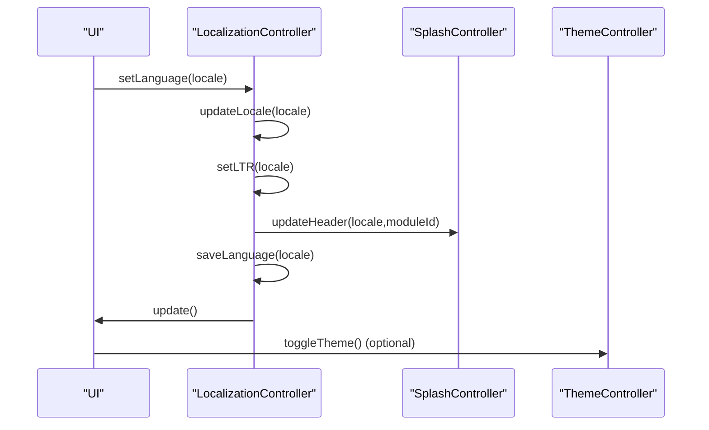
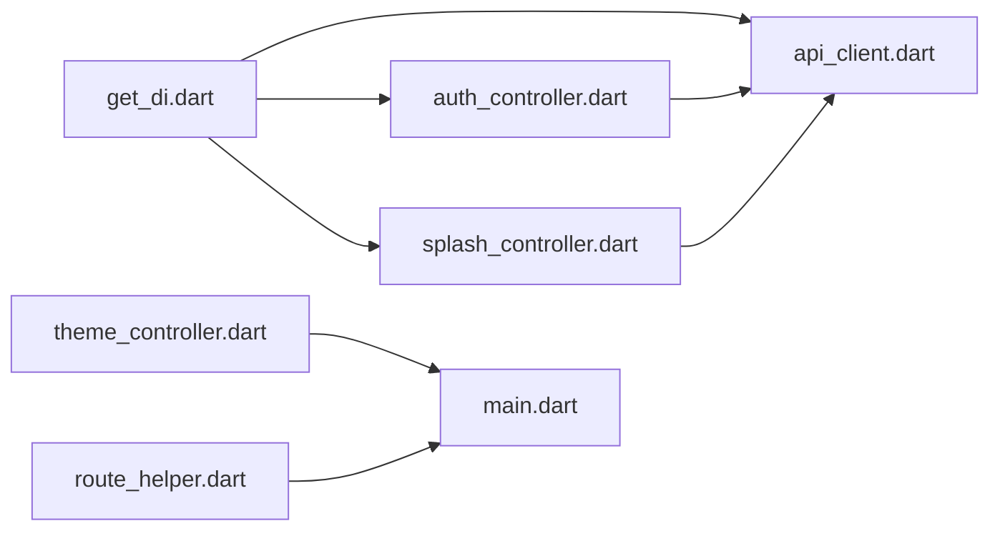
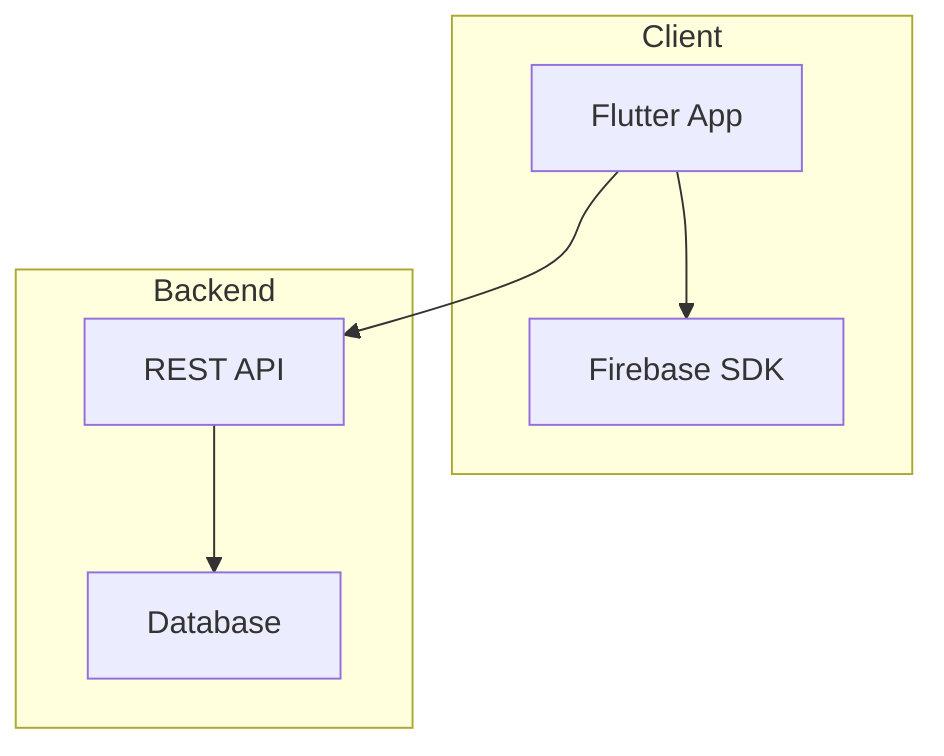

# Architecture Overview

<cite>
**Referenced Files in This Document**
- [lib/main.dart](file://lib/main.dart)
- [lib/helper/get_di.dart](file://lib/helper/get_di.dart)
- [lib/api/api_client.dart](file://lib/api/api_client.dart)
- [lib/util/app_constants.dart](file://lib/util/app_constants.dart)
- [lib/common/controllers/theme_controller.dart](file://lib/common/controllers/theme_controller.dart)
- [lib/features/auth/controllers/auth_controller.dart](file://lib/features/auth/controllers/auth_controller.dart)
- [lib/features/splash/controllers/splash_controller.dart](file://lib/features/splash/controllers/splash_controller.dart)
- [lib/helper/route_helper.dart](file://lib/helper/route_helper.dart)
- [lib/theme/light_theme.dart](file://lib/theme/light_theme.dart)
- [lib/theme/dark_theme.dart](file://lib/theme/dark_theme.dart)
- [pubspec.yaml](file://pubspec.yaml)
</cite>

## Table of Contents
1. [Introduction](#introduction)
2. [Project Structure](#project-structure)
3. [Core Components](#core-components)
4. [Architecture Overview](#architecture-overview)
5. [Detailed Component Analysis](#detailed-component-analysis)
6. [Dependency Analysis](#dependency-analysis)
7. [Performance Considerations](#performance-considerations)
8. [Troubleshooting Guide](#troubleshooting-guide)
9. [Conclusion](#conclusion)
10. [Appendices](#appendices)

## Introduction
This document presents the architecture overview of the Waddi Multi-Vendor Marketplace, a Flutter-based application. It focuses on the high-level design patterns (MVVM-inspired controllers, layered architecture, and modular feature organization), the dependency injection system powered by GetX, component interactions, and data flow. It also covers technology stack choices, architectural trade-offs, system boundaries, infrastructure requirements, scalability considerations, deployment topology, cross-cutting concerns (state management, routing, internationalization, theming), and the modular feature organization.

## Project Structure
The application follows a feature-centric modular structure under lib/, with clear separation of concerns:
- lib/main.dart: Application bootstrap, Firebase initialization, DI container setup, global notifications, and theme/localization wiring.
- lib/helper/get_di.dart: Central dependency injection registry using GetX lazy loading for repositories, services, and controllers.
- lib/api/api_client.dart: HTTP client abstraction encapsulating base URL, headers, timeouts, and response handling.
- lib/util/app_constants.dart: Constants for endpoints, shared preferences keys, modules, and UI-related values.
- lib/common/controllers/theme_controller.dart: Global theme state management.
- lib/features/*/controllers/*_controller.dart: Feature-specific controllers implementing business logic and coordinating services.
- lib/helper/route_helper.dart: Centralized routing definitions and navigation helpers.
- lib/theme/light_theme.dart and lib/theme/dark_theme.dart: Theme definitions for light and dark modes.

**Diagram sources**
- [lib/main.dart:35-103](file://lib/main.dart#L35-L103)
- [lib/helper/get_di.dart:220-756](file://lib/helper/get_di.dart#L220-L756)
- [lib/api/api_client.dart:18-232](file://lib/api/api_client.dart#L18-L232)
- [lib/util/app_constants.dart:6-424](file://lib/util/app_constants.dart#L6-L424)
- [lib/common/controllers/theme_controller.dart:6-48](file://lib/common/controllers/theme_controller.dart#L6-L48)
- [lib/helper/route_helper.dart:93-800](file://lib/helper/route_helper.dart#L93-L800)
- [lib/features/auth/controllers/auth_controller.dart:19-414](file://lib/features/auth/controllers/auth_controller.dart#L19-L414)
- [lib/features/splash/controllers/splash_controller.dart:32-516](file://lib/features/splash/controllers/splash_controller.dart#L32-L516)

**Section sources**
- [lib/main.dart:35-103](file://lib/main.dart#L35-L103)
- [lib/helper/get_di.dart:220-756](file://lib/helper/get_di.dart#L220-L756)
- [lib/api/api_client.dart:18-232](file://lib/api/api_client.dart#L18-L232)
- [lib/util/app_constants.dart:6-424](file://lib/util/app_constants.dart#L6-L424)
- [lib/common/controllers/theme_controller.dart:6-48](file://lib/common/controllers/theme_controller.dart#L6-L48)
- [lib/helper/route_helper.dart:93-800](file://lib/helper/route_helper.dart#L93-L800)
- [lib/features/auth/controllers/auth_controller.dart:19-414](file://lib/features/auth/controllers/auth_controller.dart#L19-L414)
- [lib/features/splash/controllers/splash_controller.dart:32-516](file://lib/features/splash/controllers/splash_controller.dart#L32-L516)

## Core Components
- Dependency Injection Container: Centralized via GetX lazyPut in get_di.dart, registering repositories, services, and controllers. This enables loose coupling and testability.
- API Client: Encapsulates HTTP operations, headers, timeouts, and error handling, with shared preference-backed token and localization propagation.
- Controllers: Feature controllers orchestrate business logic, coordinate services, manage state updates, and trigger navigation.
- Theme Controller: Manages global theme state and persists user preference.
- Routing: Centralized route definitions and helpers for navigation, including parameterized routes and middleware.
- Internationalization: Locale management and header synchronization for localization.

**Section sources**
- [lib/helper/get_di.dart:220-756](file://lib/helper/get_di.dart#L220-L756)
- [lib/api/api_client.dart:18-232](file://lib/api/api_client.dart#L18-L232)
- [lib/common/controllers/theme_controller.dart:6-48](file://lib/common/controllers/theme_controller.dart#L6-L48)
- [lib/helper/route_helper.dart:93-800](file://lib/helper/route_helper.dart#L93-L800)
- [lib/features/auth/controllers/auth_controller.dart:19-414](file://lib/features/auth/controllers/auth_controller.dart#L19-L414)
- [lib/features/splash/controllers/splash_controller.dart:32-516](file://lib/features/splash/controllers/splash_controller.dart#L32-L516)

## Architecture Overview
The system follows a layered architecture with MVVM-inspired controllers:
- Presentation Layer: Screens and widgets driven by controllers and bound to UI via GetBuilder.
- Domain Layer: Interfaces for repositories and services define contracts for feature logic.
- Infrastructure Layer: HTTP client, Firebase integration, and shared preferences.
- Cross-Cutting Concerns: Theme, routing, internationalization, and notifications.

**Diagram sources**
- [lib/helper/get_di.dart:220-756](file://lib/helper/get_di.dart#L220-L756)
- [lib/api/api_client.dart:18-232](file://lib/api/api_client.dart#L18-L232)
- [lib/common/controllers/theme_controller.dart:6-48](file://lib/common/controllers/theme_controller.dart#L6-L48)
- [lib/helper/route_helper.dart:93-800](file://lib/helper/route_helper.dart#L93-L800)

## Detailed Component Analysis

### Dependency Injection System (GetX)
The DI container initializes shared preferences, constructs ApiClient, registers repository interfaces, services, and controllers using Get.lazyPut. This ensures singletons and lazy instantiation, reducing startup overhead and enabling easy mocking for tests.

**Diagram sources**
- [lib/api/api_client.dart:18-232](file://lib/api/api_client.dart#L18-L232)
- [lib/common/controllers/theme_controller.dart:6-48](file://lib/common/controllers/theme_controller.dart#L6-L48)
- [lib/features/auth/controllers/auth_controller.dart:19-414](file://lib/features/auth/controllers/auth_controller.dart#L19-L414)
- [lib/features/splash/controllers/splash_controller.dart:32-516](file://lib/features/splash/controllers/splash_controller.dart#L32-L516)

**Section sources**
- [lib/helper/get_di.dart:220-756](file://lib/helper/get_di.dart#L220-L756)

### Authentication Flow (Controller Interaction)
The authentication flow demonstrates controller-to-service-to-repository-to-infrastructure interactions and state updates.

**Diagram sources**
- [lib/features/auth/controllers/auth_controller.dart:62-82](file://lib/features/auth/controllers/auth_controller.dart#L62-L82)
- [lib/features/splash/controllers/splash_controller.dart:200-206](file://lib/features/splash/controllers/splash_controller.dart#L200-L206)

**Section sources**
- [lib/features/auth/controllers/auth_controller.dart:62-82](file://lib/features/auth/controllers/auth_controller.dart#L62-L82)
- [lib/features/splash/controllers/splash_controller.dart:200-206](file://lib/features/splash/controllers/splash_controller.dart#L200-L206)

### Splash Configuration Loading (Multi-source and Caching)
The splash controller coordinates local and client-side configuration retrieval, handles caching, and orchestrates feature data refreshes upon successful configuration load.

**Diagram sources**
- [lib/features/splash/controllers/splash_controller.dart:115-156](file://lib/features/splash/controllers/splash_controller.dart#L115-L156)
- [lib/features/splash/controllers/splash_controller.dart:158-197](file://lib/features/splash/controllers/splash_controller.dart#L158-L197)
- [lib/features/splash/controllers/splash_controller.dart:331-351](file://lib/features/splash/controllers/splash_controller.dart#L331-L351)
- [lib/features/splash/controllers/splash_controller.dart:215-231](file://lib/features/splash/controllers/splash_controller.dart#L215-L231)

**Section sources**
- [lib/features/splash/controllers/splash_controller.dart:115-156](file://lib/features/splash/controllers/splash_controller.dart#L115-L156)
- [lib/features/splash/controllers/splash_controller.dart:158-197](file://lib/features/splash/controllers/splash_controller.dart#L158-L197)
- [lib/features/splash/controllers/splash_controller.dart:331-351](file://lib/features/splash/controllers/splash_controller.dart#L331-L351)
- [lib/features/splash/controllers/splash_controller.dart:215-231](file://lib/features/splash/controllers/splash_controller.dart#L215-L231)

### Theming and Internationalization
- ThemeController manages dark/light mode and persists user preference. The app switches themes via GetBuilder in MyApp.
- LocalizationController sets locale, updates headers, and triggers data reloads when language changes.

**Diagram sources**
- [lib/features/language/controllers/language_controller.dart:29-50](file://lib/features/language/controllers/language_controller.dart#L29-L50)
- [lib/features/splash/controllers/splash_controller.dart:170-170](file://lib/features/splash/controllers/splash_controller.dart#L170-L170)
- [lib/common/controllers/theme_controller.dart:29-33](file://lib/common/controllers/theme_controller.dart#L29-L33)

**Section sources**
- [lib/features/language/controllers/language_controller.dart:29-50](file://lib/features/language/controllers/language_controller.dart#L29-L50)
- [lib/common/controllers/theme_controller.dart:29-33](file://lib/common/controllers/theme_controller.dart#L29-L33)

## Dependency Analysis
The dependency graph highlights the central role of the DI container and the API client, with controllers depending on services and repositories.

**Diagram sources**
- [lib/helper/get_di.dart:220-756](file://lib/helper/get_di.dart#L220-L756)
- [lib/api/api_client.dart:18-232](file://lib/api/api_client.dart#L18-L232)
- [lib/features/auth/controllers/auth_controller.dart:19-414](file://lib/features/auth/controllers/auth_controller.dart#L19-L414)
- [lib/features/splash/controllers/splash_controller.dart:32-516](file://lib/features/splash/controllers/splash_controller.dart#L32-L516)
- [lib/common/controllers/theme_controller.dart:6-48](file://lib/common/controllers/theme_controller.dart#L6-L48)
- [lib/helper/route_helper.dart:93-800](file://lib/helper/route_helper.dart#L93-L800)
- [lib/main.dart:105-239](file://lib/main.dart#L105-L239)

**Section sources**
- [lib/helper/get_di.dart:220-756](file://lib/helper/get_di.dart#L220-L756)
- [lib/api/api_client.dart:18-232](file://lib/api/api_client.dart#L18-L232)
- [lib/features/auth/controllers/auth_controller.dart:19-414](file://lib/features/auth/controllers/auth_controller.dart#L19-L414)
- [lib/features/splash/controllers/splash_controller.dart:32-516](file://lib/features/splash/controllers/splash_controller.dart#L32-L516)
- [lib/common/controllers/theme_controller.dart:6-48](file://lib/common/controllers/theme_controller.dart#L6-L48)
- [lib/helper/route_helper.dart:93-800](file://lib/helper/route_helper.dart#L93-L800)
- [lib/main.dart:105-239](file://lib/main.dart#L105-L239)

## Performance Considerations
- Lazy Initialization: Get.lazyPut defers object creation until first use, reducing cold start costs.
- Header Caching: ApiClient caches headers and token to avoid repeated computation.
- Conditional Data Fetching: SplashController loads local data first, then overlays client data asynchronously.
- UI Updates: GetBuilder scopes rebuilds to specific controllers, minimizing unnecessary widget rebuilds.

[No sources needed since this section provides general guidance]

## Troubleshooting Guide
- Network Failures: ApiClient wraps HTTP calls and returns standardized error responses; consumers should rely on Response handling and ApiChecker.
- Authentication State: AuthController exposes isLoggedIn and related helpers; verify token persistence and shared preferences keys.
- Navigation Issues: RouteHelper centralizes route construction; ensure parameters are properly encoded/decoded.
- Theme/Localization: ThemeController persists theme; LocalizationController updates headers and locale; verify shared preference keys.

**Section sources**
- [lib/api/api_client.dart:198-231](file://lib/api/api_client.dart#L198-L231)
- [lib/features/auth/controllers/auth_controller.dart:210-212](file://lib/features/auth/controllers/auth_controller.dart#L210-L212)
- [lib/helper/route_helper.dart:173-182](file://lib/helper/route_helper.dart#L173-L182)
- [lib/common/controllers/theme_controller.dart:31-32](file://lib/common/controllers/theme_controller.dart#L31-L32)
- [lib/features/language/controllers/language_controller.dart:30-34](file://lib/features/language/controllers/language_controller.dart#L30-L34)

## Conclusion
Waddi employs a clean, modular architecture with strong separation of concerns. GetX powers dependency injection, routing, and reactive state management. The MVVM-inspired controllers coordinate services and repositories, while the API client and shared preferences provide infrastructure abstractions. Cross-cutting concerns like theming, routing, and internationalization are centralized, enabling maintainability and scalability. The system’s layered design and modular feature organization support future enhancements and multi-module deployments.

[No sources needed since this section summarizes without analyzing specific files]

## Appendices

### Technology Stack Decisions and Trade-offs
- Flutter + Dart: Cross-platform mobile/web with native performance characteristics.
- GetX: Lightweight dependency injection, routing, and state management replacing heavier frameworks.
- Firebase: Authentication, push notifications, crash reporting, and messaging.
- HTTP Client: Custom wrapper around http package with shared preferences integration for tokens and localization.
- Shared Preferences: Persistent storage for tokens, language, theme, and user preferences.

**Section sources**
- [pubspec.yaml:9-86](file://pubspec.yaml#L9-L86)
- [lib/main.dart:22-27](file://lib/main.dart#L22-L27)
- [lib/api/api_client.dart:18-66](file://lib/api/api_client.dart#L18-L66)

### System Boundaries and Deployment Topology
- Frontend: Flutter app (mobile and web) consuming a RESTful backend via HTTPS.
- Backend: Hosted endpoints defined in AppConstants; API client encapsulates base URL and endpoints.
- Notifications: Firebase Cloud Messaging integrated for push notifications; background handlers configured during app initialization.
- External APIs: Google Maps, authentication providers (Google, Facebook, Apple), and payment integrations via web views or SDKs.

**Diagram sources**
- [lib/main.dart:54-91](file://lib/main.dart#L54-L91)
- [lib/util/app_constants.dart:18-177](file://lib/util/app_constants.dart#L18-L177)

### Scalability Considerations
- Modular Features: Feature-based organization allows independent development and testing.
- DI Container: Centralized registration supports swapping implementations and mocking.
- Endpoint Abstraction: AppConstants consolidates endpoint definitions for easier migration.
- Caching and Offline Behavior: Shared preferences and local-first loading reduce server load.

**Section sources**
- [lib/util/app_constants.dart:18-424](file://lib/util/app_constants.dart#L18-L424)
- [lib/helper/get_di.dart:220-756](file://lib/helper/get_di.dart#L220-L756)
- [lib/features/splash/controllers/splash_controller.dart:115-156](file://lib/features/splash/controllers/splash_controller.dart#L115-L156)