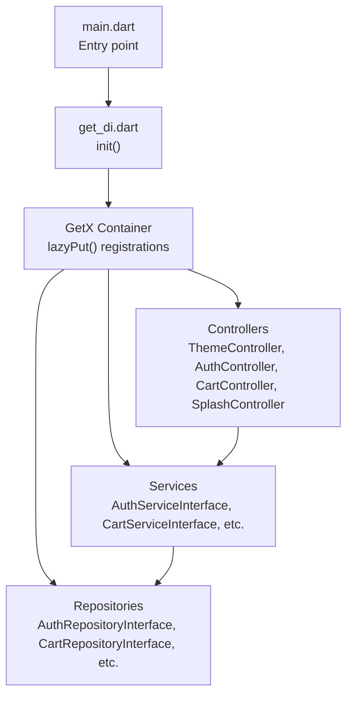
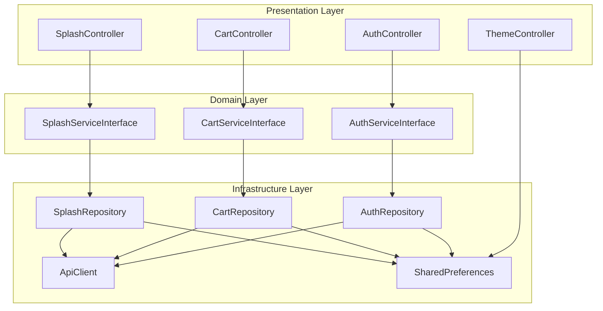
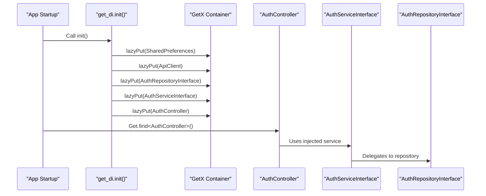
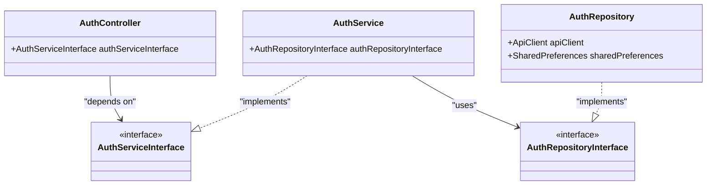
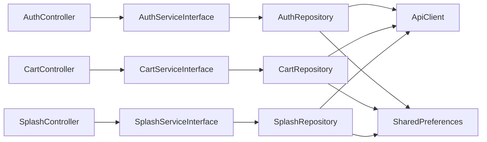

# Dependency Injection System

<cite>
**Referenced Files in This Document**
- [get_di.dart](file://lib/helper/get_di.dart)
- [main.dart](file://lib/main.dart)
- [theme_controller.dart](file://lib/common/controllers/theme_controller.dart)
- [auth_controller.dart](file://lib/features/auth/controllers/auth_controller.dart)
- [cart_controller.dart](file://lib/features/cart/controllers/cart_controller.dart)
- [splash_controller.dart](file://lib/features/splash/controllers/splash_controller.dart)
- [auth_service_interface.dart](file://lib/features/auth/domain/services/auth_service_interface.dart)
- [auth_service.dart](file://lib/features/auth/domain/services/auth_service.dart)
- [auth_repository_interface.dart](file://lib/features/auth/domain/reposotories/auth_repository_interface.dart)
- [auth_repository.dart](file://lib/features/auth/domain/reposotories/auth_repository.dart)
</cite>

## Table of Contents
1. [Introduction](#introduction)
2. [Project Structure](#project-structure)
3. [Core Components](#core-components)
4. [Architecture Overview](#architecture-overview)
5. [Detailed Component Analysis](#detailed-component-analysis)
6. [Dependency Analysis](#dependency-analysis)
7. [Performance Considerations](#performance-considerations)
8. [Troubleshooting Guide](#troubleshooting-guide)
9. [Conclusion](#conclusion)

## Introduction
This document explains the GetX-based dependency injection system used in the Waddi Multi-Vendor Marketplace. It covers the centralized service registration pattern, lazy loading mechanisms, and how controllers, services, and repositories are registered and resolved. It also details the initialization process in get_di.dart, including the factory pattern implementation for creating instances, and the service locator pattern used throughout the application via Get.find(). Practical examples demonstrate service registration, controller instantiation, and dependency resolution. Benefits for testing, modularity, and maintainability are highlighted, along with guidelines for adding new services and controllers.

## Project Structure
The dependency injection system is orchestrated by a single initialization file that registers all application dependencies. The main entry point calls into this initializer to set up the container before building the UI.

**Diagram sources**
- [main.dart:35-103](file://lib/main.dart#L35-L103)
- [get_di.dart:220-756](file://lib/helper/get_di.dart#L220-L756)

**Section sources**
- [main.dart:35-103](file://lib/main.dart#L35-L103)
- [get_di.dart:220-756](file://lib/helper/get_di.dart#L220-L756)

## Core Components
- Centralized Initialization: The init() function in get_di.dart performs all registrations using Get.lazyPut(), ensuring lazy creation and singleton-like behavior.
- Factory Pattern: Instances are created via factory closures passed to Get.lazyPut(), enabling controlled construction and dependency passing.
- Service Locator: Components resolve dependencies using Get.find<T>(), implementing the service locator pattern.
- Layered Architecture: Controllers depend on Services, Services depend on Repositories, and Repositories depend on shared infrastructure (e.g., ApiClient, SharedPreferences).

Key registration categories:
- Shared Infrastructure: ApiClient and SharedPreferences are registered early to serve as foundational dependencies.
- Repository Interfaces and Implementations: Each domain has an interface and an implementation registered, with the interface bound to the implementation.
- Service Interfaces and Implementations: Services wrap repository calls and expose domain-facing APIs.
- Controllers: Controllers receive their dependencies via constructor injection, resolving them lazily from the container.

**Section sources**
- [get_di.dart:220-756](file://lib/helper/get_di.dart#L220-L756)

## Architecture Overview
The system follows a layered architecture with inversion of control through dependency injection. The controller layer orchestrates business actions, delegates to services, and uses repositories for persistence/network access. The container resolves dependencies lazily, minimizing startup overhead and enabling modular composition.

**Diagram sources**
- [get_di.dart:220-756](file://lib/helper/get_di.dart#L220-L756)
- [auth_controller.dart:19-414](file://lib/features/auth/controllers/auth_controller.dart#L19-L414)
- [cart_controller.dart:16-444](file://lib/features/cart/controllers/cart_controller.dart#L16-L444)
- [splash_controller.dart:32-516](file://lib/features/splash/controllers/splash_controller.dart#L32-L516)

## Detailed Component Analysis

### Centralized Initialization and Lazy Loading
- Early Infrastructure Registration: SharedPreferences and ApiClient are registered first so subsequent registrations can resolve them via Get.find().
- Repository Registration: Each domain’s repository interface is bound to its implementation, using Get.lazyPut to defer instantiation until first use.
- Service Registration: Services are constructed with their repository dependencies resolved from the container.
- Controller Registration: Controllers are instantiated with their service dependencies resolved from the container.

Benefits:
- Lazy instantiation reduces startup cost.
- Single source of truth for all dependencies.
- Easy to swap implementations by changing a single binding.

Practical Example Paths:
- [get_di.dart:220-230](file://lib/helper/get_di.dart#L220-L230) — Register SharedPreferences and ApiClient
- [get_di.dart:231-242](file://lib/helper/get_di.dart#L231-L242) — Register AuthRepositoryInterface
- [get_di.dart:462-465](file://lib/helper/get_di.dart#L462-L465) — Register AuthServiceInterface
- [get_di.dart:670-681](file://lib/helper/get_di.dart#L670-L681) — Register ThemeController and SplashController

**Section sources**
- [get_di.dart:220-756](file://lib/helper/get_di.dart#L220-L756)

### Service Locator Pattern in Action
Components access dependencies through Get.find<T>() without constructing them directly. This enables loose coupling and simplifies testing.

Examples:
- [main.dart:124-141](file://lib/main.dart#L124-L141) — Accessing SplashController and AuthController during app bootstrap
- [auth_controller.dart:131-133](file://lib/features/auth/controllers/auth_controller.dart#L131-L133) — Resolving SplashController via Get.find()
- [cart_controller.dart:389-390](file://lib/features/cart/controllers/cart_controller.dart#L389-L390) — Resolving SplashController via Get.find()

Sequence of Resolution:

**Diagram sources**
- [get_di.dart:220-756](file://lib/helper/get_di.dart#L220-L756)
- [auth_controller.dart:19-414](file://lib/features/auth/controllers/auth_controller.dart#L19-L414)

**Section sources**
- [main.dart:124-141](file://lib/main.dart#L124-L141)
- [auth_controller.dart:131-133](file://lib/features/auth/controllers/auth_controller.dart#L131-L133)
- [cart_controller.dart:389-390](file://lib/features/cart/controllers/cart_controller.dart#L389-L390)

### Layered Architecture: Controllers, Services, Repositories
- Controllers orchestrate UI logic and delegate to services.
- Services encapsulate business rules and coordinate repositories.
- Repositories handle data access and network calls.

Example Path:
- [auth_controller.dart:19-414](file://lib/features/auth/controllers/auth_controller.dart#L19-L414) — Controller depends on AuthServiceInterface
- [auth_service_interface.dart:5-35](file://lib/features/auth/domain/services/auth_service_interface.dart#L5-L35) — Service interface defines domain operations
- [auth_service.dart:9-205](file://lib/features/auth/domain/services/auth_service.dart#L9-L205) — Service implementation delegates to repository
- [auth_repository_interface.dart:7-40](file://lib/features/auth/domain/reposotories/auth_repository_interface.dart#L7-L40) — Repository interface
- [auth_repository.dart:19-462](file://lib/features/auth/domain/reposotories/auth_repository.dart#L19-L462) — Repository implementation using ApiClient and SharedPreferences

**Diagram sources**
- [auth_controller.dart:19-414](file://lib/features/auth/controllers/auth_controller.dart#L19-L414)
- [auth_service_interface.dart:5-35](file://lib/features/auth/domain/services/auth_service_interface.dart#L5-L35)
- [auth_service.dart:9-205](file://lib/features/auth/domain/services/auth_service.dart#L9-L205)
- [auth_repository_interface.dart:7-40](file://lib/features/auth/domain/reposotories/auth_repository_interface.dart#L7-L40)
- [auth_repository.dart:19-462](file://lib/features/auth/domain/reposotories/auth_repository.dart#L19-L462)

**Section sources**
- [auth_controller.dart:19-414](file://lib/features/auth/controllers/auth_controller.dart#L19-L414)
- [auth_service_interface.dart:5-35](file://lib/features/auth/domain/services/auth_service_interface.dart#L5-L35)
- [auth_service.dart:9-205](file://lib/features/auth/domain/services/auth_service.dart#L9-L205)
- [auth_repository_interface.dart:7-40](file://lib/features/auth/domain/reposotories/auth_repository_interface.dart#L7-L40)
- [auth_repository.dart:19-462](file://lib/features/auth/domain/reposotories/auth_repository.dart#L19-L462)

### Practical Examples

- Service Registration Example
  - Register repository interface and implementation:
    - [get_di.dart:231-242](file://lib/helper/get_di.dart#L231-L242)
  - Register service interface and implementation:
    - [get_di.dart:462-465](file://lib/helper/get_di.dart#L462-L465)
  - Register controller with injected service:
    - [get_di.dart:681](file://lib/helper/get_di.dart#L681)

- Controller Instantiation Example
  - ThemeController registration:
    - [get_di.dart:670](file://lib/helper/get_di.dart#L670)
  - AuthController registration:
    - [get_di.dart:681](file://lib/helper/get_di.dart#L681)

- Dependency Resolution Example
  - Accessing controllers in main:
    - [main.dart:124-141](file://lib/main.dart#L124-L141)
  - Resolving dependencies inside controllers:
    - [auth_controller.dart:131-133](file://lib/features/auth/controllers/auth_controller.dart#L131-L133)
    - [cart_controller.dart:389-390](file://lib/features/cart/controllers/cart_controller.dart#L389-L390)

**Section sources**
- [get_di.dart:231-242](file://lib/helper/get_di.dart#L231-L242)
- [get_di.dart:462-465](file://lib/helper/get_di.dart#L462-L465)
- [get_di.dart:670](file://lib/helper/get_di.dart#L670)
- [get_di.dart:681](file://lib/helper/get_di.dart#L681)
- [main.dart:124-141](file://lib/main.dart#L124-L141)
- [auth_controller.dart:131-133](file://lib/features/auth/controllers/auth_controller.dart#L131-L133)
- [cart_controller.dart:389-390](file://lib/features/cart/controllers/cart_controller.dart#L389-L390)

## Dependency Analysis
- Coupling and Cohesion: Controllers depend on interfaces, not concrete implementations, improving cohesion and reducing coupling.
- Lazy Dependencies: Get.lazyPut defers creation until first use, balancing memory and performance.
- Circular Dependencies: None observed in the analyzed files; dependencies flow from controllers → services → repositories.
- External Dependencies: ApiClient and SharedPreferences are resolved from the container, ensuring consistent configuration.

**Diagram sources**
- [get_di.dart:220-756](file://lib/helper/get_di.dart#L220-L756)
- [auth_controller.dart:19-414](file://lib/features/auth/controllers/auth_controller.dart#L19-L414)
- [cart_controller.dart:16-444](file://lib/features/cart/controllers/cart_controller.dart#L16-L444)
- [splash_controller.dart:32-516](file://lib/features/splash/controllers/splash_controller.dart#L32-L516)

**Section sources**
- [get_di.dart:220-756](file://lib/helper/get_di.dart#L220-L756)
- [auth_controller.dart:19-414](file://lib/features/auth/controllers/auth_controller.dart#L19-L414)
- [cart_controller.dart:16-444](file://lib/features/cart/controllers/cart_controller.dart#L16-L444)
- [splash_controller.dart:32-516](file://lib/features/splash/controllers/splash_controller.dart#L32-L516)

## Performance Considerations
- Lazy Loading: Get.lazyPut ensures dependencies are created only when needed, reducing initial memory footprint.
- Singleton Behavior: Once resolved, dependencies remain in the container, avoiding repeated construction.
- Minimized Startup Work: Early registration of core services (ApiClient, SharedPreferences) allows downstream registrations to resolve them efficiently.

[No sources needed since this section provides general guidance]

## Troubleshooting Guide
Common issues and resolutions:
- Missing Registration: If Get.find<T>() throws, ensure T is registered via Get.lazyPut in init().
  - Verify repository/service/controller registration in get_di.dart.
- Incorrect Interface Binding: Ensure the interface is bound to the intended implementation.
- Circular Dependencies: Avoid injecting controllers into repositories; pass only primitives or DTOs.
- Testing Scenarios: Replace real implementations with mocks by registering mock instances before tests.

**Section sources**
- [get_di.dart:220-756](file://lib/helper/get_di.dart#L220-L756)

## Conclusion
The Waddi Multi-Vendor Marketplace leverages a robust GetX-based dependency injection system centered around a single initialization routine. Through lazy loading, factory-style registrations, and the service locator pattern, the system achieves high modularity, testability, and maintainability. Controllers, services, and repositories are cleanly separated, with dependencies resolved lazily and consistently. Following the outlined guidelines ensures smooth extension of the system with new services and controllers while preserving architectural integrity.