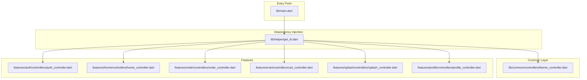
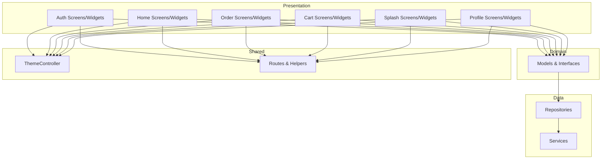
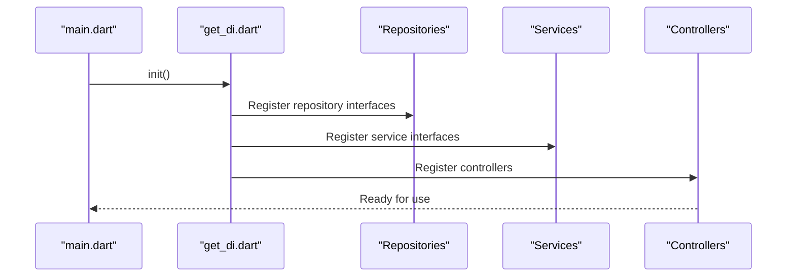
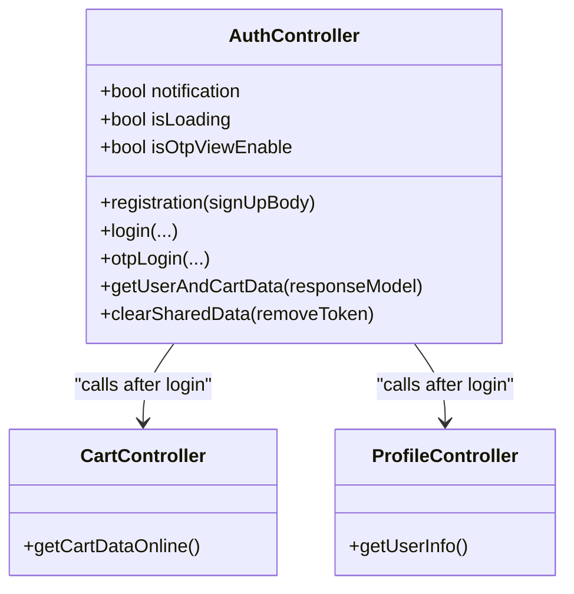
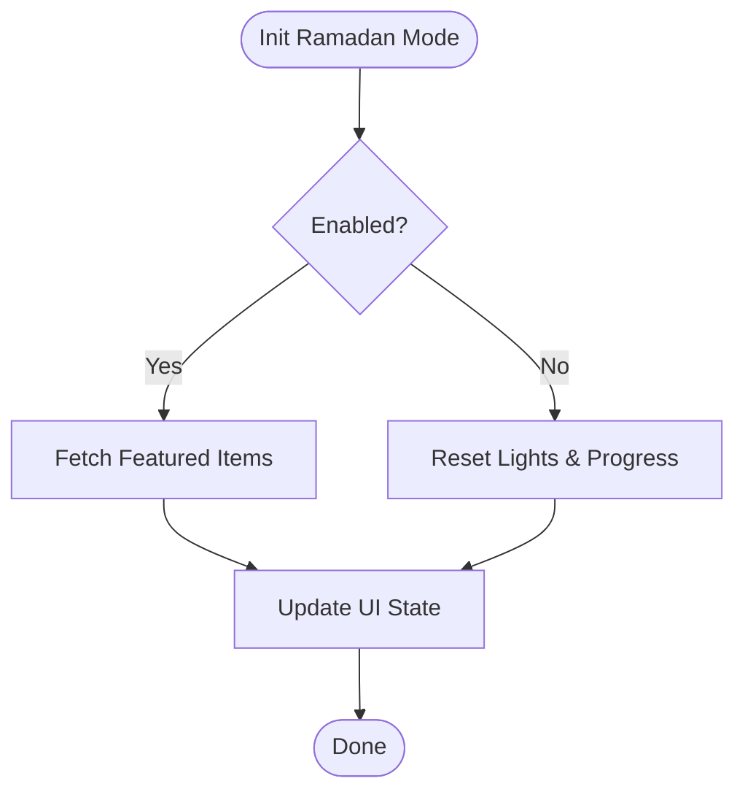
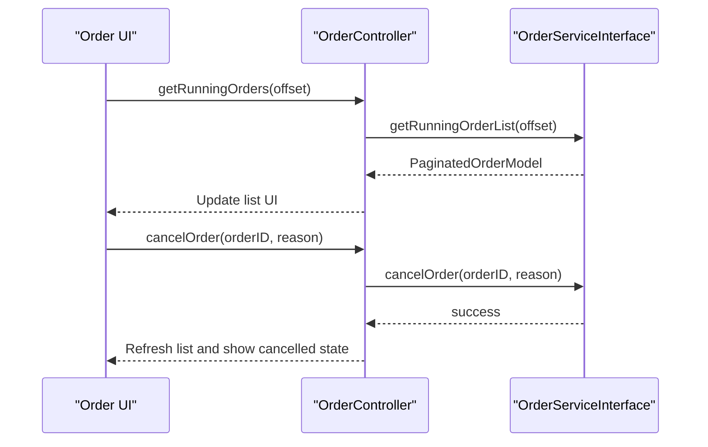
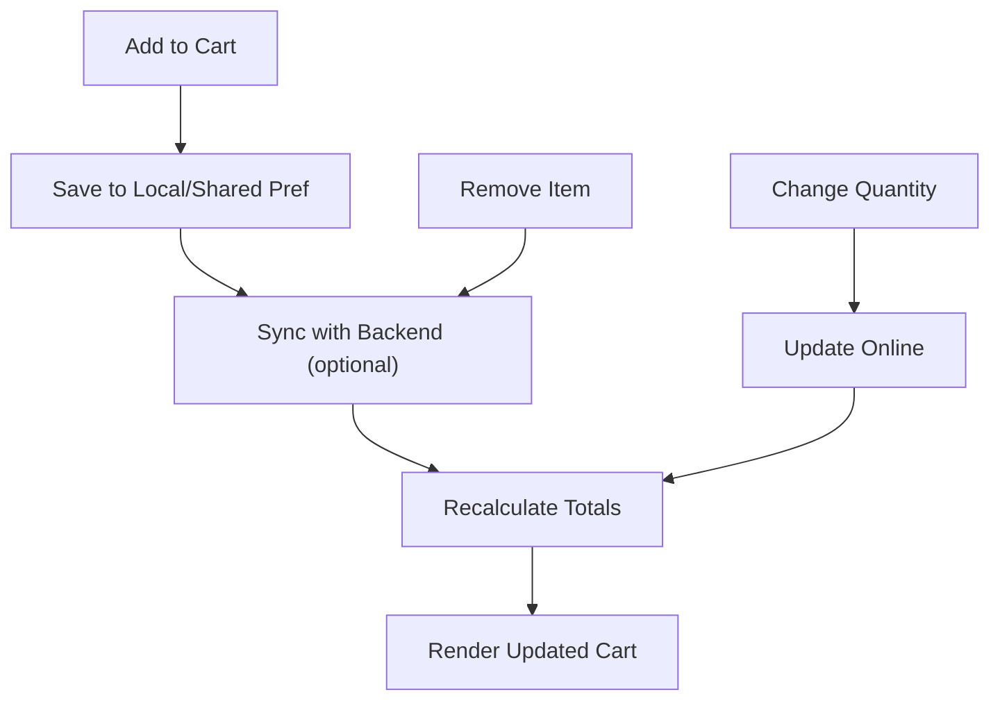
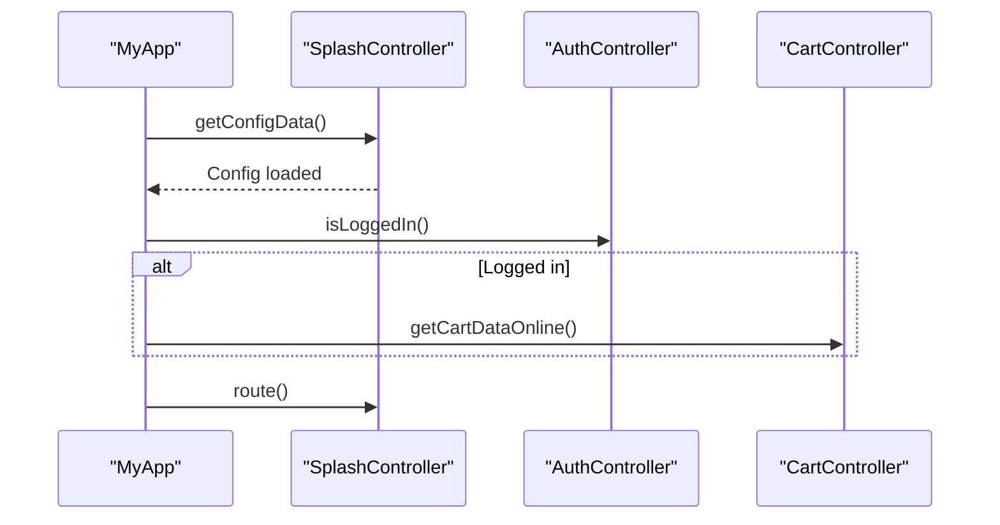
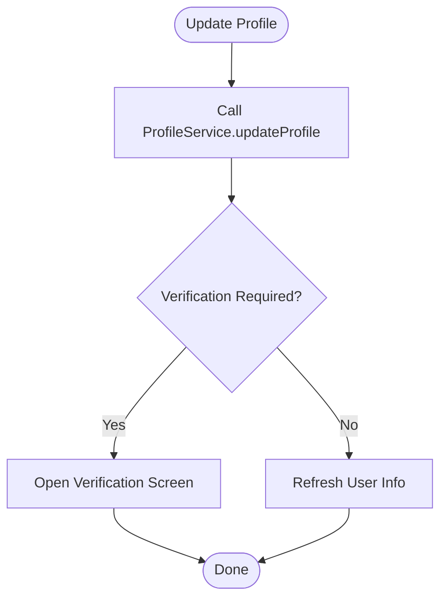
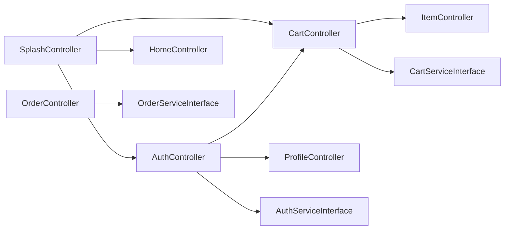

# Modular Architecture Design

<cite>
**Referenced Files in This Document**
- [main.dart](file://lib/main.dart)
- [get_di.dart](file://lib/helper/get_di.dart)
- [auth_controller.dart](file://lib/features/auth/controllers/auth_controller.dart)
- [home_controller.dart](file://lib/features/home/controllers/home_controller.dart)
- [order_controller.dart](file://lib/features/order/controllers/order_controller.dart)
- [splash_controller.dart](file://lib/features/splash/controllers/splash_controller.dart)
- [cart_controller.dart](file://lib/features/cart/controllers/cart_controller.dart)
- [profile_controller.dart](file://lib/features/profile/controllers/profile_controller.dart)
- [theme_controller.dart](file://lib/common/controllers/theme_controller.dart)
- [pubspec.yaml](file://pubspec.yaml)
</cite>

## Table of Contents
1. [Introduction](#introduction)
2. [Project Structure](#project-structure)
3. [Core Components](#core-components)
4. [Architecture Overview](#architecture-overview)
5. [Detailed Component Analysis](#detailed-component-analysis)
6. [Dependency Analysis](#dependency-analysis)
7. [Performance Considerations](#performance-considerations)
8. [Troubleshooting Guide](#troubleshooting-guide)
9. [Conclusion](#conclusion)

## Introduction
This document explains the modular architecture design of the Waddi Multi-Vendor Marketplace. The application follows a feature-based modular structure, where each major functionality—such as authentication, marketplace, orders, cart, and others—is encapsulated in dedicated modules under the features directory. The design leverages dependency injection via GetX’s lazy loading mechanism to initialize controllers, repositories, and services per module. Inter-module communication occurs through shared controllers and interfaces, enabling loose coupling and clear separation of concerns. This approach improves scalability, maintainability, and team collaboration by isolating features and enforcing boundaries.

## Project Structure
The project organizes code by feature rather than layer, promoting cohesion within modules and reducing cross-cutting concerns. Key directories and roles:
- lib/main.dart: Application entry point initializing Firebase, Crashlytics, DI container, and routing.
- lib/features: Feature-based modules (e.g., auth/, home/, order/, cart/) containing controllers, domain, screens, and widgets.
- lib/helper/get_di.dart: Centralized dependency injection registry wiring repositories, services, and controllers.
- lib/common: Shared utilities and base controllers (e.g., theme_controller.dart).
- lib/services, lib/interfaces, lib/local, lib/api, lib/util: Supporting infrastructure and utilities.

**Diagram sources**
- [main.dart:35-103](file://lib/main.dart#L35-L103)
- [get_di.dart:220-756](file://lib/helper/get_di.dart#L220-L756)
- [theme_controller.dart:6-48](file://lib/common/controllers/theme_controller.dart#L6-L48)

**Section sources**
- [main.dart:1-249](file://lib/main.dart#L1-L249)
- [get_di.dart:1-757](file://lib/helper/get_di.dart#L1-L757)
- [pubspec.yaml:1-122](file://pubspec.yaml#L1-L122)

## Core Components
- Dependency Injection Container: The centralized DI initializer registers repositories, services, and controllers for all features. It ensures singletons and lazy instantiation, minimizing startup overhead and enabling easy swapping of implementations.
- Feature Controllers: Each feature exposes a controller extending GetxController, encapsulating UI state and orchestrating service calls. Examples:
  - Authentication controller coordinates login, OTP, and social auth flows.
  - Home controller manages UI state and special events like Ramadan celebrations.
  - Order controller handles order lists, details, cancellations, and refunds.
  - Cart controller calculates totals, updates quantities, and synchronizes with backend.
  - Splash controller initializes configuration, modules, and routing decisions.
  - Profile controller manages user info and verification flows.
- Shared Utilities: Theme controller persists and toggles theme preferences, while other helpers provide localization, routes, and responsive behavior.

Benefits:
- Encapsulation: Each module encapsulates its own state, services, and UI logic.
- Loose Coupling: Controllers depend on interfaces and use GetX’s locator to resolve dependencies.
- Testability: Interfaces and DI enable mocking and isolated unit tests.
- Scalability: New features can be added by creating a new module and registering it in DI.

**Section sources**
- [get_di.dart:220-756](file://lib/helper/get_di.dart#L220-L756)
- [auth_controller.dart:19-414](file://lib/features/auth/controllers/auth_controller.dart#L19-L414)
- [home_controller.dart:8-186](file://lib/features/home/controllers/home_controller.dart#L8-L186)
- [order_controller.dart:9-298](file://lib/features/order/controllers/order_controller.dart#L9-L298)
- [cart_controller.dart:16-444](file://lib/features/cart/controllers/cart_controller.dart#L16-L444)
- [splash_controller.dart:32-516](file://lib/features/splash/controllers/splash_controller.dart#L32-L516)
- [profile_controller.dart:17-167](file://lib/features/profile/controllers/profile_controller.dart#L17-L167)
- [theme_controller.dart:6-48](file://lib/common/controllers/theme_controller.dart#L6-L48)

## Architecture Overview
The architecture employs a layered feature-based design with explicit boundaries:
- Presentation Layer: Screens and widgets within each feature module.
- Domain Layer: Models and interfaces defining contracts for repositories and services.
- Data Layer: Repositories implementing service contracts and interacting with APIs or local storage.
- Shared Layer: Common utilities, base controllers, and global state (e.g., theme).

Inter-module communication:
- Controllers communicate indirectly via shared controllers (e.g., AuthController triggers CartController actions).
- Global state is managed through GetX’s reactive controllers and shared preferences.
- Configuration-driven routing and module switching occur through SplashController.

**Diagram sources**
- [auth_controller.dart:19-414](file://lib/features/auth/controllers/auth_controller.dart#L19-L414)
- [home_controller.dart:8-186](file://lib/features/home/controllers/home_controller.dart#L8-L186)
- [order_controller.dart:9-298](file://lib/features/order/controllers/order_controller.dart#L9-L298)
- [cart_controller.dart:16-444](file://lib/features/cart/controllers/cart_controller.dart#L16-L444)
- [splash_controller.dart:32-516](file://lib/features/splash/controllers/splash_controller.dart#L32-L516)
- [profile_controller.dart:17-167](file://lib/features/profile/controllers/profile_controller.dart#L17-L167)
- [theme_controller.dart:6-48](file://lib/common/controllers/theme_controller.dart#L6-L48)

## Detailed Component Analysis

### Dependency Injection Initialization
The DI initializer sets up:
- Core dependencies: ApiClient and SharedPreferences.
- Repository interfaces bound to concrete implementations.
- Service interfaces bound to concrete services.
- Controllers registered with Get.lazyPut for lazy instantiation.

**Diagram sources**
- [main.dart:78-78](file://lib/main.dart#L78-L78)
- [get_di.dart:220-756](file://lib/helper/get_di.dart#L220-L756)

**Section sources**
- [main.dart:35-103](file://lib/main.dart#L35-L103)
- [get_di.dart:220-756](file://lib/helper/get_di.dart#L220-L756)

### Authentication Module
Responsibilities:
- User registration, login, OTP verification, and social login.
- Managing remember-me, notifications, and device tokens.
- Coordinating with CartController and ProfileController post-login.

**Diagram sources**
- [auth_controller.dart:19-414](file://lib/features/auth/controllers/auth_controller.dart#L19-L414)
- [cart_controller.dart:16-444](file://lib/features/cart/controllers/cart_controller.dart#L16-L444)
- [profile_controller.dart:17-167](file://lib/features/profile/controllers/profile_controller.dart#L17-L167)

**Section sources**
- [auth_controller.dart:51-185](file://lib/features/auth/controllers/auth_controller.dart#L51-L185)

### Home Module
Responsibilities:
- Managing UI visibility and animations (e.g., Ramadan decorations).
- Integrating with ItemController for featured items during special modes.

**Diagram sources**
- [home_controller.dart:43-100](file://lib/features/home/controllers/home_controller.dart#L43-L100)

**Section sources**
- [home_controller.dart:42-100](file://lib/features/home/controllers/home_controller.dart#L42-L100)

### Orders Module
Responsibilities:
- Fetching running and historical orders.
- Handling cancellations, refunds, and reordering.
- Tracking orders and payment redirects.

**Diagram sources**
- [order_controller.dart:135-173](file://lib/features/order/controllers/order_controller.dart#L135-L173)
- [order_controller.dart:247-262](file://lib/features/order/controllers/order_controller.dart#L247-L262)

**Section sources**
- [order_controller.dart:135-173](file://lib/features/order/controllers/order_controller.dart#L135-L173)
- [order_controller.dart:247-262](file://lib/features/order/controllers/order_controller.dart#L247-L262)

### Cart Module
Responsibilities:
- Calculating cart totals, managing quantities, and syncing with backend.
- Handling module switching and availability checks.

**Diagram sources**
- [cart_controller.dart:199-402](file://lib/features/cart/controllers/cart_controller.dart#L199-L402)

**Section sources**
- [cart_controller.dart:113-197](file://lib/features/cart/controllers/cart_controller.dart#L113-L197)
- [cart_controller.dart:384-402](file://lib/features/cart/controllers/cart_controller.dart#L384-L402)

### Splash Module
Responsibilities:
- Loading configuration and modules.
- Routing decisions based on module type and user state.
- Initializing shared data and coordinating feature preload actions.

**Diagram sources**
- [main.dart:122-142](file://lib/main.dart#L122-L142)
- [splash_controller.dart:115-197](file://lib/features/splash/controllers/splash_controller.dart#L115-L197)

**Section sources**
- [splash_controller.dart:115-197](file://lib/features/splash/controllers/splash_controller.dart#L115-L197)

### Profile Module
Responsibilities:
- Fetching and updating user information.
- Handling verification flows and account deletion.

**Diagram sources**
- [profile_controller.dart:43-111](file://lib/features/profile/controllers/profile_controller.dart#L43-L111)

**Section sources**
- [profile_controller.dart:43-111](file://lib/features/profile/controllers/profile_controller.dart#L43-L111)

## Dependency Analysis
The modular design minimizes coupling through:
- Interface-based contracts: Each feature defines interfaces for repositories and services.
- DI-driven composition: Controllers receive dependencies via constructor injection resolved by Get.lazyPut.
- Shared controllers for cross-feature coordination: For example, AuthController triggers CartController actions.

**Diagram sources**
- [auth_controller.dart:182-184](file://lib/features/auth/controllers/auth_controller.dart#L182-L184)
- [splash_controller.dart:277-314](file://lib/features/splash/controllers/splash_controller.dart#L277-L314)
- [cart_controller.dart:101-111](file://lib/features/cart/controllers/cart_controller.dart#L101-L111)
- [order_controller.dart:10-12](file://lib/features/order/controllers/order_controller.dart#L10-L12)
- [auth_controller.dart:20-23](file://lib/features/auth/controllers/auth_controller.dart#L20-L23)
- [cart_controller.dart:17-19](file://lib/features/cart/controllers/cart_controller.dart#L17-L19)

**Section sources**
- [auth_controller.dart:182-184](file://lib/features/auth/controllers/auth_controller.dart#L182-L184)
- [splash_controller.dart:277-314](file://lib/features/splash/controllers/splash_controller.dart#L277-L314)
- [cart_controller.dart:101-111](file://lib/features/cart/controllers/cart_controller.dart#L101-L111)
- [order_controller.dart:10-12](file://lib/features/order/controllers/order_controller.dart#L10-L12)
- [auth_controller.dart:20-23](file://lib/features/auth/controllers/auth_controller.dart#L20-L23)
- [cart_controller.dart:17-19](file://lib/features/cart/controllers/cart_controller.dart#L17-L19)

## Performance Considerations
- Lazy Loading: Get.lazyPut defers instantiation until first use, reducing startup time.
- Reactive Updates: GetxController.update() selectively rebuilds UI, minimizing unnecessary renders.
- Caching: Controllers cache frequently accessed data (e.g., order details cache) to avoid redundant network calls.
- Conditional Sync: Cart synchronization is gated by module presence to prevent unnecessary backend calls.

Recommendations:
- Keep controllers lean; move heavy computations to services.
- Use pagination and selective UI updates to manage large lists.
- Monitor DI initialization cost and group related modules for batch registration.

[No sources needed since this section provides general guidance]

## Troubleshooting Guide
Common issues and resolutions:
- Dependency Not Found: Ensure the controller is registered in get_di.dart and imported in main.dart.
- State Not Updating: Verify update() is called after mutating controller state.
- Cross-Feature Calls: Use Get.find() to resolve shared controllers; confirm they are initialized before use.
- Module Switching: Confirm SplashController.setModule() is invoked and dependent controllers are refreshed accordingly.

**Section sources**
- [get_di.dart:670-739](file://lib/helper/get_di.dart#L670-L739)
- [main.dart:78-78](file://lib/main.dart#L78-L78)

## Conclusion
The Waddi Multi-Vendor Marketplace employs a robust feature-based modular architecture that enhances scalability, maintainability, and team collaboration. By encapsulating functionality within modules, enforcing interface contracts, and leveraging DI for composition, the system achieves loose coupling and clear boundaries. The design supports seamless cross-feature interactions through shared controllers and services, while maintaining testability and performance through reactive state management and lazy initialization.