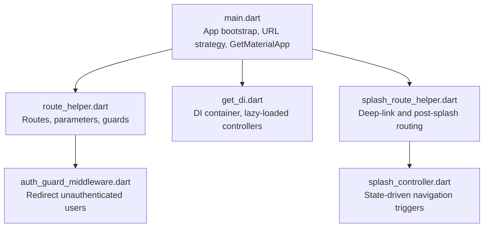
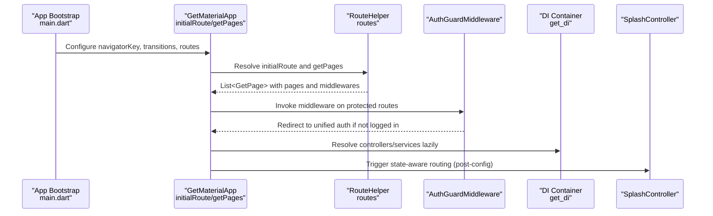
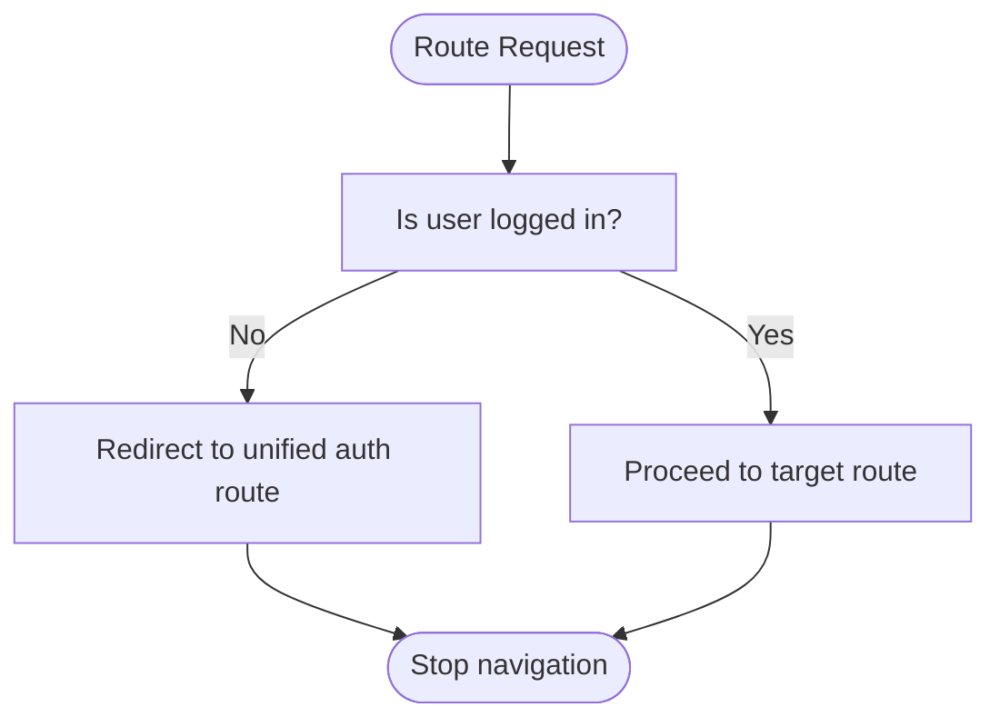
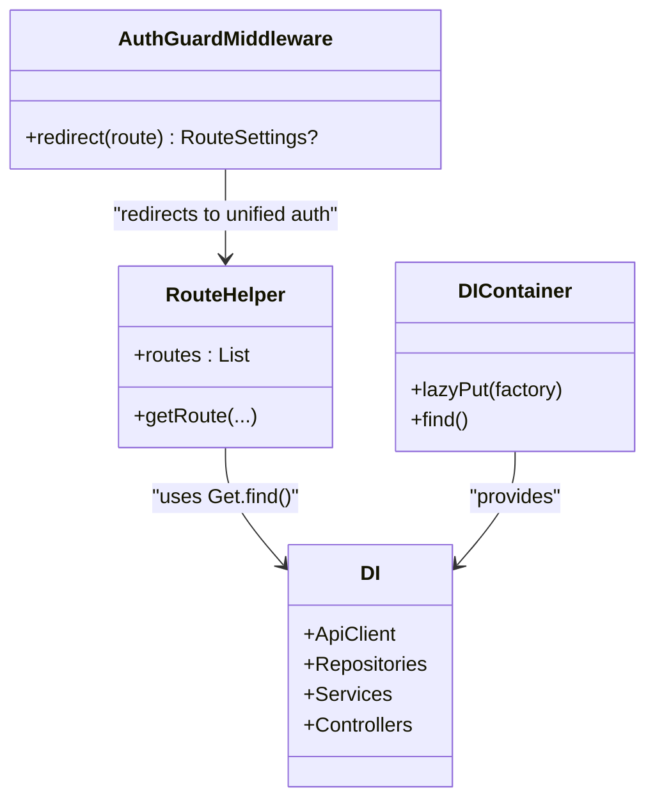
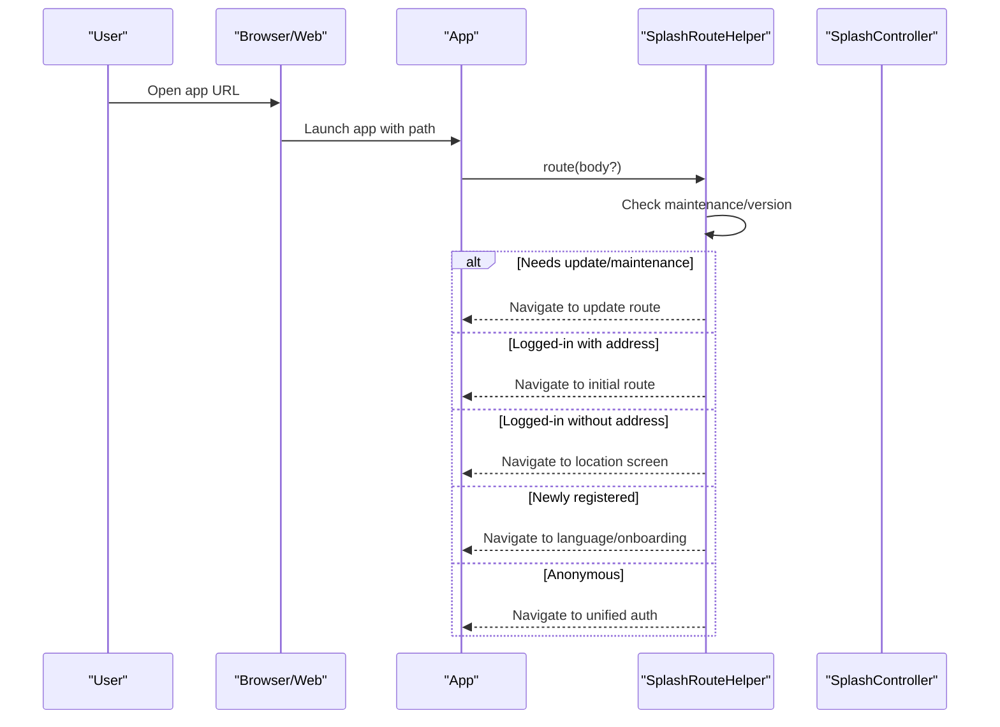
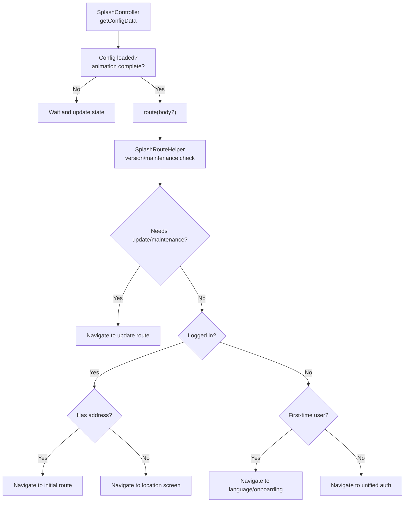
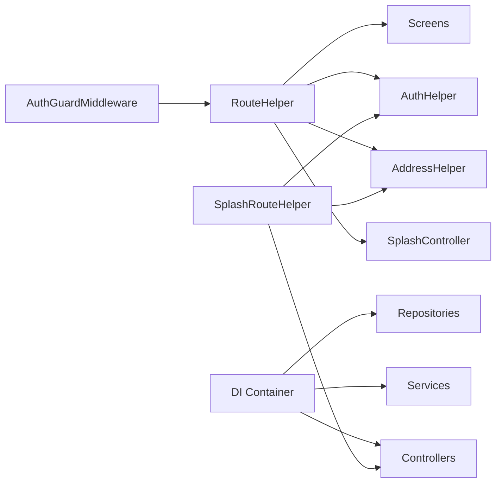

# Routing System

<cite>
**Referenced Files in This Document**
- [main.dart](file://lib/main.dart)
- [route_helper.dart](file://lib/helper/route_helper.dart)
- [get_di.dart](file://lib/helper/get_di.dart)
- [auth_guard_middleware.dart](file://lib/common/widgets/auth_guard_middleware.dart)
- [splash_route_helper.dart](file://lib/helper/splash_route_helper.dart)
- [splash_controller.dart](file://lib/features/splash/controllers/splash_controller.dart)
</cite>

## Table of Contents
1. [Introduction](#introduction)
2. [Project Structure](#project-structure)
3. [Core Components](#core-components)
4. [Architecture Overview](#architecture-overview)
5. [Detailed Component Analysis](#detailed-component-analysis)
6. [Dependency Analysis](#dependency-analysis)
7. [Performance Considerations](#performance-considerations)
8. [Troubleshooting Guide](#troubleshooting-guide)
9. [Conclusion](#conclusion)

## Introduction
This document explains the application’s routing system built on GetX. It covers route management strategy, navigation patterns, route definitions, parameter passing, route guards, deep linking via URL strategy, integration with dependency injection, and how navigation affects application state. It also provides guidelines for adding new routes, implementing transitions, and handling navigation errors.

## Project Structure
The routing system centers around:
- Application bootstrap and global configuration in the main entry point
- Centralized route definitions and navigation helpers
- Middleware for route guards
- Dependency injection wiring controllers used by routes
- State orchestration during navigation and deep-link handling

**Diagram sources**
- [main.dart:35-103](file://lib/main.dart#L35-L103)
- [route_helper.dart:93-1278](file://lib/helper/route_helper.dart#L93-L1278)
- [auth_guard_middleware.dart:8-19](file://lib/common/widgets/auth_guard_middleware.dart#L8-L19)
- [get_di.dart:220-757](file://lib/helper/get_di.dart#L220-L757)
- [splash_route_helper.dart:14-115](file://lib/helper/splash_route_helper.dart#L14-L115)
- [splash_controller.dart:32-108](file://lib/features/splash/controllers/splash_controller.dart#L32-L108)

**Section sources**
- [main.dart:35-103](file://lib/main.dart#L35-L103)
- [route_helper.dart:93-1278](file://lib/helper/route_helper.dart#L93-L1278)
- [get_di.dart:220-757](file://lib/helper/get_di.dart#L220-L757)
- [auth_guard_middleware.dart:8-19](file://lib/common/widgets/auth_guard_middleware.dart#L8-L19)
- [splash_route_helper.dart:14-115](file://lib/helper/splash_route_helper.dart#L14-L115)
- [splash_controller.dart:32-108](file://lib/features/splash/controllers/splash_controller.dart#L32-L108)

## Core Components
- RouteHelper: Defines named routes, constructs URLs with query parameters and base64-encoded payloads, and registers GetPage entries with optional middlewares.
- AuthGuardMiddleware: Enforces authentication by redirecting to a unified auth route when users are not logged in.
- DI Container (get_di): Lazily initializes repositories, services, and controllers, enabling controllers to be resolved during navigation.
- Navigation Entrypoints: Initial route selection, splash-to-app routing, and deep-link handling orchestrated by splash_route_helper and splash_controller.

Key responsibilities:
- Route definitions and parameter parsing
- Guard enforcement and redirection
- Controller instantiation via DI
- State-aware routing decisions

**Section sources**
- [route_helper.dart:93-1278](file://lib/helper/route_helper.dart#L93-L1278)
- [auth_guard_middleware.dart:8-19](file://lib/common/widgets/auth_guard_middleware.dart#L8-L19)
- [get_di.dart:220-757](file://lib/helper/get_di.dart#L220-L757)
- [splash_route_helper.dart:14-115](file://lib/helper/splash_route_helper.dart#L14-L115)
- [splash_controller.dart:32-108](file://lib/features/splash/controllers/splash_controller.dart#L32-L108)

## Architecture Overview
The routing architecture combines:
- Centralized route registry with GetPage entries
- Parameterized navigation via query strings and base64 payloads
- Middleware-based route guards
- DI-driven controller resolution
- State-driven navigation decisions

**Diagram sources**
- [main.dart:163-187](file://lib/main.dart#L163-L187)
- [route_helper.dart:468-1250](file://lib/helper/route_helper.dart#L468-L1250)
- [auth_guard_middleware.dart:8-19](file://lib/common/widgets/auth_guard_middleware.dart#L8-L19)
- [get_di.dart:220-757](file://lib/helper/get_di.dart#L220-L757)
- [splash_controller.dart:103-108](file://lib/features/splash/controllers/splash_controller.dart#L103-L108)

## Detailed Component Analysis

### RouteHelper: Route Management and Navigation Parameters
- Route constants define canonical paths for all screens.
- Helper methods construct URLs with query parameters and base64-encoded JSON payloads for complex objects.
- GetPage entries register pages with optional middlewares (e.g., AuthGuardMiddleware).
- getRoute wraps navigations to enforce maintenance mode, minimum app version checks, and location gating.

Navigation parameter passing patterns:
- Query parameters for primitive values (IDs, booleans, flags).
- Base64-encoded JSON payloads for complex models passed via query strings.
- Arguments passed via Get.arguments for direct navigation with pre-built models.

Example patterns:
- Constructing a route with query parameters and decoding them inside the page.
- Passing complex models by encoding them to base64 and decoding in the receiving page.
- Using Get.arguments to short-circuit route construction when a model is already available.

Integration with DI:
- Controllers are resolved lazily via Get.find() inside pages and helpers, ensuring controllers are available when needed.

**Section sources**
- [route_helper.dart:93-1278](file://lib/helper/route_helper.dart#L93-L1278)

### AuthGuardMiddleware: Route Guards
- Priority-based middleware that intercepts navigation to protected routes.
- Redirects unauthenticated users to the unified auth route.
- Applied to routes requiring authentication (e.g., profile, orders, cart).

**Diagram sources**
- [auth_guard_middleware.dart:8-19](file://lib/common/widgets/auth_guard_middleware.dart#L8-L19)
- [route_helper.dart:668-800](file://lib/helper/route_helper.dart#L668-L800)

**Section sources**
- [auth_guard_middleware.dart:8-19](file://lib/common/widgets/auth_guard_middleware.dart#L8-L19)
- [route_helper.dart:668-800](file://lib/helper/route_helper.dart#L668-L800)

### Dependency Injection and Controller Instantiation
- The DI container lazily initializes repositories, services, and controllers.
- Controllers are resolved via Get.find() inside pages and helpers, ensuring they are ready when navigation occurs.
- This pattern allows controllers to be injected into screens without manual constructor wiring.

**Diagram sources**
- [get_di.dart:220-757](file://lib/helper/get_di.dart#L220-L757)
- [route_helper.dart:93-1278](file://lib/helper/route_helper.dart#L93-L1278)
- [auth_guard_middleware.dart:8-19](file://lib/common/widgets/auth_guard_middleware.dart#L8-L19)

**Section sources**
- [get_di.dart:220-757](file://lib/helper/get_di.dart#L220-L757)
- [route_helper.dart:93-1278](file://lib/helper/route_helper.dart#L93-L1278)
- [auth_guard_middleware.dart:8-19](file://lib/common/widgets/auth_guard_middleware.dart#L8-L19)

### Programmatic Navigation Patterns
Common patterns observed:
- Using Get.toNamed(route) to navigate to named routes with constructed URLs.
- Using Get.back() to pop screens.
- Using Get.offNamed or Get.offAllNamed to replace or clear the route stack.
- Passing arguments via Get.arguments for direct model injection.

Examples of usage sites:
- Navigating to cart, profile, addresses, coupons, support, and other screens using RouteHelper helpers.
- Returning to previous steps in unified auth flow using Get.back().

**Section sources**
- [route_helper.dart:211-661](file://lib/helper/route_helper.dart#L211-L661)
- [splash_route_helper.dart:14-115](file://lib/helper/splash_route_helper.dart#L14-L115)

### Deep Linking Implementation
- Path URL strategy is enabled globally, allowing clean URLs without hash fragments.
- Initial route selection differs by platform:
  - Web: initial route with optional from-splash flag.
  - Mobile: splash route with optional base64-encoded notification payload.
- Post-splash routing resolves based on:
  - Maintenance mode or app version requirements
  - User authentication status
  - Notification-specific routing actions
  - First-time user onboarding

**Diagram sources**
- [main.dart:41-103](file://lib/main.dart#L41-L103)
- [splash_route_helper.dart:14-115](file://lib/helper/splash_route_helper.dart#L14-L115)
- [splash_controller.dart:103-108](file://lib/features/splash/controllers/splash_controller.dart#L103-L108)

**Section sources**
- [main.dart:41-103](file://lib/main.dart#L41-L103)
- [splash_route_helper.dart:14-115](file://lib/helper/splash_route_helper.dart#L14-L115)
- [splash_controller.dart:103-108](file://lib/features/splash/controllers/splash_controller.dart#L103-L108)

### Relationship Between Routing and State Management
- SplashController coordinates navigation decisions based on:
  - Animation completion
  - Configuration loading
  - Authentication state
  - Pending notification bodies
- State flags prevent premature navigation and coordinate transitions.
- After configuration is loaded, SplashController triggers route() which consults SplashRouteHelper for platform-specific routing.

**Diagram sources**
- [splash_controller.dart:103-108](file://lib/features/splash/controllers/splash_controller.dart#L103-L108)
- [splash_route_helper.dart:14-115](file://lib/helper/splash_route_helper.dart#L14-L115)

**Section sources**
- [splash_controller.dart:103-108](file://lib/features/splash/controllers/splash_controller.dart#L103-L108)
- [splash_route_helper.dart:14-115](file://lib/helper/splash_route_helper.dart#L14-L115)

## Dependency Analysis
- RouteHelper depends on:
  - Screen widgets and models for route pages
  - AuthHelper for guard decisions
  - AddressHelper for location gating
  - SplashController for version/maintenance checks
- AuthGuardMiddleware depends on RouteHelper for redirect target.
- DI container provides repositories, services, and controllers lazily to pages.
- SplashRouteHelper depends on AuthHelper, AddressHelper, and controllers to decide navigation.

**Diagram sources**
- [route_helper.dart:93-1278](file://lib/helper/route_helper.dart#L93-L1278)
- [auth_guard_middleware.dart:8-19](file://lib/common/widgets/auth_guard_middleware.dart#L8-L19)
- [get_di.dart:220-757](file://lib/helper/get_di.dart#L220-L757)
- [splash_route_helper.dart:14-115](file://lib/helper/splash_route_helper.dart#L14-L115)

**Section sources**
- [route_helper.dart:93-1278](file://lib/helper/route_helper.dart#L93-L1278)
- [auth_guard_middleware.dart:8-19](file://lib/common/widgets/auth_guard_middleware.dart#L8-L19)
- [get_di.dart:220-757](file://lib/helper/get_di.dart#L220-L757)
- [splash_route_helper.dart:14-115](file://lib/helper/splash_route_helper.dart#L14-L115)

## Performance Considerations
- Prefer passing minimal query parameters; avoid large base64 payloads when possible.
- Use Get.arguments for complex models to bypass parameter parsing overhead.
- Keep guard logic lightweight; avoid heavy computations in redirect closures.
- Minimize repeated network calls during navigation by caching results in controllers.

## Troubleshooting Guide
Common issues and resolutions:
- Authentication redirects loop:
  - Ensure AuthHelper.isLoggedIn() reflects current state.
  - Verify unified auth route exists and is not guarded again.
- Parameter decoding failures:
  - Confirm base64 strings are properly padded and decoded.
  - Validate JSON structure matches expected models.
- Navigation stack anomalies:
  - Use Get.offNamed or Get.offAllNamed to reset stacks when appropriate.
  - Avoid mixing Get.toNamed and Get.offNamed unintentionally.
- Deep-link not working:
  - Confirm setPathUrlStrategy() is called in main.
  - Verify initialRoute and getPages are configured in GetMaterialApp.

**Section sources**
- [auth_guard_middleware.dart:8-19](file://lib/common/widgets/auth_guard_middleware.dart#L8-L19)
- [route_helper.dart:468-1250](file://lib/helper/route_helper.dart#L468-L1250)
- [main.dart:41-103](file://lib/main.dart#L41-L103)

## Conclusion
The routing system leverages GetX for declarative route registration, robust parameter handling, and middleware-based guards. It integrates tightly with dependency injection to instantiate controllers on demand and coordinates navigation with application state. By following the guidelines below, teams can extend the routing system reliably while maintaining predictable navigation behavior across platforms.

## Guidelines for Extending the Routing System

- Adding a new route:
  - Define a constant in RouteHelper and add a GetPage entry with page factory and optional middlewares.
  - Implement parameter parsing and model decoding in the page factory.
  - If the screen requires arguments, accept Get.arguments and short-circuit route construction.

- Passing navigation parameters:
  - Use helper methods to encode primitives and base64 payloads for complex models.
  - Decode parameters in the receiving page and handle null/default cases.

- Implementing route transitions:
  - Set defaultTransition and transitionDuration in GetMaterialApp for global behavior.
  - Override per-route transitions by adjusting page factories if needed.

- Handling navigation errors:
  - Wrap navigation calls with try/catch and log errors via Crashlytics.
  - Provide fallback routes (e.g., unified auth) for guard violations.

- Deep linking:
  - Ensure setPathUrlStrategy() is enabled.
  - Use RouteHelper methods to construct routes and parse parameters consistently.
  - Coordinate post-splash routing in SplashRouteHelper and SplashController.