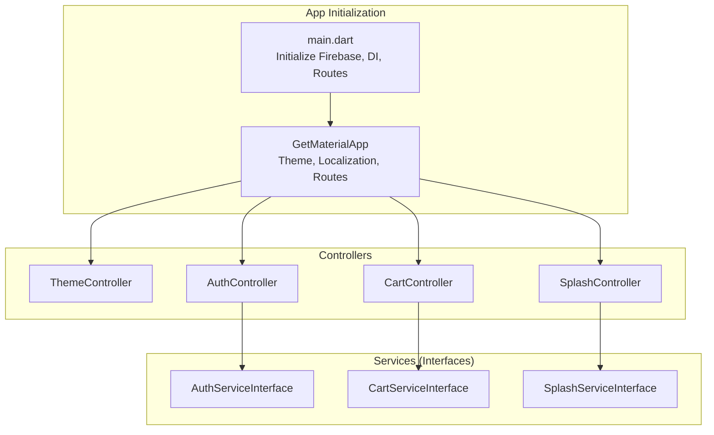
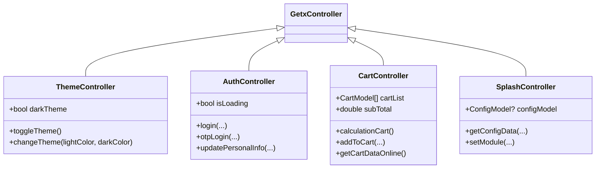
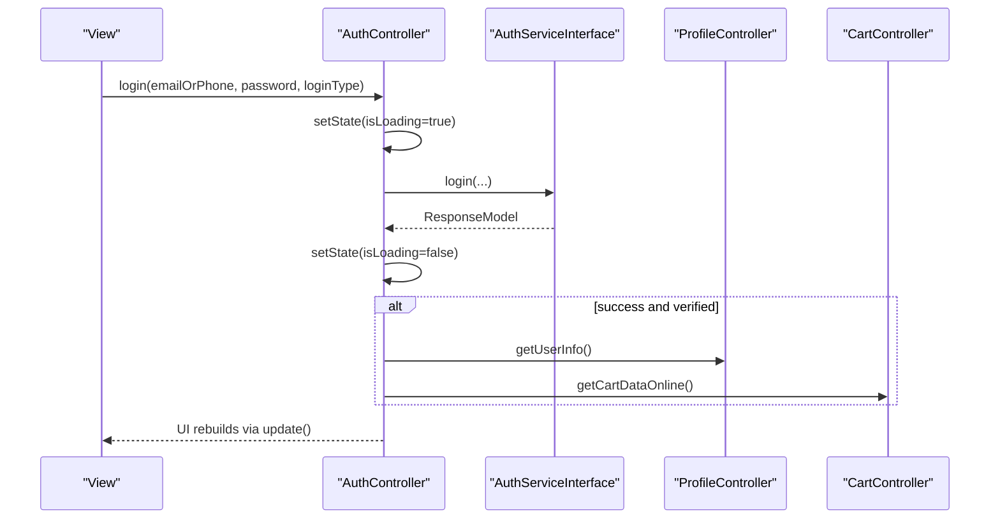
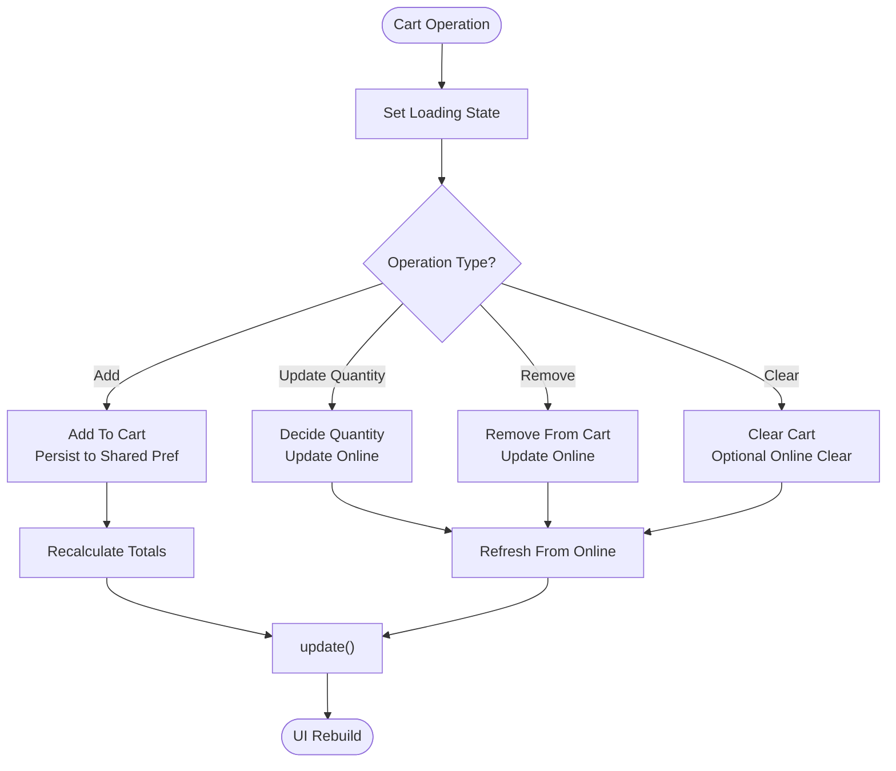
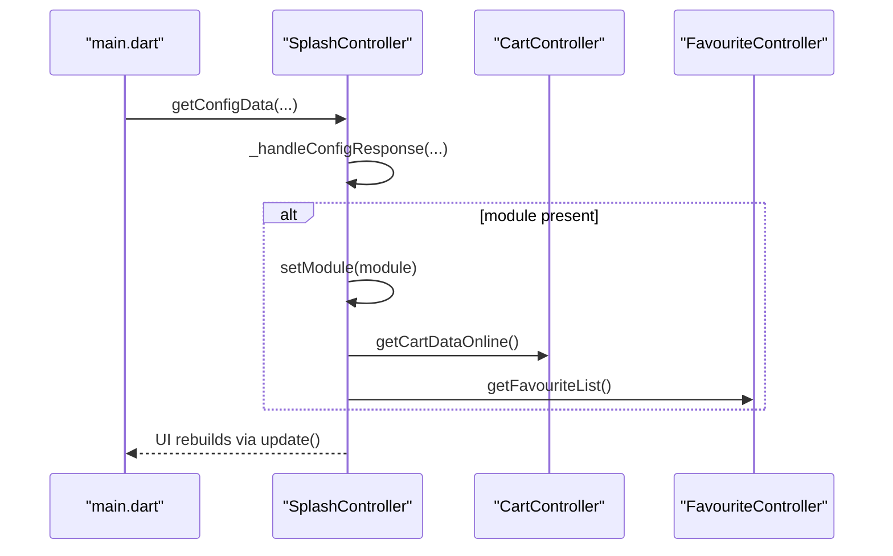
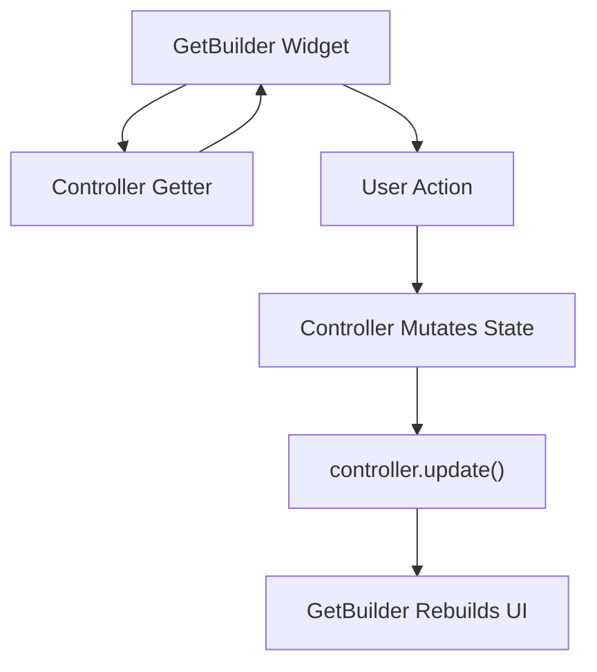
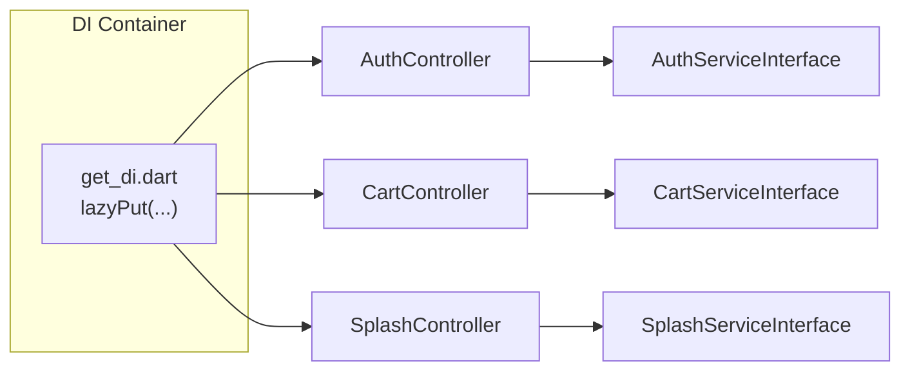
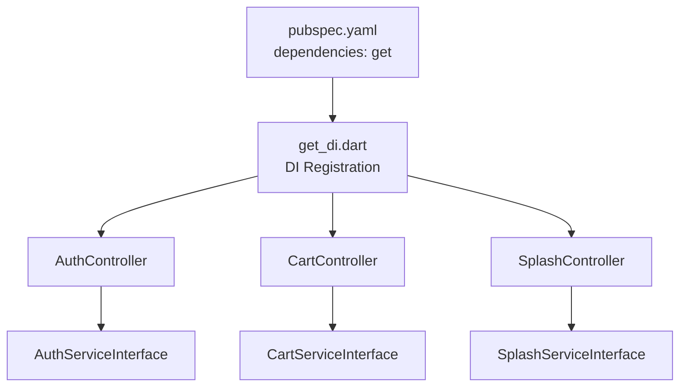

# State Management Patterns

<cite>
**Referenced Files in This Document**
- [main.dart](file://lib/main.dart)
- [get_di.dart](file://lib/helper/get_di.dart)
- [theme_controller.dart](file://lib/common/controllers/theme_controller.dart)
- [auth_controller.dart](file://lib/features/auth/controllers/auth_controller.dart)
- [cart_controller.dart](file://lib/features/cart/controllers/cart_controller.dart)
- [splash_controller.dart](file://lib/features/splash/controllers/splash_controller.dart)
- [auth_service_interface.dart](file://lib/features/auth/domain/services/auth_service_interface.dart)
- [cart_service_interface.dart](file://lib/features/cart/domain/services/cart_service_interface.dart)
- [splash_service_interface.dart](file://lib/features/splash/domain/services/splash_service_interface.dart)
- [pubspec.yaml](file://pubspec.yaml)
</cite>

## Table of Contents
1. [Introduction](#introduction)
2. [Project Structure](#project-structure)
3. [Core Components](#core-components)
4. [Architecture Overview](#architecture-overview)
5. [Detailed Component Analysis](#detailed-component-analysis)
6. [Dependency Analysis](#dependency-analysis)
7. [Performance Considerations](#performance-considerations)
8. [Troubleshooting Guide](#troubleshooting-guide)
9. [Conclusion](#conclusion)

## Introduction
This document explains the state management patterns used in the Waddi application, focusing on the MVVM architecture implemented with GetX controllers. It details how controllers manage view state, business logic, and UI updates reactively via observable variables and automatic UI re-rendering. It also documents the separation of concerns among models, views, and controllers, and how data flows through the system. Examples cover authentication, shopping cart, and real-time updates. Finally, it addresses performance, memory management, synchronization best practices, and how controllers communicate with services and repositories to maintain clean architecture.

## Project Structure
The application initializes Firebase, sets up internationalization, and bootstraps the UI with GetMaterialApp. Controllers are registered via a dependency injection container and are used to drive UI updates through GetBuilder widgets. The project relies on GetX for state management and dependency injection.

**Diagram sources**
- [main.dart:35-103](file://lib/main.dart#L35-L103)
- [get_di.dart:220-757](file://lib/helper/get_di.dart#L220-L757)
- [theme_controller.dart:6-48](file://lib/common/controllers/theme_controller.dart#L6-L48)
- [auth_controller.dart:19-414](file://lib/features/auth/controllers/auth_controller.dart#L19-L414)
- [cart_controller.dart:16-444](file://lib/features/cart/controllers/cart_controller.dart#L16-L444)
- [splash_controller.dart:32-516](file://lib/features/splash/controllers/splash_controller.dart#L32-L516)
- [auth_service_interface.dart:5-35](file://lib/features/auth/domain/services/auth_service_interface.dart#L5-L35)
- [cart_service_interface.dart:7-73](file://lib/features/cart/domain/services/cart_service_interface.dart#L7-L73)
- [splash_service_interface.dart:8-32](file://lib/features/splash/domain/services/splash_service_interface.dart#L8-L32)

**Section sources**
- [main.dart:35-103](file://lib/main.dart#L35-L103)
- [pubspec.yaml:14-14](file://pubspec.yaml#L14-L14)

## Core Components
- ThemeController: Manages theme state and triggers UI rebuilds via update().
- AuthController: Orchestrates authentication flows, manages loading states, and coordinates with ProfileController and CartController after successful login.
- CartController: Maintains cart state, calculates totals, synchronizes with online cart, and notifies UI via update().
- SplashController: Loads configuration, handles module selection, and coordinates cross-feature initialization.

These controllers extend GetxController and expose getters for state, while methods call update() to trigger reactive UI refreshes.

**Section sources**
- [theme_controller.dart:6-48](file://lib/common/controllers/theme_controller.dart#L6-L48)
- [auth_controller.dart:19-414](file://lib/features/auth/controllers/auth_controller.dart#L19-L414)
- [cart_controller.dart:16-444](file://lib/features/cart/controllers/cart_controller.dart#L16-L444)
- [splash_controller.dart:32-516](file://lib/features/splash/controllers/splash_controller.dart#L32-L516)

## Architecture Overview
The application follows MVVM with GetX:
- Model: Plain Dart objects (e.g., ConfigModel, CartModel) consumed by controllers.
- View: Flutter widgets bound to controllers via GetBuilder.
- ViewModel/Controller: GetxController instances that hold state, expose getters, and call update() to notify views.
- Services: Interfaces define business operations; implementations are injected via dependency injection.

**Diagram sources**
- [theme_controller.dart:6-48](file://lib/common/controllers/theme_controller.dart#L6-L48)
- [auth_controller.dart:19-414](file://lib/features/auth/controllers/auth_controller.dart#L19-L414)
- [cart_controller.dart:16-444](file://lib/features/cart/controllers/cart_controller.dart#L16-L444)
- [splash_controller.dart:32-516](file://lib/features/splash/controllers/splash_controller.dart#L32-L516)

## Detailed Component Analysis

### Authentication State Management
AuthController encapsulates authentication state and flows:
- Exposes booleans like isLoading, isOtpViewEnable, acceptTerms, and isActiveRememberMe via getters.
- Methods update internal state and call update() to trigger UI rebuilds.
- After successful login, it fetches user info and synchronizes cart data.

**Diagram sources**
- [auth_controller.dart:62-82](file://lib/features/auth/controllers/auth_controller.dart#L62-L82)
- [auth_controller.dart:175-185](file://lib/features/auth/controllers/auth_controller.dart#L175-L185)
- [auth_service_interface.dart:8-8](file://lib/features/auth/domain/services/auth_service_interface.dart#L8-L8)

**Section sources**
- [auth_controller.dart:19-414](file://lib/features/auth/controllers/auth_controller.dart#L19-L414)
- [auth_service_interface.dart:5-35](file://lib/features/auth/domain/services/auth_service_interface.dart#L5-L35)

### Shopping Cart State Management
CartController maintains cart items, computes totals, and synchronizes with backend:
- Holds cartList, subTotal, addOns, variationPrice, and availability flags.
- Provides methods to add, update, remove, and clear items.
- Calls update() after state changes to refresh UI.
- Integrates with online cart APIs and recalculates totals.

**Diagram sources**
- [cart_controller.dart:199-214](file://lib/features/cart/controllers/cart_controller.dart#L199-L214)
- [cart_controller.dart:220-262](file://lib/features/cart/controllers/cart_controller.dart#L220-L262)
- [cart_controller.dart:264-273](file://lib/features/cart/controllers/cart_controller.dart#L264-L273)
- [cart_controller.dart:275-283](file://lib/features/cart/controllers/cart_controller.dart#L275-L283)
- [cart_controller.dart:384-402](file://lib/features/cart/controllers/cart_controller.dart#L384-L402)
- [cart_controller.dart:363-382](file://lib/features/cart/controllers/cart_controller.dart#L363-L382)

**Section sources**
- [cart_controller.dart:16-444](file://lib/features/cart/controllers/cart_controller.dart#L16-L444)
- [cart_service_interface.dart:7-73](file://lib/features/cart/domain/services/cart_service_interface.dart#L7-L73)

### Splash and Module State Management
SplashController loads configuration, selects modules, and coordinates cross-feature initialization:
- Loads config from local and client sources, caches module, and routes accordingly.
- Notifies dependent controllers (e.g., CartController, FavouriteController) upon module changes.
- Handles cookies, landing page data, and intro flags.

**Diagram sources**
- [splash_controller.dart:115-156](file://lib/features/splash/controllers/splash_controller.dart#L115-L156)
- [splash_controller.dart:158-197](file://lib/features/splash/controllers/splash_controller.dart#L158-L197)
- [splash_controller.dart:277-314](file://lib/features/splash/controllers/splash_controller.dart#L277-L314)
- [main.dart:122-142](file://lib/main.dart#L122-L142)

**Section sources**
- [splash_controller.dart:32-516](file://lib/features/splash/controllers/splash_controller.dart#L32-L516)
- [splash_service_interface.dart:8-32](file://lib/features/splash/domain/services/splash_service_interface.dart#L8-L32)

### Reactive Programming Model and UI Updates
- GetBuilder widgets wrap UI sections and rebuild only when the bound controller calls update().
- Controllers expose getters for state and mutate internal fields before calling update() to trigger a targeted rebuild.
- Example: ThemeController toggles darkTheme and calls update(); views rebuild automatically.

**Diagram sources**
- [theme_controller.dart:29-33](file://lib/common/controllers/theme_controller.dart#L29-L33)
- [main.dart:154-237](file://lib/main.dart#L154-L237)

**Section sources**
- [theme_controller.dart:6-48](file://lib/common/controllers/theme_controller.dart#L6-L48)
- [main.dart:154-237](file://lib/main.dart#L154-L237)

### Clean Architecture: Controllers ↔ Services ↔ Repositories
- Controllers depend on service interfaces, not concrete implementations.
- Dependency Injection registers lazy instances of services and controllers.
- This decouples UI from data sources and enables testing with mocks.

**Diagram sources**
- [get_di.dart:670-757](file://lib/helper/get_di.dart#L670-L757)
- [auth_controller.dart:19-23](file://lib/features/auth/controllers/auth_controller.dart#L19-L23)
- [cart_controller.dart:16-19](file://lib/features/cart/controllers/cart_controller.dart#L16-L19)
- [splash_controller.dart:32-34](file://lib/features/splash/controllers/splash_controller.dart#L32-L34)

**Section sources**
- [get_di.dart:220-757](file://lib/helper/get_di.dart#L220-L757)
- [auth_service_interface.dart:5-35](file://lib/features/auth/domain/services/auth_service_interface.dart#L5-L35)
- [cart_service_interface.dart:7-73](file://lib/features/cart/domain/services/cart_service_interface.dart#L7-L73)
- [splash_service_interface.dart:8-32](file://lib/features/splash/domain/services/splash_service_interface.dart#L8-L32)

## Dependency Analysis
- GetX is the core dependency for state management and DI.
- Controllers are registered lazily via Get.lazyPut and resolved by Get.find elsewhere.
- Controllers call services via injected interfaces, ensuring low coupling.

**Diagram sources**
- [pubspec.yaml:14-14](file://pubspec.yaml#L14-L14)
- [get_di.dart:670-757](file://lib/helper/get_di.dart#L670-L757)
- [auth_controller.dart:19-23](file://lib/features/auth/controllers/auth_controller.dart#L19-L23)
- [cart_controller.dart:16-19](file://lib/features/cart/controllers/cart_controller.dart#L16-L19)
- [splash_controller.dart:32-34](file://lib/features/splash/controllers/splash_controller.dart#L32-L34)

**Section sources**
- [pubspec.yaml:14-14](file://pubspec.yaml#L14-L14)
- [get_di.dart:220-757](file://lib/helper/get_di.dart#L220-L757)

## Performance Considerations
- Prefer targeted updates: call update() only after mutating state to minimize rebuild scope.
- Avoid unnecessary global rebuilds: bind GetBuilder to narrow widget subtrees.
- Batch UI updates: defer multiple small state changes until a single update() call.
- Network-bound operations: set loading flags around async calls to prevent redundant UI churn.
- Memory management: avoid retaining large lists longer than needed; clear or replace lists after operations (e.g., clearCartOnline).
- Module-aware cart synchronization: ensure online cart refresh occurs only when a valid module exists.

[No sources needed since this section provides general guidance]

## Troubleshooting Guide
- UI not updating: Verify that the controller mutated state and called update() after the mutation.
- Stale cart totals: Ensure calculationCart() is invoked after add/remove operations and after refreshing from online.
- Login flow issues: Confirm that _getUserAndCartData() is reached only when verification flags are satisfied.
- Module switching: Validate that setModule() triggers getCartDataOnline() and clears stale lists in dependent controllers.

**Section sources**
- [auth_controller.dart:175-185](file://lib/features/auth/controllers/auth_controller.dart#L175-L185)
- [cart_controller.dart:113-197](file://lib/features/cart/controllers/cart_controller.dart#L113-L197)
- [cart_controller.dart:384-402](file://lib/features/cart/controllers/cart_controller.dart#L384-L402)
- [splash_controller.dart:277-314](file://lib/features/splash/controllers/splash_controller.dart#L277-L314)

## Conclusion
Waddi employs a robust MVVM pattern with GetX controllers to manage state reactively. Controllers encapsulate view state and business logic, expose getters for UI binding, and trigger automatic UI updates via update(). Services are abstracted behind interfaces and injected via a centralized DI container, preserving clean architecture. Real-world scenarios like authentication, cart management, and module-driven initialization demonstrate predictable state flows and efficient UI synchronization. Following the outlined best practices ensures maintainable, performant, and scalable state management.