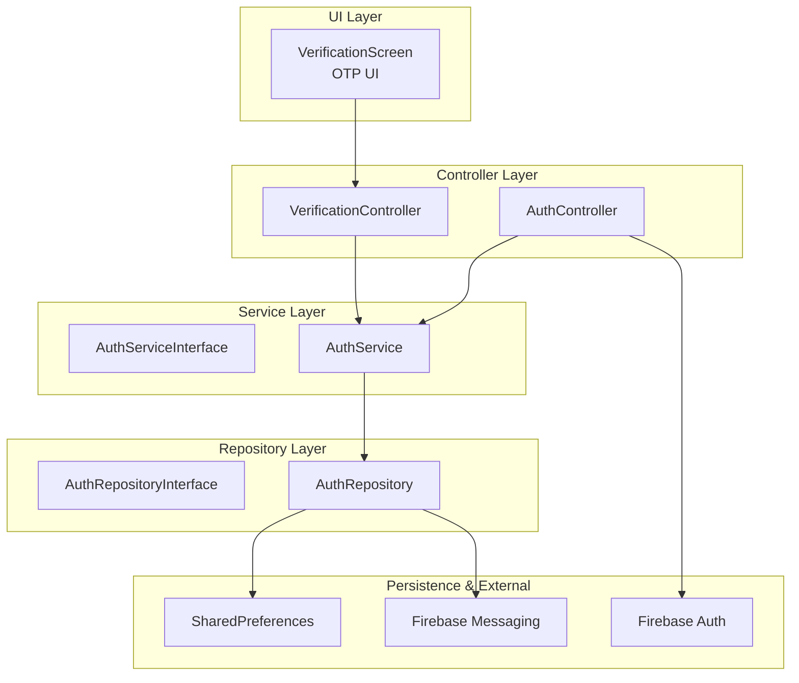
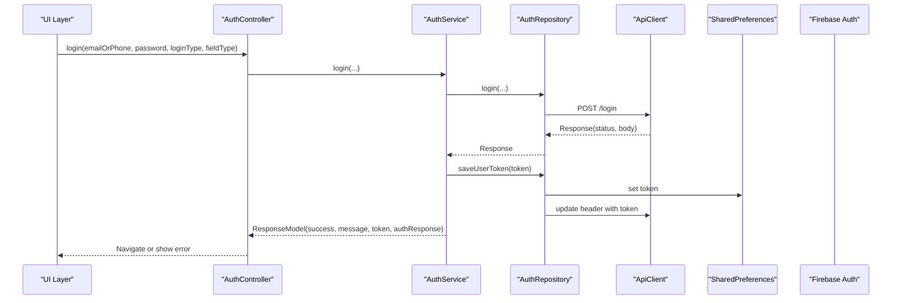
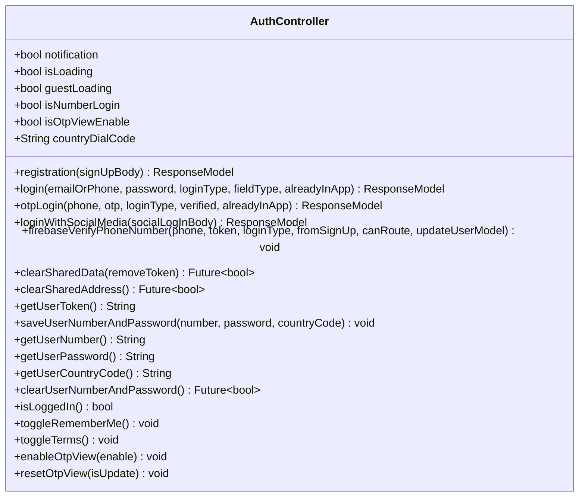
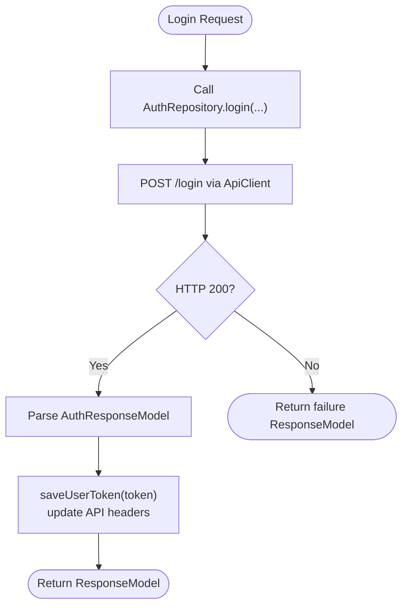
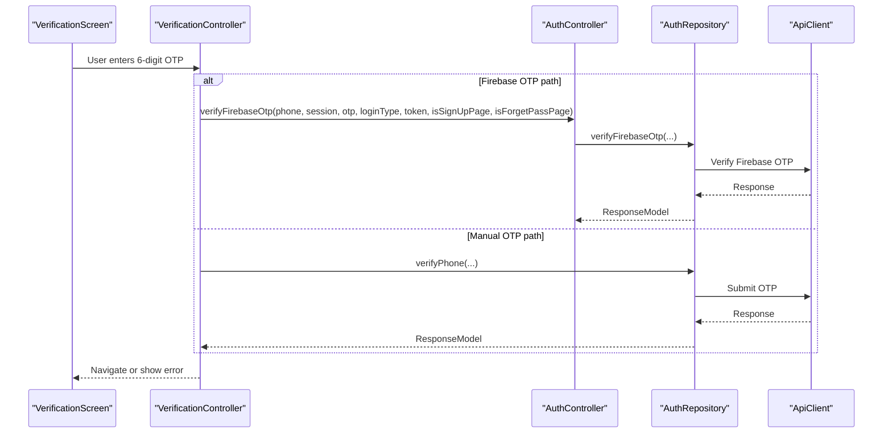
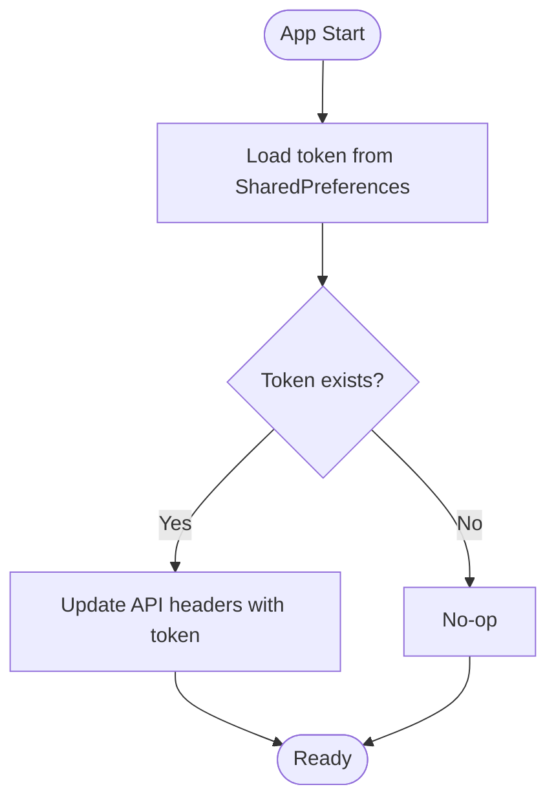
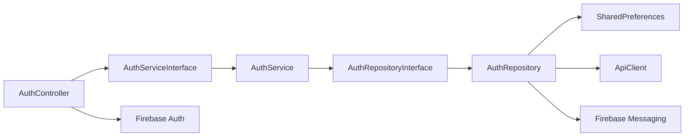

# Authentication System

<cite>
**Referenced Files in This Document**
- [auth_controller.dart](file://lib/features/auth/controllers/auth_controller.dart)
- [auth_service_interface.dart](file://lib/features/auth/domain/services/auth_service_interface.dart)
- [auth_service.dart](file://lib/features/auth/domain/services/auth_service.dart)
- [auth_repository_interface.dart](file://lib/features/auth/domain/reposotories/auth_repository_interface.dart)
- [auth_repository.dart](file://lib/features/auth/domain/reposotories/auth_repository.dart)
- [auth_response_model.dart](file://lib/features/auth/domain/models/auth_response_model.dart)
- [social_log_in_body.dart](file://lib/features/auth/domain/models/social_log_in_body.dart)
- [signup_body_model.dart](file://lib/features/auth/domain/models/signup_body_model.dart)
- [verification_screen.dart](file://lib/features/verification/screens/verification_screen.dart)
- [verification_controller.dart](file://lib/features/verification/controllers/verification_controller.dart)
- [route_helper.dart](file://lib/helper/route_helper.dart)
</cite>

## Table of Contents
1. [Introduction](#introduction)
2. [Project Structure](#project-structure)
3. [Core Components](#core-components)
4. [Architecture Overview](#architecture-overview)
5. [Detailed Component Analysis](#detailed-component-analysis)
6. [Dependency Analysis](#dependency-analysis)
7. [Performance Considerations](#performance-considerations)
8. [Troubleshooting Guide](#troubleshooting-guide)
9. [Conclusion](#conclusion)

## Introduction
This document explains the authentication system for the application, focusing on user registration and login, social media authentication (Google, Facebook, Apple via Firebase), OTP verification, and session/token management. It documents the AuthController implementation, authentication state management, token handling, and security best practices. It also covers configuration options for providers, parameters for social login integration, return values for authentication operations, relationships with Firebase Authentication, shared preferences storage, and route protection mechanisms.

## Project Structure
The authentication subsystem is organized around layered responsibilities:
- Controllers: orchestrate UI actions and coordinate services
- Services: encapsulate business logic and API interactions
- Repositories: handle HTTP requests, token persistence, and shared preferences
- Models: define request/response payloads and typed responses
- Screens/Controllers: manage OTP verification flows and UI transitions

**Diagram sources**
- [auth_controller.dart:19-414](file://lib/features/auth/controllers/auth_controller.dart#L19-L414)
- [verification_screen.dart:1-345](file://lib/features/verification/screens/verification_screen.dart#L1-L345)
- [verification_controller.dart:1-77](file://lib/features/verification/controllers/verification_controller.dart#L1-L77)
- [auth_service_interface.dart:1-35](file://lib/features/auth/domain/services/auth_service_interface.dart#L1-L35)
- [auth_service.dart:1-205](file://lib/features/auth/domain/services/auth_service.dart#L1-L205)
- [auth_repository_interface.dart:1-40](file://lib/features/auth/domain/reposotories/auth_repository_interface.dart#L1-L40)
- [auth_repository.dart:1-462](file://lib/features/auth/domain/reposotories/auth_repository.dart#L1-L462)

**Section sources**
- [auth_controller.dart:1-414](file://lib/features/auth/controllers/auth_controller.dart#L1-L414)
- [auth_service_interface.dart:1-35](file://lib/features/auth/domain/services/auth_service_interface.dart#L1-L35)
- [auth_service.dart:1-205](file://lib/features/auth/domain/services/auth_service.dart#L1-L205)
- [auth_repository_interface.dart:1-40](file://lib/features/auth/domain/reposotories/auth_repository_interface.dart#L1-L40)
- [auth_repository.dart:1-462](file://lib/features/auth/domain/reposotories/auth_repository.dart#L1-L462)
- [verification_screen.dart:1-345](file://lib/features/verification/screens/verification_screen.dart#L1-L345)
- [verification_controller.dart:1-77](file://lib/features/verification/controllers/verification_controller.dart#L1-L77)
- [route_helper.dart:1-1278](file://lib/helper/route_helper.dart#L1-L1278)

## Core Components
- AuthController: central orchestrator for authentication flows, state updates, OTP initiation, and session cleanup
- AuthServiceInterface/AuthService: abstracts and implements business logic for registration, login, OTP login, social login, and token updates
- AuthRepositoryInterface/AuthRepository: handles HTTP calls, token persistence, shared preferences, Firebase token lifecycle, and guest/session management
- Models: typed request/response payloads for sign-up, social login, and auth responses
- VerificationScreen/VerificationController: manages OTP entry UI, resend logic, and post-verification routing

Key responsibilities:
- Registration and login: submit credentials, persist tokens, update headers, and synchronize user/cart data
- OTP verification: Firebase phone verification, manual OTP entry, resend logic, and post-verification routing
- Social login: integrate Google/Facebook/Apple via Firebase and backend
- Session management: token storage, guest ID, device token, and logout/clear routines
- Route protection: middleware applied to protected routes

**Section sources**
- [auth_controller.dart:51-137](file://lib/features/auth/controllers/auth_controller.dart#L51-L137)
- [auth_service.dart:18-94](file://lib/features/auth/domain/services/auth_service.dart#L18-L94)
- [auth_repository.dart:142-171](file://lib/features/auth/domain/reposotories/auth_repository.dart#L142-L171)
- [verification_screen.dart:190-242](file://lib/features/verification/screens/verification_screen.dart#L190-L242)

## Architecture Overview
The authentication system follows a clean architecture pattern:
- UI triggers actions via controllers
- Controllers delegate to services for business logic
- Services call repositories for HTTP/API and persistence
- Repositories manage shared preferences, API client headers, and Firebase integrations

**Diagram sources**
- [auth_controller.dart:62-82](file://lib/features/auth/controllers/auth_controller.dart#L62-L82)
- [auth_service.dart:30-40](file://lib/features/auth/domain/services/auth_service.dart#L30-L40)
- [auth_repository.dart:39-61](file://lib/features/auth/domain/reposotories/auth_repository.dart#L39-L61)
- [auth_repository.dart:142-171](file://lib/features/auth/domain/reposotories/auth_repository.dart#L142-L171)

## Detailed Component Analysis

### AuthController
Responsibilities:
- Exposes registration, login, OTP login, social login, and personal info update APIs
- Manages loading states and UI updates
- Integrates Firebase Phone Auth for OTP initiation and verification
- Coordinates post-login actions (fetch user info, fetch cart data)
- Handles remember-me, terms acceptance, country dial code, and OTP view toggles
- Provides token and shared preference utilities (save/get/clear)
- Supports social logout for Google and Facebook

Key methods and flows:
- Registration: [registration:51-60](file://lib/features/auth/controllers/auth_controller.dart#L51-L60)
- Login: [login:62-82](file://lib/features/auth/controllers/auth_controller.dart#L62-L82)
- OTP login: [otpLogin:84-104](file://lib/features/auth/controllers/auth_controller.dart#L84-L104)
- Social login: [loginWithSocialMedia:122-137](file://lib/features/auth/controllers/auth_controller.dart#L122-L137)
- OTP initiation via Firebase: [firebaseVerifyPhoneNumber:334-412](file://lib/features/auth/controllers/auth_controller.dart#L334-L412)
- Post-login user/cart sync: [_getUserAndCartData:175-185](file://lib/features/auth/controllers/auth_controller.dart#L175-L185)

**Diagram sources**
- [auth_controller.dart:19-414](file://lib/features/auth/controllers/auth_controller.dart#L19-L414)

**Section sources**
- [auth_controller.dart:51-137](file://lib/features/auth/controllers/auth_controller.dart#L51-L137)
- [auth_controller.dart:334-412](file://lib/features/auth/controllers/auth_controller.dart#L334-L412)

### AuthService and AuthRepository
Responsibilities:
- AuthService: maps HTTP responses to ResponseModel, updates headers, persists tokens, and delegates to repository
- AuthRepository: performs HTTP requests, saves tokens to SharedPreferences, updates API headers, manages guest IDs, and handles Firebase device tokens

Key flows:
- Token update and header synchronization: [_updateHeaderFunctionality:42-48](file://lib/features/auth/domain/services/auth_service.dart#L42-L48), [saveUserToken:142-171](file://lib/features/auth/domain/reposotories/auth_repository.dart#L142-L171)
- Guest session handling: [guestLogin:89-102](file://lib/features/auth/domain/reposotories/auth_repository.dart#L89-L102), [saveSharedPrefGuestId:258-261](file://lib/features/auth/domain/reposotories/auth_repository.dart#L258-L261)
- Firebase device token lifecycle: [updateToken:173-217](file://lib/features/auth/domain/reposotories/auth_repository.dart#L173-L217), [saveDeviceToken:220-251](file://lib/features/auth/domain/reposotories/auth_repository.dart#L220-L251)
- Shared preferences and secure storage: [saveUserNumberAndPassword:322-338](file://lib/features/auth/domain/reposotories/auth_repository.dart#L322-L338), [getUserPassword:350-362](file://lib/features/auth/domain/reposotories/auth_repository.dart#L350-L362)

**Diagram sources**
- [auth_service.dart:30-40](file://lib/features/auth/domain/services/auth_service.dart#L30-L40)
- [auth_repository.dart:39-61](file://lib/features/auth/domain/reposotories/auth_repository.dart#L39-L61)
- [auth_repository.dart:142-171](file://lib/features/auth/domain/reposotories/auth_repository.dart#L142-L171)

**Section sources**
- [auth_service.dart:18-94](file://lib/features/auth/domain/services/auth_service.dart#L18-L94)
- [auth_repository.dart:142-171](file://lib/features/auth/domain/reposotories/auth_repository.dart#L142-L171)
- [auth_repository.dart:220-251](file://lib/features/auth/domain/reposotories/auth_repository.dart#L220-L251)

### OTP Verification Flow
The OTP flow supports two paths:
- Firebase phone verification during sign-up or login
- Manual OTP entry after verification code submission

**Diagram sources**
- [verification_screen.dart:190-242](file://lib/features/verification/screens/verification_screen.dart#L190-L242)
- [verification_controller.dart:64-75](file://lib/features/verification/controllers/verification_controller.dart#L64-L75)
- [auth_controller.dart:334-412](file://lib/features/auth/controllers/auth_controller.dart#L334-L412)

**Section sources**
- [verification_screen.dart:190-242](file://lib/features/verification/screens/verification_screen.dart#L190-L242)
- [verification_controller.dart:64-75](file://lib/features/verification/controllers/verification_controller.dart#L64-L75)
- [auth_controller.dart:334-412](file://lib/features/auth/controllers/auth_controller.dart#L334-L412)

### Social Media Authentication
Integration points:
- Google Sign-In: [GoogleSignIn.disconnect:229-232](file://lib/features/auth/controllers/auth_controller.dart#L229-L232)
- Facebook: [FacebookAuth.logOut](file://lib/features/auth/controllers/auth_controller.dart#L232)
- Apple via Firebase: handled through Firebase Auth flows (see Firebase OTP verification)

Parameters and payload:
- Social login body: [SocialLogInBody:1-66](file://lib/features/auth/domain/models/social_log_in_body.dart#L1-L66)
- Payload keys include email, token, uniqueId, medium, phone, deviceToken, accessToken, loginType, verified, guestId, platform

**Section sources**
- [auth_controller.dart:229-233](file://lib/features/auth/controllers/auth_controller.dart#L229-L233)
- [social_log_in_body.dart:28-64](file://lib/features/auth/domain/models/social_log_in_body.dart#L28-L64)

### Token Handling and Session Management
- Token persistence: SharedPreferences for long-term storage; API client header updates
- Device token lifecycle: Firebase Messaging token retrieval and subscription to topics
- Guest session: guest_id stored in SharedPreferences; cleared upon login success
- Logout/clear: removes token, guest_id, cart list, unsubscribes from topics, clears secure storage

**Diagram sources**
- [auth_repository.dart:142-171](file://lib/features/auth/domain/reposotories/auth_repository.dart#L142-L171)
- [auth_repository.dart:254-256](file://lib/features/auth/domain/reposotories/auth_repository.dart#L254-L256)

**Section sources**
- [auth_repository.dart:142-171](file://lib/features/auth/domain/reposotories/auth_repository.dart#L142-L171)
- [auth_repository.dart:258-271](file://lib/features/auth/domain/reposotories/auth_repository.dart#L258-L271)
- [auth_repository.dart:284-320](file://lib/features/auth/domain/reposotories/auth_repository.dart#L284-L320)

### Route Protection Mechanisms
Protected routes are enforced via middleware applied to sensitive pages such as profile, orders, and checkout.

- Middleware usage: [AuthGuardMiddleware:668-669](file://lib/helper/route_helper.dart#L668-L669), [AuthGuardMiddleware](file://lib/helper/route_helper.dart#L670)
- Route definitions: [routes list:468-800](file://lib/helper/route_helper.dart#L468-L800)

**Section sources**
- [route_helper.dart:668-669](file://lib/helper/route_helper.dart#L668-L669)
- [route_helper.dart](file://lib/helper/route_helper.dart#L670)
- [route_helper.dart:468-800](file://lib/helper/route_helper.dart#L468-L800)

## Dependency Analysis
The authentication stack exhibits clear separation of concerns:
- Controllers depend on Services
- Services depend on Repositories
- Repositories depend on HTTP client and external services (Firebase, SharedPreferences)
- UI depends on Controllers and Verification components

**Diagram sources**
- [auth_controller.dart:19-414](file://lib/features/auth/controllers/auth_controller.dart#L19-L414)
- [auth_service_interface.dart:1-35](file://lib/features/auth/domain/services/auth_service_interface.dart#L1-L35)
- [auth_service.dart:1-205](file://lib/features/auth/domain/services/auth_service.dart#L1-L205)
- [auth_repository_interface.dart:1-40](file://lib/features/auth/domain/reposotories/auth_repository_interface.dart#L1-L40)
- [auth_repository.dart:1-462](file://lib/features/auth/domain/reposotories/auth_repository.dart#L1-L462)

**Section sources**
- [auth_controller.dart:19-414](file://lib/features/auth/controllers/auth_controller.dart#L19-L414)
- [auth_service_interface.dart:1-35](file://lib/features/auth/domain/services/auth_service_interface.dart#L1-L35)
- [auth_service.dart:1-205](file://lib/features/auth/domain/services/auth_service.dart#L1-L205)
- [auth_repository_interface.dart:1-40](file://lib/features/auth/domain/reposotories/auth_repository_interface.dart#L1-L40)
- [auth_repository.dart:1-462](file://lib/features/auth/domain/reposotories/auth_repository.dart#L1-L462)

## Performance Considerations
- Minimize network calls: reuse token and avoid redundant header updates
- Debounce UI interactions: disable buttons during async operations
- Lazy initialization: initialize Firebase tokens only when needed
- Batch shared preferences writes: consolidate small writes to reduce overhead
- Avoid unnecessary UI rebuilds: use targeted update() calls in controllers

## Troubleshooting Guide
Common issues and resolutions:
- Invalid phone number during Firebase OTP: surfaced via verificationFailed handler; displays localized messages
  - Reference: [verificationFailed:348-361](file://lib/features/auth/controllers/auth_controller.dart#L348-L361)
- Timed out OTP: codeAutoRetrievalTimeout triggers timeout messaging
  - Reference: [codeAutoRetrievalTimeout:405-411](file://lib/features/auth/controllers/auth_controller.dart#L405-L411)
- Token not available on iOS: APNs token awaited before FCM token retrieval
  - Reference: [saveDeviceToken:224-239](file://lib/features/auth/domain/reposotories/auth_repository.dart#L224-L239)
- Clearing session data: ensure unsubscribe from topics and clear secure storage
  - Reference: [clearSharedData:284-320](file://lib/features/auth/domain/reposotories/auth_repository.dart#L284-L320)
- Guest session conflicts: guest_id cleared upon successful login
  - Reference: [clearSharedPrefGuestId:268-271](file://lib/features/auth/domain/reposotories/auth_repository.dart#L268-L271)

**Section sources**
- [auth_controller.dart:348-411](file://lib/features/auth/controllers/auth_controller.dart#L348-L411)
- [auth_repository.dart:224-239](file://lib/features/auth/domain/reposotories/auth_repository.dart#L224-L239)
- [auth_repository.dart:284-320](file://lib/features/auth/domain/reposotories/auth_repository.dart#L284-L320)

## Conclusion
The authentication system is structured with clear separation between UI, controllers, services, and repositories. It integrates Firebase for phone and social authentication, manages tokens via SharedPreferences and secure storage, and enforces route protection. The OTP verification flow supports both Firebase-initiated and manual OTP entry. The design emphasizes maintainability, testability, and scalability while adhering to security best practices.