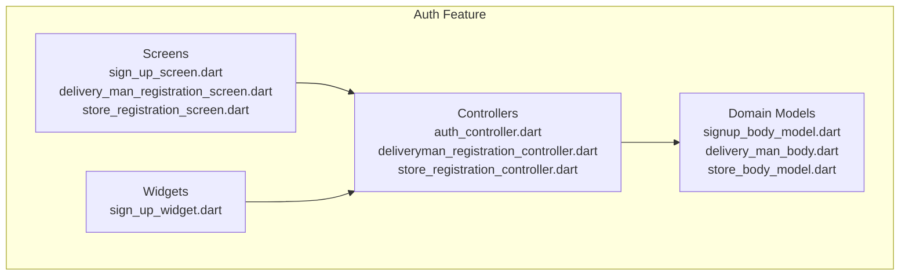
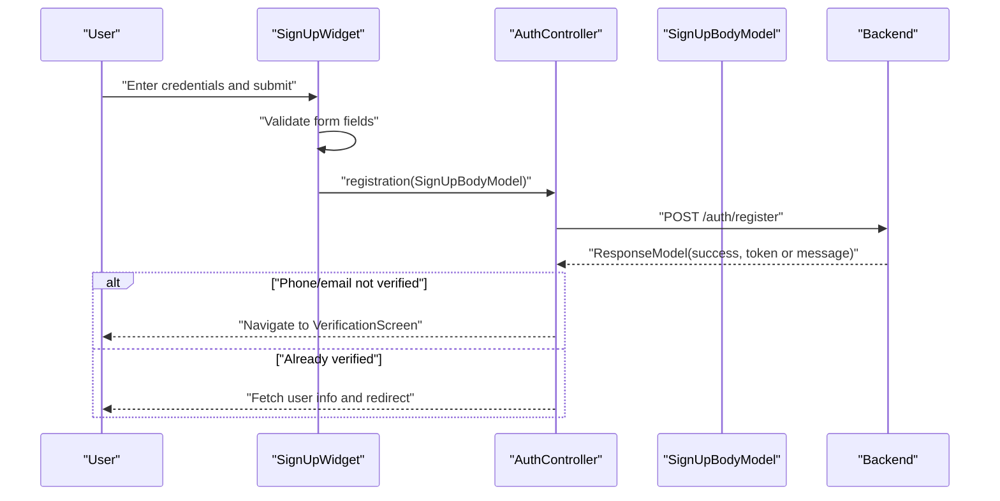
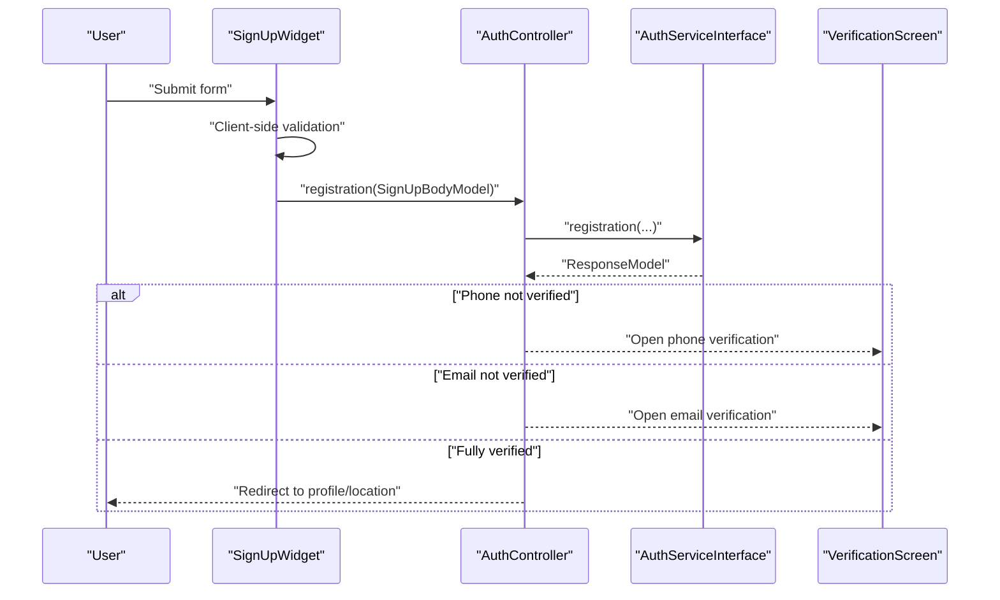
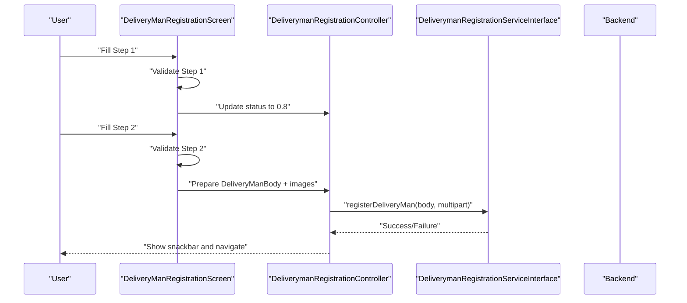
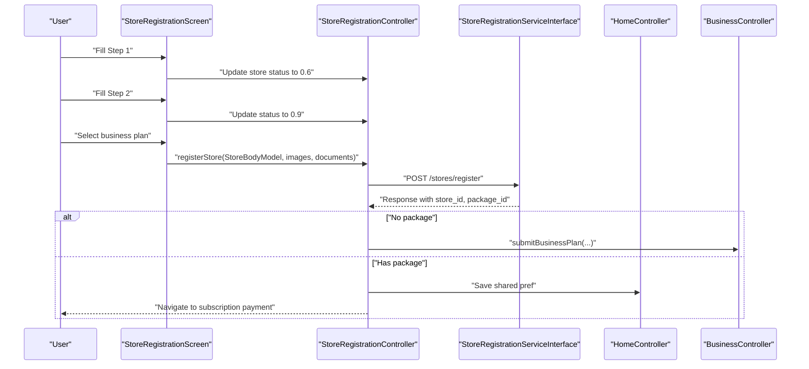
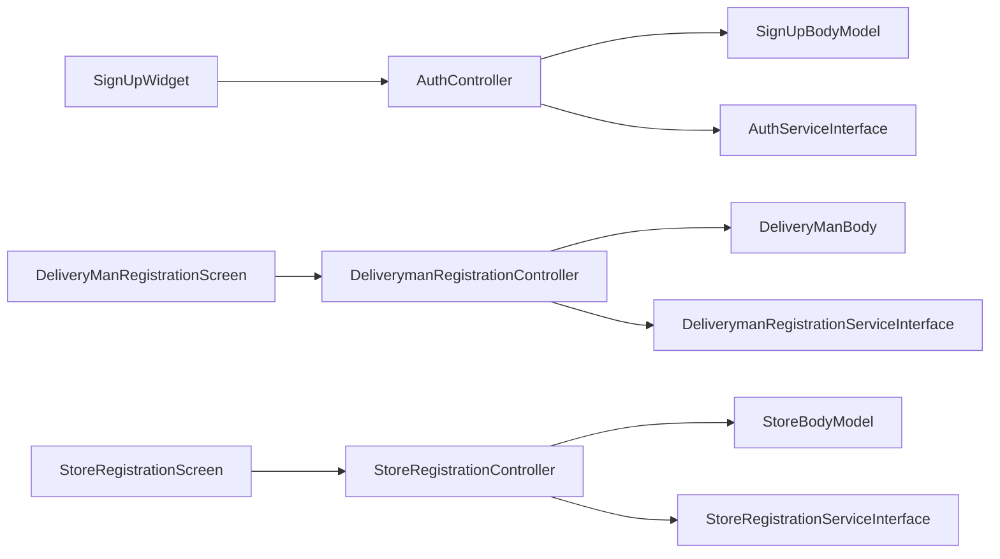

# Registration Processes

<cite>
**Referenced Files in This Document**
- [auth_controller.dart](file://lib/features/auth/controllers/auth_controller.dart)
- [deliveryman_registration_controller.dart](file://lib/features/auth/controllers/deliveryman_registration_controller.dart)
- [store_registration_controller.dart](file://lib/features/auth/controllers/store_registration_controller.dart)
- [signup_body_model.dart](file://lib/features/auth/domain/models/signup_body_model.dart)
- [delivery_man_body.dart](file://lib/features/auth/domain/models/delivery_man_body.dart)
- [store_body_model.dart](file://lib/features/auth/domain/models/store_body_model.dart)
- [sign_up_screen.dart](file://lib/features/auth/screens/sign_up_screen.dart)
- [sign_up_widget.dart](file://lib/features/auth/widgets/sign_up_widget.dart)
- [delivery_man_registration_screen.dart](file://lib/features/auth/screens/delivery_man_registration_screen.dart)
- [store_registration_screen.dart](file://lib/features/auth/screens/store_registration_screen.dart)
</cite>

## Table of Contents
1. [Introduction](#introduction)
2. [Project Structure](#project-structure)
3. [Core Components](#core-components)
4. [Architecture Overview](#architecture-overview)
5. [Detailed Component Analysis](#detailed-component-analysis)
6. [Dependency Analysis](#dependency-analysis)
7. [Performance Considerations](#performance-considerations)
8. [Troubleshooting Guide](#troubleshooting-guide)
9. [Conclusion](#conclusion)

## Introduction
This document explains the registration processes across three roles: end-user customer, delivery person, and store owner/vendor. It covers the multi-step flows, form validation, submission logic, and integration with backend services. It also documents the registration data models, UI widgets, and error handling strategies used in the application.

## Project Structure
The registration feature is organized under the auth feature module with dedicated controllers, domain models, screens, and widgets. Controllers encapsulate state and orchestrate service calls; screens define multi-step UI flows; widgets implement reusable form components; and domain models represent request payloads.

**Diagram sources**
- [auth_controller.dart](file://lib/features/auth/controllers/auth_controller.dart)
- [deliveryman_registration_controller.dart](file://lib/features/auth/controllers/deliveryman_registration_controller.dart)
- [store_registration_controller.dart](file://lib/features/auth/controllers/store_registration_controller.dart)
- [signup_body_model.dart](file://lib/features/auth/domain/models/signup_body_model.dart)
- [delivery_man_body.dart](file://lib/features/auth/domain/models/delivery_man_body.dart)
- [store_body_model.dart](file://lib/features/auth/domain/models/store_body_model.dart)
- [sign_up_screen.dart](file://lib/features/auth/screens/sign_up_screen.dart)
- [sign_up_widget.dart](file://lib/features/auth/widgets/sign_up_widget.dart)
- [delivery_man_registration_screen.dart](file://lib/features/auth/screens/delivery_man_registration_screen.dart)
- [store_registration_screen.dart](file://lib/features/auth/screens/store_registration_screen.dart)

**Section sources**
- [auth_controller.dart](file://lib/features/auth/controllers/auth_controller.dart)
- [deliveryman_registration_controller.dart](file://lib/features/auth/controllers/deliveryman_registration_controller.dart)
- [store_registration_controller.dart](file://lib/features/auth/controllers/store_registration_controller.dart)
- [signup_body_model.dart](file://lib/features/auth/domain/models/signup_body_model.dart)
- [delivery_man_body.dart](file://lib/features/auth/domain/models/delivery_man_body.dart)
- [store_body_model.dart](file://lib/features/auth/domain/models/store_body_model.dart)
- [sign_up_screen.dart](file://lib/features/auth/screens/sign_up_screen.dart)
- [sign_up_widget.dart](file://lib/features/auth/widgets/sign_up_widget.dart)
- [delivery_man_registration_screen.dart](file://lib/features/auth/screens/delivery_man_registration_screen.dart)
- [store_registration_screen.dart](file://lib/features/auth/screens/store_registration_screen.dart)

## Core Components
- Customer registration controller orchestrates standard email/phone sign-up, handles OTP verification, and routes to verification screens when needed.
- Delivery person registration controller manages a two-step form: personal info and identity/zone/vehicle selection, plus image uploads.
- Store owner registration controller implements a multi-step wizard: vendor info, location/time preferences, optional TIN and documents, and business plan selection.

Key responsibilities:
- Validation and sanitization of user inputs.
- Preparing multipart/form-data for image/document uploads.
- Managing progress steps and navigation.
- Integrating with backend services for registration and subsequent flows.

**Section sources**
- [auth_controller.dart](file://lib/features/auth/controllers/auth_controller.dart)
- [deliveryman_registration_controller.dart](file://lib/features/auth/controllers/deliveryman_registration_controller.dart)
- [store_registration_controller.dart](file://lib/features/auth/controllers/store_registration_controller.dart)

## Architecture Overview
The registration architecture follows a layered pattern:
- Screens render multi-step UIs and collect user inputs.
- Widgets encapsulate reusable form controls and validation helpers.
- Controllers manage state, validation, and service interactions.
- Domain models serialize request payloads.
- Services handle network requests and responses.

**Diagram sources**
- [sign_up_widget.dart](file://lib/features/auth/widgets/sign_up_widget.dart)
- [auth_controller.dart](file://lib/features/auth/controllers/auth_controller.dart)
- [signup_body_model.dart](file://lib/features/auth/domain/models/signup_body_model.dart)

## Detailed Component Analysis

### Customer Registration Flow
- UI entry point is the sign-up screen containing a sign-up widget with fields for name, email, phone, password, confirm password, and referral code.
- Validation includes presence checks, email format, phone normalization, password length, and matching confirm password.
- On success, the controller triggers registration and routes to verification if phone or email is unverified; otherwise, it proceeds to profile and location setup.

**Diagram sources**
- [sign_up_widget.dart](file://lib/features/auth/widgets/sign_up_widget.dart)
- [auth_controller.dart](file://lib/features/auth/controllers/auth_controller.dart)
- [signup_body_model.dart](file://lib/features/auth/domain/models/signup_body_model.dart)

**Section sources**
- [sign_up_screen.dart](file://lib/features/auth/screens/sign_up_screen.dart)
- [sign_up_widget.dart](file://lib/features/auth/widgets/sign_up_widget.dart)
- [auth_controller.dart](file://lib/features/auth/controllers/auth_controller.dart)
- [signup_body_model.dart](file://lib/features/auth/domain/models/signup_body_model.dart)

### Delivery Person Registration Flow
- Two-step process:
  - Step 1: Profile picture upload, first/last name, phone, email, password, confirm password.
  - Step 2: Delivery type, zone, vehicle type, identity type, identity number, identity images.
- Progress tracked via a numeric status; validation ensures required fields and password strength.
- Submission builds a delivery-man payload and sends multipart data including images.

**Diagram sources**
- [delivery_man_registration_screen.dart](file://lib/features/auth/screens/delivery_man_registration_screen.dart)
- [deliveryman_registration_controller.dart](file://lib/features/auth/controllers/deliveryman_registration_controller.dart)
- [delivery_man_body.dart](file://lib/features/auth/domain/models/delivery_man_body.dart)

**Section sources**
- [delivery_man_registration_screen.dart](file://lib/features/auth/screens/delivery_man_registration_screen.dart)
- [deliveryman_registration_controller.dart](file://lib/features/auth/controllers/deliveryman_registration_controller.dart)
- [delivery_man_body.dart](file://lib/features/auth/domain/models/delivery_man_body.dart)

### Store Owner/Vendor Registration Flow
- Multi-step wizard:
  - Step 1: Vendor info (multi-language tabs), logo/cover images, location picker, delivery time window, TIN and expiry date, TIN certificate uploads.
  - Step 2: Module selection and zone availability check.
  - Step 3: Business plan selection and subscription handling.
- Progress tracked via a numeric status; validation ensures required fields and file size limits.
- Submission prepares store body with translations, coordinates, and optional TIN fields, plus multipart documents.

**Diagram sources**
- [store_registration_screen.dart](file://lib/features/auth/screens/store_registration_screen.dart)
- [store_registration_controller.dart](file://lib/features/auth/controllers/store_registration_controller.dart)
- [store_body_model.dart](file://lib/features/auth/domain/models/store_body_model.dart)

**Section sources**
- [store_registration_screen.dart](file://lib/features/auth/screens/store_registration_screen.dart)
- [store_registration_controller.dart](file://lib/features/auth/controllers/store_registration_controller.dart)
- [store_body_model.dart](file://lib/features/auth/domain/models/store_body_model.dart)

### Registration Body Models
- Customer registration payload: name, email, phone, password, optional referral code, device token, guest ID.
- Delivery person payload: first/last name, phone, email, password, identity type/number, earnings preference, zone ID, vehicle ID.
- Store owner payload: translated store name/address, delivery time bounds, coordinates, owner contact, zone/module, business plan, package, optional TIN and expiry, and pickup zone IDs.

Validation and serialization:
- Each model exposes a constructor and JSON conversion methods to prepare backend payloads.
- Password strength indicators and checks are handled in respective controllers.

**Section sources**
- [signup_body_model.dart](file://lib/features/auth/domain/models/signup_body_model.dart)
- [delivery_man_body.dart](file://lib/features/auth/domain/models/delivery_man_body.dart)
- [store_body_model.dart](file://lib/features/auth/domain/models/store_body_model.dart)

### Validation Logic and Error Handling
- Client-side validation:
  - Presence checks, email format, phone normalization, password length and strength, confirm password match, and TIN/document constraints.
  - Password strength is evaluated with separate flags for length, numbers, uppercase, lowercase, and special characters.
- Backend-driven verification:
  - After registration, if phone or email is not verified, the system opens a verification screen for OTP/email confirmation.
- Snackbars and dialogs surface errors and guide users to correct inputs.

Common validations:
- Name, email, phone, password, confirm password, identity number, images/documents, and module/zone selections.

**Section sources**
- [sign_up_widget.dart](file://lib/features/auth/widgets/sign_up_widget.dart)
- [deliveryman_registration_controller.dart](file://lib/features/auth/controllers/deliveryman_registration_controller.dart)
- [store_registration_controller.dart](file://lib/features/auth/controllers/store_registration_controller.dart)

### Configuration Options and Workflows
- Role-based flows:
  - Customer registration supports phone/email verification and redirects to profile/location after success.
  - Delivery person registration requires identity images and vehicle selection.
  - Store owner registration integrates with business plans and subscriptions.
- Dynamic UI:
  - Multi-language tabs for store names.
  - Conditional fields based on configuration flags (e.g., referral code visibility).
- Approval workflows:
  - Store registration may route to subscription/payment depending on package selection.

**Section sources**
- [auth_controller.dart](file://lib/features/auth/controllers/auth_controller.dart)
- [store_registration_controller.dart](file://lib/features/auth/controllers/store_registration_controller.dart)
- [store_registration_screen.dart](file://lib/features/auth/screens/store_registration_screen.dart)

## Dependency Analysis
Controllers depend on:
- Domain models for request payloads.
- Services for backend communication.
- UI widgets for form rendering and validation.
- Other controllers for cross-feature operations (e.g., saving registration completion state).

**Diagram sources**
- [sign_up_widget.dart](file://lib/features/auth/widgets/sign_up_widget.dart)
- [auth_controller.dart](file://lib/features/auth/controllers/auth_controller.dart)
- [signup_body_model.dart](file://lib/features/auth/domain/models/signup_body_model.dart)
- [delivery_man_registration_screen.dart](file://lib/features/auth/screens/delivery_man_registration_screen.dart)
- [deliveryman_registration_controller.dart](file://lib/features/auth/controllers/deliveryman_registration_controller.dart)
- [delivery_man_body.dart](file://lib/features/auth/domain/models/delivery_man_body.dart)
- [store_registration_screen.dart](file://lib/features/auth/screens/store_registration_screen.dart)
- [store_registration_controller.dart](file://lib/features/auth/controllers/store_registration_controller.dart)
- [store_body_model.dart](file://lib/features/auth/domain/models/store_body_model.dart)

**Section sources**
- [auth_controller.dart](file://lib/features/auth/controllers/auth_controller.dart)
- [deliveryman_registration_controller.dart](file://lib/features/auth/controllers/deliveryman_registration_controller.dart)
- [store_registration_controller.dart](file://lib/features/auth/controllers/store_registration_controller.dart)
- [signup_body_model.dart](file://lib/features/auth/domain/models/signup_body_model.dart)
- [delivery_man_body.dart](file://lib/features/auth/domain/models/delivery_man_body.dart)
- [store_body_model.dart](file://lib/features/auth/domain/models/store_body_model.dart)

## Performance Considerations
- Minimize unnecessary rebuilds by updating only the required controller state.
- Defer heavy operations (image/document uploads) until validation passes.
- Use progress indicators to reflect multi-step status and avoid redundant submissions.
- Cache small configuration values (e.g., default location) to reduce repeated lookups.

## Troubleshooting Guide
Common issues and resolutions:
- Invalid phone number: Ensure international format and normalized number before submission.
- Password does not meet strength criteria: Enforce minimum length and include mixed-case letters, digits, and special characters.
- Missing required fields: Provide clear snackbars indicating which fields are empty or invalid.
- Upload failures: Verify file size limits and supported formats for images/documents.
- Navigation after verification: Confirm that verification routes are correctly opened based on unverified channels (phone/email).

**Section sources**
- [sign_up_widget.dart](file://lib/features/auth/widgets/sign_up_widget.dart)
- [deliveryman_registration_controller.dart](file://lib/features/auth/controllers/deliveryman_registration_controller.dart)
- [store_registration_controller.dart](file://lib/features/auth/controllers/store_registration_controller.dart)

## Conclusion
The registration subsystem provides robust, role-specific flows with strong client-side validation and clear backend integration. The modular design of controllers, models, screens, and widgets enables maintainability and extensibility. By following the documented flows and validation strategies, teams can confidently enhance or troubleshoot registration experiences across customers, delivery persons, and store owners.