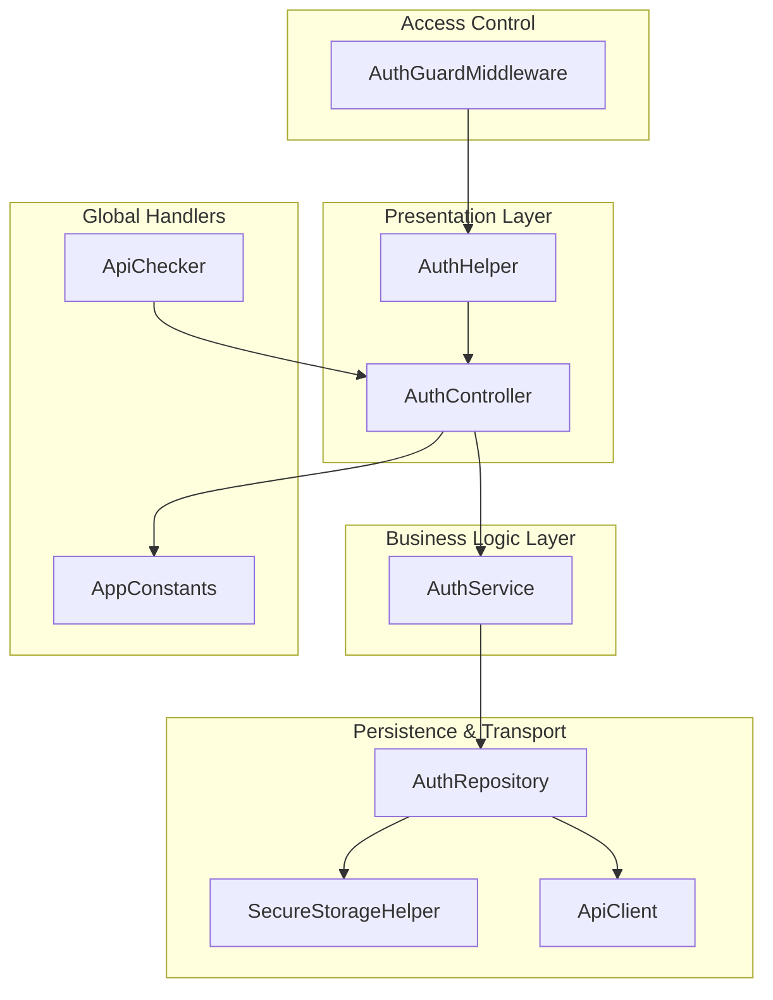
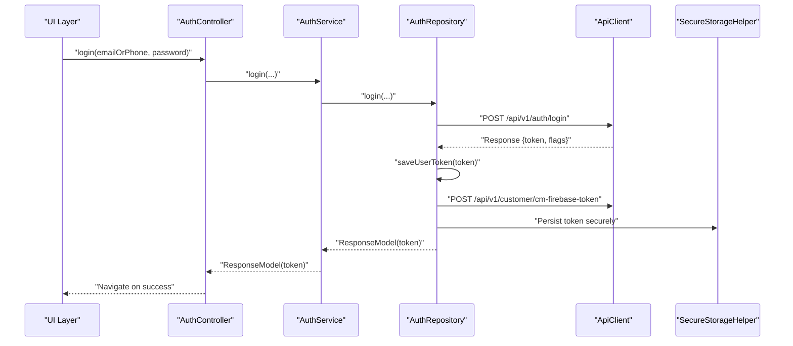
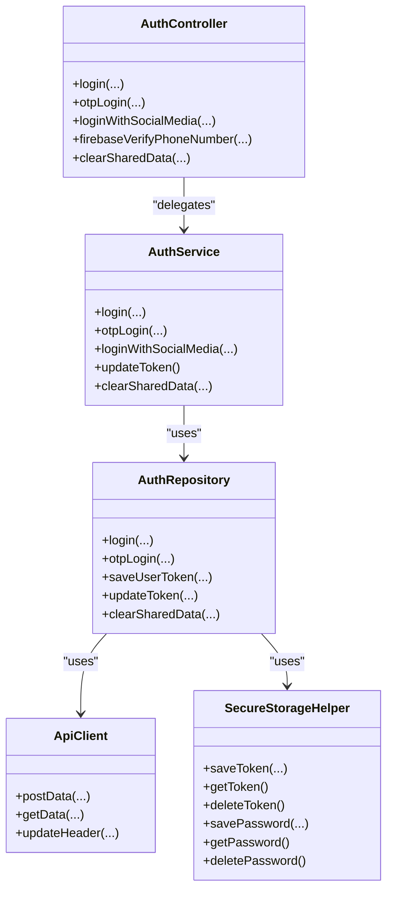

# Security Implementation

<cite>
**Referenced Files in This Document**
- [auth_controller.dart](file://lib/features/auth/controllers/auth_controller.dart)
- [auth_service.dart](file://lib/features/auth/domain/services/auth_service.dart)
- [auth_repository.dart](file://lib/features/auth/domain/reposotories/auth_repository.dart)
- [secure_storage_helper.dart](file://lib/helper/secure_storage_helper.dart)
- [auth_guard_middleware.dart](file://lib/common/widgets/auth_guard_middleware.dart)
- [api_client.dart](file://lib/api/api_client.dart)
- [api_checker.dart](file://lib/api/api_checker.dart)
- [app_constants.dart](file://lib/util/app_constants.dart)
- [auth_helper.dart](file://lib/helper/auth_helper.dart)
</cite>

## Table of Contents
1. [Introduction](#introduction)
2. [Project Structure](#project-structure)
3. [Core Components](#core-components)
4. [Architecture Overview](#architecture-overview)
5. [Detailed Component Analysis](#detailed-component-analysis)
6. [Dependency Analysis](#dependency-analysis)
7. [Performance Considerations](#performance-considerations)
8. [Troubleshooting Guide](#troubleshooting-guide)
9. [Conclusion](#conclusion)
10. [Appendices](#appendices)

## Introduction
This document explains the security implementation for user authentication in the application. It covers authentication flows, token security, session protection, secure storage, middleware-based access control, and integration points with Firebase Authentication and messaging. It also documents best practices, vulnerability mitigations, and compliance considerations for building secure authentication systems.

## Project Structure
Security-related components are organized across three layers:
- Presentation and orchestration: AuthController
- Business logic: AuthService
- Persistence and transport: AuthRepository, ApiClient, SecureStorageHelper
- Access control: AuthGuardMiddleware
- Global error handling: ApiChecker
- Constants and endpoints: AppConstants
- Helper utilities: AuthHelper

**Diagram sources**
- [auth_controller.dart:19-414](file://lib/features/auth/controllers/auth_controller.dart#L19-L414)
- [auth_service.dart:9-205](file://lib/features/auth/domain/services/auth_service.dart#L9-L205)
- [auth_repository.dart:19-462](file://lib/features/auth/domain/reposotories/auth_repository.dart#L19-L462)
- [secure_storage_helper.dart:1-56](file://lib/helper/secure_storage_helper.dart#L1-L56)
- [api_client.dart:18-245](file://lib/api/api_client.dart#L18-L245)
- [auth_guard_middleware.dart:1-20](file://lib/common/widgets/auth_guard_middleware.dart#L1-L20)
- [api_checker.dart:1-19](file://lib/api/api_checker.dart#L1-L19)
- [app_constants.dart:1-424](file://lib/util/app_constants.dart#L1-L424)
- [auth_helper.dart:1-17](file://lib/helper/auth_helper.dart#L1-L17)

**Section sources**
- [auth_controller.dart:1-414](file://lib/features/auth/controllers/auth_controller.dart#L1-L414)
- [auth_service.dart:1-205](file://lib/features/auth/domain/services/auth_service.dart#L1-L205)
- [auth_repository.dart:1-462](file://lib/features/auth/domain/reposotories/auth_repository.dart#L1-L462)
- [secure_storage_helper.dart:1-56](file://lib/helper/secure_storage_helper.dart#L1-L56)
- [api_client.dart:1-245](file://lib/api/api_client.dart#L1-L245)
- [auth_guard_middleware.dart:1-20](file://lib/common/widgets/auth_guard_middleware.dart#L1-L20)
- [api_checker.dart:1-19](file://lib/api/api_checker.dart#L1-L19)
- [app_constants.dart:1-424](file://lib/util/app_constants.dart#L1-L424)
- [auth_helper.dart:1-17](file://lib/helper/auth_helper.dart#L1-L17)

## Core Components
- AuthController orchestrates login, OTP login, social login, and Firebase phone verification. It delegates persistence and network calls to AuthService and AuthRepository.
- AuthService handles response parsing, token extraction, and updates headers and device tokens upon successful authentication.
- AuthRepository persists tokens to SharedPreferences and SecureStorage, manages guest sessions, and unsubscribes from Firebase topics during logout.
- SecureStorageHelper stores sensitive data (tokens, passwords) using platform-backed secure storage.
- ApiClient constructs HTTP requests with Authorization headers and handles timeouts and response normalization.
- ApiChecker intercepts unauthorized responses and triggers logout and navigation to unified auth.
- AuthGuardMiddleware enforces authentication for protected routes.
- AppConstants centralizes endpoint URIs and shared preference keys used in authentication flows.

**Section sources**
- [auth_controller.dart:19-414](file://lib/features/auth/controllers/auth_controller.dart#L19-L414)
- [auth_service.dart:9-205](file://lib/features/auth/domain/services/auth_service.dart#L9-L205)
- [auth_repository.dart:19-462](file://lib/features/auth/domain/reposotories/auth_repository.dart#L19-L462)
- [secure_storage_helper.dart:1-56](file://lib/helper/secure_storage_helper.dart#L1-L56)
- [api_client.dart:18-245](file://lib/api/api_client.dart#L18-L245)
- [api_checker.dart:1-19](file://lib/api/api_checker.dart#L1-L19)
- [auth_guard_middleware.dart:1-20](file://lib/common/widgets/auth_guard_middleware.dart#L1-L20)
- [app_constants.dart:1-424](file://lib/util/app_constants.dart#L1-L424)
- [auth_helper.dart:1-17](file://lib/helper/auth_helper.dart#L1-L17)

## Architecture Overview
The authentication flow integrates client-side token management, secure storage, and backend APIs. It leverages Firebase Authentication for phone verification and Firebase Messaging for device token updates.

**Diagram sources**
- [auth_controller.dart:62-82](file://lib/features/auth/controllers/auth_controller.dart#L62-L82)
- [auth_service.dart:31-40](file://lib/features/auth/domain/services/auth_service.dart#L31-L40)
- [auth_repository.dart:39-61](file://lib/features/auth/domain/reposotories/auth_repository.dart#L39-L61)
- [api_client.dart:88-112](file://lib/api/api_client.dart#L88-L112)
- [secure_storage_helper.dart:13-23](file://lib/helper/secure_storage_helper.dart#L13-L23)
- [app_constants.dart:38-39](file://lib/util/app_constants.dart#L38-L39)

## Detailed Component Analysis

### Authentication Security Measures
- Token lifecycle: Tokens are saved to SharedPreferences and SecureStorage, and headers are updated per request. On logout, tokens are cleared and device subscriptions are removed.
- Device token management: On successful login, the app retrieves a device token and subscribes to Firebase topics. During logout, it unsubscribes and clears tokens.
- Guest session isolation: Guest identifiers are stored separately and cleared on logout to prevent token leakage.
- Firebase phone verification: Phone verification uses Firebase SDK callbacks to handle completion, failure, and auto-retrieval events.

Best practices implemented:
- Separation of concerns: AuthController delegates to AuthService and AuthRepository.
- Minimal exposure: Tokens are not logged; headers are constructed centrally.
- Idempotent logout: Multiple cleanup steps ensure consistent state.

**Section sources**
- [auth_controller.dart:334-412](file://lib/features/auth/controllers/auth_controller.dart#L334-L412)
- [auth_service.dart:42-48](file://lib/features/auth/domain/services/auth_service.dart#L42-L48)
- [auth_repository.dart:143-171](file://lib/features/auth/domain/reposotories/auth_repository.dart#L143-L171)
- [auth_repository.dart:285-320](file://lib/features/auth/domain/reposotories/auth_repository.dart#L285-L320)
- [auth_repository.dart:220-251](file://lib/features/auth/domain/reposotories/auth_repository.dart#L220-L251)

### Password Encryption and Secure Storage
- Secure storage: Sensitive credentials are written to platform-backed secure storage using a dedicated helper.
- Migration strategy: Legacy SharedPreferences entries are migrated to secure storage and cleaned up.
- Isolation: Separate keys are used for auth token, user password, and wallet token to minimize cross-contamination.

Recommendations:
- Prefer platform keychains for secrets.
- Avoid storing plaintext passwords; if needed, encrypt with device-bound keys.
- Rotate keys periodically and invalidate old entries.

**Section sources**
- [secure_storage_helper.dart:1-56](file://lib/helper/secure_storage_helper.dart#L1-L56)
- [auth_repository.dart:323-370](file://lib/features/auth/domain/reposotories/auth_repository.dart#L323-L370)

### Token Security and Session Protection
- Header injection: ApiClient injects Authorization: Bearer token for all authenticated requests.
- Timeout handling: Requests enforce timeouts to avoid hanging connections.
- Unauthorized handling: ApiChecker detects 401 responses and triggers logout and navigation to unified auth.

Mitigations:
- Always send Authorization headers for protected endpoints.
- Clear tokens and unsubscribe from topics on logout.
- Use HTTPS endpoints and avoid transmitting secrets over insecure channels.

**Section sources**
- [api_client.dart:46-66](file://lib/api/api_client.dart#L46-L66)
- [api_client.dart:70-112](file://lib/api/api_client.dart#L70-L112)
- [api_checker.dart:8-18](file://lib/api/api_checker.dart#L8-L18)

### Access Control and Middleware
- AuthGuardMiddleware checks authentication status and redirects unauthenticated users to the unified auth route.
- AuthHelper centralizes isLoggedIn checks for middleware and other parts of the app.

Implementation notes:
- Apply middleware to protected routes to enforce pre-authentication.
- Keep middleware logic minimal; rely on AuthHelper for state queries.

**Section sources**
- [auth_guard_middleware.dart:1-20](file://lib/common/widgets/auth_guard_middleware.dart#L1-L20)
- [auth_helper.dart:1-17](file://lib/helper/auth_helper.dart#L1-L17)

### Secure Communication Protocols
- HTTPS endpoints: AppConstants defines production base URLs and API endpoints.
- Device token retrieval: Firebase Messaging is used to obtain device tokens for push notifications.

Guidelines:
- Enforce HTTPS for all API communications.
- Validate server certificates and handle certificate pinning if applicable.
- Avoid sending tokens in URLs; use Authorization headers.

**Section sources**
- [app_constants.dart:15-18](file://lib/util/app_constants.dart#L15-L18)
- [auth_repository.dart:220-251](file://lib/features/auth/domain/reposotories/auth_repository.dart#L220-L251)

### Firebase Integration and Security Rules
- Firebase Authentication: Used for phone number verification and social logins.
- Firebase Messaging: Device tokens are registered and managed for push notifications.
- Security rules: While not present in the repository, Firebase Security Rules should restrict access to user data and enforce authentication requirements.

Recommendations:
- Define Firestore/Realtime Database rules to require authentication and limit reads/writes to user-scoped documents.
- Use Firebase Authentication custom claims for role-based access control.
- Monitor and audit authentication events.

[No sources needed since this section provides general guidance]

### Vulnerability Prevention Strategies
Common vulnerabilities and mitigations:
- Insecure direct object references (IDOR): Use scoped endpoints and server-side permission checks.
- Broken authentication: Enforce multi-factor authentication, rate limiting, and secure password policies.
- Exposed tokens: Store tokens in secure storage, avoid logging, and clear on logout.
- Cross-site scripting (XSS): Sanitize inputs and outputs; use Content-Security-Policy headers on web.
- Man-in-the-middle (MITM): Enforce HTTPS and certificate pinning; avoid cleartext storage.

[No sources needed since this section provides general guidance]

## Dependency Analysis

**Diagram sources**
- [auth_controller.dart:19-414](file://lib/features/auth/controllers/auth_controller.dart#L19-L414)
- [auth_service.dart:9-205](file://lib/features/auth/domain/services/auth_service.dart#L9-L205)
- [auth_repository.dart:19-462](file://lib/features/auth/domain/reposotories/auth_repository.dart#L19-L462)
- [api_client.dart:18-245](file://lib/api/api_client.dart#L18-L245)
- [secure_storage_helper.dart:1-56](file://lib/helper/secure_storage_helper.dart#L1-L56)

**Section sources**
- [auth_controller.dart:1-414](file://lib/features/auth/controllers/auth_controller.dart#L1-L414)
- [auth_service.dart:1-205](file://lib/features/auth/domain/services/auth_service.dart#L1-L205)
- [auth_repository.dart:1-462](file://lib/features/auth/domain/reposotories/auth_repository.dart#L1-L462)
- [api_client.dart:1-245](file://lib/api/api_client.dart#L1-L245)
- [secure_storage_helper.dart:1-56](file://lib/helper/secure_storage_helper.dart#L1-L56)

## Performance Considerations
- Minimize redundant token refreshes by checking existing tokens and headers before updating.
- Batch logout operations to reduce repeated API calls.
- Cache frequently accessed user preferences locally while keeping secrets in secure storage.

[No sources needed since this section provides general guidance]

## Troubleshooting Guide
- 401 Unauthorized responses: ApiChecker clears shared data and navigates to unified auth. Verify token validity and re-authenticate.
- Phone verification failures: Check Firebase configuration, carrier support, and device capabilities. Ensure proper callbacks handle completion and errors.
- Device token issues: Confirm permissions are granted and APNs token availability on iOS. Retry token retrieval if initially unavailable.

**Section sources**
- [api_checker.dart:8-18](file://lib/api/api_checker.dart#L8-L18)
- [auth_controller.dart:345-412](file://lib/features/auth/controllers/auth_controller.dart#L345-L412)
- [auth_repository.dart:220-251](file://lib/features/auth/domain/reposotories/auth_repository.dart#L220-L251)

## Conclusion
The authentication system follows a layered approach with clear separation of concerns. It employs secure storage for sensitive data, robust token lifecycle management, centralized header injection, and middleware-based access control. Integrations with Firebase Authentication and Messaging are handled carefully, with logout routines ensuring tokens and subscriptions are properly cleaned up. Adhering to the outlined best practices and continuously validating against evolving security standards will help maintain a resilient and compliant authentication system.

[No sources needed since this section summarizes without analyzing specific files]

## Appendices

### Security Configurations and Endpoints
- Base URL and endpoints are defined centrally for consistent configuration across the app.
- Shared preference keys for tokens, guest IDs, and user credentials are standardized.

**Section sources**
- [app_constants.dart:15-18](file://lib/util/app_constants.dart#L15-L18)
- [app_constants.dart:276-304](file://lib/util/app_constants.dart#L276-L304)