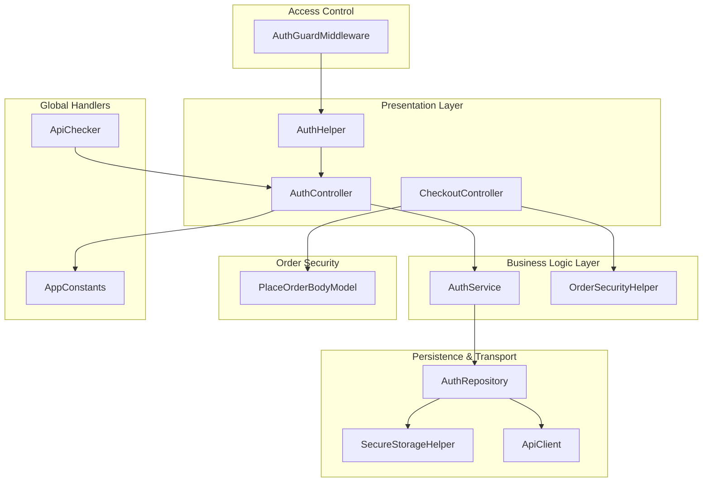
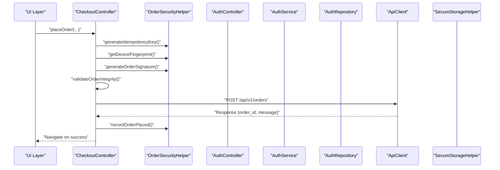
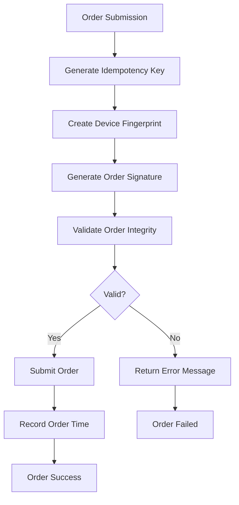
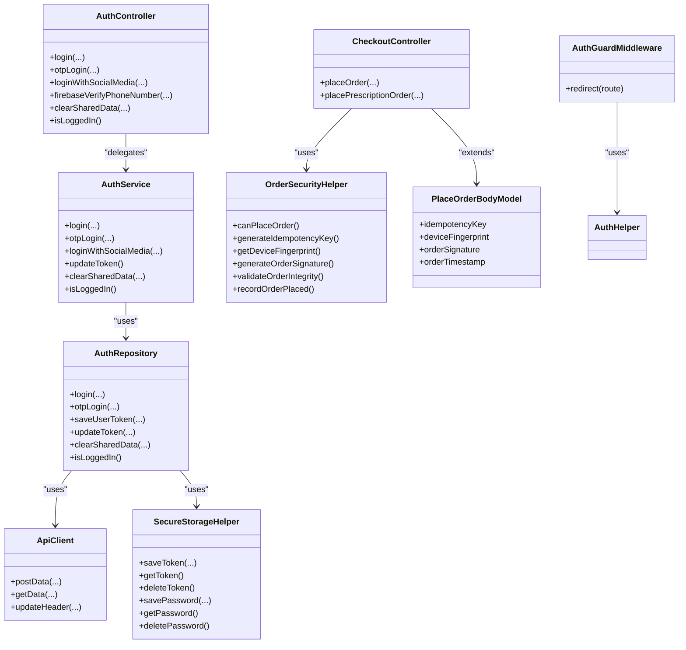

# Security Implementation

<cite>
**Referenced Files in This Document**
- [auth_controller.dart](file://lib/features/auth/controllers/auth_controller.dart)
- [auth_service.dart](file://lib/features/auth/domain/services/auth_service.dart)
- [auth_repository.dart](file://lib/features/auth/domain/reposotories/auth_repository.dart)
- [secure_storage_helper.dart](file://lib/helper/secure_storage_helper.dart)
- [auth_guard_middleware.dart](file://lib/common/widgets/auth_guard_middleware.dart)
- [auth_helper.dart](file://lib/helper/auth_helper.dart)
- [order_security_helper.dart](file://lib/helper/order_security_helper.dart)
- [checkout_controller.dart](file://lib/features/checkout/controllers/checkout_controller.dart)
- [place_order_body_model.dart](file://lib/features/checkout/domain/models/place_order_body_model.dart)
- [api_client.dart](file://lib/api/api_client.dart)
- [api_checker.dart](file://lib/api/api_checker.dart)
- [app_constants.dart](file://lib/util/app_constants.dart)
</cite>

## Update Summary
**Changes Made**
- Added comprehensive order security implementation with OrderSecurityHelper
- Enhanced authentication security with new AuthGuardMiddleware
- Integrated rate limiting, idempotency keys, device fingerprinting, and HMAC signatures
- Updated checkout flow security with order validation and integrity checks

## Table of Contents
1. [Introduction](#introduction)
2. [Project Structure](#project-structure)
3. [Core Components](#core-components)
4. [Architecture Overview](#architecture-overview)
5. [Detailed Component Analysis](#detailed-component-analysis)
6. [Enhanced Security Measures](#enhanced-security-measures)
7. [Dependency Analysis](#dependency-analysis)
8. [Performance Considerations](#performance-considerations)
9. [Troubleshooting Guide](#troubleshooting-guide)
10. [Conclusion](#conclusion)
11. [Appendices](#appendices)

## Introduction
This document explains the comprehensive security implementation for user authentication and order processing in the application. It covers authentication flows, token security, session protection, secure storage, middleware-based access control, order security measures, and integration points with Firebase Authentication and messaging. The system now includes advanced fraud prevention mechanisms including rate limiting, idempotency keys, device fingerprinting, and HMAC signatures for protecting against fraudulent orders.

## Project Structure
Security-related components are organized across four layers with enhanced order security:
- Presentation and orchestration: AuthController, CheckoutController
- Business logic: AuthService, OrderSecurityHelper
- Persistence and transport: AuthRepository, ApiClient, SecureStorageHelper
- Access control: AuthGuardMiddleware, AuthHelper
- Order security: OrderSecurityHelper, PlaceOrderBodyModel
- Global error handling: ApiChecker
- Constants and endpoints: AppConstants

**Diagram sources**
- [auth_controller.dart:19-414](file://lib/features/auth/controllers/auth_controller.dart#L19-L414)
- [checkout_controller.dart:37-684](file://lib/features/checkout/controllers/checkout_controller.dart#L37-L684)
- [auth_service.dart:9-205](file://lib/features/auth/domain/services/auth_service.dart#L9-L205)
- [order_security_helper.dart:12-105](file://lib/helper/order_security_helper.dart#L12-L105)
- [auth_repository.dart:19-462](file://lib/features/auth/domain/reposotories/auth_repository.dart#L19-L462)
- [secure_storage_helper.dart:1-56](file://lib/helper/secure_storage_helper.dart#L1-56)
- [api_client.dart:18-245](file://lib/api/api_client.dart#L18-L245)
- [auth_guard_middleware.dart:8-19](file://lib/common/widgets/auth_guard_middleware.dart#L8-L19)
- [auth_helper.dart:4-16](file://lib/helper/auth_helper.dart#L4-L16)
- [place_order_body_model.dart:44-47](file://lib/features/checkout/domain/models/place_order_body_model.dart#L44-L47)
- [api_checker.dart:1-19](file://lib/api/api_checker.dart#L1-L19)
- [app_constants.dart:1-424](file://lib/util/app_constants.dart#L1-L424)

**Section sources**
- [auth_controller.dart:1-414](file://lib/features/auth/controllers/auth_controller.dart#L1-L414)
- [checkout_controller.dart:1-684](file://lib/features/checkout/controllers/checkout_controller.dart#L1-L684)
- [auth_service.dart:1-205](file://lib/features/auth/domain/services/auth_service.dart#L1-L205)
- [order_security_helper.dart:1-105](file://lib/helper/order_security_helper.dart#L1-L105)
- [auth_repository.dart:1-462](file://lib/features/auth/domain/reposotories/auth_repository.dart#L1-L462)
- [secure_storage_helper.dart:1-56](file://lib/helper/secure_storage_helper.dart#L1-L56)
- [api_client.dart:1-245](file://lib/api/api_client.dart#L1-L245)
- [auth_guard_middleware.dart:1-20](file://lib/common/widgets/auth_guard_middleware.dart#L1-L20)
- [auth_helper.dart:1-17](file://lib/helper/auth_helper.dart#L1-L17)
- [place_order_body_model.dart:1-487](file://lib/features/checkout/domain/models/place_order_body_model.dart#L1-L487)
- [api_checker.dart:1-19](file://lib/api/api_checker.dart#L1-L19)
- [app_constants.dart:1-424](file://lib/util/app_constants.dart#L1-L424)

## Core Components
- AuthController orchestrates login, OTP login, social login, and Firebase phone verification. It delegates persistence and network calls to AuthService and AuthRepository.
- AuthService handles response parsing, token extraction, and updates headers and device tokens upon successful authentication.
- AuthRepository persists tokens to SharedPreferences and SecureStorage, manages guest sessions, and unsubscribes from Firebase topics during logout.
- SecureStorageHelper stores sensitive data (tokens, passwords) using platform-backed secure storage.
- ApiClient constructs HTTP requests with Authorization headers and handles timeouts and response normalization.
- ApiChecker intercepts unauthorized responses and triggers logout and navigation to unified auth.
- AuthGuardMiddleware enforces authentication for protected routes using GetX middleware framework.
- AuthHelper centralizes authentication state checks for middleware and other parts of the app.
- OrderSecurityHelper provides comprehensive order security measures including rate limiting, idempotency keys, device fingerprinting, and HMAC signatures.
- CheckoutController integrates OrderSecurityHelper for secure order placement with validation and integrity checks.
- PlaceOrderBodyModel extends order data with security fields for idempotency key, device fingerprint, order signature, and timestamp.

**Section sources**
- [auth_controller.dart:19-414](file://lib/features/auth/controllers/auth_controller.dart#L19-L414)
- [auth_service.dart:9-205](file://lib/features/auth/domain/services/auth_service.dart#L9-L205)
- [auth_repository.dart:19-462](file://lib/features/auth/domain/reposotories/auth_repository.dart#L19-L462)
- [secure_storage_helper.dart:1-56](file://lib/helper/secure_storage_helper.dart#L1-L56)
- [api_client.dart:18-245](file://lib/api/api_client.dart#L18-L245)
- [api_checker.dart:1-19](file://lib/api/api_checker.dart#L1-L19)
- [auth_guard_middleware.dart:1-20](file://lib/common/widgets/auth_guard_middleware.dart#L1-L20)
- [auth_helper.dart:1-17](file://lib/helper/auth_helper.dart#L1-L17)
- [order_security_helper.dart:12-105](file://lib/helper/order_security_helper.dart#L12-L105)
- [checkout_controller.dart:37-684](file://lib/features/checkout/controllers/checkout_controller.dart#L37-L684)
- [place_order_body_model.dart:44-47](file://lib/features/checkout/domain/models/place_order_body_model.dart#L44-L47)

## Architecture Overview
The authentication and order security flow integrates client-side token management, secure storage, order security measures, and backend APIs. It leverages Firebase Authentication for phone verification and Firebase Messaging for device token updates, with enhanced order security through OrderSecurityHelper.

**Diagram sources**
- [checkout_controller.dart:470-527](file://lib/features/checkout/controllers/checkout_controller.dart#L470-L527)
- [order_security_helper.dart:44-103](file://lib/helper/order_security_helper.dart#L44-L103)
- [auth_controller.dart:206-227](file://lib/features/auth/controllers/auth_controller.dart#L206-L227)
- [auth_service.dart:42-48](file://lib/features/auth/domain/services/auth_service.dart#L42-L48)
- [auth_repository.dart:143-171](file://lib/features/auth/domain/reposotories/auth_repository.dart#L143-L171)
- [api_client.dart:88-112](file://lib/api/api_client.dart#L88-L112)
- [secure_storage_helper.dart:13-23](file://lib/helper/secure_storage_helper.dart#L13-L23)

## Detailed Component Analysis

### Authentication Security Measures
- Token lifecycle: Tokens are saved to SharedPreferences and SecureStorage, and headers are updated per request. On logout, tokens are cleared and device subscriptions are removed.
- Device token management: On successful login, the app retrieves a device token and subscribes to Firebase topics. During logout, it unsubscribes and clears tokens.
- Guest session isolation: Guest identifiers are stored separately and cleared on logout to prevent token leakage.
- Firebase phone verification: Phone verification uses Firebase SDK callbacks to handle completion, failure, and auto-retrieval events.

Best practices implemented:
- Separation of concerns: AuthController delegates to AuthService and AuthRepository.
- Minimal exposure: Tokens are not logged; headers are constructed centrally.
- Idempotent logout: Multiple cleanup steps ensure consistent state.

**Section sources**
- [auth_controller.dart:334-412](file://lib/features/auth/controllers/auth_controller.dart#L334-L412)
- [auth_service.dart:42-48](file://lib/features/auth/domain/services/auth_service.dart#L42-L48)
- [auth_repository.dart:143-171](file://lib/features/auth/domain/reposotories/auth_repository.dart#L143-L171)
- [auth_repository.dart:285-320](file://lib/features/auth/domain/reposotories/auth_repository.dart#L285-L320)
- [auth_repository.dart:220-251](file://lib/features/auth/domain/reposotories/auth_repository.dart#L220-L251)

### Password Encryption and Secure Storage
- Secure storage: Sensitive credentials are written to platform-backed secure storage using a dedicated helper.
- Migration strategy: Legacy SharedPreferences entries are migrated to secure storage and cleaned up.
- Isolation: Separate keys are used for auth token, user password, and wallet token to minimize cross-contamination.

Recommendations:
- Prefer platform keychains for secrets.
- Avoid storing plaintext passwords; if needed, encrypt with device-bound keys.
- Rotate keys periodically and invalidate old entries.

**Section sources**
- [secure_storage_helper.dart:1-56](file://lib/helper/secure_storage_helper.dart#L1-L56)
- [auth_repository.dart:323-370](file://lib/features/auth/domain/reposotories/auth_repository.dart#L323-L370)

### Token Security and Session Protection
- Header injection: ApiClient injects Authorization: Bearer token for all authenticated requests.
- Timeout handling: Requests enforce timeouts to avoid hanging connections.
- Unauthorized handling: ApiChecker detects 401 responses and triggers logout and navigation to unified auth.

Mitigations:
- Always send Authorization headers for protected endpoints.
- Clear tokens and unsubscribe from topics on logout.
- Use HTTPS endpoints and avoid transmitting secrets over insecure channels.

**Section sources**
- [api_client.dart:46-66](file://lib/api/api_client.dart#L46-L66)
- [api_client.dart:70-112](file://lib/api/api_client.dart#L70-L112)
- [api_checker.dart:8-18](file://lib/api/api_checker.dart#L8-L18)

### Access Control and Middleware
- AuthGuardMiddleware checks authentication status and redirects unauthenticated users to the unified auth route using GetX middleware framework.
- AuthHelper centralizes isLoggedIn checks for middleware and other parts of the app.

Implementation notes:
- Apply middleware to protected routes to enforce pre-authentication.
- Keep middleware logic minimal; rely on AuthHelper for state queries.
- Priority level ensures proper middleware execution order.

**Section sources**
- [auth_guard_middleware.dart:1-20](file://lib/common/widgets/auth_guard_middleware.dart#L1-L20)
- [auth_helper.dart:1-17](file://lib/helper/auth_helper.dart#L1-L17)

### Secure Communication Protocols
- HTTPS endpoints: AppConstants defines production base URLs and API endpoints.
- Device token retrieval: Firebase Messaging is used to obtain device tokens for push notifications.

Guidelines:
- Enforce HTTPS for all API communications.
- Validate server certificates and handle certificate pinning if applicable.
- Avoid sending tokens in URLs; use Authorization headers.

**Section sources**
- [app_constants.dart:15-18](file://lib/util/app_constants.dart#L15-L18)
- [auth_repository.dart:220-251](file://lib/features/auth/domain/reposotories/auth_repository.dart#L220-L251)

### Firebase Integration and Security Rules
- Firebase Authentication: Used for phone number verification and social logins.
- Firebase Messaging: Device tokens are registered and managed for push notifications.
- Security rules: While not present in the repository, Firebase Security Rules should restrict access to user data and enforce authentication requirements.

Recommendations:
- Define Firestore/Realtime Database rules to require authentication and limit reads/writes to user-scoped documents.
- Use Firebase Authentication custom claims for role-based access control.
- Monitor and audit authentication events.

## Enhanced Security Measures

### Order Security Implementation
The OrderSecurityHelper provides comprehensive protection against fraudulent orders through multiple security mechanisms:

- **Rate Limiting**: Prevents rapid-fire order submissions with a minimum 30-second interval between orders
- **Idempotency Keys**: Unique keys generated for each order attempt to prevent duplicate submissions
- **Device Fingerprinting**: Cryptographic hash of device characteristics to tie orders to specific devices
- **HMAC Signatures**: SHA-256 HMAC signatures to detect order tampering and ensure data integrity

**Diagram sources**
- [order_security_helper.dart:24-103](file://lib/helper/order_security_helper.dart#L24-L103)
- [checkout_controller.dart:482-499](file://lib/features/checkout/controllers/checkout_controller.dart#L482-L499)

**Section sources**
- [order_security_helper.dart:12-105](file://lib/helper/order_security_helper.dart#L12-L105)
- [checkout_controller.dart:470-527](file://lib/features/checkout/controllers/checkout_controller.dart#L470-L527)
- [place_order_body_model.dart:44-47](file://lib/features/checkout/domain/models/place_order_body_model.dart#L44-L47)

### Order Security Integration
The checkout process integrates OrderSecurityHelper for comprehensive order validation:

- **Security Headers**: Idempotency key, device fingerprint, order signature, and timestamp are added to order requests
- **Order Validation**: Pre-submission validation checks authentication, order amount, and rate limiting
- **Integrity Protection**: HMAC signatures verify order data hasn't been tampered with during transmission
- **Duplicate Prevention**: Idempotency keys ensure orders aren't processed multiple times

Implementation highlights:
- Order signature includes amount, zone ID, and timestamp in sorted key-value pairs
- Device fingerprint uses operating system version and hostname for uniqueness
- Rate limiting prevents spam order submissions
- Validation returns specific error messages for different failure scenarios

**Section sources**
- [checkout_controller.dart:470-527](file://lib/features/checkout/controllers/checkout_controller.dart#L470-L527)
- [order_security_helper.dart:53-103](file://lib/helper/order_security_helper.dart#L53-L103)
- [place_order_body_model.dart:314-326](file://lib/features/checkout/domain/models/place_order_body_model.dart#L314-L326)

### Authentication Guard Implementation
The new AuthGuardMiddleware provides robust access control:

- **GetX Integration**: Uses GetX middleware framework with priority level 1
- **Route Protection**: Redirects unauthenticated users to unified auth screen
- **State Management**: Leverages AuthHelper for authentication state checks
- **Middleware Execution**: Executes before route navigation to enforce security

**Section sources**
- [auth_guard_middleware.dart:8-19](file://lib/common/widgets/auth_guard_middleware.dart#L8-L19)
- [auth_helper.dart:13-15](file://lib/helper/auth_helper.dart#L13-L15)

### Security Best Practices Implemented
- **Layered Security**: Multiple security mechanisms work together for comprehensive protection
- **Input Validation**: Orders are validated before submission to prevent malicious data
- **State Management**: Security state is maintained across app sessions
- **Error Handling**: Specific error messages guide users without exposing system internals
- **Privacy Protection**: Sensitive data is hashed and not transmitted in plain text

## Dependency Analysis

**Diagram sources**
- [auth_controller.dart:19-414](file://lib/features/auth/controllers/auth_controller.dart#L19-L414)
- [auth_service.dart:9-205](file://lib/features/auth/domain/services/auth_service.dart#L9-L205)
- [auth_repository.dart:19-462](file://lib/features/auth/domain/reposotories/auth_repository.dart#L19-L462)
- [order_security_helper.dart:12-105](file://lib/helper/order_security_helper.dart#L12-L105)
- [checkout_controller.dart:37-684](file://lib/features/checkout/controllers/checkout_controller.dart#L37-L684)
- [place_order_body_model.dart:44-47](file://lib/features/checkout/domain/models/place_order_body_model.dart#L44-L47)
- [api_client.dart:18-245](file://lib/api/api_client.dart#L18-L245)
- [secure_storage_helper.dart:1-56](file://lib/helper/secure_storage_helper.dart#L1-L56)
- [auth_guard_middleware.dart:8-19](file://lib/common/widgets/auth_guard_middleware.dart#L8-L19)

**Section sources**
- [auth_controller.dart:1-414](file://lib/features/auth/controllers/auth_controller.dart#L1-L414)
- [auth_service.dart:1-205](file://lib/features/auth/domain/services/auth_service.dart#L1-L205)
- [auth_repository.dart:1-462](file://lib/features/auth/domain/reposotories/auth_repository.dart#L1-L462)
- [order_security_helper.dart:1-105](file://lib/helper/order_security_helper.dart#L1-L105)
- [checkout_controller.dart:1-684](file://lib/features/checkout/controllers/checkout_controller.dart#L1-L684)
- [place_order_body_model.dart:1-487](file://lib/features/checkout/domain/models/place_order_body_model.dart#L1-L487)
- [api_client.dart:1-245](file://lib/api/api_client.dart#L1-L245)
- [secure_storage_helper.dart:1-56](file://lib/helper/secure_storage_helper.dart#L1-L56)
- [auth_guard_middleware.dart:1-20](file://lib/common/widgets/auth_guard_middleware.dart#L1-L20)

## Performance Considerations
- Minimize redundant token refreshes by checking existing tokens and headers before updating.
- Batch logout operations to reduce repeated API calls.
- Cache frequently accessed user preferences locally while keeping secrets in secure storage.
- OrderSecurityHelper caches device fingerprints to avoid repeated computation.
- Rate limiting prevents excessive order attempts while maintaining good user experience.

## Troubleshooting Guide
- 401 Unauthorized responses: ApiChecker clears shared data and navigates to unified auth. Verify token validity and re-authenticate.
- Phone verification failures: Check Firebase configuration, carrier support, and device capabilities. Ensure proper callbacks handle completion and errors.
- Device token issues: Confirm permissions are granted and APNs token availability on iOS. Retry token retrieval if initially unavailable.
- Order submission failures: Check rate limiting messages, validate order amount, and ensure authentication is active.
- Security violations: OrderSecurityHelper returns specific error messages for invalid orders, authentication issues, or rate limiting violations.

**Section sources**
- [api_checker.dart:8-18](file://lib/api/api_checker.dart#L8-L18)
- [auth_controller.dart:345-412](file://lib/features/auth/controllers/auth_controller.dart#L345-L412)
- [auth_repository.dart:220-251](file://lib/features/auth/domain/reposotories/auth_repository.dart#L220-L251)
- [order_security_helper.dart:88-103](file://lib/helper/order_security_helper.dart#L88-L103)

## Conclusion
The enhanced authentication and order security system follows a comprehensive layered approach with clear separation of concerns. It employs secure storage for sensitive data, robust token lifecycle management, centralized header injection, middleware-based access control, and advanced order security measures including rate limiting, idempotency keys, device fingerprinting, and HMAC signatures. The new AuthGuardMiddleware provides robust access control, while the OrderSecurityHelper offers comprehensive protection against fraudulent orders. Integrations with Firebase Authentication and Messaging are handled carefully, with logout routines ensuring tokens and subscriptions are properly cleaned up. The addition of OrderSecurityHelper significantly strengthens the system's ability to prevent order fraud and duplicate submissions. Adhering to the outlined best practices and continuously validating against evolving security standards will help maintain a resilient, secure, and compliant authentication and order processing system.

## Appendices

### Security Configurations and Endpoints
- Base URL and endpoints are defined centrally for consistent configuration across the app.
- Shared preference keys for tokens, guest IDs, and user credentials are standardized.
- Order security constants include minimum order interval and signature secret for HMAC generation.

**Section sources**
- [app_constants.dart:15-18](file://lib/util/app_constants.dart#L15-L18)
- [app_constants.dart:276-304](file://lib/util/app_constants.dart#L276-L304)
- [order_security_helper.dart:17-18](file://lib/helper/order_security_helper.dart#L17-L18)