# Session Management

<cite>
**Referenced Files in This Document**
- [auth_helper.dart](file://lib/helper/auth_helper.dart)
- [secure_storage_helper.dart](file://lib/helper/secure_storage_helper.dart)
- [auth_controller.dart](file://lib/features/auth/controllers/auth_controller.dart)
- [auth_service.dart](file://lib/features/auth/domain/services/auth_service.dart)
- [auth_repository.dart](file://lib/features/auth/domain/reposotories/auth_repository.dart)
- [auth_repository_interface.dart](file://lib/features/auth/domain/reposotories/auth_repository_interface.dart)
- [auth_service_interface.dart](file://lib/features/auth/domain/services/auth_service_interface.dart)
- [app_constants.dart](file://lib/util/app_constants.dart)
- [auth_guard_middleware.dart](file://lib/common/widgets/auth_guard_middleware.dart)
- [auth_utils.dart](file://lib/features/auth/screens/auth_utils.dart)
</cite>

## Table of Contents
1. [Introduction](#introduction)
2. [Project Structure](#project-structure)
3. [Core Components](#core-components)
4. [Architecture Overview](#architecture-overview)
5. [Detailed Component Analysis](#detailed-component-analysis)
6. [Dependency Analysis](#dependency-analysis)
7. [Performance Considerations](#performance-considerations)
8. [Troubleshooting Guide](#troubleshooting-guide)
9. [Conclusion](#conclusion)

## Introduction
This document explains the session management component of the application, focusing on the user session lifecycle, token storage and retrieval, session validation, and automatic logout mechanisms. It documents the AuthHelper utility functions, session persistence strategies, and token refresh logic. It also covers configuration options for session timeout, token expiration handling, and session restoration, along with relationships to shared preferences, secure storage, and authentication state synchronization. Finally, it addresses common session management issues, security considerations for token storage, and performance optimization for session validation.

## Project Structure
The session management feature spans three layers:
- Presentation and orchestration: AuthController
- Domain services: AuthService
- Repositories and persistence: AuthRepository (SharedPreferences and Secure Storage)

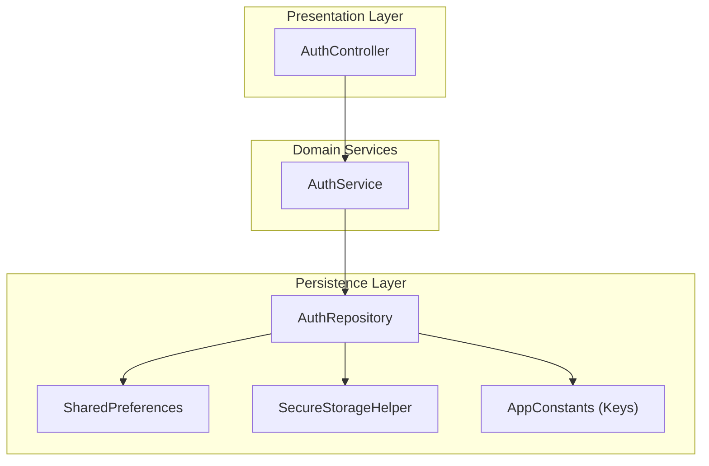

**Diagram sources**
- [auth_controller.dart:19-414](file://lib/features/auth/controllers/auth_controller.dart#L19-L414)
- [auth_service.dart:9-205](file://lib/features/auth/domain/services/auth_service.dart#L9-L205)
- [auth_repository.dart:19-462](file://lib/features/auth/domain/reposotories/auth_repository.dart#L19-L462)
- [secure_storage_helper.dart:3-56](file://lib/helper/secure_storage_helper.dart#L3-L56)
- [app_constants.dart:276-306](file://lib/util/app_constants.dart#L276-L306)

**Section sources**
- [auth_controller.dart:19-414](file://lib/features/auth/controllers/auth_controller.dart#L19-L414)
- [auth_service.dart:9-205](file://lib/features/auth/domain/services/auth_service.dart#L9-L205)
- [auth_repository.dart:19-462](file://lib/features/auth/domain/reposotories/auth_repository.dart#L19-L462)
- [secure_storage_helper.dart:3-56](file://lib/helper/secure_storage_helper.dart#L3-L56)
- [app_constants.dart:276-306](file://lib/util/app_constants.dart#L276-L306)

## Core Components
- AuthHelper: Thin wrapper around AuthController for session checks and guest ID retrieval.
- AuthController: Orchestrates login, OTP login, token updates, guest login, and logout/cleanup.
- AuthService: Implements service-level logic for registration, login, OTP login, token refresh, and state queries.
- AuthRepository: Handles token persistence (SharedPreferences), secure storage migration, guest ID management, and device token handling.
- SecureStorageHelper: Provides secure storage for tokens and passwords using platform-backed secure storage.
- AppConstants: Centralizes shared preference keys and API endpoints used during session management.

Key responsibilities:
- Token storage and retrieval: SharedPreferences for tokens; SecureStorage for sensitive credentials.
- Session validation: isLoggedIn checks presence of token in SharedPreferences.
- Automatic logout: clearSharedData removes tokens, guest IDs, and resets API client headers.
- Token refresh: updateToken posts device token to backend and manages Firebase subscriptions.
- Guest session: guestLogin stores guest ID in SharedPreferences; isGuestLoggedIn checks presence.

**Section sources**
- [auth_helper.dart:4-16](file://lib/helper/auth_helper.dart#L4-L16)
- [auth_controller.dart:206-227](file://lib/features/auth/controllers/auth_controller.dart#L206-L227)
- [auth_service.dart:42-48](file://lib/features/auth/domain/services/auth_service.dart#L42-L48)
- [auth_repository.dart:143-171](file://lib/features/auth/domain/reposotories/auth_repository.dart#L143-L171)
- [auth_repository.dart:285-320](file://lib/features/auth/domain/reposotories/auth_repository.dart#L285-L320)
- [auth_repository.dart:174-217](file://lib/features/auth/domain/reposotories/auth_repository.dart#L174-L217)
- [secure_storage_helper.dart:13-54](file://lib/helper/secure_storage_helper.dart#L13-L54)
- [app_constants.dart:276-306](file://lib/util/app_constants.dart#L276-L306)

## Architecture Overview
The session lifecycle integrates UI actions with service and repository layers, persisting tokens and guest identifiers while synchronizing authentication state with the API client.

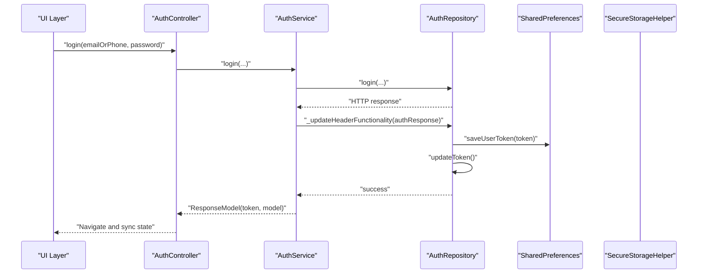

**Diagram sources**
- [auth_controller.dart:62-82](file://lib/features/auth/controllers/auth_controller.dart#L62-L82)
- [auth_service.dart:31-40](file://lib/features/auth/domain/services/auth_service.dart#L31-L40)
- [auth_service.dart:42-48](file://lib/features/auth/domain/services/auth_service.dart#L42-L48)
- [auth_repository.dart:143-171](file://lib/features/auth/domain/reposotories/auth_repository.dart#L143-L171)
- [auth_repository.dart:174-217](file://lib/features/auth/domain/reposotories/auth_repository.dart#L174-L217)

## Detailed Component Analysis

### AuthHelper Utility
AuthHelper provides lightweight helpers for session checks and guest ID retrieval by delegating to AuthController.

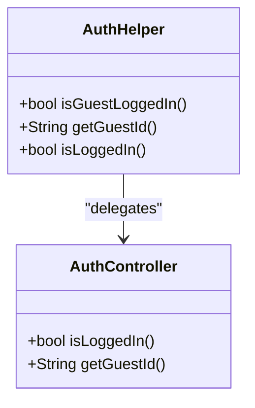

**Diagram sources**
- [auth_helper.dart:4-16](file://lib/helper/auth_helper.dart#L4-L16)
- [auth_controller.dart:210-220](file://lib/features/auth/controllers/auth_controller.dart#L210-L220)

**Section sources**
- [auth_helper.dart:4-16](file://lib/helper/auth_helper.dart#L4-L16)
- [auth_controller.dart:210-220](file://lib/features/auth/controllers/auth_controller.dart#L210-L220)

### Session Validation and Middleware
- isLoggedIn checks token presence in SharedPreferences.
- AuthGuardMiddleware redirects unauthenticated routes to the unified authentication screen.

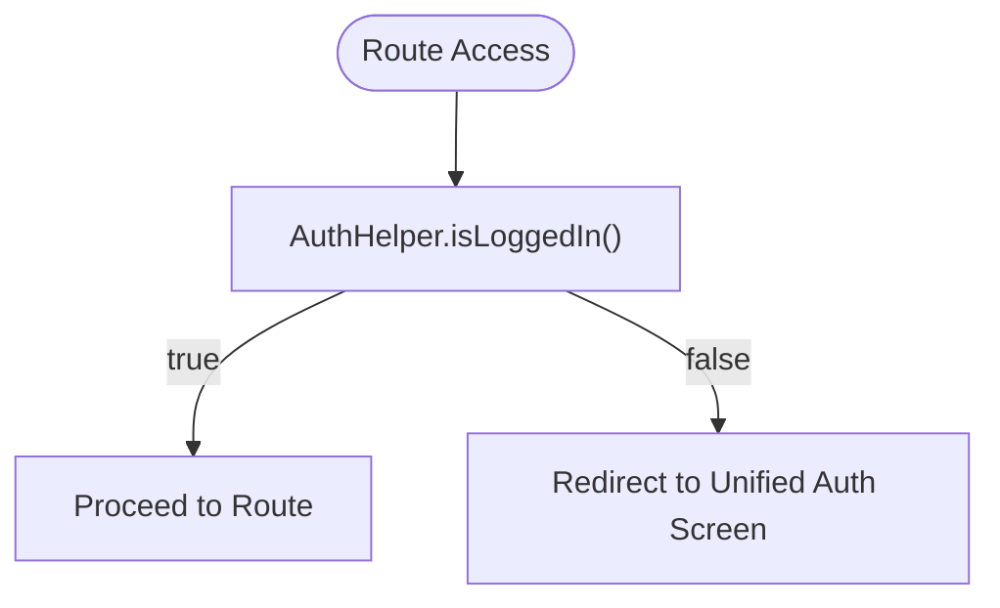

**Diagram sources**
- [auth_guard_middleware.dart:14-16](file://lib/common/widgets/auth_guard_middleware.dart#L14-L16)
- [auth_helper.dart:13-15](file://lib/helper/auth_helper.dart#L13-L15)

**Section sources**
- [auth_guard_middleware.dart:14-16](file://lib/common/widgets/auth_guard_middleware.dart#L14-L16)
- [auth_helper.dart:13-15](file://lib/helper/auth_helper.dart#L13-L15)

### Token Storage and Retrieval
- SharedPreferences:
  - saveUserToken writes the JWT token and updates the HTTP client header.
  - getUserToken reads the stored token.
  - isLoggedIn checks token existence.
- SecureStorageHelper:
  - saveToken/getToken/deleteToken manage the primary auth token securely.
  - savePassword/getPassword/deletePassword manage remembered credentials.
  - clearAll clears all secure entries.

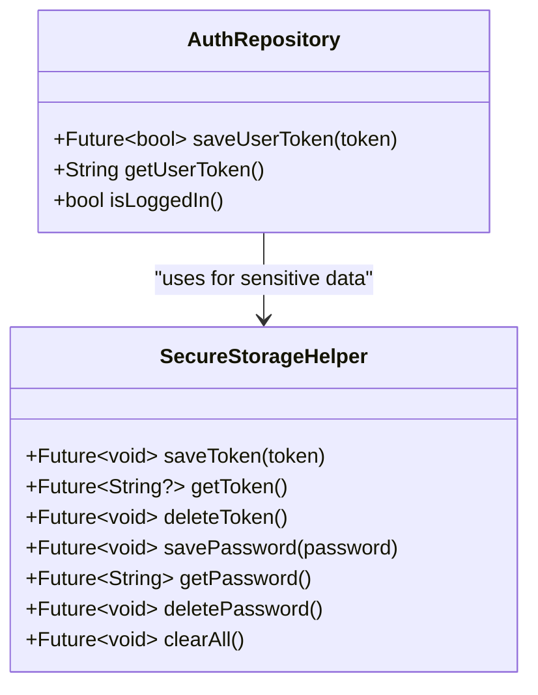

**Diagram sources**
- [auth_repository.dart:143-171](file://lib/features/auth/domain/reposotories/auth_repository.dart#L143-L171)
- [auth_repository.dart:254-256](file://lib/features/auth/domain/reposotories/auth_repository.dart#L254-L256)
- [secure_storage_helper.dart:13-54](file://lib/helper/secure_storage_helper.dart#L13-L54)

**Section sources**
- [auth_repository.dart:143-171](file://lib/features/auth/domain/reposotories/auth_repository.dart#L143-L171)
- [auth_repository.dart:254-256](file://lib/features/auth/domain/reposotories/auth_repository.dart#L254-L256)
- [secure_storage_helper.dart:13-54](file://lib/helper/secure_storage_helper.dart#L13-L54)

### Token Refresh and Device Notifications
- updateToken posts the device token to the backend endpoint and manages Firebase topics subscription/unsubscription based on notification settings.
- saveDeviceToken retrieves the FCM/APNs token with platform-specific handling.

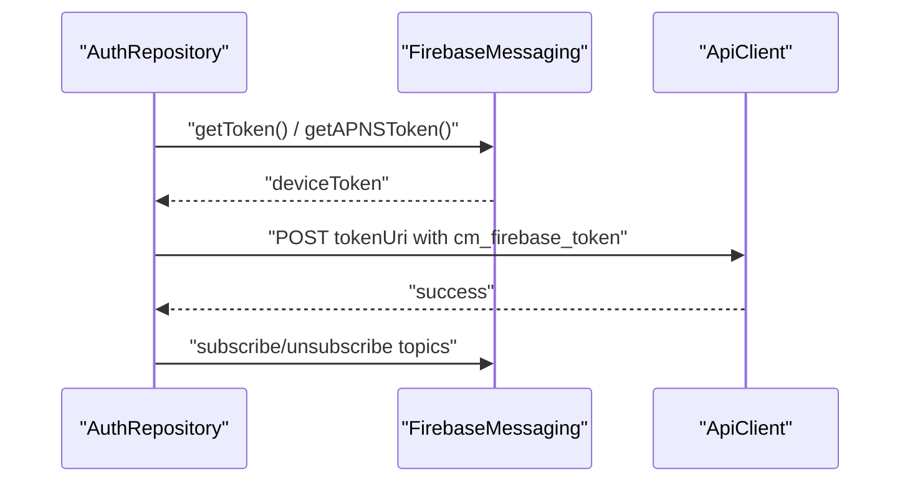

**Diagram sources**
- [auth_repository.dart:174-217](file://lib/features/auth/domain/reposotories/auth_repository.dart#L174-L217)
- [auth_repository.dart:220-251](file://lib/features/auth/domain/reposotories/auth_repository.dart#L220-L251)

**Section sources**
- [auth_repository.dart:174-217](file://lib/features/auth/domain/reposotories/auth_repository.dart#L174-L217)
- [auth_repository.dart:220-251](file://lib/features/auth/domain/reposotories/auth_repository.dart#L220-L251)

### Guest Session Management
- guestLogin requests a guest ID and persists it in SharedPreferences.
- isGuestLoggedIn checks for the presence of guest ID.
- getSharedPrefGuestId retrieves the guest ID for use in login requests.

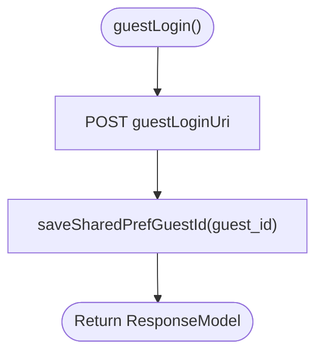

**Diagram sources**
- [auth_repository.dart:89-102](file://lib/features/auth/domain/reposotories/auth_repository.dart#L89-L102)
- [auth_repository.dart:258-276](file://lib/features/auth/domain/reposotories/auth_repository.dart#L258-L276)
- [auth_repository.dart:264-266](file://lib/features/auth/domain/reposotories/auth_repository.dart#L264-L266)

**Section sources**
- [auth_repository.dart:89-102](file://lib/features/auth/domain/reposotories/auth_repository.dart#L89-L102)
- [auth_repository.dart:258-276](file://lib/features/auth/domain/reposotories/auth_repository.dart#L258-L276)
- [auth_repository.dart:264-266](file://lib/features/auth/domain/reposotories/auth_repository.dart#L264-L266)

### Automatic Logout and Cleanup
- clearSharedData removes the token, guest ID, cart list, and clears secure storage; it also unsubscribes from Firebase topics and resets the API client header.
- clearUserNumberAndPassword removes remembered credentials from both SharedPreferences and secure storage.

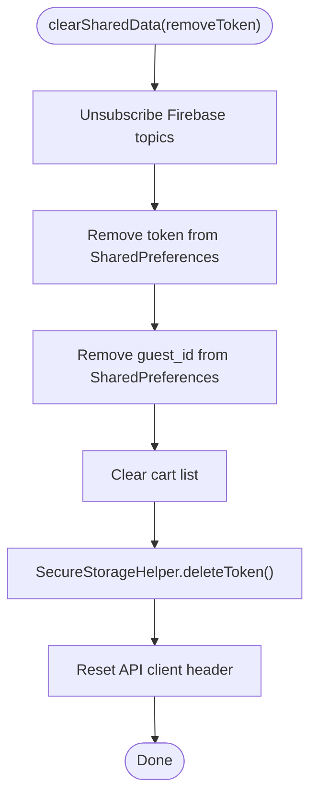

**Diagram sources**
- [auth_repository.dart:285-320](file://lib/features/auth/domain/reposotories/auth_repository.dart#L285-L320)
- [secure_storage_helper.dart:21-23](file://lib/helper/secure_storage_helper.dart#L21-L23)

**Section sources**
- [auth_repository.dart:285-320](file://lib/features/auth/domain/reposotories/auth_repository.dart#L285-L320)
- [secure_storage_helper.dart:21-23](file://lib/helper/secure_storage_helper.dart#L21-L23)

### Session Restoration and Remember Me
- Remember Me stores the user’s password in secure storage and number in SharedPreferences.
- getUserPassword includes a migration path from legacy SharedPreferences to secure storage.
- clearUserNumberAndPassword removes remembered credentials from both storage layers.

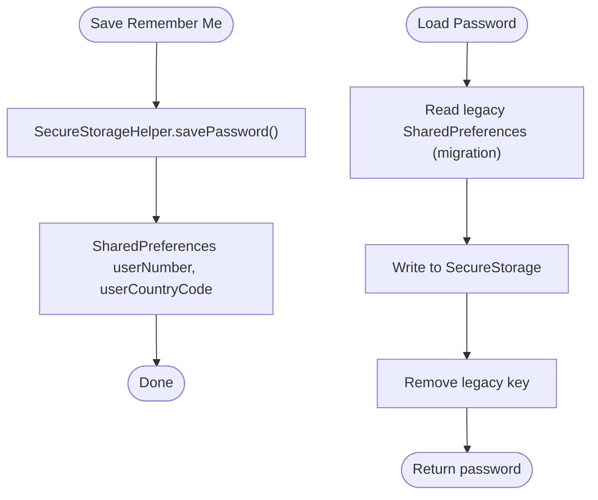

**Diagram sources**
- [auth_repository.dart:323-338](file://lib/features/auth/domain/reposotories/auth_repository.dart#L323-L338)
- [auth_repository.dart:350-362](file://lib/features/auth/domain/reposotories/auth_repository.dart#L350-L362)
- [secure_storage_helper.dart:26-32](file://lib/helper/secure_storage_helper.dart#L26-L32)

**Section sources**
- [auth_repository.dart:323-338](file://lib/features/auth/domain/reposotories/auth_repository.dart#L323-L338)
- [auth_repository.dart:350-362](file://lib/features/auth/domain/reposotories/auth_repository.dart#L350-L362)
- [secure_storage_helper.dart:26-32](file://lib/helper/secure_storage_helper.dart#L26-L32)

### Configuration Options and Keys
- Token and guest identifiers are stored under SharedPreferences keys defined in AppConstants.
- Notification settings and device tokens are managed alongside token updates.

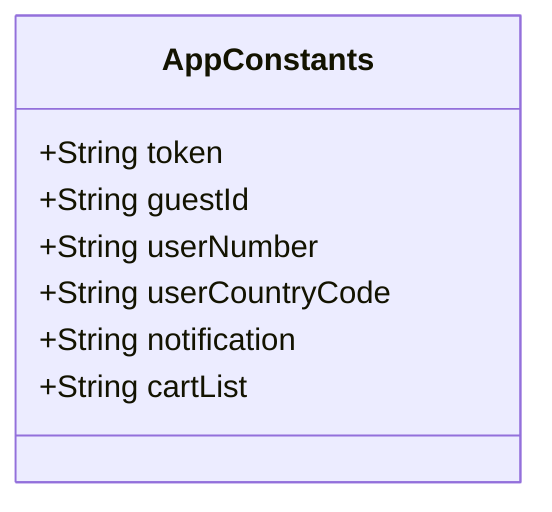

**Diagram sources**
- [app_constants.dart:276-306](file://lib/util/app_constants.dart#L276-L306)

**Section sources**
- [app_constants.dart:276-306](file://lib/util/app_constants.dart#L276-L306)

## Dependency Analysis
The session management stack follows a layered dependency pattern with clear separation of concerns.

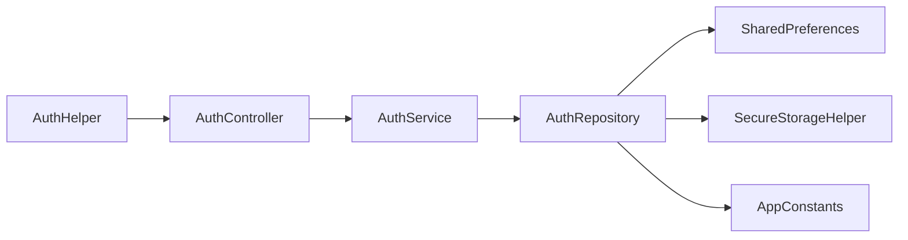

**Diagram sources**
- [auth_helper.dart:4-16](file://lib/helper/auth_helper.dart#L4-L16)
- [auth_controller.dart:19-414](file://lib/features/auth/controllers/auth_controller.dart#L19-L414)
- [auth_service.dart:9-205](file://lib/features/auth/domain/services/auth_service.dart#L9-L205)
- [auth_repository.dart:19-462](file://lib/features/auth/domain/reposotories/auth_repository.dart#L19-L462)
- [secure_storage_helper.dart:3-56](file://lib/helper/secure_storage_helper.dart#L3-L56)
- [app_constants.dart:276-306](file://lib/util/app_constants.dart#L276-L306)

**Section sources**
- [auth_helper.dart:4-16](file://lib/helper/auth_helper.dart#L4-L16)
- [auth_controller.dart:19-414](file://lib/features/auth/controllers/auth_controller.dart#L19-L414)
- [auth_service.dart:9-205](file://lib/features/auth/domain/services/auth_service.dart#L9-L205)
- [auth_repository.dart:19-462](file://lib/features/auth/domain/reposotories/auth_repository.dart#L19-L462)
- [secure_storage_helper.dart:3-56](file://lib/helper/secure_storage_helper.dart#L3-L56)
- [app_constants.dart:276-306](file://lib/util/app_constants.dart#L276-L306)

## Performance Considerations
- Minimize synchronous disk I/O: Prefer asynchronous operations for token and credential reads/writes.
- Reduce redundant network calls: updateToken should be invoked only when notification settings change or device token is refreshed.
- Avoid blocking UI: Keep token operations off the UI thread; use GetX controllers’ reactive state appropriately.
- Cache frequently accessed values: Store token and guest ID in memory where safe, but rely on persistent storage for durability.
- Efficient logout: clearSharedData performs bulk cleanup; ensure it runs once per logout to avoid partial cleanup.

## Troubleshooting Guide
Common issues and resolutions:
- Token not found after login:
  - Verify saveUserToken writes to SharedPreferences and updates the API client header.
  - Confirm isLoggedIn checks the correct key.
- Device token errors:
  - On iOS, ensure APNs token availability before retrieving FCM token; handle delays gracefully.
  - Unsubscribe from topics on logout to prevent stale subscriptions.
- Remember Me not working:
  - Check migration from legacy SharedPreferences to secure storage.
  - Ensure clearUserNumberAndPassword removes both legacy and secure entries.
- Guest session inconsistencies:
  - Confirm guestLogin persists guest ID and subsequent login requests include guest_id.
  - Validate isGuestLoggedIn checks for guest ID presence.

**Section sources**
- [auth_repository.dart:143-171](file://lib/features/auth/domain/reposotories/auth_repository.dart#L143-L171)
- [auth_repository.dart:254-256](file://lib/features/auth/domain/reposotories/auth_repository.dart#L254-L256)
- [auth_repository.dart:220-251](file://lib/features/auth/domain/reposotories/auth_repository.dart#L220-L251)
- [auth_repository.dart:350-362](file://lib/features/auth/domain/reposotories/auth_repository.dart#L350-L362)
- [auth_repository.dart:89-102](file://lib/features/auth/domain/reposotories/auth_repository.dart#L89-L102)
- [auth_repository.dart:258-276](file://lib/features/auth/domain/reposotories/auth_repository.dart#L258-L276)

## Conclusion
The session management component provides a robust, layered approach to handling user sessions, token storage, and authentication state synchronization. By combining SharedPreferences for general persistence, SecureStorage for sensitive data, and service/repository layers for orchestration, the system supports secure, reliable session handling across platforms. Proper use of middleware ensures automatic login detection, while clearSharedData and updateToken provide clean logout and token refresh mechanisms. Adhering to the recommendations above will help maintain performance, security, and reliability.