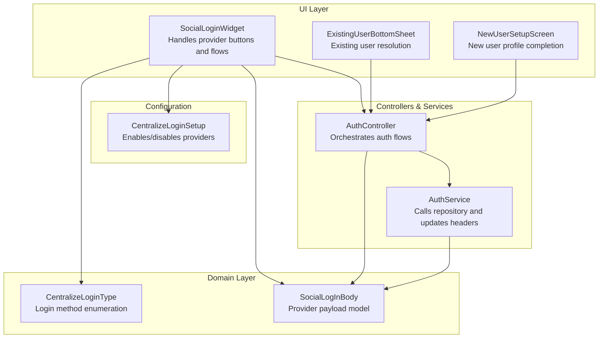
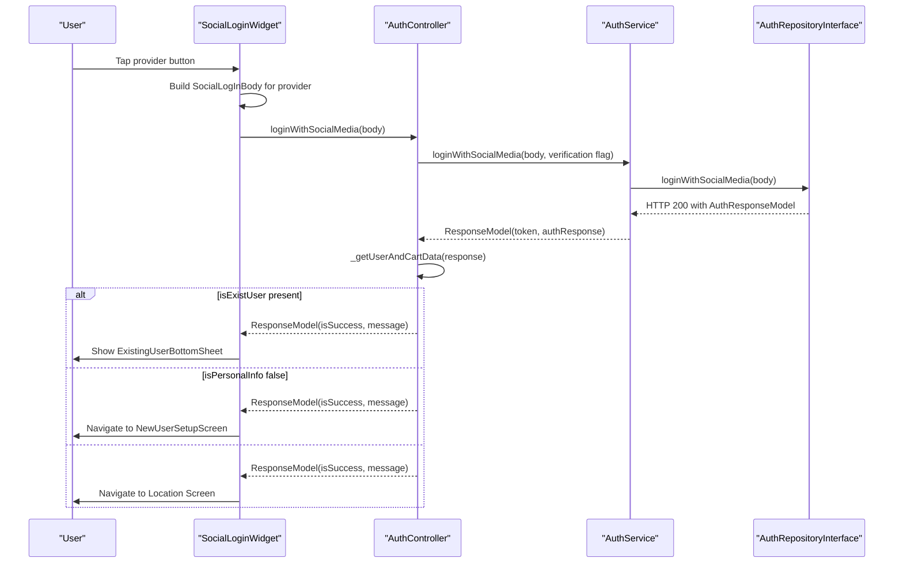
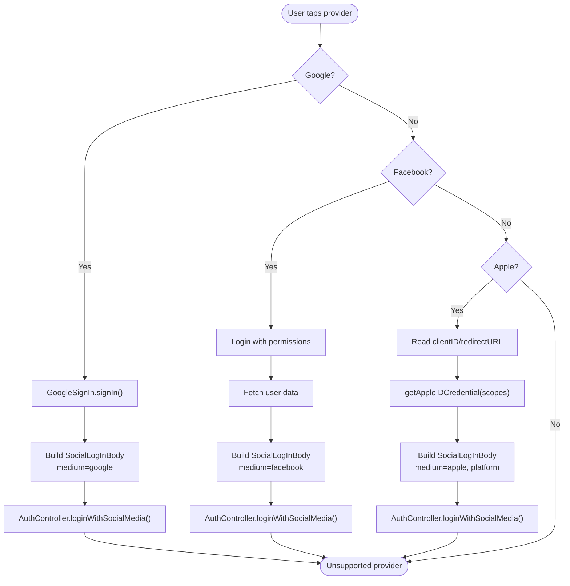
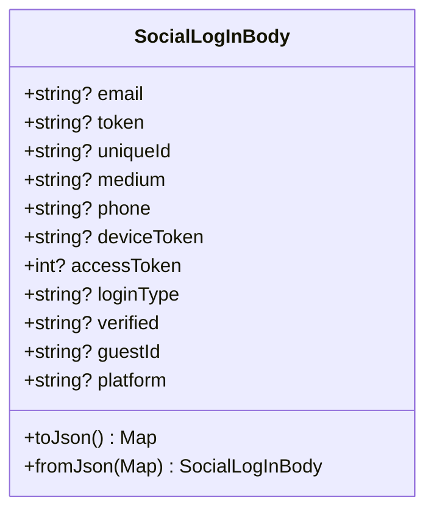
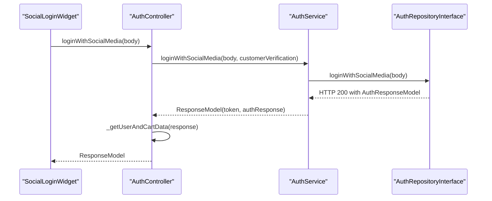
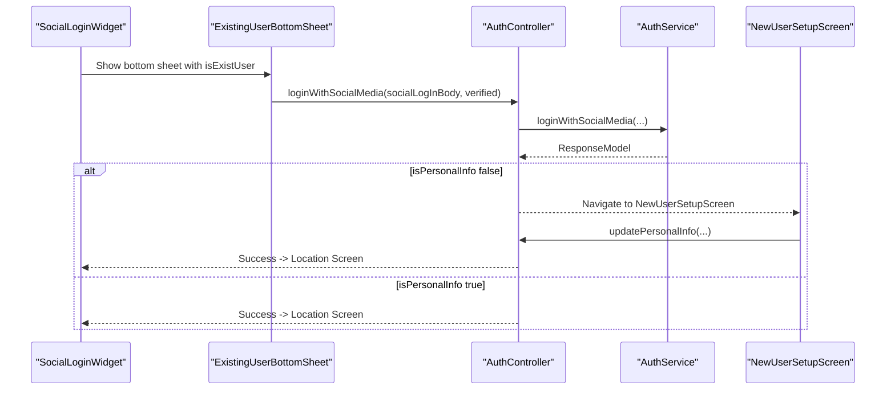
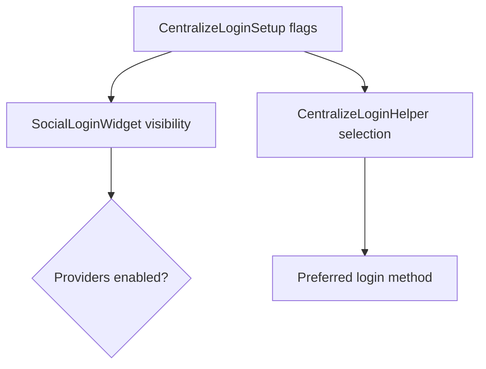
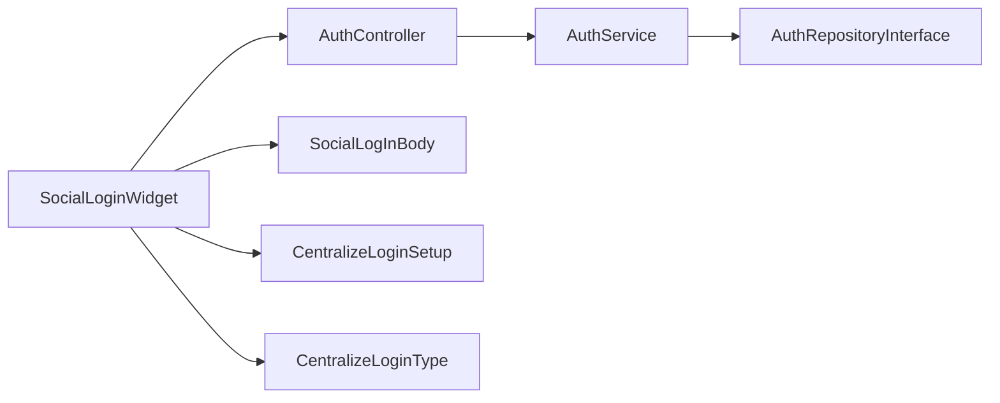

# Social Login Integration

<cite>
**Referenced Files in This Document**
- [social_login_widget.dart](file://lib/features/auth/widgets/social_login_widget.dart)
- [social_log_in_body.dart](file://lib/features/auth/domain/models/social_log_in_body.dart)
- [auth_controller.dart](file://lib/features/auth/controllers/auth_controller.dart)
- [auth_service.dart](file://lib/features/auth/domain/services/auth_service.dart)
- [existing_user_bottom_sheet.dart](file://lib/features/auth/widgets/sign_in/existing_user_bottom_sheet.dart)
- [new_user_setup_screen.dart](file://lib/features/auth/screens/new_user_setup_screen.dart)
- [centralize_login_helper.dart](file://lib/helper/centralize_login_helper.dart)
- [centralize_login_enum.dart](file://lib/features/auth/domain/enum/centralize_login_enum.dart)
- [config_model.dart](file://lib/common/models/config_model.dart)
</cite>

## Table of Contents
1. [Introduction](#introduction)
2. [Project Structure](#project-structure)
3. [Core Components](#core-components)
4. [Architecture Overview](#architecture-overview)
5. [Detailed Component Analysis](#detailed-component-analysis)
6. [Dependency Analysis](#dependency-analysis)
7. [Performance Considerations](#performance-considerations)
8. [Troubleshooting Guide](#troubleshooting-guide)
9. [Conclusion](#conclusion)

## Introduction
This document explains the social login integration for Facebook, Google, and Apple Sign-In within the application. It covers the social login widget configuration, authentication flow management, the social login body model structure, response handling, and token management per provider. It also documents how the system integrates with centralized login configuration, handles existing-user detection, and manages new user setup flows. Provider-specific parameters, return values, and error handling strategies are included, along with guidance on common issues, provider limitations, and fallback mechanisms.

## Project Structure
The social login feature is implemented across UI widgets, domain models, controllers, services, and configuration models. The primary entry point is the social login widget, which orchestrates provider-specific flows and delegates authentication to the AuthController and AuthService layers. Configuration flags from the centralized login setup determine which providers are enabled and how the UI renders.

**Diagram sources**
- [social_login_widget.dart:24-349](file://lib/features/auth/widgets/social_login_widget.dart#L24-L349)
- [auth_controller.dart:19-137](file://lib/features/auth/controllers/auth_controller.dart#L19-L137)
- [auth_service.dart:9-77](file://lib/features/auth/domain/services/auth_service.dart#L9-L77)
- [social_log_in_body.dart:1-66](file://lib/features/auth/domain/models/social_log_in_body.dart#L1-L66)
- [centralize_login_enum.dart:1-9](file://lib/features/auth/domain/enum/centralize_login_enum.dart#L1-L9)
- [config_model.dart:801-845](file://lib/common/models/config_model.dart#L801-L845)
- [existing_user_bottom_sheet.dart:19-156](file://lib/features/auth/widgets/sign_in/existing_user_bottom_sheet.dart#L19-L156)
- [new_user_setup_screen.dart:20-207](file://lib/features/auth/screens/new_user_setup_screen.dart#L20-L207)

**Section sources**
- [social_login_widget.dart:24-349](file://lib/features/auth/widgets/social_login_widget.dart#L24-L349)
- [auth_controller.dart:19-137](file://lib/features/auth/controllers/auth_controller.dart#L19-L137)
- [auth_service.dart:9-77](file://lib/features/auth/domain/services/auth_service.dart#L9-L77)
- [social_log_in_body.dart:1-66](file://lib/features/auth/domain/models/social_log_in_body.dart#L1-L66)
- [config_model.dart:801-845](file://lib/common/models/config_model.dart#L801-L845)
- [centralize_login_enum.dart:1-9](file://lib/features/auth/domain/enum/centralize_login_enum.dart#L1-L9)

## Core Components
- SocialLoginWidget: Renders provider buttons based on centralized login configuration, initiates provider flows, and routes users to existing-user resolution or new-user setup based on server responses.
- SocialLogInBody: Encapsulates the payload sent to the backend for each provider, including email, tokens, identifiers, and metadata.
- AuthController: Coordinates social login calls, manages loading states, and triggers UI navigation based on response outcomes.
- AuthService: Delegates to the repository, parses responses, and updates headers/token storage.
- Centralized Login Setup: Provides flags to enable/disable providers and control UI rendering.
- ExistingUserBottomSheet and NewUserSetupScreen: Handle user resolution and profile completion flows after successful provider authentication.

**Section sources**
- [social_login_widget.dart:24-349](file://lib/features/auth/widgets/social_login_widget.dart#L24-L349)
- [social_log_in_body.dart:1-66](file://lib/features/auth/domain/models/social_log_in_body.dart#L1-L66)
- [auth_controller.dart:19-137](file://lib/features/auth/controllers/auth_controller.dart#L19-L137)
- [auth_service.dart:9-77](file://lib/features/auth/domain/services/auth_service.dart#L9-L77)
- [config_model.dart:801-845](file://lib/common/models/config_model.dart#L801-L845)
- [existing_user_bottom_sheet.dart:19-156](file://lib/features/auth/widgets/sign_in/existing_user_bottom_sheet.dart#L19-L156)
- [new_user_setup_screen.dart:20-207](file://lib/features/auth/screens/new_user_setup_screen.dart#L20-L207)

## Architecture Overview
The social login flow follows a layered architecture:
- UI layer constructs provider-specific payloads and invokes controller methods.
- Controller calls service to perform authentication via the repository.
- Service parses the response and updates headers/token storage.
- UI navigates to existing-user resolution or new-user setup based on server-provided flags.

**Diagram sources**
- [social_login_widget.dart:237-347](file://lib/features/auth/widgets/social_login_widget.dart#L237-L347)
- [auth_controller.dart:122-137](file://lib/features/auth/controllers/auth_controller.dart#L122-L137)
- [auth_service.dart:68-77](file://lib/features/auth/domain/services/auth_service.dart#L68-L77)

## Detailed Component Analysis

### SocialLoginWidget: Provider Integrations and UI Rendering
- Google Sign-In:
  - Initializes GoogleSignIn and signs out previous sessions.
  - Retrieves GoogleSignInAccount and authentication credentials.
  - Builds SocialLogInBody with email, access token, unique ID, and provider metadata.
  - Calls AuthController.loginWithSocialMedia and processes response.
- Facebook Login:
  - Uses FacebookAuth with permissions for public profile and email.
  - Fetches user data and builds SocialLogInBody with email, access token, and unique ID.
  - Calls AuthController.loginWithSocialMedia and processes response.
- Apple Sign-In:
  - Reads client ID and redirect URL from centralized config.
  - Requests email and full name scopes; uses web authentication options for non-iOS platforms.
  - Builds SocialLogInBody with email, authorization code, and platform metadata.
  - Calls AuthController.loginWithSocialMedia and processes response.
- UI Rendering:
  - Determines availability of providers based on centralized login flags and platform support.
  - Supports compact “only social login” mode and inline mode with optional OTP button.
  - Handles desktop vs mobile presentation differences.

**Diagram sources**
- [social_login_widget.dart:237-308](file://lib/features/auth/widgets/social_login_widget.dart#L237-L308)

**Section sources**
- [social_login_widget.dart:24-349](file://lib/features/auth/widgets/social_login_widget.dart#L24-L349)

### SocialLogInBody: Payload Model and Serialization
- Fields include email, token, uniqueId, medium, phone, deviceToken, accessToken, loginType, verified, guestId, and platform.
- Supports JSON serialization/deserialization for transport to the backend.
- Used consistently across all provider flows to standardize payload structure.

**Diagram sources**
- [social_log_in_body.dart:1-66](file://lib/features/auth/domain/models/social_log_in_body.dart#L1-L66)

**Section sources**
- [social_log_in_body.dart:1-66](file://lib/features/auth/domain/models/social_log_in_body.dart#L1-L66)

### AuthController and AuthService: Authentication Orchestration
- AuthController.loginWithSocialMedia:
  - Sets loading state, calls AuthService.loginWithSocialMedia, and triggers post-login actions via _getUserAndCartData.
- AuthService.loginWithSocialMedia:
  - Invokes repository, parses response into AuthResponseModel, and updates headers/token storage when appropriate.

**Diagram sources**
- [auth_controller.dart:122-137](file://lib/features/auth/controllers/auth_controller.dart#L122-L137)
- [auth_service.dart:68-77](file://lib/features/auth/domain/services/auth_service.dart#L68-L77)

**Section sources**
- [auth_controller.dart:122-137](file://lib/features/auth/controllers/auth_controller.dart#L122-L137)
- [auth_service.dart:68-77](file://lib/features/auth/domain/services/auth_service.dart#L68-L77)

### Existing User Resolution and New User Setup
- ExistingUserBottomSheet:
  - Presents a bottom sheet/dialog to confirm whether the incoming identity matches an existing account.
  - On “no,” re-invokes loginWithSocialMedia with verified set to “no.”
  - On “yes,” re-invokes loginWithSocialMedia with verified set to “yes.”
  - Routes to new user setup or location screen depending on isPersonalInfo flag.
- NewUserSetupScreen:
  - Collects missing personal info (name, phone/email, optional referral code) for new users.
  - Calls AuthController.updatePersonalInfo and proceeds to location screen upon success.

**Diagram sources**
- [existing_user_bottom_sheet.dart:85-131](file://lib/features/auth/widgets/sign_in/existing_user_bottom_sheet.dart#L85-L131)
- [new_user_setup_screen.dart:191-205](file://lib/features/auth/screens/new_user_setup_screen.dart#L191-L205)

**Section sources**
- [existing_user_bottom_sheet.dart:19-156](file://lib/features/auth/widgets/sign_in/existing_user_bottom_sheet.dart#L19-L156)
- [new_user_setup_screen.dart:20-207](file://lib/features/auth/screens/new_user_setup_screen.dart#L20-L207)

### Centralized Login Configuration and Provider Flags
- CentralizeLoginSetup:
  - Controls availability of manual login, OTP login, social login, Google, Facebook, Apple, and verification statuses.
- SocialLoginWidget:
  - Uses CentralizeLoginSetup flags and provider status to decide which buttons to render and whether Apple login is supported (non-Android platforms).
- CentralizeLoginHelper:
  - Computes preferred login method based on flags and UI sizing preferences.

**Diagram sources**
- [config_model.dart:801-845](file://lib/common/models/config_model.dart#L801-L845)
- [social_login_widget.dart:34-47](file://lib/features/auth/widgets/social_login_widget.dart#L34-L47)
- [centralize_login_helper.dart:5-23](file://lib/helper/centralize_login_helper.dart#L5-L23)

**Section sources**
- [config_model.dart:801-845](file://lib/common/models/config_model.dart#L801-L845)
- [social_login_widget.dart:34-47](file://lib/features/auth/widgets/social_login_widget.dart#L34-L47)
- [centralize_login_helper.dart:5-23](file://lib/helper/centralize_login_helper.dart#L5-L23)

## Dependency Analysis
- UI depends on AuthController for authentication and on configuration models for provider availability.
- AuthController depends on AuthService for network operations.
- AuthService depends on AuthRepositoryInterface for backend calls.
- SocialLoginWidget depends on provider SDKs (GoogleSignIn, FacebookAuth, SignInWithApple) and localized strings.

**Diagram sources**
- [social_login_widget.dart:24-349](file://lib/features/auth/widgets/social_login_widget.dart#L24-L349)
- [auth_controller.dart:19-137](file://lib/features/auth/controllers/auth_controller.dart#L19-L137)
- [auth_service.dart:9-77](file://lib/features/auth/domain/services/auth_service.dart#L9-L77)
- [social_log_in_body.dart:1-66](file://lib/features/auth/domain/models/social_log_in_body.dart#L1-L66)
- [config_model.dart:801-845](file://lib/common/models/config_model.dart#L801-L845)
- [centralize_login_enum.dart:1-9](file://lib/features/auth/domain/enum/centralize_login_enum.dart#L1-L9)

**Section sources**
- [social_login_widget.dart:24-349](file://lib/features/auth/widgets/social_login_widget.dart#L24-L349)
- [auth_controller.dart:19-137](file://lib/features/auth/controllers/auth_controller.dart#L19-L137)
- [auth_service.dart:9-77](file://lib/features/auth/domain/services/auth_service.dart#L9-L77)
- [social_log_in_body.dart:1-66](file://lib/features/auth/domain/models/social_log_in_body.dart#L1-L66)
- [config_model.dart:801-845](file://lib/common/models/config_model.dart#L801-L845)
- [centralize_login_enum.dart:1-9](file://lib/features/auth/domain/enum/centralize_login_enum.dart#L1-L9)

## Performance Considerations
- Minimize UI rebuilds by using GetBuilder sparingly and avoiding unnecessary state updates.
- Debounce or coalesce repeated provider clicks during authentication flows.
- Cache provider configuration flags to avoid repeated reads from SplashController.
- Avoid heavy computations in UI thread; delegate to controllers/services.

## Troubleshooting Guide
Common issues and resolutions:
- Google Sign-In fails silently:
  - Ensure GoogleSignIn is initialized and signOut is called before signing in.
  - Verify that the access token and unique ID are extracted from the authentication result.
  - Confirm that the backend expects the correct token field names and provider medium.
- Facebook Login permission denied:
  - Ensure permissions include public_profile and email.
  - Handle LoginStatus.success before fetching user data.
  - Validate that the returned access token and user ID are populated.
- Apple Sign-In web authentication mismatch:
  - For non-iOS platforms, ensure client ID and redirect URL are configured in centralized settings.
  - Confirm scopes include email and fullName.
  - On iOS, omit webAuthenticationOptions; on web/desktop, provide clientId and redirectUri.
- Existing user detected:
  - Use ExistingUserBottomSheet to resolve identity with verified flags.
  - Re-invoke loginWithSocialMedia with verified set to “yes” or “no.”
- New user setup required:
  - Redirect to NewUserSetupScreen to collect name, phone/email, and optional referral code.
  - Call updatePersonalInfo and navigate to the location screen on success.
- Token and header updates:
  - After successful login, headers and token are updated by AuthService; ensure the response contains a valid token and flags indicating completeness.

**Section sources**
- [social_login_widget.dart:237-308](file://lib/features/auth/widgets/social_login_widget.dart#L237-L308)
- [auth_controller.dart:122-137](file://lib/features/auth/controllers/auth_controller.dart#L122-L137)
- [auth_service.dart:68-77](file://lib/features/auth/domain/services/auth_service.dart#L68-L77)
- [existing_user_bottom_sheet.dart:85-131](file://lib/features/auth/widgets/sign_in/existing_user_bottom_sheet.dart#L85-L131)
- [new_user_setup_screen.dart:191-205](file://lib/features/auth/screens/new_user_setup_screen.dart#L191-L205)

## Conclusion
The social login integration provides a unified, configurable experience across Google, Facebook, and Apple Sign-In. The SocialLoginWidget composes provider-specific flows, while AuthController and AuthService handle cross-cutting concerns such as loading states, response parsing, and token/header updates. Centralized configuration flags govern provider availability and UI rendering. The system supports robust user resolution and new user setup flows, ensuring a smooth onboarding experience across platforms.