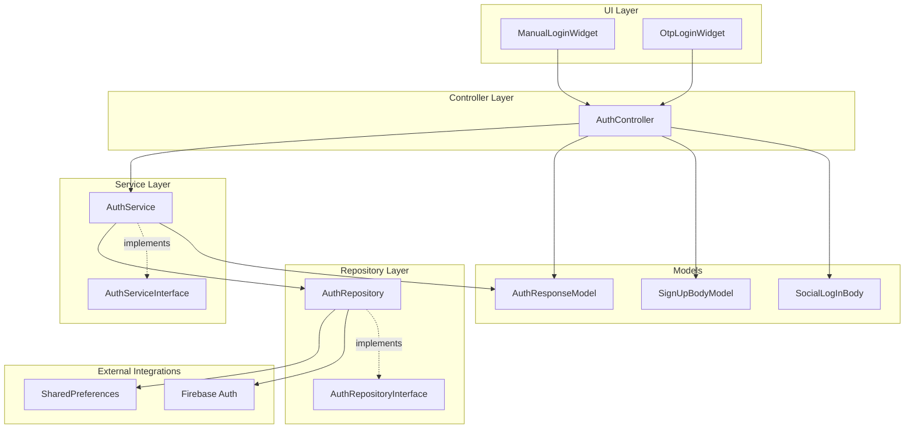
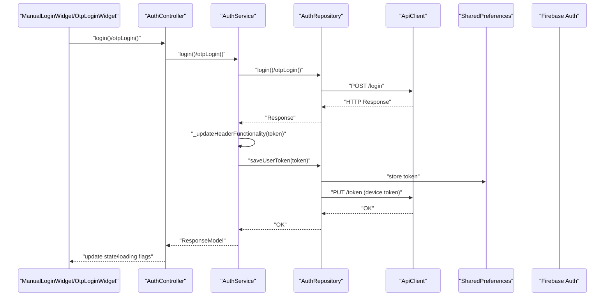
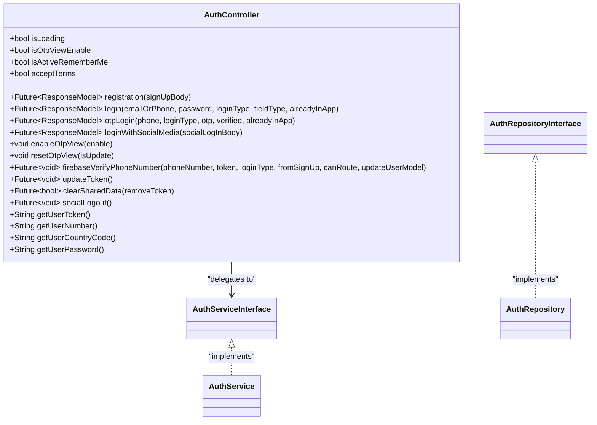
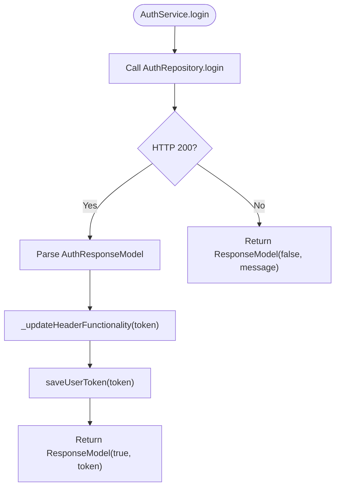
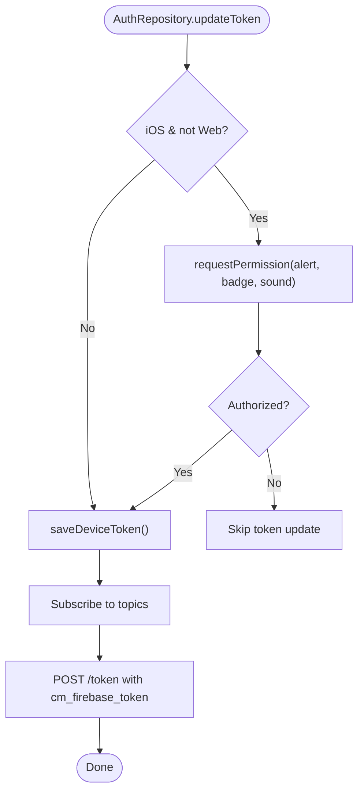
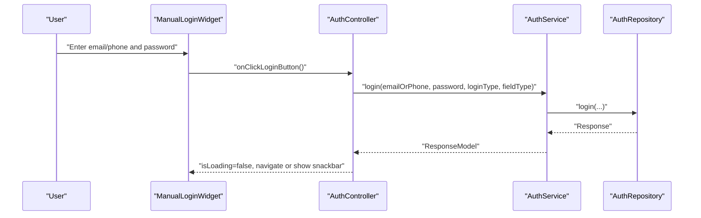
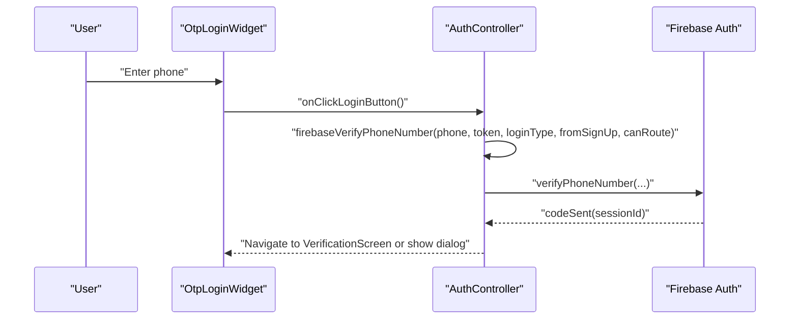
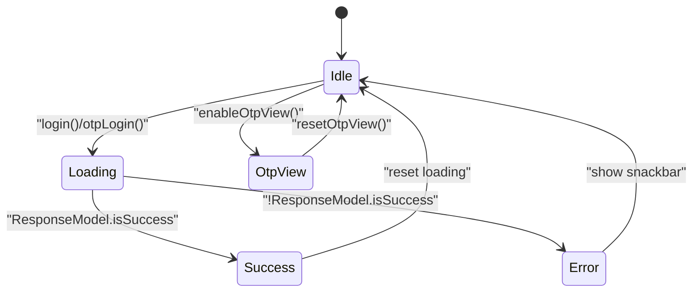
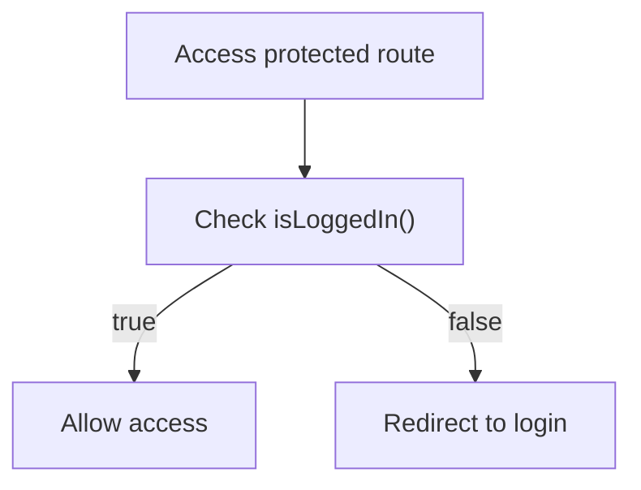
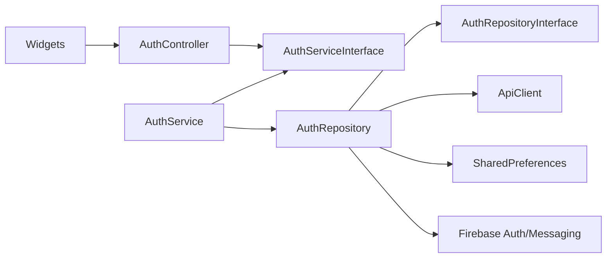

# User Authentication

<cite>
**Referenced Files in This Document**
- [auth_controller.dart](file://lib/features/auth/controllers/auth_controller.dart)
- [auth_service.dart](file://lib/features/auth/domain/services/auth_service.dart)
- [auth_service_interface.dart](file://lib/features/auth/domain/services/auth_service_interface.dart)
- [auth_repository.dart](file://lib/features/auth/domain/reposotories/auth_repository.dart)
- [auth_repository_interface.dart](file://lib/features/auth/domain/reposotories/auth_repository_interface.dart)
- [manual_login_widget.dart](file://lib/features/auth/widgets/sign_in/manual_login_widget.dart)
- [otp_login_widget.dart](file://lib/features/auth/widgets/sign_in/otp_login_widget.dart)
- [auth_response_model.dart](file://lib/features/auth/domain/models/auth_response_model.dart)
- [signup_body_model.dart](file://lib/features/auth/domain/models/signup_body_model.dart)
- [social_log_in_body.dart](file://lib/features/auth/domain/models/social_log_in_body.dart)
- [auth_guard_middleware.dart](file://lib/common/widgets/auth_guard_middleware.dart)
</cite>

## Table of Contents
1. [Introduction](#introduction)
2. [Project Structure](#project-structure)
3. [Core Components](#core-components)
4. [Architecture Overview](#architecture-overview)
5. [Detailed Component Analysis](#detailed-component-analysis)
6. [Dependency Analysis](#dependency-analysis)
7. [Performance Considerations](#performance-considerations)
8. [Troubleshooting Guide](#troubleshooting-guide)
9. [Conclusion](#conclusion)

## Introduction
This document explains the user authentication component, focusing on the AuthController implementation, user registration and login mechanisms, manual login and OTP verification processes. It documents the authentication flow from user input to token validation, including error handling and state management. Concrete examples from the actual codebase illustrate login widget implementations, OTP verification logic, and authentication state transitions. Configuration options for login providers, parameters for authentication requests, and return values for authentication operations are described. The relationships with Firebase Authentication, shared preferences storage, and route protection mechanisms are addressed, along with common authentication issues, security considerations, and performance optimization strategies.

## Project Structure
The authentication subsystem is organized around a layered architecture:
- Controllers orchestrate UI interactions and coordinate service calls.
- Services encapsulate business logic and translate domain models.
- Repositories handle network requests and persistent storage.
- Models define request/response structures.
- Widgets implement UI for manual login and OTP flows.
- Middleware protects routes based on authentication state.

**Diagram sources**
- [auth_controller.dart:19-414](file://lib/features/auth/controllers/auth_controller.dart#L19-L414)
- [auth_service.dart:9-205](file://lib/features/auth/domain/services/auth_service.dart#L9-L205)
- [auth_service_interface.dart:5-35](file://lib/features/auth/domain/services/auth_service_interface.dart#L5-L35)
- [auth_repository.dart:19-462](file://lib/features/auth/domain/reposotories/auth_repository.dart#L19-L462)
- [auth_repository_interface.dart:7-40](file://lib/features/auth/domain/reposotories/auth_repository_interface.dart#L7-L40)
- [manual_login_widget.dart:18-434](file://lib/features/auth/widgets/sign_in/manual_login_widget.dart#L18-L434)
- [otp_login_widget.dart:15-483](file://lib/features/auth/widgets/sign_in/otp_login_widget.dart#L15-L483)
- [auth_response_model.dart:1-66](file://lib/features/auth/domain/models/auth_response_model.dart#L1-L66)
- [signup_body_model.dart:1-50](file://lib/features/auth/domain/models/signup_body_model.dart#L1-L50)
- [social_log_in_body.dart:1-66](file://lib/features/auth/domain/models/social_log_in_body.dart#L1-L66)

**Section sources**
- [auth_controller.dart:19-414](file://lib/features/auth/controllers/auth_controller.dart#L19-L414)
- [auth_service.dart:9-205](file://lib/features/auth/domain/services/auth_service.dart#L9-L205)
- [auth_repository.dart:19-462](file://lib/features/auth/domain/reposotories/auth_repository.dart#L19-L462)
- [manual_login_widget.dart:18-434](file://lib/features/auth/widgets/sign_in/manual_login_widget.dart#L18-L434)
- [otp_login_widget.dart:15-483](file://lib/features/auth/widgets/sign_in/otp_login_widget.dart#L15-L483)

## Core Components
- AuthController: Central orchestrator managing UI state, loading flags, and coordinating login, OTP, and social login flows. It integrates Firebase Authentication for phone verification and delegates persistence and networking to the service layer.
- AuthService: Implements business logic for registration, login, OTP login, personal info updates, and token management. It translates HTTP responses into ResponseModel and coordinates header/token updates.
- AuthRepository: Handles HTTP requests via ApiClient, manages SharedPreferences for tokens and user preferences, and integrates Firebase Messaging for device token updates and topic subscriptions.
- Models: Define structured request/response payloads for sign-up, social login, and authentication responses.
- Widgets: Provide manual login and OTP input UIs with validation and state feedback.

Key responsibilities:
- Registration: Builds payload from SignUpBodyModel and posts to register endpoint.
- Login: Supports email/phone and password login with field type detection and guest ID propagation.
- OTP Login: Sends phone and optional OTP/verification flags to login endpoint.
- Social Login: Posts social provider credentials with guest ID support.
- Token Management: Saves tokens to SharedPreferences, updates HTTP headers, and refreshes Firebase tokens.
- State Management: Exposes isLoading flags and toggles for remember me, terms acceptance, and OTP view visibility.

**Section sources**
- [auth_controller.dart:51-137](file://lib/features/auth/controllers/auth_controller.dart#L51-L137)
- [auth_service.dart:19-89](file://lib/features/auth/domain/services/auth_service.dart#L19-L89)
- [auth_repository.dart:30-140](file://lib/features/auth/domain/reposotories/auth_repository.dart#L30-L140)
- [auth_response_model.dart:1-66](file://lib/features/auth/domain/models/auth_response_model.dart#L1-L66)
- [signup_body_model.dart:1-50](file://lib/features/auth/domain/models/signup_body_model.dart#L1-L50)
- [social_log_in_body.dart:1-66](file://lib/features/auth/domain/models/social_log_in_body.dart#L1-L66)

## Architecture Overview
The authentication flow follows a clean architecture pattern:
- UI widgets trigger actions on AuthController.
- AuthController delegates to AuthServiceInterface.
- AuthService implements business logic and calls AuthRepositoryInterface.
- AuthRepository performs HTTP requests and manages SharedPreferences/Firebase.
- Responses are normalized into ResponseModel and propagated back to the UI.

**Diagram sources**
- [auth_controller.dart:62-104](file://lib/features/auth/controllers/auth_controller.dart#L62-L104)
- [auth_service.dart:31-60](file://lib/features/auth/domain/services/auth_service.dart#L31-L60)
- [auth_repository.dart:39-86](file://lib/features/auth/domain/reposotories/auth_repository.dart#L39-L86)
- [auth_repository.dart:143-171](file://lib/features/auth/domain/reposotories/auth_repository.dart#L143-L171)
- [auth_repository.dart:210-217](file://lib/features/auth/domain/reposotories/auth_repository.dart#L210-L217)

## Detailed Component Analysis

### AuthController
AuthController is the central orchestrator for authentication flows. It exposes:
- Registration, login, OTP login, and social login methods returning ResponseModel.
- Loading flags (isLoading, guestLoading, notificationLoading) and state toggles (remember me, terms, OTP view).
- Integration with Firebase Authentication for phone verification and OTP delivery.
- Utility methods for token retrieval, clearing shared data, and updating device tokens.

Key behaviors:
- Wraps service calls with loading flags and triggers UI updates.
- On successful login/OTP/social login, fetches user info and cart data when verification flags indicate completeness.
- Manages country dial code initialization based on configuration.
- Provides helpers for saving and retrieving user credentials securely.

**Diagram sources**
- [auth_controller.dart:19-414](file://lib/features/auth/controllers/auth_controller.dart#L19-L414)
- [auth_service_interface.dart:5-35](file://lib/features/auth/domain/services/auth_service_interface.dart#L5-L35)
- [auth_repository_interface.dart:7-40](file://lib/features/auth/domain/reposotories/auth_repository_interface.dart#L7-L40)

**Section sources**
- [auth_controller.dart:19-414](file://lib/features/auth/controllers/auth_controller.dart#L19-L414)

### AuthService
AuthService implements business logic and response normalization:
- Registration: Posts sign-up payload, parses AuthResponseModel, updates headers and token, returns ResponseModel.
- Login: Detects email/phone input, constructs payload with guest ID if present, handles response.
- OTP Login: Builds payload with optional OTP and verified flags, handles response.
- Personal Info Update: Posts name/email/phone and handles response.
- Social Login: Posts social credentials with guest ID and handles response.
- Token Management: Saves token to SharedPreferences, updates HTTP headers, clears guest ID, and updates device token.

**Diagram sources**
- [auth_service.dart:31-48](file://lib/features/auth/domain/services/auth_service.dart#L31-L48)

**Section sources**
- [auth_service.dart:9-205](file://lib/features/auth/domain/services/auth_service.dart#L9-L205)

### AuthRepository
AuthRepository handles persistence and network:
- Registration/Login/OTP/LoginWithSocialMedia: Build payloads, optionally include guest ID, post to endpoints.
- Token Management: Update ApiClient headers, persist token in SharedPreferences, manage device token via Firebase Messaging.
- Device Token: Retrieve FCM/APNs tokens, subscribe/unsubscribe topics based on platform and address.
- Shared Preferences: Store/retrieve token, guest ID, user credentials, notification preference, and other app state.
- Clear Data: Remove tokens, unsubscribe topics, clear cart, and reset headers.

**Diagram sources**
- [auth_repository.dart:174-217](file://lib/features/auth/domain/reposotories/auth_repository.dart#L174-L217)
- [auth_repository.dart:220-251](file://lib/features/auth/domain/reposotories/auth_repository.dart#L220-L251)

**Section sources**
- [auth_repository.dart:19-462](file://lib/features/auth/domain/reposotories/auth_repository.dart#L19-L462)

### Manual Login Widget
ManualLoginWidget provides:
- Dynamic input detection between email and phone based on user input.
- Country dial code selection when phone mode is active.
- Validation for phone/email formats and password length.
- Remember me, forgot password, terms checkbox, and sign-up navigation.
- Optional OTP login and social login integration.

**Diagram sources**
- [manual_login_widget.dart:48-98](file://lib/features/auth/widgets/sign_in/manual_login_widget.dart#L48-L98)
- [auth_controller.dart:62-82](file://lib/features/auth/controllers/auth_controller.dart#L62-L82)
- [auth_service.dart:31-40](file://lib/features/auth/domain/services/auth_service.dart#L31-L40)
- [auth_repository.dart:39-61](file://lib/features/auth/domain/reposotories/auth_repository.dart#L39-L61)

**Section sources**
- [manual_login_widget.dart:18-434](file://lib/features/auth/widgets/sign_in/manual_login_widget.dart#L18-L434)
- [auth_controller.dart:62-82](file://lib/features/auth/controllers/auth_controller.dart#L62-L82)

### OTP Login Widget
OtpLoginWidget provides:
- Phone input with animated focus effects and shake feedback for empty input.
- Remember me and terms conditions UI.
- Continue button triggers OTP flow and optionally navigates to verification screen.
- Optional integration with social login.

**Diagram sources**
- [otp_login_widget.dart:408-420](file://lib/features/auth/widgets/sign_in/otp_login_widget.dart#L408-L420)
- [auth_controller.dart:334-412](file://lib/features/auth/controllers/auth_controller.dart#L334-L412)

**Section sources**
- [otp_login_widget.dart:15-483](file://lib/features/auth/widgets/sign_in/otp_login_widget.dart#L15-L483)
- [auth_controller.dart:334-412](file://lib/features/auth/controllers/auth_controller.dart#L334-L412)

### Authentication State Transitions
AuthController manages state transitions during login:
- Loading flags are toggled before/after service calls.
- Successful login triggers user info and cart data fetch when verification flags are satisfied.
- OTP view can be enabled/disabled to switch between manual and OTP flows.
- Remember me and terms toggles update UI state.

**Diagram sources**
- [auth_controller.dart:28-116](file://lib/features/auth/controllers/auth_controller.dart#L28-L116)
- [auth_controller.dart:175-185](file://lib/features/auth/controllers/auth_controller.dart#L175-L185)

**Section sources**
- [auth_controller.dart:28-116](file://lib/features/auth/controllers/auth_controller.dart#L28-L116)
- [auth_controller.dart:175-185](file://lib/features/auth/controllers/auth_controller.dart#L175-L185)

### Route Protection Mechanisms
AuthGuardMiddleware provides route protection based on authentication state. It checks whether the user is logged in and can redirect unauthenticated users accordingly.

**Diagram sources**
- [auth_guard_middleware.dart](file://lib/common/widgets/auth_guard_middleware.dart)

**Section sources**
- [auth_guard_middleware.dart](file://lib/common/widgets/auth_guard_middleware.dart)

## Dependency Analysis
The authentication stack exhibits clear separation of concerns:
- UI depends on AuthController.
- AuthController depends on AuthServiceInterface.
- AuthService implements AuthServiceInterface and depends on AuthRepositoryInterface.
- AuthRepository implements AuthRepositoryInterface and depends on ApiClient and SharedPreferences.
- AuthRepository integrates with Firebase Auth/Messaging.

**Diagram sources**
- [auth_controller.dart:19-414](file://lib/features/auth/controllers/auth_controller.dart#L19-L414)
- [auth_service_interface.dart:5-35](file://lib/features/auth/domain/services/auth_service_interface.dart#L5-L35)
- [auth_repository_interface.dart:7-40](file://lib/features/auth/domain/reposotories/auth_repository_interface.dart#L7-L40)
- [auth_service.dart:9-205](file://lib/features/auth/domain/services/auth_service.dart#L9-L205)
- [auth_repository.dart:19-462](file://lib/features/auth/domain/reposotories/auth_repository.dart#L19-L462)

**Section sources**
- [auth_controller.dart:19-414](file://lib/features/auth/controllers/auth_controller.dart#L19-L414)
- [auth_service.dart:9-205](file://lib/features/auth/domain/services/auth_service.dart#L9-L205)
- [auth_repository.dart:19-462](file://lib/features/auth/domain/reposotories/auth_repository.dart#L19-L462)

## Performance Considerations
- Minimize UI rebuilds: Use GetBuilder sparingly and batch state updates where possible.
- Debounce input validation: ManualLoginWidget already adapts input dynamically; avoid excessive recomputation.
- Network efficiency: Reuse ApiClient headers and avoid redundant token updates.
- Firebase token lifecycle: Update tokens only when necessary and handle APNs token availability delays on iOS.
- Conditional data fetching: Fetch user info and cart data only after successful verification flags are met.

## Troubleshooting Guide
Common issues and resolutions:
- Invalid phone number during OTP verification: AuthController displays a localized error message when Firebase reports invalid-phone-number.
- Timed out OTP: AuthController shows a timed-out message when auto-retrieval times out.
- Token persistence failures: Verify SharedPreferences keys and ensure secure storage migration for passwords.
- Firebase permissions on iOS: Ensure APNs token is available before requesting FCM token; handle delays gracefully.
- Guest ID propagation: Ensure guest_id is included in login/registration payloads when present.

**Section sources**
- [auth_controller.dart:348-410](file://lib/features/auth/controllers/auth_controller.dart#L348-L410)
- [auth_repository.dart:224-240](file://lib/features/auth/domain/reposotories/auth_repository.dart#L224-L240)

## Conclusion
The authentication component is structured with clear layers and responsibilities. AuthController coordinates UI and external integrations, AuthService encapsulates business logic, and AuthRepository handles persistence and network. The manual login and OTP widgets provide robust user experiences with validation and state feedback. Route protection ensures secure navigation. Following the outlined best practices and troubleshooting steps will help maintain reliability, security, and performance.