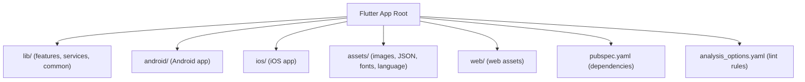
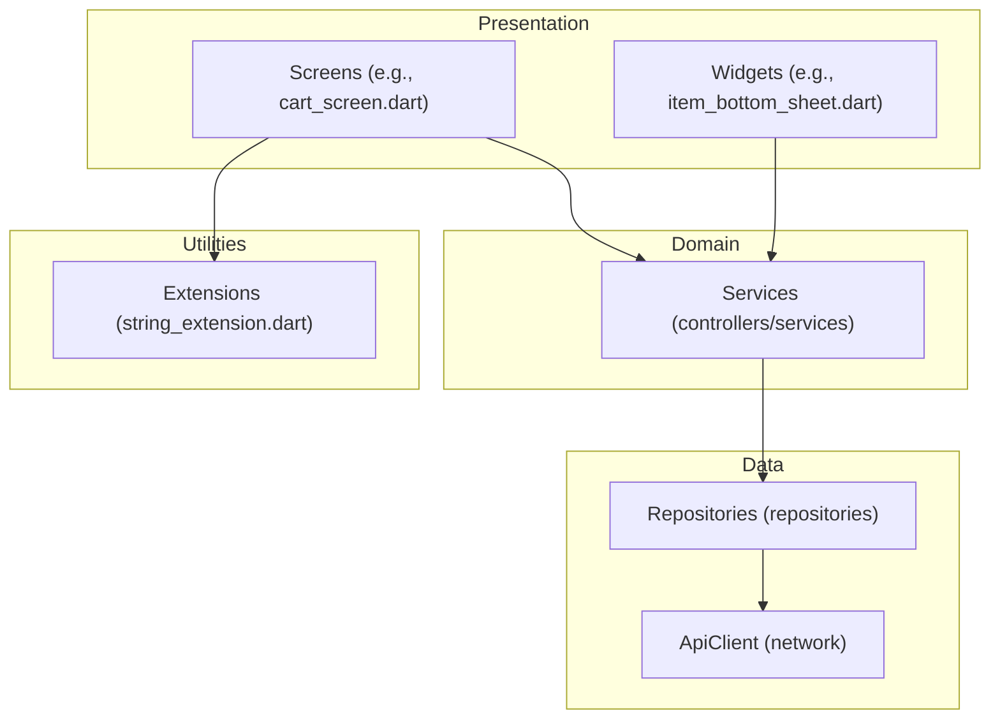
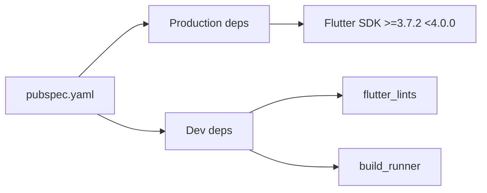
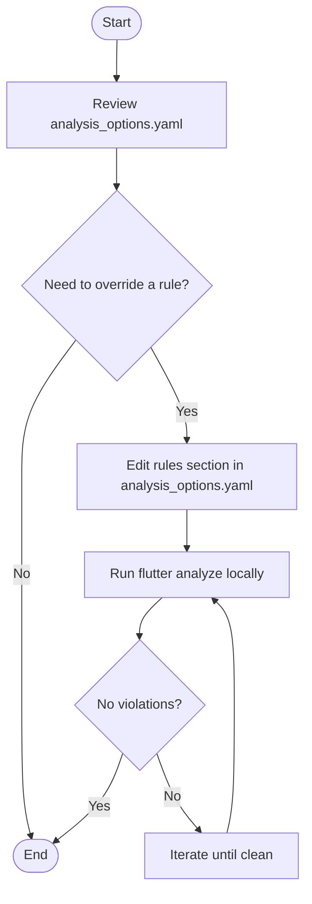

# Contributing Guidelines

<cite>
**Referenced Files in This Document**
- [README.md](file://README.md)
- [analysis_options.yaml](file://analysis_options.yaml)
- [pubspec.yaml](file://pubspec.yaml)
- [grocery_improvements_plan.md](file://grocery_improvements_plan.md)
- [grocery_store_first_restructure.md](file://grocery_store_first_restructure.md)
- [project_analysis_and_redesign_plan.txt](file://project_analysis_and_redesign_plan.txt)
- [cart_screen.dart](file://lib/features/cart/screens/cart_screen.dart)
- [item_bottom_sheet.dart](file://lib/common/widgets/item_bottom_sheet.dart)
- [string_extension.dart](file://lib/helper/string_extension.dart)
- [RunnerTests.swift](file://ios/RunnerTests/RunnerTests.swift)
- [chat_repository.dart](file://lib/features/chat/domain/repositories/chat_repository.dart)
- [review_repository.dart](file://lib/features/review/domain/repositories/review_repository.dart)
- [WaddiLiveActivityLiveActivity.swift](file://ios/WaddiLiveActivity/WaddiLiveActivityLiveActivity.swift)
</cite>

## Table of Contents
1. [Introduction](#introduction)
2. [Project Structure](#project-structure)
3. [Core Components](#core-components)
4. [Architecture Overview](#architecture-overview)
5. [Detailed Component Analysis](#detailed-component-analysis)
6. [Dependency Analysis](#dependency-analysis)
7. [Performance Considerations](#performance-considerations)
8. [Troubleshooting Guide](#troubleshooting-guide)
9. [Conclusion](#conclusion)
10. [Appendices](#appendices)

## Introduction
Thank you for your interest in contributing to the multi-vendor Flutter application. This document defines the development workflow, code style standards, testing expectations, and collaboration practices for contributors. It consolidates the repository’s configuration and design documents to guide feature development, bug fixes, and documentation updates consistently across the codebase.

## Project Structure
The project follows a modular Flutter architecture with feature-based organization and platform-specific configurations. Key areas include:
- Application entry and core modules under lib/
- Platform integrations for Android and iOS
- Assets and localization under assets/
- Web assets under web/
- Lint configuration and dependency declarations

**Section sources**
- [README.md:1-18](file://README.md#L1-L18)
- [pubspec.yaml:1-122](file://pubspec.yaml#L1-L122)
- [analysis_options.yaml:1-29](file://analysis_options.yaml#L1-L29)

## Core Components
- Code style and lint enforcement are governed by the project’s analysis options, which include Flutter lints and allow per-rule overrides.
- The project uses a feature-based module structure with controllers, services, repositories, and UI widgets.
- Localization keys are used extensively across the UI, indicating a strong emphasis on internationalization-ready code.

Key references:
- Lint configuration and rule overrides: [analysis_options.yaml:12-26](file://analysis_options.yaml#L12-L26)
- Localization usage in UI and widgets: [cart_screen.dart:866](file://lib/features/cart/screens/cart_screen.dart#L866), [item_bottom_sheet.dart:1065-1082](file://lib/common/widgets/item_bottom_sheet.dart#L1065-L1082)
- String capitalization helpers for consistent text formatting: [string_extension.dart:1-22](file://lib/helper/string_extension.dart#L1-L22)

**Section sources**
- [analysis_options.yaml:12-26](file://analysis_options.yaml#L12-L26)
- [cart_screen.dart:866](file://lib/features/cart/screens/cart_screen.dart#L866)
- [item_bottom_sheet.dart:1065-1082](file://lib/common/widgets/item_bottom_sheet.dart#L1065-L1082)
- [string_extension.dart:1-22](file://lib/helper/string_extension.dart#L1-L22)

## Architecture Overview
The application follows a layered architecture with separation of concerns:
- Presentation layer: Screens and widgets under lib/features
- Domain layer: Services and business logic
- Data layer: Repositories and API clients
- Utilities and helpers: Extensions and shared components

**Diagram sources**
- [cart_screen.dart:830-869](file://lib/features/cart/screens/cart_screen.dart#L830-L869)
- [item_bottom_sheet.dart:1063-1082](file://lib/common/widgets/item_bottom_sheet.dart#L1063-L1082)
- [string_extension.dart:1-22](file://lib/helper/string_extension.dart#L1-L22)
- [chat_repository.dart:72-135](file://lib/features/chat/domain/repositories/chat_repository.dart#L72-L135)
- [review_repository.dart:1-34](file://lib/features/review/domain/repositories/review_repository.dart#L1-L34)

## Detailed Component Analysis

### Code Style Standards
- Lint rules are configured via Flutter lints and can be customized in analysis_options.yaml. Contributors should run the analyzer locally and resolve reported issues before submitting changes.
- Prefer single quotes for strings unless there is a compelling reason to use double quotes.
- Use localization keys for all user-facing strings to maintain consistency and enable internationalization.

References:
- Lint configuration: [analysis_options.yaml:8-26](file://analysis_options.yaml#L8-L26)
- Localization usage examples: [cart_screen.dart:866](file://lib/features/cart/screens/cart_screen.dart#L866), [item_bottom_sheet.dart:1065-1082](file://lib/common/widgets/item_bottom_sheet.dart#L1065-L1082)
- String extension for consistent capitalization: [string_extension.dart:1-22](file://lib/helper/string_extension.dart#L1-L22)

**Section sources**
- [analysis_options.yaml:8-26](file://analysis_options.yaml#L8-L26)
- [cart_screen.dart:866](file://lib/features/cart/screens/cart_screen.dart#L866)
- [item_bottom_sheet.dart:1065-1082](file://lib/common/widgets/item_bottom_sheet.dart#L1065-L1082)
- [string_extension.dart:1-22](file://lib/helper/string_extension.dart#L1-L22)

### Commit Message Conventions
There is no explicit commit convention defined in the repository. Contributors are encouraged to adopt a clear, imperative style that summarizes the change and its impact. Examples commonly used in practice:
- feat: add new store picker behavior
- fix: resolve null-safety in item model
- docs: update contribution guidelines
- chore: update dependencies

[No sources needed since this section provides general guidance]

### Pull Request Process
- Branching: Create feature branches from the default branch for new features or fixes.
- Testing: Ensure changes pass local tests and analyzer checks before opening a PR.
- Review: Request reviews from maintainers; incorporate feedback promptly.
- Merge: Maintainers will merge after approval and successful checks.

[No sources needed since this section provides general guidance]

### Issue Reporting
- Use GitHub Issues to report bugs and propose features.
- Include steps to reproduce, expected vs. actual behavior, and environment details.
- For UI/UX issues, attach screenshots or short videos demonstrating the problem.

[No sources needed since this section provides general guidance]

### Development Environment Setup
- Flutter SDK version is specified in the project metadata; ensure your environment matches the documented version.
- Install dependencies via pub get and run the analyzer locally to catch style issues early.

References:
- Flutter SDK requirement: [pubspec.yaml:6-8](file://pubspec.yaml#L6-L8)

**Section sources**
- [pubspec.yaml:6-8](file://pubspec.yaml#L6-L8)

### Branch Management
- Default branch is used as the integration base.
- Feature branches should be short-lived and focused on a single concern.

[No sources needed since this section provides general guidance]

### Testing Requirements
- Unit and widget tests are part of the project structure. Ensure new features include appropriate tests.
- Run platform-specific tests where applicable (e.g., iOS tests).

References:
- iOS test scaffold: [RunnerTests.swift:1-12](file://ios/RunnerTests/RunnerTests.swift#L1-L12)

**Section sources**
- [RunnerTests.swift:1-12](file://ios/RunnerTests/RunnerTests.swift#L1-L12)

### Contribution Types and Workflows

#### Feature Development
- Follow the modular structure: add screens, widgets, services, repositories, and models under lib/features/<feature>.
- Use localization keys for all user-facing strings.
- Reference the UI redesign and improvement plans for context on feature scope and priorities.

References:
- UI redesign plan and feature scope: [project_analysis_and_redesign_plan.txt:1-654](file://project_analysis_and_redesign_plan.txt#L1-L654)
- Store-first restructuring plan: [grocery_store_first_restructure.md:1-144](file://grocery_store_first_restructure.md#L1-L144)
- Grocery improvements plan: [grocery_improvements_plan.md:1-388](file://grocery_improvements_plan.md#L1-L388)

**Section sources**
- [project_analysis_and_redesign_plan.txt:1-654](file://project_analysis_and_redesign_plan.txt#L1-L654)
- [grocery_store_first_restructure.md:1-144](file://grocery_store_first_restructure.md#L1-L144)
- [grocery_improvements_plan.md:1-388](file://grocery_improvements_plan.md#L1-L388)

#### Bug Fixes
- Identify the affected module and update the corresponding service/repository/controller.
- Add or adjust tests to prevent regressions.
- Reference existing repository implementations for patterns (e.g., chat and review repositories).

References:
- Chat repository pattern: [chat_repository.dart:72-135](file://lib/features/chat/domain/repositories/chat_repository.dart#L72-L135)
- Review repository pattern: [review_repository.dart:1-34](file://lib/features/review/domain/repositories/review_repository.dart#L1-L34)

**Section sources**
- [chat_repository.dart:72-135](file://lib/features/chat/domain/repositories/chat_repository.dart#L72-L135)
- [review_repository.dart:1-34](file://lib/features/review/domain/repositories/review_repository.dart#L1-L34)

#### Documentation Updates
- Keep documentation aligned with code changes.
- Update design plans and improvement documents when UI or feature scope evolves.

References:
- UI redesign plan: [project_analysis_and_redesign_plan.txt:1-654](file://project_analysis_and_redesign_plan.txt#L1-L654)
- Store-first restructuring: [grocery_store_first_restructure.md:1-144](file://grocery_store_first_restructure.md#L1-L144)

**Section sources**
- [project_analysis_and_redesign_plan.txt:1-654](file://project_analysis_and_redesign_plan.txt#L1-L654)
- [grocery_store_first_restructure.md:1-144](file://grocery_store_first_restructure.md#L1-L144)

### Pull Request Template and Review Checklist
While a formal template is not present in the repository, maintainers expect:
- Clear description of changes and rationale
- Screenshots or videos for UI changes
- Tests included and passing
- Analyzer clean (no new lint violations)
- Localization keys used for all user-facing strings

Review checklist:
- Code style compliant with analysis_options.yaml
- No hardcoded strings; use localization keys
- Tests updated or added
- No breaking changes to APIs or contracts
- Documentation updated as needed

[No sources needed since this section provides general guidance]

### Merge Criteria
- At least one maintainer approval
- All CI checks and local tests pass
- Analyzer clean and no new lint violations introduced
- Documentation and localization updated

[No sources needed since this section provides general guidance]

### Examples of Good Contribution Practices
- Use localization keys for all UI text (e.g., “order_summary”, “add_to_cart”).
- Apply consistent string capitalization using helper extensions.
- Follow modular structure and keep PRs focused and small.

References:
- Localization usage: [cart_screen.dart:866](file://lib/features/cart/screens/cart_screen.dart#L866), [item_bottom_sheet.dart:1065-1082](file://lib/common/widgets/item_bottom_sheet.dart#L1065-L1082)
- String capitalization helper: [string_extension.dart:1-22](file://lib/helper/string_extension.dart#L1-L22)

**Section sources**
- [cart_screen.dart:866](file://lib/features/cart/screens/cart_screen.dart#L866)
- [item_bottom_sheet.dart:1065-1082](file://lib/common/widgets/item_bottom_sheet.dart#L1065-L1082)
- [string_extension.dart:1-22](file://lib/helper/string_extension.dart#L1-L22)

### Common Pitfalls to Avoid
- Hardcoding strings instead of using localization keys
- Introducing new lint violations or disabling rules without justification
- Large, unfocused PRs that mix unrelated changes
- Breaking changes to public APIs without coordination

[No sources needed since this section provides general guidance]

### Community Collaboration Standards
- Be respectful and constructive in discussions
- Provide clear reproduction steps for bug reports
- Offer help reviewing others’ PRs when possible

[No sources needed since this section provides general guidance]

### Issue Labeling, Milestone Planning, and Release Cycle Participation
- Use labels to categorize issues (e.g., bug, enhancement, documentation).
- Milestones can align with UI redesign phases or improvement plan stages.
- Participate in planning sessions and triage to keep the roadmap realistic.

[No sources needed since this section provides general guidance]

### Onboarding Procedures and Mentorship Resources
- New contributors should start with small, scoped tasks (e.g., fixing hardcoded strings or improving UI widgets).
- Pair up with maintainers for complex changes.
- Use the improvement and redesign plans as learning resources for feature scope and design decisions.

References:
- Improvement plan and phases: [grocery_improvements_plan.md:364-388](file://grocery_improvements_plan.md#L364-L388)
- Redesign phases: [project_analysis_and_redesign_plan.txt:583-616](file://project_analysis_and_redesign_plan.txt#L583-L616)

**Section sources**
- [grocery_improvements_plan.md:364-388](file://grocery_improvements_plan.md#L364-L388)
- [project_analysis_and_redesign_plan.txt:583-616](file://project_analysis_and_redesign_plan.txt#L583-L616)

## Dependency Analysis
The project declares production and development dependencies in pubspec.yaml. Contributors should:
- Keep dependencies updated and aligned with the Flutter SDK requirement
- Add new dev_dependencies only when necessary (e.g., linters, generators)

**Diagram sources**
- [pubspec.yaml:6-98](file://pubspec.yaml#L6-L98)

**Section sources**
- [pubspec.yaml:6-98](file://pubspec.yaml#L6-L98)

## Performance Considerations
- Use responsive helpers and conditional rendering to optimize UI performance.
- Implement pagination and lazy loading for large lists.
- Minimize unnecessary rebuilds by leveraging reactive controllers and state management patterns.

[No sources needed since this section provides general guidance]

## Troubleshooting Guide
- Analyzer errors: Resolve lint violations using the analysis options configuration.
- Localization issues: Ensure localization keys are used and translated consistently.
- Platform-specific tests: Run iOS tests to validate native integration.

References:
- Analyzer configuration: [analysis_options.yaml:1-29](file://analysis_options.yaml#L1-L29)
- iOS test scaffold: [RunnerTests.swift:1-12](file://ios/RunnerTests/RunnerTests.swift#L1-L12)
- Live Activity integration (iOS): [WaddiLiveActivityLiveActivity.swift:140-170](file://ios/WaddiLiveActivity/WaddiLiveActivityLiveActivity.swift#L140-L170)

**Section sources**
- [analysis_options.yaml:1-29](file://analysis_options.yaml#L1-L29)
- [RunnerTests.swift:1-12](file://ios/RunnerTests/RunnerTests.swift#L1-L12)
- [WaddiLiveActivityLiveActivity.swift:140-170](file://ios/WaddiLiveActivity/WaddiLiveActivityLiveActivity.swift#L140-L170)

## Conclusion
By following these guidelines—focusing on code style, testing, localization, modular architecture, and collaborative workflows—you will help maintain a high-quality, scalable, and contributor-friendly codebase. Use the improvement and redesign plans as references for feature scope and design direction, and engage constructively in reviews and planning.

[No sources needed since this section summarizes without analyzing specific files]

## Appendices

### Appendix A: Lint Rule Customization Flow

**Diagram sources**
- [analysis_options.yaml:12-26](file://analysis_options.yaml#L12-L26)