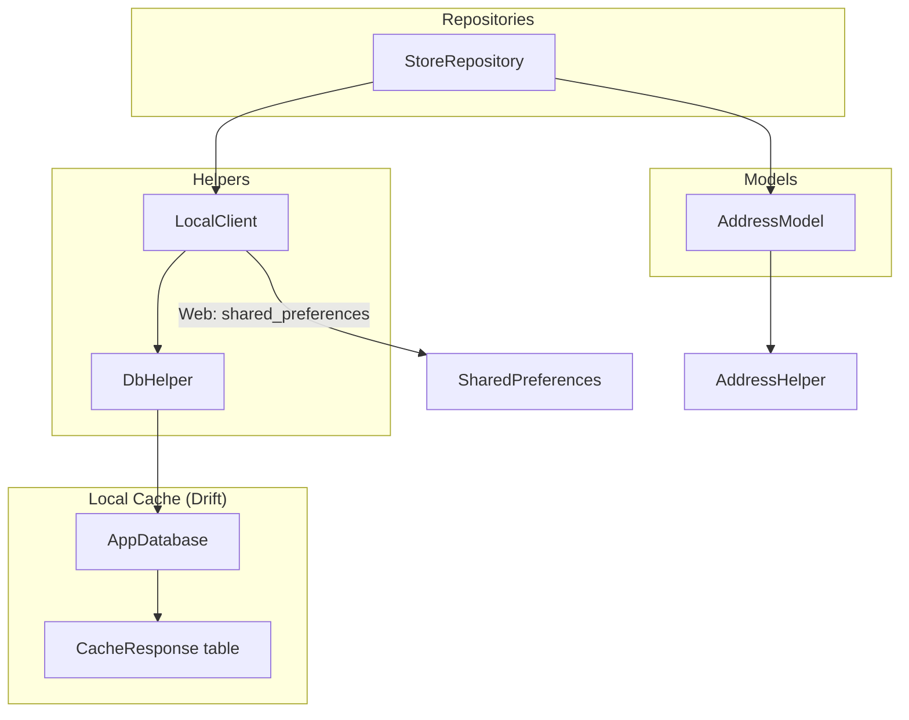
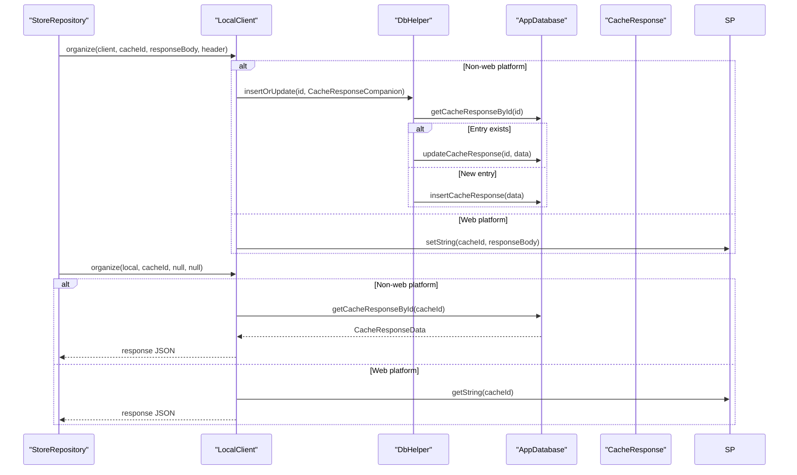
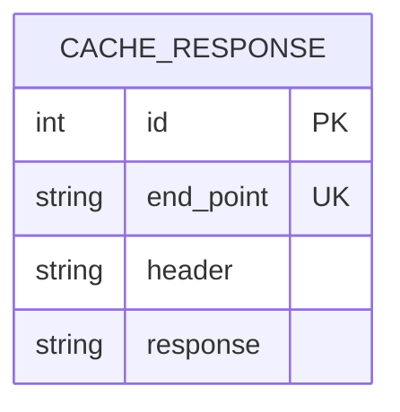
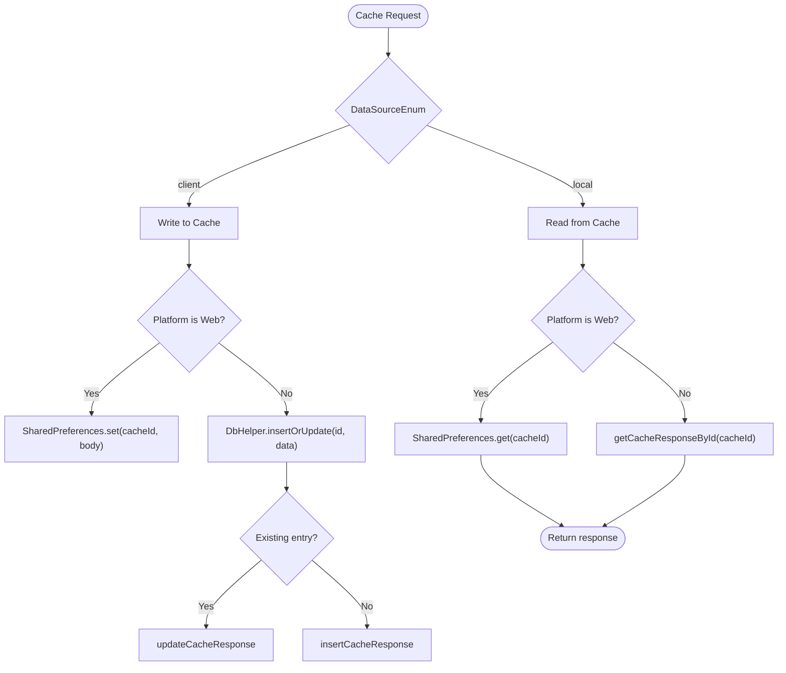
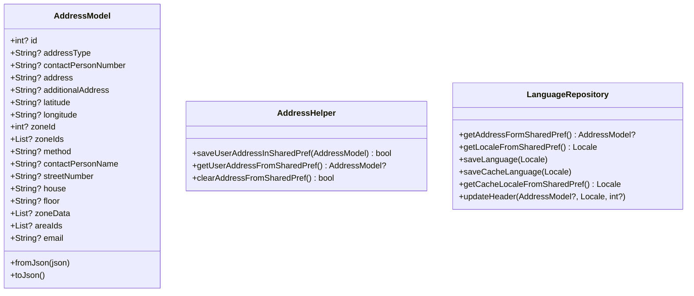
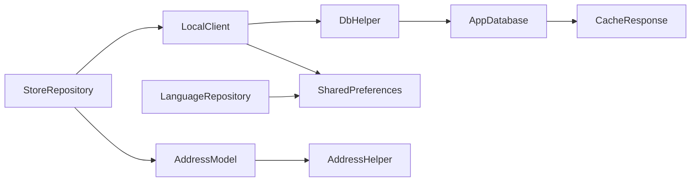

# Database Design

<cite>
**Referenced Files in This Document**
- [cache_response.dart](file://lib/local/cache_response.dart)
- [cache_response.g.dart](file://lib/local/cache_response.g.dart)
- [local_client.dart](file://lib/api/local_client.dart)
- [db_helper.dart](file://lib/helper/db_helper.dart)
- [address_model.dart](file://lib/features/address/domain/models/address_model.dart)
- [address_helper.dart](file://lib/helper/address_helper.dart)
- [language_repository.dart](file://lib/features/language/domain/repository/language_repository.dart)
- [store_repository.dart](file://lib/features/store/domain/repositories/store_repository.dart)
- [app_constants.dart](file://lib/util/app_constants.dart)
</cite>

## Table of Contents
1. [Introduction](#introduction)
2. [Project Structure](#project-structure)
3. [Core Components](#core-components)
4. [Architecture Overview](#architecture-overview)
5. [Detailed Component Analysis](#detailed-component-analysis)
6. [Dependency Analysis](#dependency-analysis)
7. [Performance Considerations](#performance-considerations)
8. [Troubleshooting Guide](#troubleshooting-guide)
9. [Conclusion](#conclusion)
10. [Appendices](#appendices)

## Introduction
This document describes the local database schema and data persistence layer used for caching API responses and storing user-related data such as addresses and preferences. It focuses on the Drift-based cache database, table schemas, data access patterns, offline-first behavior, validation rules, integrity measures, and operational aspects such as migrations, retention, and security considerations.

## Project Structure
The data persistence layer consists of:
- A Drift-generated cache database for storing HTTP responses keyed by endpoint identifiers.
- A helper that inserts or updates cached entries atomically.
- A client orchestrator that decides whether to write to or read from the cache depending on the data source.
- Shared preferences for user address and language preferences.
- Repository logic that coordinates cache writes and reads during network requests.

**Diagram sources**
- [cache_response.dart:5-10](file://lib/local/cache_response.dart#L5-L10)
- [cache_response.dart:12-37](file://lib/local/cache_response.dart#L12-L37)
- [db_helper.dart:6-15](file://lib/helper/db_helper.dart#L6-L15)
- [local_client.dart:10-61](file://lib/api/local_client.dart#L10-L61)
- [address_model.dart:3-40](file://lib/features/address/domain/models/address_model.dart#L3-L40)
- [address_helper.dart:10-44](file://lib/helper/address_helper.dart#L10-L44)
- [store_repository.dart:86-123](file://lib/features/store/domain/repositories/store_repository.dart#L86-L123)

**Section sources**
- [cache_response.dart:1-81](file://lib/local/cache_response.dart#L1-L81)
- [local_client.dart:1-62](file://lib/api/local_client.dart#L1-L62)
- [db_helper.dart:1-16](file://lib/helper/db_helper.dart#L1-L16)
- [address_helper.dart:1-45](file://lib/helper/address_helper.dart#L1-L45)
- [store_repository.dart:86-123](file://lib/features/store/domain/repositories/store_repository.dart#L86-L123)

## Core Components
- CacheResponse table: stores endpoint-specific JSON responses along with sanitized headers and an auto-incremented primary key.
- AppDatabase: Drift database definition with schema version and migration strategy.
- DbHelper: centralized insert-or-update logic for cache entries.
- LocalClient: orchestrates cache writes and reads, strips sensitive headers for non-web platforms, and handles platform differences.
- AddressModel and AddressHelper: manage user address data persisted via shared preferences.
- LanguageRepository: manages language and country codes stored in shared preferences.

**Section sources**
- [cache_response.dart:5-10](file://lib/local/cache_response.dart#L5-L10)
- [cache_response.dart:12-37](file://lib/local/cache_response.dart#L12-L37)
- [cache_response.g.dart:6-96](file://lib/local/cache_response.g.dart#L6-L96)
- [db_helper.dart:6-15](file://lib/helper/db_helper.dart#L6-L15)
- [local_client.dart:12-61](file://lib/api/local_client.dart#L12-L61)
- [address_model.dart:3-40](file://lib/features/address/domain/models/address_model.dart#L3-L40)
- [address_helper.dart:10-44](file://lib/helper/address_helper.dart#L10-L44)
- [language_repository.dart:9-32](file://lib/features/language/domain/repository/language_repository.dart#L9-L32)

## Architecture Overview
The offline-first caching architecture works as follows:
- On successful network fetches, repositories pass the response body and headers to LocalClient.
- For non-web platforms, LocalClient sanitizes headers (removing Authorization) and persists the entry via DbHelper into AppDatabase.
- On subsequent requests, LocalClient retrieves cached responses by endpoint ID.
- Web builds bypass the Drift database and use SharedPreferences for caching.

**Diagram sources**
- [store_repository.dart:86-123](file://lib/features/store/domain/repositories/store_repository.dart#L86-L123)
- [local_client.dart:12-61](file://lib/api/local_client.dart#L12-L61)
- [db_helper.dart:6-15](file://lib/helper/db_helper.dart#L6-L15)
- [cache_response.dart:35-37](file://lib/local/cache_response.dart#L35-L37)
- [cache_response.dart:59-62](file://lib/local/cache_response.dart#L59-L62)

## Detailed Component Analysis

### Drift Cache Database and Schema
- Table: CacheResponse
  - Fields:
    - id: integer, auto-incremented primary key
    - endPoint: text, unique
    - header: text
    - response: text
- Database: AppDatabase
  - schemaVersion: 3
  - MigrationStrategy:
    - onCreate: creates all tables
    - onUpgrade: recreates the CacheResponse table when upgrading from earlier versions
- Accessors:
  - insertCacheResponse, updateCacheResponse, getCacheResponseById, clearCacheResponses, deleteCacheResponse

**Diagram sources**
- [cache_response.dart:5-10](file://lib/local/cache_response.dart#L5-L10)
- [cache_response.g.dart:6-96](file://lib/local/cache_response.g.dart#L6-L96)

**Section sources**
- [cache_response.dart:5-10](file://lib/local/cache_response.dart#L5-L10)
- [cache_response.dart:12-37](file://lib/local/cache_response.dart#L12-L37)
- [cache_response.g.dart:6-96](file://lib/local/cache_response.g.dart#L6-L96)
- [cache_response.g.dart:99-188](file://lib/local/cache_response.g.dart#L99-L188)

### Data Access Patterns and Caching Strategy
- Write path:
  - Repositories call LocalClient.organize with DataSourceEnum.client.
  - Non-web: DbHelper checks for existing entry; inserts or updates accordingly.
  - Web: LocalClient writes responseBody to SharedPreferences keyed by cacheId.
- Read path:
  - Repositories call LocalClient.organize with DataSourceEnum.local.
  - Non-web: AppDatabase lookup by endPoint; returns response JSON.
  - Web: SharedPreferences lookup by cacheId.
- Header sanitization:
  - Authorization header is removed before persisting to the cache database.

**Diagram sources**
- [local_client.dart:12-61](file://lib/api/local_client.dart#L12-L61)
- [db_helper.dart:6-15](file://lib/helper/db_helper.dart#L6-L15)
- [cache_response.dart:39-79](file://lib/local/cache_response.dart#L39-L79)

**Section sources**
- [local_client.dart:12-61](file://lib/api/local_client.dart#L12-L61)
- [db_helper.dart:6-15](file://lib/helper/db_helper.dart#L6-L15)
- [store_repository.dart:86-123](file://lib/features/store/domain/repositories/store_repository.dart#L86-L123)

### Address and Preferences Persistence
- AddressModel:
  - Stores address fields, zone IDs, area IDs, and optional zone data.
  - Includes fromJson and toJson for serialization.
- AddressHelper:
  - Saves user address to SharedPreferences and updates API headers.
  - Retrieves and clears address from SharedPreferences.
- LanguageRepository:
  - Reads/writes language and country codes to SharedPreferences.
  - Updates API headers based on selected locale and module.

**Diagram sources**
- [address_model.dart:3-40](file://lib/features/address/domain/models/address_model.dart#L3-L40)
- [address_model.dart:42-93](file://lib/features/address/domain/models/address_model.dart#L42-L93)
- [address_helper.dart:10-44](file://lib/helper/address_helper.dart#L10-L44)
- [language_repository.dart:9-32](file://lib/features/language/domain/repository/language_repository.dart#L9-L32)
- [language_repository.dart:34-56](file://lib/features/language/domain/repository/language_repository.dart#L34-L56)

**Section sources**
- [address_model.dart:3-40](file://lib/features/address/domain/models/address_model.dart#L3-L40)
- [address_model.dart:42-93](file://lib/features/address/domain/models/address_model.dart#L42-L93)
- [address_helper.dart:10-44](file://lib/helper/address_helper.dart#L10-L44)
- [language_repository.dart:9-32](file://lib/features/language/domain/repository/language_repository.dart#L9-L32)
- [language_repository.dart:34-56](file://lib/features/language/domain/repository/language_repository.dart#L34-L56)

### Data Validation Rules and Integrity Measures
- Unique endpoint constraint:
  - endPoint is unique in CacheResponse, ensuring one cache entry per endpoint.
- Required fields:
  - insert validates presence of endPoint, header, and response during insert.
- Atomic upsert:
  - DbHelper checks existence and performs insert or update to avoid unique constraint failures.
- Header sanitization:
  - Authorization header is stripped before writing to cache to prevent sensitive data leakage.

**Section sources**
- [cache_response.dart:6-10](file://lib/local/cache_response.dart#L6-L10)
- [cache_response.g.dart:48-74](file://lib/local/cache_response.g.dart#L48-L74)
- [db_helper.dart:6-15](file://lib/helper/db_helper.dart#L6-L15)
- [local_client.dart:24-38](file://lib/api/local_client.dart#L24-L38)

### Data Lifecycle, Retention, and Cleanup
- Lifecycle:
  - Creation: onResponse success triggers cache write.
  - Retrieval: Subsequent requests read from cache until cleared or replaced.
- Retention:
  - No explicit TTL or size limits are enforced in the cache layer.
- Cleanup:
  - clearCacheResponses removes all cached entries.
  - deleteCacheResponse removes a specific entry by id.
  - SharedPreferences-based cache can be cleared by removing keys (e.g., AddressHelper.clearAddressFromSharedPref).

**Section sources**
- [cache_response.dart:77-79](file://lib/local/cache_response.dart#L77-L79)
- [cache_response.dart:72-75](file://lib/local/cache_response.dart#L72-L75)
- [address_helper.dart:39-43](file://lib/helper/address_helper.dart#L39-L43)

### Data Migration and Version Management
- schemaVersion: 3
- MigrationStrategy:
  - onCreate: creates all tables.
  - onUpgrade: deletes and recreates CacheResponse table when upgrading from older versions.

**Section sources**
- [cache_response.dart:16-33](file://lib/local/cache_response.dart#L16-L33)

### Backup Strategies
- Drift database:
  - The database is stored locally; consult platform-specific backup mechanisms for iOS/Android.
- SharedPreferences:
  - Contains user address and language preferences; rely on platform backup where applicable.

[No sources needed since this section provides general guidance]

## Dependency Analysis
- StoreRepository depends on LocalClient for cache orchestration.
- LocalClient depends on DbHelper for database operations and SharedPreferences for web caching.
- DbHelper depends on AppDatabase for cache operations.
- AddressHelper and LanguageRepository depend on SharedPreferences for persistent user data.

**Diagram sources**
- [store_repository.dart:86-123](file://lib/features/store/domain/repositories/store_repository.dart#L86-L123)
- [local_client.dart:12-61](file://lib/api/local_client.dart#L12-L61)
- [db_helper.dart:6-15](file://lib/helper/db_helper.dart#L6-L15)
- [cache_response.dart:35-37](file://lib/local/cache_response.dart#L35-L37)
- [address_helper.dart:10-44](file://lib/helper/address_helper.dart#L10-L44)
- [language_repository.dart:9-32](file://lib/features/language/domain/repository/language_repository.dart#L9-L32)

**Section sources**
- [store_repository.dart:86-123](file://lib/features/store/domain/repositories/store_repository.dart#L86-L123)
- [local_client.dart:12-61](file://lib/api/local_client.dart#L12-L61)
- [db_helper.dart:6-15](file://lib/helper/db_helper.dart#L6-L15)
- [address_helper.dart:10-44](file://lib/helper/address_helper.dart#L10-L44)
- [language_repository.dart:9-32](file://lib/features/language/domain/repository/language_repository.dart#L9-L32)

## Performance Considerations
- Prefer reading from cache for repeated queries to reduce network latency and server load.
- Limit cache size by periodically clearing old entries using clearCacheResponses or targeted deletions.
- Avoid caching large payloads unnecessarily; consider compressing or partitioning data if needed.
- Use unique endpoint keys to minimize collisions and enable precise cache invalidation.

[No sources needed since this section provides general guidance]

## Troubleshooting Guide
- Unique constraint errors on insert:
  - The cache write path automatically falls back to update when a unique violation occurs.
- Empty or stale cache:
  - Clear cache entries or invalidate by key to force refresh.
- Authorization header leakage:
  - Confirm that LocalClient strips Authorization before writing to the cache database.
- Web vs native caching:
  - Verify platform detection logic and ensure SharedPreferences fallback is functioning.

**Section sources**
- [cache_response.dart:39-53](file://lib/local/cache_response.dart#L39-L53)
- [local_client.dart:24-38](file://lib/api/local_client.dart#L24-L38)
- [local_client.dart:44-58](file://lib/api/local_client.dart#L44-L58)

## Conclusion
The application employs a hybrid caching strategy: a Drift-backed cache database for non-web platforms and SharedPreferences for web. The cache schema is minimal and robust, with unique endpoint keys and sanitization of sensitive headers. Repositories coordinate cache writes and reads to achieve an offline-first experience. Integrity is ensured via unique constraints and atomic upsert logic, while migration and cleanup are straightforward due to the small number of tables and simple schema.

## Appendices

### Sample Data Structures
- CacheResponse row:
  - id: integer
  - endPoint: string (unique)
  - header: string (sanitized)
  - response: string (JSON payload)
- AddressModel fields:
  - id, address_type, contact_person_number, address, additional_address, latitude, longitude, zone_id, zone_ids, _method, contact_person_name, road, house, floor, zone_data, area_ids, contact_person_email

**Section sources**
- [cache_response.g.dart:99-188](file://lib/local/cache_response.g.dart#L99-L188)
- [address_model.dart:69-93](file://lib/features/address/domain/models/address_model.dart#L69-L93)

### Security and Access Control
- Sensitive header removal:
  - Authorization header is removed prior to cache storage.
- Local storage protection:
  - Rely on platform-level protections for SQLite (Drift) and SharedPreferences.
- Token handling:
  - Tokens are not cached in the database; they remain in SharedPreferences and are used to construct request headers.

**Section sources**
- [local_client.dart:24-38](file://lib/api/local_client.dart#L24-L38)
- [address_helper.dart:12-24](file://lib/helper/address_helper.dart#L12-L24)