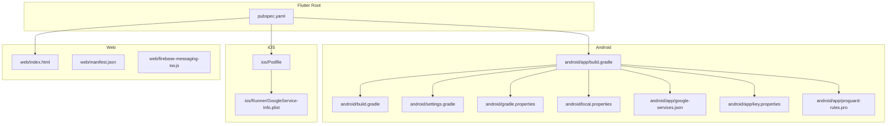
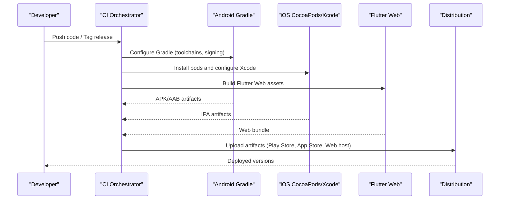
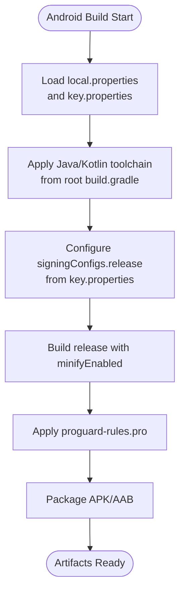
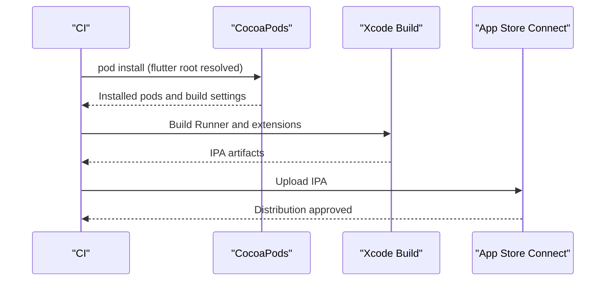
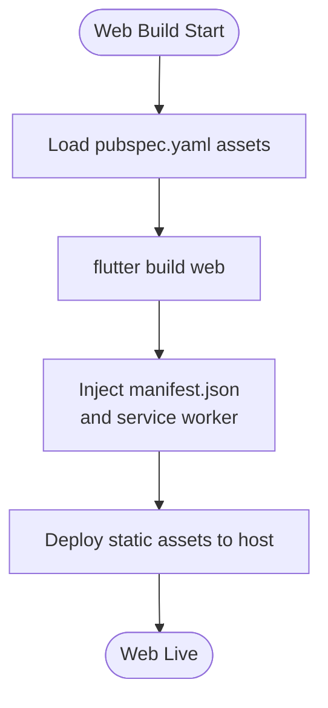
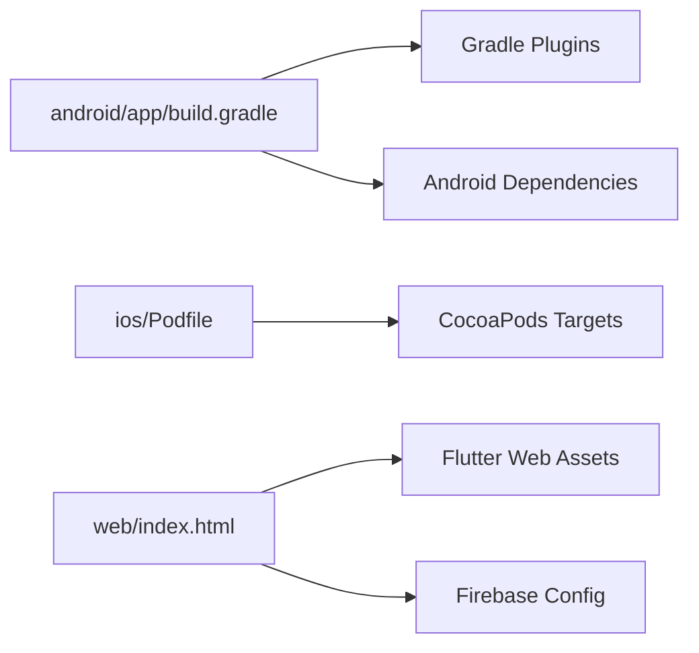

# Deployment and CI/CD

<cite>
**Referenced Files in This Document**
- [android/build.gradle](file://android/build.gradle)
- [android/app/build.gradle](file://android/app/build.gradle)
- [android/gradle.properties](file://android/gradle.properties)
- [android/local.properties](file://android/local.properties)
- [android/settings.gradle](file://android/settings.gradle)
- [android/app/google-services.json](file://android/app/google-services.json)
- [android/app/proguard-rules.pro](file://android/app/proguard-rules.pro)
- [android/app/key.properties](file://android/app/key.properties)
- [ios/Podfile](file://ios/Podfile)
- [ios/Runner/GoogleService-Info.plist](file://ios/Runner/GoogleService-Info.plist)
- [pubspec.yaml](file://pubspec.yaml)
- [web/index.html](file://web/index.html)
- [web/manifest.json](file://web/manifest.json)
- [web/firebase-messaging-sw.js](file://web/firebase-messaging-sw.js)
</cite>

## Table of Contents
1. [Introduction](#introduction)
2. [Project Structure](#project-structure)
3. [Core Components](#core-components)
4. [Architecture Overview](#architecture-overview)
5. [Detailed Component Analysis](#detailed-component-analysis)
6. [Dependency Analysis](#dependency-analysis)
7. [Performance Considerations](#performance-considerations)
8. [Troubleshooting Guide](#troubleshooting-guide)
9. [Conclusion](#conclusion)
10. [Appendices](#appendices)

## Introduction
This document describes deployment and continuous integration/continuous deployment (CI/CD) processes for a Flutter-based multi-platform application targeting Android, iOS, and Web. It covers build configuration, signing and provisioning, release preparation, environment management, secrets handling, automated testing integration, quality gates, release automation, pipeline triggers, environment-specific configurations, rollback procedures, performance monitoring, crash reporting, and post-deployment validation. The guidance is grounded in the repository’s existing Gradle, CocoaPods, Flutter, and Web assets configuration.

## Project Structure
The repository follows a Flutter monorepo layout with platform-specific build configurations:
- Android: Gradle-based build with Firebase Crashlytics and Google Services plugin, ProGuard/R8 rules, and keystore-based signing.
- iOS: CocoaPods-managed dependencies and Firebase configuration via GoogleService-Info.plist.
- Web: Flutter Web assets, PWA manifest, and Firebase Messaging service worker.

**Diagram sources**
- [android/app/build.gradle](file://android/app/build.gradle)
- [android/build.gradle](file://android/build.gradle)
- [android/settings.gradle](file://android/settings.gradle)
- [android/gradle.properties](file://android/gradle.properties)
- [android/local.properties](file://android/local.properties)
- [android/app/google-services.json](file://android/app/google-services.json)
- [android/app/key.properties](file://android/app/key.properties)
- [android/app/proguard-rules.pro](file://android/app/proguard-rules.pro)
- [ios/Podfile](file://ios/Podfile)
- [ios/Runner/GoogleService-Info.plist](file://ios/Runner/GoogleService-Info.plist)
- [pubspec.yaml](file://pubspec.yaml)
- [web/index.html](file://web/index.html)
- [web/manifest.json](file://web/manifest.json)
- [web/firebase-messaging-sw.js](file://web/firebase-messaging-sw.js)

**Section sources**
- [android/app/build.gradle](file://android/app/build.gradle)
- [android/settings.gradle](file://android/settings.gradle)
- [ios/Podfile](file://ios/Podfile)
- [pubspec.yaml](file://pubspec.yaml)
- [web/index.html](file://web/index.html)

## Core Components
- Android build and signing:
  - Build uses Gradle with Kotlin and Flutter plugins, Google Services, and Crashlytics.
  - Signing is configured via a dedicated signing block and externalized keystore properties.
  - Minification and resource shrinking are enabled for release builds.
- iOS build and Firebase:
  - CocoaPods integrates Flutter pods and sets up iOS-specific build targets and frameworks.
  - Firebase configuration is provided via GoogleService-Info.plist.
- Web deployment:
  - Flutter Web assets, PWA manifest, and Firebase Messaging service worker are present.
  - Index HTML initializes Firebase and loads Flutter assets.

Key configuration anchors:
- Android release signing and build types: [android/app/build.gradle](file://android/app/build.gradle)
- Android Gradle settings and toolchains: [android/build.gradle](file://android/build.gradle), [android/settings.gradle](file://android/settings.gradle), [android/gradle.properties](file://android/gradle.properties), [android/local.properties](file://android/local.properties)
- iOS CocoaPods setup and targets: [ios/Podfile](file://ios/Podfile)
- Firebase configuration for Android and iOS: [android/app/google-services.json](file://android/app/google-services.json), [ios/Runner/GoogleService-Info.plist](file://ios/Runner/GoogleService-Info.plist)
- Web PWA and messaging assets: [web/index.html](file://web/index.html), [web/manifest.json](file://web/manifest.json), [web/firebase-messaging-sw.js](file://web/firebase-messaging-sw.js)
- Flutter dependencies and assets: [pubspec.yaml](file://pubspec.yaml)

**Section sources**
- [android/app/build.gradle](file://android/app/build.gradle)
- [android/build.gradle](file://android/build.gradle)
- [android/settings.gradle](file://android/settings.gradle)
- [android/gradle.properties](file://android/gradle.properties)
- [android/local.properties](file://android/local.properties)
- [ios/Podfile](file://ios/Podfile)
- [android/app/google-services.json](file://android/app/google-services.json)
- [ios/Runner/GoogleService-Info.plist](file://ios/Runner/GoogleService-Info.plist)
- [web/index.html](file://web/index.html)
- [web/manifest.json](file://web/manifest.json)
- [web/firebase-messaging-sw.js](file://web/firebase-messaging-sw.js)
- [pubspec.yaml](file://pubspec.yaml)

## Architecture Overview
The deployment pipeline orchestrates platform-specific build steps, signing, packaging, and distribution channels. The following diagram maps the build and release flow across Android, iOS, and Web.

**Diagram sources**
- [android/app/build.gradle](file://android/app/build.gradle)
- [android/settings.gradle](file://android/settings.gradle)
- [ios/Podfile](file://ios/Podfile)
- [pubspec.yaml](file://pubspec.yaml)
- [web/index.html](file://web/index.html)

## Detailed Component Analysis

### Android Build and Release
- Toolchain and compatibility:
  - Java/Kotlin toolchain and compile options are configured at the root Gradle level.
  - Android Gradle Plugin and Kotlin versions are declared in settings.
- Build types and signing:
  - Release build type enables minification and specifies ProGuard rules.
  - Signing configuration reads keystore properties from an external file.
- Firebase and Crashlytics:
  - Google Services plugin and Crashlytics plugin are applied.
  - google-services.json defines Firebase project metadata for Android.
- ProGuard/R8:
  - ProGuard rules are included for release builds.

**Diagram sources**
- [android/app/build.gradle](file://android/app/build.gradle)
- [android/build.gradle](file://android/build.gradle)
- [android/app/proguard-rules.pro](file://android/app/proguard-rules.pro)

**Section sources**
- [android/app/build.gradle](file://android/app/build.gradle)
- [android/build.gradle](file://android/build.gradle)
- [android/gradle.properties](file://android/gradle.properties)
- [android/local.properties](file://android/local.properties)
- [android/app/google-services.json](file://android/app/google-services.json)
- [android/app/key.properties](file://android/app/key.properties)
- [android/app/proguard-rules.pro](file://android/app/proguard-rules.pro)

### iOS Build and Release
- Platform and pods:
  - Minimum iOS version is set; CocoaPods integrates Flutter pods and modular headers.
  - Additional iOS target for Live Activity extension is declared.
- Firebase configuration:
  - GoogleService-Info.plist supplies Firebase configuration for iOS.

**Diagram sources**
- [ios/Podfile](file://ios/Podfile)
- [ios/Runner/GoogleService-Info.plist](file://ios/Runner/GoogleService-Info.plist)

**Section sources**
- [ios/Podfile](file://ios/Podfile)
- [ios/Runner/GoogleService-Info.plist](file://ios/Runner/GoogleService-Info.plist)

### Web Build and Release
- PWA and assets:
  - Index HTML initializes Flutter and Firebase, includes manifest and service worker.
  - Web assets and fonts are declared in pubspec.yaml.
- Firebase Messaging:
  - Service worker script initializes Firebase Messaging for background notifications.

**Diagram sources**
- [pubspec.yaml](file://pubspec.yaml)
- [web/index.html](file://web/index.html)
- [web/manifest.json](file://web/manifest.json)
- [web/firebase-messaging-sw.js](file://web/firebase-messaging-sw.js)

**Section sources**
- [pubspec.yaml](file://pubspec.yaml)
- [web/index.html](file://web/index.html)
- [web/manifest.json](file://web/manifest.json)
- [web/firebase-messaging-sw.js](file://web/firebase-messaging-sw.js)

## Dependency Analysis
- Android:
  - Plugins: com.android.application, kotlin-android, flutter-gradle-plugin, google-services, firebase-crashlytics.
  - Dependencies: Firebase Messaging, Facebook SDK.
- iOS:
  - CocoaPods manages Flutter iOS pods and additional targets.
- Web:
  - Flutter Web assets and Firebase Messaging service worker.

**Diagram sources**
- [android/app/build.gradle](file://android/app/build.gradle)
- [ios/Podfile](file://ios/Podfile)
- [web/index.html](file://web/index.html)

**Section sources**
- [android/app/build.gradle](file://android/app/build.gradle)
- [ios/Podfile](file://ios/Podfile)
- [web/index.html](file://web/index.html)

## Performance Considerations
- Android minification and resource shrinking reduce binary size and improve load times.
- Flutter Web assets should be optimized; consider enabling compression and cache headers on the hosting provider.
- Firebase Analytics and Messaging are initialized in Web; ensure environment-specific API keys and service worker updates are managed per environment.

[No sources needed since this section provides general guidance]

## Troubleshooting Guide
- Android signing failures:
  - Verify keystore properties file presence and correctness; ensure signingConfigs.release is properly loaded.
- iOS build errors:
  - Confirm CocoaPods installation and flutter root resolution; check minimum iOS version compatibility.
- Web deployment issues:
  - Validate manifest.json and service worker registration; confirm Firebase configuration injection and HTTPS delivery.

**Section sources**
- [android/app/build.gradle](file://android/app/build.gradle)
- [ios/Podfile](file://ios/Podfile)
- [web/index.html](file://web/index.html)

## Conclusion
The repository establishes a solid foundation for multi-platform deployment with platform-specific build configurations, Firebase integrations, and Web assets. To operationalize CI/CD, externalize secrets, enforce quality gates, and automate releases, augment the existing Gradle, CocoaPods, and Flutter configurations with CI/CD orchestration, environment-specific property files, and artifact promotion workflows.

[No sources needed since this section summarizes without analyzing specific files]

## Appendices

### Environment Management and Secrets
- Android:
  - Externalize keystore credentials via key.properties and reference them in build.gradle signingConfigs.
  - Manage environment-specific values using flavor dimensions or product flavors in Gradle.
- iOS:
  - Use separate GoogleService-Info.plist per environment and select during build.
  - Employ Xcode build configurations to switch API keys and endpoints.
- Web:
  - Use environment-specific Firebase configs and inject via build-time variables or templating.
  - Maintain separate manifest.json entries for staging vs production.

**Section sources**
- [android/app/build.gradle](file://android/app/build.gradle)
- [android/app/key.properties](file://android/app/key.properties)
- [ios/Podfile](file://ios/Podfile)
- [web/index.html](file://web/index.html)

### Automated Testing and Quality Gates
- Android:
  - Integrate unit/integration tests in Gradle and run on CI agents.
  - Enforce lint checks and static analysis via Gradle tasks.
- iOS:
  - Run XCTest suites via xcodebuild in CI.
  - Enforce SwiftLint or equivalent static analysis.
- Web:
  - Execute Dart/Flutter tests and Lighthouse audits in CI.
  - Gate deployments on test success and accessibility/performance thresholds.

[No sources needed since this section provides general guidance]

### Release Automation and Rollback
- Android:
  - Automate APK/AAB generation and upload to Play Console via CI.
  - Maintain versionCode/versionName increments per release.
  - Prepare rollback by retaining signed artifacts and publishing staged releases.
- iOS:
  - Automate archive and export via Fastlane or xcodebuild; upload to App Store Connect.
  - Keep previous builds available for quick rollback.
- Web:
  - Versioned static assets and CDN caching; support hotfix deployments by swapping canonical links.

**Section sources**
- [android/app/build.gradle](file://android/app/build.gradle)
- [ios/Podfile](file://ios/Podfile)
- [pubspec.yaml](file://pubspec.yaml)

### Post-Deployment Validation
- Android:
  - Monitor Crashlytics reports and Firebase Analytics events.
  - Validate push notifications and in-app flows on device farms.
- iOS:
  - Track Crashlytics and analytics; verify push notifications and Siri Shortcuts.
- Web:
  - Observe Firebase Analytics and Lighthouse metrics; confirm service worker updates and offline behavior.

**Section sources**
- [android/app/google-services.json](file://android/app/google-services.json)
- [ios/Runner/GoogleService-Info.plist](file://ios/Runner/GoogleService-Info.plist)
- [web/index.html](file://web/index.html)

### Security Considerations
- Protect keystore and API keys; restrict access to CI secrets.
- Use environment-specific configurations and avoid embedding secrets in client code.
- Enforce HTTPS, Content Security Policy, and secure cookies for Web.

[No sources needed since this section provides general guidance]