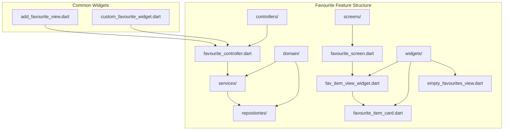
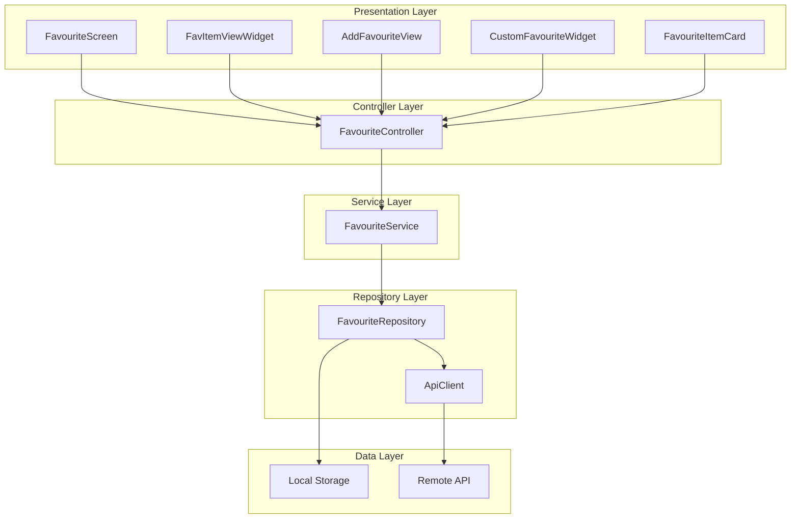
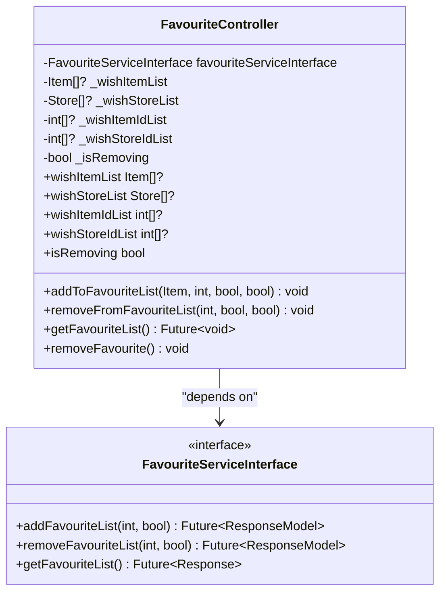
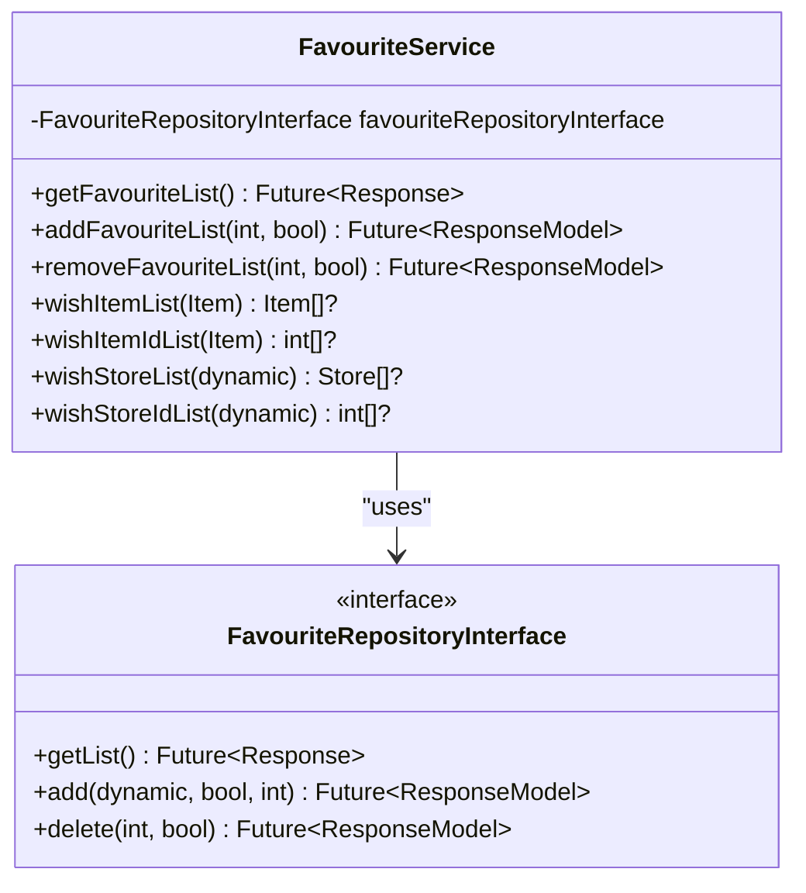
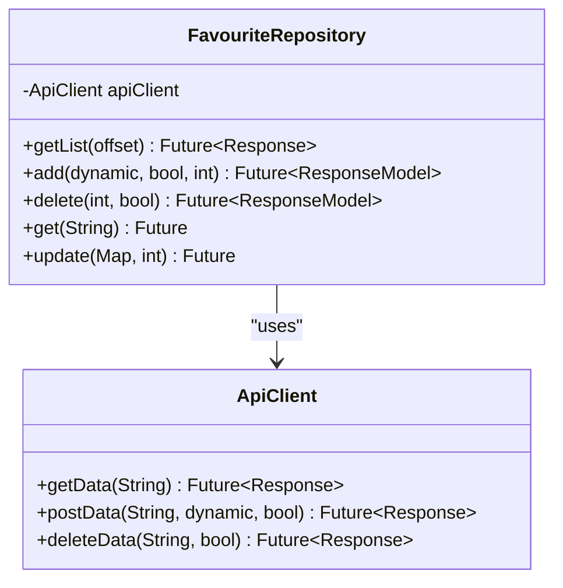
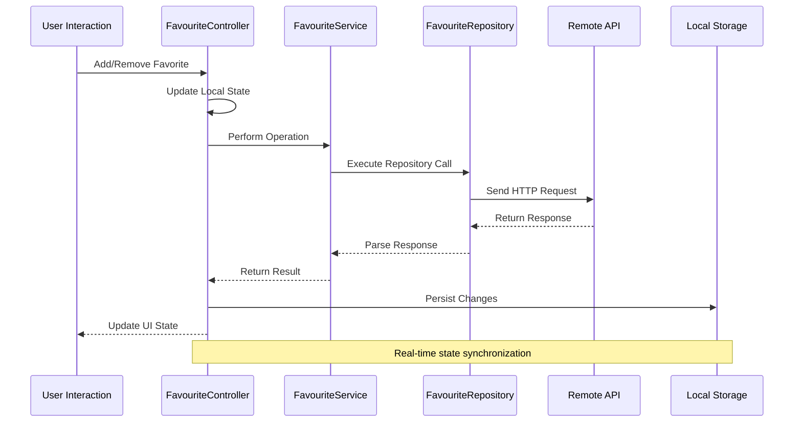
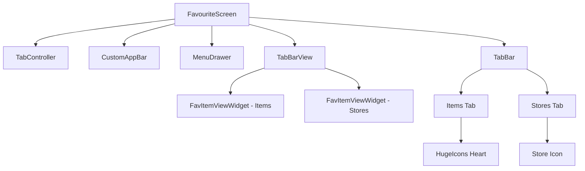
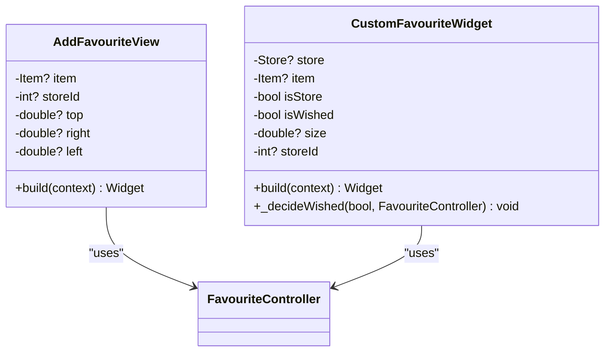
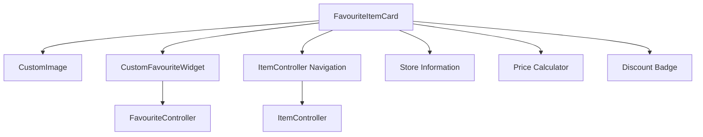

# Favourite Items

<cite>
**Referenced Files in This Document**
- [favourite_controller.dart](file://lib/features/favourite/controllers/favourite_controller.dart)
- [favourite_service.dart](file://lib/features/favourite/domain/services/favourite_service.dart)
- [favourite_repository.dart](file://lib/features/favourite/domain/repositories/favourite_repository.dart)
- [favourite_screen.dart](file://lib/features/favourite/screens/favourite_screen.dart)
- [fav_item_view_widget.dart](file://lib/features/favourite/widgets/fav_item_view_widget.dart)
- [favourite_item_card.dart](file://lib/features/favourite/widgets/favourite_item_card.dart)
- [add_favourite_view.dart](file://lib/common/widgets/add_favourite_view.dart)
- [custom_favourite_widget.dart](file://lib/common/widgets/custom_favourite_widget.dart)
</cite>

## Table of Contents
1. [Introduction](#introduction)
2. [Project Structure](#project-structure)
3. [Core Components](#core-components)
4. [Architecture Overview](#architecture-overview)
5. [Detailed Component Analysis](#detailed-component-analysis)
6. [Data Flow Analysis](#data-flow-analysis)
7. [UI Components](#ui-components)
8. [Integration Points](#integration-points)
9. [Performance Considerations](#performance-considerations)
10. [Troubleshooting Guide](#troubleshooting-guide)
11. [Conclusion](#conclusion)

## Introduction

The Favourite Items feature is a core functionality in the Waddi e-commerce application that allows users to save their preferred items and stores for quick access. This feature enables users to maintain a personal collection of favorite products and stores, providing a streamlined shopping experience with persistent favorites across sessions.

The implementation follows a clean architecture pattern with clear separation of concerns between presentation, business logic, and data persistence layers. The feature supports both individual items and store favorites, with real-time synchronization between local state and remote API services.

## Project Structure

The Favourite Items feature is organized within the `lib/features/favourite/` directory structure, following Flutter's modular architecture principles:

**Diagram sources**
- [favourite_controller.dart:1-162](file://lib/features/favourite/controllers/favourite_controller.dart#L1-L162)
- [favourite_service.dart:1-88](file://lib/features/favourite/domain/services/favourite_service.dart#L1-L88)
- [favourite_repository.dart:1-50](file://lib/features/favourite/domain/repositories/favourite_repository.dart#L1-L50)

**Section sources**
- [favourite_controller.dart:1-162](file://lib/features/favourite/controllers/favourite_controller.dart#L1-L162)
- [favourite_service.dart:1-88](file://lib/features/favourite/domain/services/favourite_service.dart#L1-L88)
- [favourite_repository.dart:1-50](file://lib/features/favourite/domain/repositories/favourite_repository.dart#L1-L50)

## Core Components

The Favourite Items feature consists of several interconnected components working together to provide seamless favorite management functionality:

### Controller Layer
The `FavouriteController` serves as the central orchestrator managing favorite items and stores. It maintains local state, handles user interactions, and coordinates with service and repository layers.

### Service Layer
The `FavouriteService` provides business logic for favorite operations, including filtering favorites based on user location and module configurations.

### Repository Layer
The `FavouriteRepository` handles all data persistence operations, communicating with the backend API for CRUD operations on favorite lists.

### Presentation Layer
Multiple UI components provide different interaction patterns for adding/removing favorites, including dedicated screen views and inline widgets.

**Section sources**
- [favourite_controller.dart:10-162](file://lib/features/favourite/controllers/favourite_controller.dart#L10-L162)
- [favourite_service.dart:9-88](file://lib/features/favourite/domain/services/favourite_service.dart#L9-L88)
- [favourite_repository.dart:7-50](file://lib/features/favourite/domain/repositories/favourite_repository.dart#L7-L50)

## Architecture Overview

The Favourite Items feature implements a layered architecture following Clean Architecture principles:

**Diagram sources**
- [favourite_controller.dart:10-162](file://lib/features/favourite/controllers/favourite_controller.dart#L10-L162)
- [favourite_service.dart:9-88](file://lib/features/favourite/domain/services/favourite_service.dart#L9-L88)
- [favourite_repository.dart:7-50](file://lib/features/favourite/domain/repositories/favourite_repository.dart#L7-L50)

The architecture ensures loose coupling between components while maintaining clear responsibility boundaries. The controller manages state and user interactions, the service handles business logic, and the repository manages data persistence.

## Detailed Component Analysis

### FavouriteController Analysis

The `FavouriteController` is the heart of the favorite management system, implementing comprehensive functionality for adding, removing, and retrieving favorite items and stores.

**Diagram sources**
- [favourite_controller.dart:10-162](file://lib/features/favourite/controllers/favourite_controller.dart#L10-L162)

Key responsibilities include:
- **State Management**: Maintains separate lists for items and stores with their respective IDs
- **User Interaction Handling**: Processes add/remove operations with proper error handling
- **API Coordination**: Coordinates between local state updates and remote API calls
- **Loading States**: Manages UI feedback during asynchronous operations

**Section sources**
- [favourite_controller.dart:29-105](file://lib/features/favourite/controllers/favourite_controller.dart#L29-L105)

### FavouriteService Analysis

The `FavouriteService` implements business logic for favorite operations, particularly focusing on location-based filtering and module compatibility checking.

**Diagram sources**
- [favourite_service.dart:9-88](file://lib/features/favourite/domain/services/favourite_service.dart#L9-L88)

The service implements sophisticated filtering logic that considers:
- **User Location**: Filters favorites based on user's current address zones
- **Module Compatibility**: Ensures favorites match the user's selected module type
- **Variation Support**: Handles different product variation types appropriately

**Section sources**
- [favourite_service.dart:28-86](file://lib/features/favourite/domain/services/favourite_service.dart#L28-L86)

### FavouriteRepository Analysis

The `FavouriteRepository` handles all data persistence operations, providing a clean interface between the service layer and external data sources.

**Diagram sources**
- [favourite_repository.dart:7-50](file://lib/features/favourite/domain/repositories/favourite_repository.dart#L7-L50)

The repository implements standardized API communication patterns:
- **Consistent Error Handling**: Standardized response model creation
- **Flexible URI Construction**: Dynamic endpoint building based on operation type
- **HTTP Method Abstraction**: Unified interface for GET, POST, and DELETE operations

**Section sources**
- [favourite_repository.dart:11-38](file://lib/features/favourite/domain/repositories/favourite_repository.dart#L11-L38)

## Data Flow Analysis

The Favourite Items feature implements a comprehensive data flow that ensures consistency between local state and remote storage:

**Diagram sources**
- [favourite_controller.dart:29-105](file://lib/features/favourite/controllers/favourite_controller.dart#L29-L105)
- [favourite_service.dart:13-26](file://lib/features/favourite/domain/services/favourite_service.dart#L13-L26)
- [favourite_repository.dart:17-38](file://lib/features/favourite/domain/repositories/favourite_repository.dart#L17-L38)

The data flow ensures:
- **Immediate UI Feedback**: Users see instant changes during operations
- **Error Recovery**: Automatic rollback on failed operations
- **State Consistency**: Local and remote states remain synchronized
- **Loading States**: Proper indication of ongoing operations

**Section sources**
- [favourite_controller.dart:29-154](file://lib/features/favourite/controllers/favourite_controller.dart#L29-L154)

## UI Components

The Favourite Items feature provides multiple UI components to accommodate different user interaction patterns and screen contexts.

### Main Favourite Screen

The primary screen presents favorites in a tabbed interface, separating items and stores for better organization:

**Diagram sources**
- [favourite_screen.dart:16-123](file://lib/features/favourite/screens/favourite_screen.dart#L16-L123)

### Inline Favorite Components

Several inline components allow users to add/remove favorites directly from item and store displays:

**Diagram sources**
- [add_favourite_view.dart:9-74](file://lib/common/widgets/add_favourite_view.dart#L9-L74)
- [custom_favourite_widget.dart:10-73](file://lib/common/widgets/custom_favourite_widget.dart#L10-L73)

### Favorite Item Card

The `FavouriteItemCard` provides a comprehensive display of favorite items with integrated action controls:

**Diagram sources**
- [favourite_item_card.dart:14-198](file://lib/features/favourite/widgets/favourite_item_card.dart#L14-L198)

**Section sources**
- [favourite_screen.dart:46-120](file://lib/features/favourite/screens/favourite_screen.dart#L46-L120)
- [add_favourite_view.dart:42-72](file://lib/common/widgets/add_favourite_view.dart#L42-L72)
- [custom_favourite_widget.dart:44-72](file://lib/common/widgets/custom_favourite_widget.dart#L44-L72)
- [favourite_item_card.dart:24-196](file://lib/features/favourite/widgets/favourite_item_card.dart#L24-L196)

## Integration Points

The Favourite Items feature integrates with several core system components to provide seamless functionality:

### Authentication Integration
The feature checks user authentication status before allowing favorite operations, ensuring only logged-in users can modify favorites.

### Module Configuration Integration
Favorites are filtered based on the user's selected module configuration, supporting different business models within the same application.

### Address Helper Integration
Location-based filtering ensures users only see favorites relevant to their current geographic area and supported modules.

### State Management Integration
The feature leverages GetX for reactive state management, providing automatic UI updates when favorite lists change.

**Section sources**
- [favourite_controller.dart:120-151](file://lib/features/favourite/controllers/favourite_controller.dart#L120-L151)
- [favourite_service.dart:28-86](file://lib/features/favourite/domain/services/favourite_service.dart#L28-L86)

## Performance Considerations

The Favourite Items feature implements several performance optimizations:

### Lazy Loading
Favorite lists are loaded only when needed, reducing initial application startup time.

### Efficient State Updates
GetX-based reactive state management ensures minimal UI updates when favorite lists change.

### Memory Management
Proper disposal of animation controllers and cleanup of temporary data structures prevent memory leaks.

### Network Optimization
Batch operations and efficient API calls minimize network overhead during favorite management.

## Troubleshooting Guide

Common issues and their solutions:

### Authentication Issues
**Problem**: Users cannot add favorites when not logged in
**Solution**: The system automatically checks authentication status and provides appropriate feedback

### Network Connectivity Problems
**Problem**: Favorite operations fail due to network issues
**Solution**: The system implements retry logic and provides user-friendly error messages

### State Synchronization Issues
**Problem**: UI shows outdated favorite status
**Solution**: Automatic refresh mechanisms ensure UI stays synchronized with server state

### Performance Issues
**Problem**: Large favorite lists cause slow loading
**Solution**: Pagination and lazy loading techniques optimize performance for large datasets

**Section sources**
- [favourite_controller.dart:42-59](file://lib/features/favourite/controllers/favourite_controller.dart#L42-L59)
- [favourite_controller.dart:90-102](file://lib/features/favourite/controllers/favourite_controller.dart#L90-L102)

## Conclusion

The Favourite Items feature demonstrates excellent implementation of modern Flutter architecture principles, providing a robust, scalable solution for favorite management. The clean separation of concerns, comprehensive error handling, and user-friendly interface design create a seamless experience for users while maintaining code maintainability and performance.

The feature successfully balances functionality with simplicity, offering multiple interaction patterns while maintaining consistent behavior across different contexts. The integration with authentication, location services, and module configurations ensures the feature adapts to various business requirements while remaining intuitive for end users.