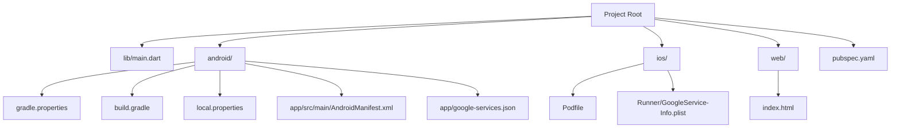
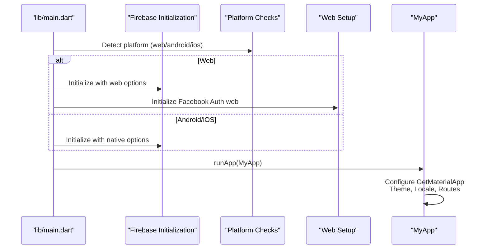
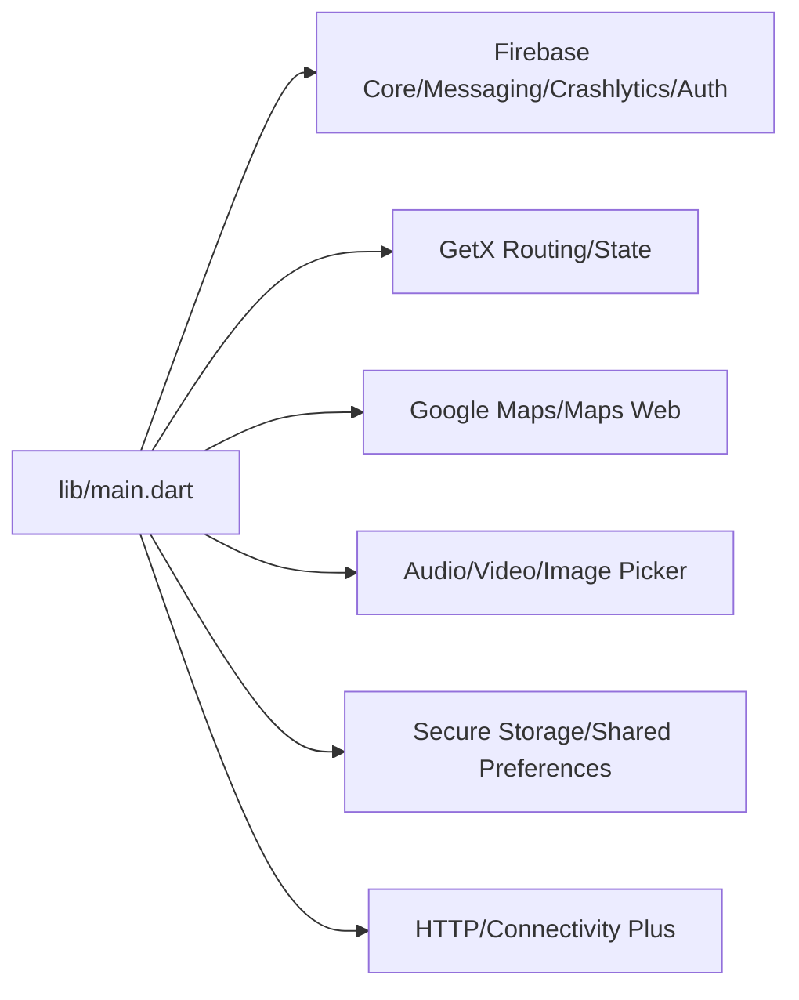

# Getting Started

<cite>
**Referenced Files in This Document**
- [pubspec.yaml](file://pubspec.yaml)
- [README.md](file://README.md)
- [lib/main.dart](file://lib/main.dart)
- [android/local.properties](file://android/local.properties)
- [android/gradle.properties](file://android/gradle.properties)
- [android/build.gradle](file://android/build.gradle)
- [android/app/src/main/AndroidManifest.xml](file://android/app/src/main/AndroidManifest.xml)
- [android/app/google-services.json](file://android/app/google-services.json)
- [ios/Podfile](file://ios/Podfile)
- [ios/Runner/GoogleService-Info.plist](file://ios/Runner/GoogleService-Info.plist)
- [web/index.html](file://web/index.html)
- [analysis_options.yaml](file://analysis_options.yaml)
- [devtools_options.yaml](file://devtools_options.yaml)
</cite>

## Table of Contents
1. [Introduction](#introduction)
2. [Project Structure](#project-structure)
3. [Core Components](#core-components)
4. [Architecture Overview](#architecture-overview)
5. [Detailed Component Analysis](#detailed-component-analysis)
6. [Dependency Analysis](#dependency-analysis)
7. [Performance Considerations](#performance-considerations)
8. [Troubleshooting Guide](#troubleshooting-guide)
9. [Conclusion](#conclusion)
10. [Appendices](#appendices)

## Introduction
This guide helps you set up the Waddi Multi-Vendor Marketplace development environment and run the application across Android, iOS, and Web. It covers Flutter SDK requirements, platform tooling (Android Studio and Xcode), Firebase configuration, dependency installation, environment setup, and step-by-step execution instructions. It also includes troubleshooting tips and development workflow recommendations.

## Project Structure
The project follows a standard Flutter structure with platform-specific configurations under android/, ios/, and web/. The application bootstraps in lib/main.dart and integrates Firebase for core services. Dependencies are declared in pubspec.yaml, while Android and iOS build settings are configured via Gradle and CocoaPods respectively.

**Diagram sources**
- [lib/main.dart](file://lib/main.dart)
- [pubspec.yaml](file://pubspec.yaml)
- [android/gradle.properties](file://android/gradle.properties)
- [android/build.gradle](file://android/build.gradle)
- [android/local.properties](file://android/local.properties)
- [android/app/src/main/AndroidManifest.xml](file://android/app/src/main/AndroidManifest.xml)
- [android/app/google-services.json](file://android/app/google-services.json)
- [ios/Podfile](file://ios/Podfile)
- [ios/Runner/GoogleService-Info.plist](file://ios/Runner/GoogleService-Info.plist)
- [web/index.html](file://web/index.html)

**Section sources**
- [pubspec.yaml](file://pubspec.yaml)
- [lib/main.dart](file://lib/main.dart)
- [android/local.properties](file://android/local.properties)
- [android/gradle.properties](file://android/gradle.properties)
- [android/build.gradle](file://android/build.gradle)
- [android/app/src/main/AndroidManifest.xml](file://android/app/src/main/AndroidManifest.xml)
- [android/app/google-services.json](file://android/app/google-services.json)
- [ios/Podfile](file://ios/Podfile)
- [ios/Runner/GoogleService-Info.plist](file://ios/Runner/GoogleService-Info.plist)
- [web/index.html](file://web/index.html)

## Core Components
- Flutter SDK requirement: The project targets a minimum SDK version defined in pubspec.yaml and a specific Flutter version referenced in README.md.
- Firebase integration: Firebase is initialized differently for web and native platforms, with platform-specific configuration files.
- Platform permissions and metadata: Android declares permissions and Google Maps API key; iOS declares Firebase configuration via plist.
- Web entrypoint: web/index.html sets up PWA, service worker hooks, and Firebase scripts for web builds.

Key setup steps:
- Install Flutter SDK meeting the version constraints.
- Configure Android Studio with Android SDK and JDK 17.
- Configure Xcode for iOS development.
- Install and configure Firebase for Android and iOS.
- Run dependency resolution and build for each platform.

**Section sources**
- [pubspec.yaml](file://pubspec.yaml)
- [README.md](file://README.md)
- [lib/main.dart](file://lib/main.dart)
- [android/app/src/main/AndroidManifest.xml](file://android/app/src/main/AndroidManifest.xml)
- [android/app/google-services.json](file://android/app/google-services.json)
- [ios/Runner/GoogleService-Info.plist](file://ios/Runner/GoogleService-Info.plist)
- [web/index.html](file://web/index.html)

## Architecture Overview
The application initializes platform-specific Firebase configurations, sets URL strategy for web, and boots the GetX-based routing and theming system. On web, Facebook Auth is initialized separately. Permissions and metadata are declared per platform.

**Diagram sources**
- [lib/main.dart](file://lib/main.dart)

**Section sources**
- [lib/main.dart](file://lib/main.dart)

## Detailed Component Analysis

### Flutter SDK and Environment
- Minimum Flutter SDK version is defined in pubspec.yaml.
- README.md indicates a Flutter version for development.
- Linting is configured via analysis_options.yaml using flutter_lints.

Recommended actions:
- Install the Flutter SDK matching the constraints in pubspec.yaml.
- Enable Dart and Flutter plugins in your editor.
- Verify your environment with flutter doctor.

**Section sources**
- [pubspec.yaml](file://pubspec.yaml)
- [README.md](file://README.md)
- [analysis_options.yaml](file://analysis_options.yaml)

### Android Studio Setup
- Android SDK path and Flutter SDK path are defined in android/local.properties.
- Gradle JVM memory and AndroidX/Jetifier flags are set in android/gradle.properties.
- Kotlin and Java toolchains are configured to use Java 17 in android/build.gradle.
- AndroidManifest.xml defines permissions, intent-filters, and metadata (e.g., Google Maps API key, Firebase channel ID, Facebook metadata).
- google-services.json provides Firebase configuration for Android.

Steps:
- Open the android/ folder in Android Studio.
- Ensure SDK paths in local.properties are correct.
- Sync Gradle with the project.
- Accept licenses and install required SDKs/build-tools.
- Build and run the app on an emulator or device.

**Section sources**
- [android/local.properties](file://android/local.properties)
- [android/gradle.properties](file://android/gradle.properties)
- [android/build.gradle](file://android/build.gradle)
- [android/app/src/main/AndroidManifest.xml](file://android/app/src/main/AndroidManifest.xml)
- [android/app/google-services.json](file://android/app/google-services.json)

### Xcode Configuration for iOS
- ios/Podfile specifies iOS deployment target and uses Flutter’s pod helper.
- Pods are installed modularly with use_frameworks! and use_modular_headers!.
- ios/Runner/GoogleService-Info.plist provides Firebase configuration for iOS.
- The project includes a Live Activity extension target with a minimum iOS version.

Steps:
- Open ios/Runner.xcworkspace in Xcode.
- Ensure CocoaPods dependencies are installed (run pod install if needed).
- Select a valid signing team and bundle identifier.
- Build and run on a simulator or physical device.

**Section sources**
- [ios/Podfile](file://ios/Podfile)
- [ios/Runner/GoogleService-Info.plist](file://ios/Runner/GoogleService-Info.plist)

### Web Development Prerequisites
- web/index.html is the web entrypoint with base href, PWA manifest, service worker hooks, and Firebase scripts.
- The app uses URL strategy configuration in lib/main.dart for clean URLs.
- Firebase is initialized with web options in lib/main.dart.

Steps:
- Ensure Firebase web configuration is present in lib/main.dart and web/index.html.
- Run flutter build web or flutter run -d chrome.
- Test PWA features and service worker registration.

**Section sources**
- [web/index.html](file://web/index.html)
- [lib/main.dart](file://lib/main.dart)

### Dependency Installation and Project Initialization
- pubspec.yaml lists all dependencies and dev_dependencies.
- dependency_overrides ensure compatible versions for selected packages.
- assets and fonts are configured in pubspec.yaml.
- Run flutter pub get to resolve dependencies.

Workflow:
- flutter pub get
- flutter packages pub run build_runner build --delete-conflicting-outputs (if using code generation)
- flutter pub run build_runner watch (for continuous code generation)

**Section sources**
- [pubspec.yaml](file://pubspec.yaml)
- [lib/main.dart](file://lib/main.dart)

### Running on Different Platforms
- Android
  - Use Android Studio or flutter run -d <device-id>.
  - Ensure google-services.json is present in android/app/.
- iOS
  - Use Xcode or flutter run -d <device-id>.
  - Ensure GoogleService-Info.plist is present in ios/Runner/.
- Web
  - Use flutter run -d chrome or flutter build web.
  - Ensure web/index.html is properly configured.

Notes:
- For web, URL strategy is set in lib/main.dart.
- For iOS, ensure pods are installed and signing is configured.

**Section sources**
- [lib/main.dart](file://lib/main.dart)
- [android/app/google-services.json](file://android/app/google-services.json)
- [ios/Runner/GoogleService-Info.plist](file://ios/Runner/GoogleService-Info.plist)
- [web/index.html](file://web/index.html)

## Dependency Analysis
The project relies on a comprehensive set of Flutter packages for UI, state management, authentication, notifications, maps, payments, and media. Firebase is integrated for core services, with platform-specific initialization and configuration files.

**Diagram sources**
- [lib/main.dart](file://lib/main.dart)
- [pubspec.yaml](file://pubspec.yaml)

**Section sources**
- [pubspec.yaml](file://pubspec.yaml)
- [lib/main.dart](file://lib/main.dart)

## Performance Considerations
- Keep Flutter SDK aligned with the project’s constraints to avoid compatibility issues.
- Use release builds for performance testing on Android and iOS.
- For web, ensure service worker and caching strategies are configured appropriately.
- Optimize asset loading and minimize heavy animations for smoother UX.

[No sources needed since this section provides general guidance]

## Troubleshooting Guide
Common setup issues and resolutions:
- Flutter SDK mismatch
  - Ensure your Flutter version satisfies the SDK constraint in pubspec.yaml and the version indicated in README.md.
- Android build failures
  - Verify sdk.dir and flutter.sdk in android/local.properties.
  - Confirm Java 17 toolchain and AndroidX/Jetifier flags in android/gradle.properties and android/build.gradle.
  - Ensure google-services.json is present in android/app/.
- iOS build failures
  - Run pod install in ios/ and open ios/Runner.xcworkspace in Xcode.
  - Confirm GoogleService-Info.plist is present in ios/Runner/.
  - Ensure iOS deployment target meets ios/Podfile requirements.
- Web build issues
  - Confirm web/index.html includes Firebase scripts and manifest.
  - Ensure URL strategy is set in lib/main.dart.
- Firebase initialization errors
  - Validate platform-specific Firebase options in lib/main.dart.
  - Confirm API keys and project IDs match the provided configuration files.

**Section sources**
- [pubspec.yaml](file://pubspec.yaml)
- [README.md](file://README.md)
- [android/local.properties](file://android/local.properties)
- [android/gradle.properties](file://android/gradle.properties)
- [android/build.gradle](file://android/build.gradle)
- [android/app/google-services.json](file://android/app/google-services.json)
- [ios/Podfile](file://ios/Podfile)
- [ios/Runner/GoogleService-Info.plist](file://ios/Runner/GoogleService-Info.plist)
- [web/index.html](file://web/index.html)
- [lib/main.dart](file://lib/main.dart)

## Conclusion
You now have the essentials to set up the Waddi Multi-Vendor Marketplace locally, configure platform-specific environments, and run the application across Android, iOS, and Web. Follow the platform-specific steps, ensure Firebase configuration is in place, and leverage the dependency graph outlined here to maintain a healthy development workflow.

[No sources needed since this section summarizes without analyzing specific files]

## Appendices
- Development tools configuration
  - analysis_options.yaml enables recommended lints.
  - devtools_options.yaml is present for DevTools extensions.
- Environment variables
  - No explicit environment variable files were found in the repository. If your backend requires secrets, add them to platform-specific configuration files or secure storage as appropriate.

**Section sources**
- [analysis_options.yaml](file://analysis_options.yaml)
- [devtools_options.yaml](file://devtools_options.yaml)