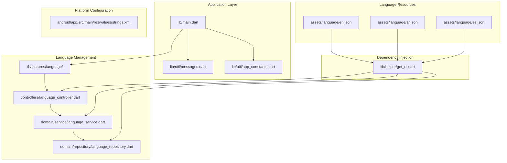
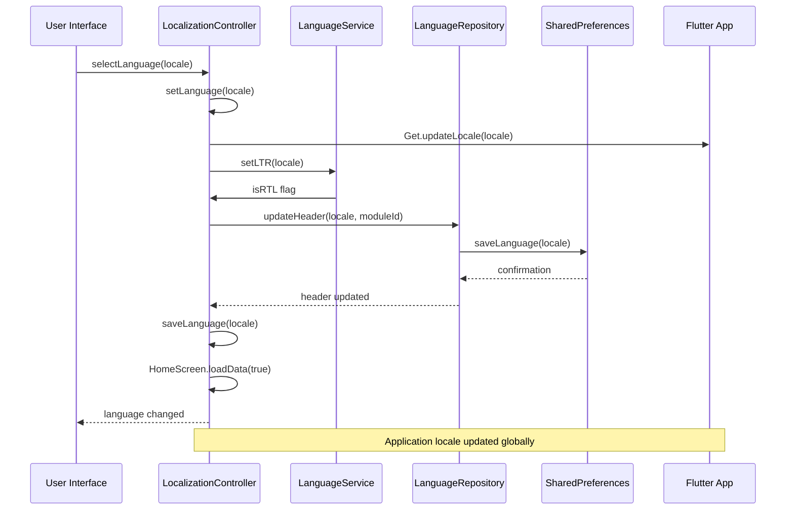
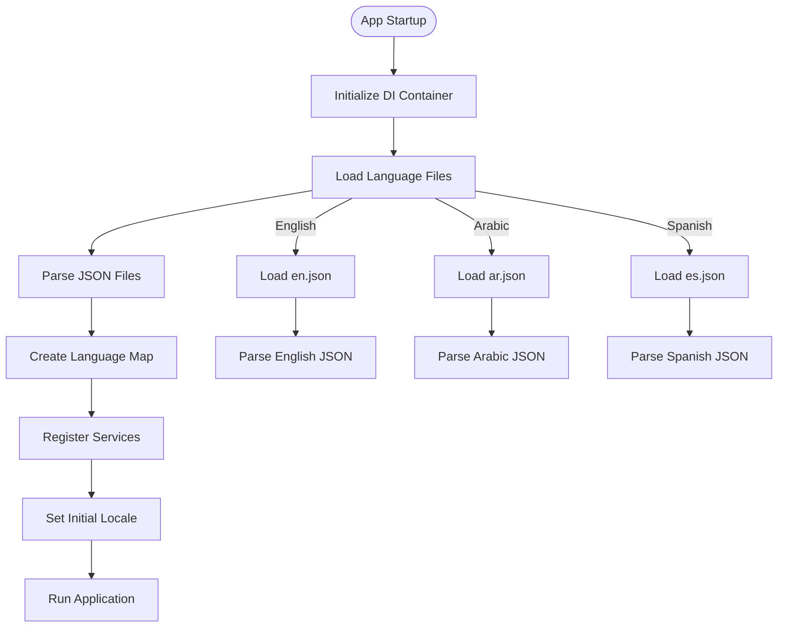
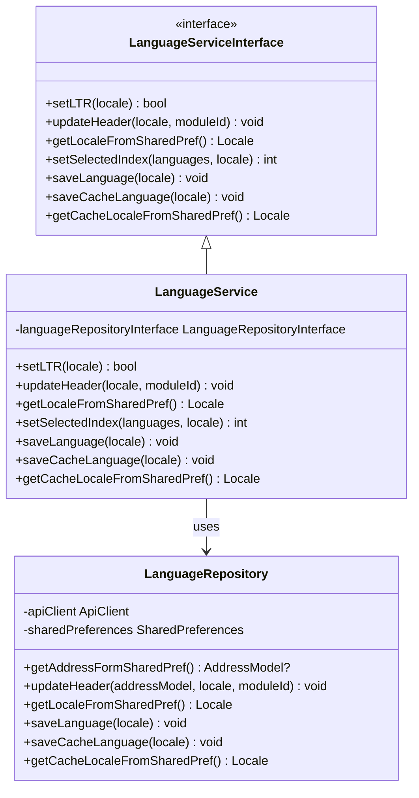
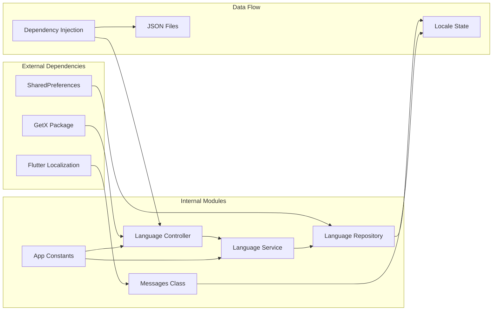

# Internationalization Localization

<cite>
**Referenced Files in This Document**
- [main.dart](file://lib/main.dart)
- [messages.dart](file://lib/util/messages.dart)
- [app_constants.dart](file://lib/util/app_constants.dart)
- [language_controller.dart](file://lib/features/language/controllers/language_controller.dart)
- [language_service_interface.dart](file://lib/features/language/domain/service/language_service_interface.dart)
- [language_service.dart](file://lib/features/language/domain/service/language_service.dart)
- [language_repository.dart](file://lib/features/language/domain/repository/language_repository.dart)
- [get_di.dart](file://lib/helper/get_di.dart)
- [en.json](file://assets/language/en.json)
- [ar.json](file://assets/language/ar.json)
- [es.json](file://assets/language/es.json)
- [strings.xml](file://android/app/src/main/res/values/strings.xml)
</cite>

## Table of Contents
1. [Introduction](#introduction)
2. [Project Structure](#project-structure)
3. [Core Components](#core-components)
4. [Architecture Overview](#architecture-overview)
5. [Detailed Component Analysis](#detailed-component-analysis)
6. [Dependency Analysis](#dependency-analysis)
7. [Performance Considerations](#performance-considerations)
8. [Troubleshooting Guide](#troubleshooting-guide)
9. [Conclusion](#conclusion)

## Introduction
This document provides comprehensive documentation for the internationalization and localization implementation in the Waddi e-commerce application. The system supports multiple languages with automatic locale detection, persistent language preferences, and proper right-to-left (RTL) layout support for Arabic. The implementation leverages Flutter's built-in localization system combined with a custom dependency injection pattern to manage language resources efficiently.

## Project Structure
The internationalization system is organized across several key directories and files:

**Diagram sources**
- [main.dart:35-103](file://lib/main.dart#L35-L103)
- [get_di.dart:220-756](file://lib/helper/get_di.dart#L220-L756)

**Section sources**
- [main.dart:1-249](file://lib/main.dart#L1-L249)
- [get_di.dart:1-757](file://lib/helper/get_di.dart#L1-L757)

## Core Components

### Language Resource Management
The system manages language resources through JSON files containing key-value pairs for each supported language. Currently supporting three languages:

- **English (en)**: Complete translation covering all application features
- **Arabic (ar)**: RTL language support with proper directional layout
- **Spanish (es)**: Partial translation with room for expansion

Each language file contains approximately 2,000+ translation keys covering UI elements, error messages, navigation text, and business-specific terminology.

### Localization Controller
The `LocalizationController` serves as the central hub for language management, handling locale switching, persistence, and UI updates. Key responsibilities include:

- Managing current locale state
- Handling language selection from UI
- Updating application-wide locale settings
- Persisting language preferences
- Triggering data refresh when language changes

**Section sources**
- [language_controller.dart:1-86](file://lib/features/language/controllers/language_controller.dart#L1-L86)
- [app_constants.dart:374-399](file://lib/util/app_constants.dart#L374-L399)

## Architecture Overview

**Diagram sources**
- [language_controller.dart:29-50](file://lib/features/language/controllers/language_controller.dart#L29-L50)
- [language_service.dart:11-22](file://lib/features/language/domain/service/language_service.dart#L11-L22)
- [language_repository.dart:41-44](file://lib/features/language/domain/repository/language_repository.dart#L41-L44)

The architecture follows a layered pattern with clear separation of concerns:

1. **Presentation Layer**: UI components using GetX for reactive state management
2. **Domain Layer**: Business logic encapsulated in service classes
3. **Data Layer**: Repository pattern for data access and persistence
4. **Resource Layer**: JSON-based translation files

**Section sources**
- [language_service_interface.dart:1-13](file://lib/features/language/domain/service/language_service_interface.dart#L1-L13)
- [language_service.dart:1-56](file://lib/features/language/domain/service/language_service.dart#L1-L56)

## Detailed Component Analysis

### Dependency Injection Setup
The application uses a centralized dependency injection system that loads all language resources during startup:

**Diagram sources**
- [get_di.dart:220-756](file://lib/helper/get_di.dart#L220-L756)

The dependency injection system handles:
- Loading all JSON language files from assets
- Parsing JSON content into Dart maps
- Creating a unified language resource map
- Registering all services with GetX dependency injection

**Section sources**
- [get_di.dart:741-756](file://lib/helper/get_di.dart#L741-L756)

### Language Service Implementation
The `LanguageService` implements the core business logic for language management:

**Diagram sources**
- [language_service_interface.dart:1-13](file://lib/features/language/domain/service/language_service_interface.dart#L1-L13)
- [language_service.dart:7-56](file://lib/features/language/domain/service/language_service.dart#L7-L56)
- [language_repository.dart:9-83](file://lib/features/language/domain/repository/language_repository.dart#L9-L83)

**Section sources**
- [language_service.dart:1-56](file://lib/features/language/domain/service/language_service.dart#L1-L56)
- [language_repository.dart:1-83](file://lib/features/language/domain/repository/language_repository.dart#L1-L83)

### Translation Key Management
The application uses a structured approach to translation keys:

| Key Category | Examples | Purpose |
|--------------|----------|---------|
| UI Elements | `view_menu`, `save`, `select_language` | Basic interface elements |
| Authentication | `sign_in`, `sign_up`, `password` | User authentication screens |
| Navigation | `my_orders`, `profile`, `settings` | Main navigation items |
| Commerce | `add_to_cart`, `checkout`, `order_placed` | Shopping and ordering |
| Status Messages | `loading`, `success`, `error` | User feedback and status |

Each key follows a consistent naming convention using snake_case for readability and maintainability.

**Section sources**
- [en.json:1-800](file://assets/language/en.json#L1-L800)
- [ar.json:1-800](file://assets/language/ar.json#L1-L800)
- [es.json:1-800](file://assets/language/es.json#L1-L800)

## Dependency Analysis

**Diagram sources**
- [main.dart:105-239](file://lib/main.dart#L105-L239)
- [get_di.dart:678-679](file://lib/helper/get_di.dart#L678-L679)

The dependency graph reveals a clean separation of concerns:
- External dependencies are minimal and focused
- Internal modules follow SOLID principles
- Data flows in a predictable, unidirectional manner
- State management is centralized through GetX

**Section sources**
- [main.dart:1-249](file://lib/main.dart#L1-L249)
- [get_di.dart:1-757](file://lib/helper/get_di.dart#L1-L757)

## Performance Considerations

### Resource Loading Optimization
The application implements efficient resource loading strategies:

1. **Lazy Loading**: Language files are loaded only when needed
2. **Memory Management**: JSON parsing occurs once during initialization
3. **Caching**: Language preferences are cached in SharedPreferences
4. **Selective Updates**: Only affected UI components are rebuilt on language change

### Locale Detection and Persistence
The system handles locale detection through multiple mechanisms:

- **Automatic Detection**: Based on device locale settings
- **User Preference**: Persistent language choice
- **Fallback Mechanism**: Default to English if detection fails
- **Cache Validation**: Validates cached locale against available languages

### RTL Layout Support
Arabic language support includes comprehensive RTL layout handling:

- Automatic text direction adjustment
- Mirrored UI element positioning
- Proper date/time formatting
- Numeric character support

## Troubleshooting Guide

### Common Issues and Solutions

**Issue**: Language changes not persisting
- **Cause**: SharedPreferences not properly updated
- **Solution**: Verify `saveLanguage` method execution and SharedPreferences keys

**Issue**: Incorrect RTL layout for Arabic
- **Cause**: Missing `setLTR` implementation
- **Solution**: Ensure `LanguageService.setLTR` returns correct direction flag

**Issue**: Missing translation keys
- **Cause**: Keys not present in all language files
- **Solution**: Add missing keys to all language JSON files using English as reference

**Issue**: App crashes on language change
- **Cause**: Null locale values or invalid language codes
- **Solution**: Implement proper validation and fallback mechanisms

### Debugging Tools
The system includes several debugging capabilities:

- Console logging for locale changes
- Error handling for JSON parsing failures
- Graceful fallback to default language
- Validation of language file integrity

**Section sources**
- [language_controller.dart:29-50](file://lib/features/language/controllers/language_controller.dart#L29-L50)
- [language_service.dart:11-16](file://lib/features/language/domain/service/language_service.dart#L11-L16)

## Conclusion

The Waddi internationalization and localization system demonstrates a robust, scalable approach to multi-language support in Flutter applications. The implementation successfully balances flexibility with maintainability through:

- Clean architectural separation of concerns
- Comprehensive dependency injection pattern
- Efficient resource management and caching
- Proper RTL layout support
- Extensible design for future language additions

The system provides a solid foundation for global expansion while maintaining excellent user experience across different locales. The modular design ensures easy maintenance and extension as the application grows and evolves.