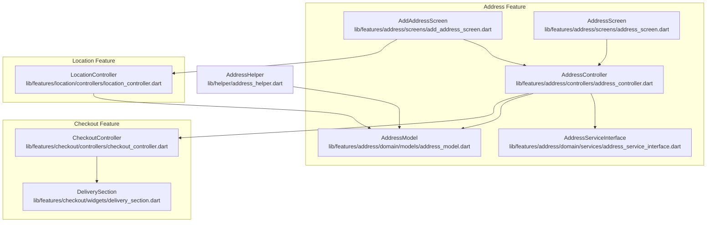
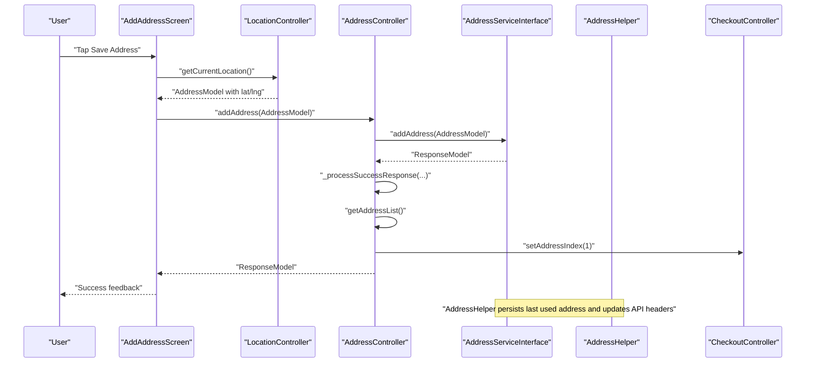
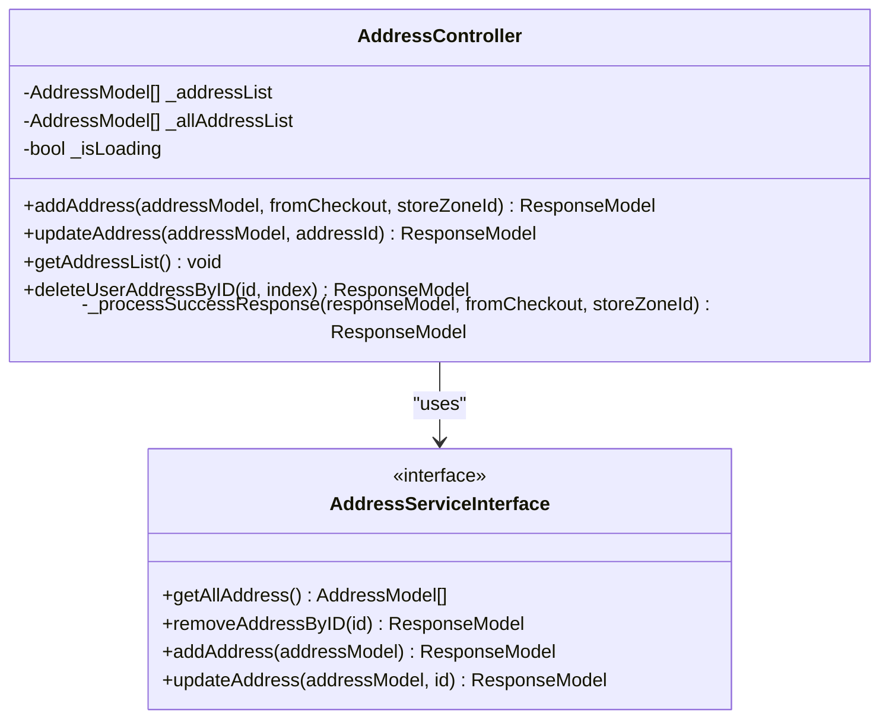
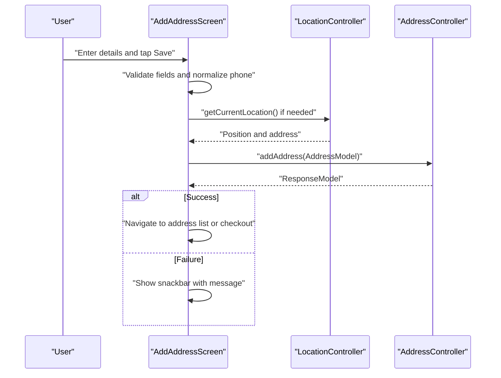
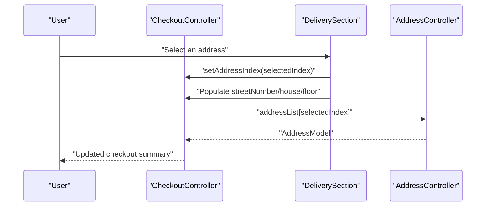
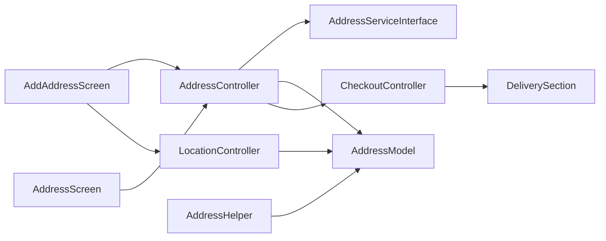

# Address Management System

<cite>
**Referenced Files in This Document**
- [address_controller.dart](file://lib/features/address/controllers/address_controller.dart)
- [address_model.dart](file://lib/features/address/domain/models/address_model.dart)
- [address_service_interface.dart](file://lib/features/address/domain/services/address_service_interface.dart)
- [add_address_screen.dart](file://lib/features/address/screens/add_address_screen.dart)
- [address_screen.dart](file://lib/features/address/screens/address_screen.dart)
- [location_controller.dart](file://lib/features/location/controllers/location_controller.dart)
- [address_helper.dart](file://lib/helper/address_helper.dart)
- [checkout_controller.dart](file://lib/features/checkout/controllers/checkout_controller.dart)
- [delivery_section.dart](file://lib/features/checkout/widgets/delivery_section.dart)
</cite>

## Table of Contents
1. [Introduction](#introduction)
2. [Project Structure](#project-structure)
3. [Core Components](#core-components)
4. [Architecture Overview](#architecture-overview)
5. [Detailed Component Analysis](#detailed-component-analysis)
6. [Dependency Analysis](#dependency-analysis)
7. [Performance Considerations](#performance-considerations)
8. [Troubleshooting Guide](#troubleshooting-guide)
9. [Conclusion](#conclusion)
10. [Appendices](#appendices)

## Introduction
This document describes the Address Management System, covering address storage, validation, user preferences, formatting, and integration with location services and checkout. It explains how addresses are created, verified, retrieved, modified, and selected during checkout, along with privacy and security considerations for storing user address data.

## Project Structure
The address management feature is organized around three layers:
- Domain: models and service interfaces
- Screens: UI for adding/updating addresses and viewing saved addresses
- Controllers: orchestration of data flow and integration with location and checkout

**Diagram sources**
- [address_controller.dart:8-79](file://lib/features/address/controllers/address_controller.dart#L8-L79)
- [address_model.dart:3-95](file://lib/features/address/domain/models/address_model.dart#L3-L95)
- [address_service_interface.dart:4-9](file://lib/features/address/domain/services/address_service_interface.dart#L4-L9)
- [add_address_screen.dart:35-1151](file://lib/features/address/screens/add_address_screen.dart#L35-L1151)
- [address_screen.dart:22-509](file://lib/features/address/screens/address_screen.dart#L22-L509)
- [location_controller.dart:37-200](file://lib/features/location/controllers/location_controller.dart#L37-L200)
- [checkout_controller.dart:37-200](file://lib/features/checkout/controllers/checkout_controller.dart#L37-L200)
- [delivery_section.dart:100-250](file://lib/features/checkout/widgets/delivery_section.dart#L100-L250)
- [address_helper.dart:10-45](file://lib/helper/address_helper.dart#L10-L45)

**Section sources**
- [address_controller.dart:8-79](file://lib/features/address/controllers/address_controller.dart#L8-L79)
- [add_address_screen.dart:35-1151](file://lib/features/address/screens/add_address_screen.dart#L35-L1151)
- [address_screen.dart:22-509](file://lib/features/address/screens/address_screen.dart#L22-L509)
- [location_controller.dart:37-200](file://lib/features/location/controllers/location_controller.dart#L37-L200)
- [checkout_controller.dart:37-200](file://lib/features/checkout/controllers/checkout_controller.dart#L37-L200)
- [delivery_section.dart:100-250](file://lib/features/checkout/widgets/delivery_section.dart#L100-L250)
- [address_helper.dart:10-45](file://lib/helper/address_helper.dart#L10-L45)

## Core Components
- AddressController: orchestrates CRUD operations for addresses, handles success/error responses, and coordinates with checkout after successful creation.
- AddressModel: serializable DTO for address data including contact info, geolocation, zone metadata, and optional unit fields.
- AddressServiceInterface: abstraction for persistence operations (add, update, delete, list).
- AddAddressScreen: interactive map-based UI for address creation with automatic location detection and manual editing.
- AddressScreen: lists saved addresses, supports edit/delete actions, and triggers address updates.
- LocationController: integrates geolocation, reverse geocoding, zone validation, and map interactions.
- AddressHelper: manages persistent storage of the last used address via shared preferences and updates API headers accordingly.
- CheckoutController and DeliverySection: select addresses for checkout, populate unit fields, and compute distances.

**Section sources**
- [address_controller.dart:8-79](file://lib/features/address/controllers/address_controller.dart#L8-L79)
- [address_model.dart:3-95](file://lib/features/address/domain/models/address_model.dart#L3-L95)
- [address_service_interface.dart:4-9](file://lib/features/address/domain/services/address_service_interface.dart#L4-L9)
- [add_address_screen.dart:35-1151](file://lib/features/address/screens/add_address_screen.dart#L35-L1151)
- [address_screen.dart:22-509](file://lib/features/address/screens/address_screen.dart#L22-L509)
- [location_controller.dart:37-200](file://lib/features/location/controllers/location_controller.dart#L37-L200)
- [address_helper.dart:10-45](file://lib/helper/address_helper.dart#L10-L45)
- [checkout_controller.dart:37-200](file://lib/features/checkout/controllers/checkout_controller.dart#L37-L200)
- [delivery_section.dart:100-250](file://lib/features/checkout/widgets/delivery_section.dart#L100-L250)

## Architecture Overview
The system follows a layered architecture:
- UI layer: AddAddressScreen and AddressScreen
- Controller layer: AddressController, LocationController, CheckoutController
- Domain layer: AddressModel and AddressServiceInterface
- Persistence layer: AddressHelper for shared preferences

**Diagram sources**
- [add_address_screen.dart:1068-1150](file://lib/features/address/screens/add_address_screen.dart#L1068-L1150)
- [location_controller.dart:129-155](file://lib/features/location/controllers/location_controller.dart#L129-L155)
- [address_controller.dart:21-77](file://lib/features/address/controllers/address_controller.dart#L21-L77)
- [address_helper.dart:12-24](file://lib/helper/address_helper.dart#L12-L24)
- [checkout_controller.dart:252-252](file://lib/features/checkout/controllers/checkout_controller.dart#L252-L252)

## Detailed Component Analysis

### AddressController
Responsibilities:
- Add/update/remove addresses via AddressServiceInterface
- Load address list and maintain in-memory cache
- Post-add validation against zone compatibility when triggered from checkout
- Notify checkout controller to select the newly added address

Key behaviors:
- Loading state management and reactive UI updates
- Success response processing with zone validation and UI navigation hints
- Deletion removes item locally and refreshes list

**Diagram sources**
- [address_controller.dart:8-79](file://lib/features/address/controllers/address_controller.dart#L8-L79)
- [address_service_interface.dart:4-9](file://lib/features/address/domain/services/address_service_interface.dart#L4-L9)

**Section sources**
- [address_controller.dart:8-79](file://lib/features/address/controllers/address_controller.dart#L8-L79)

### AddressModel
Structure:
- Core: id, addressType, contactPersonName, contactPersonNumber, address, latitude, longitude, zoneId, zoneIds, method
- Optional: streetNumber, house, floor, zoneData, areaIds, email
- Serialization: fromJson and toJson for persistence and network transport

Validation and normalization:
- Phone numbers parsed and normalized during editing
- Zone metadata included for delivery eligibility checks

**Section sources**
- [address_model.dart:3-95](file://lib/features/address/domain/models/address_model.dart#L3-L95)

### AddAddressScreen
Features:
- Map-first UX with draggable bottom sheet for form entry
- Automatic current location detection with permission handling
- Reverse geocoded address display and manual override
- Address type chips (Home, Office, Others) and custom label
- Phone number parsing with country dial code picker
- Guest checkout support with email capture

Workflows:
- Save: validates inputs, constructs AddressModel, calls AddressController.addAddress
- Update: prepares AddressModel and calls AddressController.updateAddress
- Zone validation: ensures new address falls within store zone when fromCheckout is true

**Diagram sources**
- [add_address_screen.dart:1068-1150](file://lib/features/address/screens/add_address_screen.dart#L1068-L1150)
- [location_controller.dart:129-155](file://lib/features/location/controllers/location_controller.dart#L129-L155)
- [address_controller.dart:21-41](file://lib/features/address/controllers/address_controller.dart#L21-L41)

**Section sources**
- [add_address_screen.dart:35-1151](file://lib/features/address/screens/add_address_screen.dart#L35-L1151)

### AddressScreen
Capabilities:
- Lists saved addresses with action sheet (Edit/Delete)
- Pull-to-refresh to reload addresses
- Empty state with call-to-action to add new address
- Desktop and mobile layouts

Integration:
- Delegates to AddressController for list refresh and deletion
- Opens edit route with pre-filled AddressModel

**Section sources**
- [address_screen.dart:22-509](file://lib/features/address/screens/address_screen.dart#L22-L509)

### LocationController
Role:
- Provides current position and reverse geocodes to address text
- Validates zone membership and exposes zone metadata
- Animates map camera and updates UI state reactively
- Syncs zone data and updates persisted address when internet is available

AddressHelper integration:
- Persists last used address and updates API headers for subsequent requests

**Section sources**
- [location_controller.dart:37-200](file://lib/features/location/controllers/location_controller.dart#L37-L200)
- [address_helper.dart:10-45](file://lib/helper/address_helper.dart#L10-L45)

### Checkout Integration
CheckoutController:
- Maintains addressIndex to track selected address
- Populates unit fields (streetNumber, house, floor) from selected address
- Computes distances between customer and store locations

DeliverySection:
- Presents selectable address list
- Updates addressIndex and prefills unit fields
- Triggers distance calculation on selection

**Diagram sources**
- [checkout_controller.dart:252-252](file://lib/features/checkout/controllers/checkout_controller.dart#L252-L252)
- [delivery_section.dart:100-192](file://lib/features/checkout/widgets/delivery_section.dart#L100-L192)
- [address_controller.dart:13-14](file://lib/features/address/controllers/address_controller.dart#L13-L14)

**Section sources**
- [checkout_controller.dart:37-200](file://lib/features/checkout/controllers/checkout_controller.dart#L37-L200)
- [delivery_section.dart:100-250](file://lib/features/checkout/widgets/delivery_section.dart#L100-L250)

## Dependency Analysis
- AddressController depends on AddressServiceInterface for persistence and AddressModel for data transfer.
- AddAddressScreen depends on LocationController for geolocation and AddressController for persistence.
- AddressScreen depends on AddressController for listing and deletion.
- LocationController depends on geolocation APIs and provides AddressModel with zone metadata.
- AddressHelper persists AddressModel and updates API headers.
- CheckoutController and DeliverySection depend on AddressController’s address list and index.

**Diagram sources**
- [add_address_screen.dart:35-1151](file://lib/features/address/screens/add_address_screen.dart#L35-L1151)
- [address_screen.dart:22-509](file://lib/features/address/screens/address_screen.dart#L22-L509)
- [address_controller.dart:8-79](file://lib/features/address/controllers/address_controller.dart#L8-L79)
- [location_controller.dart:37-200](file://lib/features/location/controllers/location_controller.dart#L37-L200)
- [checkout_controller.dart:37-200](file://lib/features/checkout/controllers/checkout_controller.dart#L37-L200)
- [delivery_section.dart:100-250](file://lib/features/checkout/widgets/delivery_section.dart#L100-L250)
- [address_helper.dart:10-45](file://lib/helper/address_helper.dart#L10-L45)

**Section sources**
- [address_controller.dart:8-79](file://lib/features/address/controllers/address_controller.dart#L8-L79)
- [add_address_screen.dart:35-1151](file://lib/features/address/screens/add_address_screen.dart#L35-L1151)
- [address_screen.dart:22-509](file://lib/features/address/screens/address_screen.dart#L22-L509)
- [location_controller.dart:37-200](file://lib/features/location/controllers/location_controller.dart#L37-L200)
- [checkout_controller.dart:37-200](file://lib/features/checkout/controllers/checkout_controller.dart#L37-L200)
- [delivery_section.dart:100-250](file://lib/features/checkout/widgets/delivery_section.dart#L100-L250)
- [address_helper.dart:10-45](file://lib/helper/address_helper.dart#L10-L45)

## Performance Considerations
- Minimize repeated geocoding by caching reverse-geocoded address strings in LocationController.
- Debounce map camera events to reduce frequent zone queries.
- Use reactive controllers (GetX) to avoid unnecessary rebuilds.
- Persist only essential address metadata to reduce payload sizes.

## Troubleshooting Guide
Common issues and resolutions:
- Address not saved:
  - Verify phone number validation and country dial code selection.
  - Confirm AddressController.isLoading reflects operation progress.
- Zone mismatch when adding from checkout:
  - Ensure store zone ID is passed and validated; AddressController returns a failure message when zones differ.
- Location permissions denied:
  - Use the permission dialog and guide users to enable permissions in system settings.
- Duplicate or malformed phone numbers:
  - Normalize phone numbers using the built-in validator and country code picker.
- Address not appearing in checkout:
  - Trigger AddressController.getAddressList() and confirm addressIndex is updated in CheckoutController.

**Section sources**
- [add_address_screen.dart:1068-1150](file://lib/features/address/screens/add_address_screen.dart#L1068-L1150)
- [address_controller.dart:66-77](file://lib/features/address/controllers/address_controller.dart#L66-L77)
- [location_controller.dart:129-155](file://lib/features/location/controllers/location_controller.dart#L129-L155)

## Conclusion
The Address Management System integrates location services, validation, and checkout seamlessly. It supports automatic address detection, manual editing, and robust persistence. The modular design enables easy extension for internationalization, privacy controls, and advanced validation rules.

## Appendices

### Address Creation Workflow
- Open AddAddressScreen
- Allow location access or manually pick a place on the map
- Fill contact and unit fields; choose address type
- Tap Save; AddressController adds the address and notifies CheckoutController
- On success, navigate to address list or checkout

**Section sources**
- [add_address_screen.dart:1068-1150](file://lib/features/address/screens/add_address_screen.dart#L1068-L1150)
- [address_controller.dart:21-41](file://lib/features/address/controllers/address_controller.dart#L21-L41)

### Address Verification and Zone Validation
- After adding, AddressController checks whether the address zone matches the store zone when fromCheckout is true
- If mismatched, returns a localized message indicating the zone restriction

**Section sources**
- [address_controller.dart:66-77](file://lib/features/address/controllers/address_controller.dart#L66-L77)

### Default Address Selection in Checkout
- DeliverySection displays selectable addresses
- On selection, CheckoutController updates addressIndex and prefills unit fields
- Distance computation uses selected address coordinates

**Section sources**
- [delivery_section.dart:100-192](file://lib/features/checkout/widgets/delivery_section.dart#L100-L192)
- [checkout_controller.dart:252-252](file://lib/features/checkout/controllers/checkout_controller.dart#L252-L252)

### Privacy and Secure Storage
- AddressHelper stores the last used AddressModel in shared preferences
- API headers are updated with address zone context for secure and region-aware requests
- Consider encrypting sensitive fields if required by policy

**Section sources**
- [address_helper.dart:12-24](file://lib/helper/address_helper.dart#L12-L24)

### Access Location Screen and Permissions
- Uses Geolocator to check and request permissions
- Handles denied, deniedForever, and authorized states
- Shows a permission dialog when location access is permanently denied

**Section sources**
- [add_address_screen.dart:1036-1048](file://lib/features/address/screens/add_address_screen.dart#L1036-L1048)

### International Address Handling and Formatting
- AddressModel includes optional fields for streetNumber, house, floor to support varied formats
- Country dial code picker normalizes phone numbers for international users
- Zone metadata (zoneIds, zoneData, areaIds) enables region-specific validation

**Section sources**
- [address_model.dart:3-95](file://lib/features/address/domain/models/address_model.dart#L3-L95)
- [add_address_screen.dart:440-472](file://lib/features/address/screens/add_address_screen.dart#L440-L472)