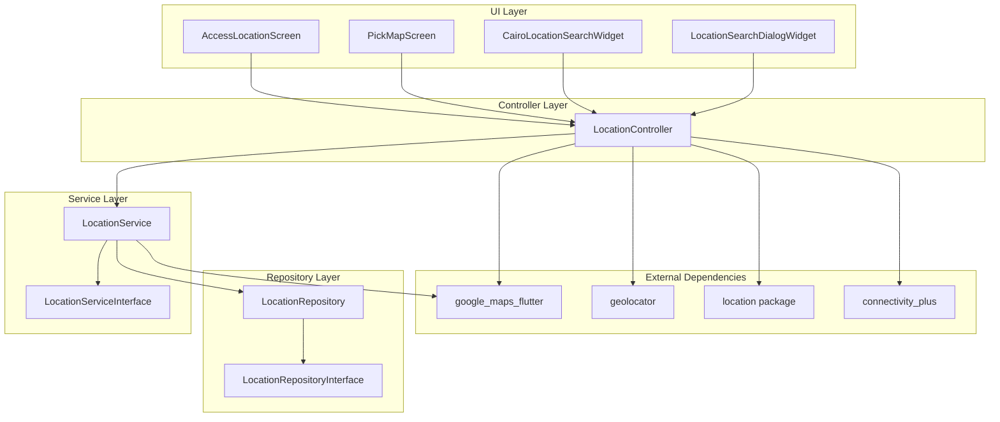
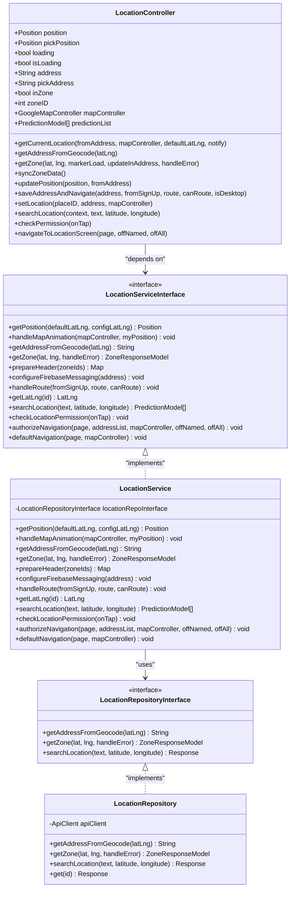
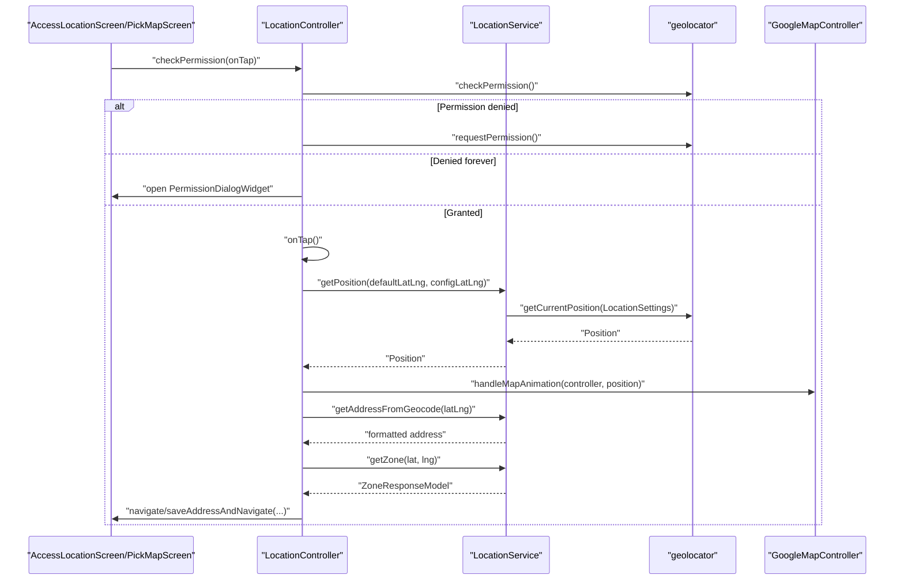
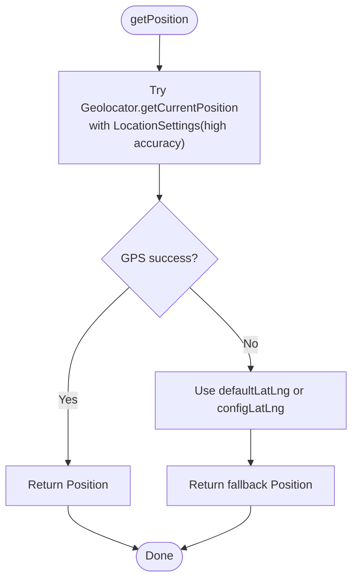
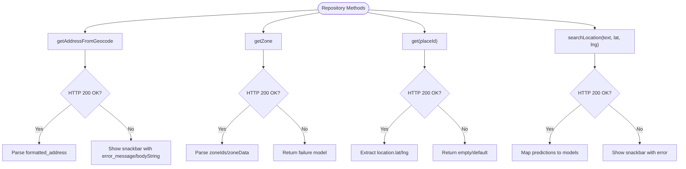
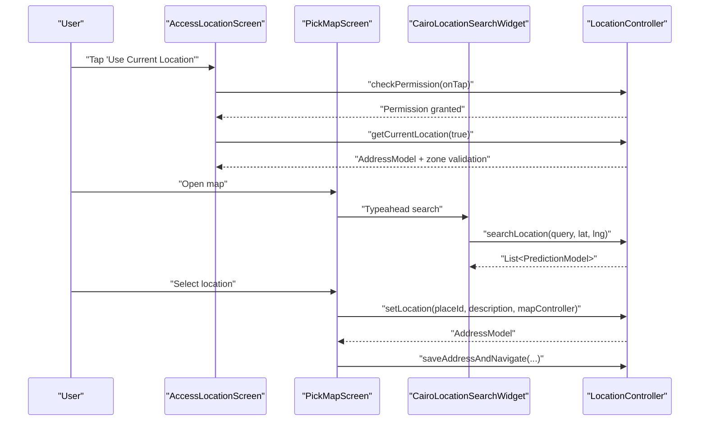
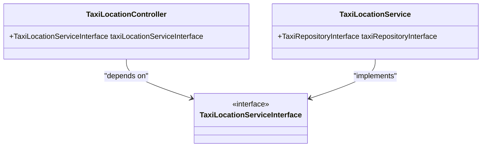
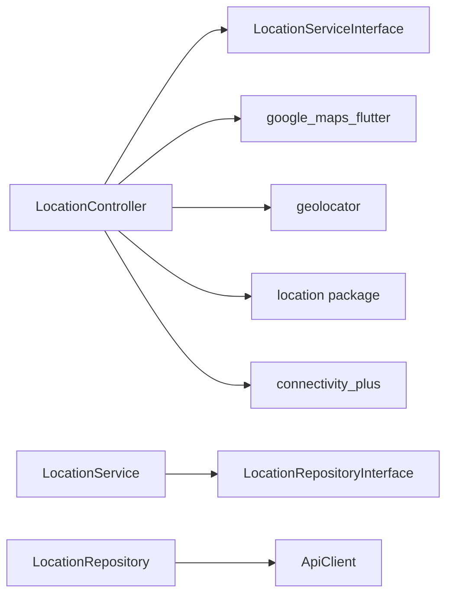

# Geolocation Implementation

<cite>
**Referenced Files in This Document**
- [location_controller.dart](file://lib/features/location/controllers/location_controller.dart)
- [location_service.dart](file://lib/features/location/domain/services/location_service.dart)
- [location_service_interface.dart](file://lib/features/location/domain/services/location_service_interface.dart)
- [location_repository.dart](file://lib/features/location/domain/repositories/location_repository.dart)
- [location_repository_interface.dart](file://lib/features/location/domain/repositories/location_repository_interface.dart)
- [access_location_screen.dart](file://lib/features/location/screens/access_location_screen.dart)
- [pick_map_screen.dart](file://lib/features/location/screens/pick_map_screen.dart)
- [cairo_location_search_widget.dart](file://lib/features/location/widgets/cairo_location_search_widget.dart)
- [location_search_dialog_widget.dart](file://lib/features/location/widgets/location_search_dialog_widget.dart)
- [permission_dialog_widget.dart](file://lib/features/location/widgets/permission_dialog_widget.dart)
- [taxi_location_service.dart](file://lib/features/rental_module/domain/services/taxi_location_service.dart)
- [taxi_location_controller.dart](file://lib/features/rental_module/controller/taxi_location_controller.dart)
- [taxi_location_service_interface.dart](file://lib/features/rental_module/domain/services/taxi_location_service_interface.dart)
</cite>

## Table of Contents
1. [Introduction](#introduction)
2. [Project Structure](#project-structure)
3. [Core Components](#core-components)
4. [Architecture Overview](#architecture-overview)
5. [Detailed Component Analysis](#detailed-component-analysis)
6. [Dependency Analysis](#dependency-analysis)
7. [Performance Considerations](#performance-considerations)
8. [Troubleshooting Guide](#troubleshooting-guide)
9. [Privacy and Security](#privacy-and-security)
10. [Conclusion](#conclusion)

## Introduction
This document explains the geolocation implementation system used to capture user location, resolve addresses, validate service zones, and integrate with Google Maps. It covers the LocationController workflow, the service and repository layers, dependency injection via GetX, and UI components for location selection. It also documents permission handling, fallback mechanisms, battery optimization, integration with Google Maps SDK, and privacy considerations.

## Project Structure
The geolocation system is organized around a layered architecture:
- Controllers orchestrate user interactions and coordinate services
- Services encapsulate platform-specific location logic and external API calls
- Repositories handle network requests and data mapping
- Screens and widgets provide the UI for location selection and search

**Diagram sources**
- [access_location_screen.dart:1-235](file://lib/features/location/screens/access_location_screen.dart#L1-L235)
- [pick_map_screen.dart:1-534](file://lib/features/location/screens/pick_map_screen.dart#L1-L534)
- [cairo_location_search_widget.dart:1-247](file://lib/features/location/widgets/cairo_location_search_widget.dart#L1-L247)
- [location_search_dialog_widget.dart:1-81](file://lib/features/location/widgets/location_search_dialog_widget.dart#L1-L81)
- [location_controller.dart:1-650](file://lib/features/location/controllers/location_controller.dart#L1-L650)
- [location_service.dart:1-198](file://lib/features/location/domain/services/location_service.dart#L1-L198)
- [location_service_interface.dart:1-20](file://lib/features/location/domain/services/location_service_interface.dart#L1-L20)
- [location_repository.dart:1-77](file://lib/features/location/domain/repositories/location_repository.dart#L1-L77)
- [location_repository_interface.dart:1-10](file://lib/features/location/domain/repositories/location_repository_interface.dart#L1-L10)

**Section sources**
- [location_controller.dart:1-650](file://lib/features/location/controllers/location_controller.dart#L1-L650)
- [location_service.dart:1-198](file://lib/features/location/domain/services/location_service.dart#L1-L198)
- [location_repository.dart:1-77](file://lib/features/location/domain/repositories/location_repository.dart#L1-L77)
- [access_location_screen.dart:1-235](file://lib/features/location/screens/access_location_screen.dart#L1-L235)
- [pick_map_screen.dart:1-534](file://lib/features/location/screens/pick_map_screen.dart#L1-L534)
- [cairo_location_search_widget.dart:1-247](file://lib/features/location/widgets/cairo_location_search_widget.dart#L1-L247)
- [location_search_dialog_widget.dart:1-81](file://lib/features/location/widgets/location_search_dialog_widget.dart#L1-L81)

## Core Components
- LocationController: Central orchestrator for location operations, UI state, and navigation. Handles permission checks, current location retrieval, reverse geocoding, zone validation, and Google Maps integration.
- LocationService: Implements location logic and integrates with geolocator, Google Maps, Firebase Messaging, and routing.
- LocationRepository: Encapsulates API calls for geocoding, zone lookup, and place details.
- UI Screens and Widgets: Provide location selection via map and search, with permission dialogs and desktop/mobile layouts.

Key responsibilities:
- GPS integration: Uses geolocator for high-accuracy position retrieval with fallback to defaults.
- Location permissions: Checks and requests permissions, handles permanent denials.
- Real-time updates: Listens to map camera movements and updates selected position/address.
- Zone validation: Validates whether the location falls within supported zones.
- Google Maps integration: Animates camera, displays markers, and supports place search.

**Section sources**
- [location_controller.dart:37-650](file://lib/features/location/controllers/location_controller.dart#L37-L650)
- [location_service.dart:22-198](file://lib/features/location/domain/services/location_service.dart#L22-L198)
- [location_repository.dart:10-77](file://lib/features/location/domain/repositories/location_repository.dart#L10-L77)

## Architecture Overview
The system follows a clean architecture with clear separation of concerns:
- UI triggers actions via LocationController
- Controller delegates to LocationService for platform and API logic
- Service uses LocationRepository for network operations
- External SDKs (google_maps_flutter, geolocator) are abstracted behind service methods

**Diagram sources**
- [location_controller.dart:37-650](file://lib/features/location/controllers/location_controller.dart#L37-L650)
- [location_service_interface.dart:7-20](file://lib/features/location/domain/services/location_service_interface.dart#L7-L20)
- [location_service.dart:22-198](file://lib/features/location/domain/services/location_service.dart#L22-L198)
- [location_repository_interface.dart:6-10](file://lib/features/location/domain/repositories/location_repository_interface.dart#L6-L10)
- [location_repository.dart:10-77](file://lib/features/location/domain/repositories/location_repository.dart#L10-L77)

## Detailed Component Analysis

### LocationController Workflow
LocationController coordinates the entire flow from permission request to successful location acquisition and navigation.

**Diagram sources**
- [location_controller.dart:499-588](file://lib/features/location/controllers/location_controller.dart#L499-L588)
- [location_service.dart:38-51](file://lib/features/location/domain/services/location_service.dart#L38-L51)
- [permission_dialog_widget.dart:1-56](file://lib/features/location/widgets/permission_dialog_widget.dart#L1-L56)

Key flows:
- Permission handling: Checks and requests permissions; opens settings for permanent denials.
- Current location retrieval: Uses geolocator with high accuracy; falls back to default or config coordinates on failure.
- Reverse geocoding: Converts coordinates to human-readable address.
- Zone validation: Ensures the location is within supported zones; disables confirm button if not.
- Navigation: Saves address, updates Firebase topics, and routes to appropriate screen.

**Section sources**
- [location_controller.dart:129-155](file://lib/features/location/controllers/location_controller.dart#L129-L155)
- [location_controller.dart:162-186](file://lib/features/location/controllers/location_controller.dart#L162-L186)
- [location_controller.dart:281-334](file://lib/features/location/controllers/location_controller.dart#L281-L334)
- [location_controller.dart:560-588](file://lib/features/location/controllers/location_controller.dart#L560-L588)

### LocationService Implementation
LocationService encapsulates platform and API logic:
- Position retrieval: Attempts high-accuracy GPS; on failure, returns default/config coordinates.
- Map animation: Centers and zooms the map on the retrieved position.
- Zone and address resolution: Delegates to repository for geocoding and zone lookup.
- Firebase messaging: Subscribes/unsubscribes to zone-specific topics based on address.
- Routing: Handles navigation after successful location setup.

**Diagram sources**
- [location_service.dart:38-51](file://lib/features/location/domain/services/location_service.dart#L38-L51)

**Section sources**
- [location_service.dart:22-198](file://lib/features/location/domain/services/location_service.dart#L22-L198)

### LocationRepository and Network Calls
LocationRepository performs HTTP requests to:
- Geocode coordinates to formatted addresses
- Fetch zone information by latitude/longitude
- Retrieve place details by place ID
- Search locations with optional proximity bias

**Diagram sources**
- [location_repository.dart:16-48](file://lib/features/location/domain/repositories/location_repository.dart#L16-L48)

**Section sources**
- [location_repository.dart:10-77](file://lib/features/location/domain/repositories/location_repository.dart#L10-L77)

### UI Components and User Interactions
- AccessLocationScreen: Presents options to use current location or pick from map; handles internet connectivity and navigation.
- PickMapScreen: Full-screen map with search, camera movement listeners, and confirm action.
- CairoLocationSearchWidget: Location search with Cairo, Egypt bias and proximity weighting.
- LocationSearchDialogWidget: Reusable typeahead for location search.
- PermissionDialogWidget: Guides users to app settings for location permissions.

**Diagram sources**
- [access_location_screen.dart:165-191](file://lib/features/location/screens/access_location_screen.dart#L165-L191)
- [pick_map_screen.dart:28-58](file://lib/features/location/screens/pick_map_screen.dart#L28-L58)
- [cairo_location_search_widget.dart:35-69](file://lib/features/location/widgets/cairo_location_search_widget.dart#L35-L69)
- [location_search_dialog_widget.dart:52-75](file://lib/features/location/widgets/location_search_dialog_widget.dart#L52-L75)
- [location_controller.dart:459-486](file://lib/features/location/controllers/location_controller.dart#L459-L486)

**Section sources**
- [access_location_screen.dart:1-235](file://lib/features/location/screens/access_location_screen.dart#L1-L235)
- [pick_map_screen.dart:1-534](file://lib/features/location/screens/pick_map_screen.dart#L1-L534)
- [cairo_location_search_widget.dart:1-247](file://lib/features/location/widgets/cairo_location_search_widget.dart#L1-L247)
- [location_search_dialog_widget.dart:1-81](file://lib/features/location/widgets/location_search_dialog_widget.dart#L1-L81)
- [permission_dialog_widget.dart:1-56](file://lib/features/location/widgets/permission_dialog_widget.dart#L1-L56)

### Rental Module Integration
The rental/taxi module reuses the same geolocation infrastructure via dedicated controller and service interfaces. While the concrete implementations are placeholders, the design supports consistent location handling across modules.

**Diagram sources**
- [taxi_location_controller.dart:5-10](file://lib/features/rental_module/controller/taxi_location_controller.dart#L5-L10)
- [taxi_location_service.dart:4-8](file://lib/features/rental_module/domain/services/taxi_location_service.dart#L4-L8)
- [taxi_location_service_interface.dart](file://lib/features/rental_module/domain/services/taxi_location_service_interface.dart)

**Section sources**
- [taxi_location_controller.dart:1-10](file://lib/features/rental_module/controller/taxi_location_controller.dart#L1-L10)
- [taxi_location_service.dart:1-8](file://lib/features/rental_module/domain/services/taxi_location_service.dart#L1-L8)

## Dependency Analysis
- External SDKs: google_maps_flutter for map rendering and camera control; geolocator for GPS; location for service enabling; connectivity_plus for network checks.
- Internal DI: LocationController receives LocationServiceInterface via constructor; LocationService receives LocationRepositoryInterface; controllers are registered with GetX.
- Coupling: High cohesion within each layer; low coupling via interfaces; repositories encapsulate network concerns.

**Diagram sources**
- [location_controller.dart:37-40](file://lib/features/location/controllers/location_controller.dart#L37-L40)
- [location_service.dart:22-24](file://lib/features/location/domain/services/location_service.dart#L22-L24)
- [location_repository.dart:10-13](file://lib/features/location/domain/repositories/location_repository.dart#L10-L13)

**Section sources**
- [location_controller.dart:1-36](file://lib/features/location/controllers/location_controller.dart#L1-L36)
- [location_service.dart:1-21](file://lib/features/location/domain/services/location_service.dart#L1-L21)
- [location_repository.dart:1-9](file://lib/features/location/domain/repositories/location_repository.dart#L1-L9)

## Performance Considerations
- Accuracy vs battery: The service retrieves high-accuracy positions. For background or frequent updates, consider lowering accuracy and increasing distance filter to reduce power consumption.
- Debounce search: The search widget already filters empty queries and shows a spinner; ensure debouncing at the controller level to avoid excessive API calls.
- Map updates: Camera idle events trigger zone/address updates; batch UI updates and avoid redundant reverse geocoding.
- Network checks: Use connectivity_plus to prevent unnecessary network calls when offline.
- Caching: Cache recent addresses and zone data locally to minimize repeated network requests.

[No sources needed since this section provides general guidance]

## Troubleshooting Guide
Common issues and resolutions:
- Location permission denied: Prompt users to grant permission; if permanently denied, open app settings via PermissionDialogWidget.
- Location services disabled: Use the location package to prompt users to enable device location services.
- GPS fails: Fallback to default/config coordinates; inform users and allow manual map selection.
- Internet unavailable: Show NoInternetScreen and block zone/address operations until connectivity is restored.
- Zone validation fails: Disable confirm button and guide users to select another location or explore the app with a warning dialog.

**Section sources**
- [location_controller.dart:560-588](file://lib/features/location/controllers/location_controller.dart#L560-L588)
- [location_controller.dart:590-597](file://lib/features/location/controllers/location_controller.dart#L590-L597)
- [location_service.dart:38-51](file://lib/features/location/domain/services/location_service.dart#L38-L51)
- [permission_dialog_widget.dart:44-47](file://lib/features/location/widgets/permission_dialog_widget.dart#L44-L47)

## Privacy and Security
- Consent management: Always check and request permissions before accessing location. Respect user choices and provide clear UI to open settings.
- Data minimization: Only collect latitude/longitude and necessary address components. Avoid storing sensitive personal data unnecessarily.
- Secure storage: Store user address in shared preferences; avoid logging raw coordinates.
- Firebase topics: Subscribe/unsubscribe to zone-specific topics based on user location to limit targeted notifications.
- Transparency: Inform users why location is needed and how it is used.

[No sources needed since this section provides general guidance]

## Conclusion
The geolocation system cleanly separates UI, business logic, and data access. It integrates GPS, Google Maps, and external APIs while handling permissions, fallbacks, and zone validation. The modular design allows reuse across modules like rentals, and the interface-driven architecture supports testing and future enhancements.