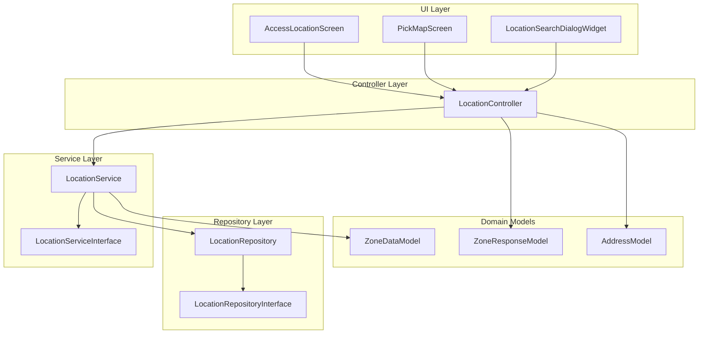
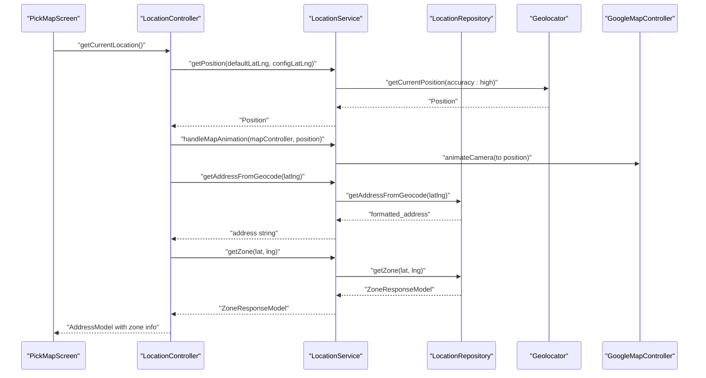
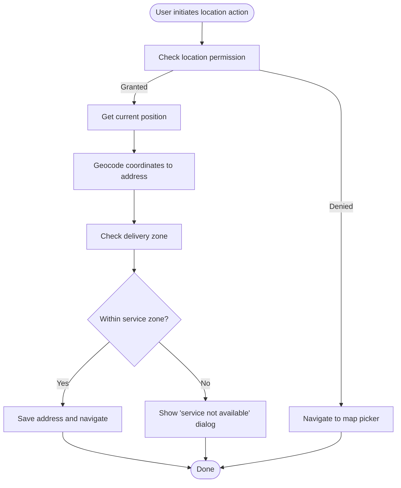
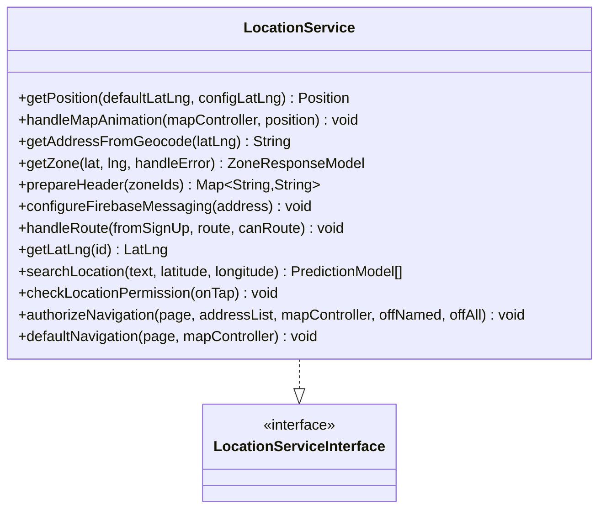
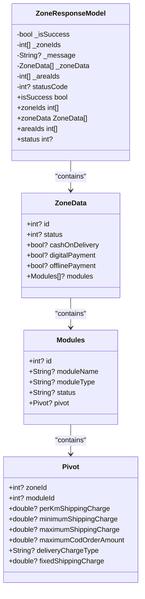
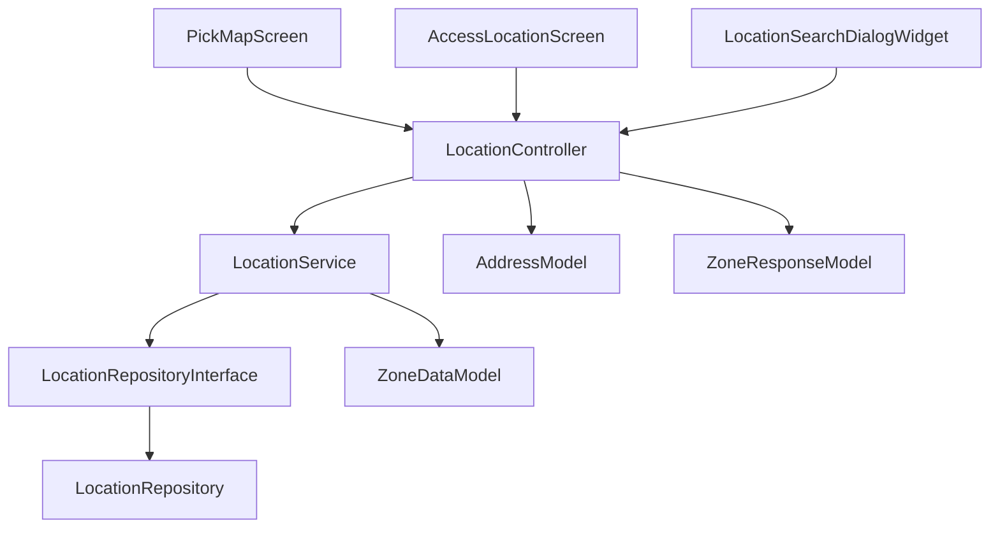

# Location Services

<cite>
**Referenced Files in This Document**
- [location_controller.dart](file://lib/features/location/controllers/location_controller.dart)
- [location_service.dart](file://lib/features/location/domain/services/location_service.dart)
- [location_service_interface.dart](file://lib/features/location/domain/services/location_service_interface.dart)
- [location_repository.dart](file://lib/features/location/domain/repositories/location_repository.dart)
- [location_repository_interface.dart](file://lib/features/location/domain/repositories/location_repository_interface.dart)
- [zone_model.dart](file://lib/features/location/domain/models/zone_model.dart)
- [zone_response_model.dart](file://lib/features/location/domain/models/zone_response_model.dart)
- [zone_data_model.dart](file://lib/features/location/domain/models/zone_data_model.dart)
- [address_model.dart](file://lib/features/address/domain/models/address_model.dart)
- [access_location_screen.dart](file://lib/features/location/screens/access_location_screen.dart)
- [pick_map_screen.dart](file://lib/features/location/screens/pick_map_screen.dart)
- [location_search_dialog_widget.dart](file://lib/features/location/widgets/location_search_dialog_widget.dart)
</cite>

## Table of Contents
1. [Introduction](#introduction)
2. [Project Structure](#project-structure)
3. [Core Components](#core-components)
4. [Architecture Overview](#architecture-overview)
5. [Detailed Component Analysis](#detailed-component-analysis)
6. [Dependency Analysis](#dependency-analysis)
7. [Performance Considerations](#performance-considerations)
8. [Troubleshooting Guide](#troubleshooting-guide)
9. [Conclusion](#conclusion)
10. [Appendices](#appendices)

## Introduction
This document explains the location services system, focusing on geolocation implementation, zone-based delivery areas, map integration, and address management. It covers how LocationController orchestrates GPS integration, address validation, and delivery zone determination, and how the system integrates with order management, delivery personnel coordination, and real-time tracking. Privacy considerations, accuracy, offline handling, and performance optimization are addressed alongside concrete examples from the codebase.

## Project Structure
The location services feature is organized around a layered architecture:
- Controllers coordinate UI flows and state
- Services encapsulate platform integrations (GPS, map animations, Firebase messaging)
- Repositories handle network requests and geocoding
- Models represent domain entities (zones, addresses, predictions)
- Screens and widgets render map interactions and address selection

**Diagram sources**
- [access_location_screen.dart:30-154](file://lib/features/location/screens/access_location_screen.dart#L30-L154)
- [pick_map_screen.dart:23-336](file://lib/features/location/screens/pick_map_screen.dart#L23-L336)
- [location_search_dialog_widget.dart:11-81](file://lib/features/location/widgets/location_search_dialog_widget.dart#L11-L81)
- [location_controller.dart:37-650](file://lib/features/location/controllers/location_controller.dart#L37-L650)
- [location_service.dart:22-198](file://lib/features/location/domain/services/location_service.dart#L22-L198)
- [location_service_interface.dart:7-20](file://lib/features/location/domain/services/location_service_interface.dart#L7-L20)
- [location_repository.dart:10-25](file://lib/features/location/domain/repositories/location_repository.dart#L10-L25)
- [location_repository_interface.dart:6-10](file://lib/features/location/domain/repositories/location_repository_interface.dart#L6-L10)
- [zone_response_model.dart:1-176](file://lib/features/location/domain/models/zone_response_model.dart#L1-L176)
- [zone_data_model.dart:3-48](file://lib/features/location/domain/models/zone_data_model.dart#L3-L48)
- [address_model.dart:3-95](file://lib/features/address/domain/models/address_model.dart#L3-L95)

**Section sources**
- [location_controller.dart:37-650](file://lib/features/location/controllers/location_controller.dart#L37-L650)
- [location_service.dart:22-198](file://lib/features/location/domain/services/location_service.dart#L22-L198)
- [location_repository.dart:10-25](file://lib/features/location/domain/repositories/location_repository.dart#L10-L25)
- [zone_response_model.dart:1-176](file://lib/features/location/domain/models/zone_response_model.dart#L1-L176)
- [address_model.dart:3-95](file://lib/features/address/domain/models/address_model.dart#L3-L95)

## Core Components
- LocationController: Central orchestrator for location flows, GPS retrieval, geocoding, zone checks, and navigation after address selection.
- LocationService: Implements platform-specific behaviors (GPS accuracy, map animations, Firebase topics, routing).
- LocationRepository: Performs network calls for geocoding and zone queries.
- Models: ZoneResponseModel, ZoneData, AddressModel, and supporting structures define the delivery zone and address data contracts.
- Screens and Widgets: AccessLocationScreen and PickMapScreen provide user interactions for location selection and map picking.

Key responsibilities:
- Fetch current position with configurable accuracy
- Convert coordinates to human-readable addresses
- Determine delivery zones and related metadata
- Manage Firebase topic subscriptions per zone
- Coordinate navigation to appropriate screens after selection
- Handle permissions and fallbacks for offline scenarios

**Section sources**
- [location_controller.dart:129-155](file://lib/features/location/controllers/location_controller.dart#L129-L155)
- [location_service.dart:38-51](file://lib/features/location/domain/services/location_service.dart#L38-L51)
- [location_repository.dart:16-25](file://lib/features/location/domain/repositories/location_repository.dart#L16-L25)
- [zone_response_model.dart:1-176](file://lib/features/location/domain/models/zone_response_model.dart#L1-L176)
- [address_model.dart:3-95](file://lib/features/address/domain/models/address_model.dart#L3-L95)

## Architecture Overview
The system follows a clean architecture with clear separation of concerns:
- UI triggers actions via LocationController
- LocationController delegates to LocationService for platform integrations
- LocationService uses LocationRepository for network operations
- Domain models carry zone and address data across layers
- Navigation and Firebase messaging are coordinated centrally

**Diagram sources**
- [pick_map_screen.dart:84-112](file://lib/features/location/screens/pick_map_screen.dart#L84-L112)
- [location_controller.dart:129-155](file://lib/features/location/controllers/location_controller.dart#L129-L155)
- [location_service.dart:38-60](file://lib/features/location/domain/services/location_service.dart#L38-L60)
- [location_repository.dart:16-25](file://lib/features/location/domain/repositories/location_repository.dart#L16-L25)

**Section sources**
- [location_controller.dart:129-186](file://lib/features/location/controllers/location_controller.dart#L129-L186)
- [location_service.dart:27-60](file://lib/features/location/domain/services/location_service.dart#L27-L60)
- [location_repository.dart:16-25](file://lib/features/location/domain/repositories/location_repository.dart#L16-L25)

## Detailed Component Analysis

### LocationController
Responsibilities:
- Retrieve current position and animate map camera
- Convert coordinates to address via geocoding
- Determine zone membership and update UI state
- Save selected address and trigger navigation
- Handle permissions and fallbacks for desktop/web
- Synchronize zone data and manage Firebase topics

Key flows:
- Current location fetch and zone validation
- Map drag events updating candidate position and address
- Place selection via search or map pin
- Zone synchronization and navigation after selection

Concrete examples from codebase:
- [location_controller.dart:129-155](file://lib/features/location/controllers/location_controller.dart#L129-L155): Fetch current location, animate map, geocode, and determine zone
- [location_controller.dart:212-242](file://lib/features/location/controllers/location_controller.dart#L212-L242): Update position on camera idle and re-check zone/address
- [location_controller.dart:459-486](file://lib/features/location/controllers/location_controller.dart#L459-L486): Set location from place ID and animate camera
- [location_controller.dart:560-588](file://lib/features/location/controllers/location_controller.dart#L560-L588): Permission flow and conditional navigation

**Section sources**
- [location_controller.dart:129-242](file://lib/features/location/controllers/location_controller.dart#L129-L242)
- [location_controller.dart:459-486](file://lib/features/location/controllers/location_controller.dart#L459-L486)
- [location_controller.dart:560-588](file://lib/features/location/controllers/location_controller.dart#L560-L588)

### LocationService
Responsibilities:
- Obtain high-accuracy position using Geolocator
- Animate map camera to current position
- Prepare HTTP headers containing zone IDs
- Configure Firebase messaging topics per zone
- Resolve place IDs to coordinates and reverse geocode
- Provide location suggestions and handle permissions

**Diagram sources**
- [location_service.dart:22-198](file://lib/features/location/domain/services/location_service.dart#L22-L198)
- [location_service_interface.dart:7-20](file://lib/features/location/domain/services/location_service_interface.dart#L7-L20)

**Section sources**
- [location_service.dart:38-198](file://lib/features/location/domain/services/location_service.dart#L38-L198)

### LocationRepository
Responsibilities:
- Perform geocoding requests using configured base URI
- Parse and return formatted addresses
- Provide zone validation results

Concrete examples from codebase:
- [location_repository.dart:16-25](file://lib/features/location/domain/repositories/location_repository.dart#L16-L25): Geocoding request and address extraction

**Section sources**
- [location_repository.dart:16-25](file://lib/features/location/domain/repositories/location_repository.dart#L16-L25)

### Zone-Based Delivery Areas
ZoneResponseModel carries:
- Whether the location is within a service zone
- Zone identifiers and associated metadata
- Area identifiers for finer segmentation
- Payment and module availability per zone

ZoneData and related structures:
- Per-zone payment options and module availability
- Pivot data for shipping cost calculations and COD limits

**Diagram sources**
- [zone_response_model.dart:1-176](file://lib/features/location/domain/models/zone_response_model.dart#L1-L176)

**Section sources**
- [zone_response_model.dart:1-176](file://lib/features/location/domain/models/zone_response_model.dart#L1-L176)
- [zone_model.dart:4-32](file://lib/features/location/domain/models/zone_model.dart#L4-L32)
- [zone_data_model.dart:3-48](file://lib/features/location/domain/models/zone_data_model.dart#L3-L48)

### Address Management
AddressModel captures:
- Coordinates, address text, and type
- Zone associations (single and multiple)
- Zone metadata and area IDs
- Contact details for delivery

Integration points:
- Saved in shared preferences after selection
- Updated during zone sync and navigation

Concrete examples from codebase:
- [address_model.dart:3-95](file://lib/features/address/domain/models/address_model.dart#L3-L95): Address model definition and serialization
- [location_controller.dart:147-151](file://lib/features/location/controllers/location_controller.dart#L147-L151): Construct AddressModel after geocoding and zone check
- [location_controller.dart:194-210](file://lib/features/location/controllers/location_controller.dart#L194-L210): Sync zone data and update saved address

**Section sources**
- [address_model.dart:3-95](file://lib/features/address/domain/models/address_model.dart#L3-L95)
- [location_controller.dart:147-151](file://lib/features/location/controllers/location_controller.dart#L147-L151)
- [location_controller.dart:194-210](file://lib/features/location/controllers/location_controller.dart#L194-L210)

### Map Integration and Rendering
- GoogleMapController instances are animated to current positions and updated on camera idle
- Desktop and mobile layouts differ; both support search and map-based selection
- Map styling toggles between light and dark themes

Concrete examples from codebase:
- [pick_map_screen.dart:84-112](file://lib/features/location/screens/pick_map_screen.dart#L84-L112): Map creation, camera animation, and styling
- [pick_map_screen.dart:274-305](file://lib/features/location/screens/pick_map_screen.dart#L274-L305): Desktop map with search and current location button
- [location_service.dart:54-60](file://lib/features/location/domain/services/location_service.dart#L54-L60): Camera animation to position

**Section sources**
- [pick_map_screen.dart:84-112](file://lib/features/location/screens/pick_map_screen.dart#L84-L112)
- [pick_map_screen.dart:274-305](file://lib/features/location/screens/pick_map_screen.dart#L274-L305)
- [location_service.dart:54-60](file://lib/features/location/domain/services/location_service.dart#L54-L60)

### Address Validation and Zone Determination
- ZoneResponseModel indicates success and provides zone IDs and metadata
- On invalid locations, UI shows “service not available” dialogs and suggests alternative selection
- Zone synchronization updates stored address with latest zone data

Concrete examples from codebase:
- [location_controller.dart:255-279](file://lib/features/location/controllers/location_controller.dart#L255-L279): Validate zone and navigate accordingly
- [location_controller.dart:351-457](file://lib/features/location/controllers/location_controller.dart#L351-L457): Show service not available dialog
- [location_controller.dart:188-210](file://lib/features/location/controllers/location_controller.dart#L188-L210): Sync zone data and reset if empty

**Section sources**
- [location_controller.dart:255-279](file://lib/features/location/controllers/location_controller.dart#L255-L279)
- [location_controller.dart:351-457](file://lib/features/location/controllers/location_controller.dart#L351-L457)
- [location_controller.dart:188-210](file://lib/features/location/controllers/location_controller.dart#L188-L210)

### Route Calculation and Navigation
- After selecting a valid address, LocationController prepares zone headers and navigates to appropriate routes
- Desktop flows may prompt module selection before navigation
- Firebase messaging topics are configured based on zone membership

Concrete examples from codebase:
- [location_controller.dart:281-334](file://lib/features/location/controllers/location_controller.dart#L281-L334): Auto-navigation and zone header preparation
- [location_service.dart:72-98](file://lib/features/location/domain/services/location_service.dart#L72-L98): Configure Firebase topics per zone
- [access_location_screen.dart:165-191](file://lib/features/location/screens/access_location_screen.dart#L165-L191): Trigger current location and zone check

**Section sources**
- [location_controller.dart:281-334](file://lib/features/location/controllers/location_controller.dart#L281-L334)
- [location_service.dart:72-98](file://lib/features/location/domain/services/location_service.dart#L72-L98)
- [access_location_screen.dart:165-191](file://lib/features/location/screens/access_location_screen.dart#L165-L191)

### Relationship with Order Management and Delivery Personnel
- Zone metadata influences payment options and module availability
- Firebase topic subscriptions per zone enable targeted notifications for customers
- Taxi module cart validation ensures pickup zones align with delivery zones

Concrete examples from codebase:
- [location_controller.dart:336-349](file://lib/features/location/controllers/location_controller.dart#L336-L349): Intersection check between provider zones and user zones
- [zone_response_model.dart:131-175](file://lib/features/location/domain/models/zone_response_model.dart#L131-L175): Pivot data for shipping and COD configuration

**Section sources**
- [location_controller.dart:336-349](file://lib/features/location/controllers/location_controller.dart#L336-L349)
- [zone_response_model.dart:131-175](file://lib/features/location/domain/models/zone_response_model.dart#L131-L175)

### Real-Time Tracking and Notifications
- Firebase Messaging topics are dynamically managed based on the user’s zone(s)
- Demo mode toggles subscription to a reset topic
- Zone-specific customer topics are subscribed/unsubscribed as the user’s address changes

Concrete examples from codebase:
- [location_service.dart:72-98](file://lib/features/location/domain/services/location_service.dart#L72-L98): Topic subscription logic

**Section sources**
- [location_service.dart:72-98](file://lib/features/location/domain/services/location_service.dart#L72-L98)

## Dependency Analysis

**Diagram sources**
- [location_controller.dart:37-650](file://lib/features/location/controllers/location_controller.dart#L37-L650)
- [location_service.dart:22-198](file://lib/features/location/domain/services/location_service.dart#L22-L198)
- [location_repository.dart:10-25](file://lib/features/location/domain/repositories/location_repository.dart#L10-L25)
- [address_model.dart:3-95](file://lib/features/address/domain/models/address_model.dart#L3-L95)
- [zone_response_model.dart:1-176](file://lib/features/location/domain/models/zone_response_model.dart#L1-L176)
- [zone_data_model.dart:3-48](file://lib/features/location/domain/models/zone_data_model.dart#L3-L48)
- [pick_map_screen.dart:23-336](file://lib/features/location/screens/pick_map_screen.dart#L23-L336)
- [access_location_screen.dart:30-154](file://lib/features/location/screens/access_location_screen.dart#L30-L154)
- [location_search_dialog_widget.dart:11-81](file://lib/features/location/widgets/location_search_dialog_widget.dart#L11-L81)

**Section sources**
- [location_controller.dart:37-650](file://lib/features/location/controllers/location_controller.dart#L37-L650)
- [location_service.dart:22-198](file://lib/features/location/domain/services/location_service.dart#L22-L198)
- [location_repository.dart:10-25](file://lib/features/location/domain/repositories/location_repository.dart#L10-L25)

## Performance Considerations
- GPS accuracy: LocationService uses high accuracy for position retrieval to minimize zone ambiguity.
- Map updates: Camera animations occur only on significant events (current location or drag idle) to reduce unnecessary recomputation.
- Network efficiency: Zone and geocoding requests are batched with loading states to avoid redundant calls.
- Battery optimization: Avoid continuous polling; rely on camera idle events and explicit user actions to trigger updates.
- Offline handling: Internet connectivity checks prevent unnecessary network calls; fallbacks guide users to map selection.

[No sources needed since this section provides general guidance]

## Troubleshooting Guide
Common issues and resolutions:
- Location permission denied: The controller checks and requests permission; if permanently denied, a dialog is shown guiding users to settings.
- Service not available in area: A dedicated dialog informs users and offers alternatives (try another location or explore).
- No internet connection: Connectivity checks block network-dependent flows and display an offline screen on supported platforms.
- Zone mismatch in cart: For taxi module, if provider zones do not intersect with user zones, the cart is cleared to maintain consistency.

Concrete examples from codebase:
- [location_controller.dart:560-588](file://lib/features/location/controllers/location_controller.dart#L560-L588): Permission flow and navigation
- [location_controller.dart:351-457](file://lib/features/location/controllers/location_controller.dart#L351-L457): Service not available dialog
- [location_controller.dart:637-648](file://lib/features/location/controllers/location_controller.dart#L637-L648): Internet connectivity check
- [location_controller.dart:336-349](file://lib/features/location/controllers/location_controller.dart#L336-L349): Provider zone intersection validation

**Section sources**
- [location_controller.dart:560-588](file://lib/features/location/controllers/location_controller.dart#L560-L588)
- [location_controller.dart:351-457](file://lib/features/location/controllers/location_controller.dart#L351-L457)
- [location_controller.dart:637-648](file://lib/features/location/controllers/location_controller.dart#L637-L648)
- [location_controller.dart:336-349](file://lib/features/location/controllers/location_controller.dart#L336-L349)

## Conclusion
The location services system integrates GPS, geocoding, and zone validation to deliver a robust location-aware experience. LocationController orchestrates user interactions, while LocationService and LocationRepository handle platform and network concerns. ZoneResponseModel and related structures provide the foundation for delivery zone logic, payment options, and module availability. The system supports desktop and mobile contexts, manages Firebase topics for real-time communication, and includes safeguards for privacy and offline scenarios.

[No sources needed since this section summarizes without analyzing specific files]

## Appendices

### Configuration Options
- Location providers: High accuracy GPS positioning is used by default.
- Map styling: Light and dark map themes are applied based on app theme.
- Delivery radius settings: Zone boundaries are determined server-side via ZoneResponseModel; no client-side radius constant is present in the analyzed files.

[No sources needed since this section provides general guidance]