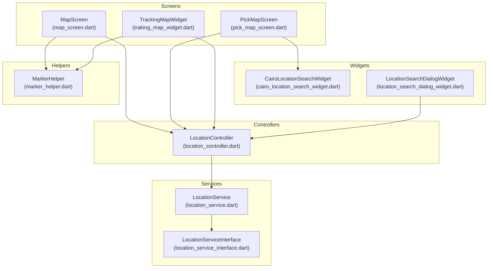
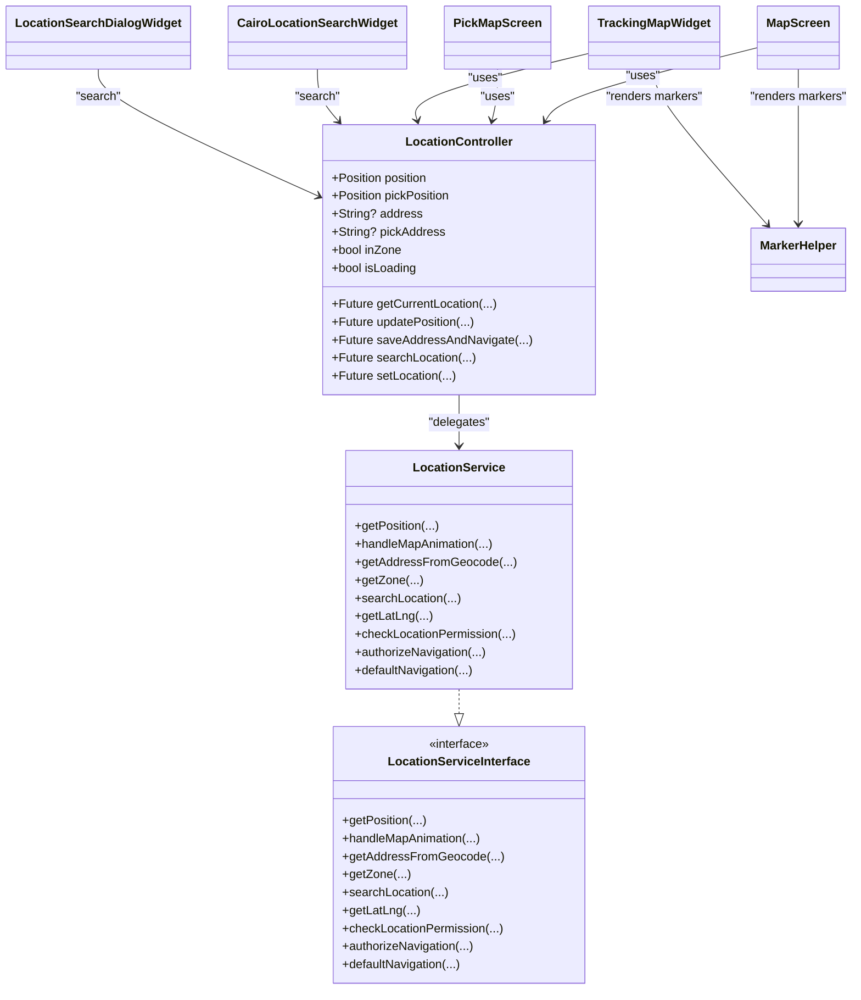
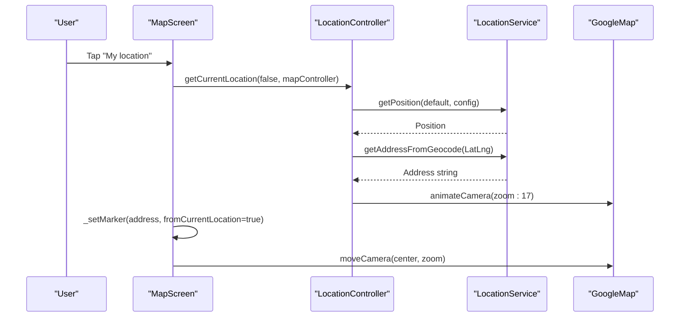
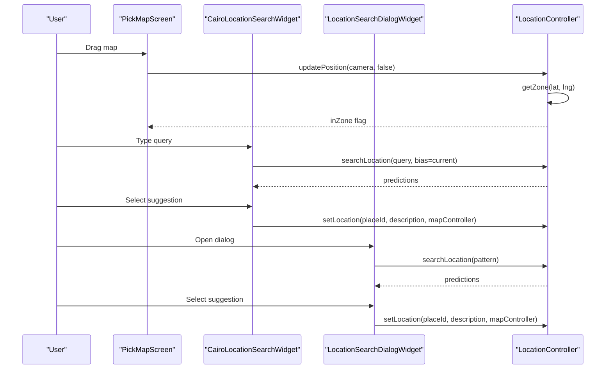
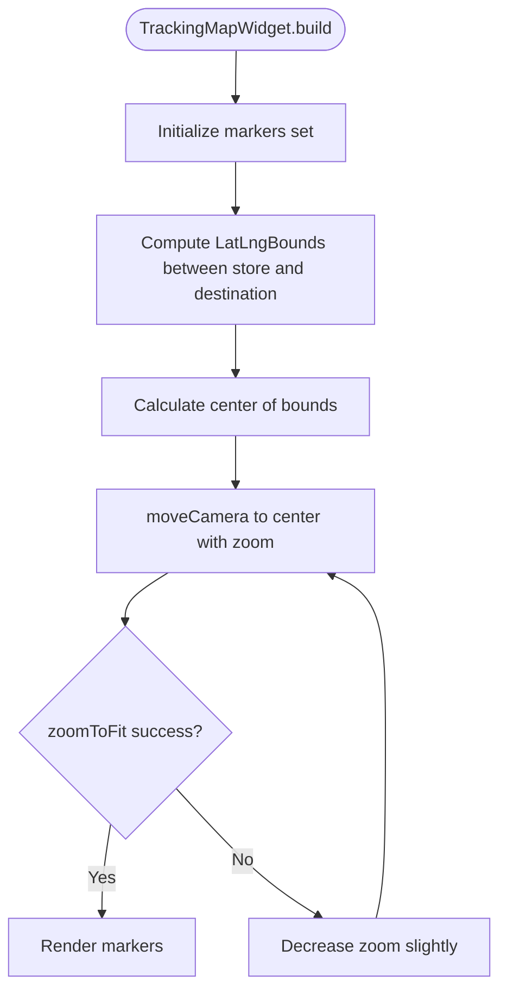
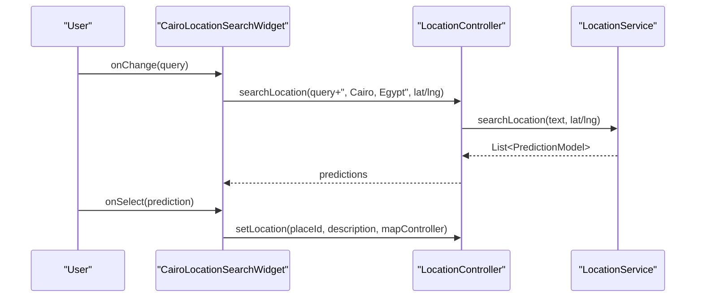
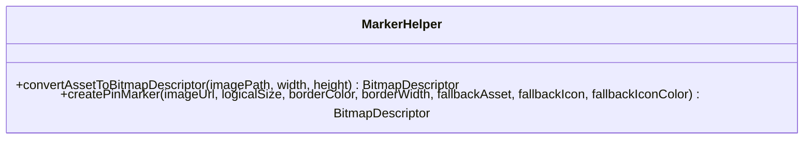
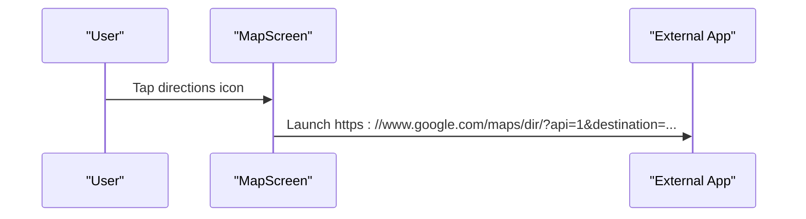
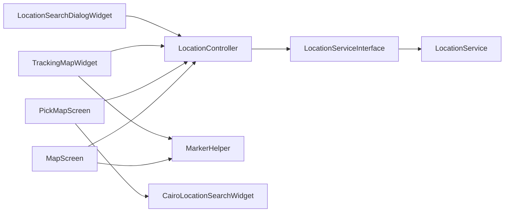

# Map Integration and Navigation

<cite>
**Referenced Files in This Document**
- [map_screen.dart](file://lib/features/location/screens/map_screen.dart)
- [pick_map_screen.dart](file://lib/features/location/screens/pick_map_screen.dart)
- [traking_map_widget.dart](file://lib/features/order/widgets/traking_map_widget.dart)
- [location_controller.dart](file://lib/features/location/controllers/location_controller.dart)
- [location_service.dart](file://lib/features/location/domain/services/location_service.dart)
- [location_service_interface.dart](file://lib/features/location/domain/services/location_service_interface.dart)
- [cairo_location_search_widget.dart](file://lib/features/location/widgets/cairo_location_search_widget.dart)
- [location_search_dialog_widget.dart](file://lib/features/location/widgets/location_search_dialog_widget.dart)
- [marker_helper.dart](file://lib/helper/marker_helper.dart)
</cite>

## Table of Contents
1. [Introduction](#introduction)
2. [Project Structure](#project-structure)
3. [Core Components](#core-components)
4. [Architecture Overview](#architecture-overview)
5. [Detailed Component Analysis](#detailed-component-analysis)
6. [Dependency Analysis](#dependency-analysis)
7. [Performance Considerations](#performance-considerations)
8. [Troubleshooting Guide](#troubleshooting-guide)
9. [Conclusion](#conclusion)
10. [Appendices](#appendices)

## Introduction
This document explains the map integration and navigation system used across the application. It covers:
- Map screen implementation and interactive controls
- Location picker with user location display and destination selection
- Route visualization for order tracking
- Integration with Google Maps SDK, custom map styling, and marker management
- Location search widget, autocomplete, and address prediction handling
- Configuration options for map styles, zoom levels, and navigation preferences
- Integration with location services, order tracking visualization, and delivery route optimization
- Performance optimization, offline handling, and battery efficiency considerations
- Accessibility and UI patterns for the location search dialog
- Troubleshooting guidance for rendering, accuracy, and provider integration issues

## Project Structure
The map and location features are organized around three primary areas:
- Screens: map display and selection experiences
- Controllers: state and orchestration for location and search
- Widgets: reusable UI components for search and map overlays
- Helpers: map marker creation and rendering utilities
- Services: location service abstraction and repository integration

**Diagram sources**
- [map_screen.dart:22-349](file://lib/features/location/screens/map_screen.dart#L22-L349)
- [pick_map_screen.dart:23-534](file://lib/features/location/screens/pick_map_screen.dart#L23-L534)
- [traking_map_widget.dart:21-226](file://lib/features/order/widgets/traking_map_widget.dart#L21-L226)
- [location_controller.dart:37-650](file://lib/features/location/controllers/location_controller.dart#L37-L650)
- [location_service_interface.dart:7-20](file://lib/features/location/domain/services/location_service_interface.dart#L7-L20)
- [location_service.dart:22-198](file://lib/features/location/domain/services/location_service.dart#L22-L198)
- [cairo_location_search_widget.dart:7-247](file://lib/features/location/widgets/cairo_location_search_widget.dart#L7-L247)
- [location_search_dialog_widget.dart:11-81](file://lib/features/location/widgets/location_search_dialog_widget.dart#L11-L81)
- [marker_helper.dart:9-203](file://lib/helper/marker_helper.dart#L9-L203)

**Section sources**
- [map_screen.dart:22-349](file://lib/features/location/screens/map_screen.dart#L22-L349)
- [pick_map_screen.dart:23-534](file://lib/features/location/screens/pick_map_screen.dart#L23-L534)
- [traking_map_widget.dart:21-226](file://lib/features/order/widgets/traking_map_widget.dart#L21-L226)
- [location_controller.dart:37-650](file://lib/features/location/controllers/location_controller.dart#L37-L650)
- [location_service_interface.dart:7-20](file://lib/features/location/domain/services/location_service_interface.dart#L7-L20)
- [location_service.dart:22-198](file://lib/features/location/domain/services/location_service.dart#L22-L198)
- [cairo_location_search_widget.dart:7-247](file://lib/features/location/widgets/cairo_location_search_widget.dart#L7-L247)
- [location_search_dialog_widget.dart:11-81](file://lib/features/location/widgets/location_search_dialog_widget.dart#L11-L81)
- [marker_helper.dart:9-203](file://lib/helper/marker_helper.dart#L9-L203)

## Core Components
- MapScreen: Displays a single destination with optional user location marker and directions.
- PickMapScreen: Interactive map for selecting a pickup/delivery location with search overlay and confirm action.
- TrackingMapWidget: Shows order-related markers (store, destination, delivery person) and auto-zooms to fit all points.
- LocationController: Central orchestrator for geolocation, zone checks, address resolution, and navigation routing.
- LocationService/LocationServiceInterface: Abstraction for geolocation, reverse geocoding, place predictions, and messaging configuration.
- CairoLocationSearchWidget: Inline search with Cairo/Egypt bias and live suggestions.
- LocationSearchDialogWidget: Modal search dialog using typeahead for predictions.
- MarkerHelper: Converts assets/network images to BitmapDescriptor markers with caching and fallbacks.

**Section sources**
- [map_screen.dart:22-349](file://lib/features/location/screens/map_screen.dart#L22-L349)
- [pick_map_screen.dart:23-534](file://lib/features/location/screens/pick_map_screen.dart#L23-L534)
- [traking_map_widget.dart:21-226](file://lib/features/order/widgets/traking_map_widget.dart#L21-L226)
- [location_controller.dart:37-650](file://lib/features/location/controllers/location_controller.dart#L37-L650)
- [location_service.dart:22-198](file://lib/features/location/domain/services/location_service.dart#L22-L198)
- [location_service_interface.dart:7-20](file://lib/features/location/domain/services/location_service_interface.dart#L7-L20)
- [cairo_location_search_widget.dart:7-247](file://lib/features/location/widgets/cairo_location_search_widget.dart#L7-L247)
- [location_search_dialog_widget.dart:11-81](file://lib/features/location/widgets/location_search_dialog_widget.dart#L11-L81)
- [marker_helper.dart:9-203](file://lib/helper/marker_helper.dart#L9-L203)

## Architecture Overview
The system follows a layered architecture:
- UI Layer: Screens and widgets render the map and search experiences.
- Controller Layer: LocationController manages state, coordinates with services, and triggers navigation.
- Service Layer: LocationService implements platform-agnostic location and search logic.
- Helper Layer: MarkerHelper handles marker rendering and caching.

**Diagram sources**
- [location_controller.dart:37-650](file://lib/features/location/controllers/location_controller.dart#L37-L650)
- [location_service_interface.dart:7-20](file://lib/features/location/domain/services/location_service_interface.dart#L7-L20)
- [location_service.dart:22-198](file://lib/features/location/domain/services/location_service.dart#L22-L198)
- [map_screen.dart:22-349](file://lib/features/location/screens/map_screen.dart#L22-L349)
- [pick_map_screen.dart:23-534](file://lib/features/location/screens/pick_map_screen.dart#L23-L534)
- [traking_map_widget.dart:21-226](file://lib/features/order/widgets/traking_map_widget.dart#L21-L226)
- [cairo_location_search_widget.dart:7-247](file://lib/features/location/widgets/cairo_location_search_widget.dart#L7-L247)
- [location_search_dialog_widget.dart:11-81](file://lib/features/location/widgets/location_search_dialog_widget.dart#L11-L81)
- [marker_helper.dart:9-203](file://lib/helper/marker_helper.dart#L9-L203)

## Detailed Component Analysis

### Map Screen Implementation
- Purpose: Display a destination with optional user location marker and quick directions.
- Controls:
  - My location button to fetch and animate to current position.
  - Destination info panel with address and contact details.
  - Zoom-in button to focus on destination.
- Map configuration:
  - Initial camera centered on destination.
  - Min/max zoom preference and disabled zoom controls.
  - Dark/light map style based on theme.
- Markers:
  - Destination marker and optional user/current location marker.
  - Auto-fit camera to show both points with padding-aware zoom-to-fit.

**Diagram sources**
- [map_screen.dart:94-104](file://lib/features/location/screens/map_screen.dart#L94-L104)
- [location_controller.dart:129-155](file://lib/features/location/controllers/location_controller.dart#L129-L155)
- [location_service.dart:38-60](file://lib/features/location/domain/services/location_service.dart#L38-L60)

**Section sources**
- [map_screen.dart:70-189](file://lib/features/location/screens/map_screen.dart#L70-L189)
- [location_controller.dart:129-155](file://lib/features/location/controllers/location_controller.dart#L129-L155)
- [location_service.dart:38-60](file://lib/features/location/domain/services/location_service.dart#L38-L60)

### Interactive Map Controls and Location Picker
- Purpose: Allow users to pick a location by dragging the map or tapping a central pin.
- Features:
  - Center pin with “Deliver here” label.
  - Search overlay (inline or modal) for address lookup.
  - Confirm button with zone availability check.
  - On desktop, a compact modal dialog is shown for location selection.
- Camera events:
  - onCameraMoveStarted disables confirm button.
  - onCameraIdle updates position and performs zone check.

**Diagram sources**
- [pick_map_screen.dart:102-111](file://lib/features/location/screens/pick_map_screen.dart#L102-L111)
- [cairo_location_search_widget.dart:35-83](file://lib/features/location/widgets/cairo_location_search_widget.dart#L35-L83)
- [location_search_dialog_widget.dart:52-76](file://lib/features/location/widgets/location_search_dialog_widget.dart#L52-L76)
- [location_controller.dart:212-242](file://lib/features/location/controllers/location_controller.dart#L212-L242)
- [location_controller.dart:488-493](file://lib/features/location/controllers/location_controller.dart#L488-L493)
- [location_controller.dart:459-486](file://lib/features/location/controllers/location_controller.dart#L459-L486)

**Section sources**
- [pick_map_screen.dart:84-206](file://lib/features/location/screens/pick_map_screen.dart#L84-L206)
- [pick_map_screen.dart:274-336](file://lib/features/location/screens/pick_map_screen.dart#L274-L336)
- [cairo_location_search_widget.dart:35-83](file://lib/features/location/widgets/cairo_location_search_widget.dart#L35-L83)
- [location_search_dialog_widget.dart:52-76](file://lib/features/location/widgets/location_search_dialog_widget.dart#L52-L76)
- [location_controller.dart:212-242](file://lib/features/location/controllers/location_controller.dart#L212-L242)
- [location_controller.dart:459-486](file://lib/features/location/controllers/location_controller.dart#L459-L486)

### Order Tracking Visualization
- Purpose: Visualize store, destination, and delivery person positions with auto-zoom.
- Behavior:
  - Builds markers for store, destination, and delivery person.
  - Computes bounds and centers the camera between two points.
  - Applies zoom-to-fit with padding and platform-specific adjustments.
  - Adds info windows for markers.

**Diagram sources**
- [traking_map_widget.dart:118-143](file://lib/features/order/widgets/traking_map_widget.dart#L118-L143)
- [traking_map_widget.dart:184-207](file://lib/features/order/widgets/traking_map_widget.dart#L184-L207)

**Section sources**
- [traking_map_widget.dart:105-181](file://lib/features/order/widgets/traking_map_widget.dart#L105-L181)
- [traking_map_widget.dart:184-207](file://lib/features/order/widgets/traking_map_widget.dart#L184-L207)

### Location Search Widget and Autocomplete
- CairoLocationSearchWidget:
  - Binds to current position for location bias.
  - Appends “Cairo, Egypt” to queries to restrict suggestions.
  - Shows loading state and suggestion list with icons and truncation.
- LocationSearchDialogWidget:
  - Modal TypeAheadField with suggestions and selection callback.
  - Supports parcel-specific selection flow.

**Diagram sources**
- [cairo_location_search_widget.dart:35-83](file://lib/features/location/widgets/cairo_location_search_widget.dart#L35-L83)
- [location_controller.dart:488-493](file://lib/features/location/controllers/location_controller.dart#L488-L493)
- [location_service.dart:125-139](file://lib/features/location/domain/services/location_service.dart#L125-L139)

**Section sources**
- [cairo_location_search_widget.dart:35-83](file://lib/features/location/widgets/cairo_location_search_widget.dart#L35-L83)
- [location_search_dialog_widget.dart:52-76](file://lib/features/location/widgets/location_search_dialog_widget.dart#L52-L76)
- [location_controller.dart:488-493](file://lib/features/location/controllers/location_controller.dart#L488-L493)
- [location_service.dart:125-139](file://lib/features/location/domain/services/location_service.dart#L125-L139)

### Marker Management and Custom Styling
- MarkerHelper:
  - Converts assets to BitmapDescriptor with scaling and fallbacks.
  - Provides advanced pin marker with network image caching and fallback icons.
- Map styling:
  - Theme-driven map style applied via controller-managed dark/light JSON.
  - Map type and gesture recognizers configured per screen.

**Diagram sources**
- [marker_helper.dart:11-38](file://lib/helper/marker_helper.dart#L11-L38)
- [marker_helper.dart:49-170](file://lib/helper/marker_helper.dart#L49-L170)

**Section sources**
- [marker_helper.dart:11-38](file://lib/helper/marker_helper.dart#L11-L38)
- [marker_helper.dart:49-170](file://lib/helper/marker_helper.dart#L49-L170)
- [map_screen.dart:82-83](file://lib/features/location/screens/map_screen.dart#L82-L83)
- [traking_map_widget.dart:95-96](file://lib/features/order/widgets/traking_map_widget.dart#L95-L96)

### Route Visualization and Navigation Preferences
- Route links:
  - MapScreen generates a Google Maps directions URL for external launch.
- Navigation preferences:
  - LocationController coordinates navigation after zone validation and module selection.
  - Desktop vs mobile dialogs for location selection.

**Diagram sources**
- [map_screen.dart:127-135](file://lib/features/location/screens/map_screen.dart#L127-L135)

**Section sources**
- [map_screen.dart:127-135](file://lib/features/location/screens/map_screen.dart#L127-L135)
- [location_controller.dart:244-334](file://lib/features/location/controllers/location_controller.dart#L244-L334)

## Dependency Analysis
- Coupling:
  - Screens depend on LocationController for state and actions.
  - LocationController depends on LocationServiceInterface for platform-agnostic behavior.
  - LocationService implements the interface and delegates to repositories.
- Cohesion:
  - MarkerHelper encapsulates marker rendering concerns.
  - Search widgets delegate to LocationController for suggestions and selection.
- External dependencies:
  - Google Maps SDK for Flutter, Geolocator, TypeAhead, Connectivity.

**Diagram sources**
- [map_screen.dart:22-349](file://lib/features/location/screens/map_screen.dart#L22-L349)
- [pick_map_screen.dart:23-534](file://lib/features/location/screens/pick_map_screen.dart#L23-L534)
- [traking_map_widget.dart:21-226](file://lib/features/order/widgets/traking_map_widget.dart#L21-L226)
- [location_controller.dart:37-650](file://lib/features/location/controllers/location_controller.dart#L37-L650)
- [location_service_interface.dart:7-20](file://lib/features/location/domain/services/location_service_interface.dart#L7-L20)
- [location_service.dart:22-198](file://lib/features/location/domain/services/location_service.dart#L22-L198)
- [cairo_location_search_widget.dart:7-247](file://lib/features/location/widgets/cairo_location_search_widget.dart#L7-L247)
- [location_search_dialog_widget.dart:11-81](file://lib/features/location/widgets/location_search_dialog_widget.dart#L11-L81)
- [marker_helper.dart:9-203](file://lib/helper/marker_helper.dart#L9-L203)

**Section sources**
- [location_controller.dart:37-650](file://lib/features/location/controllers/location_controller.dart#L37-L650)
- [location_service.dart:22-198](file://lib/features/location/domain/services/location_service.dart#L22-L198)
- [location_service_interface.dart:7-20](file://lib/features/location/domain/services/location_service_interface.dart#L7-L20)

## Performance Considerations
- Map rendering:
  - Use zoom-to-fit only when necessary; avoid excessive camera moves.
  - Defer animations until map is created to prevent errors.
- Marker rendering:
  - Prefer cached network images for store/user avatars.
  - Use appropriate pixel density scaling to reduce blurry markers.
- Location services:
  - Request high-accuracy only when needed; fall back gracefully to default coordinates.
  - Debounce search queries and limit suggestion list size.
- Battery efficiency:
  - Avoid continuous location polling; use on-demand getCurrentLocation.
  - Disable unnecessary gestures on mobile when dialogs are open.
- Offline handling:
  - Gracefully handle connectivity checks and prompt users to enable location services.

[No sources needed since this section provides general guidance]

## Troubleshooting Guide
- Map rendering issues:
  - Ensure GoogleMap is created before animating camera.
  - Verify theme-based map style is loaded; handle fallbacks.
- Location accuracy problems:
  - Confirm location permissions are granted; request if denied.
  - Check if location services are enabled on device.
- Integration challenges:
  - Validate service implementation of LocationServiceInterface.
  - Ensure repository responses for predictions and geocoding are parsed correctly.
- Zone validation failures:
  - Confirm zone API responses and handle 404/service-not-available scenarios.
- Search widget not working:
  - Verify search callbacks are wired to LocationController.
  - Ensure suggestions are filtered and selected properly.

**Section sources**
- [location_controller.dart:499-501](file://lib/features/location/controllers/location_controller.dart#L499-L501)
- [location_controller.dart:567-588](file://lib/features/location/controllers/location_controller.dart#L567-L588)
- [location_service.dart:142-154](file://lib/features/location/domain/services/location_service.dart#L142-L154)
- [location_service.dart:135-138](file://lib/features/location/domain/services/location_service.dart#L135-L138)

## Conclusion
The map integration leverages a clean separation of concerns:
- Screens present map experiences and collect user intent.
- Controllers manage state, permissions, and navigation.
- Services abstract platform-specific behaviors.
- Helpers encapsulate rendering details.
This design enables customization of map styles, robust search experiences, and efficient order tracking visualization while maintaining performance and reliability.

[No sources needed since this section summarizes without analyzing specific files]

## Appendices

### Configuration Options
- Map styles:
  - Apply dark or light map style via theme controller.
- Zoom levels:
  - Configure initial zoom and min/max zoom per screen.
- Gesture controls:
  - Enable/disable zoom controls and scroll gestures as needed.
- Accessibility:
  - Provide clear focus states and sufficient contrast for search overlays.
  - Offer keyboard-friendly search and selection.

[No sources needed since this section provides general guidance]