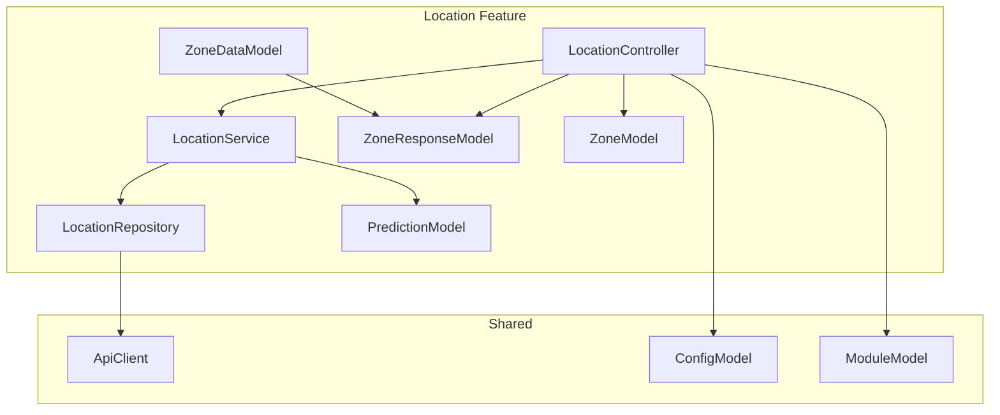
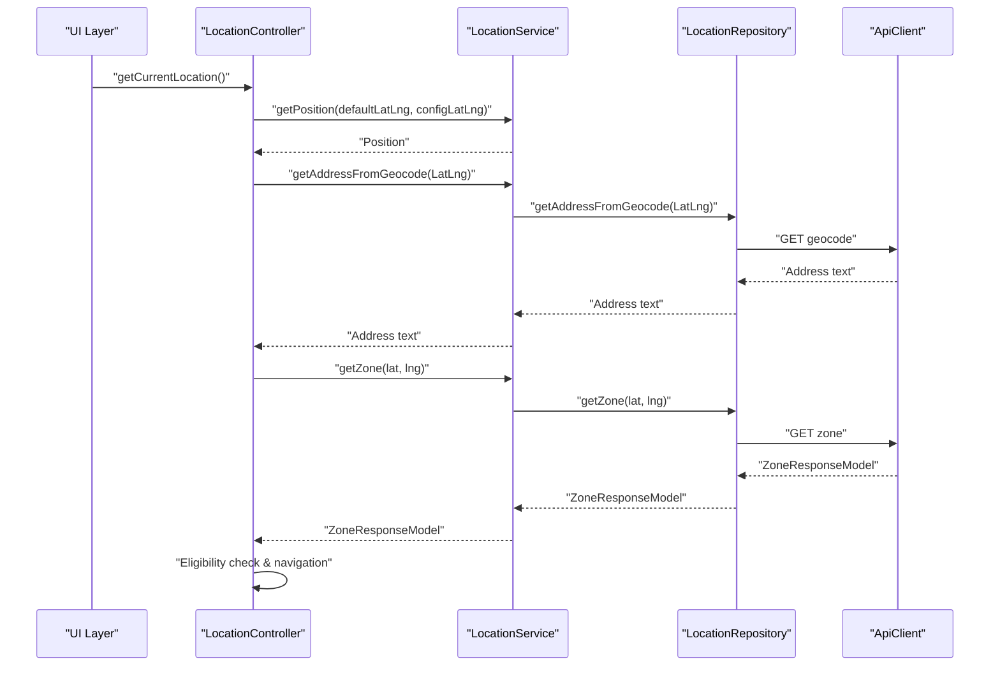
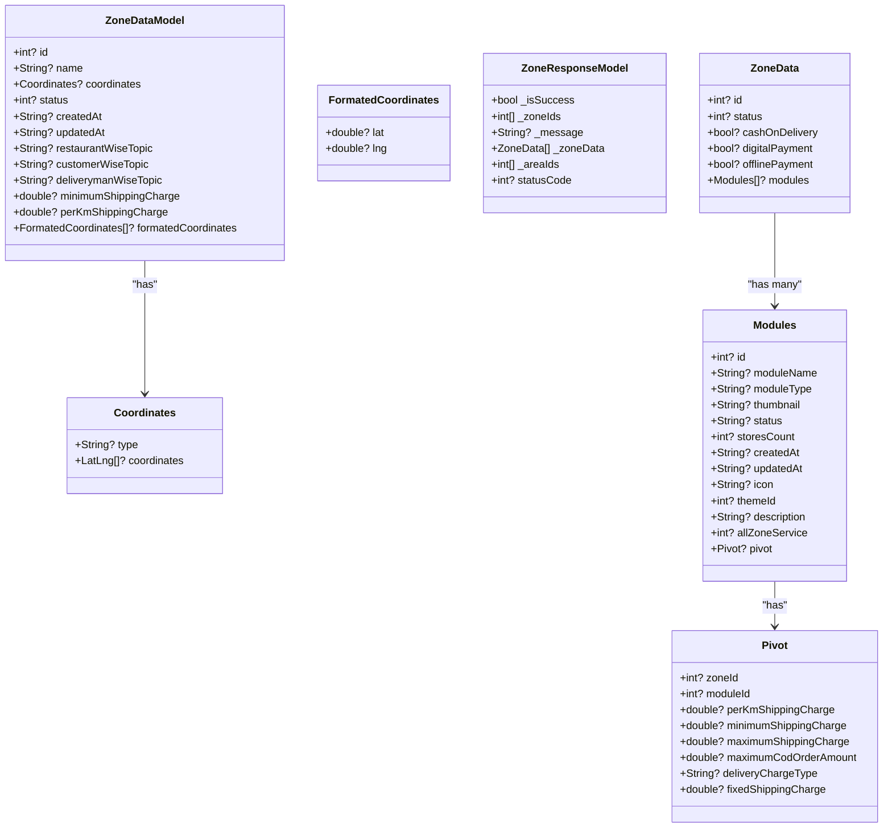
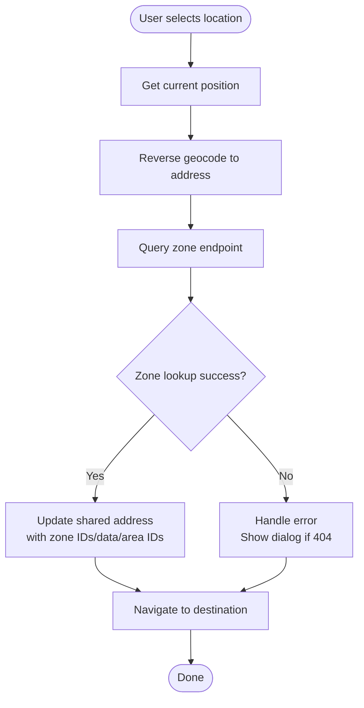
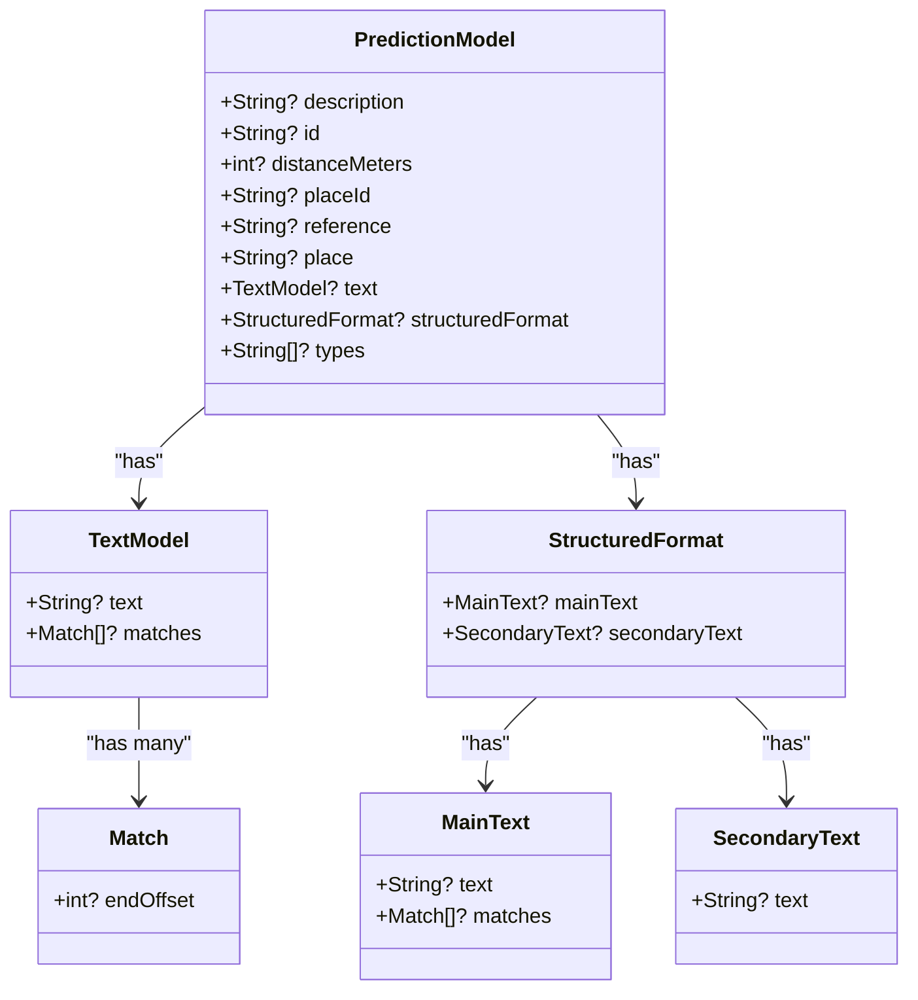
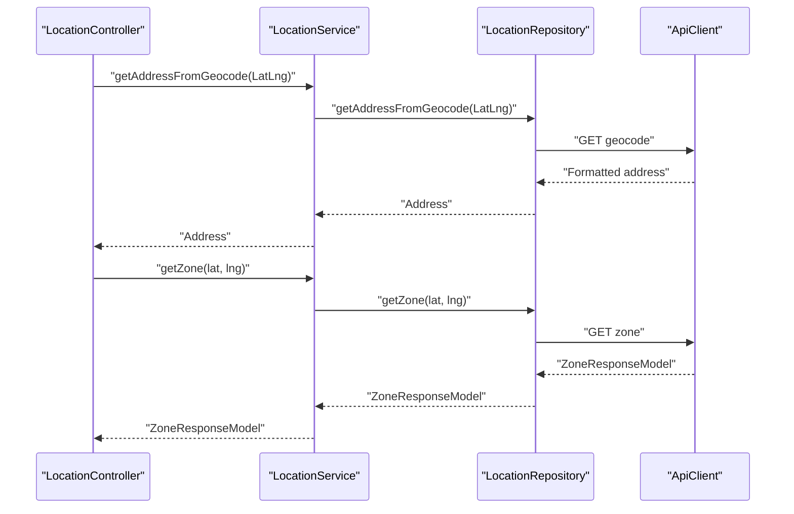
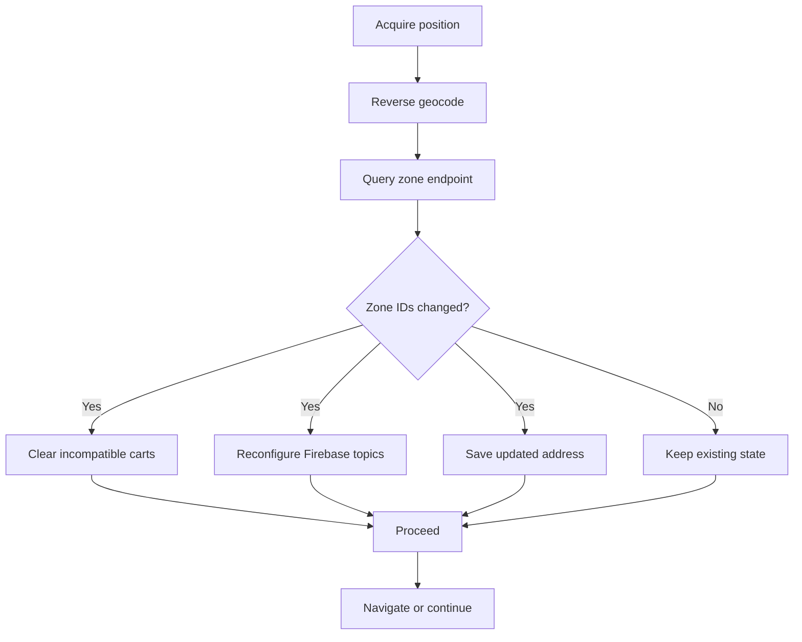
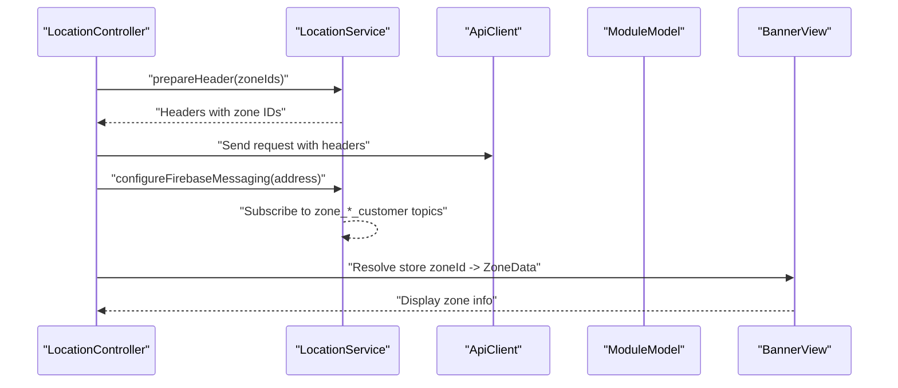
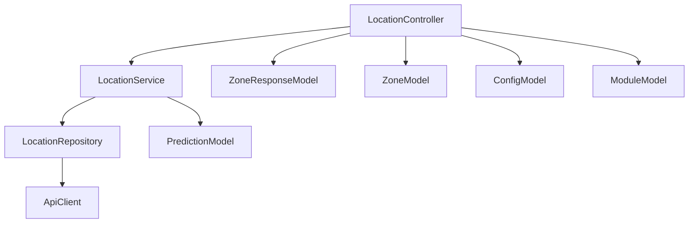

# Zone and Delivery Management

<cite>
**Referenced Files in This Document**
- [zone_data_model.dart](file://lib/features/location/domain/models/zone_data_model.dart)
- [zone_response_model.dart](file://lib/features/location/domain/models/zone_response_model.dart)
- [zone_model.dart](file://lib/features/location/domain/models/zone_model.dart)
- [prediction_model.dart](file://lib/features/location/domain/models/prediction_model.dart)
- [location_controller.dart](file://lib/features/location/controllers/location_controller.dart)
- [location_service.dart](file://lib/features/location/domain/services/location_service.dart)
- [location_repository.dart](file://lib/features/location/domain/repositories/location_repository.dart)
- [api_client.dart](file://lib/api/api_client.dart)
- [config_model.dart](file://lib/common/models/config_model.dart)
- [module_model.dart](file://lib/common/models/module_model.dart)
- [banner_view.dart](file://lib/features/home/widgets/banner_view.dart)
</cite>

## Table of Contents
1. [Introduction](#introduction)
2. [Project Structure](#project-structure)
3. [Core Components](#core-components)
4. [Architecture Overview](#architecture-overview)
5. [Detailed Component Analysis](#detailed-component-analysis)
6. [Dependency Analysis](#dependency-analysis)
7. [Performance Considerations](#performance-considerations)
8. [Troubleshooting Guide](#troubleshooting-guide)
9. [Conclusion](#conclusion)
10. [Appendices](#appendices)

## Introduction
This document explains the zone-based delivery management system implemented in the application. It covers the zone model architecture, validation and eligibility checks, delivery area boundaries, service availability determination, and the prediction model for location-based suggestions. It also documents zone data models, response handling, delivery zone calculation via geolocation, integration with order placement and real-time updates, configuration options for pricing and service areas, and guidance for multi-zone scenarios and dynamic adjustments.

## Project Structure
The zone and delivery management functionality is primarily located under the location feature domain and integrates with shared models and APIs:
- Domain models define zone data structures and predictions
- Controllers orchestrate location and zone workflows
- Services encapsulate platform-specific logic and Firebase messaging
- Repositories communicate with backend APIs
- Shared models and configuration influence pricing and service capabilities

**Diagram sources**
- [location_controller.dart:37-650](file://lib/features/location/controllers/location_controller.dart#L37-L650)
- [location_service.dart:22-198](file://lib/features/location/domain/services/location_service.dart#L22-L198)
- [location_repository.dart:10-77](file://lib/features/location/domain/repositories/location_repository.dart#L10-L77)
- [zone_data_model.dart:3-116](file://lib/features/location/domain/models/zone_data_model.dart#L3-L116)
- [zone_response_model.dart:1-176](file://lib/features/location/domain/models/zone_response_model.dart#L1-L176)
- [zone_model.dart:4-32](file://lib/features/location/domain/models/zone_model.dart#L4-L32)
- [prediction_model.dart:1-153](file://lib/features/location/domain/models/prediction_model.dart#L1-L153)
- [api_client.dart:39-53](file://lib/api/api_client.dart#L39-L53)
- [config_model.dart:190-389](file://lib/common/models/config_model.dart#L190-L389)
- [module_model.dart:12-41](file://lib/common/models/module_model.dart#L12-L41)

**Section sources**
- [location_controller.dart:37-650](file://lib/features/location/controllers/location_controller.dart#L37-L650)
- [location_service.dart:22-198](file://lib/features/location/domain/services/location_service.dart#L22-L198)
- [location_repository.dart:10-77](file://lib/features/location/domain/repositories/location_repository.dart#L10-L77)
- [zone_data_model.dart:3-116](file://lib/features/location/domain/models/zone_data_model.dart#L3-L116)
- [zone_response_model.dart:1-176](file://lib/features/location/domain/models/zone_response_model.dart#L1-L176)
- [zone_model.dart:4-32](file://lib/features/location/domain/models/zone_model.dart#L4-L32)
- [prediction_model.dart:1-153](file://lib/features/location/domain/models/prediction_model.dart#L1-L153)
- [api_client.dart:39-53](file://lib/api/api_client.dart#L39-L53)
- [config_model.dart:190-389](file://lib/common/models/config_model.dart#L190-L389)
- [module_model.dart:12-41](file://lib/common/models/module_model.dart#L12-L41)

## Core Components
- ZoneDataModel: Encapsulates zone geometry, metadata, and shipping cost attributes
- ZoneResponseModel and ZoneData: Defines the response payload for zone queries and per-zone module/service flags
- ZoneModel: Aggregates zone identifiers and zone data for transport across layers
- PredictionModel: Provides structured location suggestions for search
- LocationController: Orchestrates geolocation, zone lookup, eligibility checks, and navigation
- LocationService: Implements platform logic, Firebase messaging topics, and routing
- LocationRepository: Performs HTTP requests to geocoding, zone, and place detail endpoints
- ApiClient: Centralizes HTTP calls and headers including zone IDs
- ConfigModel and ModuleModel: Provide configuration and module-level zone data used for pricing and service availability

Key responsibilities:
- Zone validation and eligibility: Determined by the zone lookup response and stored zone IDs
- Delivery area boundaries: Modeled by polygon coordinates in ZoneDataModel
- Service availability: Derived from per-zone flags and module associations
- Pricing calculations: Influenced by per-zone and per-module shipping parameters
- Real-time updates: Synchronized via shared preferences and Firebase topic subscriptions

**Section sources**
- [zone_data_model.dart:3-116](file://lib/features/location/domain/models/zone_data_model.dart#L3-L116)
- [zone_response_model.dart:1-176](file://lib/features/location/domain/models/zone_response_model.dart#L1-L176)
- [zone_model.dart:4-32](file://lib/features/location/domain/models/zone_model.dart#L4-L32)
- [prediction_model.dart:1-153](file://lib/features/location/domain/models/prediction_model.dart#L1-L153)
- [location_controller.dart:129-286](file://lib/features/location/controllers/location_controller.dart#L129-L286)
- [location_service.dart:33-122](file://lib/features/location/domain/services/location_service.dart#L33-L122)
- [location_repository.dart:28-39](file://lib/features/location/domain/repositories/location_repository.dart#L28-L39)
- [api_client.dart:39-53](file://lib/api/api_client.dart#L39-L53)
- [config_model.dart:190-389](file://lib/common/models/config_model.dart#L190-L389)
- [module_model.dart:12-41](file://lib/common/models/module_model.dart#L12-L41)

## Architecture Overview
The system follows a layered architecture:
- Presentation: Widgets and screens trigger location and zone operations
- Controller: Coordinates user actions, performs zone lookups, and manages navigation
- Service: Handles platform-specific tasks (geolocation, permissions, Firebase)
- Repository: Encapsulates network calls to external endpoints
- Models: Define data structures for zone, response, predictions, and configuration

**Diagram sources**
- [location_controller.dart:129-155](file://lib/features/location/controllers/location_controller.dart#L129-L155)
- [location_service.dart:27-51](file://lib/features/location/domain/services/location_service.dart#L27-L51)
- [location_repository.dart:16-25](file://lib/features/location/domain/repositories/location_repository.dart#L16-L25)
- [location_repository.dart:28-39](file://lib/features/location/domain/repositories/location_repository.dart#L28-L39)
- [api_client.dart:39-53](file://lib/api/api_client.dart#L39-L53)

## Detailed Component Analysis

### Zone Data Model and Geographic Boundaries
ZoneDataModel captures:
- Zone identity and status
- Center coordinates and formatted polygon coordinates
- Messaging topics per role (restaurant/customer/deliveryman)
- Shipping cost attributes: minimum charge and per-kilometer rate

ZoneResponseModel and ZoneData represent the server response:
- ZoneResponseModel carries success flag, zone IDs, area IDs, and zone data
- ZoneData includes per-zone flags for payment modes and module associations
- Pivot holds per-zone, per-module pricing and COD limits

**Diagram sources**
- [zone_data_model.dart:3-116](file://lib/features/location/domain/models/zone_data_model.dart#L3-L116)
- [zone_response_model.dart:1-176](file://lib/features/location/domain/models/zone_response_model.dart#L1-L176)

**Section sources**
- [zone_data_model.dart:3-116](file://lib/features/location/domain/models/zone_data_model.dart#L3-L116)
- [zone_response_model.dart:1-176](file://lib/features/location/domain/models/zone_response_model.dart#L1-L176)

### Zone Response Handling and Eligibility Checks
LocationController coordinates zone validation and eligibility:
- On location acquisition, it queries the zone endpoint and sets eligibility flags
- If eligible, it updates shared address with zone IDs, zone data, and area IDs
- If not eligible (e.g., 404), it displays a “service not available” dialog and offers alternatives

**Diagram sources**
- [location_controller.dart:129-186](file://lib/features/location/controllers/location_controller.dart#L129-L186)
- [location_controller.dart:255-279](file://lib/features/location/controllers/location_controller.dart#L255-L279)

**Section sources**
- [location_controller.dart:129-186](file://lib/features/location/controllers/location_controller.dart#L129-L186)
- [location_controller.dart:255-279](file://lib/features/location/controllers/location_controller.dart#L255-L279)

### Prediction Model for Location-Based Suggestions
PredictionModel structures location suggestions returned by the search endpoint:
- Includes place ID, description, structured text, and types
- Used to populate suggestion lists and later resolve place details

**Diagram sources**
- [prediction_model.dart:1-153](file://lib/features/location/domain/models/prediction_model.dart#L1-L153)

**Section sources**
- [prediction_model.dart:1-153](file://lib/features/location/domain/models/prediction_model.dart#L1-L153)

### Delivery Zone Calculation and Radius-Based Service Determination
Zone calculation relies on reverse geocoding and zone endpoint responses:
- Reverse geocoding converts coordinates to human-readable address
- Zone endpoint returns applicable zone IDs and per-zone data
- Eligibility is determined by whether zone IDs are present in the response

**Diagram sources**
- [location_service.dart:27-51](file://lib/features/location/domain/services/location_service.dart#L27-L51)
- [location_repository.dart:16-25](file://lib/features/location/domain/repositories/location_repository.dart#L16-L25)
- [location_repository.dart:28-39](file://lib/features/location/domain/repositories/location_repository.dart#L28-L39)

**Section sources**
- [location_service.dart:27-51](file://lib/features/location/domain/services/location_service.dart#L27-L51)
- [location_repository.dart:16-25](file://lib/features/location/domain/repositories/location_repository.dart#L16-L25)
- [location_repository.dart:28-39](file://lib/features/location/domain/repositories/location_repository.dart#L28-L39)

### Geographic Boundary Mapping
ZoneDataModel supports polygon-based boundaries via formatted coordinates:
- Coordinates type and nested LatLng list define polygon rings
- FormatedCoordinates provide simplified lat/lng pairs for rendering or client-side checks

Practical usage:
- Render zone polygons on maps
- Perform point-in-polygon checks for eligibility
- Validate store locations against zone boundaries

**Section sources**
- [zone_data_model.dart:72-116](file://lib/features/location/domain/models/zone_data_model.dart#L72-L116)

### Zone Validation Workflows and Zone Change Detection
Validation workflow:
- Acquire position and reverse geocode
- Query zone endpoint
- Update shared address and eligibility flags
- Subscribe to zone-specific Firebase topics

Zone change detection:
- Compare previous and current zone IDs
- Clear incompatible carts (e.g., taxi pickup zones)
- Reconfigure messaging topics

**Diagram sources**
- [location_controller.dart:188-210](file://lib/features/location/controllers/location_controller.dart#L188-L210)
- [location_controller.dart:336-349](file://lib/features/location/controllers/location_controller.dart#L336-L349)
- [location_service.dart:72-98](file://lib/features/location/domain/services/location_service.dart#L72-L98)

**Section sources**
- [location_controller.dart:188-210](file://lib/features/location/controllers/location_controller.dart#L188-L210)
- [location_controller.dart:336-349](file://lib/features/location/controllers/location_controller.dart#L336-L349)
- [location_service.dart:72-98](file://lib/features/location/domain/services/location_service.dart#L72-L98)

### Integration with Order Placement, Delivery Personnel Assignment, and Real-Time Updates
- Zone-aware headers: ApiClient encodes zone IDs into request headers for backend filtering
- Messaging: LocationService subscribes/unsubscribes customer topics per zone IDs
- Navigation: LocationController orchestrates route transitions after zone validation
- Store-to-customer alignment: Banner view resolves store zone ID to zone data for UI display

**Diagram sources**
- [api_client.dart:39-53](file://lib/api/api_client.dart#L39-L53)
- [location_service.dart:63-98](file://lib/features/location/domain/services/location_service.dart#L63-L98)
- [module_model.dart:12-41](file://lib/common/models/module_model.dart#L12-L41)
- [banner_view.dart:109-114](file://lib/features/home/widgets/banner_view.dart#L109-L114)

**Section sources**
- [api_client.dart:39-53](file://lib/api/api_client.dart#L39-L53)
- [location_service.dart:63-98](file://lib/features/location/domain/services/location_service.dart#L63-L98)
- [module_model.dart:12-41](file://lib/common/models/module_model.dart#L12-L41)
- [banner_view.dart:109-114](file://lib/features/home/widgets/banner_view.dart#L109-L114)

### Configuration Options for Delivery Zones, Pricing Calculations, and Service Area Limits
Configuration influences:
- Cash-on-delivery availability and limits
- Free delivery thresholds
- Payment mode flags per zone
- Per-zone and per-module shipping parameters (minimum, maximum, fixed, per km)

These are surfaced via ConfigModel and Pivot fields in ZoneResponseModel/ZoneData.

**Section sources**
- [config_model.dart:190-389](file://lib/common/models/config_model.dart#L190-L389)
- [zone_response_model.dart:131-176](file://lib/features/location/domain/models/zone_response_model.dart#L131-L176)

### Multi-Zone Scenarios and Dynamic Zone Adjustments
- Multi-zone support: ZoneResponseModel returns multiple zone IDs and associated data
- Dynamic adjustments: Sync zone data on app resume or location change; update shared preferences accordingly
- Intersection checks: Ensure compatibility between selected zone(s) and provider zone(s) for specialized modules (e.g., taxi)

**Section sources**
- [location_controller.dart:188-210](file://lib/features/location/controllers/location_controller.dart#L188-L210)
- [location_controller.dart:336-349](file://lib/features/location/controllers/location_controller.dart#L336-L349)
- [zone_model.dart:10-21](file://lib/features/location/domain/models/zone_model.dart#L10-L21)

### Business Module Variants (Food, Grocery, Pharmacy, Parcel)
- Module associations: ZoneData includes modules list; each module has per-zone service flags and pricing
- Module-level zone data: ModuleModel exposes zones for module selection and filtering
- Navigation flow: Desktop flow prompts module selection when missing

**Section sources**
- [zone_response_model.dart:63-129](file://lib/features/location/domain/models/zone_response_model.dart#L63-L129)
- [module_model.dart:12-41](file://lib/common/models/module_model.dart#L12-L41)
- [location_controller.dart:281-295](file://lib/features/location/controllers/location_controller.dart#L281-L295)

## Dependency Analysis
The following diagram highlights key dependencies among components:

**Diagram sources**
- [location_controller.dart:37-650](file://lib/features/location/controllers/location_controller.dart#L37-L650)
- [location_service.dart:22-198](file://lib/features/location/domain/services/location_service.dart#L22-L198)
- [location_repository.dart:10-77](file://lib/features/location/domain/repositories/location_repository.dart#L10-L77)
- [api_client.dart:39-53](file://lib/api/api_client.dart#L39-L53)
- [zone_response_model.dart:1-176](file://lib/features/location/domain/models/zone_response_model.dart#L1-L176)
- [zone_model.dart:4-32](file://lib/features/location/domain/models/zone_model.dart#L4-L32)
- [prediction_model.dart:1-153](file://lib/features/location/domain/models/prediction_model.dart#L1-L153)
- [config_model.dart:190-389](file://lib/common/models/config_model.dart#L190-L389)
- [module_model.dart:12-41](file://lib/common/models/module_model.dart#L12-L41)

**Section sources**
- [location_controller.dart:37-650](file://lib/features/location/controllers/location_controller.dart#L37-L650)
- [location_service.dart:22-198](file://lib/features/location/domain/services/location_service.dart#L22-L198)
- [location_repository.dart:10-77](file://lib/features/location/domain/repositories/location_repository.dart#L10-L77)
- [api_client.dart:39-53](file://lib/api/api_client.dart#L39-L53)
- [zone_response_model.dart:1-176](file://lib/features/location/domain/models/zone_response_model.dart#L1-L176)
- [zone_model.dart:4-32](file://lib/features/location/domain/models/zone_model.dart#L4-L32)
- [prediction_model.dart:1-153](file://lib/features/location/domain/models/prediction_model.dart#L1-L153)
- [config_model.dart:190-389](file://lib/common/models/config_model.dart#L190-L389)
- [module_model.dart:12-41](file://lib/common/models/module_model.dart#L12-L41)

## Performance Considerations
- Minimize redundant zone queries: Cache zone IDs and zone data in shared preferences and reuse until location changes significantly
- Debounce map interactions: Avoid frequent zone lookups during camera movement; batch updates
- Efficient polygon checks: For client-side eligibility, use spatial indexing or bounding box pre-checks before precise polygon tests
- Network optimization: Use zone-aware headers to reduce backend filtering overhead
- Memory footprint: Avoid retaining large coordinate lists unnecessarily; clear prediction lists when not in use

## Troubleshooting Guide
Common issues and resolutions:
- Service not available in area: Triggered when zone lookup returns empty or 404; present a dialog offering alternative actions
- Incompatible cart items: If selected zone does not intersect with provider zones, clear the cart and notify the user
- Missing or stale zone data: Sync zone data on app resume or significant location change
- Firebase messaging: Ensure zone-specific customer topics are subscribed/unsubscribed on zone changes

Operational references:
- Service not available dialog and handling
- Cart intersection checks and clearing
- Zone synchronization and shared preference updates
- Messaging topic subscription logic

**Section sources**
- [location_controller.dart:351-457](file://lib/features/location/controllers/location_controller.dart#L351-L457)
- [location_controller.dart:336-349](file://lib/features/location/controllers/location_controller.dart#L336-L349)
- [location_controller.dart:188-210](file://lib/features/location/controllers/location_controller.dart#L188-L210)
- [location_service.dart:72-98](file://lib/features/location/domain/services/location_service.dart#L72-L98)

## Conclusion
The zone-based delivery management system integrates geolocation, reverse geocoding, and zone endpoint responses to validate delivery eligibility and configure service availability. It supports multi-zone scenarios, dynamic adjustments, and per-module pricing through shared configuration and zone data models. The controller-service-repository pattern ensures clean separation of concerns, while headers and Firebase topics enable real-time updates and accurate order routing.

## Appendices
- Example references for code paths:
  - Zone response parsing and eligibility: [location_repository.dart:28-39](file://lib/features/location/domain/repositories/location_repository.dart#L28-L39)
  - Zone header encoding: [api_client.dart:39-53](file://lib/api/api_client.dart#L39-L53)
  - Messaging topic management: [location_service.dart:72-98](file://lib/features/location/domain/services/location_service.dart#L72-L98)
  - Store zone resolution in UI: [banner_view.dart:109-114](file://lib/features/home/widgets/banner_view.dart#L109-L114)