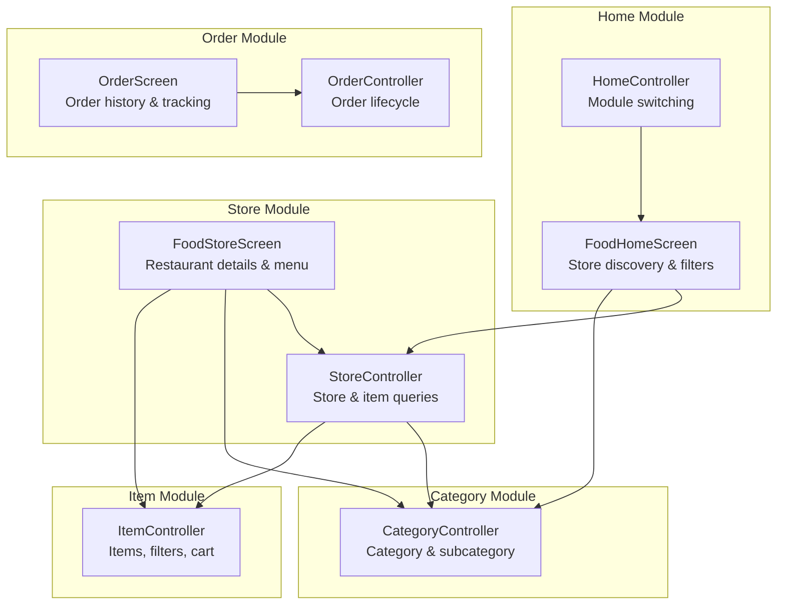
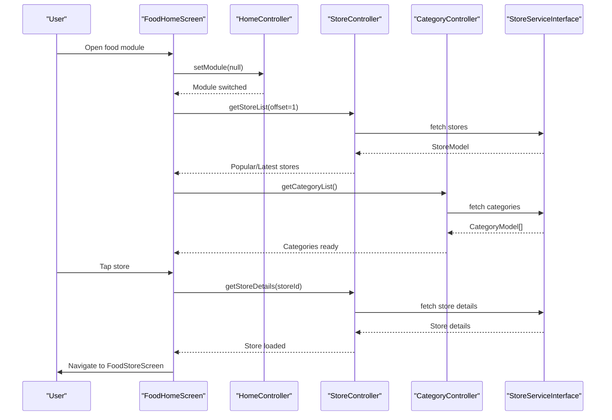
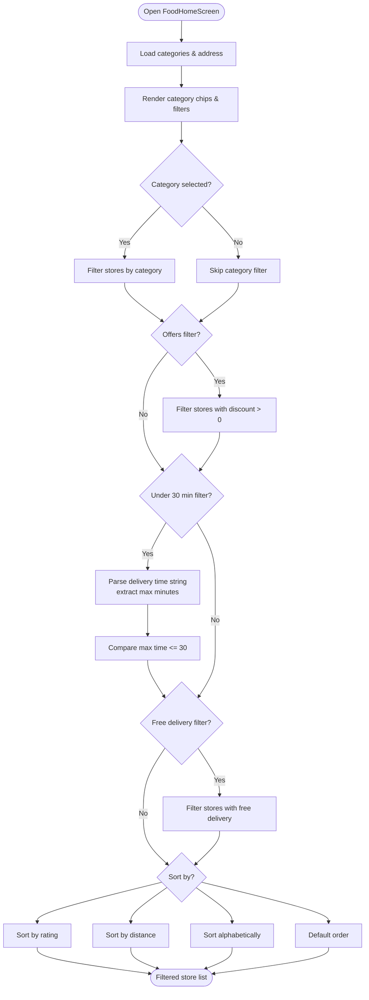
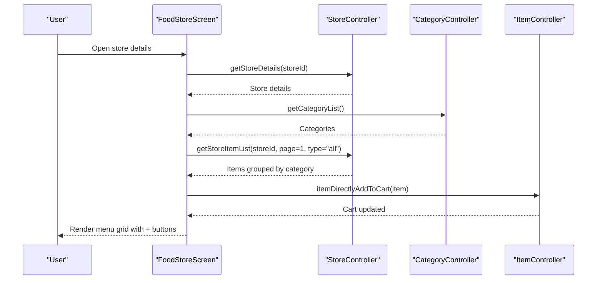
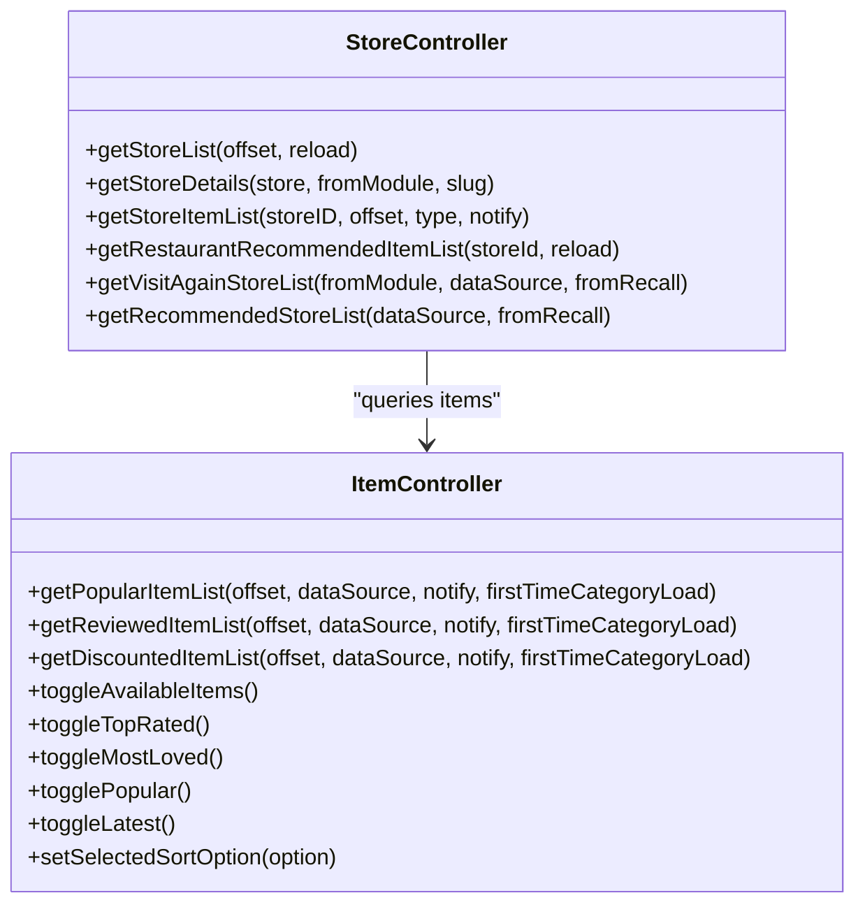
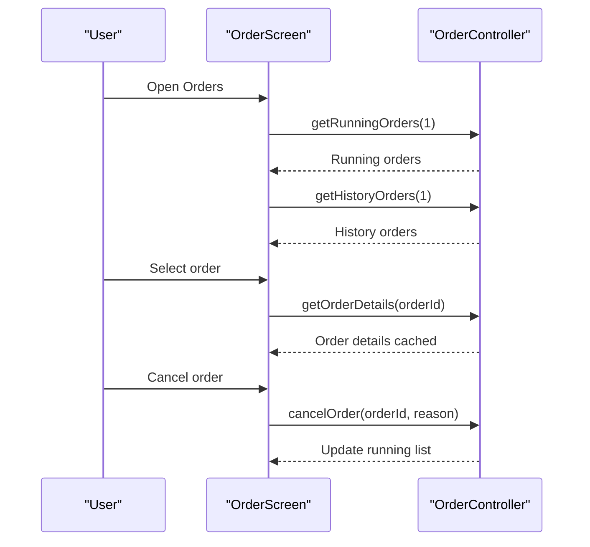
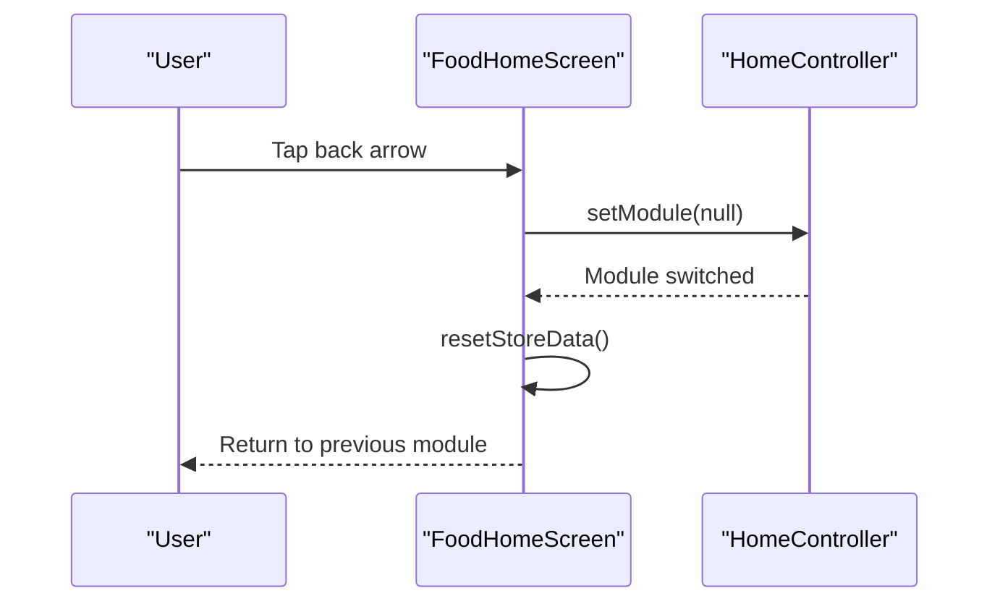
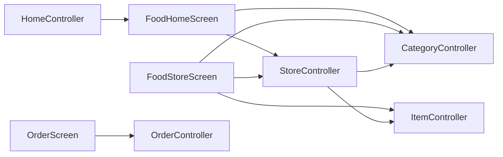

# Food Delivery Module

<cite>
**Referenced Files in This Document**
- [food_home_screen.dart](file://lib/features/home/screens/modules/food_home_screen.dart)
- [food_store_screen.dart](file://lib/features/store/screens/food_store_screen.dart)
- [menu_screen.dart](file://lib/features/menu/screens/menu_screen.dart)
- [order_screen.dart](file://lib/features/order/screens/order_screen.dart)
- [store_controller.dart](file://lib/features/store/controllers/store_controller.dart)
- [category_controller.dart](file://lib/features/category/controllers/category_controller.dart)
- [item_controller.dart](file://lib/features/item/controllers/item_controller.dart)
- [home_controller.dart](file://lib/features/home/controllers/home_controller.dart)
- [order_controller.dart](file://lib/features/order/controllers/order_controller.dart)
</cite>

## Table of Contents
1. [Introduction](#introduction)
2. [Project Structure](#project-structure)
3. [Core Components](#core-components)
4. [Architecture Overview](#architecture-overview)
5. [Detailed Component Analysis](#detailed-component-analysis)
6. [Dependency Analysis](#dependency-analysis)
7. [Performance Considerations](#performance-considerations)
8. [Troubleshooting Guide](#troubleshooting-guide)
9. [Conclusion](#conclusion)

## Introduction
This document describes the food delivery module that powers restaurant-based food ordering and delivery within the application. It focuses on the Store module’s role in managing restaurant listings, categories for food types, and item management for menu items. The document explains how stores, categories, and items integrate to deliver a comprehensive food ordering experience, covering restaurant discovery, menu browsing, and order placement workflows. It also documents food-specific features such as preparation times, dietary filters, and restaurant ratings, along with integration points to the home controller for module switching and shared functionality.

## Project Structure
The food delivery module is organized around feature-based controllers and screens:
- Home module provides the food-focused landing experience with store discovery, filtering, and sorting.
- Store module handles restaurant details, categories, and menu item lists.
- Category module manages food categories and subcategories.
- Item module manages menu items, filters, and shopping cart integration.
- Order module coordinates order placement, tracking, and history.
- Shared controllers (home, order) provide cross-cutting functionality like module switching and order management.

**Diagram sources**
- [food_home_screen.dart:1-2602](file://lib/features/home/screens/modules/food_home_screen.dart#L1-L2602)
- [food_store_screen.dart:1-944](file://lib/features/store/screens/food_store_screen.dart#L1-L944)
- [store_controller.dart:1-962](file://lib/features/store/controllers/store_controller.dart#L1-L962)
- [category_controller.dart:1-290](file://lib/features/category/controllers/category_controller.dart#L1-L290)
- [item_controller.dart:1-1299](file://lib/features/item/controllers/item_controller.dart#L1-L1299)
- [order_screen.dart:1-194](file://lib/features/order/screens/order_screen.dart#L1-L194)
- [order_controller.dart:1-298](file://lib/features/order/controllers/order_controller.dart#L1-L298)
- [home_controller.dart:1-187](file://lib/features/home/controllers/home_controller.dart#L1-L187)

**Section sources**
- [food_home_screen.dart:1-2602](file://lib/features/home/screens/modules/food_home_screen.dart#L1-L2602)
- [food_store_screen.dart:1-944](file://lib/features/store/screens/food_store_screen.dart#L1-L944)
- [store_controller.dart:1-962](file://lib/features/store/controllers/store_controller.dart#L1-L962)
- [category_controller.dart:1-290](file://lib/features/category/controllers/category_controller.dart#L1-L290)
- [item_controller.dart:1-1299](file://lib/features/item/controllers/item_controller.dart#L1-L1299)
- [order_screen.dart:1-194](file://lib/features/order/screens/order_screen.dart#L1-L194)
- [order_controller.dart:1-298](file://lib/features/order/controllers/order_controller.dart#L1-L298)
- [home_controller.dart:1-187](file://lib/features/home/controllers/home_controller.dart#L1-L187)

## Core Components
- FoodHomeScreen: Provides the restaurant discovery interface with category filtering, offers, quick delivery thresholds, free delivery, sorting, and store lists.
- FoodStoreScreen: Presents restaurant details, hero cover, delivery info, discount banners, category tabs, and a grid of menu items with add-to-cart actions.
- StoreController: Manages store lists, recommended items, item pagination, category filtering, and store details retrieval.
- CategoryController: Handles category/subcategory navigation and item/category queries.
- ItemController: Manages item lists, filters (availability, ratings, price range), sorting, and integration with the cart.
- OrderController: Coordinates order retrieval, cancellation, reordering, and tracking.
- HomeController: Supports module switching and shared UI behaviors.

Key food-specific features:
- Preparation time display and under-30-min quick-bite filtering.
- Free delivery and discount banners.
- Restaurant ratings and review integration.
- Dietary filters via item filters (e.g., available_now, most_loved, top_rated).

**Section sources**
- [food_home_screen.dart:183-254](file://lib/features/home/screens/modules/food_home_screen.dart#L183-L254)
- [food_store_screen.dart:478-512](file://lib/features/store/screens/food_store_screen.dart#L478-L512)
- [store_controller.dart:616-682](file://lib/features/store/controllers/store_controller.dart#L616-L682)
- [category_controller.dart:65-87](file://lib/features/category/controllers/category_controller.dart#L65-L87)
- [item_controller.dart:214-272](file://lib/features/item/controllers/item_controller.dart#L214-L272)
- [order_controller.dart:135-173](file://lib/features/order/controllers/order_controller.dart#L135-L173)
- [home_controller.dart:107-127](file://lib/features/home/controllers/home_controller.dart#L107-L127)

## Architecture Overview
The food delivery module follows a layered pattern:
- Presentation layer: Screens (FoodHomeScreen, FoodStoreScreen, OrderScreen) render UI and orchestrate user interactions.
- Business logic layer: Controllers (StoreController, CategoryController, ItemController, OrderController) encapsulate workflows and state.
- Data access layer: Services (referenced via interfaces) handle API calls and caching strategies.

**Diagram sources**
- [food_home_screen.dart:74-79](file://lib/features/home/screens/modules/food_home_screen.dart#L74-L79)
- [home_controller.dart:107-127](file://lib/features/home/controllers/home_controller.dart#L107-L127)
- [store_controller.dart:265-293](file://lib/features/store/controllers/store_controller.dart#L265-L293)
- [category_controller.dart:65-87](file://lib/features/category/controllers/category_controller.dart#L65-L87)

## Detailed Component Analysis

### Store Discovery and Filtering (FoodHomeScreen)
- Loads categories and addresses on startup.
- Implements category chips, offer filtering, under-30-min delivery, and free delivery filters.
- Sorts stores by default, rating, distance, or alphabetical order.
- Applies delivery-time parsing to support quick-bite filtering.

**Diagram sources**
- [food_home_screen.dart:183-254](file://lib/features/home/screens/modules/food_home_screen.dart#L183-L254)

**Section sources**
- [food_home_screen.dart:74-79](file://lib/features/home/screens/modules/food_home_screen.dart#L74-L79)
- [food_home_screen.dart:183-254](file://lib/features/home/screens/modules/food_home_screen.dart#L183-L254)

### Restaurant Details and Menu Browsing (FoodStoreScreen)
- Initializes store details, categories, recommended items, and reviews.
- Groups items by category and exposes a “Picks for you” tab.
- Supports infinite scroll pagination for items.
- Displays delivery info, discount banners, and live cart integration.

**Diagram sources**
- [food_store_screen.dart:59-117](file://lib/features/store/screens/food_store_screen.dart#L59-L117)
- [food_store_screen.dart:119-127](file://lib/features/store/screens/food_store_screen.dart#L119-L127)
- [food_store_screen.dart:197-204](file://lib/features/store/screens/food_store_screen.dart#L197-L204)

**Section sources**
- [food_store_screen.dart:59-117](file://lib/features/store/screens/food_store_screen.dart#L59-L117)
- [food_store_screen.dart:119-127](file://lib/features/store/screens/food_store_screen.dart#L119-L127)
- [food_store_screen.dart:197-204](file://lib/features/store/screens/food_store_screen.dart#L197-L204)

### Store and Item Management (StoreController, ItemController)
- StoreController:
  - Retrieves store lists with local/client caching fallback.
  - Personalizes “for you” recommendations combining visit-again, recommended, and popular stores.
  - Loads store details, initializes checkout timing, and computes distances.
  - Fetches recommended items and paginates item lists with category and filter support.
- ItemController:
  - Manages popular, reviewed, and discounted item lists with pagination.
  - Applies filters such as availability, ratings, price range, and sorting options.
  - Integrates with cart via direct add-to-cart actions.

**Diagram sources**
- [store_controller.dart:265-293](file://lib/features/store/controllers/store_controller.dart#L265-L293)
- [store_controller.dart:715-753](file://lib/features/store/controllers/store_controller.dart#L715-L753)
- [store_controller.dart:616-682](file://lib/features/store/controllers/store_controller.dart#L616-L682)
- [item_controller.dart:444-496](file://lib/features/item/controllers/item_controller.dart#L444-L496)
- [item_controller.dart:516-569](file://lib/features/item/controllers/item_controller.dart#L516-L569)
- [item_controller.dart:591-643](file://lib/features/item/controllers/item_controller.dart#L591-L643)

**Section sources**
- [store_controller.dart:265-293](file://lib/features/store/controllers/store_controller.dart#L265-L293)
- [store_controller.dart:715-753](file://lib/features/store/controllers/store_controller.dart#L715-L753)
- [store_controller.dart:616-682](file://lib/features/store/controllers/store_controller.dart#L616-L682)
- [item_controller.dart:444-496](file://lib/features/item/controllers/item_controller.dart#L444-L496)
- [item_controller.dart:516-569](file://lib/features/item/controllers/item_controller.dart#L516-L569)
- [item_controller.dart:591-643](file://lib/features/item/controllers/item_controller.dart#L591-L643)

### Order Placement and Tracking (OrderController, OrderScreen)
- OrderScreen provides a tabbed interface for running and order history.
- OrderController manages retrieving orders, cancellation, reordering, and tracking with caching for order details.

**Diagram sources**
- [order_screen.dart:41-51](file://lib/features/order/screens/order_screen.dart#L41-L51)
- [order_controller.dart:135-173](file://lib/features/order/controllers/order_controller.dart#L135-L173)
- [order_controller.dart:180-198](file://lib/features/order/controllers/order_controller.dart#L180-L198)
- [order_controller.dart:247-262](file://lib/features/order/controllers/order_controller.dart#L247-L262)

**Section sources**
- [order_screen.dart:41-51](file://lib/features/order/screens/order_screen.dart#L41-L51)
- [order_controller.dart:135-173](file://lib/features/order/controllers/order_controller.dart#L135-L173)
- [order_controller.dart:180-198](file://lib/features/order/controllers/order_controller.dart#L180-L198)
- [order_controller.dart:247-262](file://lib/features/order/controllers/order_controller.dart#L247-L262)

### Module Switching and Shared Functionality (HomeController)
- HomeController supports module switching (e.g., resetting module to null) and bottom navigation visibility during scrolling.
- FoodHomeScreen uses HomeController to switch modules and reset store data.

**Diagram sources**
- [food_home_screen.dart:312-314](file://lib/features/home/screens/modules/food_home_screen.dart#L312-L314)
- [home_controller.dart:107-127](file://lib/features/home/controllers/home_controller.dart#L107-L127)

**Section sources**
- [food_home_screen.dart:312-314](file://lib/features/home/screens/modules/food_home_screen.dart#L312-L314)
- [home_controller.dart:107-127](file://lib/features/home/controllers/home_controller.dart#L107-L127)

## Dependency Analysis
- FoodHomeScreen depends on StoreController for store lists and CategoryController for categories.
- FoodStoreScreen depends on StoreController for store details and item lists, CategoryController for categories, and ItemController for adding items to cart.
- StoreController orchestrates service calls and prepares models for presentation.
- ItemController applies filters and sorts items for display.
- OrderController coordinates order lifecycle and caches order details for performance.
- HomeController provides module switching and UI behavior.

**Diagram sources**
- [food_home_screen.dart:74-79](file://lib/features/home/screens/modules/food_home_screen.dart#L74-L79)
- [food_store_screen.dart:59-117](file://lib/features/store/screens/food_store_screen.dart#L59-L117)
- [store_controller.dart:265-293](file://lib/features/store/controllers/store_controller.dart#L265-L293)
- [category_controller.dart:65-87](file://lib/features/category/controllers/category_controller.dart#L65-L87)
- [item_controller.dart:444-496](file://lib/features/item/controllers/item_controller.dart#L444-L496)
- [order_screen.dart:41-51](file://lib/features/order/screens/order_screen.dart#L41-L51)
- [order_controller.dart:135-173](file://lib/features/order/controllers/order_controller.dart#L135-L173)
- [home_controller.dart:107-127](file://lib/features/home/controllers/home_controller.dart#L107-L127)

**Section sources**
- [food_home_screen.dart:74-79](file://lib/features/home/screens/modules/food_home_screen.dart#L74-L79)
- [food_store_screen.dart:59-117](file://lib/features/store/screens/food_store_screen.dart#L59-L117)
- [store_controller.dart:265-293](file://lib/features/store/controllers/store_controller.dart#L265-L293)
- [category_controller.dart:65-87](file://lib/features/category/controllers/category_controller.dart#L65-L87)
- [item_controller.dart:444-496](file://lib/features/item/controllers/item_controller.dart#L444-L496)
- [order_screen.dart:41-51](file://lib/features/order/screens/order_screen.dart#L41-L51)
- [order_controller.dart:135-173](file://lib/features/order/controllers/order_controller.dart#L135-L173)
- [home_controller.dart:107-127](file://lib/features/home/controllers/home_controller.dart#L107-L127)

## Performance Considerations
- Caching and hybrid loading: StoreController and CategoryController use local cache with client fallback to reduce latency and network usage.
- Pagination: StoreController and ItemController paginate item lists to avoid loading large datasets at once.
- Lazy initialization: FoodStoreScreen initializes data on demand and listens to scroll events for pagination.
- Computation offloading: Filtering and sorting in FoodHomeScreen occur in memory after fetching lists.

[No sources needed since this section provides general guidance]

## Troubleshooting Guide
- Store details not loading:
  - Verify store ID and slug handling in StoreController.getStoreDetails.
  - Ensure checkout initialization and distance calculation are invoked after store details load.
- Empty or stale categories:
  - Confirm CategoryController.getCategoryList is called and cache TTL logic is respected.
- Items not appearing in FoodStoreScreen:
  - Check StoreController.getStoreItemList pagination and category index logic.
  - Ensure categoryList is set before building tabs.
- Order details missing:
  - Use OrderController.getOrderDetails and rely on cached details to avoid repeated network calls.
- Module switching issues:
  - Confirm HomeController.setModule(null) is called and StoreController.resetStoreData() is executed.

**Section sources**
- [store_controller.dart:616-682](file://lib/features/store/controllers/store_controller.dart#L616-L682)
- [category_controller.dart:65-87](file://lib/features/category/controllers/category_controller.dart#L65-L87)
- [store_controller.dart:715-753](file://lib/features/store/controllers/store_controller.dart#L715-L753)
- [order_controller.dart:180-198](file://lib/features/order/controllers/order_controller.dart#L180-L198)
- [home_controller.dart:107-127](file://lib/features/home/controllers/home_controller.dart#L107-L127)

## Conclusion
The food delivery module integrates store discovery, category navigation, and menu browsing with robust filtering and sorting capabilities. StoreController, CategoryController, and ItemController coordinate to present a responsive and personalized experience, while OrderController and HomeController provide order lifecycle management and module switching. The design emphasizes caching, pagination, and lazy initialization to maintain performance and usability across the food ordering workflow.