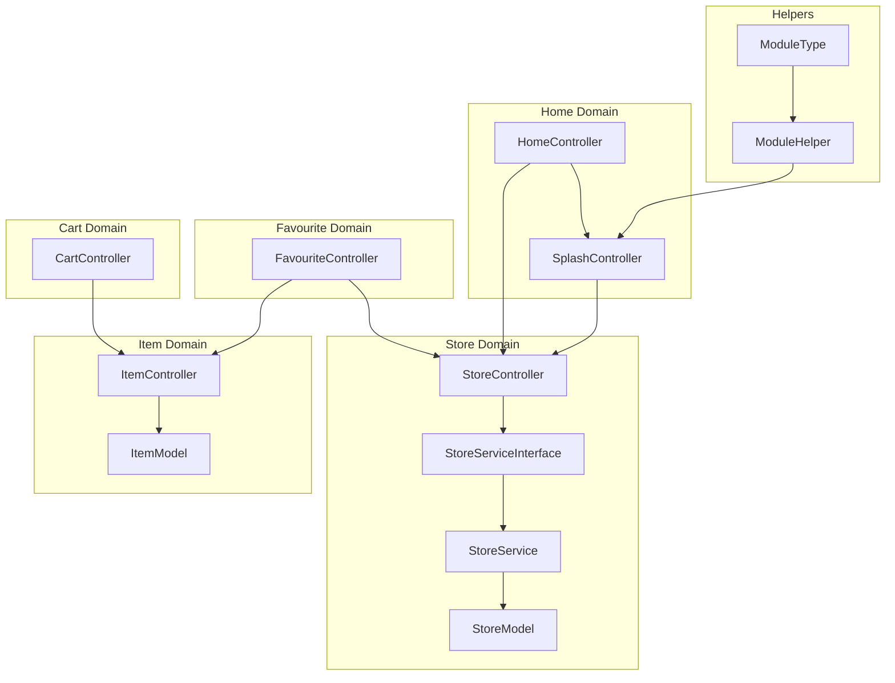
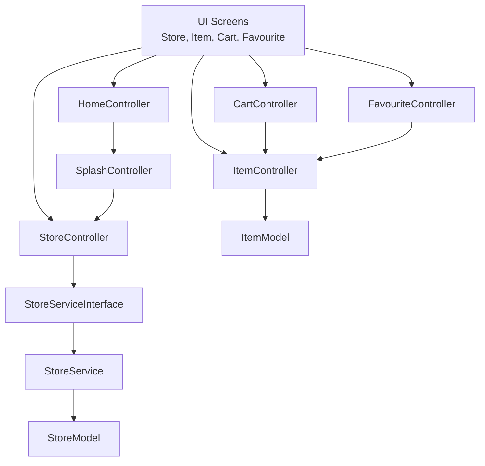
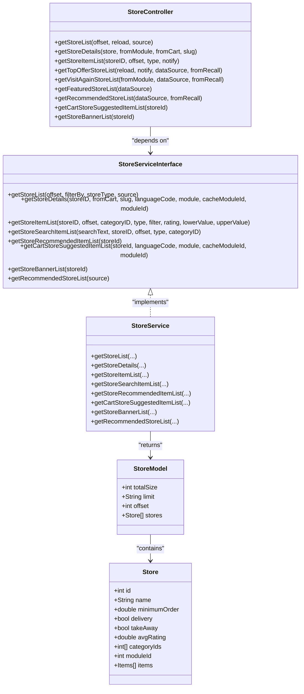
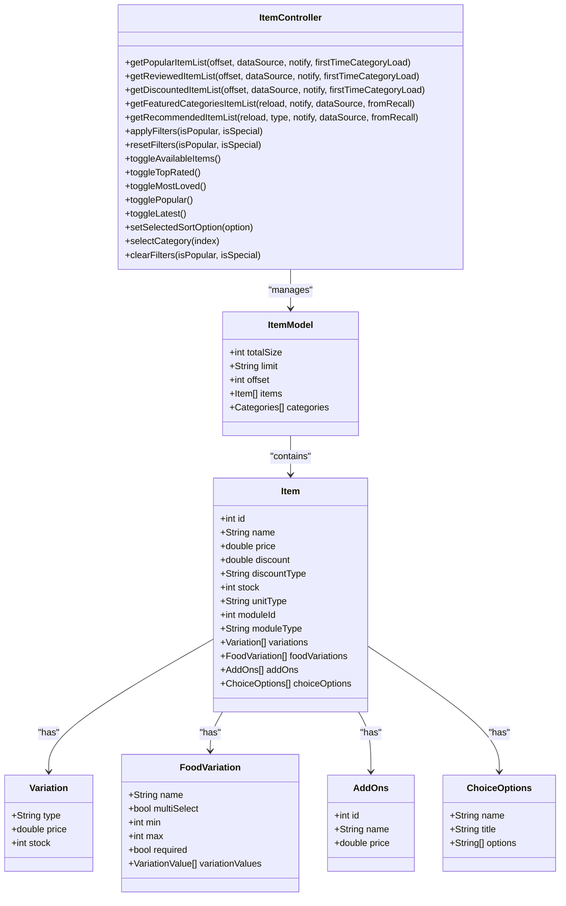
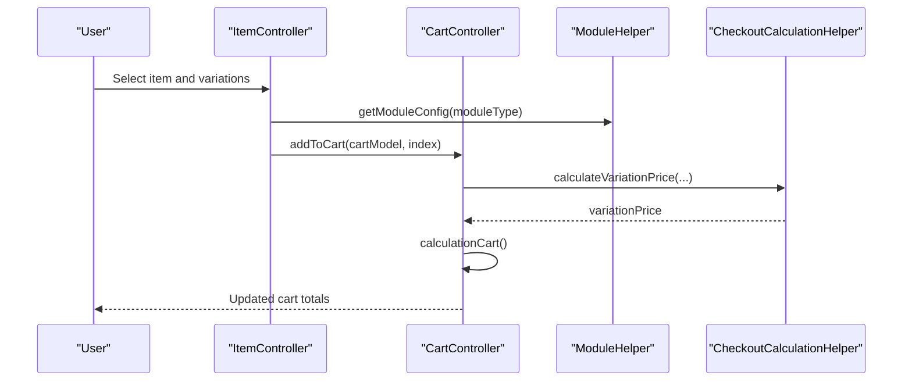
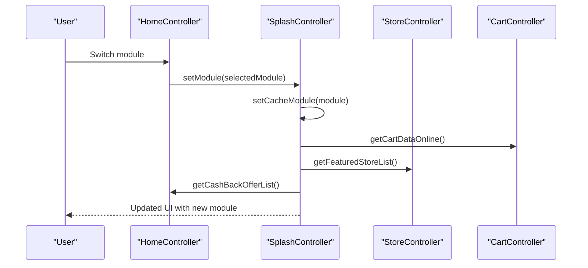
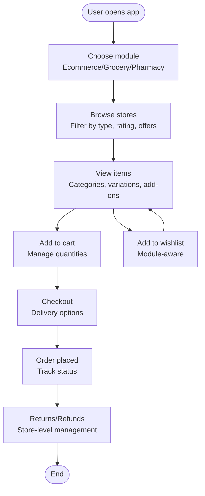
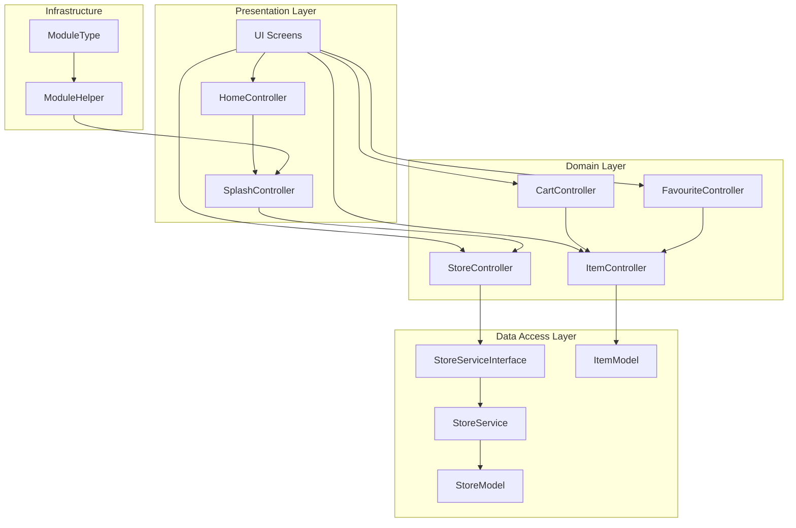

# General E-commerce Module

<cite>
**Referenced Files in This Document**
- [store_model.dart](file://lib/features/store/domain/models/store_model.dart)
- [item_model.dart](file://lib/features/item/domain/models/item_model.dart)
- [store_service_interface.dart](file://lib/features/store/domain/services/store_service_interface.dart)
- [store_service.dart](file://lib/features/store/domain/services/store_service.dart)
- [store_controller.dart](file://lib/features/store/controllers/store_controller.dart)
- [item_controller.dart](file://lib/features/item/controllers/item_controller.dart)
- [favourite_controller.dart](file://lib/features/favourite/controllers/favourite_controller.dart)
- [cart_controller.dart](file://lib/features/cart/controllers/cart_controller.dart)
- [home_controller.dart](file://lib/features/home/controllers/home_controller.dart)
- [splash_controller.dart](file://lib/features/splash/controllers/splash_controller.dart)
- [module_type.dart](file://lib/helper/module_type.dart)
- [module_helper.dart](file://lib/helper/module_helper.dart)
- [checkout_calculation_helper.dart](file://lib/features/checkout/helpers/checkout_calculation_helper.dart)
- [item_details_screen.dart](file://lib/features/item/screens/item_details_screen.dart)
</cite>

## Table of Contents
1. [Introduction](#introduction)
2. [Project Structure](#project-structure)
3. [Core Components](#core-components)
4. [Architecture Overview](#architecture-overview)
5. [Detailed Component Analysis](#detailed-component-analysis)
6. [Dependency Analysis](#dependency-analysis)
7. [Performance Considerations](#performance-considerations)
8. [Troubleshooting Guide](#troubleshooting-guide)
9. [Conclusion](#conclusion)

## Introduction
This document describes the general e-commerce module designed to support diverse product categories beyond traditional food, groceries, and pharmacy sectors. It focuses on the flexible Store module enabling various retail businesses, dynamic category management, and multi-purpose item handling. The module provides generic e-commerce workflows for product discovery, purchase, and delivery across different product types, integrates with the home controller for module switching, and coordinates with shared marketplace infrastructure. Implementation specifics include general retail business logic, product variations, cross-category promotions, user workflows for browsing catalogs, managing wishlists, and handling returns. Examples of e-commerce-specific data models, inventory management, and marketplace coordination patterns are documented.

## Project Structure
The e-commerce module is organized by feature domains with clear separation of concerns:
- Store domain: Store listings, details, banners, and recommended items
- Item domain: Product catalog, categories, variations, and add-ons
- Cart domain: Shopping cart management and checkout calculations
- Favourite domain: Wishlist management for items and stores
- Home domain: Module switching and promotional offers
- Splash domain: Module initialization and configuration
- Helper utilities: Module type and helper utilities for module configuration

**Diagram sources**
- [home_controller.dart:1-187](file://lib/features/home/controllers/home_controller.dart#L1-187)
- [splash_controller.dart:1-516](file://lib/features/splash/controllers/splash_controller.dart#L1-516)
- [store_controller.dart:1-800](file://lib/features/store/controllers/store_controller.dart#L1-800)
- [store_service_interface.dart:11-24](file://lib/features/store/domain/services/store_service_interface.dart#L11-24)
- [store_service.dart:51-71](file://lib/features/store/domain/services/store_service.dart#L51-71)
- [store_model.dart:1-646](file://lib/features/store/domain/models/store_model.dart#L1-646)
- [item_controller.dart:1-800](file://lib/features/item/controllers/item_controller.dart#L1-800)
- [item_model.dart:1-433](file://lib/features/item/domain/models/item_model.dart#L1-433)
- [cart_controller.dart:1-444](file://lib/features/cart/controllers/cart_controller.dart#L1-444)
- [favourite_controller.dart:1-162](file://lib/features/favourite/controllers/favourite_controller.dart#L1-162)
- [module_type.dart:1-16](file://lib/helper/module_type.dart#L1-16)
- [module_helper.dart:1-20](file://lib/helper/module_helper.dart#L1-20)

**Section sources**
- [store_model.dart:1-646](file://lib/features/store/domain/models/store_model.dart#L1-646)
- [item_model.dart:1-433](file://lib/features/item/domain/models/item_model.dart#L1-433)
- [store_service_interface.dart:11-24](file://lib/features/store/domain/services/store_service_interface.dart#L11-24)
- [store_service.dart:51-71](file://lib/features/store/domain/services/store_service.dart#L51-71)
- [store_controller.dart:1-800](file://lib/features/store/controllers/store_controller.dart#L1-800)
- [item_controller.dart:1-800](file://lib/features/item/controllers/item_controller.dart#L1-800)
- [favourite_controller.dart:1-162](file://lib/features/favourite/controllers/favourite_controller.dart#L1-162)
- [cart_controller.dart:1-444](file://lib/features/cart/controllers/cart_controller.dart#L1-444)
- [home_controller.dart:1-187](file://lib/features/home/controllers/home_controller.dart#L1-187)
- [splash_controller.dart:1-516](file://lib/features/splash/controllers/splash_controller.dart#L1-516)
- [module_type.dart:1-16](file://lib/helper/module_type.dart#L1-16)
- [module_helper.dart:1-20](file://lib/helper/module_helper.dart#L1-20)

## Core Components
This section documents the core components that enable the general e-commerce module:

- Store Model and Services
  - StoreModel encapsulates store metadata, scheduling, discounts, and items
  - StoreServiceInterface defines store-related operations (list, details, items, banners)
  - StoreController orchestrates store queries, filters, and personalization
  - Example paths:
    - [Store model definition:33-272](file://lib/features/store/domain/models/store_model.dart#L33-L272)
    - [Store service interface:11-24](file://lib/features/store/domain/services/store_service_interface.dart#L11-L24)
    - [Store service implementation:51-71](file://lib/features/store/domain/services/store_service.dart#L51-L71)
    - [Store controller orchestration:265-320](file://lib/features/store/controllers/store_controller.dart#L265-L320)

- Item Model and Variations
  - ItemModel handles product listings, categories, and multi-type variations
  - Supports both generic variations and food-specific variations
  - Example paths:
    - [Item model and variations:59-282](file://lib/features/item/domain/models/item_model.dart#L59-L282)
    - [Category handling:1-57](file://lib/features/item/domain/models/item_model.dart#L1-L57)

- Cart and Checkout
  - CartController manages cart lifecycle, quantities, and pricing calculations
  - Integrates with module configuration for variation and discount handling
  - Example paths:
    - [Cart controller operations:113-197](file://lib/features/cart/controllers/cart_controller.dart#L113-L197)
    - [Checkout calculation helper:69-80](file://lib/features/checkout/helpers/checkout_calculation_helper.dart#L69-L80)

- Wishlist Management
  - FavouriteController maintains item and store favorites with module-aware filtering
  - Example paths:
    - [Wishlist controller:107-154](file://lib/features/favourite/controllers/favourite_controller.dart#L107-L154)

- Module Switching and Configuration
  - SplashController initializes and switches modules, caches configurations
  - HomeController coordinates promotional offers and module-dependent UI
  - Example paths:
    - [Splash controller module switching:389-413](file://lib/features/splash/controllers/splash_controller.dart#L389-L413)
    - [Home controller promotional offers:140-164](file://lib/features/home/controllers/home_controller.dart#L140-L164)
    - [Module type enumeration:1-16](file://lib/helper/module_type.dart#L1-L16)
    - [Module helper utilities:1-20](file://lib/helper/module_helper.dart#L1-L20)

**Section sources**
- [store_model.dart:33-272](file://lib/features/store/domain/models/store_model.dart#L33-L272)
- [store_service_interface.dart:11-24](file://lib/features/store/domain/services/store_service_interface.dart#L11-L24)
- [store_service.dart:51-71](file://lib/features/store/domain/services/store_service.dart#L51-L71)
- [store_controller.dart:265-320](file://lib/features/store/controllers/store_controller.dart#L265-L320)
- [item_model.dart:59-282](file://lib/features/item/domain/models/item_model.dart#L59-L282)
- [cart_controller.dart:113-197](file://lib/features/cart/controllers/cart_controller.dart#L113-L197)
- [checkout_calculation_helper.dart:69-80](file://lib/features/checkout/helpers/checkout_calculation_helper.dart#L69-L80)
- [favourite_controller.dart:107-154](file://lib/features/favourite/controllers/favourite_controller.dart#L107-L154)
- [home_controller.dart:140-164](file://lib/features/home/controllers/home_controller.dart#L140-L164)
- [splash_controller.dart:389-413](file://lib/features/splash/controllers/splash_controller.dart#L389-L413)
- [module_type.dart:1-16](file://lib/helper/module_type.dart#L1-L16)
- [module_helper.dart:1-20](file://lib/helper/module_helper.dart#L1-L20)

## Architecture Overview
The e-commerce module follows a layered architecture with clear separation between presentation, domain, and data access layers. Controllers coordinate user interactions, services handle business logic, and models represent domain entities. Module switching is centralized via SplashController, influencing downstream components like CartController and FavouriteController.

**Diagram sources**
- [home_controller.dart:1-187](file://lib/features/home/controllers/home_controller.dart#L1-187)
- [splash_controller.dart:1-516](file://lib/features/splash/controllers/splash_controller.dart#L1-516)
- [store_controller.dart:1-800](file://lib/features/store/controllers/store_controller.dart#L1-800)
- [store_service_interface.dart:11-24](file://lib/features/store/domain/services/store_service_interface.dart#L11-24)
- [store_service.dart:51-71](file://lib/features/store/domain/services/store_service.dart#L51-71)
- [store_model.dart:1-646](file://lib/features/store/domain/models/store_model.dart#L1-646)
- [item_controller.dart:1-800](file://lib/features/item/controllers/item_controller.dart#L1-800)
- [item_model.dart:1-433](file://lib/features/item/domain/models/item_model.dart#L1-433)
- [cart_controller.dart:1-444](file://lib/features/cart/controllers/cart_controller.dart#L1-444)
- [favourite_controller.dart:1-162](file://lib/features/favourite/controllers/favourite_controller.dart#L1-162)

## Detailed Component Analysis

### Store Module
The Store module enables flexible retail business logic across diverse categories:
- Store listing and filtering by type, popularity, and offers
- Store details with scheduling, delivery options, and banners
- Personalized recommendations and visit-again suggestions
- Cross-category promotions and module-aware filtering

**Diagram sources**
- [store_controller.dart:265-320](file://lib/features/store/controllers/store_controller.dart#L265-L320)
- [store_service_interface.dart:11-24](file://lib/features/store/domain/services/store_service_interface.dart#L11-L24)
- [store_service.dart:51-71](file://lib/features/store/domain/services/store_service.dart#L51-L71)
- [store_model.dart:1-646](file://lib/features/store/domain/models/store_model.dart#L1-L646)

**Section sources**
- [store_controller.dart:265-320](file://lib/features/store/controllers/store_controller.dart#L265-L320)
- [store_service_interface.dart:11-24](file://lib/features/store/domain/services/store_service_interface.dart#L11-L24)
- [store_service.dart:51-71](file://lib/features/store/domain/services/store_service.dart#L51-L71)
- [store_model.dart:33-272](file://lib/features/store/domain/models/store_model.dart#L33-L272)

### Item Catalog and Variations
The Item module supports multi-purpose product handling with flexible variations:
- Generic variations for non-food items
- Food-specific variations with multi-select options
- Add-ons and choice options
- Category-based filtering and sorting
- Module-aware variation handling

**Diagram sources**
- [item_controller.dart:444-514](file://lib/features/item/controllers/item_controller.dart#L444-L514)
- [item_model.dart:59-282](file://lib/features/item/domain/models/item_model.dart#L59-L282)
- [item_model.dart:303-323](file://lib/features/item/domain/models/item_model.dart#L303-L323)
- [item_model.dart:373-411](file://lib/features/item/domain/models/item_model.dart#L373-L411)
- [item_model.dart:325-349](file://lib/features/item/domain/models/item_model.dart#L325-L349)
- [item_model.dart:351-371](file://lib/features/item/domain/models/item_model.dart#L351-L371)

**Section sources**
- [item_controller.dart:444-514](file://lib/features/item/controllers/item_controller.dart#L444-L514)
- [item_model.dart:59-282](file://lib/features/item/domain/models/item_model.dart#L59-L282)

### Cart and Checkout Workflow
The Cart module coordinates shopping cart operations with module-aware calculations:
- Quantity management with stock limits
- Pricing calculations including variations and add-ons
- Online cart synchronization
- Module conflict detection and resolution

**Diagram sources**
- [item_details_screen.dart:146-182](file://lib/features/item/screens/item_details_screen.dart#L146-L182)
- [cart_controller.dart:113-197](file://lib/features/cart/controllers/cart_controller.dart#L113-L197)
- [checkout_calculation_helper.dart:69-80](file://lib/features/checkout/helpers/checkout_calculation_helper.dart#L69-L80)
- [module_helper.dart:1-20](file://lib/helper/module_helper.dart#L1-L20)

**Section sources**
- [item_details_screen.dart:146-182](file://lib/features/item/screens/item_details_screen.dart#L146-L182)
- [cart_controller.dart:113-197](file://lib/features/cart/controllers/cart_controller.dart#L113-L197)
- [checkout_calculation_helper.dart:69-80](file://lib/features/checkout/helpers/checkout_calculation_helper.dart#L69-L80)
- [module_helper.dart:1-20](file://lib/helper/module_helper.dart#L1-L20)

### Module Switching and Marketplace Coordination
Module switching enables seamless transitions between different retail categories while maintaining consistent user experience:
- SplashController manages module initialization and caching
- HomeController coordinates promotional offers per module
- StoreController adapts store queries based on module configuration
- FavouriteController filters wishlist items by module

**Diagram sources**
- [home_controller.dart:140-164](file://lib/features/home/controllers/home_controller.dart#L140-L164)
- [splash_controller.dart:389-413](file://lib/features/splash/controllers/splash_controller.dart#L389-L413)
- [store_controller.dart:524-540](file://lib/features/store/controllers/store_controller.dart#L524-L540)
- [cart_controller.dart:384-402](file://lib/features/cart/controllers/cart_controller.dart#L384-L402)

**Section sources**
- [home_controller.dart:140-164](file://lib/features/home/controllers/home_controller.dart#L140-L164)
- [splash_controller.dart:389-413](file://lib/features/splash/controllers/splash_controller.dart#L389-L413)
- [store_controller.dart:524-540](file://lib/features/store/controllers/store_controller.dart#L524-L540)
- [cart_controller.dart:384-402](file://lib/features/cart/controllers/cart_controller.dart#L384-L402)

### User Workflows
The module supports comprehensive user workflows across the e-commerce journey:

- Product Discovery
  - Browse stores by category, popularity, and offers
  - Filter items by availability, ratings, and price range
  - Search within stores and across categories

- Purchase Process
  - Add items to cart with variations and add-ons
  - Manage quantities and module-aware pricing
  - Checkout with module-specific delivery options

- Wishlist Management
  - Save favorite items and stores
  - Module-aware filtering of wishlist content
  - Sync wishlist across devices

- Returns and Refunds
  - Store-level refund management with images and reasons
  - Module-specific return policies

[No sources needed since this diagram shows conceptual workflow, not actual code structure]

## Dependency Analysis
The e-commerce module exhibits strong cohesion within feature domains and controlled coupling between layers:

**Diagram sources**
- [home_controller.dart:1-187](file://lib/features/home/controllers/home_controller.dart#L1-187)
- [splash_controller.dart:1-516](file://lib/features/splash/controllers/splash_controller.dart#L1-516)
- [store_controller.dart:1-800](file://lib/features/store/controllers/store_controller.dart#L1-800)
- [store_service_interface.dart:11-24](file://lib/features/store/domain/services/store_service_interface.dart#L11-24)
- [store_service.dart:51-71](file://lib/features/store/domain/services/store_service.dart#L51-71)
- [store_model.dart:1-646](file://lib/features/store/domain/models/store_model.dart#L1-646)
- [item_controller.dart:1-800](file://lib/features/item/controllers/item_controller.dart#L1-800)
- [item_model.dart:1-433](file://lib/features/item/domain/models/item_model.dart#L1-433)
- [cart_controller.dart:1-444](file://lib/features/cart/controllers/cart_controller.dart#L1-444)
- [favourite_controller.dart:1-162](file://lib/features/favourite/controllers/favourite_controller.dart#L1-162)
- [module_helper.dart:1-20](file://lib/helper/module_helper.dart#L1-L20)
- [module_type.dart:1-16](file://lib/helper/module_type.dart#L1-16)

**Section sources**
- [home_controller.dart:1-187](file://lib/features/home/controllers/home_controller.dart#L1-187)
- [splash_controller.dart:1-516](file://lib/features/splash/controllers/splash_controller.dart#L1-516)
- [store_controller.dart:1-800](file://lib/features/store/controllers/store_controller.dart#L1-800)
- [store_service_interface.dart:11-24](file://lib/features/store/domain/services/store_service_interface.dart#L11-24)
- [store_service.dart:51-71](file://lib/features/store/domain/services/store_service.dart#L51-71)
- [store_model.dart:1-646](file://lib/features/store/domain/models/store_model.dart#L1-646)
- [item_controller.dart:1-800](file://lib/features/item/controllers/item_controller.dart#L1-800)
- [item_model.dart:1-433](file://lib/features/item/domain/models/item_model.dart#L1-433)
- [cart_controller.dart:1-444](file://lib/features/cart/controllers/cart_controller.dart#L1-444)
- [favourite_controller.dart:1-162](file://lib/features/favourite/controllers/favourite_controller.dart#L1-162)
- [module_helper.dart:1-20](file://lib/helper/module_helper.dart#L1-L20)
- [module_type.dart:1-16](file://lib/helper/module_type.dart#L1-16)

## Performance Considerations
- Caching Strategies
  - Store lists utilize TTL-based caching for popular and latest store queries
  - Category and item lists cache filtered results to reduce network requests
  - Module configuration caching prevents repeated initialization overhead

- Lazy Loading
  - Pagination implemented across store and item listings
  - Dynamic loading of banners and recommended items
  - Conditional loading of personalized content

- Memory Management
  - Controller state cleanup on module switches
  - Efficient list updates with incremental loading
  - Proper disposal of timers and listeners

- Network Optimization
  - Batch requests for cart synchronization
  - Conditional module loading based on user preferences
  - Optimized search queries with category filters

[No sources needed since this section provides general guidance]

## Troubleshooting Guide
Common issues and resolutions:

- Module Switching Problems
  - Verify module cache validity and re-initialization
  - Check module configuration compatibility
  - Ensure proper cart synchronization after switch

- Cart Synchronization Issues
  - Validate online cart retrieval and formatting
  - Check module conflict detection and resolution
  - Monitor stock limit enforcement

- Wishlist Filtering Problems
  - Confirm module-aware wishlist filtering logic
  - Verify store module ID matching
  - Check JSON parsing exceptions for malformed data

- Store Listing Performance
  - Implement proper pagination and caching
  - Optimize category filtering and search queries
  - Monitor TTL expiration for stale data

**Section sources**
- [splash_controller.dart:389-413](file://lib/features/splash/controllers/splash_controller.dart#L389-L413)
- [cart_controller.dart:384-402](file://lib/features/cart/controllers/cart_controller.dart#L384-L402)
- [favourite_controller.dart:107-154](file://lib/features/favourite/controllers/favourite_controller.dart#L107-L154)
- [store_controller.dart:265-320](file://lib/features/store/controllers/store_controller.dart#L265-L320)

## Conclusion
The general e-commerce module provides a robust foundation for diverse retail businesses beyond traditional categories. Its flexible Store module, dynamic category management, and multi-purpose item handling enable seamless cross-category commerce. The module's architecture supports module switching, marketplace coordination, and comprehensive user workflows. With proper caching, lazy loading, and performance optimizations, the module scales effectively across different product types and business models.