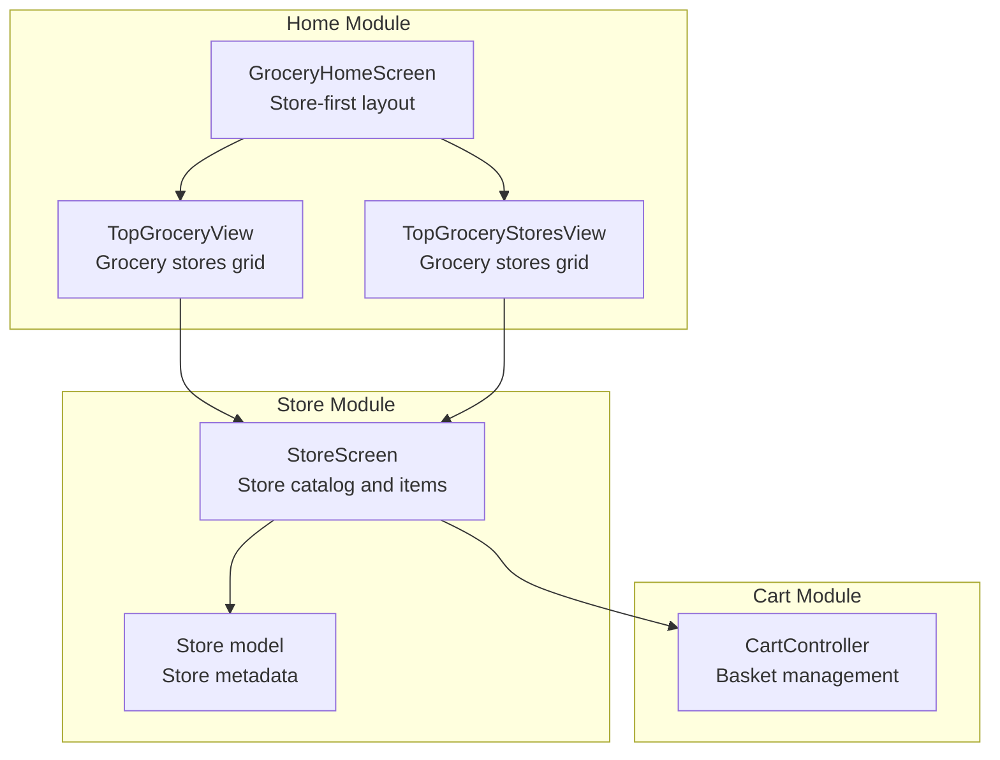
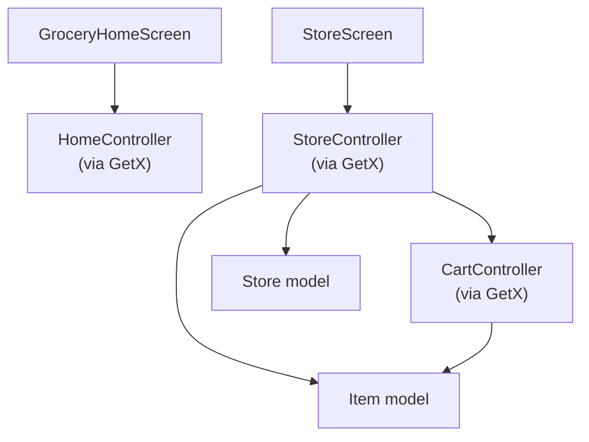
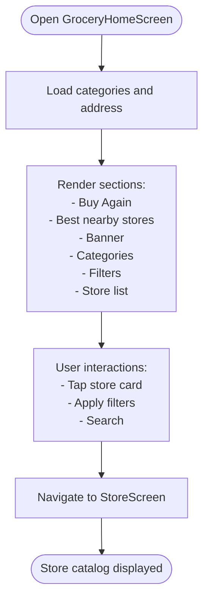
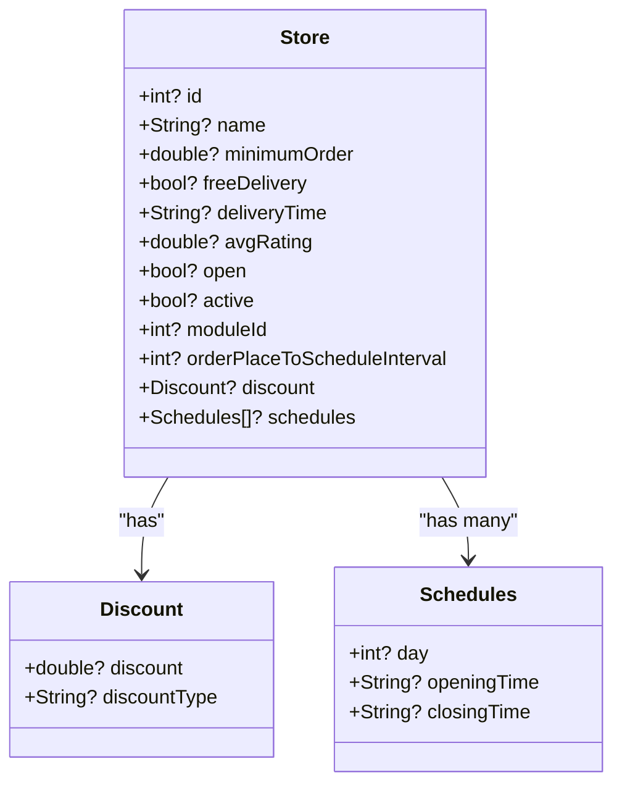
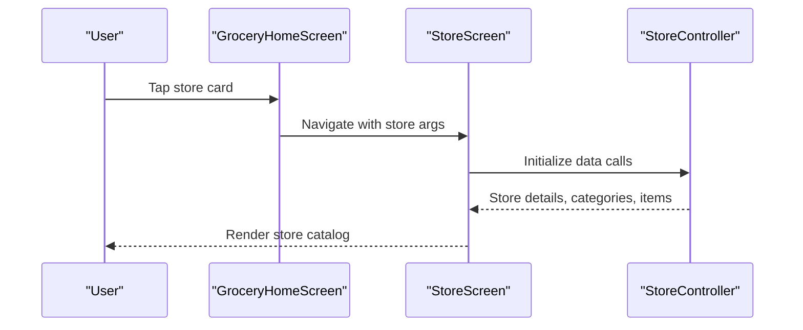
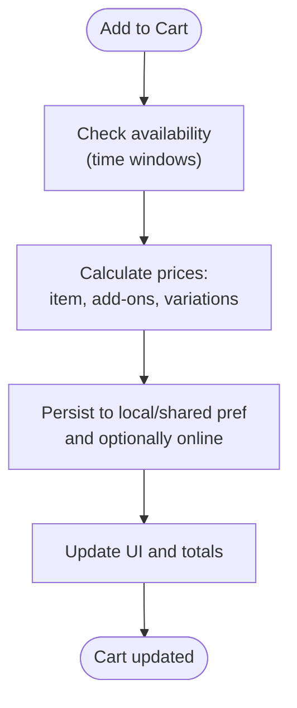
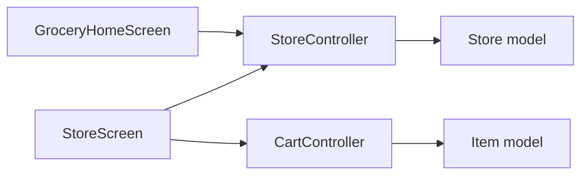

# Grocery Shopping Module

<cite>
**Referenced Files in This Document**
- [grocery_home_screen.dart](file://lib/features/home/screens/modules/grocery_home_screen.dart)
- [top_grocery_view.dart](file://lib/features/home/widgets/views/top_grocery_view.dart)
- [top_grocery_stores_view.dart](file://lib/features/home/widgets/views/top_grocery_stores_view.dart)
- [store_model.dart](file://lib/features/store/domain/models/store_model.dart)
- [store_screen.dart](file://lib/features/store/screens/store_screen.dart)
- [cart_controller.dart](file://lib/features/cart/controllers/cart_controller.dart)
- [grocery_improvements_plan.md](file://grocery_improvements_plan.md)
- [grocery_store_first_restructure.md](file://grocery_store_first_restructure.md)
</cite>

## Table of Contents
1. [Introduction](#introduction)
2. [Project Structure](#project-structure)
3. [Core Components](#core-components)
4. [Architecture Overview](#architecture-overview)
5. [Detailed Component Analysis](#detailed-component-analysis)
6. [Dependency Analysis](#dependency-analysis)
7. [Performance Considerations](#performance-considerations)
8. [Troubleshooting Guide](#troubleshooting-guide)
9. [Conclusion](#conclusion)

## Introduction
This document describes the grocery shopping module tailored for traditional retail grocery purchasing. It covers the Store module adaptation for grocery retailers, item categorization for grocery products, and inventory management specific to perishable goods. It also explains grocery-specific features such as product expiration tracking, bulk purchasing options, and delivery scheduling, along with integration with the home controller for module switching and relationships with shared components. Implementation details for grocery business logic, pricing strategies, and supply chain coordination are documented alongside user workflows for grocery ordering, basket management, and delivery preferences.

## Project Structure
The grocery module is organized around a store-first architecture that prioritizes store selection before browsing items. The home screen presents nearby stores prominently, followed by store-specific item catalogs. Shared components handle navigation, cart management, and store discovery.

**Diagram sources**
- [grocery_home_screen.dart](file://lib/features/home/screens/modules/grocery_home_screen.dart)
- [top_grocery_view.dart](file://lib/features/home/widgets/views/top_grocery_view.dart)
- [top_grocery_stores_view.dart](file://lib/features/home/widgets/views/top_grocery_stores_view.dart)
- [store_screen.dart](file://lib/features/store/screens/store_screen.dart)
- [store_model.dart](file://lib/features/store/domain/models/store_model.dart)
- [cart_controller.dart](file://lib/features/cart/controllers/cart_controller.dart)

**Section sources**
- [grocery_home_screen.dart](file://lib/features/home/screens/modules/grocery_home_screen.dart)
- [top_grocery_view.dart](file://lib/features/home/widgets/views/top_grocery_view.dart)
- [top_grocery_stores_view.dart](file://lib/features/home/widgets/views/top_grocery_stores_view.dart)
- [store_screen.dart](file://lib/features/store/screens/store_screen.dart)
- [store_model.dart](file://lib/features/store/domain/models/store_model.dart)
- [cart_controller.dart](file://lib/features/cart/controllers/cart_controller.dart)

## Core Components
- GroceryHomeScreen: Implements a store-first layout with hero nearby stores, quick filters, and store listings. It orchestrates data loading for categories, stores, and promotions.
- StoreScreen: Renders store details, banners, categories, special offers, and item sections grouped by category. It integrates live cart visibility and pagination.
- Store model: Encapsulates store metadata including delivery capabilities, scheduling, ratings, and discount information.
- CartController: Manages cart state, pricing calculations, availability checks, and online synchronization.

Key grocery adaptations:
- Store-first navigation aligns with typical retail behavior, enabling users to select a store before browsing items.
- Store metadata supports delivery scheduling, minimum orders, and store-wide discounts.
- CartController handles availability checks and provides user options for unavailable items.

**Section sources**
- [grocery_home_screen.dart](file://lib/features/home/screens/modules/grocery_home_screen.dart)
- [store_screen.dart](file://lib/features/store/screens/store_screen.dart)
- [store_model.dart](file://lib/features/store/domain/models/store_model.dart)
- [cart_controller.dart](file://lib/features/cart/controllers/cart_controller.dart)

## Architecture Overview
The grocery module follows a layered architecture:
- Presentation layer: Home and Store screens, views, and widgets.
- Domain models: Store and Item models define grocery-specific attributes.
- Controllers: Home, Store, and Cart controllers coordinate data and UI updates.
- Services: Integrated via controllers to fetch and synchronize data.

**Diagram sources**
- [grocery_home_screen.dart](file://lib/features/home/screens/modules/grocery_home_screen.dart)
- [store_screen.dart](file://lib/features/store/screens/store_screen.dart)
- [store_model.dart](file://lib/features/store/domain/models/store_model.dart)
- [cart_controller.dart](file://lib/features/cart/controllers/cart_controller.dart)

## Detailed Component Analysis

### GroceryHomeScreen: Store-First Layout
GroceryHomeScreen reorders the home experience to prioritize stores:
- Hero section for nearby stores with prominent store cards.
- Quick filters for offers, delivery time, and free delivery.
- Store listings with category filtering and store metadata.

**Diagram sources**
- [grocery_home_screen.dart](file://lib/features/home/screens/modules/grocery_home_screen.dart)

**Section sources**
- [grocery_home_screen.dart](file://lib/features/home/screens/modules/grocery_home_screen.dart)

### Store Model: Grocery Attributes
The Store model includes fields essential for grocery operations:
- Delivery scheduling and minimum order thresholds.
- Ratings, delivery time estimates, and discount information.
- Open status and store business model.

**Diagram sources**
- [store_model.dart](file://lib/features/store/domain/models/store_model.dart)

**Section sources**
- [store_model.dart](file://lib/features/store/domain/models/store_model.dart)

### StoreScreen: Catalog and Item Sections
StoreScreen organizes content for grocery browsing:
- Store header with open status and delivery info.
- Search and filter controls.
- Store banners and promotional sections.
- Categories grid and per-category item sections.
- Similar stores and reviews preview.

**Diagram sources**
- [store_screen.dart](file://lib/features/store/screens/store_screen.dart)

**Section sources**
- [store_screen.dart](file://lib/features/store/screens/store_screen.dart)

### CartController: Pricing and Availability
CartController manages cart operations with grocery-specific considerations:
- Calculates subtotal, add-ons, and variations.
- Checks item availability against store timing.
- Supports online cart synchronization and quantity updates.

**Diagram sources**
- [cart_controller.dart](file://lib/features/cart/controllers/cart_controller.dart)

**Section sources**
- [cart_controller.dart](file://lib/features/cart/controllers/cart_controller.dart)

### Grocery-Specific Features and Business Logic
- Product expiration tracking: Integrate item-level expiration dates and stock freshness indicators to guide purchase decisions.
- Bulk purchasing options: Enable quantity selection and unit-based pricing (e.g., per kg or piece) with appropriate UI prompts.
- Delivery scheduling: Use store schedules and order-place-to-schedule intervals to present available delivery slots.
- Pricing strategies: Support store-wide discounts, item discounts, and promotional pricing with clear display of savings.
- Supply chain coordination: Align store inventory with real-time stock updates and enforce store minimum orders and delivery policies.

These features are documented in the improvement plan and restructuring notes, which outline enhancements such as search improvements, buy-again functionality, shopping lists, and real-time stock updates.

**Section sources**
- [grocery_improvements_plan.md](file://grocery_improvements_plan.md)
- [grocery_store_first_restructure.md](file://grocery_store_first_restructure.md)

## Dependency Analysis
The grocery module relies on shared controllers and models:
- Home and Store screens depend on StoreController for store data and item listings.
- StoreScreen depends on CategoryController for categories and CartController for live cart integration.
- CartController coordinates with ItemController and service interfaces for online cart operations.

**Diagram sources**
- [grocery_home_screen.dart](file://lib/features/home/screens/modules/grocery_home_screen.dart)
- [store_screen.dart](file://lib/features/store/screens/store_screen.dart)
- [store_model.dart](file://lib/features/store/domain/models/store_model.dart)
- [cart_controller.dart](file://lib/features/cart/controllers/cart_controller.dart)

**Section sources**
- [grocery_home_screen.dart](file://lib/features/home/screens/modules/grocery_home_screen.dart)
- [store_screen.dart](file://lib/features/store/screens/store_screen.dart)
- [cart_controller.dart](file://lib/features/cart/controllers/cart_controller.dart)

## Performance Considerations
- Pagination and lazy loading: Implement server-side pagination for store items and categories to reduce initial load times.
- Caching: Cache store and category lists with timestamps to minimize network requests.
- Real-time updates: Use lightweight polling or push channels for stock updates to keep inventory accurate without blocking UI.
- UI responsiveness: Keep heavy computations off the UI thread; leverage GetX builders for selective rebuilds.

## Troubleshooting Guide
Common issues and resolutions:
- Out-of-stock items: Ensure stock availability is checked before allowing additions to cart; grey out or hide "ADD" buttons when stock reaches zero.
- Unavailable items during checkout: Present user options (remove, wait, cancel) and localize messaging for clarity.
- Store minimum order: Display progress toward minimum order threshold and prevent checkout until reached.
- Delivery scheduling conflicts: Validate requested delivery slots against store schedules and order-place-to-schedule intervals.

**Section sources**
- [cart_controller.dart](file://lib/features/cart/controllers/cart_controller.dart)
- [store_model.dart](file://lib/features/store/domain/models/store_model.dart)

## Conclusion
The grocery shopping module adopts a store-first architecture optimized for traditional retail grocery purchases. By emphasizing store selection, integrating delivery scheduling, and supporting bulk and perishable goods considerations, the module improves user experience and operational efficiency. The documented components, data models, and workflows provide a foundation for further enhancements such as real-time stock updates, buy-again features, and advanced search capabilities.