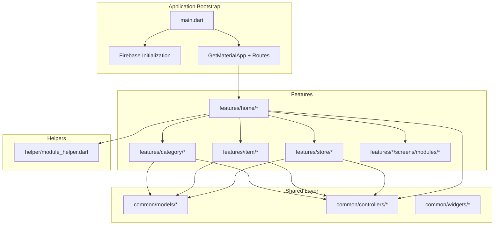
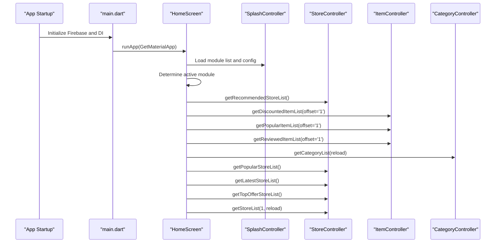
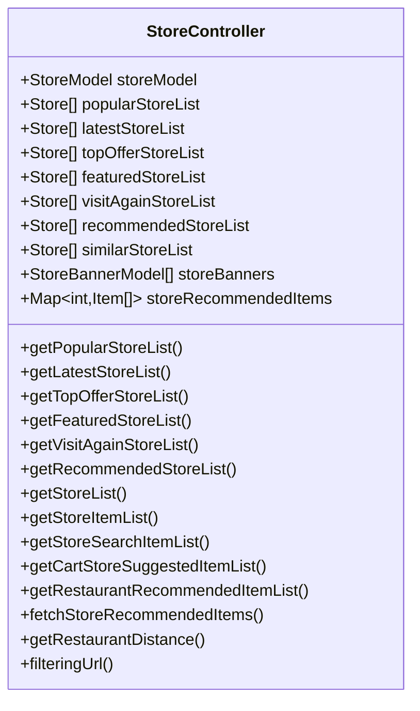
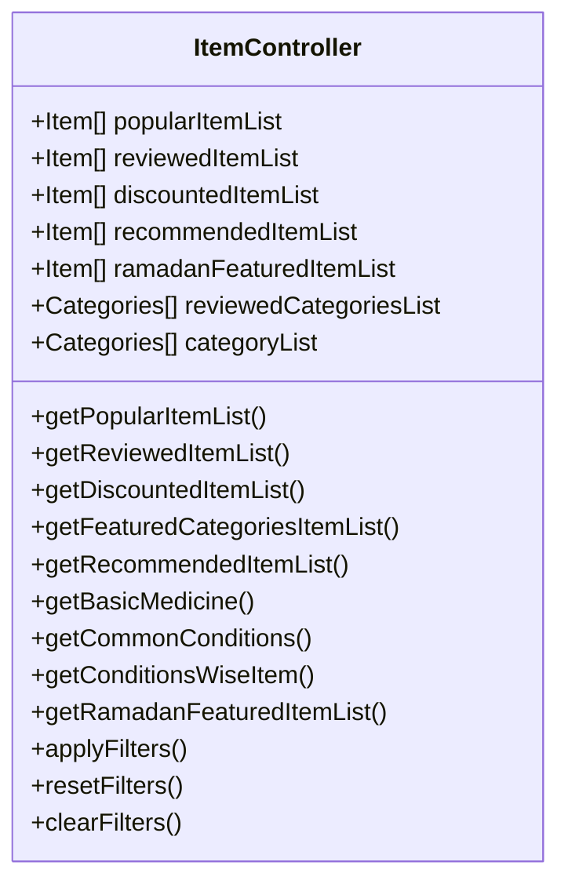
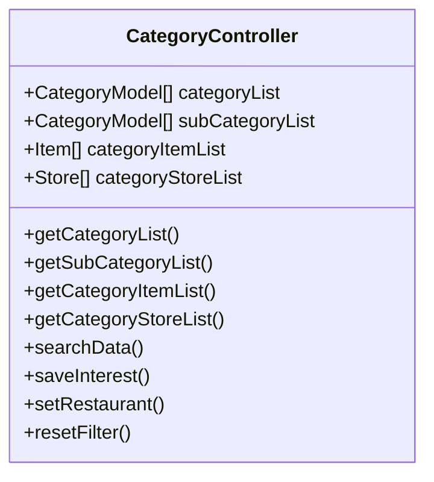
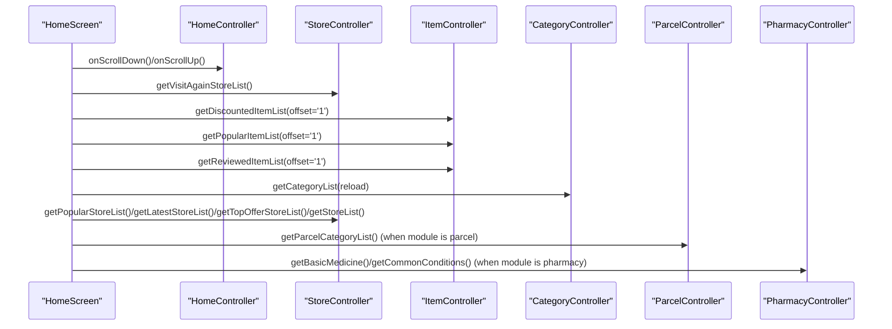
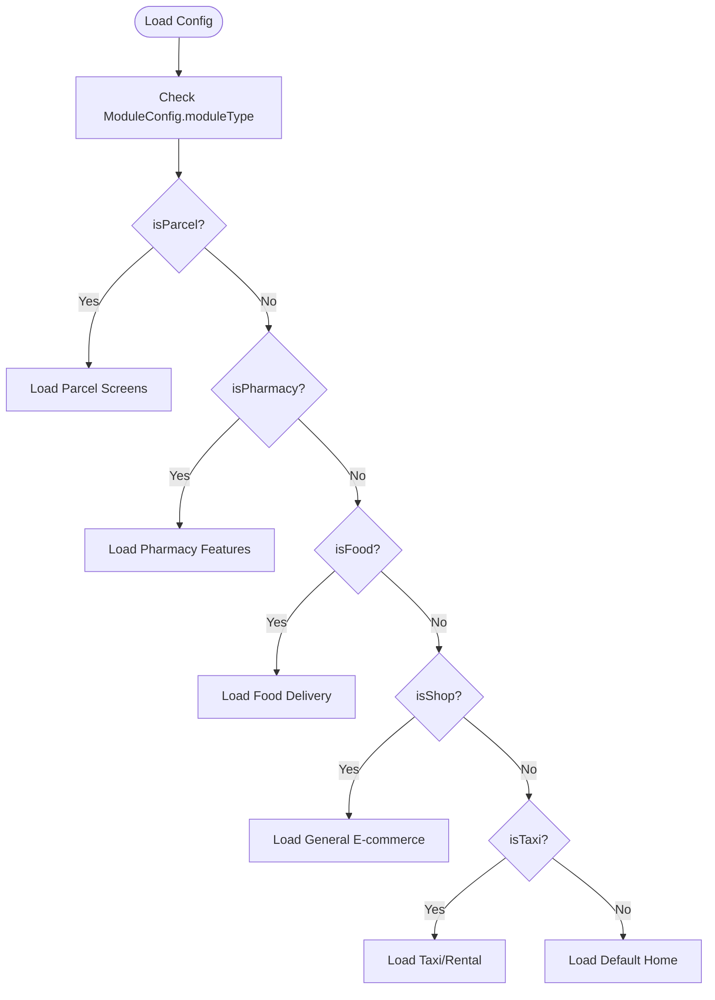
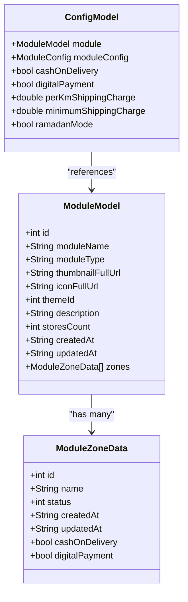
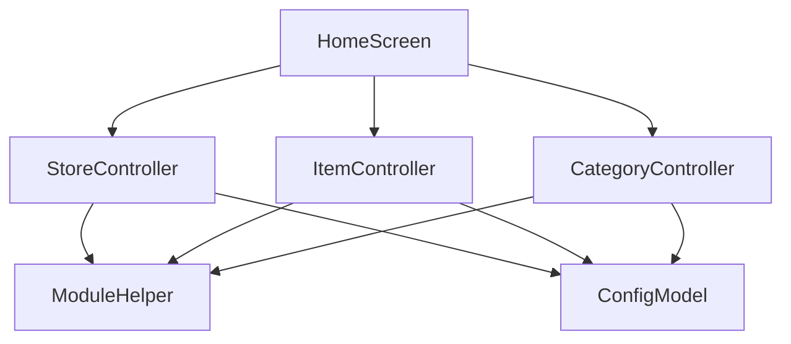

# Multi-Module Marketplace

<cite>
**Referenced Files in This Document**
- [main.dart](file://lib/main.dart)
- [pubspec.yaml](file://pubspec.yaml)
- [module_model.dart](file://lib/common/models/module_model.dart)
- [config_model.dart](file://lib/common/models/config_model.dart)
- [theme_controller.dart](file://lib/common/controllers/theme_controller.dart)
- [module_helper.dart](file://lib/helper/module_helper.dart)
- [store_controller.dart](file://lib/features/store/controllers/store_controller.dart)
- [item_controller.dart](file://lib/features/item/controllers/item_controller.dart)
- [category_controller.dart](file://lib/features/category/controllers/category_controller.dart)
- [home_controller.dart](file://lib/features/home/controllers/home_controller.dart)
- [home_screen.dart](file://lib/features/home/screens/home_screen.dart)
</cite>

## Table of Contents
1. [Introduction](#introduction)
2. [Project Structure](#project-structure)
3. [Core Components](#core-components)
4. [Architecture Overview](#architecture-overview)
5. [Detailed Component Analysis](#detailed-component-analysis)
6. [Dependency Analysis](#dependency-analysis)
7. [Performance Considerations](#performance-considerations)
8. [Troubleshooting Guide](#troubleshooting-guide)
9. [Conclusion](#conclusion)

## Introduction
This document describes a multi-module marketplace system designed to support multiple commerce verticals within a single Flutter application. The system integrates food delivery, grocery shopping, pharmacy services, parcel delivery, and general e-commerce through a modular architecture. The Store, Item, and Category modules serve as foundational components, while the Home controller orchestrates module switching, coordinates shared functionality, and manages vertical-specific features. The document explains module configuration, feature enablement, data models, business logic, shared services, and common UI components, along with isolation strategies, data sharing patterns, and performance considerations across different commerce verticals.

## Project Structure
The application follows a layered, feature-based structure with clear separation of concerns:
- Application bootstrap and initialization in main.dart
- Shared models and controllers under common/
- Feature-specific modules under features/, each containing controllers, domain models, services, screens, and widgets
- Helpers and utilities under helper/
- Dependencies declared in pubspec.yaml

**Diagram sources**
- [main.dart:35-103](file://lib/main.dart#L35-L103)
- [home_screen.dart:53-178](file://lib/features/home/screens/home_screen.dart#L53-L178)

**Section sources**
- [main.dart:35-103](file://lib/main.dart#L35-L103)
- [pubspec.yaml:1-122](file://pubspec.yaml#L1-L122)

## Core Components
This section outlines the foundational components and their roles in the multi-module marketplace.

- Module Model and Configuration
  - ModuleModel encapsulates module metadata, zones, and availability flags for cash-on-delivery and digital payments.
  - ConfigModel holds global configuration, including module configuration, payment options, policies, and promotional settings.
  - ModuleHelper provides access to current module and cache module for controllers.

- Controllers
  - StoreController: Manages store listings, categories, banners, recommendations, and filters across modules.
  - ItemController: Handles item lists, categories, filters, pricing, and special features like Ramadan campaigns and pharmacy conditions.
  - CategoryController: Provides category navigation, subcategories, and search results for items and stores.
  - HomeController: Coordinates home screen behavior, including bottom navigation visibility, Ramadan decorations, and cashback offers.

- Shared Services and Helpers
  - ThemeController: Manages theme state and color schemes.
  - ModuleHelper: Centralized access to module configuration for controllers.

**Section sources**
- [module_model.dart:2-106](file://lib/common/models/module_model.dart#L2-L106)
- [config_model.dart:399-616](file://lib/common/models/config_model.dart#L399-L616)
- [module_helper.dart:6-20](file://lib/helper/module_helper.dart#L6-L20)
- [store_controller.dart:31-139](file://lib/features/store/controllers/store_controller.dart#L31-L139)
- [item_controller.dart:28-180](file://lib/features/item/controllers/item_controller.dart#L28-L180)
- [category_controller.dart:9-60](file://lib/features/category/controllers/category_controller.dart#L9-L60)
- [home_controller.dart:8-60](file://lib/features/home/controllers/home_controller.dart#L8-L60)
- [theme_controller.dart:6-49](file://lib/common/controllers/theme_controller.dart#L6-L49)

## Architecture Overview
The system employs a modular architecture with a centralized Home controller coordinating module-specific screens and shared services. The HomeScreen dynamically renders content based on the active module, invoking module-specific loaders and shared feature controllers.

**Diagram sources**
- [main.dart:35-103](file://lib/main.dart#L35-L103)
- [home_screen.dart:56-161](file://lib/features/home/screens/home_screen.dart#L56-L161)

**Section sources**
- [home_screen.dart:53-178](file://lib/features/home/screens/home_screen.dart#L53-L178)

## Detailed Component Analysis

### Store Module
The Store module handles store discovery, personalization, and module-aware filtering. It integrates with category selection, banners, and recommendations, and adapts behavior based on the active module.

**Diagram sources**
- [store_controller.dart:31-800](file://lib/features/store/controllers/store_controller.dart#L31-L800)

**Section sources**
- [store_controller.dart:265-540](file://lib/features/store/controllers/store_controller.dart#L265-L540)
- [store_controller.dart:715-795](file://lib/features/store/controllers/store_controller.dart#L715-L795)

### Item Module
The Item module manages item discovery, filtering, and category navigation. It supports vertical-specific features such as pharmacy conditions and Ramadan campaigns.

**Diagram sources**
- [item_controller.dart:28-800](file://lib/features/item/controllers/item_controller.dart#L28-L800)

**Section sources**
- [item_controller.dart:444-514](file://lib/features/item/controllers/item_controller.dart#L444-L514)
- [item_controller.dart:516-589](file://lib/features/item/controllers/item_controller.dart#L516-L589)
- [item_controller.dart:591-661](file://lib/features/item/controllers/item_controller.dart#L591-L661)

### Category Module
The Category module provides hierarchical navigation and search across items and stores, with caching and TTL-based refresh strategies.

**Diagram sources**
- [category_controller.dart:9-290](file://lib/features/category/controllers/category_controller.dart#L9-L290)

**Section sources**
- [category_controller.dart:65-87](file://lib/features/category/controllers/category_controller.dart#L65-L87)
- [category_controller.dart:123-169](file://lib/features/category/controllers/category_controller.dart#L123-L169)

### Home Controller and Home Screen
The Home controller coordinates home screen behavior, including bottom navigation visibility, Ramadan decorations, and cashback offers. The Home screen orchestrates module switching and invokes loaders for shared and module-specific features.

**Diagram sources**
- [home_controller.dart:107-127](file://lib/features/home/controllers/home_controller.dart#L107-L127)
- [home_screen.dart:56-161](file://lib/features/home/screens/home_screen.dart#L56-L161)

**Section sources**
- [home_controller.dart:8-60](file://lib/features/home/controllers/home_controller.dart#L8-L60)
- [home_screen.dart:56-161](file://lib/features/home/screens/home_screen.dart#L56-L161)

### Module Configuration and Feature Enablement
Module configuration is defined via ConfigModel and ModuleConfig, enabling/disabling features such as add-ons, stock tracking, unit handling, and vertical-specific flags (e.g., isParcel, isTaxi). ModuleHelper exposes the current module and cache module to controllers.

**Diagram sources**
- [config_model.dart:539-616](file://lib/common/models/config_model.dart#L539-L616)
- [module_helper.dart:6-20](file://lib/helper/module_helper.dart#L6-L20)
- [home_screen.dart:430-438](file://lib/features/home/screens/home_screen.dart#L430-L438)

**Section sources**
- [config_model.dart:539-616](file://lib/common/models/config_model.dart#L539-L616)
- [module_helper.dart:6-20](file://lib/helper/module_helper.dart#L6-L20)
- [home_screen.dart:430-438](file://lib/features/home/screens/home_screen.dart#L430-L438)

### Data Models and Business Logic
- ModuleModel and ModuleZoneData define module metadata and zone-specific capabilities.
- ConfigModel aggregates global settings, including payment methods, policies, and vertical flags.
- Controllers implement business logic for pagination, filtering, caching, and module-aware requests.

**Diagram sources**
- [module_model.dart:2-106](file://lib/common/models/module_model.dart#L2-L106)
- [config_model.dart:399-499](file://lib/common/models/config_model.dart#L399-L499)

**Section sources**
- [module_model.dart:29-62](file://lib/common/models/module_model.dart#L29-L62)
- [config_model.dart:175-285](file://lib/common/models/config_model.dart#L175-L285)

### Shared Services and Common UI Components
- ThemeController manages theme state and color schemes for consistent UI across modules.
- Common widgets provide reusable components for cards, buttons, dialogs, and loaders.
- ModuleHelper centralizes module access for controllers.

**Section sources**
- [theme_controller.dart:6-49](file://lib/common/controllers/theme_controller.dart#L6-L49)

## Dependency Analysis
The system leverages GetX for state management and dependency injection, enabling loose coupling between modules and shared services. Controllers depend on service interfaces and shared helpers, minimizing cross-module coupling.

**Diagram sources**
- [store_controller.dart:25-33](file://lib/features/store/controllers/store_controller.dart#L25-L33)
- [item_controller.dart:23-31](file://lib/features/item/controllers/item_controller.dart#L23-L31)
- [category_controller.dart:6-12](file://lib/features/category/controllers/category_controller.dart#L6-L12)
- [home_screen.dart:53-178](file://lib/features/home/screens/home_screen.dart#L53-L178)

**Section sources**
- [store_controller.dart:25-33](file://lib/features/store/controllers/store_controller.dart#L25-L33)
- [item_controller.dart:23-31](file://lib/features/item/controllers/item_controller.dart#L23-L31)
- [category_controller.dart:6-12](file://lib/features/category/controllers/category_controller.dart#L6-L12)

## Performance Considerations
- Caching and TTL: Controllers implement local-first caching with TTL checks to reduce network calls and improve responsiveness across modules.
- Pagination: Controllers handle pagination to avoid loading large datasets at once.
- Lazy Loading: HomeScreen loads module-specific content only when needed, reducing initial load time.
- Conditional Feature Loading: Based on module flags, controllers skip unnecessary API calls and UI rendering.

[No sources needed since this section provides general guidance]

## Troubleshooting Guide
- Module Switching Issues
  - Verify module configuration in ConfigModel and ensure ModuleHelper returns the correct module.
  - Confirm HomeScreen module detection logic and loaders are invoked appropriately.

- Data Consistency
  - Check cache TTL logic in controllers to ensure fresh data refreshes when stale.
  - Validate pagination offsets and page sizes to prevent duplicated or truncated data.

- UI Visibility
  - Review bottom navigation visibility logic in HomeController and HomeScreen to ensure proper behavior on scroll.

**Section sources**
- [home_screen.dart:56-161](file://lib/features/home/screens/home_screen.dart#L56-L161)
- [store_controller.dart:381-414](file://lib/features/store/controllers/store_controller.dart#L381-L414)
- [item_controller.dart:483-495](file://lib/features/item/controllers/item_controller.dart#L483-L495)

## Conclusion
The multi-module marketplace system achieves vertical flexibility through a modular architecture centered on Store, Item, and Category controllers, orchestrated by the Home controller. Module configuration and helpers enable seamless switching and feature enablement across food delivery, grocery, pharmacy, parcel, and general e-commerce. Shared services and common UI components ensure consistency, while caching, pagination, and conditional loading optimize performance. This design supports module isolation, controlled data sharing, and scalable customization across diverse commerce verticals.