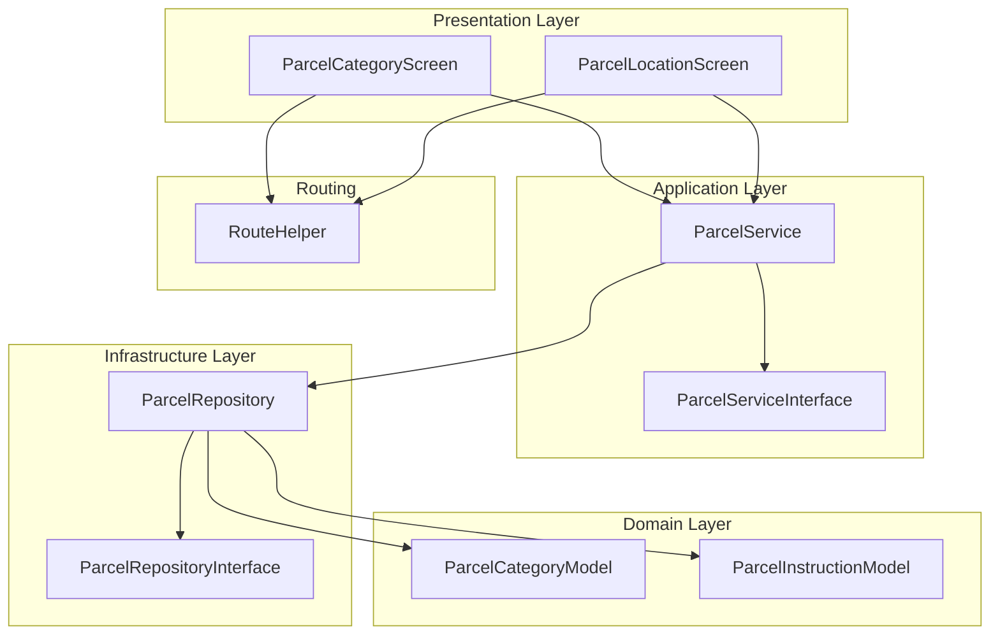
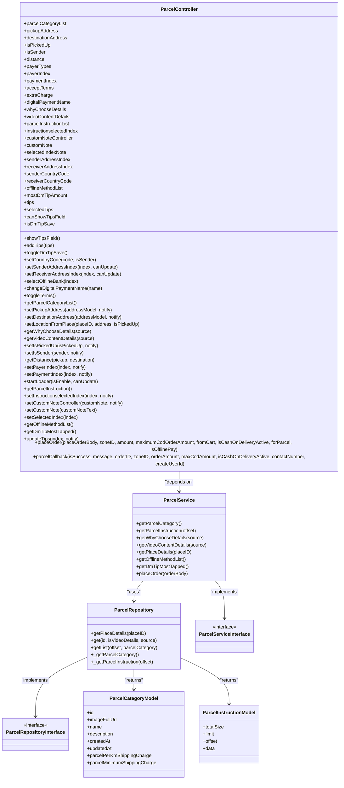
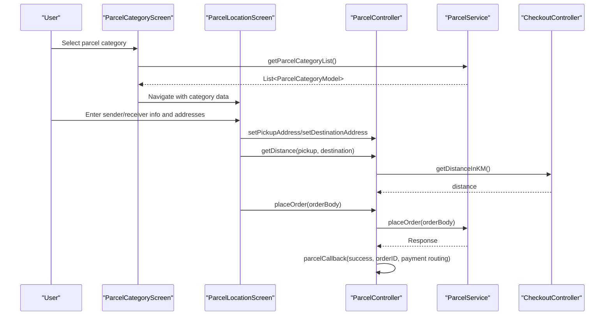
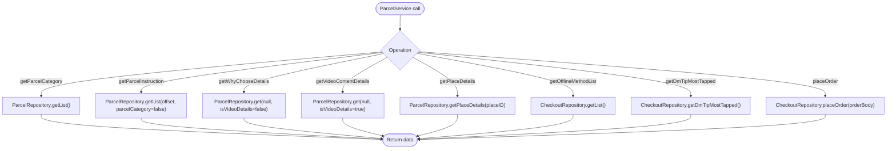
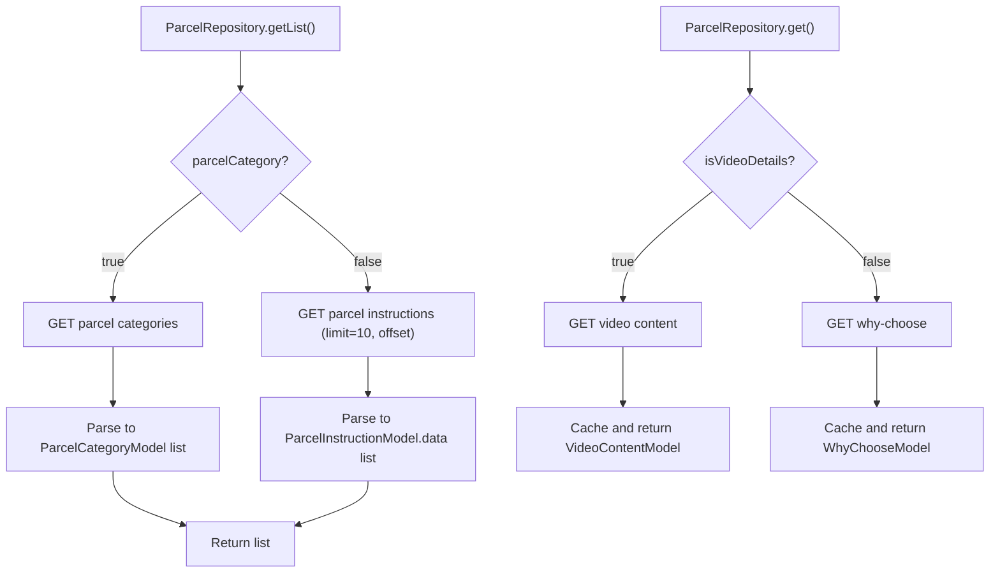
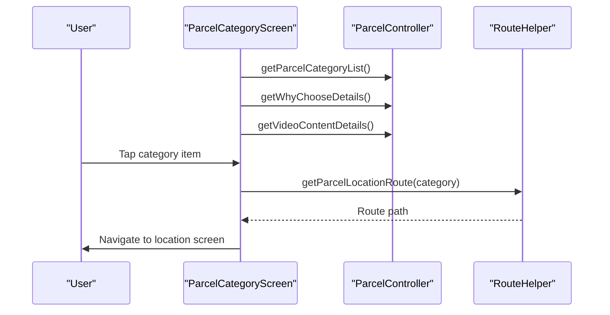
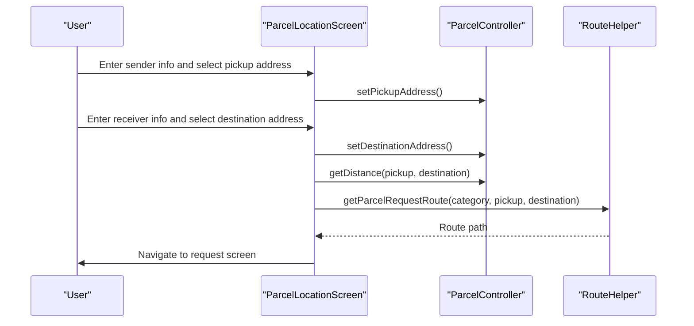
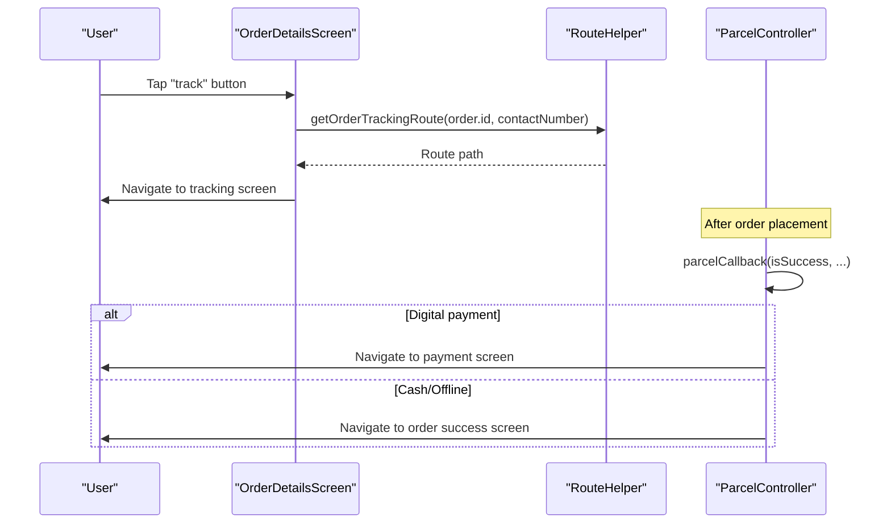
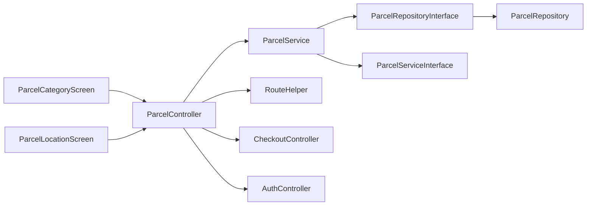

# Parcel Delivery Module

<cite>
**Referenced Files in This Document**
- [parcel_controller.dart](file://lib/features/parcel/controllers/parcel_controller.dart)
- [parcel_repository.dart](file://lib/features/parcel/domain/repositories/parcel_repository.dart)
- [parcel_repository_interface.dart](file://lib/features/parcel/domain/repositories/parcel_repository_interface.dart)
- [parcel_service.dart](file://lib/features/parcel/domain/services/parcel_service.dart)
- [parcel_service_interface.dart](file://lib/features/parcel/domain/services/parcel_service_interface.dart)
- [parcel_category_model.dart](file://lib/features/parcel/domain/models/parcel_category_model.dart)
- [parcel_instruction_model.dart](file://lib/features/parcel/domain/models/parcel_instruction_model.dart)
- [parcel_category_screen.dart](file://lib/features/parcel/screens/parcel_category_screen.dart)
- [parcel_location_screen.dart](file://lib/features/parcel/screens/parcel_location_screen.dart)
- [route_helper.dart](file://lib/helper/route_helper.dart)
- [order_details_screen.dart](file://lib/features/order/screens/order_details_screen.dart)
</cite>

## Table of Contents
1. [Introduction](#introduction)
2. [Project Structure](#project-structure)
3. [Core Components](#core-components)
4. [Architecture Overview](#architecture-overview)
5. [Detailed Component Analysis](#detailed-component-analysis)
6. [Dependency Analysis](#dependency-analysis)
7. [Performance Considerations](#performance-considerations)
8. [Troubleshooting Guide](#troubleshooting-guide)
9. [Conclusion](#conclusion)

## Introduction
This document describes the Parcel Delivery Module responsible for package shipping and delivery services. It covers the dedicated Parcel module for package management, tracking systems, and delivery coordination. It explains order management specific to parcels, package categories, dimensions considerations, weight restrictions, and insurance options. It also documents integration with the home controller for module switching and the relationship with shared delivery infrastructure. Implementation specifics include parcel business logic, shipping calculations, and delivery scheduling. User workflows for package submission, tracking, and delivery confirmation are outlined, along with examples of parcel-specific data models, shipping requirements, and delivery coordination patterns.

## Project Structure
The Parcel module follows a layered architecture with clear separation of concerns:
- Domain layer: Models and repository/service interfaces
- Application layer: Services implementing business logic
- Infrastructure layer: Repositories handling API and caching
- Presentation layer: Screens and controllers orchestrating UI and user interactions
- Routing: Centralized route definitions for navigation between parcel screens

**Diagram sources**
- [parcel_category_screen.dart:44-215](file://lib/features/parcel/screens/parcel_category_screen.dart#L44-L215)
- [parcel_location_screen.dart:134-206](file://lib/features/parcel/screens/parcel_location_screen.dart#L134-L206)
- [parcel_service.dart:15-70](file://lib/features/parcel/domain/services/parcel_service.dart#L15-L70)
- [parcel_repository.dart:14-119](file://lib/features/parcel/domain/repositories/parcel_repository.dart#L14-L119)
- [parcel_category_model.dart:1-46](file://lib/features/parcel/domain/models/parcel_category_model.dart#L1-L46)
- [parcel_instruction_model.dart:1-121](file://lib/features/parcel/domain/models/parcel_instruction_model.dart#L1-L121)
- [route_helper.dart:971-1014](file://lib/helper/route_helper.dart#L971-L1014)

**Section sources**
- [parcel_category_screen.dart:23-215](file://lib/features/parcel/screens/parcel_category_screen.dart#L23-L215)
- [parcel_location_screen.dart:26-206](file://lib/features/parcel/screens/parcel_location_screen.dart#L26-L206)
- [parcel_service.dart:15-70](file://lib/features/parcel/domain/services/parcel_service.dart#L15-L70)
- [parcel_repository.dart:14-119](file://lib/features/parcel/domain/repositories/parcel_repository.dart#L14-L119)
- [parcel_category_model.dart:1-46](file://lib/features/parcel/domain/models/parcel_category_model.dart#L1-L46)
- [parcel_instruction_model.dart:1-121](file://lib/features/parcel/domain/models/parcel_instruction_model.dart#L1-L121)
- [route_helper.dart:971-1014](file://lib/helper/route_helper.dart#L971-L1014)

## Core Components
- ParcelController: Orchestrates parcel workflows, manages addresses, payment selection, tips, and order placement callbacks. Handles UI state updates and integrates with checkout and authentication services.
- ParcelService: Implements business logic for parcel operations, delegating to repository and checkout repositories for data retrieval and order placement.
- ParcelRepository: Fetches parcel categories, instructions, why-choose details, and video content; supports client and local data sources with caching.
- Models: ParcelCategoryModel defines shipping cost structure; ParcelInstructionModel encapsulates instruction lists with translations.
- Screens: ParcelCategoryScreen displays categories and promotional content; ParcelLocationScreen captures sender/receiver details and addresses.

Key responsibilities:
- Package management: Category selection, address capture, and order preparation
- Tracking systems: Integration with order tracking via route helper
- Delivery coordination: Distance calculation, payment methods, and callback routing

**Section sources**
- [parcel_controller.dart:27-440](file://lib/features/parcel/controllers/parcel_controller.dart#L27-L440)
- [parcel_service.dart:15-70](file://lib/features/parcel/domain/services/parcel_service.dart#L15-L70)
- [parcel_repository.dart:14-119](file://lib/features/parcel/domain/repositories/parcel_repository.dart#L14-L119)
- [parcel_category_model.dart:1-46](file://lib/features/parcel/domain/models/parcel_category_model.dart#L1-L46)
- [parcel_instruction_model.dart:1-121](file://lib/features/parcel/domain/models/parcel_instruction_model.dart#L1-L121)
- [parcel_category_screen.dart:44-215](file://lib/features/parcel/screens/parcel_category_screen.dart#L44-L215)
- [parcel_location_screen.dart:134-206](file://lib/features/parcel/screens/parcel_location_screen.dart#L134-L206)

## Architecture Overview
The Parcel module adheres to clean architecture principles:
- Controllers depend on services (dependency inversion)
- Services depend on repositories and checkout repositories
- Repositories handle API calls and caching
- Models define data contracts
- Screens coordinate UI and user interactions

**Diagram sources**
- [parcel_controller.dart:27-440](file://lib/features/parcel/controllers/parcel_controller.dart#L27-L440)
- [parcel_service.dart:15-70](file://lib/features/parcel/domain/services/parcel_service.dart#L15-L70)
- [parcel_repository.dart:14-119](file://lib/features/parcel/domain/repositories/parcel_repository.dart#L14-L119)
- [parcel_service_interface.dart:12-21](file://lib/features/parcel/domain/services/parcel_service_interface.dart#L12-L21)
- [parcel_repository_interface.dart:5-11](file://lib/features/parcel/domain/repositories/parcel_repository_interface.dart#L5-L11)
- [parcel_category_model.dart:1-46](file://lib/features/parcel/domain/models/parcel_category_model.dart#L1-L46)
- [parcel_instruction_model.dart:1-121](file://lib/features/parcel/domain/models/parcel_instruction_model.dart#L1-L121)

## Detailed Component Analysis

### ParcelController
Responsibilities:
- Manage parcel workflow state (addresses, payer type, payment mode, terms acceptance)
- Integrate with location services to resolve place details and zone validation
- Calculate distance and extra charges via checkout controller
- Handle order placement and callback routing for payment and success pages
- Manage tips, offline payment methods, and instruction selection

Key methods and flows:
- Address management: setPickupAddress, setDestinationAddress, setLocationFromPlace, _processAddressAndAction
- UI state: setIsPickedUp, setIsSender, setPayerIndex, setPaymentIndex, toggleTerms
- Data loading: getParcelCategoryList, getWhyChooseDetails, getVideoContentDetails, getParcelInstruction
- Payment and order: getOfflineMethodList, getDmTipMostTapped, updateTips, placeOrder, parcelCallback

**Diagram sources**
- [parcel_category_screen.dart:121-123](file://lib/features/parcel/screens/parcel_category_screen.dart#L121-L123)
- [parcel_location_screen.dart:258-262](file://lib/features/parcel/screens/parcel_location_screen.dart#L258-L262)
- [parcel_controller.dart:277-287](file://lib/features/parcel/controllers/parcel_controller.dart#L277-L287)
- [parcel_controller.dart:379-406](file://lib/features/parcel/controllers/parcel_controller.dart#L379-L406)
- [parcel_controller.dart:408-438](file://lib/features/parcel/controllers/parcel_controller.dart#L408-L438)
- [parcel_service.dart:65-68](file://lib/features/parcel/domain/services/parcel_service.dart#L65-L68)

**Section sources**
- [parcel_controller.dart:27-440](file://lib/features/parcel/controllers/parcel_controller.dart#L27-L440)

### ParcelService
Responsibilities:
- Delegate data retrieval to ParcelRepository for categories, instructions, why-choose, and video content
- Resolve place coordinates via repository
- Fetch offline payment methods and delivery man tip preferences from checkout repository
- Place orders by delegating to checkout repository

**Diagram sources**
- [parcel_service.dart:20-68](file://lib/features/parcel/domain/services/parcel_service.dart#L20-L68)
- [parcel_repository.dart:84-111](file://lib/features/parcel/domain/repositories/parcel_repository.dart#L84-L111)

**Section sources**
- [parcel_service.dart:15-70](file://lib/features/parcel/domain/services/parcel_service.dart#L15-L70)

### ParcelRepository
Responsibilities:
- Fetch parcel categories and instructions from API
- Retrieve why-choose details and video content with client/local caching
- Provide place details resolution
- Coordinate caching using LocalClient and module-aware keys

**Diagram sources**
- [parcel_repository.dart:84-111](file://lib/features/parcel/domain/repositories/parcel_repository.dart#L84-L111)
- [parcel_repository.dart:42-81](file://lib/features/parcel/domain/repositories/parcel_repository.dart#L42-L81)

**Section sources**
- [parcel_repository.dart:14-119](file://lib/features/parcel/domain/repositories/parcel_repository.dart#L14-L119)

### ParcelCategoryScreen
Responsibilities:
- Display parcel categories in a grid
- Show promotional banners and "why choose us" items
- Load video content and service information
- Navigate to location screen on category selection

**Diagram sources**
- [parcel_category_screen.dart:54-59](file://lib/features/parcel/screens/parcel_category_screen.dart#L54-L59)
- [parcel_category_screen.dart:121-123](file://lib/features/parcel/screens/parcel_category_screen.dart#L121-L123)
- [route_helper.dart:971-991](file://lib/helper/route_helper.dart#L971-L991)

**Section sources**
- [parcel_category_screen.dart:44-215](file://lib/features/parcel/screens/parcel_category_screen.dart#L44-L215)
- [route_helper.dart:971-991](file://lib/helper/route_helper.dart#L971-L991)

### ParcelLocationScreen
Responsibilities:
- Capture sender and receiver information and addresses
- Validate phone numbers and address selections
- Compute distance and extra charges
- Navigate to request screen with prepared data

**Diagram sources**
- [parcel_location_screen.dart:215-262](file://lib/features/parcel/screens/parcel_location_screen.dart#L215-L262)
- [parcel_controller.dart:277-287](file://lib/features/parcel/controllers/parcel_controller.dart#L277-L287)
- [route_helper.dart:992-1014](file://lib/helper/route_helper.dart#L992-L1014)

**Section sources**
- [parcel_location_screen.dart:134-206](file://lib/features/parcel/screens/parcel_location_screen.dart#L134-L206)
- [route_helper.dart:992-1014](file://lib/helper/route_helper.dart#L992-L1014)

### Order Management and Tracking Integration
- Order details screen provides a track button that routes to the appropriate tracking screen based on parcel flag
- ParcelController handles payment callbacks and navigates to success or payment screens depending on payment method

**Diagram sources**
- [order_details_screen.dart:1852-1888](file://lib/features/order/screens/order_details_screen.dart#L1852-L1888)
- [parcel_controller.dart:408-438](file://lib/features/parcel/controllers/parcel_controller.dart#L408-L438)
- [route_helper.dart:964-970](file://lib/helper/route_helper.dart#L964-L970)

**Section sources**
- [order_details_screen.dart:1852-1888](file://lib/features/order/screens/order_details_screen.dart#L1852-L1888)
- [parcel_controller.dart:408-438](file://lib/features/parcel/controllers/parcel_controller.dart#L408-L438)

## Dependency Analysis
The module exhibits low coupling and high cohesion:
- Controllers depend on service interfaces, enabling easy testing and substitution
- Services depend on repository interfaces, maintaining separation between business logic and data access
- Repositories depend on API clients and caching mechanisms, abstracting infrastructure concerns
- Screens depend on controllers and route helper, coordinating user interactions

Potential circular dependencies:
- None observed between parcel components; controllers coordinate with checkout and auth controllers but do not introduce cycles

External dependencies:
- RouteHelper centralizes navigation
- CheckoutController provides distance calculation and order placement
- AuthController supplies user country code and guest number persistence

**Diagram sources**
- [parcel_category_screen.dart:121-123](file://lib/features/parcel/screens/parcel_category_screen.dart#L121-L123)
- [parcel_location_screen.dart:258-262](file://lib/features/parcel/screens/parcel_location_screen.dart#L258-L262)
- [parcel_controller.dart:27-440](file://lib/features/parcel/controllers/parcel_controller.dart#L27-L440)
- [parcel_service.dart:15-70](file://lib/features/parcel/domain/services/parcel_service.dart#L15-L70)
- [parcel_repository_interface.dart:5-11](file://lib/features/parcel/domain/repositories/parcel_repository_interface.dart#L5-L11)
- [parcel_repository.dart:14-119](file://lib/features/parcel/domain/repositories/parcel_repository.dart#L14-L119)
- [route_helper.dart:971-1014](file://lib/helper/route_helper.dart#L971-L1014)

**Section sources**
- [parcel_controller.dart:27-440](file://lib/features/parcel/controllers/parcel_controller.dart#L27-L440)
- [parcel_service.dart:15-70](file://lib/features/parcel/domain/services/parcel_service.dart#L15-L70)
- [parcel_repository.dart:14-119](file://lib/features/parcel/domain/repositories/parcel_repository.dart#L14-L119)
- [route_helper.dart:971-1014](file://lib/helper/route_helper.dart#L971-L1014)

## Performance Considerations
- Caching: Video content and why-choose details are cached locally to reduce network requests and improve load times
- Lazy loading: Instructions are fetched with pagination to minimize payload sizes
- Distance calculation: Delegated to checkout controller to reuse existing logic and avoid duplication
- UI updates: GetBuilder pattern ensures granular UI updates without rebuilding entire trees

## Troubleshooting Guide
Common issues and resolutions:
- Zone validation failures: When selected locations fall outside user zones, the system shows a snackbar and prevents address assignment
- Invalid phone numbers: Validation occurs during sender/receiver info entry; errors prompt users to correct entries
- Empty address selection: Validation checks ensure both pickup and destination addresses are selected before proceeding
- Payment callback handling: parcelCallback manages success/failure states and routes users to appropriate screens

**Section sources**
- [parcel_controller.dart:232-237](file://lib/features/parcel/controllers/parcel_controller.dart#L232-L237)
- [parcel_location_screen.dart:224-235](file://lib/features/parcel/screens/parcel_location_screen.dart#L224-L235)
- [parcel_location_screen.dart:277-289](file://lib/features/parcel/screens/parcel_location_screen.dart#L277-L289)
- [parcel_controller.dart:408-438](file://lib/features/parcel/controllers/parcel_controller.dart#L408-L438)

## Conclusion
The Parcel Delivery Module provides a robust, scalable solution for package shipping and delivery. Its clean architecture enables maintainability, testability, and extensibility. The module integrates seamlessly with shared delivery infrastructure via checkout and auth controllers, while offering a smooth user experience through intuitive screens and centralized routing. The design supports future enhancements such as insurance options, advanced tracking, and expanded shipping requirements.