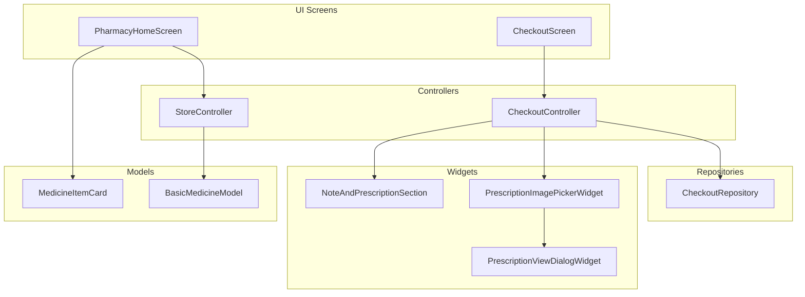
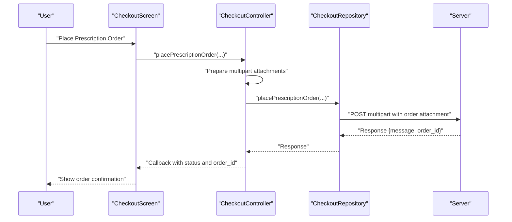
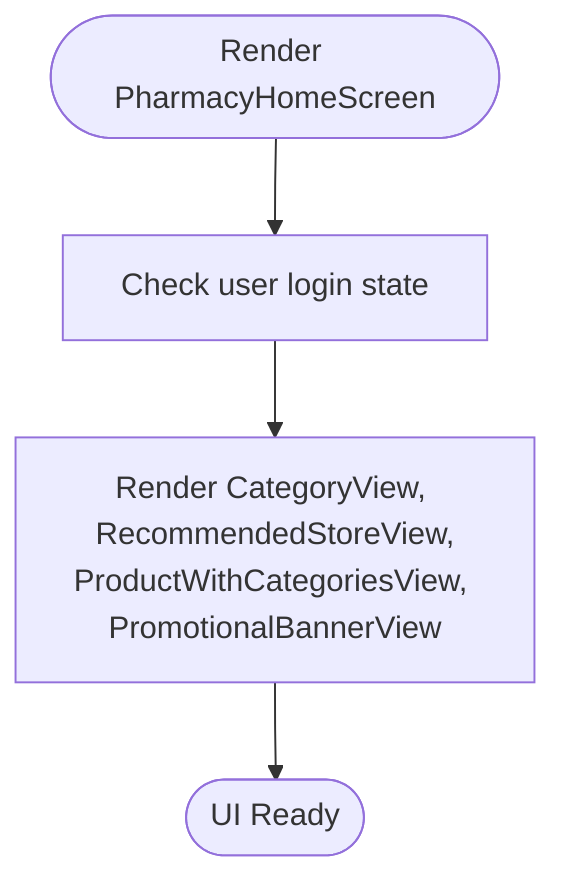
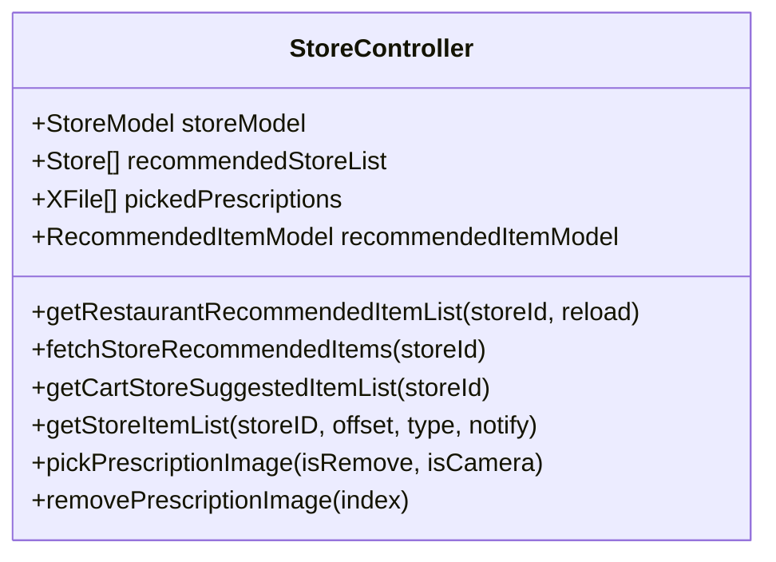
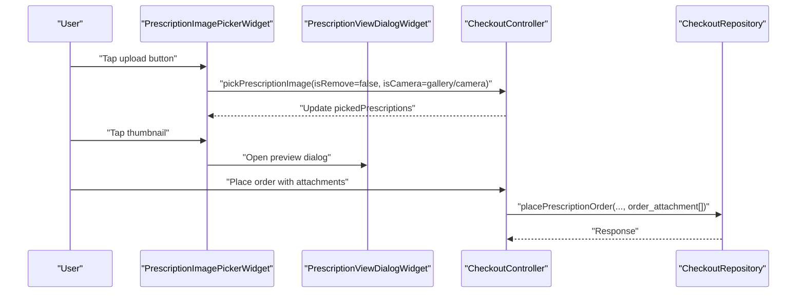
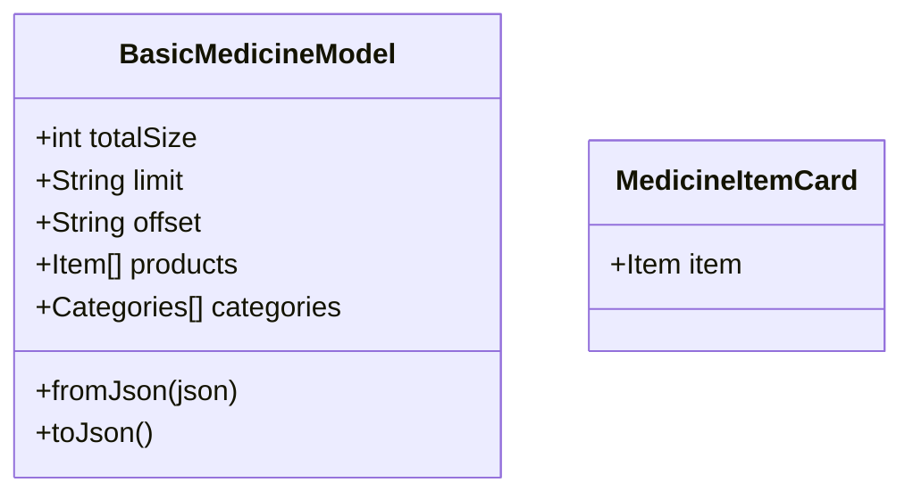
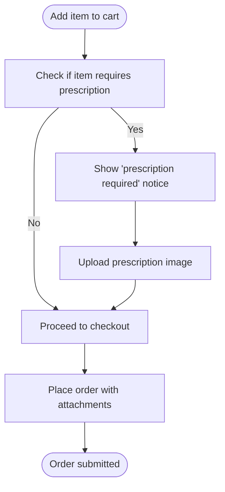
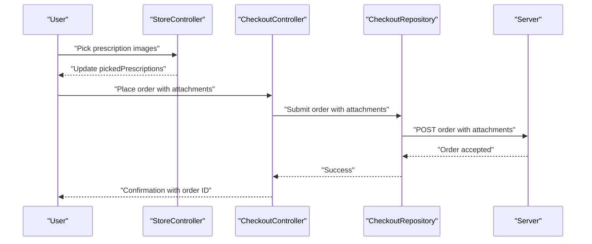
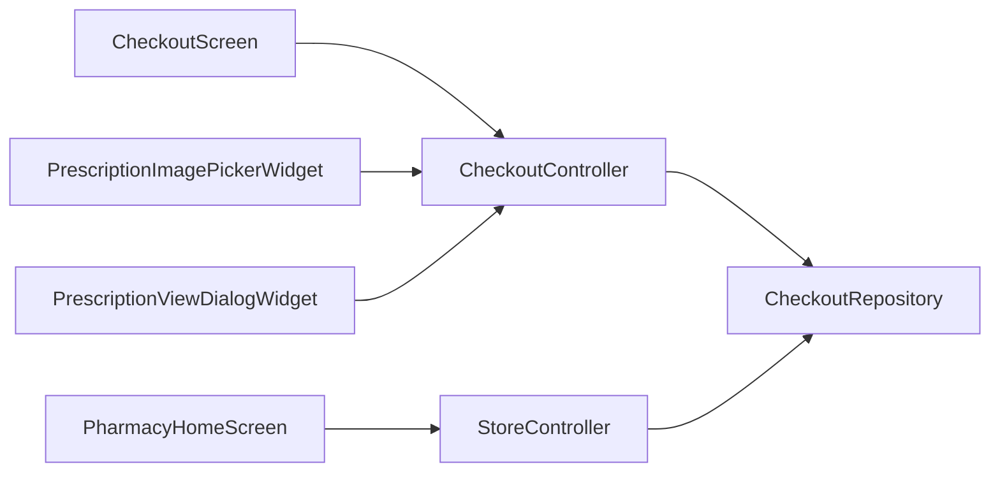

# Pharmacy Services Module

<cite>
**Referenced Files in This Document**
- [pharmacy_home_screen.dart](file://lib/features/home/screens/modules/pharmacy_home_screen.dart)
- [store_controller.dart](file://lib/features/store/controllers/store_controller.dart)
- [checkout_repository.dart](file://lib/features/checkout/domain/repositories/checkout_repository.dart)
- [checkout_controller.dart](file://lib/features/checkout/controllers/checkout_controller.dart)
- [checkout_screen.dart](file://lib/features/checkout/screens/checkout_screen.dart)
- [note_prescription_section.dart](file://lib/features/checkout/widgets/note_prescription_section.dart)
- [prescription_image_picker_widget.dart](file://lib/features/checkout/widgets/prescription_image_picker_widget.dart)
- [prescription_view_dialog_widget.dart](file://lib/features/checkout/widgets/prescription_view_dialog_widget.dart)
- [web_best_store_nearby_view_widget.dart](file://lib/features/home/widgets/web/web_best_store_nearby_view_widget.dart)
- [web_category_view_widget.dart](file://lib/features/home/widgets/web/web_category_view_widget.dart)
- [basic_medicine_model.dart](file://lib/features/item/domain/models/basic_medicine_model.dart)
- [medicine_item_card.dart](file://lib/features/home/widgets/web/widgets/medicine_item_card.dart)
</cite>

## Table of Contents
1. [Introduction](#introduction)
2. [Project Structure](#project-structure)
3. [Core Components](#core-components)
4. [Architecture Overview](#architecture-overview)
5. [Detailed Component Analysis](#detailed-component-analysis)
6. [Dependency Analysis](#dependency-analysis)
7. [Performance Considerations](#performance-considerations)
8. [Troubleshooting Guide](#troubleshooting-guide)
9. [Conclusion](#conclusion)
10. [Appendices](#appendices)

## Introduction
This document describes the pharmacy services module that enables users to browse and purchase medications and pharmaceutical products, manage prescriptions, and coordinate delivery. It covers the specialized Store module for pharmacies, controlled substance management, prescription verification processes, item management for medications and dosage information, regulatory compliance features, and integration with healthcare systems and prescription management. The module supports uploading prescriptions during checkout, pharmacist review workflows, and delivery coordination.

## Project Structure
The pharmacy module spans several layers:
- UI screens and views for pharmacy home, store browsing, and medicine items
- Controllers for store and checkout interactions
- Repositories and services for API communication
- Widgets for prescription upload and viewing
- Data models for medicines and categories

**Diagram sources**
- [pharmacy_home_screen.dart:17-51](file://lib/features/home/screens/modules/pharmacy_home_screen.dart#L17-L51)
- [store_controller.dart:31-124](file://lib/features/store/controllers/store_controller.dart#L31-L124)
- [checkout_repository.dart:82-132](file://lib/features/checkout/domain/repositories/checkout_repository.dart#L82-L132)
- [checkout_controller.dart:529-552](file://lib/features/checkout/controllers/checkout_controller.dart#L529-L552)
- [checkout_screen.dart:1440-1466](file://lib/features/checkout/screens/checkout_screen.dart#L1440-L1466)
- [prescription_image_picker_widget.dart:15-153](file://lib/features/checkout/widgets/prescription_image_picker_widget.dart#L15-L153)
- [note_prescription_section.dart:8-56](file://lib/features/checkout/widgets/note_prescription_section.dart#L8-L56)
- [prescription_view_dialog_widget.dart:6-56](file://lib/features/checkout/widgets/prescription_view_dialog_widget.dart#L6-L56)
- [basic_medicine_model.dart:3-56](file://lib/features/item/domain/models/basic_medicine_model.dart#L3-L56)
- [medicine_item_card.dart:21-23](file://lib/features/home/widgets/web/widgets/medicine_item_card.dart#L21-L23)

**Section sources**
- [pharmacy_home_screen.dart:17-51](file://lib/features/home/screens/modules/pharmacy_home_screen.dart#L17-L51)
- [store_controller.dart:31-124](file://lib/features/store/controllers/store_controller.dart#L31-L124)

## Core Components
- PharmacyHomeScreen: Renders pharmacy-specific views including banners, categories, recommended stores, and promotional content tailored for medications.
- StoreController: Manages store data, item lists, filters, favorites, and prescription attachments for pharmacy stores.
- CheckoutController and CheckoutRepository: Handle placing orders with attachments, including prescriptions, and coordinating delivery.
- Prescription widgets: Allow users to attach, preview, and remove prescriptions during checkout.
- Medicine models: Provide structured data for medications and categories used across the UI.

Key responsibilities:
- Prescription upload and validation
- Controlled substance handling via item categorization and requirement flags
- Delivery coordination with store distance and time slots
- Regulatory compliance indicators and warnings

**Section sources**
- [pharmacy_home_screen.dart:20-48](file://lib/features/home/screens/modules/pharmacy_home_screen.dart#L20-L48)
- [store_controller.dart:95-189](file://lib/features/store/controllers/store_controller.dart#L95-L189)
- [checkout_repository.dart:82-112](file://lib/features/checkout/domain/repositories/checkout_repository.dart#L82-L112)
- [checkout_controller.dart:529-552](file://lib/features/checkout/controllers/checkout_controller.dart#L529-L552)
- [prescription_image_picker_widget.dart:23-151](file://lib/features/checkout/widgets/prescription_image_picker_widget.dart#L23-L151)

## Architecture Overview
The pharmacy module follows a layered architecture:
- Presentation layer: Screens and widgets render UI and capture user actions.
- Domain layer: Controllers orchestrate business logic and state updates.
- Data layer: Repositories encapsulate API interactions for orders and store data.

**Diagram sources**
- [checkout_screen.dart:1464-1466](file://lib/features/checkout/screens/checkout_screen.dart#L1464-L1466)
- [checkout_controller.dart:529-552](file://lib/features/checkout/controllers/checkout_controller.dart#L529-L552)
- [checkout_repository.dart:82-112](file://lib/features/checkout/domain/repositories/checkout_repository.dart#L82-L112)

## Detailed Component Analysis

### PharmacyHomeScreen
- Purpose: Provides a curated home experience for pharmacy users, including banners, categories, recommended stores, and promotional content.
- Behavior: Conditionally renders views based on authentication state and module configuration.

**Diagram sources**
- [pharmacy_home_screen.dart:20-48](file://lib/features/home/screens/modules/pharmacy_home_screen.dart#L20-L48)

**Section sources**
- [pharmacy_home_screen.dart:20-48](file://lib/features/home/screens/modules/pharmacy_home_screen.dart#L20-L48)

### StoreController (Pharmacy Store Module)
- Responsibilities:
  - Manage store and item lists for pharmacy stores
  - Handle prescription image picking and removal
  - Provide recommended items and cart suggestions
  - Apply filters and sorting for items and stores
- Pharmacy-specific fields:
  - pickedPrescriptions: Stores selected prescription images
  - Methods: pickPrescriptionImage, removePrescriptionImage

**Diagram sources**
- [store_controller.dart:31-124](file://lib/features/store/controllers/store_controller.dart#L31-L124)
- [store_controller.dart:168-189](file://lib/features/store/controllers/store_controller.dart#L168-L189)

**Section sources**
- [store_controller.dart:95-189](file://lib/features/store/controllers/store_controller.dart#L95-L189)

### Prescription Upload and Review Workflow
- UI widgets:
  - PrescriptionImagePickerWidget: Horizontal list allowing users to upload images from camera/gallery, preview thumbnails, and remove attachments.
  - PrescriptionViewDialogWidget: Full-screen dialog to preview uploaded prescriptions.
  - NoteAndPrescriptionSection: Optional note input area for additional instructions.
- Controller integration:
  - CheckoutController prepares multipart bodies and invokes CheckoutRepository to submit the order with attachments.
  - The UI conditionally displays a “prescription required” notice when items require a prescription.

**Diagram sources**
- [prescription_image_picker_widget.dart:56-82](file://lib/features/checkout/widgets/prescription_image_picker_widget.dart#L56-L82)
- [prescription_image_picker_widget.dart:99-132](file://lib/features/checkout/widgets/prescription_image_picker_widget.dart#L99-L132)
- [prescription_view_dialog_widget.dart:10-55](file://lib/features/checkout/widgets/prescription_view_dialog_widget.dart#L10-L55)
- [checkout_controller.dart:529-552](file://lib/features/checkout/controllers/checkout_controller.dart#L529-L552)
- [checkout_repository.dart:82-112](file://lib/features/checkout/domain/repositories/checkout_repository.dart#L82-L112)

**Section sources**
- [prescription_image_picker_widget.dart:23-151](file://lib/features/checkout/widgets/prescription_image_picker_widget.dart#L23-L151)
- [prescription_view_dialog_widget.dart:10-55](file://lib/features/checkout/widgets/prescription_view_dialog_widget.dart#L10-L55)
- [note_prescription_section.dart:8-56](file://lib/features/checkout/widgets/note_prescription_section.dart#L8-L56)
- [checkout_controller.dart:529-552](file://lib/features/checkout/controllers/checkout_controller.dart#L529-L552)
- [checkout_repository.dart:82-112](file://lib/features/checkout/domain/repositories/checkout_repository.dart#L82-L112)

### Item Management for Medications and Dosage Information
- BasicMedicineModel: Encapsulates medication listings with pagination metadata and categories.
- MedicineItemCard: Renders individual medicine items with pricing, discounts, and actions.

**Diagram sources**
- [basic_medicine_model.dart:3-56](file://lib/features/item/domain/models/basic_medicine_model.dart#L3-L56)
- [medicine_item_card.dart:21-23](file://lib/features/home/widgets/web/widgets/medicine_item_card.dart#L21-L23)

**Section sources**
- [basic_medicine_model.dart:3-56](file://lib/features/item/domain/models/basic_medicine_model.dart#L3-L56)
- [medicine_item_card.dart:21-23](file://lib/features/home/widgets/web/widgets/medicine_item_card.dart#L21-L23)

### Controlled Substances and Regulatory Compliance
- Controlled substance handling:
  - Items requiring prescriptions are flagged in the UI; the “prescription required” banner appears when such items are present.
  - StoreController maintains pickedPrescriptions to ensure compliance with upload requirements.
- Compliance indicators:
  - UI highlights controlled substance status for visibility.
  - Delivery instructions and COD settings are integrated into the checkout flow.

**Diagram sources**
- [prescription_image_picker_widget.dart:137-148](file://lib/features/checkout/widgets/prescription_image_picker_widget.dart#L137-L148)
- [store_controller.dart:168-189](file://lib/features/store/controllers/store_controller.dart#L168-L189)

**Section sources**
- [prescription_image_picker_widget.dart:137-148](file://lib/features/checkout/widgets/prescription_image_picker_widget.dart#L137-L148)
- [store_controller.dart:168-189](file://lib/features/store/controllers/store_controller.dart#L168-L189)

### Pharmacy Workflows: Upload, Review, Delivery Coordination
- Prescription upload:
  - Users select images from gallery or camera; thumbnails appear in a horizontal list.
  - Preview dialog allows full-screen inspection before placing the order.
- Pharmacist review:
  - Prescriptions are attached to the order and sent to the backend for pharmacist review.
- Delivery coordination:
  - Distance calculation and time slot selection are handled by StoreController and CheckoutController.
  - Delivery instructions and COD preferences are captured during checkout.

**Diagram sources**
- [store_controller.dart:168-189](file://lib/features/store/controllers/store_controller.dart#L168-L189)
- [checkout_controller.dart:529-552](file://lib/features/checkout/controllers/checkout_controller.dart#L529-L552)
- [checkout_repository.dart:82-112](file://lib/features/checkout/domain/repositories/checkout_repository.dart#L82-L112)

**Section sources**
- [store_controller.dart:168-189](file://lib/features/store/controllers/store_controller.dart#L168-L189)
- [checkout_controller.dart:529-552](file://lib/features/checkout/controllers/checkout_controller.dart#L529-L552)
- [checkout_repository.dart:82-112](file://lib/features/checkout/domain/repositories/checkout_repository.dart#L82-L112)

## Dependency Analysis
- UI depends on controllers for state and actions.
- Controllers depend on repositories for API interactions.
- Prescription widgets depend on CheckoutController for attachment handling.
- StoreController integrates with CheckoutController for distance/time slot initialization.

**Diagram sources**
- [pharmacy_home_screen.dart:20-48](file://lib/features/home/screens/modules/pharmacy_home_screen.dart#L20-L48)
- [store_controller.dart:31-124](file://lib/features/store/controllers/store_controller.dart#L31-L124)
- [checkout_controller.dart:529-552](file://lib/features/checkout/controllers/checkout_controller.dart#L529-L552)
- [checkout_repository.dart:82-112](file://lib/features/checkout/domain/repositories/checkout_repository.dart#L82-L112)
- [prescription_image_picker_widget.dart:15-153](file://lib/features/checkout/widgets/prescription_image_picker_widget.dart#L15-L153)
- [prescription_view_dialog_widget.dart:6-56](file://lib/features/checkout/widgets/prescription_view_dialog_widget.dart#L6-L56)

**Section sources**
- [pharmacy_home_screen.dart:20-48](file://lib/features/home/screens/modules/pharmacy_home_screen.dart#L20-L48)
- [store_controller.dart:31-124](file://lib/features/store/controllers/store_controller.dart#L31-L124)
- [checkout_controller.dart:529-552](file://lib/features/checkout/controllers/checkout_controller.dart#L529-L552)
- [checkout_repository.dart:82-112](file://lib/features/checkout/domain/repositories/checkout_repository.dart#L82-L112)
- [prescription_image_picker_widget.dart:15-153](file://lib/features/checkout/widgets/prescription_image_picker_widget.dart#L15-L153)
- [prescription_view_dialog_widget.dart:6-56](file://lib/features/checkout/widgets/prescription_view_dialog_widget.dart#L6-L56)

## Performance Considerations
- Lazy loading of store and item lists reduces initial load time.
- Thumbnails for prescriptions minimize bandwidth compared to full-size images.
- Caching mechanisms for store lists improve responsiveness on subsequent visits.
- Horizontal scrolling for multiple prescriptions avoids layout thrashing.

## Troubleshooting Guide
- Prescription upload issues:
  - Verify supported formats and size limits indicated in the UI.
  - Ensure images are accessible and not corrupted.
- Order placement failures:
  - Confirm network connectivity and server availability.
  - Check that required attachments are present for controlled substances.
- Distance and time slot errors:
  - Validate user location settings and store coordinates.
  - Reinitialize time slots after selecting a store.

**Section sources**
- [prescription_image_picker_widget.dart:29-42](file://lib/features/checkout/widgets/prescription_image_picker_widget.dart#L29-L42)
- [checkout_controller.dart:529-552](file://lib/features/checkout/controllers/checkout_controller.dart#L529-L552)
- [store_controller.dart:616-682](file://lib/features/store/controllers/store_controller.dart#L616-L682)

## Conclusion
The pharmacy services module provides a robust foundation for managing medications, controlled substances, and prescriptions. It integrates seamlessly with checkout workflows, supports secure attachment handling, and offers clear compliance indicators. The modular architecture ensures maintainability and extensibility for future enhancements such as drug interaction warnings and advanced regulatory adherence features.

## Appendices

### Pharmacy-Specific Data Models
- BasicMedicineModel: Medication catalog with pagination and categories.
- MedicineItemCard: UI component for displaying medicine details.

**Section sources**
- [basic_medicine_model.dart:3-56](file://lib/features/item/domain/models/basic_medicine_model.dart#L3-L56)
- [medicine_item_card.dart:21-23](file://lib/features/home/widgets/web/widgets/medicine_item_card.dart#L21-L23)

### Security Measures and Compliance Features
- Prescription upload with size and format constraints.
- Conditional “prescription required” messaging for controlled substances.
- Secure preview dialog for attachments prior to submission.

**Section sources**
- [prescription_image_picker_widget.dart:29-42](file://lib/features/checkout/widgets/prescription_image_picker_widget.dart#L29-L42)
- [prescription_view_dialog_widget.dart:10-55](file://lib/features/checkout/widgets/prescription_view_dialog_widget.dart#L10-L55)
- [prescription_image_picker_widget.dart:137-148](file://lib/features/checkout/widgets/prescription_image_picker_widget.dart#L137-L148)

### Integration Notes
- PharmacyHomeScreen integrates with category and store recommendation widgets.
- StoreController coordinates distance calculations and time slot initialization for delivery.

**Section sources**
- [pharmacy_home_screen.dart:20-48](file://lib/features/home/screens/modules/pharmacy_home_screen.dart#L20-L48)
- [store_controller.dart:616-682](file://lib/features/store/controllers/store_controller.dart#L616-L682)
- [web_best_store_nearby_view_widget.dart:353-427](file://lib/features/home/widgets/web/web_best_store_nearby_view_widget.dart#L353-L427)
- [web_category_view_widget.dart:154-209](file://lib/features/home/widgets/web/web_category_view_widget.dart#L154-L209)