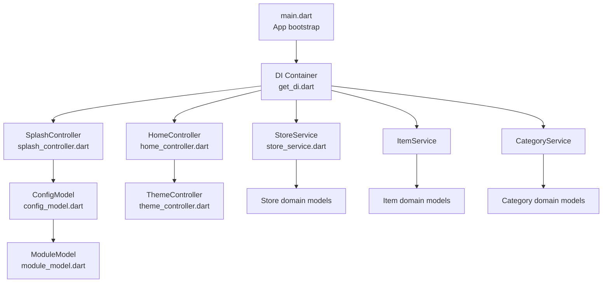
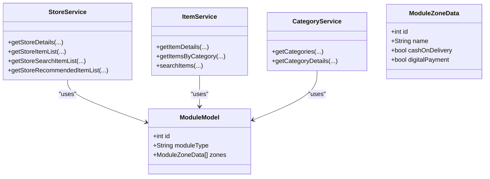
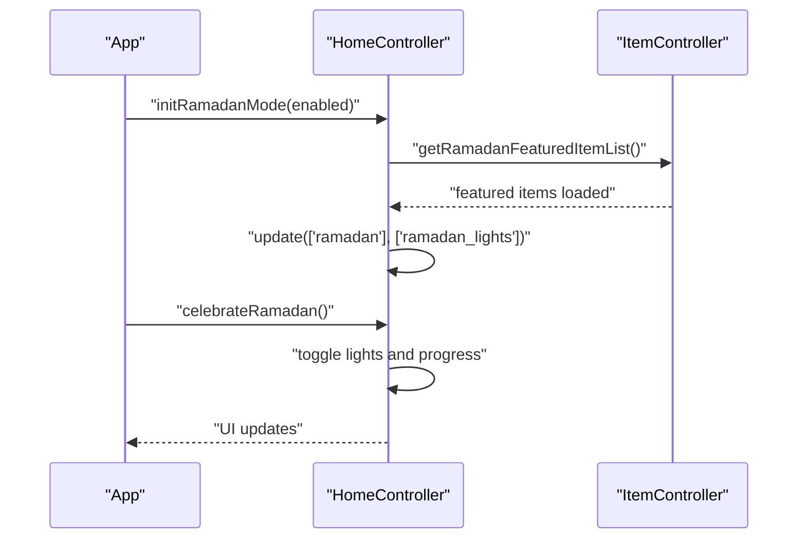
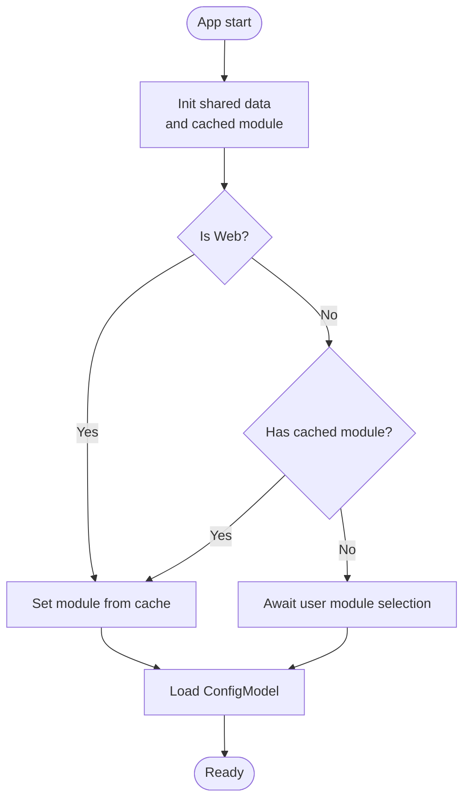
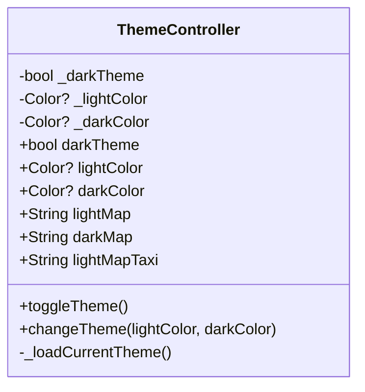
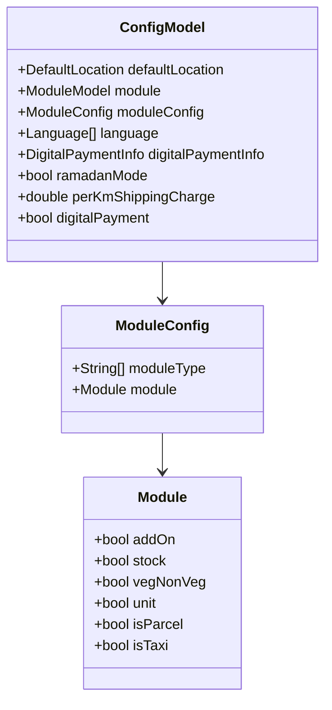
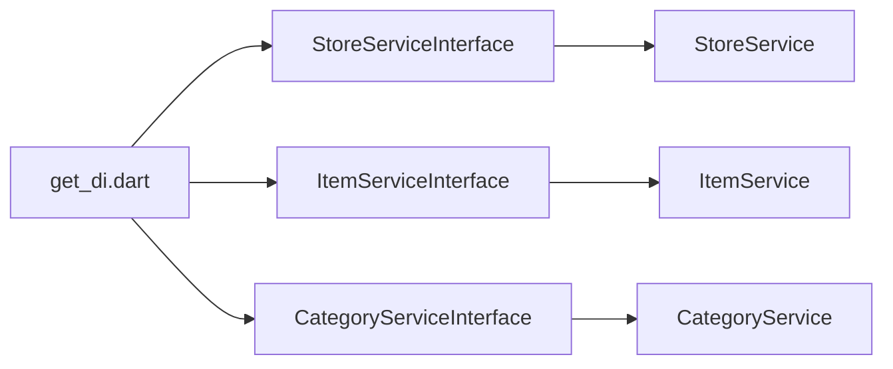
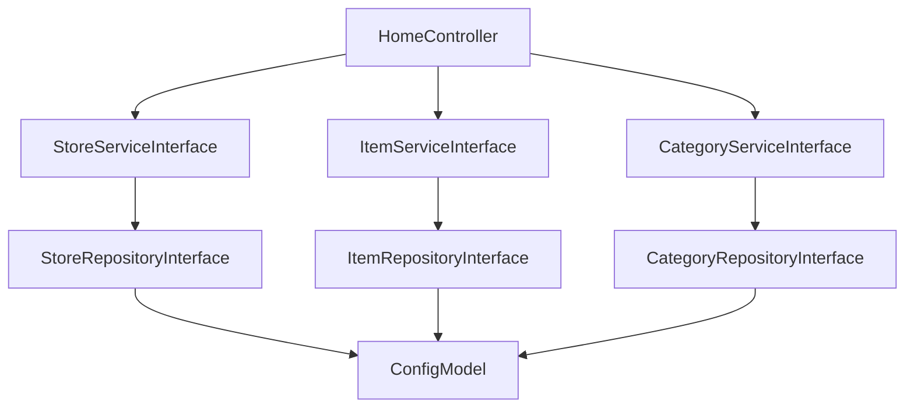

# Shared Infrastructure

<cite>
**Referenced Files in This Document**
- [main.dart](file://lib/main.dart)
- [theme_controller.dart](file://lib/common/controllers/theme_controller.dart)
- [module_model.dart](file://lib/common/models/module_model.dart)
- [config_model.dart](file://lib/common/models/config_model.dart)
- [response_model.dart](file://lib/common/models/response_model.dart)
- [error_response.dart](file://lib/common/models/error_response.dart)
- [home_controller.dart](file://lib/features/home/controllers/home_controller.dart)
- [splash_controller.dart](file://lib/features/splash/controllers/splash_controller.dart)
- [get_di.dart](file://lib/helper/get_di.dart)
- [store_service.dart](file://lib/features/store/domain/services/store_service.dart)
- [module_type.dart](file://lib/helper/module_type.dart)
</cite>

## Table of Contents
1. [Introduction](#introduction)
2. [Project Structure](#project-structure)
3. [Core Components](#core-components)
4. [Architecture Overview](#architecture-overview)
5. [Detailed Component Analysis](#detailed-component-analysis)
6. [Dependency Analysis](#dependency-analysis)
7. [Performance Considerations](#performance-considerations)
8. [Troubleshooting Guide](#troubleshooting-guide)
9. [Conclusion](#conclusion)

## Introduction
This document describes the shared infrastructure that supports all marketplace modules in the application. It focuses on three foundational domains—Store, Item, and Category—and explains how common data models, business logic, and UI components enable module flexibility and consistency across commerce verticals. It also details the home controller’s role in orchestrating module switching, managing shared state, and coordinating cross-module functionality. Implementation specifics for shared services, common utilities, and infrastructure patterns are included, along with architectural decisions that balance module isolation and shared capabilities.

## Project Structure
The shared infrastructure spans several layers:
- Initialization and platform setup in the application entrypoint
- Global configuration and module metadata models
- Cross-cutting controllers for theme and shared state
- DI wiring for services used across modules
- Domain services that abstract repository access for Store, Item, and Category



**Diagram sources**
- [main.dart:35-103](file://lib/main.dart#L35-L103)
- [get_di.dart:560-603](file://lib/helper/get_di.dart#L560-L603)
- [splash_controller.dart:244-275](file://lib/features/splash/controllers/splash_controller.dart#L244-L275)
- [home_controller.dart:1-187](file://lib/features/home/controllers/home_controller.dart#L1-L187)
- [store_service.dart:51-71](file://lib/features/store/domain/services/store_service.dart#L51-L71)
- [config_model.dart:3-800](file://lib/common/models/config_model.dart#L3-L800)
- [module_model.dart:2-106](file://lib/common/models/module_model.dart#L2-L106)
- [theme_controller.dart:6-49](file://lib/common/controllers/theme_controller.dart#L6-L49)

**Section sources**
- [main.dart:35-103](file://lib/main.dart#L35-L103)
- [get_di.dart:560-603](file://lib/helper/get_di.dart#L560-L603)

## Core Components
- Application entrypoint initializes platform-specific configurations, Firebase, notifications, and routes the app into the appropriate startup flow depending on platform and module state.
- DI container wires service interfaces to their implementations, enabling loose coupling and testability across modules.
- Configuration model encapsulates global settings, module metadata, and feature toggles that drive module switching and UI behavior.
- Theme controller manages theme state and persists preferences, ensuring consistent theming across modules.
- Response and error models standardize API responses and error handling across services.

**Section sources**
- [main.dart:35-103](file://lib/main.dart#L35-L103)
- [get_di.dart:560-603](file://lib/helper/get_di.dart#L560-L603)
- [config_model.dart:3-800](file://lib/common/models/config_model.dart#L3-L800)
- [theme_controller.dart:6-49](file://lib/common/controllers/theme_controller.dart#L6-L49)
- [response_model.dart:4-14](file://lib/common/models/response_model.dart#L4-L14)
- [error_response.dart:1-52](file://lib/common/models/error_response.dart#L1-L52)

## Architecture Overview
The shared infrastructure follows a layered architecture:
- Presentation layer: Controllers orchestrate UI state and coordinate with services.
- Domain layer: Services define module-agnostic business operations and delegate persistence to repositories.
- Data layer: Repositories encapsulate data access and caching strategies.
- Shared layer: Models, controllers, and utilities provide cross-module contracts and state.

```mermaid
graph TB
subgraph "Presentation"
HC["HomeController"]
SC["SplashController"]
TC["ThemeController"]
end
subgraph "Domain"
SS["StoreService"]
IS["ItemService"]
CS["CategoryService"]
end
subgraph "Shared Models"
CM["ConfigModel"]
MM["ModuleModel"]
RM["ResponseModel"]
EM["ErrorResponse"]
end
subgraph "DI"
DI["get_di.dart"]
end
DI --> HC
DI --> SC
DI --> TC
DI --> SS
DI --> IS
DI --> CS
HC --> CM
SC --> CM
SS --> CM
IS --> CM
CS --> CM
HC --> TC
SC --> MM
SS --> RM
SS --> EM
```

**Diagram sources**
- [home_controller.dart:1-187](file://lib/features/home/controllers/home_controller.dart#L1-L187)
- [splash_controller.dart:244-275](file://lib/features/splash/controllers/splash_controller.dart#L244-L275)
- [theme_controller.dart:6-49](file://lib/common/controllers/theme_controller.dart#L6-L49)
- [get_di.dart:560-603](file://lib/helper/get_di.dart#L560-L603)
- [config_model.dart:3-800](file://lib/common/models/config_model.dart#L3-L800)
- [module_model.dart:2-106](file://lib/common/models/module_model.dart#L2-L106)
- [response_model.dart:4-14](file://lib/common/models/response_model.dart#L4-L14)
- [error_response.dart:1-52](file://lib/common/models/error_response.dart#L1-L52)

## Detailed Component Analysis

### Store, Item, and Category Modules
These modules share a common pattern:
- Domain services expose module-agnostic operations (e.g., fetching store details, item lists, and recommended items).
- Repositories abstract data access and caching strategies.
- Models define standardized shapes for entities and metadata.



**Diagram sources**
- [store_service.dart:51-71](file://lib/features/store/domain/services/store_service.dart#L51-L71)
- [module_model.dart:2-106](file://lib/common/models/module_model.dart#L2-L106)

**Section sources**
- [store_service.dart:51-71](file://lib/features/store/domain/services/store_service.dart#L51-L71)
- [module_model.dart:2-106](file://lib/common/models/module_model.dart#L2-L106)

### Home Controller Orchestration
The home controller coordinates shared state and cross-module interactions:
- Manages visibility of UI elements (e.g., favorite button, bottom navigation).
- Handles special UI overlays (e.g., Ramadan decorations) and animations.
- Persists and retrieves registration-related flags via shared preferences.
- Coordinates with other controllers (e.g., item controller) for module-specific features.



**Diagram sources**
- [home_controller.dart:42-105](file://lib/features/home/controllers/home_controller.dart#L42-L105)

**Section sources**
- [home_controller.dart:1-187](file://lib/features/home/controllers/home_controller.dart#L1-L187)

### Module Switching and Shared State Management
Module switching is driven by configuration and cached module state:
- Splash controller initializes shared data and determines the current module.
- On web, the module may be preselected and cached; on mobile, multiple modules may be available and require explicit selection.
- Module type mapping defines how module types relate to domain entities (e.g., food maps to item).



**Diagram sources**
- [splash_controller.dart:244-275](file://lib/features/splash/controllers/splash_controller.dart#L244-L275)
- [config_model.dart:3-800](file://lib/common/models/config_model.dart#L3-L800)
- [module_type.dart:1-16](file://lib/helper/module_type.dart#L1-L16)

**Section sources**
- [splash_controller.dart:244-275](file://lib/features/splash/controllers/splash_controller.dart#L244-L275)
- [module_type.dart:1-16](file://lib/helper/module_type.dart#L1-L16)

### Theme Controller and Consistent Theming
The theme controller manages theme state and persists preferences:
- Loads theme assets from bundled resources.
- Toggles theme and updates dependent UI.
- Exposes color and map assets for consistent theming across modules.



**Diagram sources**
- [theme_controller.dart:6-49](file://lib/common/controllers/theme_controller.dart#L6-L49)

**Section sources**
- [theme_controller.dart:6-49](file://lib/common/controllers/theme_controller.dart#L6-L49)

### Configuration Model and Feature Flags
The configuration model centralizes feature flags and module metadata:
- Includes module configuration, base URLs, language settings, policies, and payment options.
- Supports module-specific toggles (e.g., add-ons, stock, unit, veg/non-veg).
- Provides structured access to settings that influence UI and business logic.



**Diagram sources**
- [config_model.dart:3-800](file://lib/common/models/config_model.dart#L3-L800)

**Section sources**
- [config_model.dart:3-800](file://lib/common/models/config_model.dart#L3-L800)

### DI Wiring and Service Contracts
The DI container wires service interfaces to their implementations, enabling module isolation:
- Services like StoreService, ItemService, and CategoryService are registered lazily.
- Controllers depend on interfaces, promoting testability and swapping implementations.



**Diagram sources**
- [get_di.dart:560-603](file://lib/helper/get_di.dart#L560-L603)

**Section sources**
- [get_di.dart:560-603](file://lib/helper/get_di.dart#L560-L603)

## Dependency Analysis
The shared infrastructure exhibits low coupling and high cohesion:
- Controllers depend on interfaces, not concrete implementations.
- Services depend on repositories and configuration models.
- Utilities and helpers (e.g., module type mapping) are small and focused.



**Diagram sources**
- [home_controller.dart:1-187](file://lib/features/home/controllers/home_controller.dart#L1-L187)
- [get_di.dart:560-603](file://lib/helper/get_di.dart#L560-L603)
- [config_model.dart:3-800](file://lib/common/models/config_model.dart#L3-L800)

**Section sources**
- [home_controller.dart:1-187](file://lib/features/home/controllers/home_controller.dart#L1-L187)
- [get_di.dart:560-603](file://lib/helper/get_di.dart#L560-L603)
- [config_model.dart:3-800](file://lib/common/models/config_model.dart#L3-L800)

## Performance Considerations
- Lazy initialization of services reduces startup overhead.
- Shared state updates are scoped to named update triggers to minimize rebuilds.
- Configuration and module metadata are loaded once and reused across controllers.
- Theme assets are loaded once and cached to avoid repeated IO.

## Troubleshooting Guide
Common issues and resolutions:
- Module selection not persisting on mobile: Verify cached module retrieval and set-cache logic in the splash controller.
- Theme not updating across screens: Ensure theme controller update triggers are invoked after toggling theme.
- Feature flags not reflected: Confirm ConfigModel parsing and module configuration mapping.
- Service not found errors: Verify DI registration of service interfaces.

**Section sources**
- [splash_controller.dart:244-275](file://lib/features/splash/controllers/splash_controller.dart#L244-L275)
- [theme_controller.dart:29-39](file://lib/common/controllers/theme_controller.dart#L29-L39)
- [config_model.dart:213-214](file://lib/common/models/config_model.dart#L213-L214)
- [get_di.dart:560-603](file://lib/helper/get_di.dart#L560-L603)

## Conclusion
The shared infrastructure establishes a robust foundation for multi-module commerce applications. By centralizing configuration, enforcing service interfaces, and managing shared state through controllers, the system achieves module isolation while preserving consistency and flexibility. The home controller plays a pivotal role in orchestrating module switching, coordinating cross-module functionality, and maintaining a unified user experience across diverse commerce verticals.