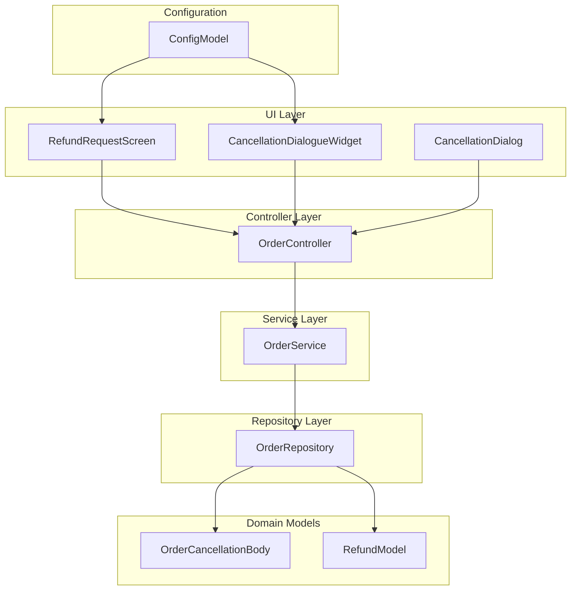
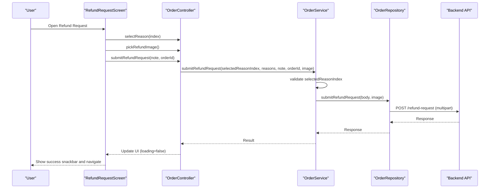
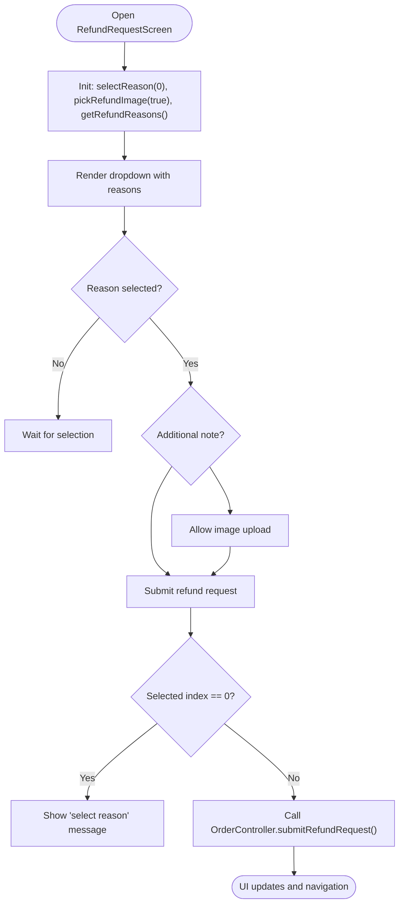
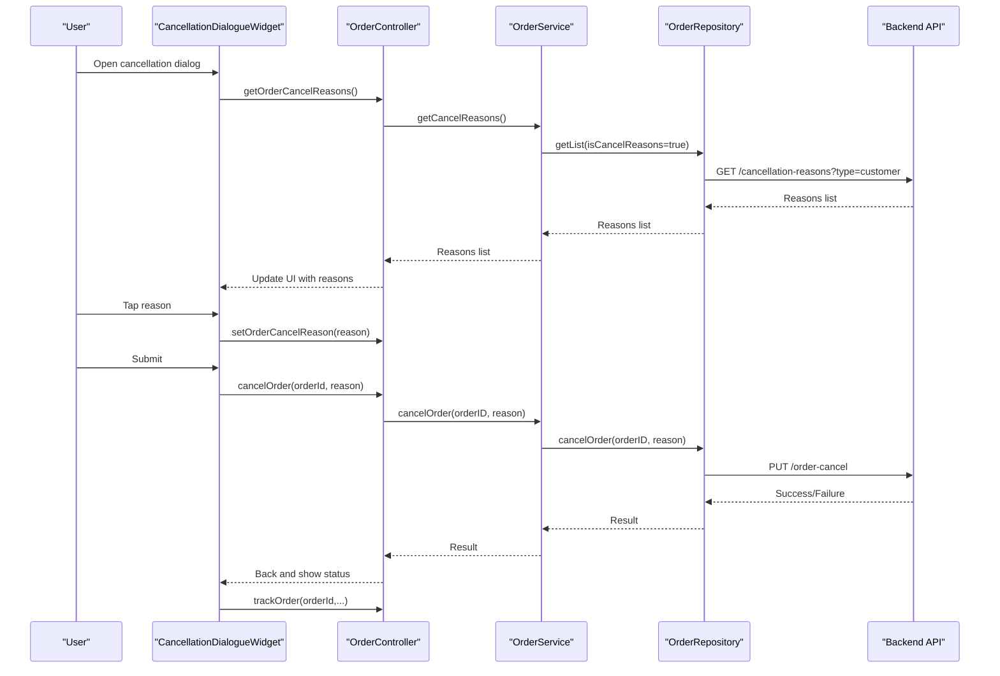
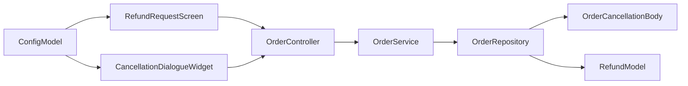
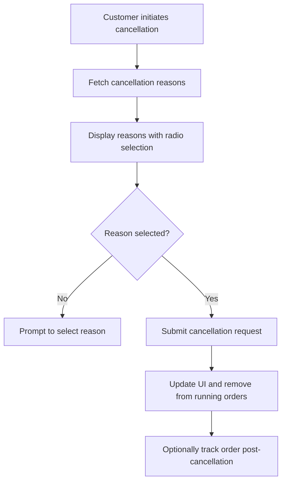

# Order Cancellation and Refund

<cite>
**Referenced Files in This Document**
- [order_cancellation_body.dart](file://lib/features/order/domain/models/order_cancellation_body.dart)
- [refund_model.dart](file://lib/features/order/domain/models/refund_model.dart)
- [refund_request_screen.dart](file://lib/features/order/screens/refund_request_screen.dart)
- [cancellation_dialog.dart](file://lib/common/widgets/cancellation_dialog.dart)
- [cancellation_dialogue_widget.dart](file://lib/features/order/widgets/cancellation_dialogue_widget.dart)
- [order_controller.dart](file://lib/features/order/controllers/order_controller.dart)
- [order_service.dart](file://lib/features/order/domain/services/order_service.dart)
- [order_repository.dart](file://lib/features/order/domain/repositories/order_repository.dart)
- [config_model.dart](file://lib/common/models/config_model.dart)
</cite>

## Table of Contents
1. [Introduction](#introduction)
2. [Project Structure](#project-structure)
3. [Core Components](#core-components)
4. [Architecture Overview](#architecture-overview)
5. [Detailed Component Analysis](#detailed-component-analysis)
6. [Dependency Analysis](#dependency-analysis)
7. [Performance Considerations](#performance-considerations)
8. [Troubleshooting Guide](#troubleshooting-guide)
9. [Conclusion](#conclusion)
10. [Appendices](#appendices)

## Introduction
This document describes the order cancellation and refund processing system. It covers the cancellation workflow (eligibility checks, reason collection, and approval processes), the RefundRequestScreen implementation, refund calculation considerations, refund status tracking, the OrderCancellationBody model, cancellation timeline enforcement, and partial order cancellation scenarios. It also includes examples of cancellation API calls, refund processing workflows, customer communication templates, the cancellation dialogue widget functionality, reason selection interfaces, support escalation paths, refund timing, policy compliance, and dispute resolution mechanisms.

## Project Structure
The cancellation and refund system spans UI screens, widgets, controllers, services, repositories, and domain models. The primary modules involved are:
- Screens: RefundRequestScreen
- Widgets: CancellationDialog, CancellationDialogueWidget
- Controllers: OrderController
- Services: OrderService
- Repositories: OrderRepository
- Domain Models: OrderCancellationBody, RefundModel
- Configuration: ConfigModel (policy flags)

**Diagram sources**
- [refund_request_screen.dart:12-165](file://lib/features/order/screens/refund_request_screen.dart#L12-L165)
- [cancellation_dialog.dart:8-82](file://lib/common/widgets/cancellation_dialog.dart#L8-L82)
- [cancellation_dialogue_widget.dart:9-104](file://lib/features/order/widgets/cancellation_dialogue_widget.dart#L9-L104)
- [order_controller.dart:9-298](file://lib/features/order/controllers/order_controller.dart#L9-L298)
- [order_service.dart:14-154](file://lib/features/order/domain/services/order_service.dart#L14-L154)
- [order_repository.dart:13-156](file://lib/features/order/domain/repositories/order_repository.dart#L13-L156)
- [order_cancellation_body.dart:1-68](file://lib/features/order/domain/models/order_cancellation_body.dart#L1-L68)
- [refund_model.dart:1-52](file://lib/features/order/domain/models/refund_model.dart#L1-L52)
- [config_model.dart:54-56](file://lib/common/models/config_model.dart#L54-L56)

**Section sources**
- [refund_request_screen.dart:12-165](file://lib/features/order/screens/refund_request_screen.dart#L12-L165)
- [cancellation_dialog.dart:8-82](file://lib/common/widgets/cancellation_dialog.dart#L8-L82)
- [cancellation_dialogue_widget.dart:9-104](file://lib/features/order/widgets/cancellation_dialogue_widget.dart#L9-L104)
- [order_controller.dart:9-298](file://lib/features/order/controllers/order_controller.dart#L9-L298)
- [order_service.dart:14-154](file://lib/features/order/domain/services/order_service.dart#L14-L154)
- [order_repository.dart:13-156](file://lib/features/order/domain/repositories/order_repository.dart#L13-L156)
- [order_cancellation_body.dart:1-68](file://lib/features/order/domain/models/order_cancellation_body.dart#L1-L68)
- [refund_model.dart:1-52](file://lib/features/order/domain/models/refund_model.dart#L1-L52)
- [config_model.dart:54-56](file://lib/common/models/config_model.dart#L54-L56)

## Core Components
- OrderCancellationBody: Deserializes cancellation reasons fetched from the backend into a structured list for UI consumption.
- RefundModel: Deserializes refund reasons into a flat list for selection in the refund request screen.
- RefundRequestScreen: Presents reason selection, optional note, and image upload for refund requests.
- CancellationDialogueWidget: Allows customers to select a cancellation reason and submit a cancellation request.
- CancellationDialog: Generic confirmation dialog used during cancellation actions.
- OrderController: Orchestrates fetching reasons, selecting options, uploading evidence, and invoking service methods.
- OrderService: Implements business logic for refund submission (validation, payload assembly), cancellation, and tracking.
- OrderRepository: Handles HTTP calls to backend endpoints for cancellation, refund reasons, and order tracking.
- ConfigModel: Provides policy flags (refundActiveStatus, refundPolicyStatus, cancellationPolicyStatus) that enable/disable and configure policies.

**Section sources**
- [order_cancellation_body.dart:1-68](file://lib/features/order/domain/models/order_cancellation_body.dart#L1-L68)
- [refund_model.dart:1-52](file://lib/features/order/domain/models/refund_model.dart#L1-L52)
- [refund_request_screen.dart:12-165](file://lib/features/order/screens/refund_request_screen.dart#L12-L165)
- [cancellation_dialogue_widget.dart:9-104](file://lib/features/order/widgets/cancellation_dialogue_widget.dart#L9-L104)
- [cancellation_dialog.dart:8-82](file://lib/common/widgets/cancellation_dialog.dart#L8-L82)
- [order_controller.dart:9-298](file://lib/features/order/controllers/order_controller.dart#L9-L298)
- [order_service.dart:14-154](file://lib/features/order/domain/services/order_service.dart#L14-L154)
- [order_repository.dart:13-156](file://lib/features/order/domain/repositories/order_repository.dart#L13-L156)
- [config_model.dart:54-56](file://lib/common/models/config_model.dart#L54-L56)

## Architecture Overview
The system follows a layered architecture:
- UI Layer: Screens and widgets trigger actions.
- Controller Layer: State and orchestration logic.
- Service Layer: Business logic and validation.
- Repository Layer: Network calls and data mapping.
- Domain Models: Strong typing for cancellation and refund reasons.
- Configuration: Policy flags controlling visibility and behavior.

**Diagram sources**
- [refund_request_screen.dart:20-165](file://lib/features/order/screens/refund_request_screen.dart#L20-L165)
- [order_controller.dart:86-133](file://lib/features/order/controllers/order_controller.dart#L86-L133)
- [order_service.dart:49-66](file://lib/features/order/domain/services/order_service.dart#L49-L66)
- [order_repository.dart:17-20](file://lib/features/order/domain/repositories/order_repository.dart#L17-L20)

**Section sources**
- [refund_request_screen.dart:20-165](file://lib/features/order/screens/refund_request_screen.dart#L20-L165)
- [order_controller.dart:86-133](file://lib/features/order/controllers/order_controller.dart#L86-L133)
- [order_service.dart:49-66](file://lib/features/order/domain/services/order_service.dart#L49-L66)
- [order_repository.dart:17-20](file://lib/features/order/domain/repositories/order_repository.dart#L17-L20)

## Detailed Component Analysis

### RefundRequestScreen
Responsibilities:
- Loads refund reasons via OrderController.
- Presents a dropdown for reason selection.
- Optionally collects a note and an image attachment.
- Submits the refund request with validation.

Key behaviors:
- Initializes reason selection and image picking on load.
- Validates that a reason is selected before submission.
- Uses OrderController to submit refund request and handle loading state.

**Diagram sources**
- [refund_request_screen.dart:20-165](file://lib/features/order/screens/refund_request_screen.dart#L20-L165)
- [order_controller.dart:120-133](file://lib/features/order/controllers/order_controller.dart#L120-L133)
- [order_service.dart:49-66](file://lib/features/order/domain/services/order_service.dart#L49-L66)

**Section sources**
- [refund_request_screen.dart:20-165](file://lib/features/order/screens/refund_request_screen.dart#L20-L165)
- [order_controller.dart:120-133](file://lib/features/order/controllers/order_controller.dart#L120-L133)
- [order_service.dart:49-66](file://lib/features/order/domain/services/order_service.dart#L49-L66)

### CancellationDialogueWidget
Responsibilities:
- Fetches cancellation reasons from the backend.
- Presents a selectable list of reasons with radio buttons.
- Submits cancellation with validation and triggers order tracking.

Key behaviors:
- Ensures a reason is selected before proceeding.
- Calls OrderController.cancelOrder and then tracks the order.

**Diagram sources**
- [cancellation_dialogue_widget.dart:16-101](file://lib/features/order/widgets/cancellation_dialogue_widget.dart#L16-L101)
- [order_controller.dart:113-118](file://lib/features/order/controllers/order_controller.dart#L113-L118)
- [order_controller.dart:246-262](file://lib/features/order/controllers/order_controller.dart#L246-L262)
- [order_service.dart:39-47](file://lib/features/order/domain/services/order_service.dart#L39-L47)
- [order_service.dart:73-76](file://lib/features/order/domain/services/order_service.dart#L73-L76)
- [order_repository.dart:106-117](file://lib/features/order/domain/repositories/order_repository.dart#L106-L117)
- [order_repository.dart:46-56](file://lib/features/order/domain/repositories/order_repository.dart#L46-L56)

**Section sources**
- [cancellation_dialogue_widget.dart:16-101](file://lib/features/order/widgets/cancellation_dialogue_widget.dart#L16-L101)
- [order_controller.dart:113-118](file://lib/features/order/controllers/order_controller.dart#L113-L118)
- [order_controller.dart:246-262](file://lib/features/order/controllers/order_controller.dart#L246-L262)
- [order_service.dart:39-47](file://lib/features/order/domain/services/order_service.dart#L39-L47)
- [order_service.dart:73-76](file://lib/features/order/domain/services/order_service.dart#L73-L76)
- [order_repository.dart:106-117](file://lib/features/order/domain/repositories/order_repository.dart#L106-L117)
- [order_repository.dart:46-56](file://lib/features/order/domain/repositories/order_repository.dart#L46-L56)

### OrderController
Responsibilities:
- Manages UI state for refund reasons, selected index, and uploaded image.
- Fetches cancellation and refund reasons.
- Submits refund requests and cancellation requests.
- Tracks orders after cancellation.

Key behaviors:
- selectReason updates the selected reason index.
- pickRefundImage handles gallery selection and removal.
- submitRefundRequest toggles loading and delegates to service.
- cancelOrder toggles loading, calls service, updates UI, and removes order from running list.

**Section sources**
- [order_controller.dart:86-133](file://lib/features/order/controllers/order_controller.dart#L86-L133)
- [order_controller.dart:113-118](file://lib/features/order/controllers/order_controller.dart#L113-L118)
- [order_controller.dart:246-262](file://lib/features/order/controllers/order_controller.dart#L246-L262)

### OrderService
Responsibilities:
- Validates refund reason selection.
- Builds refund request payload and invokes repository.
- Handles cancellation and order tracking.
- Navigates on successful refund submission.

Key behaviors:
- Enforces that a reason is selected before submitting.
- Assembles body with customer reason, order ID, and note.
- On success, shows a success snackbar and navigates to initial route.

**Section sources**
- [order_service.dart:49-66](file://lib/features/order/domain/services/order_service.dart#L49-L66)
- [order_service.dart:73-76](file://lib/features/order/domain/services/order_service.dart#L73-L76)

### OrderRepository
Responsibilities:
- Performs HTTP requests for refund reasons, cancellation, and order tracking.
- Maps JSON responses to domain models.

Key behaviors:
- submitRefundRequest posts multipart data to the refund endpoint.
- cancelOrder sends a PUT request to cancel an order.
- getRefundReasons returns a flattened list with a default placeholder at index 0.
- getCancelReasons returns structured reasons mapped from OrderCancellationBody.

**Section sources**
- [order_repository.dart:17-20](file://lib/features/order/domain/repositories/order_repository.dart#L17-L20)
- [order_repository.dart:46-56](file://lib/features/order/domain/repositories/order_repository.dart#L46-L56)
- [order_repository.dart:119-131](file://lib/features/order/domain/repositories/order_repository.dart#L119-L131)
- [order_repository.dart:106-117](file://lib/features/order/domain/repositories/order_repository.dart#L106-L117)

### Domain Models
- OrderCancellationBody: Holds pagination fields and a list of CancellationData entries.
- CancellationData: Represents a single cancellation reason entry.
- RefundModel: Holds a list of RefundReasons.
- RefundReasons: Represents a single refund reason entry.

These models are used to parse backend responses for cancellation and refund reasons.

**Section sources**
- [order_cancellation_body.dart:1-68](file://lib/features/order/domain/models/order_cancellation_body.dart#L1-L68)
- [refund_model.dart:1-52](file://lib/features/order/domain/models/refund_model.dart#L1-L52)

### Configuration Flags
ConfigModel exposes policy flags that influence cancellation and refund behavior:
- refundActiveStatus: Enables/disables refund functionality.
- refundPolicyStatus: Controls visibility of refund policy.
- cancellationPolicyStatus: Controls visibility of cancellation policy.

These flags can gate UI elements and flows.

**Section sources**
- [config_model.dart:54-56](file://lib/common/models/config_model.dart#L54-L56)

## Dependency Analysis
The cancellation and refund system exhibits clear separation of concerns across layers. The UI depends on the controller, which depends on the service, which depends on the repository, which performs network operations and maps to domain models.

**Diagram sources**
- [refund_request_screen.dart:12-165](file://lib/features/order/screens/refund_request_screen.dart#L12-L165)
- [cancellation_dialogue_widget.dart:9-104](file://lib/features/order/widgets/cancellation_dialogue_widget.dart#L9-L104)
- [order_controller.dart:9-298](file://lib/features/order/controllers/order_controller.dart#L9-L298)
- [order_service.dart:14-154](file://lib/features/order/domain/services/order_service.dart#L14-L154)
- [order_repository.dart:13-156](file://lib/features/order/domain/repositories/order_repository.dart#L13-L156)
- [order_cancellation_body.dart:1-68](file://lib/features/order/domain/models/order_cancellation_body.dart#L1-L68)
- [refund_model.dart:1-52](file://lib/features/order/domain/models/refund_model.dart#L1-L52)
- [config_model.dart:54-56](file://lib/common/models/config_model.dart#L54-L56)

**Section sources**
- [order_controller.dart:9-298](file://lib/features/order/controllers/order_controller.dart#L9-L298)
- [order_service.dart:14-154](file://lib/features/order/domain/services/order_service.dart#L14-L154)
- [order_repository.dart:13-156](file://lib/features/order/domain/repositories/order_repository.dart#L13-L156)

## Performance Considerations
- Minimize unnecessary re-fetches: Use cached lists where appropriate (e.g., reasons) and avoid redundant network calls.
- Debounce UI updates: Batch state updates in controllers to reduce rebuilds.
- Lazy loading: Load refund reasons only when the refund screen is opened.
- Image handling: Limit image size and defer uploads until submission to reduce memory overhead.
- Pagination: Utilize offset/limit patterns for long lists to keep UI responsive.

## Troubleshooting Guide
Common issues and resolutions:
- No reasons loaded: Ensure getOrderCancelReasons and getRefundReasons are invoked on screen init.
- Submission fails silently: Verify selectedReasonIndex is not zero before submission.
- Image upload errors: Confirm image picker permissions and file type compatibility.
- Cancellation not reflected: Check that cancelOrder returns success and that the running order list is updated accordingly.
- Policy visibility: Confirm ConfigModel flags (refundActiveStatus, refundPolicyStatus, cancellationPolicyStatus) are set appropriately.

**Section sources**
- [order_controller.dart:113-118](file://lib/features/order/controllers/order_controller.dart#L113-L118)
- [order_controller.dart:120-125](file://lib/features/order/controllers/order_controller.dart#L120-L125)
- [order_service.dart:49-66](file://lib/features/order/domain/services/order_service.dart#L49-L66)
- [order_repository.dart:46-56](file://lib/features/order/domain/repositories/order_repository.dart#L46-L56)
- [config_model.dart:54-56](file://lib/common/models/config_model.dart#L54-L56)

## Conclusion
The cancellation and refund system is modular and layered, enabling clear separation of concerns. The UI components delegate to the controller, which coordinates with the service and repository layers. Domain models ensure robust parsing of backend responses. Configuration flags provide policy-driven control. The current implementation focuses on user-facing flows for reason selection, evidence upload, and submission, with backend endpoints supporting cancellation and refund reasons retrieval and submission.

## Appendices

### Cancellation Workflow Overview

**Diagram sources**
- [cancellation_dialogue_widget.dart:16-101](file://lib/features/order/widgets/cancellation_dialogue_widget.dart#L16-L101)
- [order_controller.dart:246-262](file://lib/features/order/controllers/order_controller.dart#L246-L262)

### Refund Calculation and Status Tracking
- Calculation: The current implementation aggregates refund reasons and submits a customer-selected reason along with optional note and image. There is no explicit monetary calculation logic in the provided files.
- Status tracking: After successful refund submission, the UI shows a success message and navigates to the initial route. Order tracking remains available via the existing trackOrder mechanism.

**Section sources**
- [order_service.dart:49-66](file://lib/features/order/domain/services/order_service.dart#L49-L66)
- [order_controller.dart:200-227](file://lib/features/order/controllers/order_controller.dart#L200-L227)

### Partial Order Cancellation Scenarios
- The provided code does not implement partial cancellation logic. If partial cancellations are required, extend the cancellation flow to accept item-level selections and adjust the backend contract accordingly.

[No sources needed since this section provides conceptual guidance]

### Customer Communication Templates
- General template ideas:
  - Confirmation: "We have received your refund request for order [ID]. Reason: [Selected reason]. We will review and respond shortly."
  - Approval: "Your refund request has been approved. A refund of [Amount] will be processed to your original payment method within [Timeframe]."
  - Decline: "Your refund request was declined. Reason: [Decline reason]. You may contact support for further assistance."
  - Support escalation: "Escalation requested. A support agent will review your case and contact you within [Timeframe]."

[No sources needed since this section provides conceptual guidance]

### Dispute Resolution Mechanisms
- Escalation path: Use the support reasons list to collect escalation notes and route disputes to support teams.
- Evidence handling: Allow image uploads to accompany dispute submissions.

**Section sources**
- [order_repository.dart:133-144](file://lib/features/order/domain/repositories/order_repository.dart#L133-L144)