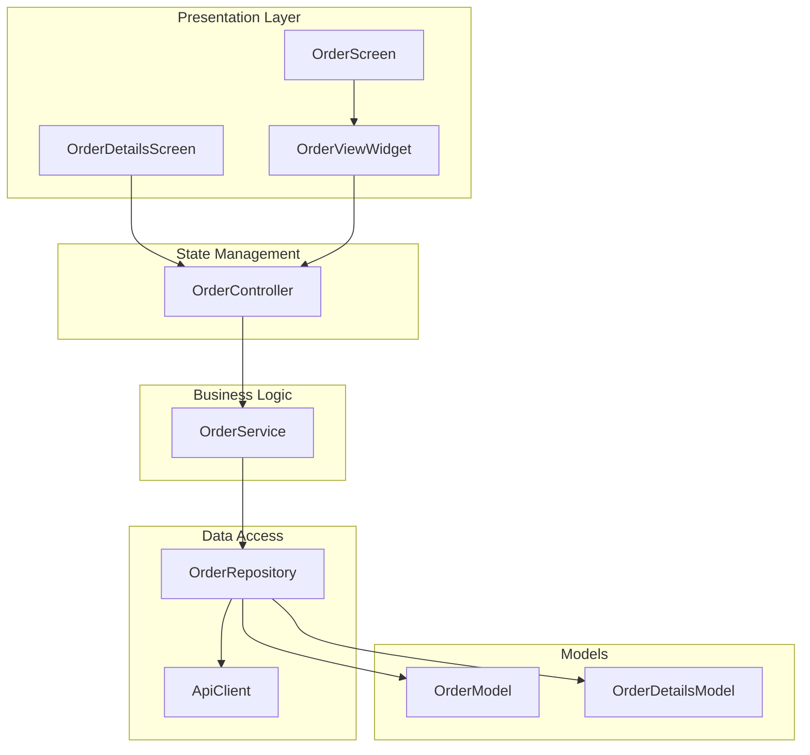
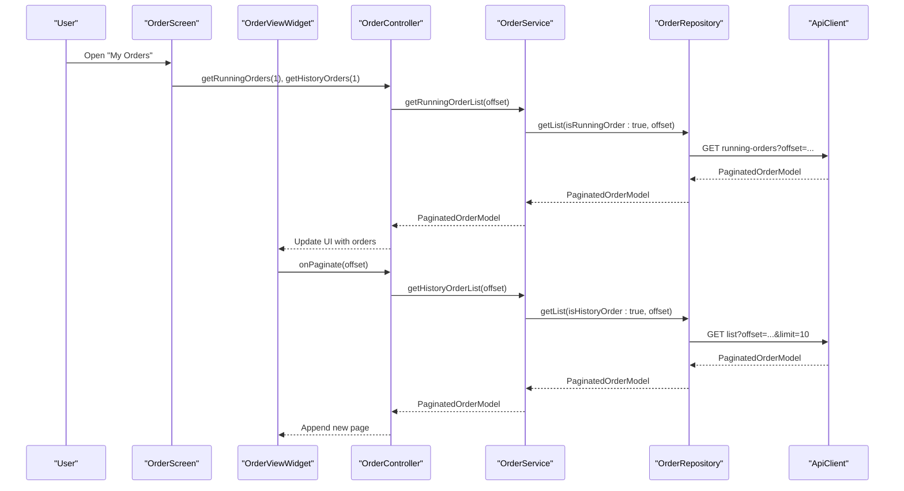
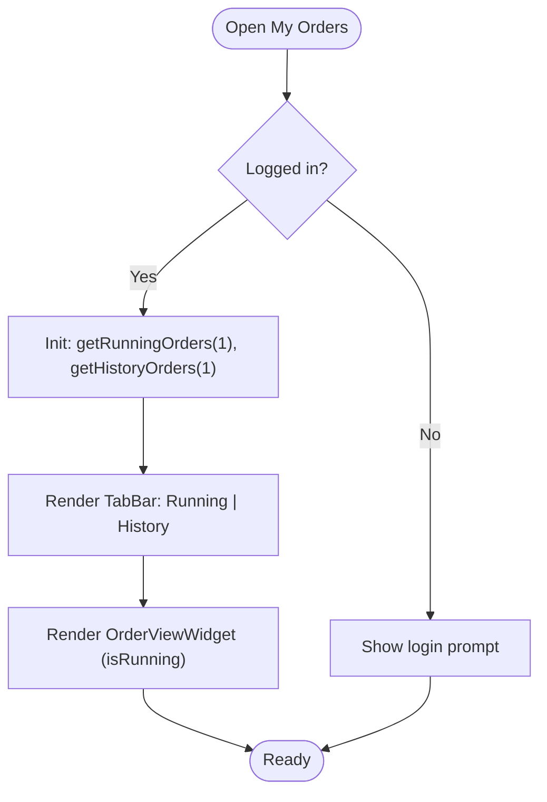
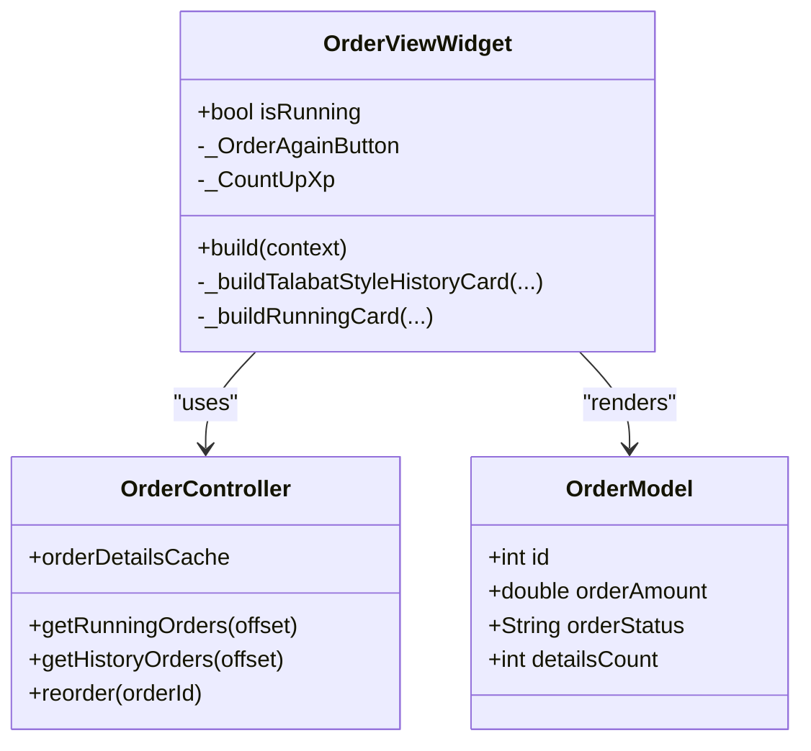
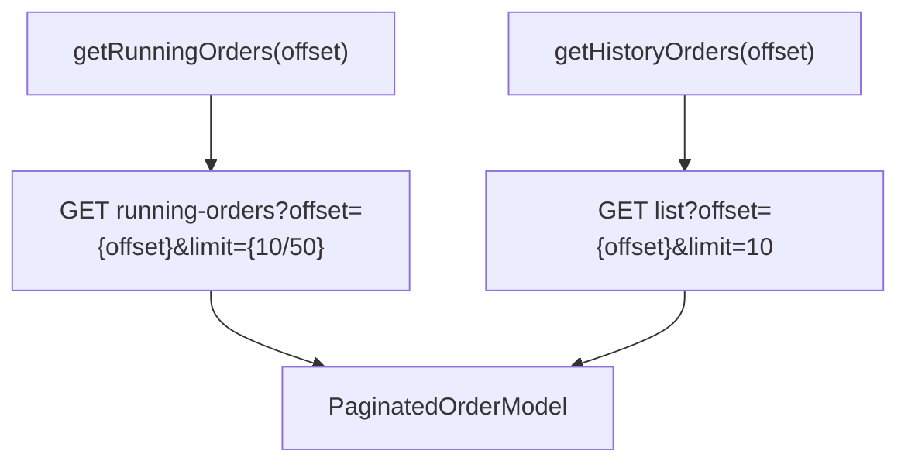
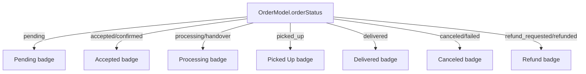
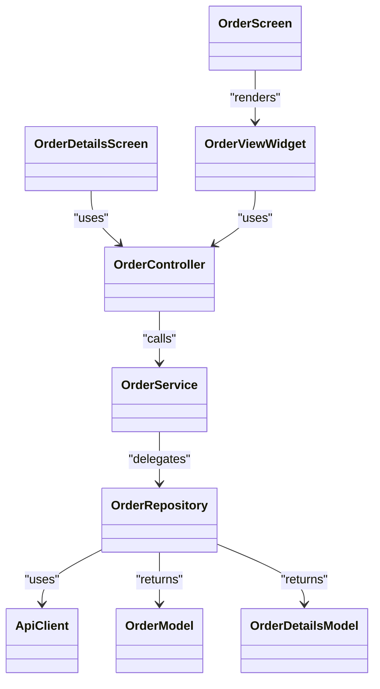

# Order History

<cite>
**Referenced Files in This Document**
- [order_screen.dart](file://lib/features/order/screens/order_screen.dart)
- [order_details_screen.dart](file://lib/features/order/screens/order_details_screen.dart)
- [order_view_widget.dart](file://lib/features/order/widgets/order_view_widget.dart)
- [order_controller.dart](file://lib/features/order/controllers/order_controller.dart)
- [order_model.dart](file://lib/features/order/domain/models/order_model.dart)
- [order_details_model.dart](file://lib/features/order/domain/models/order_details_model.dart)
- [order_repository.dart](file://lib/features/order/domain/repositories/order_repository.dart)
- [order_service.dart](file://lib/features/order/domain/services/order_service.dart)
- [app_constants.dart](file://lib/util/app_constants.dart)
- [order_security_helper.dart](file://lib/helper/order_security_helper.dart)
</cite>

## Table of Contents
1. [Introduction](#introduction)
2. [Project Structure](#project-structure)
3. [Core Components](#core-components)
4. [Architecture Overview](#architecture-overview)
5. [Detailed Component Analysis](#detailed-component-analysis)
6. [Dependency Analysis](#dependency-analysis)
7. [Performance Considerations](#performance-considerations)
8. [Troubleshooting Guide](#troubleshooting-guide)
9. [Conclusion](#conclusion)

## Introduction
This document describes the order history management system, focusing on:
- Order listing, filtering, and pagination
- Order details display, item breakdown, and transaction history
- Order status categorization, search functionality, and sorting options
- Examples of order retrieval APIs, historical data management, and archival processes
- Order view widgets, status indicators, and action buttons for repeat orders, reordering, and support requests
- Data privacy, retention policies, and user access controls

## Project Structure
The order history feature is implemented using a layered architecture:
- Screens: entry points for order listing and details
- Widgets: reusable UI components for order cards and actions
- Controllers: state management and orchestration
- Services: business logic and API coordination
- Repositories: network layer abstraction
- Models: typed data structures for orders and details
- Constants: API endpoints and configuration



**Diagram sources**
- [order_screen.dart:15-194](file://lib/features/order/screens/order_screen.dart#L15-L194)
- [order_details_screen.dart:46-110](file://lib/features/order/screens/order_details_screen.dart#L46-L110)
- [order_view_widget.dart:26-277](file://lib/features/order/widgets/order_view_widget.dart#L26-L277)
- [order_controller.dart:9-298](file://lib/features/order/controllers/order_controller.dart#L9-L298)
- [order_service.dart:14-154](file://lib/features/order/domain/services/order_service.dart#L14-L154)
- [order_repository.dart:13-156](file://lib/features/order/domain/repositories/order_repository.dart#L13-L156)
- [order_model.dart:41-388](file://lib/features/order/domain/models/order_model.dart#L41-L388)
- [order_details_model.dart:3-141](file://lib/features/order/domain/models/order_details_model.dart#L3-L141)

**Section sources**
- [order_screen.dart:15-194](file://lib/features/order/screens/order_screen.dart#L15-L194)
- [order_view_widget.dart:26-277](file://lib/features/order/widgets/order_view_widget.dart#L26-L277)
- [order_controller.dart:9-298](file://lib/features/order/controllers/order_controller.dart#L9-L298)
- [order_service.dart:14-154](file://lib/features/order/domain/services/order_service.dart#L14-L154)
- [order_repository.dart:13-156](file://lib/features/order/domain/repositories/order_repository.dart#L13-L156)
- [order_model.dart:41-388](file://lib/features/order/domain/models/order_model.dart#L41-L388)
- [order_details_model.dart:3-141](file://lib/features/order/domain/models/order_details_model.dart#L3-L141)

## Core Components
- OrderScreen: Hosts tabbed views for running and history lists, initializes order fetching, and handles guest/logged-in states.
- OrderViewWidget: Renders paginated order cards with status indicators, item previews, totals, and action buttons (track, reorder).
- OrderController: Manages order lists, details, tracking, and actions (reorder, cancel, support reasons).
- OrderService: Encapsulates service-level logic and delegates to repositories.
- OrderRepository: Implements API calls for order lists, details, cancellations, reorders, and reasons.
- Models: Strongly typed models for orders and order details.

Key capabilities:
- Fetch running and historical orders with pagination
- Display order details and item breakdown
- Reorder items with visual feedback and XP rewards
- Track orders via SSE or polling
- Manage support reasons and cancellation/refund reasons

**Section sources**
- [order_screen.dart:23-106](file://lib/features/order/screens/order_screen.dart#L23-L106)
- [order_view_widget.dart:26-277](file://lib/features/order/widgets/order_view_widget.dart#L26-L277)
- [order_controller.dart:135-298](file://lib/features/order/controllers/order_controller.dart#L135-L298)
- [order_service.dart:14-154](file://lib/features/order/domain/services/order_service.dart#L14-L154)
- [order_repository.dart:73-156](file://lib/features/order/domain/repositories/order_repository.dart#L73-L156)
- [order_model.dart:41-388](file://lib/features/order/domain/models/order_model.dart#L41-L388)
- [order_details_model.dart:3-141](file://lib/features/order/domain/models/order_details_model.dart#L3-L141)

## Architecture Overview
The system follows a clean architecture pattern:
- Presentation: Screens and widgets
- Domain: Models and interfaces
- Application: Controller orchestrates business rules
- Infrastructure: Repository implements API calls



**Diagram sources**
- [order_screen.dart:41-51](file://lib/features/order/screens/order_screen.dart#L41-L51)
- [order_view_widget.dart:219-233](file://lib/features/order/widgets/order_view_widget.dart#L219-L233)
- [order_controller.dart:135-173](file://lib/features/order/controllers/order_controller.dart#L135-L173)
- [order_service.dart:19-27](file://lib/features/order/domain/services/order_service.dart#L19-L27)
- [order_repository.dart:74-86](file://lib/features/order/domain/repositories/order_repository.dart#L74-L86)
- [app_constants.dart:55-57](file://lib/util/app_constants.dart#L55-L57)

**Section sources**
- [order_screen.dart:41-51](file://lib/features/order/screens/order_screen.dart#L41-L51)
- [order_view_widget.dart:219-233](file://lib/features/order/widgets/order_view_widget.dart#L219-L233)
- [order_controller.dart:135-173](file://lib/features/order/controllers/order_controller.dart#L135-L173)
- [order_service.dart:19-27](file://lib/features/order/domain/services/order_service.dart#L19-L27)
- [order_repository.dart:74-86](file://lib/features/order/domain/repositories/order_repository.dart#L74-L86)
- [app_constants.dart:55-57](file://lib/util/app_constants.dart#L55-L57)

## Detailed Component Analysis

### OrderScreen: Tabs, Initialization, and Access Control
- Hosts two tabs: Running and History
- Initializes order fetching for logged-in users
- Handles guest mode and navigation to drawer menu
- Integrates with taxi module selection on mobile



**Diagram sources**
- [order_screen.dart:41-51](file://lib/features/order/screens/order_screen.dart#L41-L51)
- [order_screen.dart:78-93](file://lib/features/order/screens/order_screen.dart#L78-L93)

**Section sources**
- [order_screen.dart:23-106](file://lib/features/order/screens/order_screen.dart#L23-L106)

### OrderViewWidget: Listing, Pagination, and Actions
- Displays orders in a paginated list with refresh support
- Renders history cards with memory-trigger item previews and XP badges
- Provides “Order Again” button with micro-interactions and optional XP toast
- Shows status badges with icons and colors
- Includes “Track Order” CTA and item counts



**Diagram sources**
- [order_view_widget.dart:26-277](file://lib/features/order/widgets/order_view_widget.dart#L26-L277)
- [order_view_widget.dart:283-782](file://lib/features/order/widgets/order_view_widget.dart#L283-L782)
- [order_view_widget.dart:1280-1494](file://lib/features/order/widgets/order_view_widget.dart#L1280-L1494)
- [order_controller.dart:135-178](file://lib/features/order/controllers/order_controller.dart#L135-L178)
- [order_model.dart:41-106](file://lib/features/order/domain/models/order_model.dart#L41-L106)

**Section sources**
- [order_view_widget.dart:163-277](file://lib/features/order/widgets/order_view_widget.dart#L163-L277)
- [order_view_widget.dart:283-782](file://lib/features/order/widgets/order_view_widget.dart#L283-L782)
- [order_view_widget.dart:1280-1494](file://lib/features/order/widgets/order_view_widget.dart#L1280-L1494)

### OrderDetailsScreen: Real-Time Tracking and Transaction History
- Loads order details and tracking data
- Supports SSE-based real-time updates with fallback to polling
- Displays order information, item breakdown, and transaction history
- Provides actions for reorder, cancellation, and support

```mermaid
sequenceDiagram
participant User as "User"
participant Details as "OrderDetailsScreen"
participant Controller as "OrderController"
participant Service as "OrderService"
participant Repo as "OrderRepository"
participant API as "ApiClient"
User->>Details : Open order details
Details->>Controller : getOrderDetails(orderId)
Controller->>Service : getOrderDetails(orderId)
Service->>Repo : get(orderId)
Repo->>API : GET order/details?order_id=...
API-->>Repo : List<OrderDetailsModel>
Repo-->>Service : List<OrderDetailsModel>
Service-->>Controller : List<OrderDetailsModel>
Controller-->>Details : Update UI
Details->>Controller : trackOrder(orderId)
Controller->>Service : trackOrder(orderId)
Service->>Repo : trackOrder(orderId)
Repo->>API : GET order/track?order_id=...
API-->>Repo : OrderModel
Repo-->>Service : OrderModel
Service-->>Controller : OrderModel
Controller-->>Details : Update tracking UI
Note over Details,Controller : SSE stream or polling updates
```

**Diagram sources**
- [order_details_screen.dart:83-110](file://lib/features/order/screens/order_details_screen.dart#L83-L110)
- [order_details_screen.dart:134-198](file://lib/features/order/screens/order_details_screen.dart#L134-L198)
- [order_details_screen.dart:302-343](file://lib/features/order/screens/order_details_screen.dart#L302-L343)
- [order_controller.dart:180-245](file://lib/features/order/controllers/order_controller.dart#L180-L245)
- [order_service.dart:35-71](file://lib/features/order/domain/services/order_service.dart#L35-L71)
- [order_repository.dart:63-71](file://lib/features/order/domain/repositories/order_repository.dart#L63-L71)
- [app_constants.dart](file://lib/util/app_constants.dart#L29)

**Section sources**
- [order_details_screen.dart:83-110](file://lib/features/order/screens/order_details_screen.dart#L83-L110)
- [order_details_screen.dart:134-198](file://lib/features/order/screens/order_details_screen.dart#L134-L198)
- [order_details_screen.dart:302-343](file://lib/features/order/screens/order_details_screen.dart#L302-L343)
- [order_controller.dart:180-245](file://lib/features/order/controllers/order_controller.dart#L180-L245)
- [order_service.dart:35-71](file://lib/features/order/domain/services/order_service.dart#L35-L71)
- [order_repository.dart:63-71](file://lib/features/order/domain/repositories/order_repository.dart#L63-L71)
- [app_constants.dart](file://lib/util/app_constants.dart#L29)

### Order Retrieval APIs and Pagination
- Running orders endpoint supports dashboard-specific limits
- Historical orders endpoint uses fixed limit per page
- Pagination uses offset-based queries



**Diagram sources**
- [order_controller.dart:135-173](file://lib/features/order/controllers/order_controller.dart#L135-L173)
- [order_repository.dart:88-104](file://lib/features/order/domain/repositories/order_repository.dart#L88-L104)
- [app_constants.dart:55-57](file://lib/util/app_constants.dart#L55-L57)

**Section sources**
- [order_controller.dart:135-173](file://lib/features/order/controllers/order_controller.dart#L135-L173)
- [order_repository.dart:88-104](file://lib/features/order/domain/repositories/order_repository.dart#L88-L104)
- [app_constants.dart:55-57](file://lib/util/app_constants.dart#L55-L57)

### Order Status Categorization and Indicators
- Status values include pending, accepted, confirmed, processing, handover, picked_up, delivered, canceled, failed, refund_requested, refunded
- UI displays status badges with icons and colors
- ETA chips and time-ago helpers enhance readability



**Diagram sources**
- [order_view_widget.dart:67-115](file://lib/features/order/widgets/order_view_widget.dart#L67-L115)
- [order_model.dart:48-70](file://lib/features/order/domain/models/order_model.dart#L48-L70)

**Section sources**
- [order_view_widget.dart:67-115](file://lib/features/order/widgets/order_view_widget.dart#L67-L115)
- [order_model.dart:48-70](file://lib/features/order/domain/models/order_model.dart#L48-L70)

### Search and Sorting Options
- The order history does not implement client-side search or sorting within the provided files
- Sorting and debounced search are present in other modules (e.g., search), but not in the order history screens

**Section sources**
- [order_screen.dart:23-106](file://lib/features/order/screens/order_screen.dart#L23-L106)
- [order_view_widget.dart:26-277](file://lib/features/order/widgets/order_view_widget.dart#L26-L277)

### Historical Data Management and Archival Processes
- Historical orders are fetched via a dedicated endpoint with fixed limit
- Pagination is handled by offset; no explicit archival or pruning logic is shown in the order domain

**Section sources**
- [order_repository.dart:97-104](file://lib/features/order/domain/repositories/order_repository.dart#L97-L104)
- [app_constants.dart](file://lib/util/app_constants.dart#L57)

### Order View Widgets, Status Indicators, and Action Buttons
- History card: memory-trigger preview, item count, total price, XP badge, “Order Again”, “Rate Your Order”, and “View Details”
- Running card: status bar, ETA chip, item images, store info, total, and “Track Order”
- Action buttons: reorder with micro-interactions, XP toast, and navigation to cart

**Section sources**
- [order_view_widget.dart:283-782](file://lib/features/order/widgets/order_view_widget.dart#L283-L782)
- [order_view_widget.dart:787-1152](file://lib/features/order/widgets/order_view_widget.dart#L787-L1152)
- [order_view_widget.dart:1280-1494](file://lib/features/order/widgets/order_view_widget.dart#L1280-L1494)

### Data Privacy, Retention Policies, and Access Controls
- Access control: OrderScreen checks authentication and shows a prompt for guests
- Security helper exists for order placement (rate limiting, idempotency keys, signatures), but the order history screens do not expose these mechanisms directly
- No explicit retention policy is defined in the order domain; historical data is retrieved via API

**Section sources**
- [order_screen.dart:94-99](file://lib/features/order/screens/order_screen.dart#L94-L99)
- [order_security_helper.dart:12-67](file://lib/helper/order_security_helper.dart#L12-L67)

## Dependency Analysis


**Diagram sources**
- [order_screen.dart:64-103](file://lib/features/order/screens/order_screen.dart#L64-L103)
- [order_view_widget.dart:169-277](file://lib/features/order/widgets/order_view_widget.dart#L169-L277)
- [order_details_screen.dart:670-777](file://lib/features/order/screens/order_details_screen.dart#L670-L777)
- [order_controller.dart:9-298](file://lib/features/order/controllers/order_controller.dart#L9-L298)
- [order_service.dart:14-154](file://lib/features/order/domain/services/order_service.dart#L14-L154)
- [order_repository.dart:13-156](file://lib/features/order/domain/repositories/order_repository.dart#L13-L156)
- [order_model.dart:41-388](file://lib/features/order/domain/models/order_model.dart#L41-L388)
- [order_details_model.dart:3-141](file://lib/features/order/domain/models/order_details_model.dart#L3-L141)

**Section sources**
- [order_controller.dart:9-298](file://lib/features/order/controllers/order_controller.dart#L9-L298)
- [order_service.dart:14-154](file://lib/features/order/domain/services/order_service.dart#L14-L154)
- [order_repository.dart:13-156](file://lib/features/order/domain/repositories/order_repository.dart#L13-L156)
- [order_model.dart:41-388](file://lib/features/order/domain/models/order_model.dart#L41-L388)
- [order_details_model.dart:3-141](file://lib/features/order/domain/models/order_details_model.dart#L3-L141)

## Performance Considerations
- Pagination: Offset-based pagination with fixed limits reduces payload sizes and improves responsiveness
- Lazy details loading: Order details are cached per order ID to avoid redundant network calls
- Real-time tracking: SSE preferred with polling fallback to minimize unnecessary polling frequency
- UI animations: Micro-interactions for reorder buttons and XP badges are lightweight and scoped

[No sources needed since this section provides general guidance]

## Troubleshooting Guide
Common issues and remedies:
- Empty or stale order lists: Trigger pull-to-refresh to reload page 1
- Network failures: Verify endpoints and credentials; retry after connectivity restoration
- Reorder failures: Ensure items are available and cart capacity allows additions
- Tracking not updating: Confirm SSE connection; fallback to periodic polling

**Section sources**
- [order_view_widget.dart:191-204](file://lib/features/order/widgets/order_view_widget.dart#L191-L204)
- [order_details_screen.dart:134-198](file://lib/features/order/screens/order_details_screen.dart#L134-L198)
- [order_details_screen.dart:302-343](file://lib/features/order/screens/order_details_screen.dart#L302-L343)

## Conclusion
The order history management system provides a robust, layered implementation for listing, viewing, and interacting with orders. It supports pagination, real-time tracking, reorder actions, and clear status indicators. While search and sorting are not implemented in the order history screens, the modular design allows future enhancements. Access control and security helpers are present in the broader codebase, supporting secure order handling.