# Order Management

<cite>
**Referenced Files in This Document**
- [order_controller.dart](file://lib/features/order/controllers/order_controller.dart)
- [order_service_interface.dart](file://lib/features/order/domain/services/order_service_interface.dart)
- [checkout_controller.dart](file://lib/features/checkout/controllers/checkout_controller.dart)
- [checkout_service_interface.dart](file://lib/features/checkout/domain/services/checkout_service_interface.dart)
- [cart_controller.dart](file://lib/features/cart/controllers/cart_controller.dart)
- [cart_service_interface.dart](file://lib/features/cart/domain/services/cart_service_interface.dart)
- [payment_controller.dart](file://lib/features/payment/controllers/payment_controller.dart)
- [payment_service_interface.dart](file://lib/features/payment/domain/services/payment_service_interface.dart)
- [online_payment_controller.dart](file://lib/features/online_payment/controllers/online_payment_controller.dart)
- [online_payment_service_interface.dart](file://lib/features/online_payment/domain/services/online_payment_service_interface.dart)
- [place_order_body_model.dart](file://lib/features/checkout/domain/models/place_order_body_model.dart)
- [order_model.dart](file://lib/features/order/domain/models/order_model.dart)
- [order_details_model.dart](file://lib/features/order/domain/models/order_details_model.dart)
- [order_cancellation_body.dart](file://lib/features/order/domain/models/order_cancellation_body.dart)
- [order_tracking_stream_service.dart](file://lib/features/order/domain/services/order_tracking_stream_service.dart)
- [checkout_screen.dart](file://lib/features/checkout/screens/checkout_screen.dart)
- [order_details_screen.dart](file://lib/features/order/screens/order_details_screen.dart)
- [order_screen.dart](file://lib/features/order/screens/order_screen.dart)
- [guest_track_order_screen.dart](file://lib/features/order/screens/guest_track_order_screen.dart)
- [order_successful_screen.dart](file://lib/features/checkout/screens/order_successful_screen.dart)
- [payment_button.dart](file://lib/features/checkout/widgets/payment_button.dart)
- [payment_method_bottom_sheet.dart](file://lib/features/checkout/widgets/payment_method_bottom_sheet.dart)
- [payment_section.dart](file://lib/features/checkout/widgets/payment_section.dart)
- [cart_screen.dart](file://lib/features/cart/screens/cart_screen.dart)
- [cart_item_widget.dart](file://lib/features/cart/widgets/cart_item_widget.dart)
- [cart_widget.dart](file://lib/features/cart/widgets/cart_widget.dart)
- [running_order_view_widget.dart](file://lib/features/dashboard/widgets/running_order_view_widget.dart)
- [current_order_widget.dart](file://lib/features/home/widgets/current_order_widget.dart)
- [order_security_helper.dart](file://lib/helper/order_security_helper.dart)
- [auth_helper.dart](file://lib/helper/auth_helper.dart)
- [route_helper.dart](file://lib/helper/route_helper.dart)
- [app_constants.dart](file://lib/util/app_constants.dart)
- [date_converter.dart](file://lib/helper/date_converter.dart)
- [module_helper.dart](file://lib/helper/module_helper.dart)
- [price_converter.dart](file://lib/helper/price_converter.dart)
- [splash_controller.dart](file://lib/features/splash/controllers/splash_controller.dart)
- [store_controller.dart](file://lib/features/store/controllers/store_controller.dart)
- [coupon_controller.dart](file://lib/features/coupon/controllers/coupon_controller.dart)
- [profile_controller.dart](file://lib/features/profile/controllers/profile_controller.dart)
- [auth_controller.dart](file://lib/features/auth/controllers/auth_controller.dart)
- [firebase-messaging-sw.js](file://web/firebase-messaging-sw.js)
- [OrderTrackingNotificationManager.kt](file://android/app/src/main/java/com/sixamtech/efood_multivendor/OrderTrackingNotificationManager.kt)
- [WaddiFirebaseMessagingService.kt](file://android/app/src/main/java/com/sixamtech/efood_multivendor/WaddiFirebaseMessagingService.kt)
- [OrderTrackingAttributes.swift](file://ios/WaddiLiveActivity/OrderTrackingAttributes.swift)
- [WaddiLiveActivityLiveActivity.swift](file://ios/WaddiLiveActivity/WaddiLiveActivityLiveActivity.swift)
</cite>

## Table of Contents
1. [Introduction](#introduction)
2. [Project Structure](#project-structure)
3. [Core Components](#core-components)
4. [Architecture Overview](#architecture-overview)
5. [Detailed Component Analysis](#detailed-component-analysis)
6. [Dependency Analysis](#dependency-analysis)
7. [Performance Considerations](#performance-considerations)
8. [Troubleshooting Guide](#troubleshooting-guide)
9. [Conclusion](#conclusion)
10. [Appendices](#appendices)

## Introduction
This document describes the order management system, focusing on order placement, tracking, history, and fulfillment. It explains the OrderController implementation, checkout workflows, payment processing integration, and wallet management. It also documents order lifecycle stages, status transitions, real-time updates, validation, inventory/cart integration, and payment confirmation. The relationships among orders, carts, payments, and delivery systems are clarified, along with examples of order placement flows, payment processing, and order tracking updates. Cancellation, refund processing, and dispute resolution mechanisms are covered, alongside performance considerations and scalability guidance for high-volume scenarios.

## Project Structure
The order management system spans several feature modules:
- Order: Controllers, services, repositories, and screens for order lifecycle management
- Checkout: Controllers, services, and screens for placing orders and managing payment selection
- Cart: Controllers, services, and screens for shopping cart operations
- Payment: Controllers and services for payment method selection and offline payment info
- Online Payment: Controllers and services for online payment flows
- Supporting helpers and utilities for security, routing, localization, and conversions

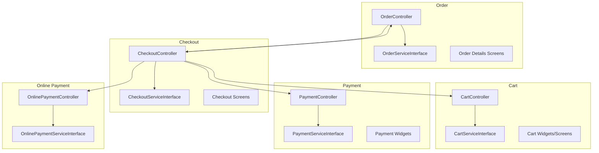

**Diagram sources**
- [order_controller.dart:9-12](file://lib/features/order/controllers/order_controller.dart#L9-L12)
- [order_service_interface.dart:7-23](file://lib/features/order/domain/services/order_service_interface.dart#L7-L23)
- [checkout_controller.dart:37-39](file://lib/features/checkout/controllers/checkout_controller.dart#L37-L39)
- [checkout_service_interface.dart:10-23](file://lib/features/checkout/domain/services/checkout_service_interface.dart#L10-L23)
- [cart_controller.dart:16-19](file://lib/features/cart/controllers/cart_controller.dart#L16-L19)
- [cart_service_interface.dart:7-73](file://lib/features/cart/domain/services/cart_service_interface.dart#L7-L73)
- [payment_controller.dart:6-8](file://lib/features/payment/controllers/payment_controller.dart#L6-L8)
- [payment_service_interface.dart:3-7](file://lib/features/payment/domain/services/payment_service_interface.dart#L3-L7)
- [online_payment_controller.dart:4-7](file://lib/features/online_payment/controllers/online_payment_controller.dart#L4-L7)
- [online_payment_service_interface.dart:2-3](file://lib/features/online_payment/domain/services/online_payment_service_interface.dart#L2-L3)

**Section sources**
- [order_controller.dart:1-298](file://lib/features/order/controllers/order_controller.dart#L1-L298)
- [checkout_controller.dart:1-684](file://lib/features/checkout/controllers/checkout_controller.dart#L1-L684)
- [cart_controller.dart:1-444](file://lib/features/cart/controllers/cart_controller.dart#L1-L444)
- [payment_controller.dart:1-72](file://lib/features/payment/controllers/payment_controller.dart#L1-L72)
- [online_payment_controller.dart:1-8](file://lib/features/online_payment/controllers/online_payment_controller.dart#L1-L8)

## Core Components
- OrderController: Manages order lists (running/history), order details retrieval, tracking, cancellation, reordering, refunds, and payment redirection. Implements caching for order details and supports guest and authenticated flows.
- CheckoutController: Orchestrates order placement, validates security, attaches documents and voice instructions, selects payment methods, calculates taxes and surges, and handles callbacks to success screens or payment pages.
- CartController: Handles cart operations, pricing calculations, online synchronization, and inventory-related availability checks.
- PaymentController: Manages offline payment methods and collects required information for bank transfers or cash-on-delivery.
- OnlinePaymentController: Placeholder for online payment orchestration.
- Supporting interfaces: OrderServiceInterface, CheckoutServiceInterface, CartServiceInterface, PaymentServiceInterface, OnlinePaymentServiceInterface define contracts for services.

Key responsibilities:
- Order lifecycle: Place -> Confirm -> Prepare -> Dispatch -> Deliver -> Complete/Cancel/Refund
- Real-time updates: Tracking via service calls and UI refreshes
- Security: Idempotency keys, device fingerprints, order signatures
- Wallet integration: Balance checks and partial payment dialogs

**Section sources**
- [order_controller.dart:65-298](file://lib/features/order/controllers/order_controller.dart#L65-L298)
- [checkout_controller.dart:457-611](file://lib/features/checkout/controllers/checkout_controller.dart#L457-L611)
- [cart_controller.dart:113-444](file://lib/features/cart/controllers/cart_controller.dart#L113-L444)
- [payment_controller.dart:1-72](file://lib/features/payment/controllers/payment_controller.dart#L1-L72)
- [order_service_interface.dart:7-23](file://lib/features/order/domain/services/order_service_interface.dart#L7-L23)
- [checkout_service_interface.dart:10-23](file://lib/features/checkout/domain/services/checkout_service_interface.dart#L10-L23)
- [cart_service_interface.dart:7-73](file://lib/features/cart/domain/services/cart_service_interface.dart#L7-L73)
- [payment_service_interface.dart:3-7](file://lib/features/payment/domain/services/payment_service_interface.dart#L3-L7)
- [online_payment_service_interface.dart:2-3](file://lib/features/online_payment/domain/services/online_payment_service_interface.dart#L2-L3)

## Architecture Overview
The system follows a layered architecture:
- UI Screens: Cart, Checkout, Order details, Guest tracking, Success screens
- Controllers: Stateful orchestration for domain workflows
- Services: Abstract interfaces for external integrations (orders, checkout, cart, payments)
- Helpers: Security, routing, localization, conversions
- Notifications/Live Activities: Real-time updates on web, Android, and iOS

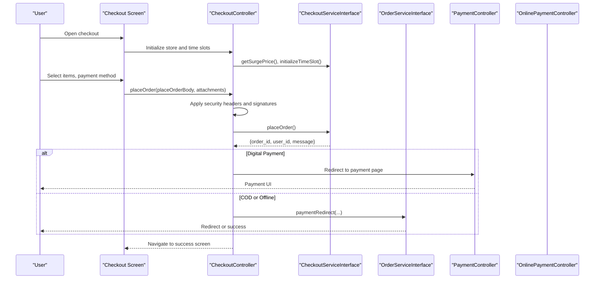

**Diagram sources**
- [checkout_controller.dart:457-611](file://lib/features/checkout/controllers/checkout_controller.dart#L457-L611)
- [checkout_service_interface.dart:19-22](file://lib/features/checkout/domain/services/checkout_service_interface.dart#L19-L22)
- [order_service_interface.dart:20-23](file://lib/features/order/domain/services/order_service_interface.dart#L20-L23)
- [payment_controller.dart:1-72](file://lib/features/payment/controllers/payment_controller.dart#L1-L72)
- [online_payment_controller.dart:1-8](file://lib/features/online_payment/controllers/online_payment_controller.dart#L1-L8)

## Detailed Component Analysis

### OrderController Implementation
OrderController manages:
- Running and history order lists with pagination
- Order details caching and retrieval
- Tracking orders (authenticated and guest)
- Cancellation, reordering, and refund submission
- Payment redirection for offline/subscription/add-funds flows

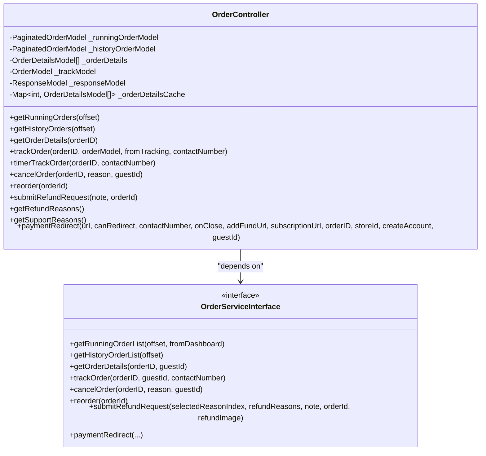

**Diagram sources**
- [order_controller.dart:9-12](file://lib/features/order/controllers/order_controller.dart#L9-L12)
- [order_service_interface.dart:7-23](file://lib/features/order/domain/services/order_service_interface.dart#L7-L23)

**Section sources**
- [order_controller.dart:65-298](file://lib/features/order/controllers/order_controller.dart#L65-L298)
- [order_service_interface.dart:7-23](file://lib/features/order/domain/services/order_service_interface.dart#L7-L23)

### Checkout Workflows and Order Placement
CheckoutController coordinates:
- Store initialization, surge pricing, and time-slot validation
- Distance calculation and extra charges
- Order placement with security headers and signatures
- Callback handling to success or payment pages
- Partial payment dialog based on wallet balance

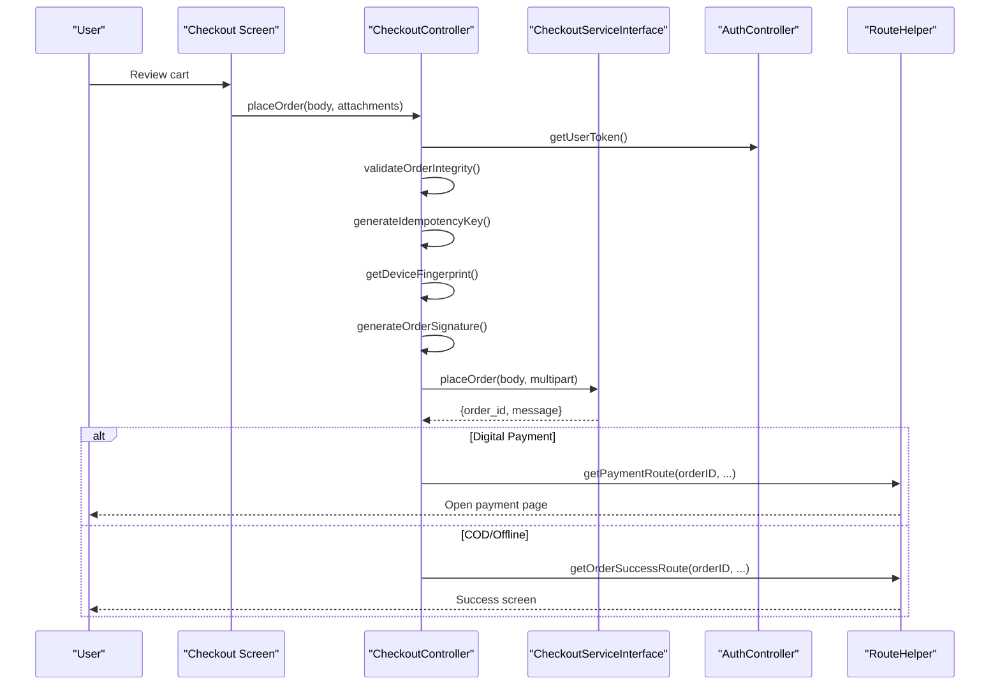

**Diagram sources**
- [checkout_controller.dart:457-611](file://lib/features/checkout/controllers/checkout_controller.dart#L457-L611)
- [checkout_service_interface.dart:19-22](file://lib/features/checkout/domain/services/checkout_service_interface.dart#L19-L22)
- [order_security_helper.dart](file://lib/helper/order_security_helper.dart)

**Section sources**
- [checkout_controller.dart:457-611](file://lib/features/checkout/controllers/checkout_controller.dart#L457-L611)
- [checkout_service_interface.dart:10-23](file://lib/features/checkout/domain/services/checkout_service_interface.dart#L10-L23)
- [place_order_body_model.dart](file://lib/features/checkout/domain/models/place_order_body_model.dart)

### Payment Processing Integration
PaymentController manages offline payment methods and collects required information. OnlinePaymentController is present for online payment orchestration. The checkout controller routes to either digital payment or success page depending on selection.

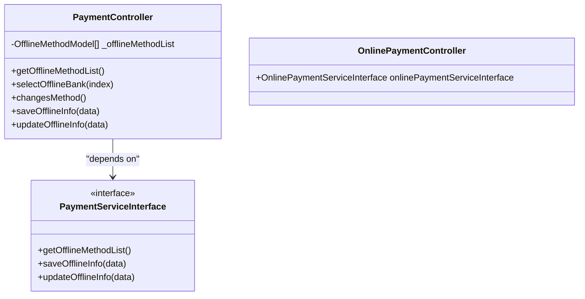

**Diagram sources**
- [payment_controller.dart:6-8](file://lib/features/payment/controllers/payment_controller.dart#L6-L8)
- [payment_service_interface.dart:3-7](file://lib/features/payment/domain/services/payment_service_interface.dart#L3-L7)
- [online_payment_controller.dart:4-7](file://lib/features/online_payment/controllers/online_payment_controller.dart#L4-L7)

**Section sources**
- [payment_controller.dart:1-72](file://lib/features/payment/controllers/payment_controller.dart#L1-L72)
- [payment_service_interface.dart:3-7](file://lib/features/payment/domain/services/payment_service_interface.dart#L3-L7)
- [online_payment_controller.dart:1-8](file://lib/features/online_payment/controllers/online_payment_controller.dart#L1-L8)

### Wallet Management
Wallet checks influence partial payment flow:
- Balance status check compares wallet balance against total price
- Partial payment dialog is shown when balance is insufficient
- Successful orders may credit loyalty points based on configuration

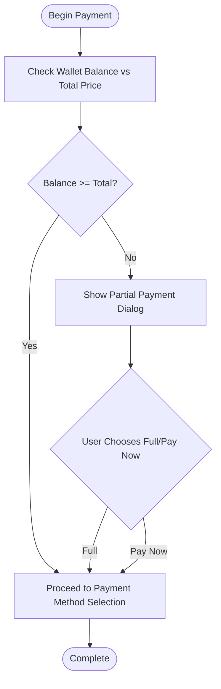

**Diagram sources**
- [checkout_controller.dart:388-401](file://lib/features/checkout/controllers/checkout_controller.dart#L388-L401)
- [profile_controller.dart](file://lib/features/profile/controllers/profile_controller.dart)

**Section sources**
- [checkout_controller.dart:388-401](file://lib/features/checkout/controllers/checkout_controller.dart#L388-L401)

### Order Lifecycle Stages and Status Transitions
Lifecycle stages:
- Placing: Cart validated, security applied, order submitted
- Confirmation: Order ID received, optional redirect to payment
- Preparation: Store processes order
- Dispatch: Delivery partner assigned
- Delivery: In transit
- Completion/Cancel/Refund/Dispute: Final state based on actions

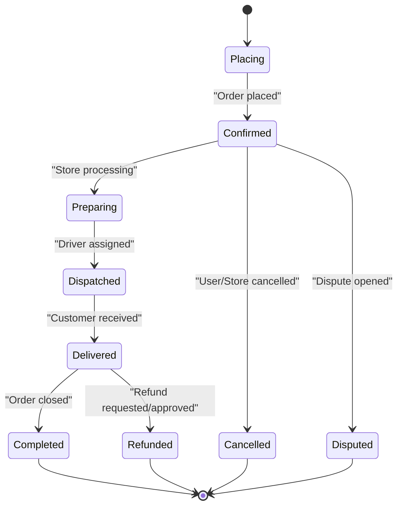

[No sources needed since this diagram shows conceptual workflow, not actual code structure]

### Real-Time Updates and Tracking
Real-time tracking is achieved via:
- Periodic polling via timerTrackOrder
- Direct tracking via trackOrder
- UI updates and loading states
- Guest tracking with optional contact number

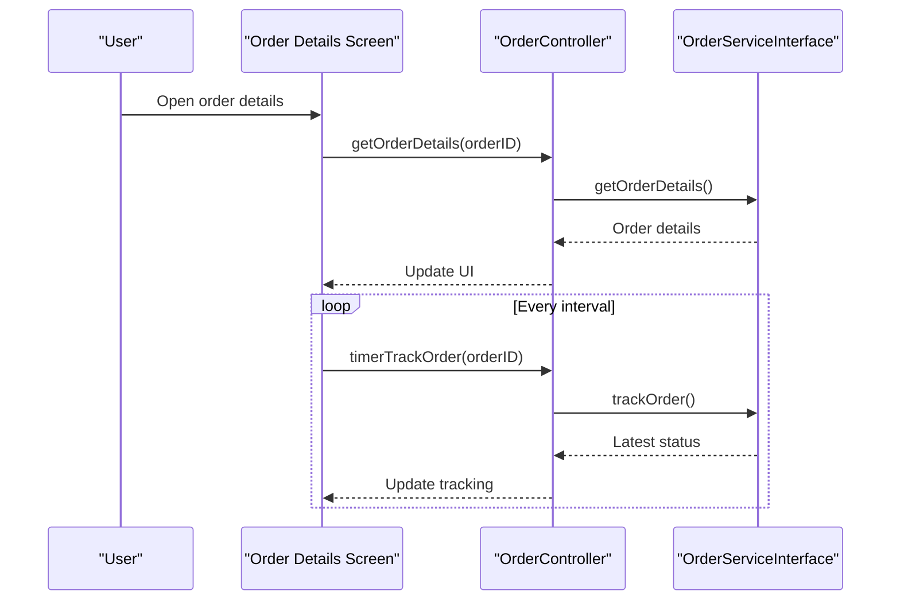

**Diagram sources**
- [order_controller.dart:180-245](file://lib/features/order/controllers/order_controller.dart#L180-L245)
- [order_details_screen.dart](file://lib/features/order/screens/order_details_screen.dart)
- [order_tracking_stream_service.dart](file://lib/features/order/domain/services/order_tracking_stream_service.dart)

**Section sources**
- [order_controller.dart:180-245](file://lib/features/order/controllers/order_controller.dart#L180-L245)
- [order_details_screen.dart](file://lib/features/order/screens/order_details_screen.dart)
- [order_tracking_stream_service.dart](file://lib/features/order/domain/services/order_tracking_stream_service.dart)

### Inventory Management Integration
CartController integrates with inventory and module configurations:
- Calculates item prices, discounts, add-ons, and variations
- Checks availability windows and stock limits
- Syncs cart with backend for online users
- Prevents cross-store/module mixing based on module config

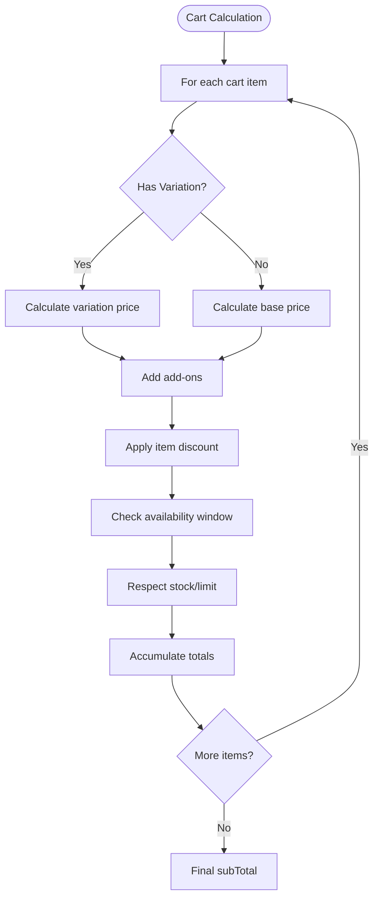

**Diagram sources**
- [cart_controller.dart:113-197](file://lib/features/cart/controllers/cart_controller.dart#L113-L197)
- [cart_service_interface.dart:14-47](file://lib/features/cart/domain/services/cart_service_interface.dart#L14-L47)
- [module_helper.dart](file://lib/helper/module_helper.dart)
- [date_converter.dart](file://lib/helper/date_converter.dart)
- [price_converter.dart](file://lib/helper/price_converter.dart)

**Section sources**
- [cart_controller.dart:113-197](file://lib/features/cart/controllers/cart_controller.dart#L113-L197)
- [cart_service_interface.dart:7-73](file://lib/features/cart/domain/services/cart_service_interface.dart#L7-L73)

### Payment Confirmation and Success Flows
- Digital payment: Redirect to payment route with order and customer details
- Cash on delivery: Navigate to success route
- Web desktop: Opens success dialog after navigation
- Loyalty points credited on successful COD

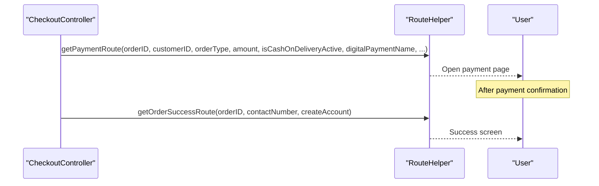

**Diagram sources**
- [checkout_controller.dart:554-611](file://lib/features/checkout/controllers/checkout_controller.dart#L554-L611)
- [route_helper.dart](file://lib/helper/route_helper.dart)
- [order_successful_screen.dart](file://lib/features/checkout/screens/order_successful_screen.dart)

**Section sources**
- [checkout_controller.dart:554-611](file://lib/features/checkout/controllers/checkout_controller.dart#L554-L611)
- [route_helper.dart](file://lib/helper/route_helper.dart)

### Order Cancellation, Refund Processing, and Dispute Resolution
- Cancellation: Submit reason, remove from running orders, mark as cancelled
- Refund: Select reason, attach image/document, submit request
- Disputes: Support reasons list for escalation

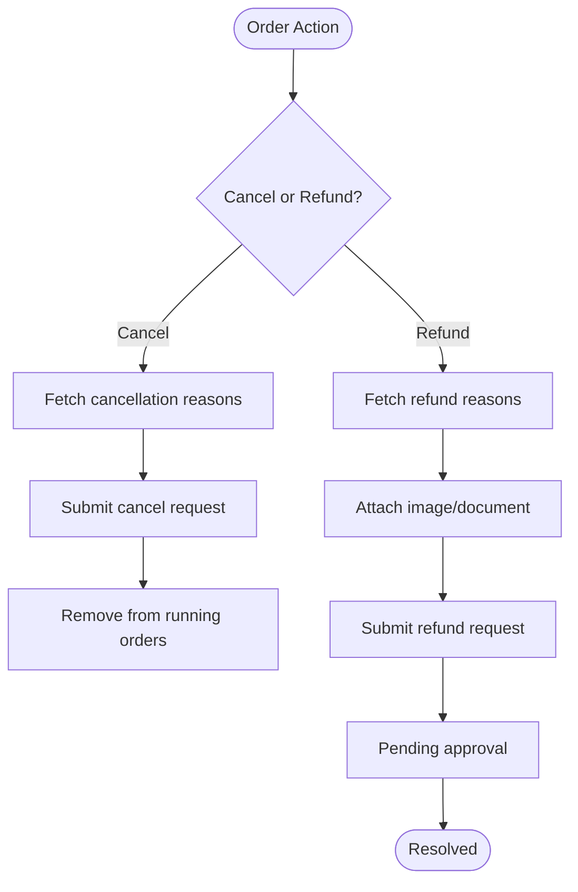

**Diagram sources**
- [order_controller.dart:247-133](file://lib/features/order/controllers/order_controller.dart#L247-L133)
- [order_cancellation_body.dart](file://lib/features/order/domain/models/order_cancellation_body.dart)

**Section sources**
- [order_controller.dart:114-133](file://lib/features/order/controllers/order_controller.dart#L114-L133)
- [order_controller.dart:247-262](file://lib/features/order/controllers/order_controller.dart#L247-L262)

### Relationship Between Orders, Carts, Payments, and Delivery Systems
- Cart feeds Checkout: Items, quantities, pricing, and availability
- Checkout places Order: Applies security, attachments, and payment method
- Payment resolves payment state: COD, offline, or digital
- Order tracks delivery: Driver assignment and status updates
- Delivery systems integrate via surge pricing, time slots, and distance calculations

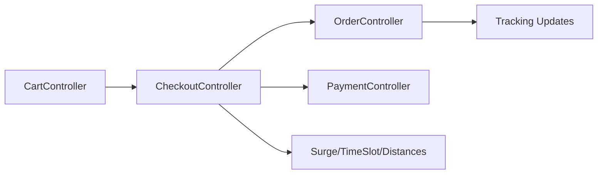

**Diagram sources**
- [cart_controller.dart:1-444](file://lib/features/cart/controllers/cart_controller.dart#L1-L444)
- [checkout_controller.dart:1-684](file://lib/features/checkout/controllers/checkout_controller.dart#L1-L684)
- [order_controller.dart:1-298](file://lib/features/order/controllers/order_controller.dart#L1-L298)
- [payment_controller.dart:1-72](file://lib/features/payment/controllers/payment_controller.dart#L1-L72)

**Section sources**
- [cart_controller.dart:1-444](file://lib/features/cart/controllers/cart_controller.dart#L1-L444)
- [checkout_controller.dart:1-684](file://lib/features/checkout/controllers/checkout_controller.dart#L1-L684)
- [order_controller.dart:1-298](file://lib/features/order/controllers/order_controller.dart#L1-L298)
- [payment_controller.dart:1-72](file://lib/features/payment/controllers/payment_controller.dart#L1-L72)

### Examples of Order Placement Flows
- Standard delivery order with digital payment:
  - User selects items, applies coupons, chooses delivery time slot
  - CheckoutController validates security and places order
  - Redirects to payment page; upon success navigates to order success
- Cash on delivery:
  - Same flow but redirects to success route immediately after placement
- Prescription order:
  - Specialized attachment handling and address coordinates

**Section sources**
- [checkout_controller.dart:457-552](file://lib/features/checkout/controllers/checkout_controller.dart#L457-L552)
- [checkout_screen.dart](file://lib/features/checkout/screens/checkout_screen.dart)
- [order_successful_screen.dart](file://lib/features/checkout/screens/order_successful_screen.dart)

### Examples of Payment Processing
- Digital payment: getPaymentRoute invoked; web/desktop opens payment page
- Offline payment: collect bank details via PaymentController; save/update offline info
- Wallet partial payment: balance check triggers dialog; user decides pay now/full

**Section sources**
- [checkout_controller.dart:572-600](file://lib/features/checkout/controllers/checkout_controller.dart#L572-L600)
- [payment_controller.dart:50-66](file://lib/features/payment/controllers/payment_controller.dart#L50-L66)
- [checkout_controller.dart:388-401](file://lib/features/checkout/controllers/checkout_controller.dart#L388-L401)

### Examples of Order Tracking Updates
- Fetch order details for list with cache
- Track order via service interface
- Timer-based polling for latest status
- Guest tracking with optional contact number

**Section sources**
- [order_controller.dart:65-74](file://lib/features/order/controllers/order_controller.dart#L65-L74)
- [order_controller.dart:200-245](file://lib/features/order/controllers/order_controller.dart#L200-L245)
- [order_details_screen.dart](file://lib/features/order/screens/order_details_screen.dart)

## Dependency Analysis
Controllers depend on service interfaces, which encapsulate external integrations. The dependency graph shows clear separation of concerns and low coupling between UI and business logic.

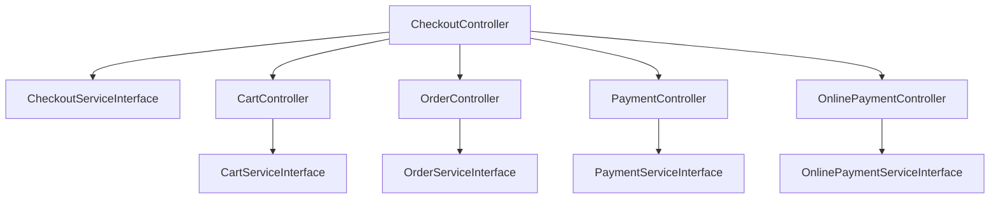

**Diagram sources**
- [checkout_controller.dart:37-39](file://lib/features/checkout/controllers/checkout_controller.dart#L37-L39)
- [order_controller.dart:9-12](file://lib/features/order/controllers/order_controller.dart#L9-L12)
- [cart_controller.dart:16-19](file://lib/features/cart/controllers/cart_controller.dart#L16-L19)
- [payment_controller.dart:6-8](file://lib/features/payment/controllers/payment_controller.dart#L6-L8)
- [online_payment_controller.dart:4-7](file://lib/features/online_payment/controllers/online_payment_controller.dart#L4-L7)

**Section sources**
- [checkout_controller.dart:37-39](file://lib/features/checkout/controllers/checkout_controller.dart#L37-L39)
- [order_controller.dart:9-12](file://lib/features/order/controllers/order_controller.dart#L9-L12)
- [cart_controller.dart:16-19](file://lib/features/cart/controllers/cart_controller.dart#L16-L19)
- [payment_controller.dart:6-8](file://lib/features/payment/controllers/payment_controller.dart#L6-L8)
- [online_payment_controller.dart:4-7](file://lib/features/online_payment/controllers/online_payment_controller.dart#L4-L7)

## Performance Considerations
- Caching: Order details cached by order ID to avoid repeated network calls
- Pagination: Running and history lists use offset-based pagination to limit payload sizes
- Security headers: Idempotency keys and signatures prevent duplicate submissions and tampering
- Asynchronous operations: Background cart sync and order polling minimize UI blocking
- Partial payments: Balance checks reduce failed transactions and improve UX
- Scalability: Service interfaces enable mocking and testing; controllers remain stateless except for UI state

Recommendations:
- Implement exponential backoff for tracking polling
- Use debounced cart updates to reduce network churn
- Cache frequently accessed lists (time slots, offline methods)
- Monitor API latency and set timeouts for long-running operations

**Section sources**
- [order_controller.dart:62-74](file://lib/features/order/controllers/order_controller.dart#L62-L74)
- [checkout_controller.dart:457-496](file://lib/features/checkout/controllers/checkout_controller.dart#L457-L496)
- [cart_controller.dart:363-382](file://lib/features/cart/controllers/cart_controller.dart#L363-L382)

## Troubleshooting Guide
Common issues and resolutions:
- Order placement failures:
  - Validate security headers and signatures
  - Check rate-limiting and idempotency key usage
  - Inspect response status and messages
- Tracking errors:
  - Verify order ID and guest/contact parameters
  - Retry with timerTrackOrder on failure
- Payment failures:
  - Confirm payment method selection and redirect URLs
  - For offline payments, ensure required information is saved
- Wallet insufficient:
  - Show partial payment dialog and guide user to add funds
- Cart sync issues:
  - Trigger getCartDataOnline and recalculate totals

**Section sources**
- [checkout_controller.dart:457-527](file://lib/features/checkout/controllers/checkout_controller.dart#L457-L527)
- [order_controller.dart:200-245](file://lib/features/order/controllers/order_controller.dart#L200-L245)
- [payment_controller.dart:50-66](file://lib/features/payment/controllers/payment_controller.dart#L50-L66)
- [cart_controller.dart:384-429](file://lib/features/cart/controllers/cart_controller.dart#L384-L429)

## Conclusion
The order management system provides a robust, modular architecture for order placement, tracking, history, and fulfillment. It integrates carts, payments, and delivery systems while ensuring security, real-time updates, and scalability. Clear separation of concerns through controllers and service interfaces enables maintainability and extensibility. The documented flows and troubleshooting steps support reliable operation under high-volume scenarios.

## Appendices

### UI Components and Screens
- Cart: [cart_screen.dart](file://lib/features/cart/screens/cart_screen.dart), [cart_item_widget.dart](file://lib/features/cart/widgets/cart_item_widget.dart), [cart_widget.dart](file://lib/features/cart/widgets/cart_widget.dart)
- Checkout: [checkout_screen.dart](file://lib/features/checkout/screens/checkout_screen.dart), [payment_button.dart](file://lib/features/checkout/widgets/payment_button.dart), [payment_method_bottom_sheet.dart](file://lib/features/checkout/widgets/payment_method_bottom_sheet.dart), [payment_section.dart](file://lib/features/checkout/widgets/payment_section.dart)
- Orders: [order_screen.dart](file://lib/features/order/screens/order_screen.dart), [order_details_screen.dart](file://lib/features/order/screens/order_details_screen.dart), [guest_track_order_screen.dart](file://lib/features/order/screens/guest_track_order_screen.dart), [running_order_view_widget.dart](file://lib/features/dashboard/widgets/running_order_view_widget.dart), [current_order_widget.dart](file://lib/features/home/widgets/current_order_widget.dart)

**Section sources**
- [cart_screen.dart](file://lib/features/cart/screens/cart_screen.dart)
- [cart_item_widget.dart](file://lib/features/cart/widgets/cart_item_widget.dart)
- [cart_widget.dart](file://lib/features/cart/widgets/cart_widget.dart)
- [checkout_screen.dart](file://lib/features/checkout/screens/checkout_screen.dart)
- [payment_button.dart](file://lib/features/checkout/widgets/payment_button.dart)
- [payment_method_bottom_sheet.dart](file://lib/features/checkout/widgets/payment_method_bottom_sheet.dart)
- [payment_section.dart](file://lib/features/checkout/widgets/payment_section.dart)
- [order_screen.dart](file://lib/features/order/screens/order_screen.dart)
- [order_details_screen.dart](file://lib/features/order/screens/order_details_screen.dart)
- [guest_track_order_screen.dart](file://lib/features/order/screens/guest_track_order_screen.dart)
- [running_order_view_widget.dart](file://lib/features/dashboard/widgets/running_order_view_widget.dart)
- [current_order_widget.dart](file://lib/features/home/widgets/current_order_widget.dart)

### Real-Time Updates and Notifications
- Web: [firebase-messaging-sw.js](file://web/firebase-messaging-sw.js)
- Android: [OrderTrackingNotificationManager.kt](file://android/app/src/main/java/com/sixamtech/efood_multivendor/OrderTrackingNotificationManager.kt), [WaddiFirebaseMessagingService.kt](file://android/app/src/main/java/com/sixamtech/efood_multivendor/WaddiFirebaseMessagingService.kt)
- iOS: [OrderTrackingAttributes.swift](file://ios/WaddiLiveActivity/OrderTrackingAttributes.swift), [WaddiLiveActivityLiveActivity.swift](file://ios/WaddiLiveActivity/WaddiLiveActivityLiveActivity.swift)

**Section sources**
- [firebase-messaging-sw.js](file://web/firebase-messaging-sw.js)
- [OrderTrackingNotificationManager.kt](file://android/app/src/main/java/com/sixamtech/efood_multivendor/OrderTrackingNotificationManager.kt)
- [WaddiFirebaseMessagingService.kt](file://android/app/src/main/java/com/sixamtech/efood_multivendor/WaddiFirebaseMessagingService.kt)
- [OrderTrackingAttributes.swift](file://ios/WaddiLiveActivity/OrderTrackingAttributes.swift)
- [WaddiLiveActivityLiveActivity.swift](file://ios/WaddiLiveActivity/WaddiLiveActivityLiveActivity.swift)