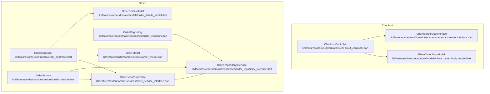
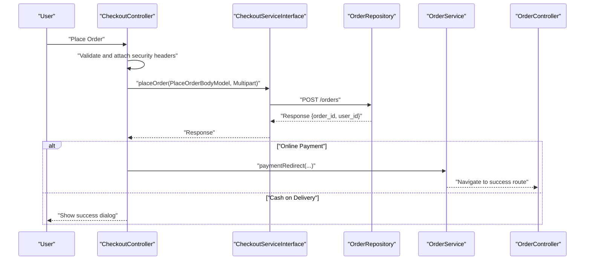
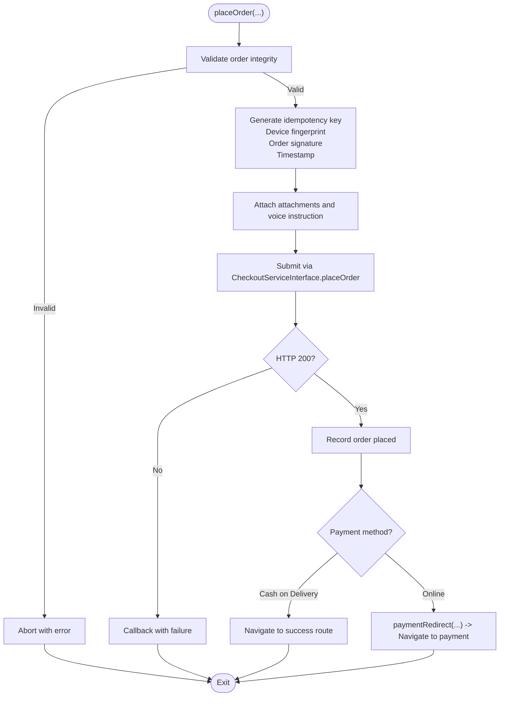
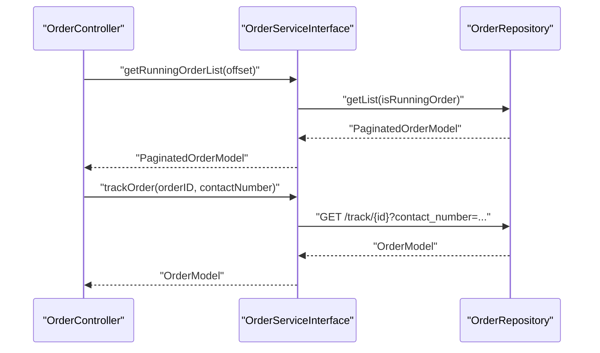
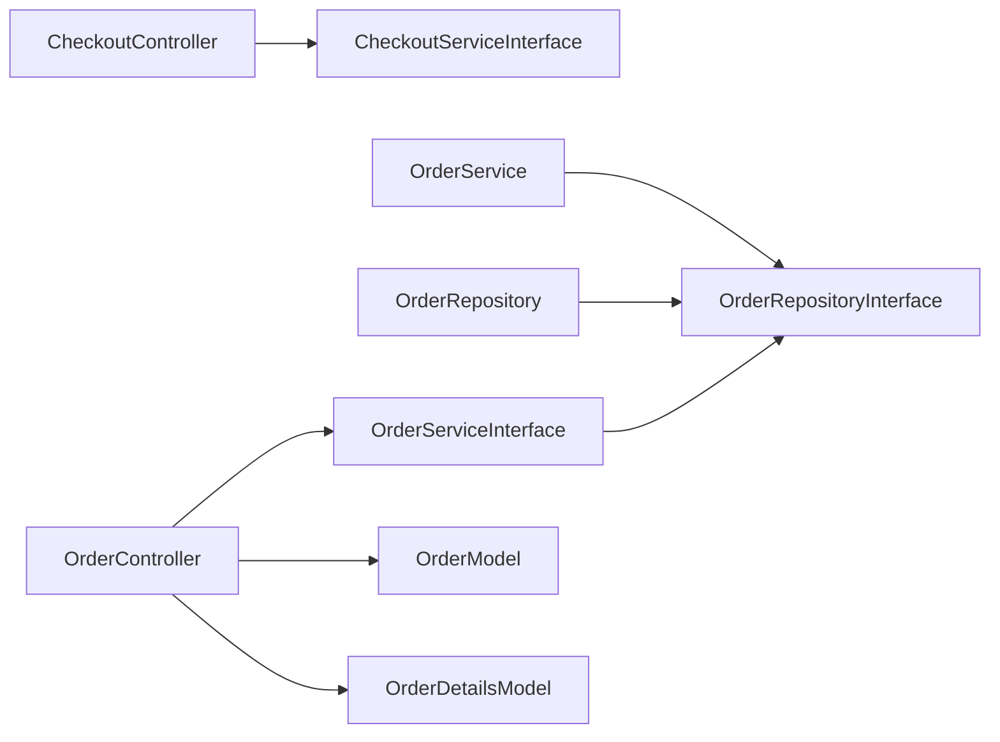

# Order Placement

<cite>
**Referenced Files in This Document**
- [order_controller.dart](file://lib/features/order/controllers/order_controller.dart)
- [order_service.dart](file://lib/features/order/domain/services/order_service.dart)
- [order_service_interface.dart](file://lib/features/order/domain/services/order_service_interface.dart)
- [order_repository.dart](file://lib/features/order/domain/repositories/order_repository.dart)
- [order_repository_interface.dart](file://lib/features/order/domain/repositories/order_repository_interface.dart)
- [order_model.dart](file://lib/features/order/domain/models/order_model.dart)
- [order_details_model.dart](file://lib/features/order/domain/models/order_details_model.dart)
- [checkout_controller.dart](file://lib/features/checkout/controllers/checkout_controller.dart)
- [place_order_body_model.dart](file://lib/features/checkout/domain/models/place_order_body_model.dart)
- [checkout_service_interface.dart](file://lib/features/checkout/domain/services/checkout_service_interface.dart)
</cite>

## Table of Contents
1. [Introduction](#introduction)
2. [Project Structure](#project-structure)
3. [Core Components](#core-components)
4. [Architecture Overview](#architecture-overview)
5. [Detailed Component Analysis](#detailed-component-analysis)
6. [Dependency Analysis](#dependency-analysis)
7. [Performance Considerations](#performance-considerations)
8. [Troubleshooting Guide](#troubleshooting-guide)
9. [Conclusion](#conclusion)

## Introduction
This document explains the order placement system end-to-end. It covers how a customer’s cart is transformed into an order, how validation and security measures are applied, how the order is submitted to the backend, and how the system integrates with checkout, payment, and order confirmation flows. It also documents order status initialization, unique order ID generation, metadata management, concurrency safeguards, and duplicate detection via idempotency.

## Project Structure
The order placement system spans two primary feature areas:
- Checkout: constructs the order payload, applies validation and security, and submits the order.
- Order: manages order retrieval, tracking, cancellation, refunds, and post-payment redirects.

**Diagram sources**
- [checkout_controller.dart:457-611](file://lib/features/checkout/controllers/checkout_controller.dart#L457-L611)
- [place_order_body_model.dart:1-327](file://lib/features/checkout/domain/models/place_order_body_model.dart#L1-L327)
- [order_controller.dart:9-298](file://lib/features/order/controllers/order_controller.dart#L9-L298)
- [order_service.dart:14-154](file://lib/features/order/domain/services/order_service.dart#L14-L154)
- [order_service_interface.dart:7-23](file://lib/features/order/domain/services/order_service_interface.dart#L7-L23)
- [order_repository.dart:13-156](file://lib/features/order/domain/repositories/order_repository.dart#L13-L156)
- [order_repository_interface.dart:5-15](file://lib/features/order/domain/repositories/order_repository_interface.dart#L5-L15)
- [order_model.dart:6-389](file://lib/features/order/domain/models/order_model.dart#L6-L389)
- [order_details_model.dart:3-141](file://lib/features/order/domain/models/order_details_model.dart#L3-L141)

**Section sources**
- [checkout_controller.dart:457-611](file://lib/features/checkout/controllers/checkout_controller.dart#L457-L611)
- [order_controller.dart:9-298](file://lib/features/order/controllers/order_controller.dart#L9-L298)

## Core Components
- CheckoutController: orchestrates order creation, attaches security headers, builds multipart payloads, and routes to payment or success depending on payment method.
- PlaceOrderBodyModel: serializes the cart, pricing, delivery info, and security metadata into a structured payload.
- OrderController: retrieves order lists/history, tracks orders, cancels orders, reorders, and handles payment redirects.
- OrderService: delegates to repository for network calls and handles UI feedback and routing after payment completion.
- OrderRepository: performs HTTP requests to backend endpoints for orders, cancellations, refunds, and tracking.
- OrderModel and OrderDetailsModel: typed models for order headers and line items.

**Section sources**
- [checkout_controller.dart:457-611](file://lib/features/checkout/controllers/checkout_controller.dart#L457-L611)
- [place_order_body_model.dart:1-327](file://lib/features/checkout/domain/models/place_order_body_model.dart#L1-L327)
- [order_controller.dart:9-298](file://lib/features/order/controllers/order_controller.dart#L9-L298)
- [order_service.dart:14-154](file://lib/features/order/domain/services/order_service.dart#L14-L154)
- [order_repository.dart:13-156](file://lib/features/order/domain/repositories/order_repository.dart#L13-L156)
- [order_model.dart:6-389](file://lib/features/order/domain/models/order_model.dart#L6-L389)
- [order_details_model.dart:3-141](file://lib/features/order/domain/models/order_details_model.dart#L3-L141)

## Architecture Overview
The order placement flow is a client-side orchestrated pipeline that validates and secures the order, submits it to the backend, and then either redirects to payment or shows a success screen. Payment completion triggers order confirmation and updates.

**Diagram sources**
- [checkout_controller.dart:457-611](file://lib/features/checkout/controllers/checkout_controller.dart#L457-L611)
- [order_service.dart:109-152](file://lib/features/order/domain/services/order_service.dart#L109-L152)
- [order_repository.dart:13-156](file://lib/features/order/domain/repositories/order_repository.dart#L13-L156)

## Detailed Component Analysis

### CheckoutController: Order Validation, Security, and Submission
- Validates order integrity and rate limits using a security helper.
- Builds multipart payloads for attachments and optional voice instructions.
- Attaches idempotency key, device fingerprint, order signature, and timestamp to the payload.
- Submits order via CheckoutServiceInterface and routes to payment or success based on payment method.
- On success, clears cart, updates UI, and triggers callbacks to show success dialogs or redirect to payment.

**Diagram sources**
- [checkout_controller.dart:457-527](file://lib/features/checkout/controllers/checkout_controller.dart#L457-L527)

**Section sources**
- [checkout_controller.dart:457-527](file://lib/features/checkout/controllers/checkout_controller.dart#L457-L527)

### PlaceOrderBodyModel: Cart-to-Order Serialization
- Encapsulates the cart, pricing breakdown, delivery info, and optional scheduling.
- Serializes nested cart items, variations, add-ons, and security fields into a JSON-serializable map for submission.

**Section sources**
- [place_order_body_model.dart:1-327](file://lib/features/checkout/domain/models/place_order_body_model.dart#L1-L327)

### OrderController: Retrieval, Tracking, Cancellation, Refunds, Reorder
- Fetches paginated running and historical orders, caching order details per order ID.
- Tracks orders by ID and contact number, returning parsed OrderModel.
- Cancels orders and updates cached running order list.
- Handles reorder requests and refund submission with image upload.
- Manages payment redirects and navigation after payment completion.

**Diagram sources**
- [order_controller.dart:135-173](file://lib/features/order/controllers/order_controller.dart#L135-L173)
- [order_controller.dart:200-227](file://lib/features/order/controllers/order_controller.dart#L200-L227)
- [order_service.dart:19-27](file://lib/features/order/domain/services/order_service.dart#L19-L27)
- [order_repository.dart:23-28](file://lib/features/order/domain/repositories/order_repository.dart#L23-L28)

**Section sources**
- [order_controller.dart:135-173](file://lib/features/order/controllers/order_controller.dart#L135-L173)
- [order_controller.dart:200-227](file://lib/features/order/controllers/order_controller.dart#L200-L227)
- [order_service.dart:19-27](file://lib/features/order/domain/services/order_service.dart#L19-L27)
- [order_repository.dart:23-28](file://lib/features/order/domain/repositories/order_repository.dart#L23-L28)

### OrderService: Business Logic and Routing
- Delegates repository calls for order lists, details, cancellations, and refunds.
- Handles payment redirect logic: determines success/failure/cancel states and navigates accordingly.
- Switches order to cash-on-delivery and refreshes UI.

**Section sources**
- [order_service.dart:109-152](file://lib/features/order/domain/services/order_service.dart#L109-L152)

### OrderRepository: Backend Integration
- Implements HTTP calls to endpoints for order details, tracking, cancellations, refunds, and reorder.
- Returns typed responses for consumption by services.

**Section sources**
- [order_repository.dart:13-156](file://lib/features/order/domain/repositories/order_repository.dart#L13-L156)

### Order Models: Data Structures and Metadata
- OrderModel: order header with amounts, statuses, timestamps, delivery metadata, and nested entities.
- OrderDetailsModel: line items with variations, add-ons, taxes, discounts, and campaign info.

**Section sources**
- [order_model.dart:6-389](file://lib/features/order/domain/models/order_model.dart#L6-L389)
- [order_details_model.dart:3-141](file://lib/features/order/domain/models/order_details_model.dart#L3-L141)

## Dependency Analysis
The system follows a layered architecture:
- Controllers depend on Services.
- Services depend on Repositories.
- Repositories depend on the HTTP client and constants.

**Diagram sources**
- [checkout_controller.dart:37-39](file://lib/features/checkout/controllers/checkout_controller.dart#L37-L39)
- [order_controller.dart:9-12](file://lib/features/order/controllers/order_controller.dart#L9-L12)
- [order_service.dart:14-16](file://lib/features/order/domain/services/order_service.dart#L14-L16)
- [order_repository.dart:13-15](file://lib/features/order/domain/repositories/order_repository.dart#L13-L15)
- [order_model.dart:6-389](file://lib/features/order/domain/models/order_model.dart#L6-L389)
- [order_details_model.dart:3-141](file://lib/features/order/domain/models/order_details_model.dart#L3-L141)

**Section sources**
- [checkout_controller.dart:37-39](file://lib/features/checkout/controllers/checkout_controller.dart#L37-L39)
- [order_controller.dart:9-12](file://lib/features/order/controllers/order_controller.dart#L9-L12)
- [order_service.dart:14-16](file://lib/features/order/domain/services/order_service.dart#L14-L16)
- [order_repository.dart:13-15](file://lib/features/order/domain/repositories/order_repository.dart#L13-L15)

## Performance Considerations
- Pagination: Running and history order lists are paginated to reduce memory footprint.
- Caching: Order details are cached per order ID to avoid redundant network calls.
- Asynchronous loading: UI updates are triggered after futures resolve to keep the UI responsive.
- Minimizing payload size: Only required fields are serialized in PlaceOrderBodyModel.

[No sources needed since this section provides general guidance]

## Troubleshooting Guide
Common issues and remedies:
- Order submission fails: Verify multipart attachments and signatures; check response status and message; retry with corrected data.
- Payment redirect not working: Ensure the redirect URL matches success/failure/cancel patterns; confirm the callback URL is reachable.
- Duplicate orders: Idempotency keys prevent re-submission; if duplicates occur, inspect backend idempotency handling.
- Order not appearing in running list: Clear cache and reload; ensure pagination offset is incremented correctly.

**Section sources**
- [checkout_controller.dart:457-527](file://lib/features/checkout/controllers/checkout_controller.dart#L457-L527)
- [order_service.dart:109-152](file://lib/features/order/domain/services/order_service.dart#L109-L152)
- [order_repository.dart:13-156](file://lib/features/order/domain/repositories/order_repository.dart#L13-L156)

## Conclusion
The order placement system integrates checkout validation, security, and submission with robust order management and payment redirection. It leverages idempotency, caching, and pagination to ensure reliability and performance. The layered design keeps concerns separated and simplifies testing and maintenance.