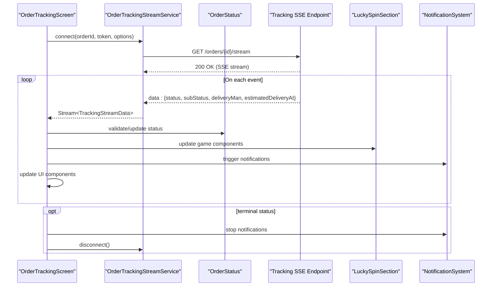
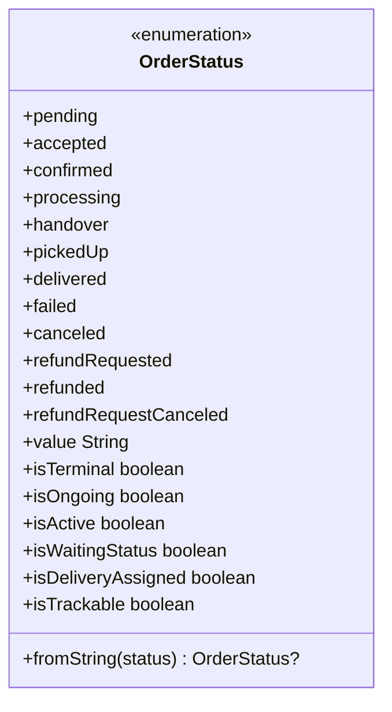
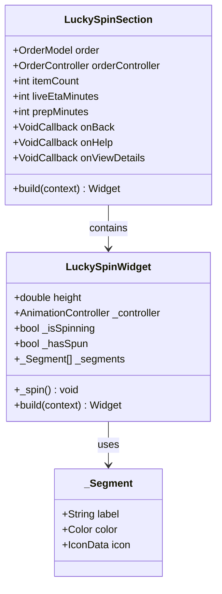
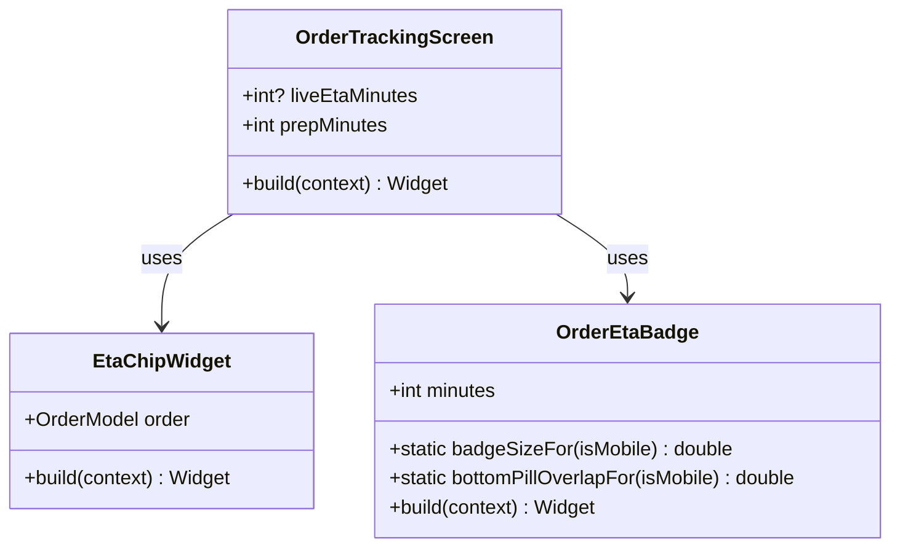
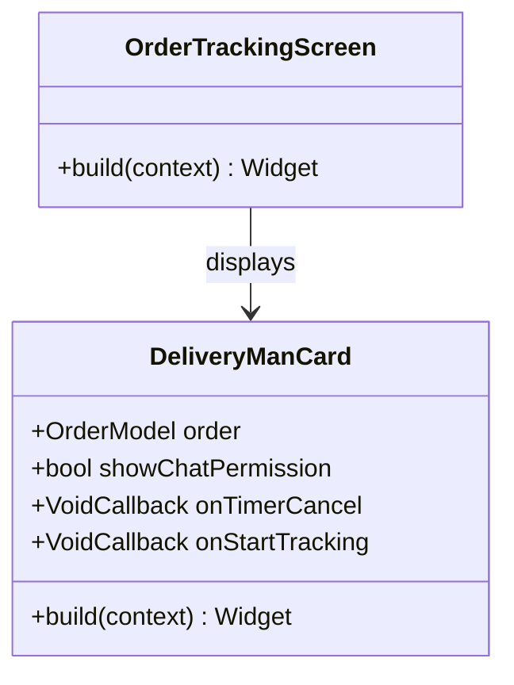
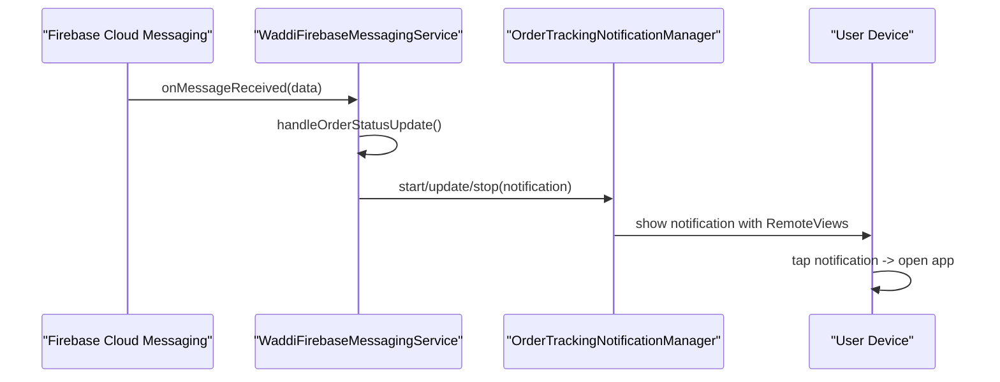
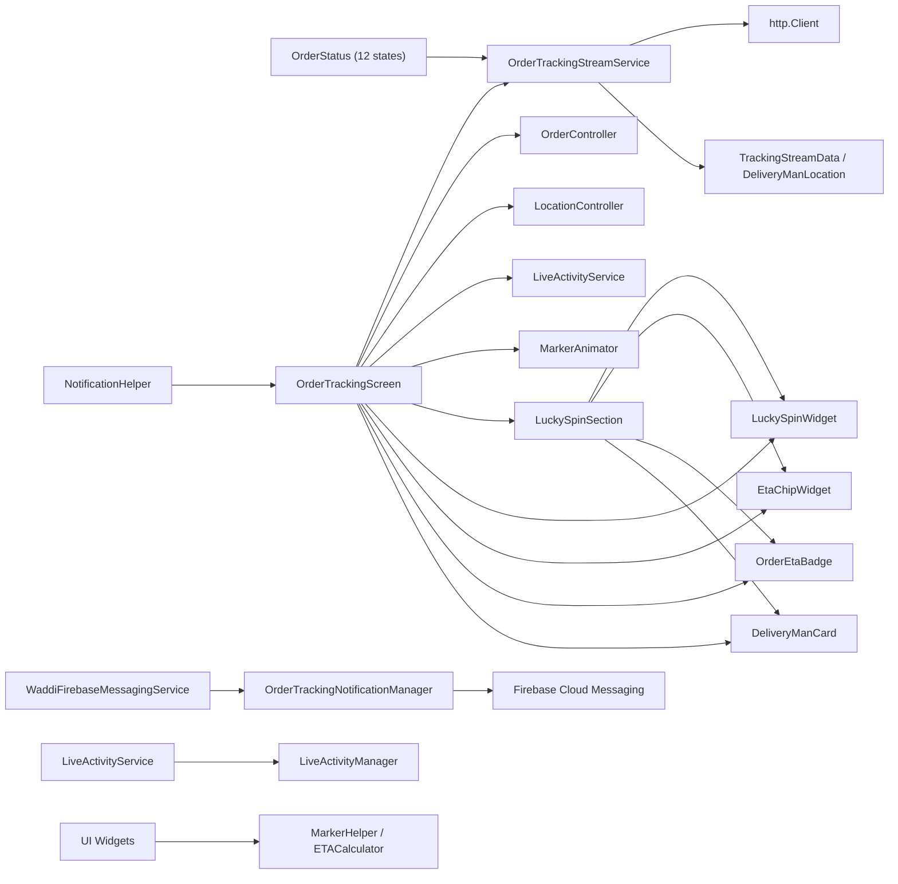

# Order Tracking

<cite>
**Referenced Files in This Document**
- [order_tracking_stream_service.dart](file://lib/features/order/domain/services/order_tracking_stream_service.dart)
- [order_tracking_screen.dart](file://lib/features/order/screens/order_tracking_screen.dart)
- [tracking_stepper_widget.dart](file://lib/features/order/widgets/tracking_stepper_widget.dart)
- [enhanced_tracking_stepper_widget.dart](file://lib/features/order/widgets/enhanced_tracking_stepper_widget.dart)
- [traking_map_widget.dart](file://lib/features/order/widgets/traking_map_widget.dart)
- [modern_tracking_card_widget.dart](file://lib/features/order/widgets/modern_tracking_card_widget.dart)
- [delivery_instruction_tracking_widget.dart](file://lib/features/order/widgets/delivery_instruction_tracking_widget.dart)
- [track_details_view_widget.dart](file://lib/features/order/widgets/track_details_view_widget.dart)
- [marker_animator.dart](file://lib/helper/marker_animator.dart)
- [order_status.dart](file://lib/features/order/domain/models/order_status.dart)
- [lucky_spin_section.dart](file://lib/features/order/widgets/lucky_spin_section.dart)
- [lucky_spin_widget.dart](file://lib/features/order/widgets/lucky_spin_widget.dart)
- [eta_chip_widget.dart](file://lib/features/order/widgets/eta_chip_widget.dart)
- [order_eta_badge.dart](file://lib/features/order/widgets/order_eta_badge.dart)
- [delivery_man_card.dart](file://lib/features/order/widgets/delivery_man_card.dart)
- [OrderTrackingNotificationManager.kt](file://android/app/src/main/kotlin/com/sixamtech/efood_multivendor/OrderTrackingNotificationManager.kt)
- [WaddiFirebaseMessagingService.kt](file://android/app/src/main/kotlin/com/sixamtech/efood_multivendor/WaddiFirebaseMessagingService.kt)
- [live_activity_service.dart](file://lib/services/live_activity_service.dart)
- [LiveActivityManager.swift](file://ios/Runner/LiveActivityManager.swift)
- [notification_helper.dart](file://lib/helper/notification_helper.dart)
- [guest_track_order_screen.dart](file://lib/features/order/screens/guest_track_order_screen.dart)
</cite>

## Update Summary
**Changes Made**
- Updated OrderStatus enum from 8 to 12 states with enhanced status management
- Added Lucky Spin feature with interactive wheel game and scratch card components
- Introduced modern ETA chips and badge widgets for improved visual presentation
- Enhanced delivery man card with action buttons and status-aware UI
- Implemented comprehensive real-time notification system with push notifications and Live Activities
- Added new tracking UI components including combined order cards and progress badges

## Table of Contents
1. [Introduction](#introduction)
2. [Project Structure](#project-structure)
3. [Core Components](#core-components)
4. [Architecture Overview](#architecture-overview)
5. [Detailed Component Analysis](#detailed-component-analysis)
6. [New Features and Components](#new-features-and-components)
7. [Real-Time Notification System](#real-time-notification-system)
8. [Dependency Analysis](#dependency-analysis)
9. [Performance Considerations](#performance-considerations)
10. [Troubleshooting Guide](#troubleshooting-guide)
11. [Conclusion](#conclusion)
12. [Appendices](#appendices)

## Introduction
This document explains the enhanced real-time order tracking system, featuring a comprehensive OrderStatus enum with 12 states, Lucky Spin interactive games, modern UI components, and sophisticated real-time notification capabilities. The system now includes advanced tracking widgets, delivery man cards, ETA chips, and a complete push notification ecosystem with both Android and iOS Live Activities integration.

## Project Structure
The tracking system now encompasses enhanced streaming services, sophisticated UI components, interactive gaming features, and comprehensive notification infrastructure spanning multiple platforms.

```mermaid
graph TB
subgraph "Enhanced Streaming Layer"
OTS["OrderTrackingStreamService<br/>SSE client"]
OS["OrderStatus<br/>12-state enum"]
end
subgraph "Advanced UI Layer"
OTScren["OrderTrackingScreen<br/>orchestrates tracking"]
MTC["ModernTrackingCardWidget<br/>progress + ETA"]
TS["TrackingStepperWidget<br/>basic steps"]
ETS["EnhancedTrackingStepperWidget<br/>steps + sub-status"]
DITW["DeliveryInstructionTrackingWidget<br/>voice + text"]
TDVW["TrackDetailsViewWidget<br/>route + contact"]
TMW["TrackingMapWidget<br/>static map"]
LSS["LuckySpinSection<br/>interactive games"]
LSW["LuckySpinWidget<br/>wheel game"]
ETC["EtaChipWidget<br/>visual ETA"]
OEB["OrderEtaBadge<br/>progress badge"]
DMC["DeliveryManCard<br/>driver info + actions"]
end
subgraph "Notification System"
ONM["OrderTrackingNotificationManager<br/>Android notifications"]
WFMS["WaddiFirebaseMessagingService<br/>FCM handler"]
LAS["LiveActivityService<br/>iOS Live Activities"]
LAM["LiveActivityManager<br/>iOS bridge"]
NH["NotificationHelper<br/>cross-platform"]
end
subgraph "Helpers"
MA["MarkerAnimator<br/>smooth marker movement"]
EH["ETA Calculator<br/>distance + time"]
end
OTS --> OS
OTS --> OTScren
OTScren --> MTC
OTScren --> TS
OTScren --> ETS
OTScren --> DITW
OTScren --> TDVW
OTScren --> TMW
OTScren --> LSS
OTScren --> LSW
OTScren --> ETC
OTScren --> OEB
OTScren --> DMC
OTSCrean --> ONM
OTSCrean --> WFMS
OTSCrean --> LAS
OTSCrean --> LAM
OTSCrean --> NH
OTScren --> MA
OTScren --> EH
```

**Diagram sources**
- [order_tracking_stream_service.dart:67-259](file://lib/features/order/domain/services/order_tracking_stream_service.dart#L67-L259)
- [order_status.dart:1-116](file://lib/features/order/domain/models/order_status.dart#L1-L116)
- [lucky_spin_section.dart:19-129](file://lib/features/order/widgets/lucky_spin_section.dart#L19-L129)
- [lucky_spin_widget.dart:7-471](file://lib/features/order/widgets/lucky_spin_widget.dart#L7-L471)
- [eta_chip_widget.dart:7-84](file://lib/features/order/widgets/eta_chip_widget.dart#L7-L84)
- [order_eta_badge.dart:7-120](file://lib/features/order/widgets/order_eta_badge.dart#L7-L120)
- [delivery_man_card.dart:13-141](file://lib/features/order/widgets/delivery_man_card.dart#L13-L141)
- [OrderTrackingNotificationManager.kt:13-195](file://android/app/src/main/kotlin/com/sixamtech/efood_multivendor/OrderTrackingNotificationManager.kt#L13-L195)
- [WaddiFirebaseMessagingService.kt:6-104](file://android/app/src/main/kotlin/com/sixamtech/efood_multivendor/WaddiFirebaseMessagingService.kt#L6-L104)
- [live_activity_service.dart:38-121](file://lib/services/live_activity_service.dart#L38-L121)
- [LiveActivityManager.swift:8-41](file://ios/Runner/LiveActivityManager.swift#L8-L41)
- [notification_helper.dart:314-356](file://lib/helper/notification_helper.dart#L314-L356)

**Section sources**
- [order_tracking_stream_service.dart:67-259](file://lib/features/order/domain/services/order_tracking_stream_service.dart#L67-L259)
- [order_tracking_screen.dart:40-1122](file://lib/features/order/screens/order_tracking_screen.dart#L40-L1122)

## Core Components
- **Enhanced OrderStatus Enum**: Expanded from 8 to 12 states covering pending, accepted, confirmed, processing, handover, pickedUp, delivered, failed, canceled, refundRequested, refunded, and refundRequestCanceled with comprehensive state management methods.
- **OrderTrackingStreamService**: Implements server-sent events (SSE) with enhanced status handling and automatic reconnect logic.
- **OrderTrackingScreen**: Orchestrates all tracking components with improved UI state management and component coordination.
- **Modern UI Components**: Enhanced tracking widgets including Lucky Spin sections, ETA chips, order badges, and delivery man cards.
- **Real-Time Notification System**: Comprehensive push notification infrastructure with Android notifications and iOS Live Activities.
- **Interactive Gaming Features**: Complete Lucky Spin wheel game and scratch card components for user engagement during waiting periods.

**Section sources**
- [order_status.dart:1-116](file://lib/features/order/domain/models/order_status.dart#L1-L116)
- [order_tracking_stream_service.dart:67-259](file://lib/features/order/domain/services/order_tracking_stream_service.dart#L67-L259)
- [order_tracking_screen.dart:40-1122](file://lib/features/order/screens/order_tracking_screen.dart#L40-L1122)

## Architecture Overview
The enhanced architecture now includes sophisticated state management, interactive gaming components, and comprehensive notification systems across multiple platforms.

**Diagram sources**
- [order_tracking_stream_service.dart:77-192](file://lib/features/order/domain/services/order_tracking_stream_service.dart#L77-L192)
- [order_status.dart:93-115](file://lib/features/order/domain/models/order_status.dart#L93-L115)
- [lucky_spin_section.dart:41-129](file://lib/features/order/widgets/lucky_spin_section.dart#L41-L129)

## Detailed Component Analysis

### Enhanced OrderStatus Enum
The OrderStatus enum has been significantly expanded to 12 comprehensive states with specialized utility methods for status management and UI decisions.

**Diagram sources**
- [order_status.dart:1-116](file://lib/features/order/domain/models/order_status.dart#L1-L116)

**Section sources**
- [order_status.dart:1-116](file://lib/features/order/domain/models/order_status.dart#L1-L116)

### Lucky Spin Interactive Games
The system now includes comprehensive interactive gaming features to enhance user engagement during waiting periods.

**Diagram sources**
- [lucky_spin_section.dart:19-129](file://lib/features/order/widgets/lucky_spin_section.dart#L19-L129)
- [lucky_spin_widget.dart:7-471](file://lib/features/order/widgets/lucky_spin_widget.dart#L7-L471)

**Section sources**
- [lucky_spin_section.dart:19-129](file://lib/features/order/widgets/lucky_spin_section.dart#L19-L129)
- [lucky_spin_widget.dart:7-471](file://lib/features/order/widgets/lucky_spin_widget.dart#L7-L471)

### Modern ETA Presentation Components
Enhanced ETA visualization through dedicated widgets for different contexts and screen sizes.

**Diagram sources**
- [eta_chip_widget.dart:7-84](file://lib/features/order/widgets/eta_chip_widget.dart#L7-L84)
- [order_eta_badge.dart:7-120](file://lib/features/order/widgets/order_eta_badge.dart#L7-L120)
- [order_tracking_screen.dart:40-1122](file://lib/features/order/screens/order_tracking_screen.dart#L40-L1122)

**Section sources**
- [eta_chip_widget.dart:7-84](file://lib/features/order/widgets/eta_chip_widget.dart#L7-L84)
- [order_eta_badge.dart:7-120](file://lib/features/order/widgets/order_eta_badge.dart#L7-L120)

### Delivery Management Components
Enhanced delivery man interaction cards with action buttons and status-aware UI.

**Diagram sources**
- [delivery_man_card.dart:13-141](file://lib/features/order/widgets/delivery_man_card.dart#L13-L141)
- [order_tracking_screen.dart:40-1122](file://lib/features/order/screens/order_tracking_screen.dart#L40-L1122)

**Section sources**
- [delivery_man_card.dart:13-141](file://lib/features/order/widgets/delivery_man_card.dart#L13-L141)

## New Features and Components

### Enhanced Tracking UI Components
The system now features sophisticated tracking widgets with modern design elements and improved user experience.

**Modern Tracking Card Widget**
- Displays order status with animated icon, progress bar, and step indicators
- Shows live ETA with gradient backgrounds and glassmorphism styling
- Integrates seamlessly with Lucky Spin components during waiting periods

**Enhanced Tracking Stepper Widget**
- Extended to support 12-order status states with detailed sub-status information
- Provides visual feedback for each status transition with pulse animations
- Supports both basic and enhanced stepper variants for different contexts

**Section sources**
- [modern_tracking_card_widget.dart:6-484](file://lib/features/order/widgets/modern_tracking_card_widget.dart#L6-L484)
- [enhanced_tracking_stepper_widget.dart:17-176](file://lib/features/order/widgets/enhanced_tracking_stepper_widget.dart#L17-L176)

### Interactive Gaming Integration
The Lucky Spin system provides engaging entertainment during order processing with multiple game modes.

**Lucky Spin Section**
- Combines order information display with interactive gaming elements
- Features dual-page carousel with scratch card and wheel game options
- Includes order details card with item images, delivery partner information, and OTP verification

**Lucky Spin Widget**
- Zomato-style wheel game with realistic physics and animations
- Custom painted wheel segments with vibrant colors and icons
- Smooth spinning animation with configurable rotation and easing curves

**Section sources**
- [lucky_spin_section.dart:19-129](file://lib/features/order/widgets/lucky_spin_section.dart#L19-L129)
- [lucky_spin_widget.dart:7-471](file://lib/features/order/widgets/lucky_spin_widget.dart#L7-L471)

### Advanced ETA Visualization
Multiple presentation formats for estimated delivery time information across different contexts.

**Eta Chip Widget**
- Compact chip format for inline ETA display
- Supports both delivery and pickup scenarios
- Automatic formatting with localized time display

**Order Eta Badge**
- Prominent circular badge for prominent ETA display
- Responsive sizing for mobile and desktop contexts
- Integrated status indicators with "on time" badges

**Section sources**
- [eta_chip_widget.dart:7-84](file://lib/features/order/widgets/eta_chip_widget.dart#L7-L84)
- [order_eta_badge.dart:7-120](file://lib/features/order/widgets/order_eta_badge.dart#L7-L120)

### Delivery Management Enhancement
Improved delivery man interaction with comprehensive action capabilities.

**Delivery Man Card**
- Professional driver information display with avatar and contact details
- Action buttons for chat and phone communication
- Status-aware visibility of action buttons based on order progression
- Integration with order controller for real-time updates

**Section sources**
- [delivery_man_card.dart:13-141](file://lib/features/order/widgets/delivery_man_card.dart#L13-L141)

## Real-Time Notification System

### Android Notification Infrastructure
Comprehensive push notification system with custom layouts and progress tracking.

**Diagram sources**
- [WaddiFirebaseMessagingService.kt:20-50](file://android/app/src/main/kotlin/com/sixamtech/efood_multivendor/WaddiFirebaseMessagingService.kt#L20-L50)
- [OrderTrackingNotificationManager.kt:55-181](file://android/app/src/main/kotlin/com/sixamtech/efood_multivendor/OrderTrackingNotificationManager.kt#L55-L181)

### iOS Live Activities Integration
Native iOS Live Activities for persistent order tracking information on the lock screen.

**Live Activity Management**
- Native iOS ActivityKit integration for persistent order tracking
- Real-time status updates with ETA and driver information
- Automatic cleanup on order completion or cancellation
- Push token management for APNs integration

**Cross-Platform Notification Helper**
- Unified notification handling across Android and iOS platforms
- Status validation and terminal state detection
- Automatic Live Activity lifecycle management
- FCM payload processing and transformation

**Section sources**
- [OrderTrackingNotificationManager.kt:13-195](file://android/app/src/main/kotlin/com/sixamtech/efood_multivendor/OrderTrackingNotificationManager.kt#L13-L195)
- [WaddiFirebaseMessagingService.kt:6-104](file://android/app/src/main/kotlin/com/sixamtech/efood_multivendor/WaddiFirebaseMessagingService.kt#L6-L104)
- [live_activity_service.dart:38-121](file://lib/services/live_activity_service.dart#L38-L121)
- [LiveActivityManager.swift:8-41](file://ios/Runner/LiveActivityManager.swift#L8-L41)
- [notification_helper.dart:314-356](file://lib/helper/notification_helper.dart#L314-L356)

## Dependency Analysis
The enhanced system maintains modular architecture while adding sophisticated dependencies for gaming, notifications, and status management.

**Diagram sources**
- [order_status.dart:1-116](file://lib/features/order/domain/models/order_status.dart#L1-L116)
- [order_tracking_stream_service.dart:67-259](file://lib/features/order/domain/services/order_tracking_stream_service.dart#L67-L259)
- [lucky_spin_section.dart:19-129](file://lib/features/order/widgets/lucky_spin_section.dart#L19-L129)
- [OrderTrackingNotificationManager.kt:13-195](file://android/app/src/main/kotlin/com/sixamtech/efood_multivendor/OrderTrackingNotificationManager.kt#L13-L195)
- [WaddiFirebaseMessagingService.kt:6-104](file://android/app/src/main/kotlin/com/sixamtech/efood_multivendor/WaddiFirebaseMessagingService.kt#L6-L104)
- [live_activity_service.dart:38-121](file://lib/services/live_activity_service.dart#L38-L121)
- [LiveActivityManager.swift:8-41](file://ios/Runner/LiveActivityManager.swift#L8-L41)
- [notification_helper.dart:314-356](file://lib/helper/notification_helper.dart#L314-L356)

**Section sources**
- [order_status.dart:1-116](file://lib/features/order/domain/models/order_status.dart#L1-L116)
- [order_tracking_stream_service.dart:67-259](file://lib/features/order/domain/services/order_tracking_stream_service.dart#L67-L259)

## Performance Considerations
The enhanced system introduces several performance optimizations and considerations:

- **State Management Efficiency**: The 12-state OrderStatus enum provides precise state tracking with minimal computational overhead
- **Gaming Component Optimization**: Lucky Spin components use efficient animation controllers and custom painting for smooth performance
- **Notification System**: Android notifications use RemoteViews for lightweight UI rendering, while iOS Live Activities provide native performance
- **Memory Management**: Enhanced component lifecycle management prevents memory leaks in complex tracking scenarios
- **Battery Optimization**: Strategic use of SSE connections with exponential backoff and intelligent polling fallback reduces power consumption
- **UI Rendering**: Responsive widget sizing and conditional rendering prevent unnecessary rebuilds during status transitions

## Troubleshooting Guide

### Enhanced Status Management Issues
- **Status Transition Failures**: Verify OrderStatus enum values match backend status codes; check fromString() method for proper status mapping
- **Terminal Status Handling**: Ensure isTerminal property correctly identifies completion states to prevent continued tracking
- **State Validation**: Implement proper status validation before updating UI components to prevent inconsistent displays

### Lucky Spin Component Issues
- **Game State Synchronization**: Verify LuckySpinSection and LuckySpinWidget state synchronization during order status changes
- **Animation Performance**: Monitor animation controller disposal and memory usage during frequent game interactions
- **Component Lifecycle**: Ensure proper initialization and disposal of scratch card components to prevent memory leaks

### Notification System Problems
- **Android Notification Display**: Verify notification channel creation and RemoteViews layout inflation for proper notification rendering
- **iOS Live Activity Issues**: Check push token generation and ActivityKit entitlement configuration for successful Live Activity creation
- **Cross-Platform Sync**: Ensure notification helper properly handles status updates across different platforms with consistent timing

### UI Component Integration
- **Component Coordination**: Verify proper integration between OrderTrackingScreen and all new UI components during status transitions
- **Responsive Design**: Test responsive sizing of ETA chips, badges, and Lucky Spin components across different screen sizes
- **Action Button Visibility**: Ensure delivery man action buttons appear only when appropriate based on OrderStatus.isOngoing

**Section sources**
- [order_status.dart:93-115](file://lib/features/order/domain/models/order_status.dart#L93-L115)
- [lucky_spin_section.dart:41-129](file://lib/features/order/widgets/lucky_spin_section.dart#L41-L129)
- [OrderTrackingNotificationManager.kt:39-53](file://android/app/src/main/kotlin/com/sixamtech/efood_multivendor/OrderTrackingNotificationManager.kt#L39-L53)

## Conclusion
The enhanced order tracking system represents a significant advancement in real-time order visibility and user engagement. With its comprehensive 12-state status management, interactive Lucky Spin gaming features, sophisticated ETA presentation components, and robust notification infrastructure, the system provides a modern, engaging, and highly functional tracking experience. The integration of Android notifications and iOS Live Activities ensures consistent user experience across platforms, while the modular architecture maintains scalability and maintainability for future enhancements.

## Appendices

### Enhanced Order Status States
The 12-state OrderStatus enum provides comprehensive coverage of the complete order lifecycle:

**Basic States**: pending, accepted, confirmed, processing, handover, pickedUp, delivered
**Problem Resolution States**: failed, canceled, refundRequested, refunded, refundRequestCanceled

**Utility Methods**:
- `isTerminal`: Identifies completion states (delivered, failed, canceled, refund states)
- `isOngoing`: Determines if order is currently active (all non-terminal states)
- `isActive`: Covers active processing states (accepted, confirmed, processing, handover, pickedUp)
- `isWaitingStatus`: Shows waiting periods suitable for Lucky Spin interaction
- `isDeliveryAssigned`: Indicates delivery partner assignment completion
- `isTrackable`: Controls visibility of tracking interface elements

**Section sources**
- [order_status.dart:1-116](file://lib/features/order/domain/models/order_status.dart#L1-L116)

### Lucky Spin Game Mechanics
The interactive gaming system provides entertainment during order processing with two distinct game modes:

**Scratch Card Game**:
- Progressive reveal with haptic feedback
- Multiple reward types with randomized selection
- Reset functionality for replay opportunities
- Visual progress tracking during scratching

**Wheel Game**:
- Physics-based spinning with easing curves
- Randomized landing positions
- Configurable segment rewards
- Smooth animation with momentum and deceleration

**Section sources**
- [lucky_spin_section.dart:556-800](file://lib/features/order/widgets/lucky_spin_section.dart#L556-L800)
- [lucky_spin_widget.dart:47-80](file://lib/features/order/widgets/lucky_spin_widget.dart#L47-L80)

### Notification System Architecture
The comprehensive notification infrastructure supports both Android and iOS platforms with unified status management:

**Android Implementation**:
- Custom RemoteViews for notification layouts
- Progress tracking with percentage-based width adjustment
- Terminal status auto-dismiss functionality
- Channel-based notification organization

**iOS Live Activities**:
- Native ActivityKit integration for persistent tracking
- Real-time status updates with ETA and driver information
- Automatic cleanup on order completion
- Push token management for APNs integration

**Section sources**
- [OrderTrackingNotificationManager.kt:89-181](file://android/app/src/main/kotlin/com/sixamtech/efood_multivendor/OrderTrackingNotificationManager.kt#L89-L181)
- [WaddiFirebaseMessagingService.kt:20-50](file://android/app/src/main/kotlin/com/sixamtech/efood_multivendor/WaddiFirebaseMessagingService.kt#L20-L50)
- [live_activity_service.dart:67-121](file://lib/services/live_activity_service.dart#L67-L121)

### ETA Visualization Components
Multiple presentation formats ensure optimal user experience across different contexts:

**EtaChipWidget**:
- Compact inline display for status pages
- Automatic formatting with localized time strings
- Dual-mode display for delivery and pickup scenarios

**OrderEtaBadge**:
- Prominent circular display for main tracking screens
- Responsive sizing for mobile and desktop contexts
- Integrated "on time" status indicators with gradient backgrounds

**Section sources**
- [eta_chip_widget.dart:12-84](file://lib/features/order/widgets/eta_chip_widget.dart#L12-L84)
- [order_eta_badge.dart:16-120](file://lib/features/order/widgets/order_eta_badge.dart#L16-L120)

### Delivery Management Enhancement
Professional delivery man interaction with comprehensive action capabilities:

**DeliveryManCard Features**:
- Avatar display with professional styling
- Action buttons for chat and phone communication
- Status-aware visibility controls
- Integration with order controller for real-time updates
- Responsive design for different screen sizes

**Section sources**
- [delivery_man_card.dart:27-141](file://lib/features/order/widgets/delivery_man_card.dart#L27-L141)