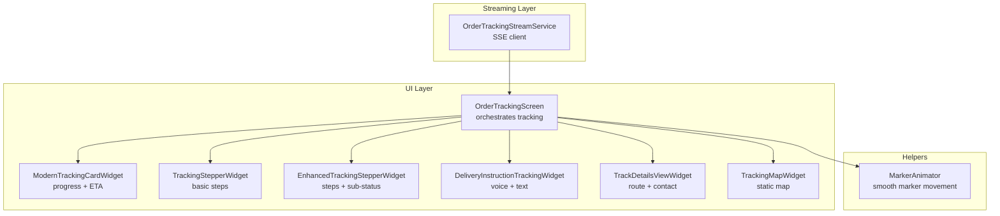
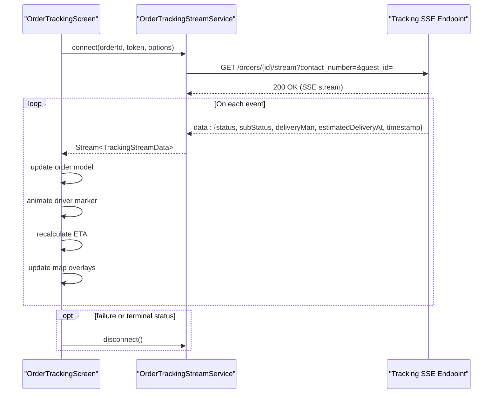
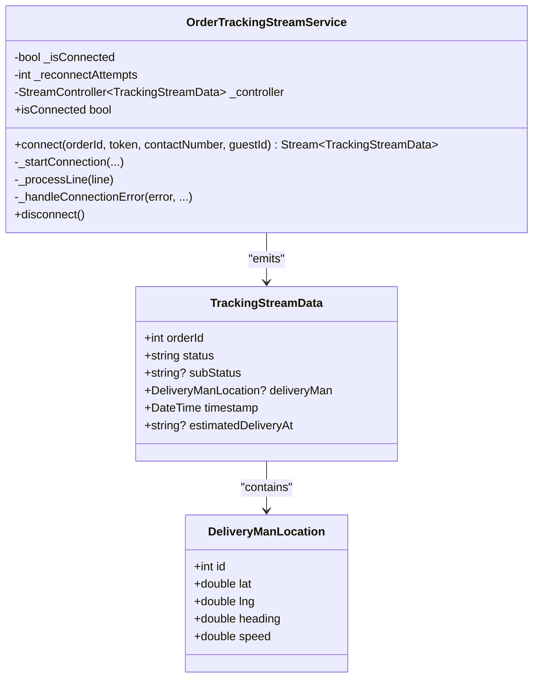
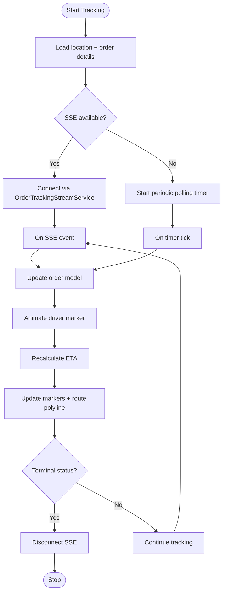
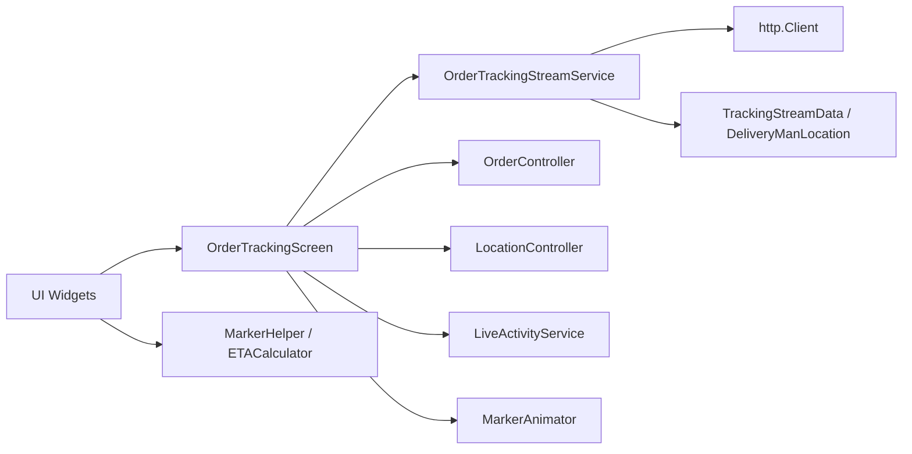

# Order Tracking

<cite>
**Referenced Files in This Document**
- [order_tracking_stream_service.dart](file://lib/features/order/domain/services/order_tracking_stream_service.dart)
- [order_tracking_screen.dart](file://lib/features/order/screens/order_tracking_screen.dart)
- [tracking_stepper_widget.dart](file://lib/features/order/widgets/tracking_stepper_widget.dart)
- [enhanced_tracking_stepper_widget.dart](file://lib/features/order/widgets/enhanced_tracking_stepper_widget.dart)
- [traking_map_widget.dart](file://lib/features/order/widgets/traking_map_widget.dart)
- [modern_tracking_card_widget.dart](file://lib/features/order/widgets/modern_tracking_card_widget.dart)
- [delivery_instruction_tracking_widget.dart](file://lib/features/order/widgets/delivery_instruction_tracking_widget.dart)
- [track_details_view_widget.dart](file://lib/features/order/widgets/track_details_view_widget.dart)
- [marker_animator.dart](file://lib/helper/marker_animator.dart)
</cite>

## Table of Contents
1. [Introduction](#introduction)
2. [Project Structure](#project-structure)
3. [Core Components](#core-components)
4. [Architecture Overview](#architecture-overview)
5. [Detailed Component Analysis](#detailed-component-analysis)
6. [Dependency Analysis](#dependency-analysis)
7. [Performance Considerations](#performance-considerations)
8. [Troubleshooting Guide](#troubleshooting-guide)
9. [Conclusion](#conclusion)
10. [Appendices](#appendices)

## Introduction
This document explains the real-time order tracking system, focusing on the OrderTrackingStreamService implementation, WebSocket/SSE-based streaming, live location tracking, and the tracking UI. It covers how driver location updates are received, how ETA is calculated, how the route is visualized on a map, and how the UI components present order progress. It also documents fallback mechanisms, permissions handling, map marker animations, and operational considerations such as accuracy and background limitations.

## Project Structure
The tracking system spans a service layer for streaming updates, a screen that orchestrates UI and map rendering, and reusable widgets for progress visualization and map overlays.

**Diagram sources**
- [order_tracking_stream_service.dart:67-259](file://lib/features/order/domain/services/order_tracking_stream_service.dart#L67-L259)
- [order_tracking_screen.dart:40-1122](file://lib/features/order/screens/order_tracking_screen.dart#L40-L1122)
- [modern_tracking_card_widget.dart:6-484](file://lib/features/order/widgets/modern_tracking_card_widget.dart#L6-L484)
- [tracking_stepper_widget.dart:6-54](file://lib/features/order/widgets/tracking_stepper_widget.dart#L6-L54)
- [enhanced_tracking_stepper_widget.dart:17-176](file://lib/features/order/widgets/enhanced_tracking_stepper_widget.dart#L17-L176)
- [delivery_instruction_tracking_widget.dart:9-136](file://lib/features/order/widgets/delivery_instruction_tracking_widget.dart#L9-L136)
- [track_details_view_widget.dart:17-331](file://lib/features/order/widgets/track_details_view_widget.dart#L17-L331)
- [traking_map_widget.dart:21-226](file://lib/features/order/widgets/traking_map_widget.dart#L21-L226)
- [marker_animator.dart:6-107](file://lib/helper/marker_animator.dart#L6-L107)

**Section sources**
- [order_tracking_stream_service.dart:67-259](file://lib/features/order/domain/services/order_tracking_stream_service.dart#L67-L259)
- [order_tracking_screen.dart:40-1122](file://lib/features/order/screens/order_tracking_screen.dart#L40-L1122)

## Core Components
- OrderTrackingStreamService: Implements server-sent events (SSE) to receive real-time order updates, including status, sub-status, driver location, and estimated delivery time. Includes automatic reconnect logic with backoff.
- OrderTrackingScreen: Orchestrates SSE connection, updates UI state, animates driver marker movement, calculates ETA, and renders map overlays (markers, route polyline).
- ModernTrackingCardWidget: Presents a modernized progress card with status icon, progress bar, step indicators, and live ETA.
- TrackingStepperWidget and EnhancedTrackingStepperWidget: Visualize order progress as a stepper with optional sub-status details and ETA hints.
- DeliveryInstructionTrackingWidget: Displays voice and textual delivery instructions when applicable.
- TrackDetailsViewWidget: Shows trip route, distance, driver/store info, and quick actions (call, chat).
- TrackingMapWidget: A compact map view for static tracking scenarios.
- MarkerAnimator: Provides smooth interpolation and rotation for moving map markers.

**Section sources**
- [order_tracking_stream_service.dart:67-259](file://lib/features/order/domain/services/order_tracking_stream_service.dart#L67-L259)
- [order_tracking_screen.dart:40-1122](file://lib/features/order/screens/order_tracking_screen.dart#L40-L1122)
- [modern_tracking_card_widget.dart:6-484](file://lib/features/order/widgets/modern_tracking_card_widget.dart#L6-L484)
- [tracking_stepper_widget.dart:6-54](file://lib/features/order/widgets/tracking_stepper_widget.dart#L6-L54)
- [enhanced_tracking_stepper_widget.dart:17-176](file://lib/features/order/widgets/enhanced_tracking_stepper_widget.dart#L17-L176)
- [delivery_instruction_tracking_widget.dart:9-136](file://lib/features/order/widgets/delivery_instruction_tracking_widget.dart#L9-L136)
- [track_details_view_widget.dart:17-331](file://lib/features/order/widgets/track_details_view_widget.dart#L17-L331)
- [traking_map_widget.dart:21-226](file://lib/features/order/widgets/traking_map_widget.dart#L21-L226)
- [marker_animator.dart:6-107](file://lib/helper/marker_animator.dart#L6-L107)

## Architecture Overview
The tracking architecture uses an SSE-based streaming service to continuously receive updates from the backend. The UI reacts to each event by updating the order model, animating the driver marker, recalculating ETA, and refreshing map overlays. A fallback polling mechanism ensures continuity if SSE fails.

**Diagram sources**
- [order_tracking_stream_service.dart:77-192](file://lib/features/order/domain/services/order_tracking_stream_service.dart#L77-L192)
- [order_tracking_screen.dart:95-187](file://lib/features/order/screens/order_tracking_screen.dart#L95-L187)

## Detailed Component Analysis

### OrderTrackingStreamService
- Responsibilities:
  - Establishes an SSE connection to the backend endpoint.
  - Parses incoming JSON lines into a typed model.
  - Manages reconnection with exponential backoff and a maximum retry limit.
  - Emits errors and closes resources cleanly on disconnect.
- Data model:
  - TrackingStreamData: includes order ID, status, sub-status, delivery man location, timestamp, and estimated delivery time.
  - DeliveryManLocation: includes driver coordinates, heading, and speed.
- Behavior:
  - Builds query parameters for guest or contact-based tracking.
  - Sets appropriate headers and handles non-200 responses.
  - Transforms the byte stream into lines and decodes JSON.
  - Emits parsed data to subscribers and logs errors.

**Diagram sources**
- [order_tracking_stream_service.dart:67-259](file://lib/features/order/domain/services/order_tracking_stream_service.dart#L67-L259)

**Section sources**
- [order_tracking_stream_service.dart:67-259](file://lib/features/order/domain/services/order_tracking_stream_service.dart#L67-L259)

### OrderTrackingScreen
- Responsibilities:
  - Initializes tracking by fetching current location and order details.
  - Starts SSE tracking; falls back to periodic polling if SSE fails.
  - Updates the order model upon receiving SSE events.
  - Animates driver marker movement and updates rotation based on bearing.
  - Calculates ETA using driver-to-destination distance.
  - Renders map markers (store, driver, destination) and a dashed route polyline.
  - Handles lifecycle changes (pause/resume) to manage timers and map disposal.
  - Integrates with Live Activities to reflect status changes.
- Key flows:
  - SSE update handling: update status/sub-status, driver position, ETA, and Live Activity.
  - Marker animation: uses MarkerAnimator to interpolate between positions with rotation.
  - Route polyline: constructs a three-point route (store → driver → destination).
  - Permissions: checks and requests location permission before centering on user location.

**Diagram sources**
- [order_tracking_screen.dart:70-385](file://lib/features/order/screens/order_tracking_screen.dart#L70-L385)
- [marker_animator.dart:11-71](file://lib/helper/marker_animator.dart#L11-L71)

**Section sources**
- [order_tracking_screen.dart:70-385](file://lib/features/order/screens/order_tracking_screen.dart#L70-L385)
- [marker_animator.dart:11-71](file://lib/helper/marker_animator.dart#L11-L71)

### UI Components

#### ModernTrackingCardWidget
- Displays order status with animated icon, progress bar, and step indicators.
- Shows live ETA when available and driver/store information.
- Uses gradient and glassmorphism styling for modern appearance.

**Section sources**
- [modern_tracking_card_widget.dart:6-484](file://lib/features/order/widgets/modern_tracking_card_widget.dart#L6-L484)

#### TrackingStepperWidget
- Visualizes order progress through five steps: placed, confirmed, preparing, on-way/delivered.
- Adapts “on-way” label for take-away vs delivery orders.

**Section sources**
- [tracking_stepper_widget.dart:6-54](file://lib/features/order/widgets/tracking_stepper_widget.dart#L6-L54)

#### EnhancedTrackingStepperWidget
- Extends the stepper to include sub-status details (preparing, packaging, ready, en-route, nearby, arrived).
- Shows ETA in the “on-way” step and pulses the current step indicator.

**Section sources**
- [enhanced_tracking_stepper_widget.dart:17-176](file://lib/features/order/widgets/enhanced_tracking_stepper_widget.dart#L17-L176)

#### DeliveryInstructionTrackingWidget
- Renders voice instructions and textual delivery hints when present and order is in active statuses.
- Provides icons mapped to instruction keywords.

**Section sources**
- [delivery_instruction_tracking_widget.dart:9-136](file://lib/features/order/widgets/delivery_instruction_tracking_widget.dart#L9-L136)

#### TrackDetailsViewWidget
- Shows trip route, distance, and contact info for driver or store.
- Offers quick actions: directions (take-away), call, and optional chat.

**Section sources**
- [track_details_view_widget.dart:17-331](file://lib/features/order/widgets/track_details_view_widget.dart#L17-L331)

#### TrackingMapWidget
- Provides a compact map view for static tracking scenarios.
- Sets markers for store/receiver, driver, and destination; centers camera and adjusts zoom.

**Section sources**
- [traking_map_widget.dart:21-226](file://lib/features/order/widgets/traking_map_widget.dart#L21-L226)

### Map Integration and Route Visualization
- Markers:
  - Store/Receiver, Driver (animated), Destination/Current Location.
- Route polyline:
  - Dashed line connecting store → driver → destination.
- Camera behavior:
  - Centers and zooms to fit all points; adjusts rotation based on relative positions.
- Permissions:
  - Requests location permission before centering on user location.

**Section sources**
- [order_tracking_screen.dart:237-282](file://lib/features/order/screens/order_tracking_screen.dart#L237-L282)
- [order_tracking_screen.dart:699-898](file://lib/features/order/screens/order_tracking_screen.dart#L699-L898)
- [order_tracking_screen.dart:1108-1120](file://lib/features/order/screens/order_tracking_screen.dart#L1108-L1120)

### Driver Location Updates and ETA Calculation
- SSE events carry driver coordinates and estimated delivery time.
- ETA is recalculated using driver-to-destination distance and a helper calculator.
- Marker rotation is derived from bearing between previous and current positions.

**Section sources**
- [order_tracking_screen.dart:120-187](file://lib/features/order/screens/order_tracking_screen.dart#L120-L187)
- [order_tracking_screen.dart:189-204](file://lib/features/order/screens/order_tracking_screen.dart#L189-L204)
- [marker_animator.dart:73-83](file://lib/helper/marker_animator.dart#L73-L83)

### Push Notifications and Live Activities
- Live Activity updates are triggered based on SSE status updates.
- Terminal statuses end the activity; otherwise, the activity is updated with current status, ETA, and identifiers.

**Section sources**
- [order_tracking_screen.dart:160-179](file://lib/features/order/screens/order_tracking_screen.dart#L160-L179)

### Offline Tracking Capabilities
- Fallback to polling:
  - If SSE fails, the screen switches to a periodic timer that refreshes order details.
  - Timer resumes on app foreground and cancels on pause/dispose.

**Section sources**
- [order_tracking_screen.dart:94-118](file://lib/features/order/screens/order_tracking_screen.dart#L94-L118)
- [order_tracking_screen.dart:330-385](file://lib/features/order/screens/order_tracking_screen.dart#L330-L385)

## Dependency Analysis
- Streaming service depends on HTTP client and SSE parsing.
- Screen depends on:
  - Order controller for order model and timer-based polling.
  - Location controller for current position.
  - Live activity service for status updates.
  - Helper utilities for marker conversion, animation, and route calculation.
- Widgets depend on shared theming and responsive helpers.

**Diagram sources**
- [order_tracking_stream_service.dart:67-259](file://lib/features/order/domain/services/order_tracking_stream_service.dart#L67-L259)
- [order_tracking_screen.dart:40-1122](file://lib/features/order/screens/order_tracking_screen.dart#L40-L1122)

**Section sources**
- [order_tracking_stream_service.dart:67-259](file://lib/features/order/domain/services/order_tracking_stream_service.dart#L67-L259)
- [order_tracking_screen.dart:40-1122](file://lib/features/order/screens/order_tracking_screen.dart#L40-L1122)

## Performance Considerations
- Streaming efficiency:
  - SSE reduces overhead compared to frequent polling; reconnect logic prevents resource thrashing.
- Rendering:
  - Animated marker updates occur on each event; batching updates can reduce UI churn if needed.
- Map operations:
  - Recomputing route polyline and camera bounds on each update is efficient but can be optimized by thresholding updates when positions change minimally.
- Battery and background:
  - Frequent timers and location requests can drain battery; consider reducing frequency or pausing timers when the app is not visible.
  - Background tracking is constrained by platform policies; prefer foreground tracking with SSE and controlled polling.

[No sources needed since this section provides general guidance]

## Troubleshooting Guide
- SSE connection failures:
  - Verify endpoint URL and query parameters; check network connectivity and server-side streaming availability.
  - Inspect error logs emitted by the service and ensure reconnection attempts are respected.
- No updates after connection:
  - Confirm the order ID and token are valid; ensure the backend emits events for the given order.
- Map markers not appearing:
  - Check that store, driver, and destination coordinates are present; verify marker creation and camera bounds logic.
- ETA not updating:
  - Ensure driver coordinates are included in events; confirm distance calculation and ETA computation paths.
- Permissions denied:
  - Prompt users to enable location access; provide guidance for enabling permissions when permanently denied.

**Section sources**
- [order_tracking_stream_service.dart:135-144](file://lib/features/order/domain/services/order_tracking_stream_service.dart#L135-L144)
- [order_tracking_screen.dart:1108-1120](file://lib/features/order/screens/order_tracking_screen.dart#L1108-L1120)

## Conclusion
The order tracking system combines a robust SSE streaming service with a responsive UI to deliver real-time visibility into order status, driver location, and ETA. The modular design allows for graceful degradation to polling, smooth map animations, and clear progress visualization. By following the recommended practices for accuracy, battery optimization, and background limitations, the system can maintain a high-quality user experience across platforms.

[No sources needed since this section summarizes without analyzing specific files]

## Appendices

### Tracking Stepper States
- Basic stepper: placed → confirmed → preparing → on-way/delivered.
- Enhanced stepper: adds sub-status granularity and ETA hints in the “on-way” step.

**Section sources**
- [tracking_stepper_widget.dart:13-26](file://lib/features/order/widgets/tracking_stepper_widget.dart#L13-L26)
- [enhanced_tracking_stepper_widget.dart:106-140](file://lib/features/order/widgets/enhanced_tracking_stepper_widget.dart#L106-L140)

### Map Marker Animation Details
- Interpolation uses easing for smooth motion and computes bearing for rotation.
- Pending animations are queued to avoid conflicts.

**Section sources**
- [marker_animator.dart:11-71](file://lib/helper/marker_animator.dart#L11-L71)