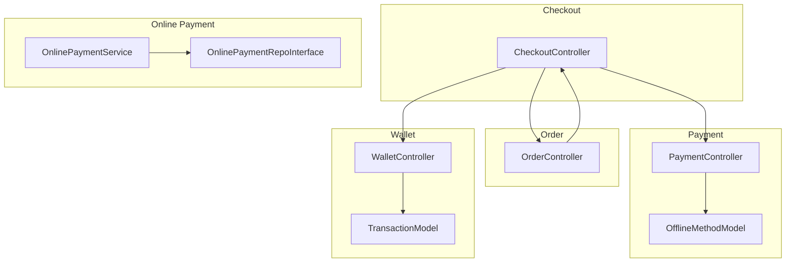
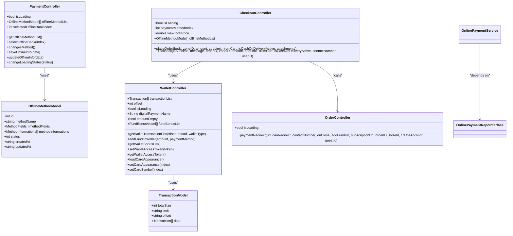
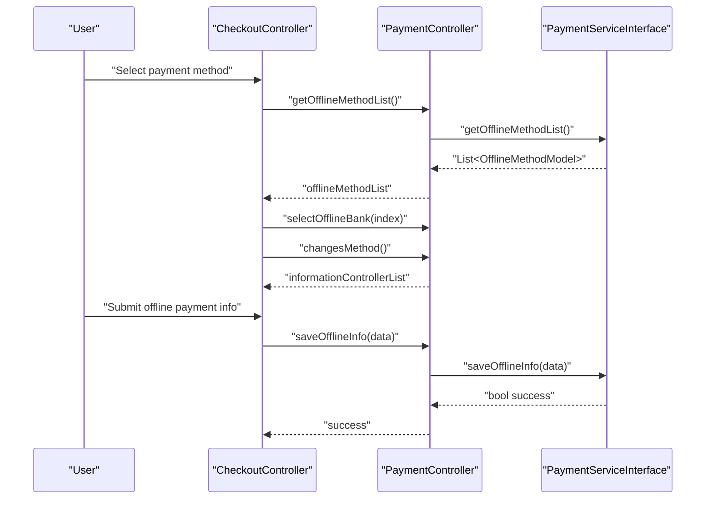
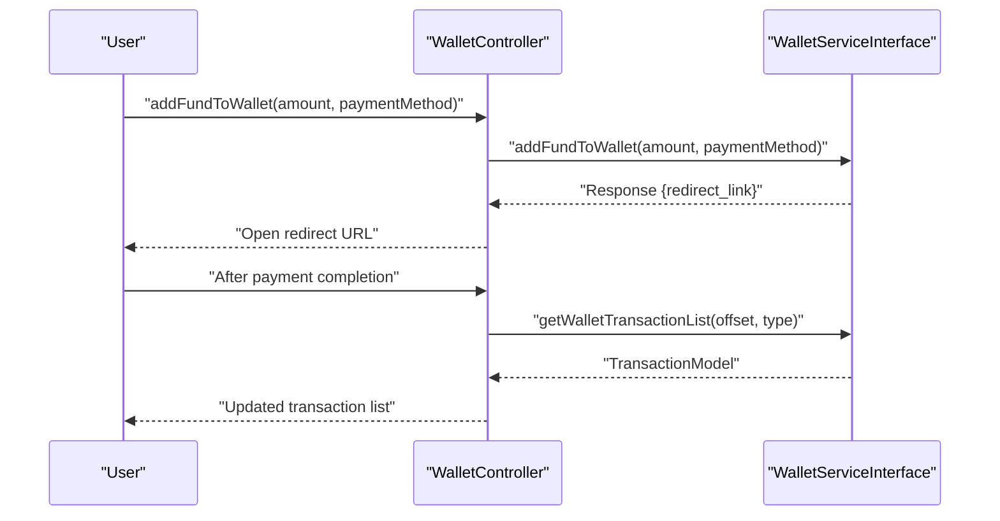
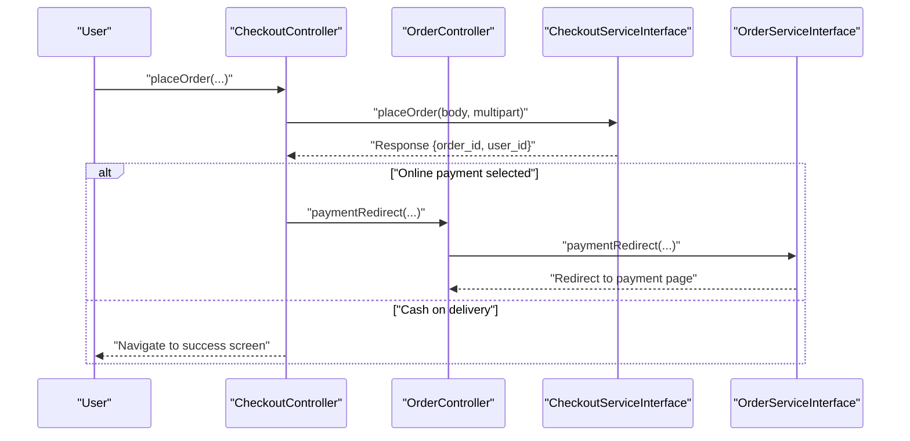
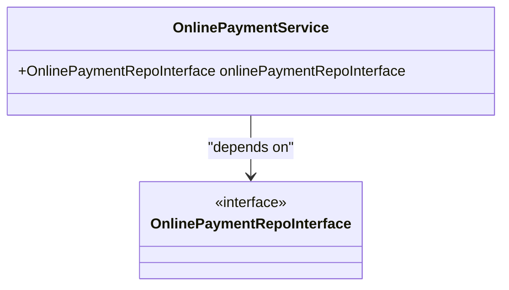
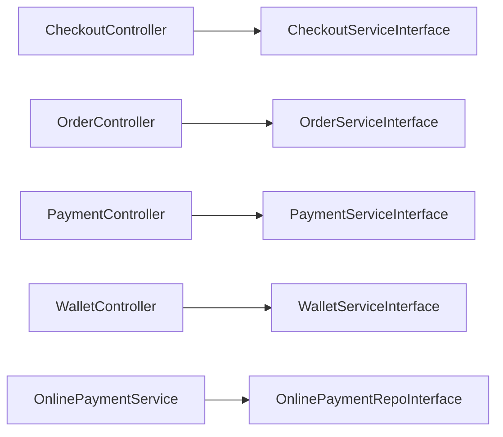

# Payment Integration

<cite>
**Referenced Files in This Document**
- [payment_controller.dart](file://lib/features/payment/controllers/payment_controller.dart)
- [payment_service_interface.dart](file://lib/features/payment/domain/services/payment_service_interface.dart)
- [offline_method_model.dart](file://lib/features/payment/domain/models/offline_method_model.dart)
- [wallet_controller.dart](file://lib/features/wallet/controllers/wallet_controller.dart)
- [wallet_service_interface.dart](file://lib/features/wallet/domain/services/wallet_service_interface.dart)
- [transaction_model.dart](file://lib/common/models/transaction_model.dart)
- [order_controller.dart](file://lib/features/order/controllers/order_controller.dart)
- [checkout_controller.dart](file://lib/features/checkout/controllers/checkout_controller.dart)
- [online_payment_service.dart](file://lib/features/online_payment/domain/services/online_payment_service.dart)
- [online_payment_repo_interface.dart](file://lib/features/online_payment/domain/repositories/online_payment_repo_interface.dart)
</cite>

## Table of Contents
1. [Introduction](#introduction)
2. [Project Structure](#project-structure)
3. [Core Components](#core-components)
4. [Architecture Overview](#architecture-overview)
5. [Detailed Component Analysis](#detailed-component-analysis)
6. [Dependency Analysis](#dependency-analysis)
7. [Performance Considerations](#performance-considerations)
8. [Troubleshooting Guide](#troubleshooting-guide)
9. [Conclusion](#conclusion)

## Introduction
This document explains the payment integration within the order management system. It covers how orders interact with payment processors, wallet systems, and transaction confirmations; how payment status synchronization and retries are handled; and how order placement integrates with payment processing, including pre-authentication flows and payment capture workflows. It also documents multi-method payment support, currency handling, security measures, and compliance considerations.

## Project Structure
The payment system spans several modules:
- Payment module: offline payment methods and UI controller
- Wallet module: funding, transactions, and card appearance/symbol preferences
- Checkout module: order placement, payment method selection, and payment redirection
- Order module: order tracking and payment-related callbacks
- Online payment module: service and repository abstractions for online payment flows

**Diagram sources**
- [checkout_controller.dart](file://lib/features/checkout/controllers/checkout_controller.dart)
- [order_controller.dart](file://lib/features/order/controllers/order_controller.dart)
- [payment_controller.dart](file://lib/features/payment/controllers/payment_controller.dart)
- [offline_method_model.dart](file://lib/features/payment/domain/models/offline_method_model.dart)
- [wallet_controller.dart](file://lib/features/wallet/controllers/wallet_controller.dart)
- [transaction_model.dart](file://lib/common/models/transaction_model.dart)
- [online_payment_service.dart](file://lib/features/online_payment/domain/services/online_payment_service.dart)
- [online_payment_repo_interface.dart](file://lib/features/online_payment/domain/repositories/online_payment_repo_interface.dart)

**Section sources**
- [checkout_controller.dart](file://lib/features/checkout/controllers/checkout_controller.dart)
- [order_controller.dart](file://lib/features/order/controllers/order_controller.dart)
- [payment_controller.dart](file://lib/features/payment/controllers/payment_controller.dart)
- [offline_method_model.dart](file://lib/features/payment/domain/models/offline_method_model.dart)
- [wallet_controller.dart](file://lib/features/wallet/controllers/wallet_controller.dart)
- [transaction_model.dart](file://lib/common/models/transaction_model.dart)
- [online_payment_service.dart](file://lib/features/online_payment/domain/services/online_payment_service.dart)
- [online_payment_repo_interface.dart](file://lib/features/online_payment/domain/repositories/online_payment_repo_interface.dart)

## Core Components
- PaymentController: Manages offline payment methods, selection, and saving/updating offline payment info.
- OfflineMethodModel: Data model for offline payment methods and their required fields.
- WalletController: Handles wallet funding via redirects, transaction listing, and bonus retrieval.
- TransactionModel: Describes wallet transactions and balances.
- CheckoutController: Orchestrates order placement, payment method selection, and payment redirection.
- OrderController: Provides payment redirection callback and order tracking.
- OnlinePaymentService and OnlinePaymentRepoInterface: Abstractions for online payment flows.

**Section sources**
- [payment_controller.dart](file://lib/features/payment/controllers/payment_controller.dart)
- [offline_method_model.dart](file://lib/features/payment/domain/models/offline_method_model.dart)
- [wallet_controller.dart](file://lib/features/wallet/controllers/wallet_controller.dart)
- [transaction_model.dart](file://lib/common/models/transaction_model.dart)
- [checkout_controller.dart](file://lib/features/checkout/controllers/checkout_controller.dart)
- [order_controller.dart](file://lib/features/order/controllers/order_controller.dart)
- [online_payment_service.dart](file://lib/features/online_payment/domain/services/online_payment_service.dart)
- [online_payment_repo_interface.dart](file://lib/features/online_payment/domain/repositories/online_payment_repo_interface.dart)

## Architecture Overview
The payment integration follows a layered architecture:
- Controllers orchestrate user actions and coordinate services.
- Services encapsulate external integrations (payment gateways, wallets).
- Models represent data structures for offline methods, transactions, and order metadata.
- Repositories abstract persistence and network calls for online payment flows.

**Diagram sources**
- [payment_controller.dart](file://lib/features/payment/controllers/payment_controller.dart)
- [offline_method_model.dart](file://lib/features/payment/domain/models/offline_method_model.dart)
- [wallet_controller.dart](file://lib/features/wallet/controllers/wallet_controller.dart)
- [transaction_model.dart](file://lib/common/models/transaction_model.dart)
- [checkout_controller.dart](file://lib/features/checkout/controllers/checkout_controller.dart)
- [order_controller.dart](file://lib/features/order/controllers/order_controller.dart)
- [online_payment_service.dart](file://lib/features/online_payment/domain/services/online_payment_service.dart)
- [online_payment_repo_interface.dart](file://lib/features/online_payment/domain/repositories/online_payment_repo_interface.dart)

## Detailed Component Analysis

### Offline Payment Methods
Offline payment methods are fetched and presented during checkout. The controller manages selection and collects required customer inputs defined by the method model.

**Diagram sources**
- [checkout_controller.dart](file://lib/features/checkout/controllers/checkout_controller.dart)
- [payment_controller.dart](file://lib/features/payment/controllers/payment_controller.dart)
- [payment_service_interface.dart](file://lib/features/payment/domain/services/payment_service_interface.dart)
- [offline_method_model.dart](file://lib/features/payment/domain/models/offline_method_model.dart)

**Section sources**
- [payment_controller.dart](file://lib/features/payment/controllers/payment_controller.dart)
- [offline_method_model.dart](file://lib/features/payment/domain/models/offline_method_model.dart)

### Wallet Funding and Transactions
Wallet funding initiates a redirect to a payment page. After successful payment, the system updates the transaction list and reflects the new balance.

**Diagram sources**
- [wallet_controller.dart](file://lib/features/wallet/controllers/wallet_controller.dart)
- [wallet_service_interface.dart](file://lib/features/wallet/domain/services/wallet_service_interface.dart)
- [transaction_model.dart](file://lib/common/models/transaction_model.dart)

**Section sources**
- [wallet_controller.dart](file://lib/features/wallet/controllers/wallet_controller.dart)
- [transaction_model.dart](file://lib/common/models/transaction_model.dart)

### Order Placement and Payment Redirection
Order placement triggers security checks and, depending on the selected payment method, either redirects to a payment page or completes the order immediately. The checkout controller coordinates the flow and handles callbacks.

**Diagram sources**
- [checkout_controller.dart](file://lib/features/checkout/controllers/checkout_controller.dart)
- [order_controller.dart](file://lib/features/order/controllers/order_controller.dart)

**Section sources**
- [checkout_controller.dart](file://lib/features/checkout/controllers/checkout_controller.dart)
- [order_controller.dart](file://lib/features/order/controllers/order_controller.dart)

### Pre-authentication and Capture Workflows
Pre-authentication and capture are supported through the online payment abstraction. The service depends on a repository interface that implements a generic repository pattern.

**Diagram sources**
- [online_payment_service.dart](file://lib/features/online_payment/domain/services/online_payment_service.dart)
- [online_payment_repo_interface.dart](file://lib/features/online_payment/domain/repositories/online_payment_repo_interface.dart)

**Section sources**
- [online_payment_service.dart](file://lib/features/online_payment/domain/services/online_payment_service.dart)
- [online_payment_repo_interface.dart](file://lib/features/online_payment/domain/repositories/online_payment_repo_interface.dart)

### Payment Status Synchronization and Retry Mechanisms
- Status synchronization: The checkout controller’s callback handles success/failure outcomes and navigates to appropriate screens. Wallet funding uses redirect links to finalize transactions.
- Retry mechanisms: The code does not expose explicit retry logic for payment failures. To implement retries, integrate with the payment provider’s webhook or polling API and update order/payment statuses accordingly.

[No sources needed since this section provides general guidance]

### Multi-Payment Method Support and Currency Handling
- Multi-method support: The checkout controller supports multiple payment methods, including cash on delivery and online payment selection. Offline payment methods are dynamically loaded.
- Currency handling: Amounts are passed as numeric values. Ensure backend and payment providers handle currency conversion and rounding consistently.

**Section sources**
- [checkout_controller.dart](file://lib/features/checkout/controllers/checkout_controller.dart)
- [offline_method_model.dart](file://lib/features/payment/domain/models/offline_method_model.dart)

### Security Measures and Compliance
- Idempotency keys and signatures: The checkout controller generates an idempotency key and order signature, and attaches device fingerprinting to prevent replay attacks and ensure order integrity.
- Compliance: Implement PCI DSS-compliant handling of cardholder data, secure storage of tokens, and adherence to regional regulations (e.g., Strong Customer Authentication where applicable).

**Section sources**
- [checkout_controller.dart](file://lib/features/checkout/controllers/checkout_controller.dart)

## Dependency Analysis
Controllers depend on service interfaces, which abstract external integrations. The online payment service depends on a repository interface, enabling testability and pluggable implementations.

**Diagram sources**
- [checkout_controller.dart](file://lib/features/checkout/controllers/checkout_controller.dart)
- [order_controller.dart](file://lib/features/order/controllers/order_controller.dart)
- [payment_controller.dart](file://lib/features/payment/controllers/payment_controller.dart)
- [wallet_controller.dart](file://lib/features/wallet/controllers/wallet_controller.dart)
- [online_payment_service.dart](file://lib/features/online_payment/domain/services/online_payment_service.dart)
- [online_payment_repo_interface.dart](file://lib/features/online_payment/domain/repositories/online_payment_repo_interface.dart)

**Section sources**
- [checkout_controller.dart](file://lib/features/checkout/controllers/checkout_controller.dart)
- [order_controller.dart](file://lib/features/order/controllers/order_controller.dart)
- [payment_controller.dart](file://lib/features/payment/controllers/payment_controller.dart)
- [wallet_controller.dart](file://lib/features/wallet/controllers/wallet_controller.dart)
- [online_payment_service.dart](file://lib/features/online_payment/domain/services/online_payment_service.dart)
- [online_payment_repo_interface.dart](file://lib/features/online_payment/domain/repositories/online_payment_repo_interface.dart)

## Performance Considerations
- Minimize UI updates: Batch updates using controller update() calls sparingly.
- Lazy loading: Load offline payment methods and wallet transactions incrementally.
- Caching: Reuse order details where possible to reduce redundant network calls.

[No sources needed since this section provides general guidance]

## Troubleshooting Guide
- Payment redirect loops: Verify redirect URLs and ensure the payment provider returns correct callbacks. Confirm that the order ID and user context are preserved across redirects.
- Offline payment submission errors: Validate required fields defined in the offline method model and ensure the service returns success indicators.
- Wallet funding failures: Confirm the redirect link is valid and accessible. On web platforms, ensure pop-ups/redirects are not blocked.

**Section sources**
- [checkout_controller.dart](file://lib/features/checkout/controllers/checkout_controller.dart)
- [payment_controller.dart](file://lib/features/payment/controllers/payment_controller.dart)
- [offline_method_model.dart](file://lib/features/payment/domain/models/offline_method_model.dart)
- [wallet_controller.dart](file://lib/features/wallet/controllers/wallet_controller.dart)

## Conclusion
The payment integration combines offline payment methods, wallet funding, and online payment redirection within a clean controller-service architecture. Security is enforced through idempotency, signatures, and device fingerprinting. Extending support for pre-auth/capture and robust retry mechanisms requires integrating with the payment provider’s webhooks or polling APIs and updating order/payment statuses accordingly.