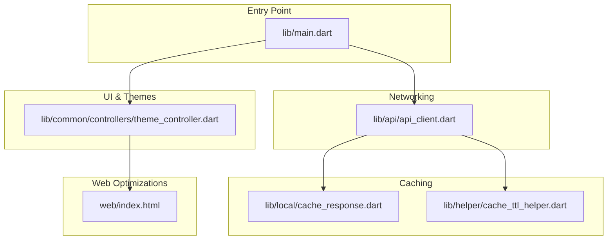
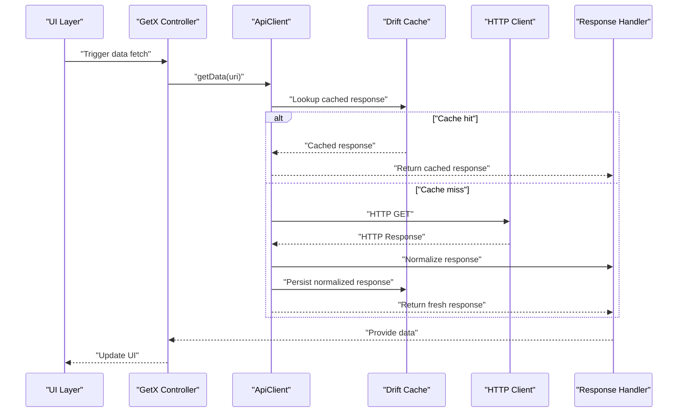
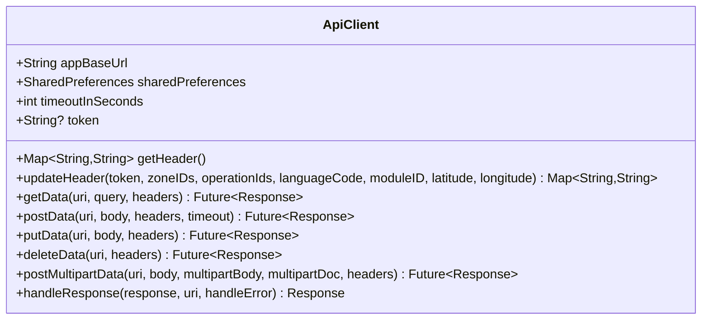
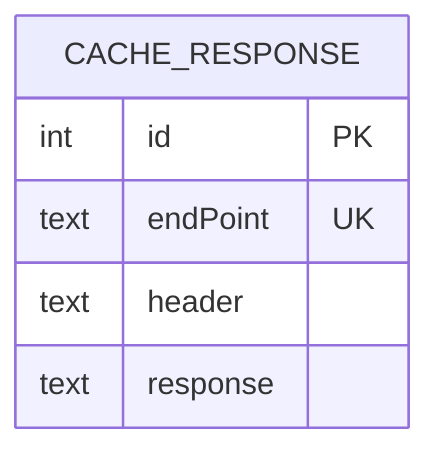
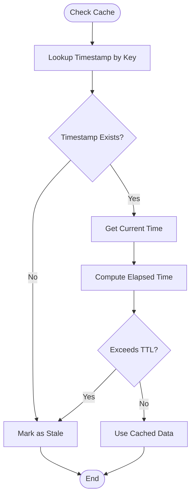
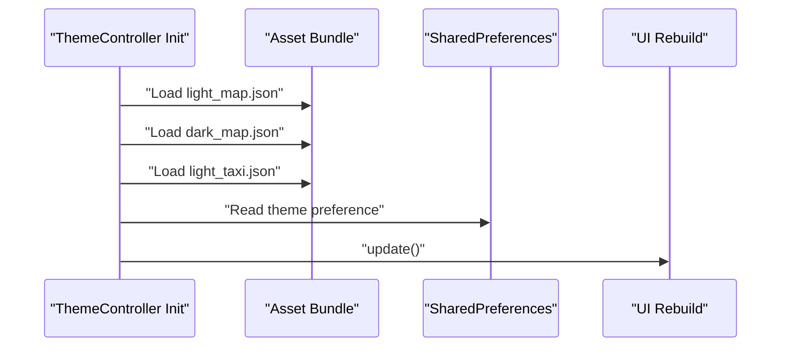
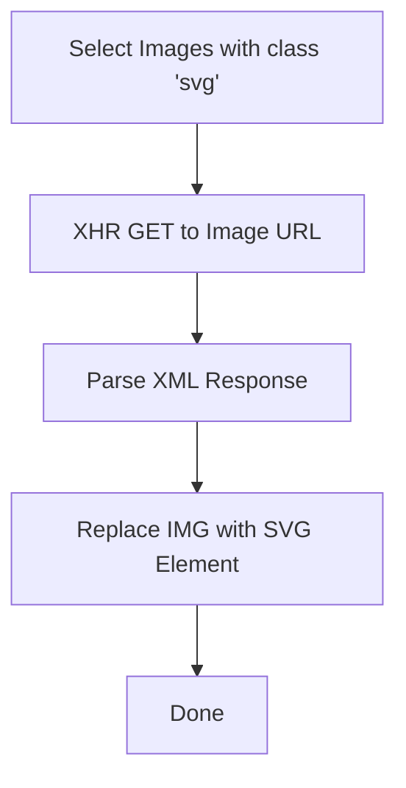
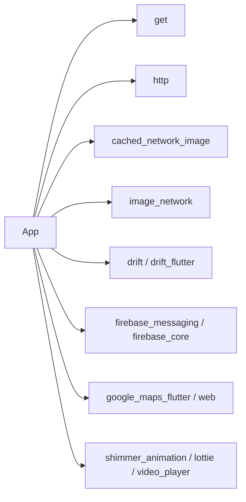

# Performance Optimization

<cite>
**Referenced Files in This Document**
- [pubspec.yaml](file://pubspec.yaml)
- [README.md](file://README.md)
- [lib/main.dart](file://lib/main.dart)
- [lib/api/api_client.dart](file://lib/api/api_client.dart)
- [lib/local/cache_response.dart](file://lib/local/cache_response.dart)
- [lib/helper/cache_ttl_helper.dart](file://lib/helper/cache_ttl_helper.dart)
- [lib/common/controllers/theme_controller.dart](file://lib/common/controllers/theme_controller.dart)
- [web/index.html](file://web/index.html)
</cite>

## Table of Contents
1. [Introduction](#introduction)
2. [Project Structure](#project-structure)
3. [Core Components](#core-components)
4. [Architecture Overview](#architecture-overview)
5. [Detailed Component Analysis](#detailed-component-analysis)
6. [Dependency Analysis](#dependency-analysis)
7. [Performance Considerations](#performance-considerations)
8. [Troubleshooting Guide](#troubleshooting-guide)
9. [Conclusion](#conclusion)
10. [Appendices](#appendices)

## Introduction
This document provides a comprehensive guide to performance optimization for the Flutter application. It focuses on memory management, image optimization, network efficiency, caching strategies, and Flutter-specific tuning. It also covers reactive programming best practices with GetX, lazy loading, asset optimization, bundle size reduction, profiling and monitoring, caching for API responses and images, UI responsiveness, cold start optimization, background processing efficiency, battery usage, and performance testing methodologies across device categories.

## Project Structure
The project follows a layered structure with clear separation of concerns:
- Entry point initializes Firebase, crash reporting, routing, and theme.
- API client encapsulates HTTP requests and response handling.
- Local caching leverages Drift for persistent cache storage.
- Helper utilities provide TTL-based cache invalidation.
- Theme controller loads map themes from assets.
- Web-specific optimizations include inline SVG replacement.

**Diagram sources**
- [lib/main.dart](file://lib/main.dart)
- [lib/api/api_client.dart](file://lib/api/api_client.dart)
- [lib/local/cache_response.dart](file://lib/local/cache_response.dart)
- [lib/helper/cache_ttl_helper.dart](file://lib/helper/cache_ttl_helper.dart)
- [lib/common/controllers/theme_controller.dart](file://lib/common/controllers/theme_controller.dart)
- [web/index.html](file://web/index.html)

**Section sources**
- [lib/main.dart](file://lib/main.dart)
- [pubspec.yaml](file://pubspec.yaml)

## Core Components
- Network layer: centralized HTTP client with timeouts, header management, and response normalization.
- Local caching: Drift database-backed cache with TTL helpers for stale detection.
- Theme and assets: theme controller loads map themes from assets; web replaces images with inline SVGs.
- Entry point: initializes Firebase, crashlytics, notifications, and routes.

Key performance-relevant aspects:
- Centralized API client reduces redundant network logic and improves maintainability.
- Drift cache supports fast reads and controlled updates.
- Theme loading from assets avoids runtime parsing overhead.
- Web SVG replacement reduces DOM bloat and improves render performance.

**Section sources**
- [lib/api/api_client.dart](file://lib/api/api_client.dart)
- [lib/local/cache_response.dart](file://lib/local/cache_response.dart)
- [lib/helper/cache_ttl_helper.dart](file://lib/helper/cache_ttl_helper.dart)
- [lib/common/controllers/theme_controller.dart](file://lib/common/controllers/theme_controller.dart)
- [web/index.html](file://web/index.html)

## Architecture Overview
The application architecture emphasizes reactive state via GetX, centralized networking, and local persistence. The flow below illustrates the typical request lifecycle and caching behavior.

**Diagram sources**
- [lib/api/api_client.dart](file://lib/api/api_client.dart)
- [lib/local/cache_response.dart](file://lib/local/cache_response.dart)

## Detailed Component Analysis

### API Client Analysis
The API client centralizes HTTP operations, header management, timeouts, and response handling. It:
- Applies global headers (zone, language, coordinates, auth).
- Supports GET, POST, PUT, DELETE, and multipart uploads.
- Normalizes responses and handles errors consistently.
- Provides configurable timeouts to prevent hanging requests.

**Diagram sources**
- [lib/api/api_client.dart](file://lib/api/api_client.dart)

**Section sources**
- [lib/api/api_client.dart](file://lib/api/api_client.dart)

### Local Caching with Drift
The Drift-based cache persists endpoint responses with unique keys and supports:
- Insert or update on conflict.
- Retrieval by endpoint.
- Bulk operations for maintenance.
- Schema migrations for safe upgrades.

**Diagram sources**
- [lib/local/cache_response.dart](file://lib/local/cache_response.dart)

**Section sources**
- [lib/local/cache_response.dart](file://lib/local/cache_response.dart)

### TTL-Based Cache Management
The TTL helper tracks freshness timestamps and invalidates entries after a configured duration. It supports:
- Marking entries as fresh.
- Checking staleness with customizable TTL per category.
- Global invalidation for maintenance.

**Diagram sources**
- [lib/helper/cache_ttl_helper.dart](file://lib/helper/cache_ttl_helper.dart)

**Section sources**
- [lib/helper/cache_ttl_helper.dart](file://lib/helper/cache_ttl_helper.dart)

### Theme Controller and Asset Loading
The theme controller:
- Loads map theme JSON from assets during initialization.
- Stores theme preferences and triggers UI rebuilds via GetX.
- Avoids repeated decoding by caching loaded strings.

**Diagram sources**
- [lib/common/controllers/theme_controller.dart](file://lib/common/controllers/theme_controller.dart)

**Section sources**
- [lib/common/controllers/theme_controller.dart](file://lib/common/controllers/theme_controller.dart)

### Web SVG Replacement
The web index performs inline SVG replacement for images with class "svg". This reduces external requests and improves rendering performance.

**Diagram sources**
- [web/index.html](file://web/index.html)

**Section sources**
- [web/index.html](file://web/index.html)

## Dependency Analysis
External dependencies impacting performance:
- Networking: http, cached_network_image, image_network.
- State: get.
- Persistence: drift, drift_flutter.
- Notifications: firebase_messaging, flutter_local_notifications.
- UI: shimmer_animation, lottie, video_player, chewie.
- Maps: google_maps_flutter, google_maps_flutter_web.
- Utilities: shared_preferences, connectivity_plus, geolocator.

**Diagram sources**
- [pubspec.yaml](file://pubspec.yaml)

**Section sources**
- [pubspec.yaml](file://pubspec.yaml)

## Performance Considerations

### Memory Management
- Prefer immutable models and avoid retaining large lists unnecessarily.
- Dispose of controllers and subscriptions when leaving screens.
- Use lazy loading for lists and grids to reduce peak memory.
- Avoid holding references to large bitmaps; use streaming decoders where possible.
- Monitor memory growth with DevTools and address leaks promptly.

### Image Optimization
- Use cached_network_image for efficient network image loading with placeholders and caching.
- Prefer vector graphics (SVG) for icons and simple illustrations; inline SVG replacement reduces DOM overhead.
- Compress and resize images at build time or server-side; avoid loading oversized assets.
- Use appropriate image formats (WebP where supported) and leverage hardware decoding.

### Network Efficiency
- Centralize HTTP logic in a single client to enforce timeouts and headers.
- Normalize responses and avoid unnecessary retries.
- Implement request deduplication to prevent duplicate network calls.
- Use gzip/HTTP/2 compression on the server; enable keep-alive on the client where feasible.

### Caching Strategies
- API Responses: Persist normalized responses in Drift with unique endpoint keys; combine with TTL checks for staleness.
- Images: Use cached_network_image with disk caching; invalidate on demand.
- User Data: Cache frequently accessed data locally; refresh asynchronously.

### Flutter-Specific Optimizations
- Use GetX for lightweight reactive state; avoid overusing rebuilds by scoping updates.
- Keep setState minimal; prefer GetBuilder for targeted updates.
- Use const constructors and immutable widgets where possible.
- Defer heavy work to isolates or background tasks.

### GetX Performance Tuning
- Scope controllers to pages to limit rebuild scope.
- Use bindings to initialize controllers lazily.
- Avoid global state bloat; segment state per feature.
- Use debounce for search inputs; throttle frequent updates.

### Reactive Programming Best Practices
- Minimize stream subscriptions; cancel in dispose.
- Use Rx streams judiciously; prefer simple GetX observables for UI state.
- Debounce or throttle high-frequency events (e.g., scroll, resize).

### Lazy Loading Implementation
- Implement virtual scrolling for long lists.
- Load images only when visible; use visibility callbacks.
- Defer non-critical data fetching until after initial render.

### Asset Optimization and Bundle Size Reduction
- Remove unused assets and fonts; keep only what is necessary.
- Compress images and use vector assets for scalable graphics.
- Split assets by feature and load on demand.
- Use tree shaking and minification in release builds.

### Profiling Tools and Monitoring
- Use Flutter DevTools for CPU, memory, and network profiling.
- Monitor frame rendering and identify jank frames.
- Track battery usage and background activity.
- Integrate Firebase Crashlytics for error monitoring.

### Cold Start Optimization
- Reduce main() work; defer non-critical initialization.
- Pre-warm caches and preload essential assets.
- Minimize third-party initialization in main(); initialize later.

### Background Processing and Battery Optimization
- Batch network requests and schedule periodic tasks.
- Use WorkManager/Background Fetch equivalents on native platforms.
- Avoid wake-ups; use efficient polling intervals.

### Performance Testing Methodologies
- Benchmark on low/mid/high-end devices; collect metrics across categories.
- Use automated tests to detect regressions in latency and memory.
- Measure startup time, first frame time, and scroll performance.

## Troubleshooting Guide
Common issues and remedies:
- Network timeouts: Increase timeout values and implement retry with exponential backoff.
- Stale data: Combine TTL checks with cache invalidation on user actions.
- Memory spikes: Identify retained lists and dispose controllers properly.
- Jank during animations: Offload heavy computations; use GPU-friendly widgets.

**Section sources**
- [lib/api/api_client.dart](file://lib/api/api_client.dart)
- [lib/local/cache_response.dart](file://lib/local/cache_response.dart)
- [lib/helper/cache_ttl_helper.dart](file://lib/helper/cache_ttl_helper.dart)

## Conclusion
By centralizing networking, leveraging local caching, optimizing assets, and applying Flutter-specific best practices, the application can achieve significant performance gains. Combine proactive profiling, targeted caching, and disciplined reactive programming to ensure responsive UI, reduced battery usage, and improved cold starts across device categories.

## Appendices

### Example Improvement Areas
- Implement request deduplication in the API client to avoid duplicate network calls.
- Add debounced search to reduce frequent API calls.
- Use lazy loading for product grids and banners.
- Optimize theme loading by caching decoded JSON structures.

### Checklist
- [ ] Centralize HTTP logic and enforce timeouts.
- [ ] Add TTL-based cache invalidation.
- [ ] Use cached_network_image for network images.
- [ ] Inline SVG replacement for web.
- [ ] Scope GetX rebuilds to necessary widgets.
- [ ] Profile with DevTools regularly.
- [ ] Test on diverse device categories.