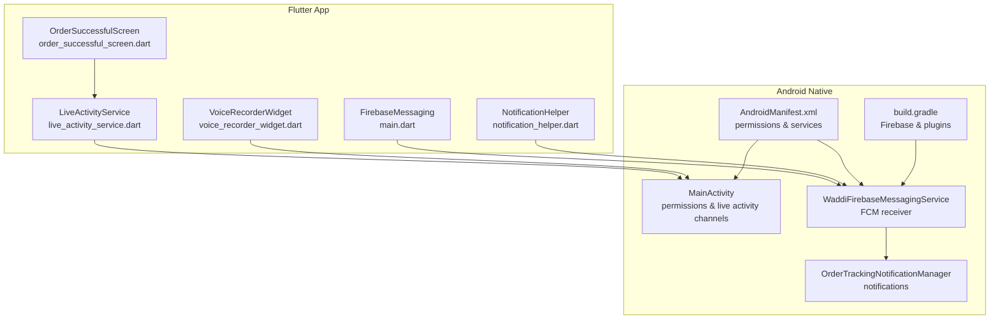
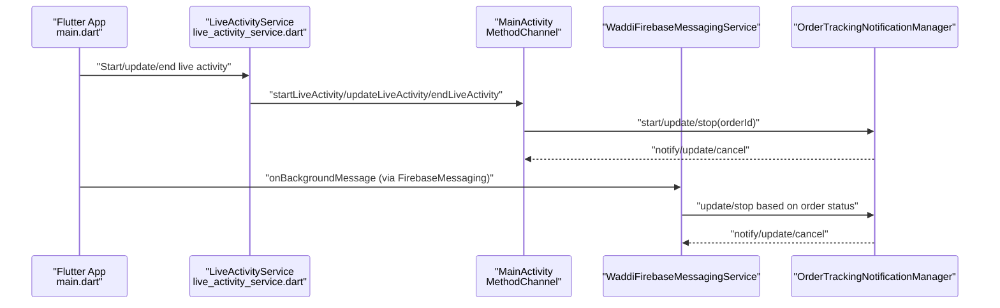
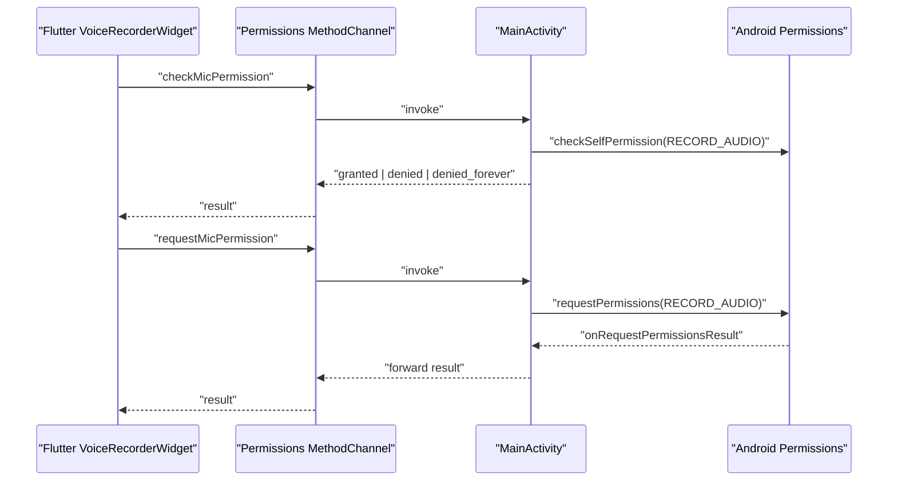
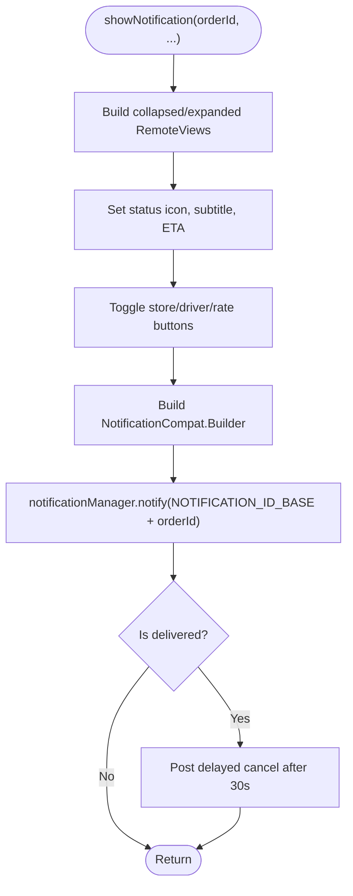
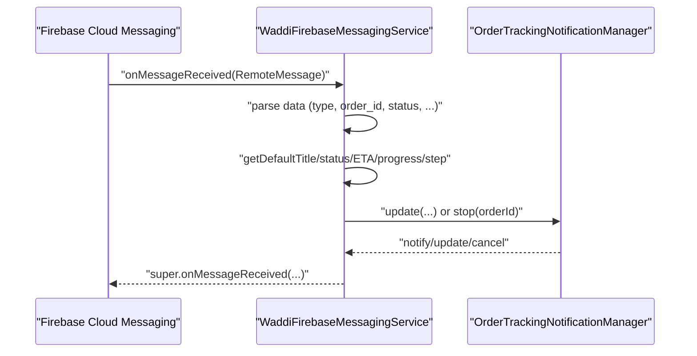
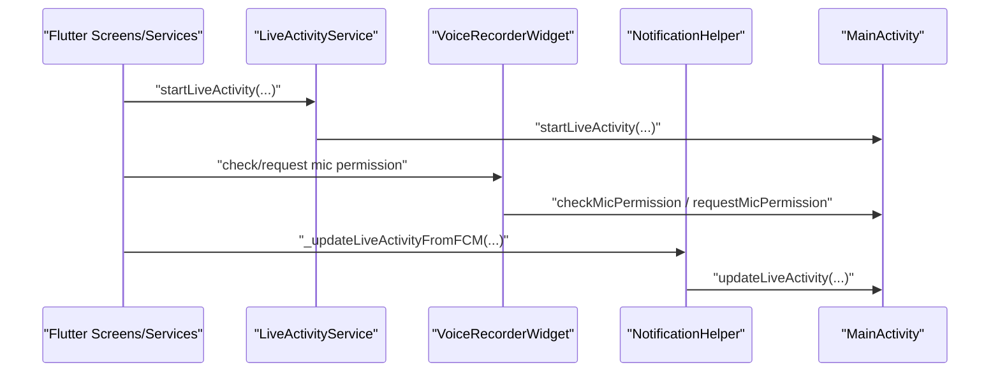
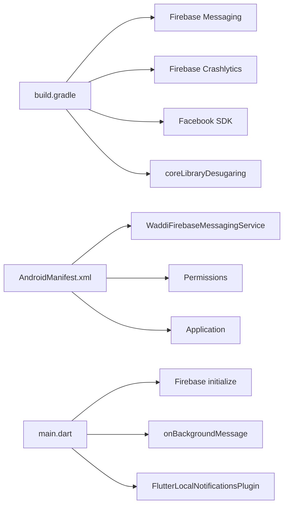

# Android Implementation

<cite>
**Referenced Files in This Document**
- [MainActivity.kt](file://android/app/src/main/kotlin/com/sixamtech/efood_multivendor/MainActivity.kt)
- [OrderTrackingNotificationManager.kt](file://android/app/src/main/kotlin/com/sixamtech/efood_multivendor/OrderTrackingNotificationManager.kt)
- [WaddiFirebaseMessagingService.kt](file://android/app/src/main/kotlin/com/sixamtech/efood_multivendor/WaddiFirebaseMessagingService.kt)
- [AndroidManifest.xml](file://android/app/src/main/AndroidManifest.xml)
- [build.gradle](file://android/app/build.gradle)
- [notification_order_tracking.xml](file://android/app/src/main/res/layout/notification_order_tracking.xml)
- [notification_order_tracking_expanded.xml](file://android/app/src/main/res/layout/notification_order_tracking_expanded.xml)
- [strings.xml](file://android/app/src/main/res/values/strings.xml)
- [google-services.json](file://android/app/google-services.json)
- [main.dart](file://lib/main.dart)
- [live_activity_service.dart](file://lib/services/live_activity_service.dart)
- [voice_recorder_widget.dart](file://lib/features/checkout/widgets/voice_recorder_widget.dart)
- [order_successful_screen.dart](file://lib/features/checkout/screens/order_successful_screen.dart)
- [notification_helper.dart](file://lib/helper/notification_helper.dart)
</cite>

## Table of Contents
1. [Introduction](#introduction)
2. [Project Structure](#project-structure)
3. [Core Components](#core-components)
4. [Architecture Overview](#architecture-overview)
5. [Detailed Component Analysis](#detailed-component-analysis)
6. [Dependency Analysis](#dependency-analysis)
7. [Performance Considerations](#performance-considerations)
8. [Troubleshooting Guide](#troubleshooting-guide)
9. [Conclusion](#conclusion)
10. [Appendices](#appendices)

## Introduction
This document explains the Android platform implementation for the Waddi user application. It focuses on the MainActivity.kt configuration, native permission handling, Flutter-Android integration via MethodChannels, live activity management for order tracking, and push notifications powered by Firebase. It also covers Android-specific build configurations, manifest permissions, notification channels, and background processing. Guidance is included for Android version compatibility, permission handling strategies, performance optimization, and troubleshooting common deployment issues.

## Project Structure
The Android module integrates tightly with Flutter through MethodChannels and native services. Key areas:
- Native entry point and permission bridge: MainActivity.kt
- Live order tracking notifications: OrderTrackingNotificationManager.kt
- Push notification handling: WaddiFirebaseMessagingService.kt
- Android manifest permissions and service declarations: AndroidManifest.xml
- Build configuration and Firebase integration: build.gradle and google-services.json
- Flutter-side integration points: main.dart, live_activity_service.dart, voice_recorder_widget.dart, order_successful_screen.dart, notification_helper.dart

**Diagram sources**
- [AndroidManifest.xml:1-111](file://android/app/src/main/AndroidManifest.xml#L1-L111)
- [build.gradle:1-86](file://android/app/build.gradle#L1-L86)
- [MainActivity.kt:11-108](file://android/app/src/main/kotlin/com/sixamtech/efood_multivendor/MainActivity.kt#L11-L108)
- [OrderTrackingNotificationManager.kt:13-195](file://android/app/src/main/kotlin/com/sixamtech/efood_multivendor/OrderTrackingNotificationManager.kt#L13-L195)
- [WaddiFirebaseMessagingService.kt:6-104](file://android/app/src/main/kotlin/com/sixamtech/efood_multivendor/WaddiFirebaseMessagingService.kt#L6-L104)
- [main.dart:35-103](file://lib/main.dart#L35-L103)
- [live_activity_service.dart:8-120](file://lib/services/live_activity_service.dart#L8-L120)
- [voice_recorder_widget.dart:109-183](file://lib/features/checkout/widgets/voice_recorder_widget.dart#L109-L183)
- [order_successful_screen.dart:78-141](file://lib/features/checkout/screens/order_successful_screen.dart#L78-L141)
- [notification_helper.dart:190-319](file://lib/helper/notification_helper.dart#L190-L319)

**Section sources**
- [AndroidManifest.xml:1-111](file://android/app/src/main/AndroidManifest.xml#L1-L111)
- [build.gradle:1-86](file://android/app/build.gradle#L1-L86)

## Core Components
- MainActivity.kt: Configures two MethodChannels:
  - Permissions channel for microphone audio recording permission checks and requests.
  - Live activity channel for starting, updating, and stopping order tracking notifications.
- OrderTrackingNotificationManager.kt: Manages a dedicated notification channel and displays collapsible/expanding notifications with progress visuals and optional actions.
- WaddiFirebaseMessagingService.kt: Processes incoming FCM messages, interprets order status updates, and delegates to the notification manager to update or dismiss notifications.
- AndroidManifest.xml: Declares required permissions, queries, and service registrations.
- build.gradle: Applies Flutter and Firebase Gradle plugins, sets compile/target SDK, signing config, and dependencies.

**Section sources**
- [MainActivity.kt:11-108](file://android/app/src/main/kotlin/com/sixamtech/efood_multivendor/MainActivity.kt#L11-L108)
- [OrderTrackingNotificationManager.kt:13-195](file://android/app/src/main/kotlin/com/sixamtech/efood_multivendor/OrderTrackingNotificationManager.kt#L13-L195)
- [WaddiFirebaseMessagingService.kt:6-104](file://android/app/src/main/kotlin/com/sixamtech/efood_multivendor/WaddiFirebaseMessagingService.kt#L6-L104)
- [AndroidManifest.xml:1-111](file://android/app/src/main/AndroidManifest.xml#L1-L111)
- [build.gradle:1-86](file://android/app/build.gradle#L1-L86)

## Architecture Overview
The system uses a hybrid Flutter-Android architecture:
- Flutter handles UI, app lifecycle, and Firebase initialization.
- Android native code bridges Flutter to Android APIs (permissions, notifications).
- FCM delivers order status updates to the device; the Android service translates them into live order tracking notifications.

**Diagram sources**
- [main.dart:89-90](file://lib/main.dart#L89-L90)
- [live_activity_service.dart:37-113](file://lib/services/live_activity_service.dart#L37-L113)
- [MainActivity.kt:50-91](file://android/app/src/main/kotlin/com/sixamtech/efood_multivendor/MainActivity.kt#L50-L91)
- [OrderTrackingNotificationManager.kt:55-87](file://android/app/src/main/kotlin/com/sixamtech/efood_multivendor/OrderTrackingNotificationManager.kt#L55-L87)
- [WaddiFirebaseMessagingService.kt:8-50](file://android/app/src/main/kotlin/com/sixamtech/efood_multivendor/WaddiFirebaseMessagingService.kt#L8-L50)

## Detailed Component Analysis

### MainActivity.kt: Flutter-Android Integration and Permission Bridge
Responsibilities:
- Registers MethodChannel handlers for:
  - Microphone permission checks and requests.
  - Live activity control (start, update, end) delegating to OrderTrackingNotificationManager.
- Implements permission result callback to report outcomes to Flutter.

Key behaviors:
- Permission channel:
  - checkMicPermission: Determines granted, denied, or denied forever states.
  - requestMicPermission: Requests RECORD_AUDIO and reports result asynchronously.
- Live activity channel:
  - startLiveActivity/updateLiveActivity/endLiveActivity: Parses arguments and invokes manager methods.
  - Uses a shared singleton manager instance for thread-safe access.

**Diagram sources**
- [voice_recorder_widget.dart:109-116](file://lib/features/checkout/widgets/voice_recorder_widget.dart#L109-L116)
- [MainActivity.kt:21-47](file://android/app/src/main/kotlin/com/sixamtech/efood_multivendor/MainActivity.kt#L21-L47)
- [MainActivity.kt:94-106](file://android/app/src/main/kotlin/com/sixamtech/efood_multivendor/MainActivity.kt#L94-L106)

**Section sources**
- [MainActivity.kt:11-108](file://android/app/src/main/kotlin/com/sixamtech/efood_multivendor/MainActivity.kt#L11-L108)
- [voice_recorder_widget.dart:109-183](file://lib/features/checkout/widgets/voice_recorder_widget.dart#L109-L183)

### OrderTrackingNotificationManager.kt: Live Activity Notifications
Responsibilities:
- Creates and manages a high-importance notification channel.
- Builds collapsible and expanded custom notification views.
- Starts, updates, and cancels notifications per order.
- Handles auto-dismiss for terminal statuses.

Implementation highlights:
- Singleton pattern with application context to prevent leaks.
- Custom RemoteViews for collapsed and expanded layouts.
- Progress visuals using proportional width adjustments.
- Conditional visibility for store name, delivery man info, and rate order action.
- Ongoing vs auto-cancel behavior based on delivery state.
- Auto-dismiss after 30 seconds when delivered.

**Diagram sources**
- [OrderTrackingNotificationManager.kt:89-181](file://android/app/src/main/kotlin/com/sixamtech/efood_multivendor/OrderTrackingNotificationManager.kt#L89-L181)
- [notification_order_tracking.xml:1-74](file://android/app/src/main/res/layout/notification_order_tracking.xml#L1-L74)
- [notification_order_tracking_expanded.xml:1-118](file://android/app/src/main/res/layout/notification_order_tracking_expanded.xml#L1-L118)

**Section sources**
- [OrderTrackingNotificationManager.kt:13-195](file://android/app/src/main/kotlin/com/sixamtech/efood_multivendor/OrderTrackingNotificationManager.kt#L13-L195)
- [notification_order_tracking.xml:1-74](file://android/app/src/main/res/layout/notification_order_tracking.xml#L1-L74)
- [notification_order_tracking_expanded.xml:1-118](file://android/app/src/main/res/layout/notification_order_tracking_expanded.xml#L1-L118)

### WaddiFirebaseMessagingService.kt: Push Notifications for Order Tracking
Responsibilities:
- Intercepts FCM messages and routes order status updates to the notification manager.
- Computes default titles/subtitles, ETA text, progress, and step based on status.
- Stops or updates notifications depending on terminal/non-terminal states.

**Diagram sources**
- [WaddiFirebaseMessagingService.kt:8-50](file://android/app/src/main/kotlin/com/sixamtech/efood_multivendor/WaddiFirebaseMessagingService.kt#L8-L50)
- [OrderTrackingNotificationManager.kt:70-87](file://android/app/src/main/kotlin/com/sixamtech/efood_multivendor/OrderTrackingNotificationManager.kt#L70-L87)

**Section sources**
- [WaddiFirebaseMessagingService.kt:6-104](file://android/app/src/main/kotlin/com/sixamtech/efood_multivendor/WaddiFirebaseMessagingService.kt#L6-L104)
- [notification_helper.dart:190-319](file://lib/helper/notification_helper.dart#L190-L319)

### Flutter-Android Integration Points
- Live activity service:
  - Starts, updates, and ends live activities by invoking MethodChannel methods in MainActivity.
- Voice recorder widget:
  - Checks and requests microphone permission via MethodChannel.
- Order successful screen:
  - Initiates live activity and polling flows.
- Notification helper:
  - Bridges FCM data to live activity updates.

**Diagram sources**
- [live_activity_service.dart:37-113](file://lib/services/live_activity_service.dart#L37-L113)
- [voice_recorder_widget.dart:109-116](file://lib/features/checkout/widgets/voice_recorder_widget.dart#L109-L116)
- [order_successful_screen.dart:78-141](file://lib/features/checkout/screens/order_successful_screen.dart#L78-L141)
- [notification_helper.dart:190-319](file://lib/helper/notification_helper.dart#L190-L319)
- [MainActivity.kt:50-91](file://android/app/src/main/kotlin/com/sixamtech/efood_multivendor/MainActivity.kt#L50-L91)

**Section sources**
- [live_activity_service.dart:8-120](file://lib/services/live_activity_service.dart#L8-L120)
- [voice_recorder_widget.dart:109-183](file://lib/features/checkout/widgets/voice_recorder_widget.dart#L109-L183)
- [order_successful_screen.dart:78-141](file://lib/features/checkout/screens/order_successful_screen.dart#L78-L141)
- [notification_helper.dart:190-319](file://lib/helper/notification_helper.dart#L190-L319)

## Dependency Analysis
- Android build dependencies:
  - Firebase Messaging and Crashlytics plugins.
  - Facebook SDK dependency.
  - Desugaring for backward compatibility.
- Manifest dependencies:
  - INTERNET, ACCESS_FINE_LOCATION, ACCESS_COARSE_LOCATION, RECORD_AUDIO, POST_NOTIFICATIONS.
  - Service registration for WaddiFirebaseMessagingService.
- Flutter integration:
  - Firebase initialization with platform-specific options.
  - Background message handler registration.
  - Local notifications plugin initialization.

**Diagram sources**
- [build.gradle:81-85](file://android/app/build.gradle#L81-L85)
- [AndroidManifest.xml:8-12](file://android/app/src/main/AndroidManifest.xml#L8-L12)
- [AndroidManifest.xml:101-107](file://android/app/src/main/AndroidManifest.xml#L101-L107)
- [main.dart:65-76](file://lib/main.dart#L65-L76)
- [main.dart:89-90](file://lib/main.dart#L89-L90)

**Section sources**
- [build.gradle:81-85](file://android/app/build.gradle#L81-L85)
- [AndroidManifest.xml:8-12](file://android/app/src/main/AndroidManifest.xml#L8-L12)
- [AndroidManifest.xml:101-107](file://android/app/src/main/AndroidManifest.xml#L101-L107)
- [main.dart:65-76](file://lib/main.dart#L65-L76)
- [main.dart:89-90](file://lib/main.dart#L89-L90)

## Performance Considerations
- Notification rendering:
  - Use RemoteViews efficiently; avoid heavy images and excessive nested layouts.
  - Keep progress visuals lightweight; rely on simple drawables for progress backgrounds.
- Background processing:
  - Ensure FCM payload is minimal; compute defaults on the server or client as needed.
  - Debounce frequent updates to reduce notification churn.
- Memory and threading:
  - Singleton notification manager prevents redundant managers.
  - Use Handler.postDelayed for auto-dismiss only when necessary.
- Build optimizations:
  - Enable minification and keep resources shrunk for release builds.
  - MultiDex enabled to support large APKs.

[No sources needed since this section provides general guidance]

## Troubleshooting Guide
Common Android deployment and runtime issues:

- Missing permissions
  - Symptoms: Permission checks always deny or request fails.
  - Actions: Verify permissions in manifest and runtime checks in MainActivity. Ensure POST_NOTIFICATIONS is declared for Android 13+.
  
  **Section sources**
  - [AndroidManifest.xml:8-12](file://android/app/src/main/AndroidManifest.xml#L8-L12)
  - [MainActivity.kt:23-44](file://android/app/src/main/kotlin/com/sixamtech/efood_multivendor/MainActivity.kt#L23-L44)

- Notification not showing
  - Symptoms: No notification appears despite receiving FCM.
  - Actions: Confirm notification channel creation, importance level, and that the service is exported properly. Check notification ID base and grouping by orderId.

  **Section sources**
  - [OrderTrackingNotificationManager.kt:39-53](file://android/app/src/main/kotlin/com/sixamtech/efood_multivendor/OrderTrackingNotificationManager.kt#L39-L53)
  - [OrderTrackingNotificationManager.kt:160-171](file://android/app/src/main/kotlin/com/sixamtech/efood_multivendor/OrderTrackingNotificationManager.kt#L160-L171)
  - [AndroidManifest.xml:101-107](file://android/app/src/main/AndroidManifest.xml#L101-L107)

- FCM not received in background
  - Symptoms: Background messages ignored.
  - Actions: Ensure service registration and intent filter for MESSAGING_EVENT. Verify Firebase initialization and token retrieval.

  **Section sources**
  - [AndroidManifest.xml:101-107](file://android/app/src/main/AndroidManifest.xml#L101-L107)
  - [WaddiFirebaseMessagingService.kt:100-102](file://android/app/src/main/kotlin/com/sixamtech/efood_multivendor/WaddiFirebaseMessagingService.kt#L100-L102)
  - [main.dart:89-90](file://lib/main.dart#L89-L90)

- Live activity not updating
  - Symptoms: Order tracking does not reflect status changes.
  - Actions: Verify MethodChannel invocation from Flutter and argument parsing in MainActivity. Confirm notification manager receives update calls.

  **Section sources**
  - [live_activity_service.dart:37-113](file://lib/services/live_activity_service.dart#L37-L113)
  - [MainActivity.kt:50-91](file://android/app/src/main/kotlin/com/sixamtech/efood_multivendor/MainActivity.kt#L50-L91)
  - [OrderTrackingNotificationManager.kt:70-87](file://android/app/src/main/kotlin/com/sixamtech/efood_multivendor/OrderTrackingNotificationManager.kt#L70-L87)

- Debugging tips
  - Use adb logcat with tag "Firebase" and "Flutter".
  - Add logs around MethodChannel invocations and notification updates.
  - Test permission flows on devices with different Android versions.

[No sources needed since this section provides general guidance]

## Conclusion
The Android implementation integrates Flutter with native Android capabilities to deliver robust live order tracking and push notifications. MainActivity exposes permission and live activity controls via MethodChannels, while OrderTrackingNotificationManager renders rich notifications. WaddiFirebaseMessagingService processes FCM updates and coordinates with the notification manager. Proper manifest permissions, service declarations, and build configuration ensure reliable operation across Android versions.

[No sources needed since this section summarizes without analyzing specific files]

## Appendices

### Android Version Compatibility Notes
- Permissions:
  - RECORD_AUDIO requires explicit user consent; handle rationale and denial scenarios.
  - POST_NOTIFICATIONS introduced in Android 13; ensure runtime permission and appropriate handling.
- Notification channels:
  - Channels require Android O+; ensure channel creation before notifying.
- Foreground services:
  - Not currently used in the tracked code; if needed, declare and manage lifecycle carefully.

**Section sources**
- [AndroidManifest.xml:8-12](file://android/app/src/main/AndroidManifest.xml#L8-L12)
- [OrderTrackingNotificationManager.kt:39-53](file://android/app/src/main/kotlin/com/sixamtech/efood_multivendor/OrderTrackingNotificationManager.kt#L39-L53)

### Build and Configuration References
- Firebase configuration:
  - google-services.json defines project credentials for Android.
- Gradle plugins and dependencies:
  - Flutter, Kotlin, Google Services, Crashlytics, Firebase Messaging, Facebook SDK.

**Section sources**
- [google-services.json:1-29](file://android/app/google-services.json#L1-L29)
- [build.gradle:1-7](file://android/app/build.gradle#L1-L7)
- [build.gradle:81-85](file://android/app/build.gradle#L81-L85)