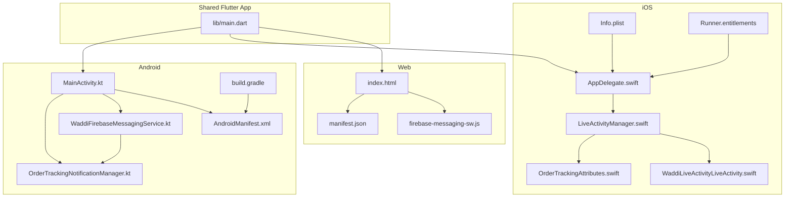
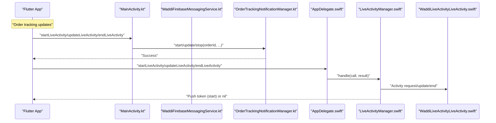
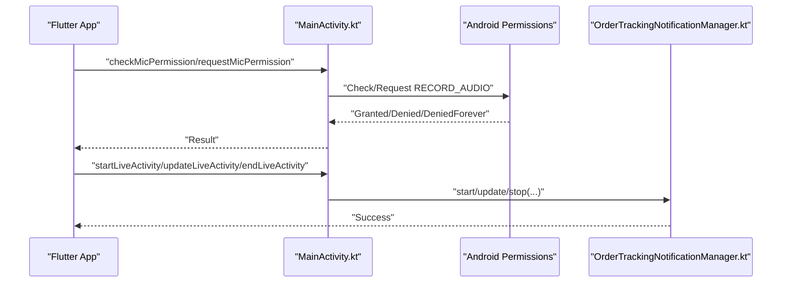
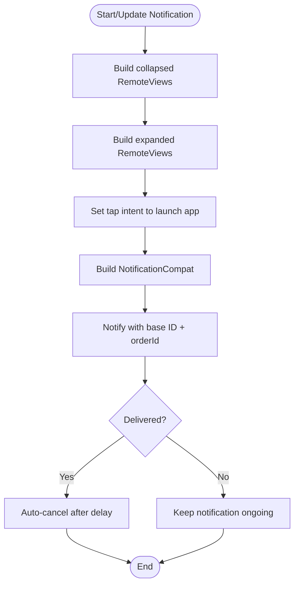
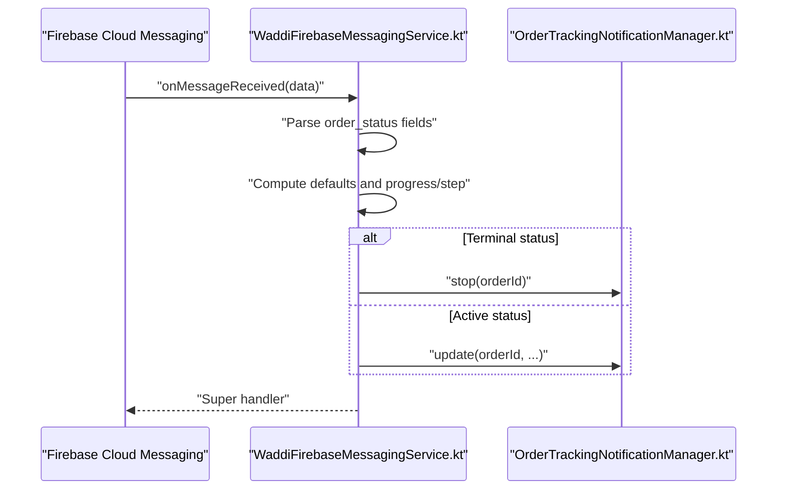
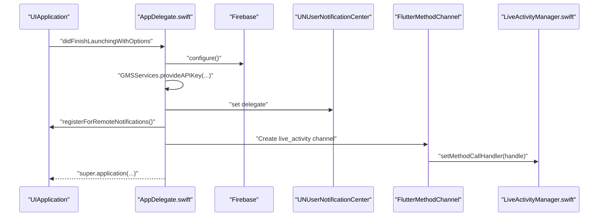
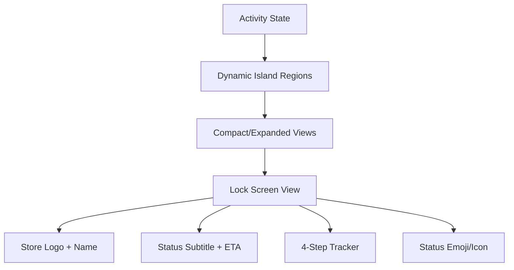
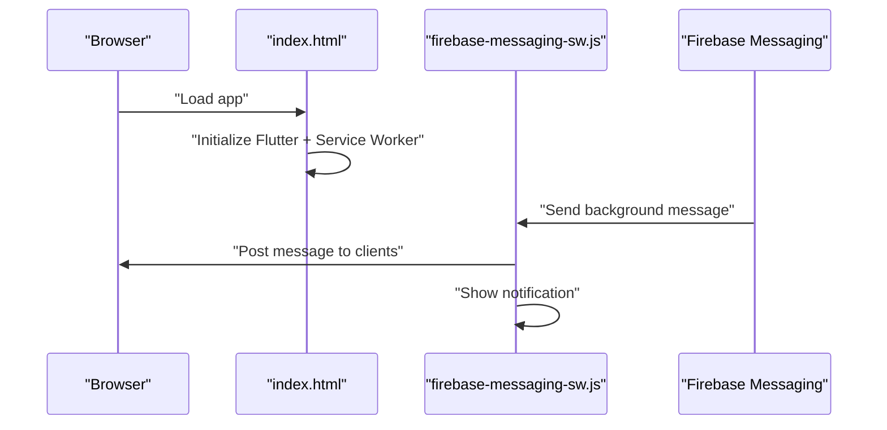
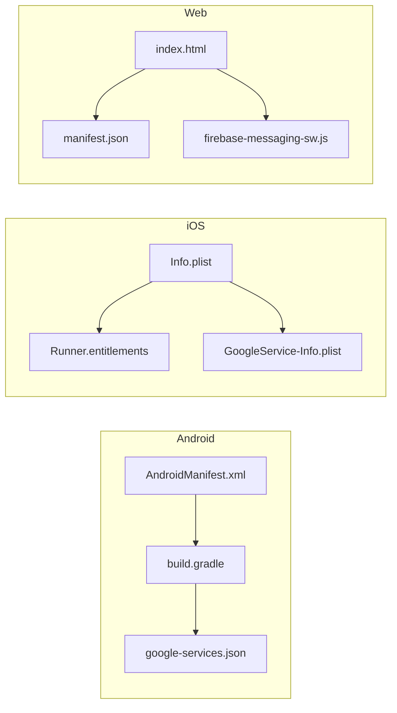

# Platform-Specific Implementation

<cite>
**Referenced Files in This Document**
- [MainActivity.kt](file://android/app/src/main/kotlin/com/sixamtech/efood_multivendor/MainActivity.kt)
- [OrderTrackingNotificationManager.kt](file://android/app/src/main/kotlin/com/sixamtech/efood_multivendor/OrderTrackingNotificationManager.kt)
- [WaddiFirebaseMessagingService.kt](file://android/app/src/main/kotlin/com/sixamtech/efood_multivendor/WaddiFirebaseMessagingService.kt)
- [AndroidManifest.xml](file://android/app/src/main/AndroidManifest.xml)
- [build.gradle](file://android/app/build.gradle)
- [AppDelegate.swift](file://ios/Runner/AppDelegate.swift)
- [LiveActivityManager.swift](file://ios/Runner/LiveActivityManager.swift)
- [OrderTrackingAttributes.swift](file://ios/WaddiLiveActivity/OrderTrackingAttributes.swift)
- [WaddiLiveActivityLiveActivity.swift](file://ios/WaddiLiveActivity/WaddiLiveActivityLiveActivity.swift)
- [Info.plist](file://ios/Runner/Info.plist)
- [Runner.entitlements](file://ios/Runner/Runner.entitlements)
- [index.html](file://web/index.html)
- [manifest.json](file://web/manifest.json)
- [firebase-messaging-sw.js](file://web/firebase-messaging-sw.js)
- [google-services.json](file://android/app/google-services.json)
- [GoogleService-Info.plist](file://ios/GoogleService-Info.plist)
- [pubspec.yaml](file://pubspec.yaml)
</cite>

## Table of Contents
1. [Introduction](#introduction)
2. [Project Structure](#project-structure)
3. [Core Components](#core-components)
4. [Architecture Overview](#architecture-overview)
5. [Detailed Component Analysis](#detailed-component-analysis)
6. [Dependency Analysis](#dependency-analysis)
7. [Performance Considerations](#performance-considerations)
8. [Troubleshooting Guide](#troubleshooting-guide)
9. [Conclusion](#conclusion)
10. [Appendices](#appendices)

## Introduction
This document explains platform-specific implementations across Android, iOS, and Web for a Flutter-based application. It covers:
- Android native integration, including MainActivity.kt, Android-specific services, and native plugin integration
- iOS native extensions, AppDelegate.swift configuration, Live Activity support, and related Swift components
- Web deployment, progressive web app configuration, and browser compatibility considerations
- Platform-specific build configurations, permissions management, and deployment requirements
- Examples of platform-specific features such as background processing, push notifications, and native UI components
- Platform differences in performance, security, and user experience optimization
- Troubleshooting guides and deployment best practices

## Project Structure
The repository follows a Flutter monorepo layout with platform-specific folders:
- android/: Android app module with Kotlin sources, manifests, and Gradle build scripts
- ios/: iOS app module with Swift sources, entitlements, and Xcode workspace
- web/: Web assets for Progressive Web App (PWA) deployment
- lib/: Shared Flutter application code
- pubspec.yaml: Flutter dependencies and metadata



**Diagram sources**
- [MainActivity.kt:1-108](file://android/app/src/main/kotlin/com/sixamtech/efood_multivendor/MainActivity.kt#L1-L108)
- [OrderTrackingNotificationManager.kt:1-195](file://android/app/src/main/kotlin/com/sixamtech/efood_multivendor/OrderTrackingNotificationManager.kt#L1-L195)
- [WaddiFirebaseMessagingService.kt:1-104](file://android/app/src/main/kotlin/com/sixamtech/efood_multivendor/WaddiFirebaseMessagingService.kt#L1-L104)
- [AndroidManifest.xml:1-111](file://android/app/src/main/AndroidManifest.xml#L1-L111)
- [build.gradle:1-86](file://android/app/build.gradle#L1-L86)
- [AppDelegate.swift:1-40](file://ios/Runner/AppDelegate.swift#L1-L40)
- [LiveActivityManager.swift:1-175](file://ios/Runner/LiveActivityManager.swift#L1-L175)
- [OrderTrackingAttributes.swift:1-26](file://ios/WaddiLiveActivity/OrderTrackingAttributes.swift#L1-L26)
- [WaddiLiveActivityLiveActivity.swift:1-282](file://ios/WaddiLiveActivity/WaddiLiveActivityLiveActivity.swift#L1-L282)
- [Info.plist:1-110](file://ios/Runner/Info.plist#L1-L110)
- [Runner.entitlements:1-13](file://ios/Runner/Runner.entitlements#L1-L13)
- [index.html:1-202](file://web/index.html#L1-L202)
- [manifest.json:1-24](file://web/manifest.json#L1-L24)
- [firebase-messaging-sw.js:1-40](file://web/firebase-messaging-sw.js#L1-L40)

**Section sources**
- [pubspec.yaml:1-122](file://pubspec.yaml#L1-L122)

## Core Components
This section highlights the platform-specific components responsible for native integrations and cross-platform communication.

- Android
  - MainActivity.kt: Exposes two MethodChannels to Flutter:
    - Permissions channel for microphone permission checks and requests
    - Live Activity channel for order tracking notifications
  - OrderTrackingNotificationManager.kt: Manages persistent order tracking notifications with custom collapsed and expanded views
  - WaddiFirebaseMessagingService.kt: Handles Firebase Cloud Messaging events and updates order tracking notifications accordingly

- iOS
  - AppDelegate.swift: Configures Firebase, Google Maps, registers for remote notifications, and sets up the Live Activity MethodChannel
  - LiveActivityManager.swift: Orchestrates ActivityKit Live Activities lifecycle (start, update, end) and returns push tokens
  - OrderTrackingAttributes.swift: Defines Live Activity attributes and content state
  - WaddiLiveActivityLiveActivity.swift: Implements the Live Activity widget and lock screen UI

- Web
  - index.html: Bootstraps the Flutter web app, registers service worker, and initializes Firebase
  - manifest.json: PWA configuration for installability and theme
  - firebase-messaging-sw.js: Background message handler for web push notifications

**Section sources**
- [MainActivity.kt:11-108](file://android/app/src/main/kotlin/com/sixamtech/efood_multivendor/MainActivity.kt#L11-L108)
- [OrderTrackingNotificationManager.kt:13-195](file://android/app/src/main/kotlin/com/sixamtech/efood_multivendor/OrderTrackingNotificationManager.kt#L13-L195)
- [WaddiFirebaseMessagingService.kt:6-104](file://android/app/src/main/kotlin/com/sixamtech/efood_multivendor/WaddiFirebaseMessagingService.kt#L6-L104)
- [AppDelegate.swift:9-39](file://ios/Runner/AppDelegate.swift#L9-L39)
- [LiveActivityManager.swift:8-175](file://ios/Runner/LiveActivityManager.swift#L8-L175)
- [OrderTrackingAttributes.swift:7-25](file://ios/WaddiLiveActivity/OrderTrackingAttributes.swift#L7-L25)
- [WaddiLiveActivityLiveActivity.swift:12-282](file://ios/WaddiLiveActivity/WaddiLiveActivityLiveActivity.swift#L12-L282)
- [index.html:30-165](file://web/index.html#L30-L165)
- [manifest.json:1-24](file://web/manifest.json#L1-L24)
- [firebase-messaging-sw.js:1-40](file://web/firebase-messaging-sw.js#L1-L40)

## Architecture Overview
The platform-specific architecture integrates Flutter with native capabilities through MethodChannels and platform services.



**Diagram sources**
- [MainActivity.kt:50-91](file://android/app/src/main/kotlin/com/sixamtech/efood_multivendor/MainActivity.kt#L50-L91)
- [OrderTrackingNotificationManager.kt:55-87](file://android/app/src/main/kotlin/com/sixamtech/efood_multivendor/OrderTrackingNotificationManager.kt#L55-L87)
- [WaddiFirebaseMessagingService.kt:20-50](file://android/app/src/main/kotlin/com/sixamtech/efood_multivendor/WaddiFirebaseMessagingService.kt#L20-L50)
- [AppDelegate.swift:27-35](file://ios/Runner/AppDelegate.swift#L27-L35)
- [LiveActivityManager.swift:16-41](file://ios/Runner/LiveActivityManager.swift#L16-L41)
- [WaddiLiveActivityLiveActivity.swift:12-53](file://ios/WaddiLiveActivity/WaddiLiveActivityLiveActivity.swift#L12-L53)

## Detailed Component Analysis

### Android Native Integration

#### MainActivity.kt
- Exposes two MethodChannels:
  - Permissions channel for checking and requesting RECORD_AUDIO permission
  - Live Activity channel for order tracking notifications
- Handles permission request results and forwards outcomes to Flutter



**Diagram sources**
- [MainActivity.kt:21-91](file://android/app/src/main/kotlin/com/sixamtech/efood_multivendor/MainActivity.kt#L21-L91)
- [OrderTrackingNotificationManager.kt:55-87](file://android/app/src/main/kotlin/com/sixamtech/efood_multivendor/OrderTrackingNotificationManager.kt#L55-L87)

**Section sources**
- [MainActivity.kt:11-108](file://android/app/src/main/kotlin/com/sixamtech/efood_multivendor/MainActivity.kt#L11-L108)

#### OrderTrackingNotificationManager.kt
- Creates a dedicated notification channel for order tracking
- Builds custom RemoteViews for collapsed and expanded notifications
- Supports ongoing notifications and auto-dismiss on delivery
- Taps open the app and pass order context



**Diagram sources**
- [OrderTrackingNotificationManager.kt:89-181](file://android/app/src/main/kotlin/com/sixamtech/efood_multivendor/OrderTrackingNotificationManager.kt#L89-L181)

**Section sources**
- [OrderTrackingNotificationManager.kt:13-195](file://android/app/src/main/kotlin/com/sixamtech/efood_multivendor/OrderTrackingNotificationManager.kt#L13-L195)

#### WaddiFirebaseMessagingService.kt
- Intercepts Firebase messages with type "order_status"
- Computes default titles/subtitles/ETA based on status
- Updates order tracking notifications and handles terminal states



**Diagram sources**
- [WaddiFirebaseMessagingService.kt:8-50](file://android/app/src/main/kotlin/com/sixamtech/efood_multivendor/WaddiFirebaseMessagingService.kt#L8-L50)
- [OrderTrackingNotificationManager.kt:70-82](file://android/app/src/main/kotlin/com/sixamtech/efood_multivendor/OrderTrackingNotificationManager.kt#L70-L82)

**Section sources**
- [WaddiFirebaseMessagingService.kt:6-104](file://android/app/src/main/kotlin/com/sixamtech/efood_multivendor/WaddiFirebaseMessagingService.kt#L6-L104)

#### Android Build and Permissions
- Permissions declared in AndroidManifest.xml:
  - INTERNET, ACCESS_FINE_LOCATION, ACCESS_COARSE_LOCATION, RECORD_AUDIO, POST_NOTIFICATIONS
- Application-level settings:
  - Hardware acceleration enabled, cleartext traffic disabled, legacy external storage allowed
- Gradle build:
  - Kotlin, Flutter, Google Services, Crashlytics plugins
  - Desugaring for Java 8 APIs, Firebase Messaging dependency, Facebook SDK

**Section sources**
- [AndroidManifest.xml:8-13](file://android/app/src/main/AndroidManifest.xml#L8-L13)
- [AndroidManifest.xml:29-83](file://android/app/src/main/AndroidManifest.xml#L29-L83)
- [build.gradle:32-85](file://android/app/build.gradle#L32-L85)

### iOS Native Extensions

#### AppDelegate.swift
- Initializes Firebase and Google Maps API key
- Registers for remote notifications and sets UNUserNotificationCenter delegate
- Sets up Flutter MethodChannel for Live Activity and delegates to LiveActivityManager



**Diagram sources**
- [AppDelegate.swift:10-38](file://ios/Runner/AppDelegate.swift#L10-L38)
- [LiveActivityManager.swift:27-35](file://ios/Runner/LiveActivityManager.swift#L27-L35)

**Section sources**
- [AppDelegate.swift:9-39](file://ios/Runner/AppDelegate.swift#L9-L39)

#### LiveActivityManager.swift
- Provides capability checks for Live Activities
- Starts activities with attributes and content state, returning push tokens asynchronously
- Updates existing activities and ends them with a final state and dismissal policy

```mermaid
classDiagram
class LiveActivityManager {
+shared : LiveActivityManager
+handle(call, result)
-isSupported() Bool
-startActivity(args, result)
-updateActivity(args, result)
-endActivity(args, result)
}
class OrderTrackingAttributes {
+orderId : Int
+orderType : String
+storeLogoUrl : String?
class ContentState {
+status : String
+subStatus : String?
+etaMinutes : Int?
+etaText : String?
+progress : Double
+deliveryManName : String?
+storeName : String?
+title : String
+subtitle : String
+step : Int
}
}
LiveActivityManager --> OrderTrackingAttributes : "uses"
```

**Diagram sources**
- [LiveActivityManager.swift:8-175](file://ios/Runner/LiveActivityManager.swift#L8-L175)
- [OrderTrackingAttributes.swift:7-25](file://ios/WaddiLiveActivity/OrderTrackingAttributes.swift#L7-L25)

**Section sources**
- [LiveActivityManager.swift:8-175](file://ios/Runner/LiveActivityManager.swift#L8-L175)
- [OrderTrackingAttributes.swift:7-25](file://ios/WaddiLiveActivity/OrderTrackingAttributes.swift#L7-L25)

#### Live Activity Widget and Lock Screen UI
- WaddiLiveActivityLiveActivity.swift defines:
  - Widget configuration with dynamic island regions
  - Lock screen view with store info, ETA, and step tracker
  - Status-dependent emojis and icons
  - Store logo placeholder and fallback rendering



**Diagram sources**
- [WaddiLiveActivityLiveActivity.swift:12-138](file://ios/WaddiLiveActivity/WaddiLiveActivityLiveActivity.swift#L12-L138)

**Section sources**
- [WaddiLiveActivityLiveActivity.swift:12-282](file://ios/WaddiLiveActivity/WaddiLiveActivityLiveActivity.swift#L12-L282)

#### iOS Build and Entitlements
- Info.plist:
  - URL schemes for Google/Facebook Sign-In
  - Location usage descriptions
  - Live Activities support flag
  - Background modes for fetch and remote notifications
- Runner.entitlements:
  - APS environment configured for production

**Section sources**
- [Info.plist:25-84](file://ios/Runner/Info.plist#L25-L84)
- [Runner.entitlements:5-11](file://ios/Runner/Runner.entitlements#L5-L11)

### Web Deployment

#### Progressive Web App Configuration
- index.html:
  - Loads Flutter bootstrap and service worker
  - Initializes Firebase and Google Maps
  - Includes PWA manifest link and iOS meta tags
- manifest.json:
  - Defines app name, display mode, background/theme color, and icon assets
- firebase-messaging-sw.js:
  - Initializes Firebase Messaging in service worker
  - Handles background messages and posts them to open windows



**Diagram sources**
- [index.html:30-165](file://web/index.html#L30-L165)
- [firebase-messaging-sw.js:17-37](file://web/firebase-messaging-sw.js#L17-L37)

**Section sources**
- [index.html:1-202](file://web/index.html#L1-L202)
- [manifest.json:1-24](file://web/manifest.json#L1-L24)
- [firebase-messaging-sw.js:1-40](file://web/firebase-messaging-sw.js#L1-L40)

## Dependency Analysis
This section maps platform-specific dependencies and integrations.



**Diagram sources**
- [AndroidManifest.xml:1-111](file://android/app/src/main/AndroidManifest.xml#L1-L111)
- [build.gradle:1-86](file://android/app/build.gradle#L1-L86)
- [google-services.json:1-29](file://android/app/google-services.json#L1-L29)
- [Info.plist:1-110](file://ios/Runner/Info.plist#L1-L110)
- [Runner.entitlements:1-13](file://ios/Runner/Runner.entitlements#L1-L13)
- [GoogleService-Info.plist:1-30](file://ios/GoogleService-Info.plist#L1-L30)
- [index.html:1-202](file://web/index.html#L1-L202)
- [manifest.json:1-24](file://web/manifest.json#L1-L24)
- [firebase-messaging-sw.js:1-40](file://web/firebase-messaging-sw.js#L1-L40)

**Section sources**
- [pubspec.yaml:9-86](file://pubspec.yaml#L9-L86)

## Performance Considerations
- Android
  - Hardware acceleration enabled and cleartext traffic disabled improve responsiveness and security
  - Desugaring and Java 8 compatibility ensure modern APIs on older devices
  - Notification channels and custom views minimize overhead while enhancing UX
- iOS
  - Live Activities leverage system-level UI and lifecycle management for efficient battery usage
  - WidgetKit dynamic islands provide contextual information without launching the app
- Web
  - Service worker caching and background message handling reduce server load
  - PWA manifest enables fast installation and offline readiness

[No sources needed since this section provides general guidance]

## Troubleshooting Guide
- Android
  - Permission denials: Verify RECORD_AUDIO permission handling and rationale flows in MainActivity.kt
  - Notifications not appearing: Confirm notification channel creation and importance level in OrderTrackingNotificationManager.kt
  - FCM not updating notifications: Ensure WaddiFirebaseMessagingService.kt receives "order_status" messages and updates are called with valid orderId
- iOS
  - Live Activity not starting: Check capability availability and authorization in LiveActivityManager.swift; verify Info.plist Live Activities support flag
  - Push token missing: Confirm Activity request completes and push token retrieval path executes
  - Widget not rendering: Validate OrderTrackingAttributes.ContentState fields and SwiftUI view composition in WaddiLiveActivityLiveActivity.swift
- Web
  - Service worker not registering: Review index.html script loading order and service worker injection
  - PWA not installable: Validate manifest.json fields and assets presence
  - Background notifications not shown: Confirm firebase-messaging-sw.js initialization and background handler logic

**Section sources**
- [MainActivity.kt:94-106](file://android/app/src/main/kotlin/com/sixamtech/efood_multivendor/MainActivity.kt#L94-L106)
- [OrderTrackingNotificationManager.kt:39-53](file://android/app/src/main/kotlin/com/sixamtech/efood_multivendor/OrderTrackingNotificationManager.kt#L39-L53)
- [WaddiFirebaseMessagingService.kt:20-50](file://android/app/src/main/kotlin/com/sixamtech/efood_multivendor/WaddiFirebaseMessagingService.kt#L20-L50)
- [LiveActivityManager.swift:43-48](file://ios/Runner/LiveActivityManager.swift#L43-L48)
- [WaddiLiveActivityLiveActivity.swift:12-53](file://ios/WaddiLiveActivity/WaddiLiveActivityLiveActivity.swift#L12-L53)
- [index.html:30-165](file://web/index.html#L30-L165)
- [manifest.json:1-24](file://web/manifest.json#L1-L24)
- [firebase-messaging-sw.js:17-37](file://web/firebase-messaging-sw.js#L17-L37)

## Conclusion
The platform-specific implementations integrate Flutter with native capabilities seamlessly:
- Android provides robust notification management and permission handling via native services
- iOS delivers a first-class Live Activity experience with SwiftUI widgets and system integration
- Web offers a modern PWA with service workers and push notifications

Adhering to the build configurations, permissions, and deployment requirements outlined ensures reliable performance, strong security, and excellent user experience across platforms.

[No sources needed since this section summarizes without analyzing specific files]

## Appendices
- Platform-specific build configurations and dependencies are defined in the respective Gradle, Manifest, and Plist files
- Firebase configurations are provided via google-services.json (Android) and GoogleService-Info.plist (iOS)
- Flutter dependencies and assets are managed in pubspec.yaml

**Section sources**
- [build.gradle:1-86](file://android/app/build.gradle#L1-L86)
- [AndroidManifest.xml:1-111](file://android/app/src/main/AndroidManifest.xml#L1-L111)
- [Info.plist:1-110](file://ios/Runner/Info.plist#L1-L110)
- [google-services.json:1-29](file://android/app/google-services.json#L1-L29)
- [GoogleService-Info.plist:1-30](file://ios/GoogleService-Info.plist#L1-L30)
- [pubspec.yaml:1-122](file://pubspec.yaml#L1-L122)