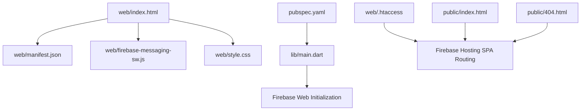
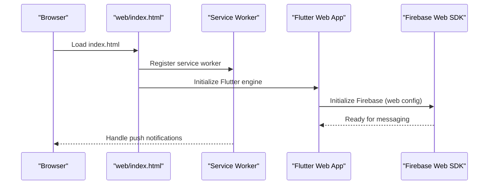
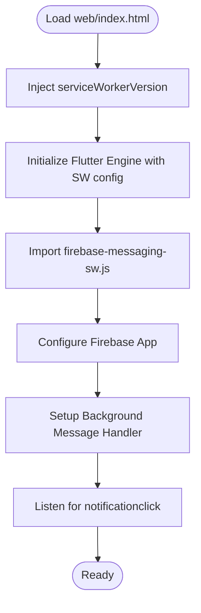
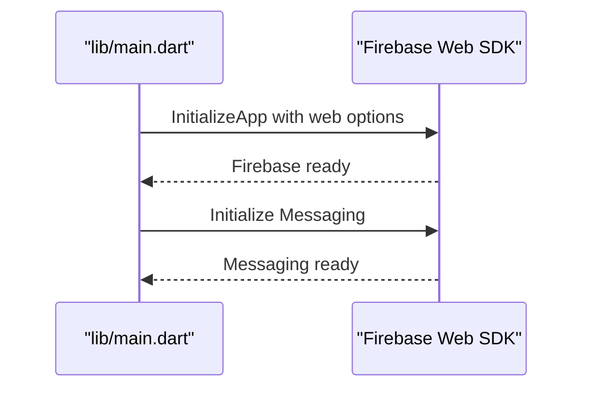
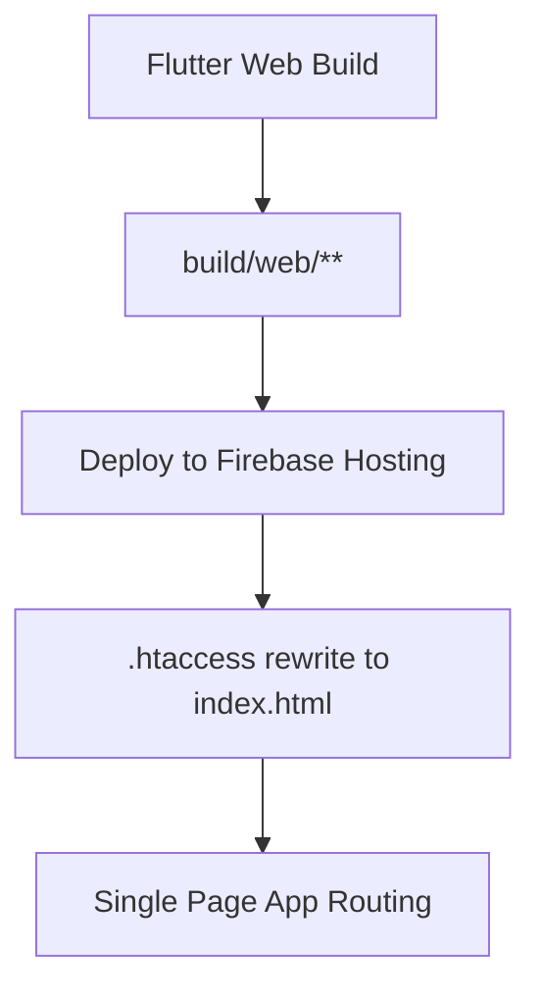

# Web Implementation

<cite>
**Referenced Files in This Document**
- [web/index.html](file://web/index.html)
- [web/manifest.json](file://web/manifest.json)
- [web/firebase-messaging-sw.js](file://web/firebase-messaging-sw.js)
- [web/style.css](file://web/style.css)
- [pubspec.yaml](file://pubspec.yaml)
- [lib/main.dart](file://lib/main.dart)
- [web/.htaccess](file://web/.htaccess)
- [public/index.html](file://public/index.html)
- [public/404.html](file://public/404.html)
</cite>

## Table of Contents
1. [Introduction](#introduction)
2. [Project Structure](#project-structure)
3. [Core Components](#core-components)
4. [Architecture Overview](#architecture-overview)
5. [Detailed Component Analysis](#detailed-component-analysis)
6. [Dependency Analysis](#dependency-analysis)
7. [Performance Considerations](#performance-considerations)
8. [Troubleshooting Guide](#troubleshooting-guide)
9. [Conclusion](#conclusion)

## Introduction
This document provides comprehensive guidance for implementing the web platform of a Flutter application with Progressive Web App (PWA) capabilities. It covers PWA configuration, service worker setup, browser compatibility, build process specifics, offline capabilities, responsive design, performance optimizations, deployment strategies, and troubleshooting. The focus is on the files located under the web/ directory and related Flutter web configurations.

## Project Structure
The web platform implementation centers around several key files:
- web/index.html: Entry HTML for the web app, including PWA manifest linkage, service worker injection, and runtime initialization scripts.
- web/manifest.json: PWA manifest defining app metadata, display mode, theme colors, and icon assets.
- web/firebase-messaging-sw.js: Background service worker for Firebase push notifications.
- web/style.css: Styles for the web app, including preloader and responsive layout helpers.
- pubspec.yaml: Flutter dependencies and web-specific overrides.
- lib/main.dart: Application entry point with web-specific Firebase initialization and platform checks.
- web/.htaccess: Firebase Hosting rewrite rules for SPA routing.
- public/index.html and public/404.html: Firebase Hosting welcome and 404 pages.

**Diagram sources**
- [web/index.html](file://web/index.html)
- [web/manifest.json](file://web/manifest.json)
- [web/firebase-messaging-sw.js](file://web/firebase-messaging-sw.js)
- [web/style.css](file://web/style.css)
- [lib/main.dart](file://lib/main.dart)
- [pubspec.yaml](file://pubspec.yaml)
- [web/.htaccess](file://web/.htaccess)
- [public/index.html](file://public/index.html)
- [public/404.html](file://public/404.html)

**Section sources**
- [web/index.html](file://web/index.html)
- [web/manifest.json](file://web/manifest.json)
- [web/firebase-messaging-sw.js](file://web/firebase-messaging-sw.js)
- [web/style.css](file://web/style.css)
- [pubspec.yaml](file://pubspec.yaml)
- [lib/main.dart](file://lib/main.dart)
- [web/.htaccess](file://web/.htaccess)
- [public/index.html](file://public/index.html)
- [public/404.html](file://public/404.html)

## Core Components
- PWA Manifest and Icons: The manifest defines app identity, display mode, theme/background colors, orientation, and icon assets. These assets must be served from the web root and match the declared sizes.
- Service Worker Integration: The HTML injects a service worker via the loader and links the background service worker for push notifications.
- Firebase Web Integration: Firebase is initialized differently for web versus native platforms, with explicit web configuration and messaging setup.
- Responsive Styles: CSS provides responsive layout helpers and a preloader with theme-aware styling.
- Build and Deployment: The project uses Firebase Hosting with .htaccess rewrite rules to support client-side routing.

**Section sources**
- [web/manifest.json](file://web/manifest.json)
- [web/index.html](file://web/index.html)
- [lib/main.dart](file://lib/main.dart)
- [web/style.css](file://web/style.css)
- [web/.htaccess](file://web/.htaccess)

## Architecture Overview
The web app architecture integrates Flutter’s web renderer with PWA and Firebase services. The HTML bootstrap loads the Flutter engine and initializes Firebase for web. The PWA manifest enables installability, while the background service worker handles push notifications.

**Diagram sources**
- [web/index.html](file://web/index.html)
- [web/firebase-messaging-sw.js](file://web/firebase-messaging-sw.js)
- [lib/main.dart](file://lib/main.dart)

## Detailed Component Analysis

### PWA Manifest Configuration
The manifest defines the app’s appearance and behavior when installed. It specifies:
- App name and short name
- Start URL and display mode (standalone)
- Theme and background colors
- Orientation preference
- Icons array with src, sizes, and type

Ensure the icon assets referenced in the manifest are present in the web root and accessible via the URLs defined in the manifest.

**Section sources**
- [web/manifest.json](file://web/manifest.json)

### Service Worker Setup
The HTML injects a service worker version variable and initializes the Flutter engine with service worker configuration. The background service worker for Firebase Messaging is imported and configured with the Firebase app configuration. It sets up a background message handler and notification click listener.

Key considerations:
- The service worker version must match the built version.
- The background service worker must be placed at the web root and imported via a CDN URL.
- Ensure HTTPS is used for service workers and push notifications.

**Diagram sources**
- [web/index.html](file://web/index.html)
- [web/firebase-messaging-sw.js](file://web/firebase-messaging-sw.js)

**Section sources**
- [web/index.html](file://web/index.html)
- [web/firebase-messaging-sw.js](file://web/firebase-messaging-sw.js)

### Firebase Web Integration
The main entry point initializes Firebase differently for web. It uses a web-specific configuration and initializes messaging. This ensures proper integration with Firebase Cloud Messaging on the web platform.

**Diagram sources**
- [lib/main.dart](file://lib/main.dart)

**Section sources**
- [lib/main.dart](file://lib/main.dart)

### Responsive Design and Preloader
The stylesheet provides:
- Basic responsive layout helpers (flex utilities)
- Preloader with theme-aware styling
- Header layout and placeholders for skeleton UI

These styles support a responsive layout and improve perceived performance during app boot.

**Section sources**
- [web/style.css](file://web/style.css)

### Build and Deployment for Web
- Flutter web build produces assets under the build/web directory.
- Firebase Hosting expects static files in the public directory.
- The .htaccess file rewrites routes to index.html for SPA navigation.
- Ensure the PWA manifest and icons are deployed alongside the app.

**Diagram sources**
- [web/.htaccess](file://web/.htaccess)
- [public/index.html](file://public/index.html)
- [public/404.html](file://public/404.html)

**Section sources**
- [web/.htaccess](file://web/.htaccess)
- [public/index.html](file://public/index.html)
- [public/404.html](file://public/404.html)

## Dependency Analysis
Flutter web dependencies and overrides influence the web platform behavior:
- url_strategy: Enables clean URLs for web.
- google_maps_flutter_web: Provides web-specific Google Maps integration.
- flutter_inappwebview_web: Adds web support for in-app browser features.
- web: Overrides for web platform compatibility.

These dependencies impact service worker availability, in-app browser features, and web rendering.

**Section sources**
- [pubspec.yaml](file://pubspec.yaml)

## Performance Considerations
- Minimize initial bundle size by deferring non-critical resources.
- Use lazy loading for heavy components.
- Optimize images and assets; ensure icons referenced in the manifest are appropriately sized.
- Leverage browser caching with appropriate cache headers.
- Keep service worker updates minimal and versioned.
- Use responsive images and CSS to reduce layout thrashing.

## Troubleshooting Guide

### PWA Installation Issues
- Verify manifest.json is served from the web root and accessible at the declared URL.
- Ensure icons exist and match the sizes specified in the manifest.
- Confirm HTTPS is enabled, as required by service workers and push notifications.
- Test installation on supported browsers and check for console errors.

### Service Worker Problems
- Clear browser cache and unregister existing service workers.
- Verify the service worker version matches the built version.
- Check browser developer tools for service worker registration errors.
- Ensure the background service worker file is deployed and accessible.

### Push Notifications
- Confirm Firebase configuration is correct and initialized for web.
- Verify the background service worker is properly imported and registered.
- Check notification permissions and browser support for push notifications.

### Firebase Hosting Deployment
- Ensure .htaccess rewrite rules are present for SPA routing.
- Verify index.html and 404.html are deployed to the public directory.
- Confirm all assets referenced by the app are uploaded.

### Browser Compatibility
- Use modern JavaScript features compatible with target browsers.
- Polyfill missing APIs if necessary for older browsers.
- Test across major browsers and address platform-specific quirks.

**Section sources**
- [web/manifest.json](file://web/manifest.json)
- [web/index.html](file://web/index.html)
- [web/firebase-messaging-sw.js](file://web/firebase-messaging-sw.js)
- [web/.htaccess](file://web/.htaccess)
- [public/index.html](file://public/index.html)
- [public/404.html](file://public/404.html)

## Conclusion
The web platform implementation leverages Flutter’s web capabilities with PWA features and Firebase integration. By configuring the manifest, service workers, and Firebase correctly, and by following deployment and compatibility guidelines, the application achieves reliable offline readiness, push notifications, and a responsive user experience across browsers.