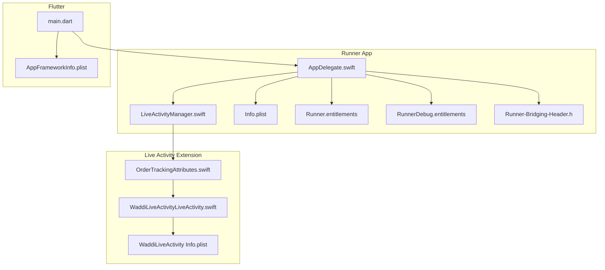
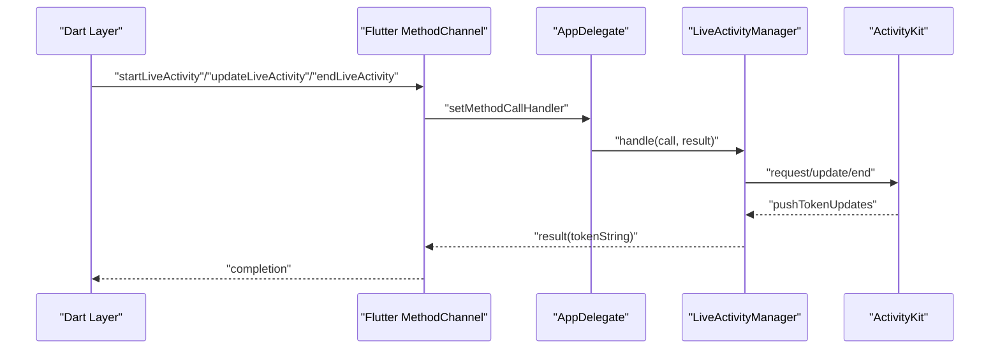
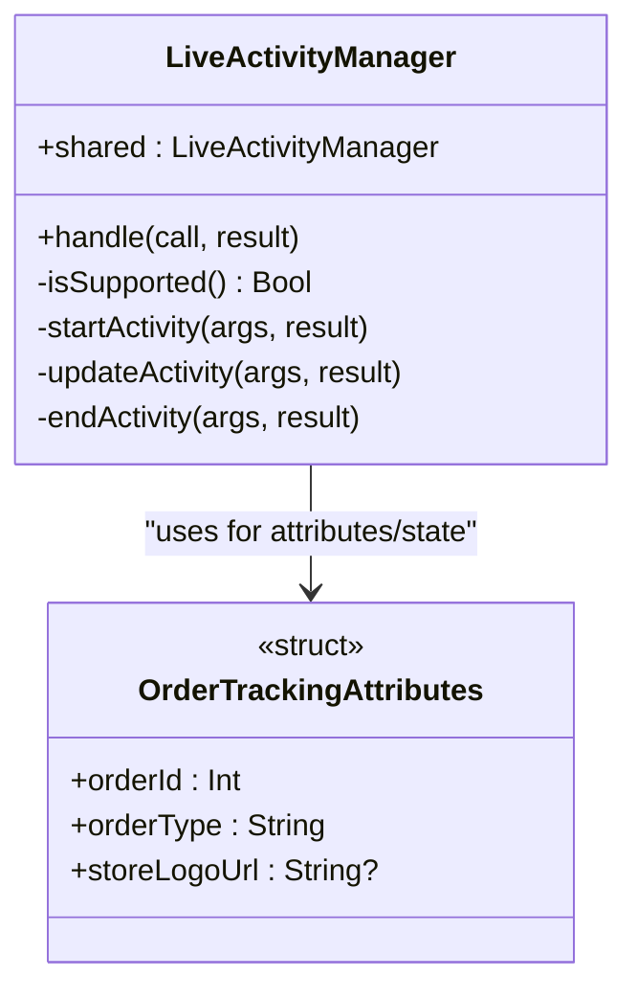
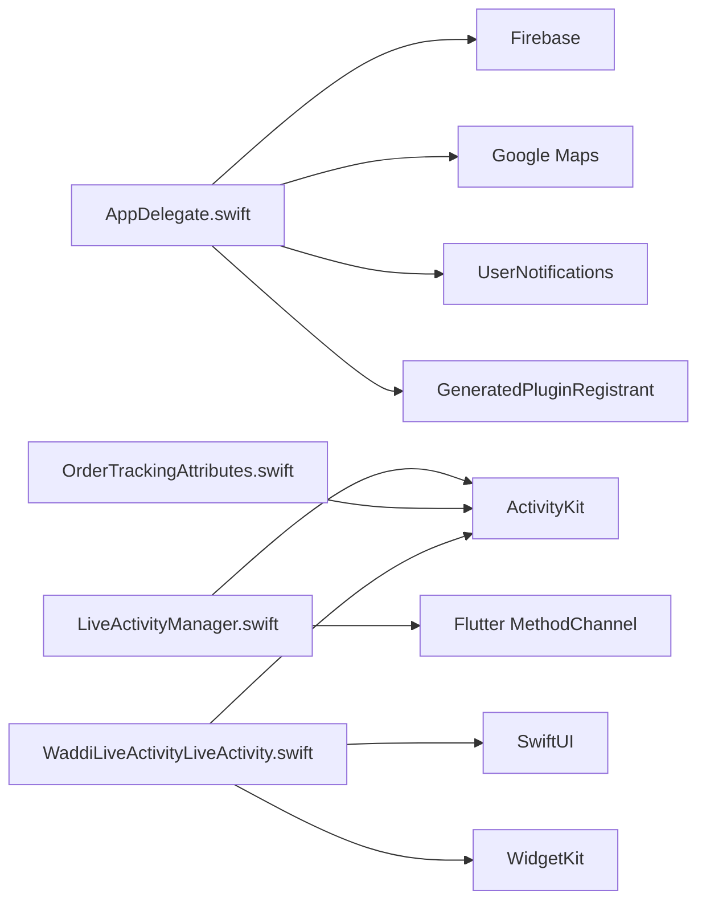

# iOS Implementation

<cite>
**Referenced Files in This Document**
- [AppDelegate.swift](file://ios/Runner/AppDelegate.swift)
- [LiveActivityManager.swift](file://ios/Runner/LiveActivityManager.swift)
- [OrderTrackingAttributes.swift](file://ios/WaddiLiveActivity/OrderTrackingAttributes.swift)
- [WaddiLiveActivityLiveActivity.swift](file://ios/WaddiLiveActivity/WaddiLiveActivityLiveActivity.swift)
- [Info.plist](file://ios/Runner/Info.plist)
- [Runner.entitlements](file://ios/Runner/Runner.entitlements)
- [RunnerDebug.entitlements](file://ios/Runner/RunnerDebug.entitlements)
- [Runner-Bridging-Header.h](file://ios/Runner/Runner-Bridging-Header.h)
- [Podfile](file://ios/Podfile)
- [AppFrameworkInfo.plist](file://ios/Flutter/AppFrameworkInfo.plist)
- [main.dart](file://lib/main.dart)
</cite>

## Table of Contents
1. [Introduction](#introduction)
2. [Project Structure](#project-structure)
3. [Core Components](#core-components)
4. [Architecture Overview](#architecture-overview)
5. [Detailed Component Analysis](#detailed-component-analysis)
6. [Dependency Analysis](#dependency-analysis)
7. [Performance Considerations](#performance-considerations)
8. [Troubleshooting Guide](#troubleshooting-guide)
9. [Conclusion](#conclusion)
10. [Appendices](#appendices)

## Introduction
This document provides a comprehensive guide to the iOS implementation of the project, focusing on the AppDelegate configuration, Swift-native integration, and iOS-specific features. It covers Live Activities for order tracking, push notification setup, background app refresh, bridging header configuration, native plugin registration, and iOS-specific build configurations. It also documents Info.plist configuration, entitlements management, and App Store deployment requirements, along with iOS version compatibility, App Store review guidelines, and performance optimization strategies.

## Project Structure
The iOS implementation is organized under the ios/Runner and ios/WaddiLiveActivity directories. Key elements include:
- AppDelegate.swift: Entry point for native iOS lifecycle events and plugin registration.
- LiveActivityManager.swift: Native manager for ActivityKit-based Live Activities.
- OrderTrackingAttributes.swift and WaddiLiveActivityLiveActivity.swift: Live Activity attributes and SwiftUI widget implementation.
- Info.plist: Application metadata, permissions, URL schemes, and background modes.
- Entitlements files: Push notification environments for development and production.
- Bridging Header: Registers Flutter plugins with Objective-C runtime.
- Podfile: iOS platform version, modular headers, and target-specific platform requirements.
- AppFrameworkInfo.plist: Flutter framework bundle metadata.
- main.dart: Dart entry point initializing Firebase, notifications, and platform-specific features.

**Diagram sources**
- [AppDelegate.swift](file://ios/Runner/AppDelegate.swift)
- [LiveActivityManager.swift](file://ios/Runner/LiveActivityManager.swift)
- [OrderTrackingAttributes.swift](file://ios/WaddiLiveActivity/OrderTrackingAttributes.swift)
- [WaddiLiveActivityLiveActivity.swift](file://ios/WaddiLiveActivity/WaddiLiveActivityLiveActivity.swift)
- [Info.plist](file://ios/Runner/Info.plist)
- [Runner.entitlements](file://ios/Runner/Runner.entitlements)
- [RunnerDebug.entitlements](file://ios/Runner/RunnerDebug.entitlements)
- [Runner-Bridging-Header.h](file://ios/Runner/Runner-Bridging-Header.h)
- [AppFrameworkInfo.plist](file://ios/Flutter/AppFrameworkInfo.plist)
- [main.dart](file://lib/main.dart)

**Section sources**
- [AppDelegate.swift](file://ios/Runner/AppDelegate.swift)
- [LiveActivityManager.swift](file://ios/Runner/LiveActivityManager.swift)
- [OrderTrackingAttributes.swift](file://ios/WaddiLiveActivity/OrderTrackingAttributes.swift)
- [WaddiLiveActivityLiveActivity.swift](file://ios/WaddiLiveActivity/WaddiLiveActivityLiveActivity.swift)
- [Info.plist](file://ios/Runner/Info.plist)
- [Runner.entitlements](file://ios/Runner/Runner.entitlements)
- [RunnerDebug.entitlements](file://ios/Runner/RunnerDebug.entitlements)
- [Runner-Bridging-Header.h](file://ios/Runner/Runner-Bridging-Header.h)
- [Podfile](file://ios/Podfile)
- [AppFrameworkInfo.plist](file://ios/Flutter/AppFrameworkInfo.plist)
- [main.dart](file://lib/main.dart)

## Core Components
- AppDelegate.swift
  - Initializes Firebase and Google Maps SDK.
  - Sets the UNUserNotificationCenter delegate for push notifications.
  - Registers Flutter plugins via GeneratedPluginRegistrant.
  - Establishes a Flutter MethodChannel for Live Activity control.
- LiveActivityManager.swift
  - Provides a singleton interface to start, update, and end Live Activities.
  - Validates iOS availability and user permission for Live Activities.
  - Handles push token retrieval for ActivityKit.
- OrderTrackingAttributes.swift
  - Defines Live Activity attributes and state model for order tracking.
- WaddiLiveActivityLiveActivity.swift
  - Implements SwiftUI views for the Live Activity widget, including lock screen, dynamic island, and step tracking.
- Info.plist
  - Declares URL schemes, privacy descriptions, supported orientations, Live Activities support, and background modes.
- Entitlements
  - Configure Apple Push Services environment per build configuration.
- Bridging Header
  - Ensures GeneratedPluginRegistrant is visible to Objective-C runtime.
- Podfile
  - Sets minimum iOS version, enables modular headers, and defines platform requirements for the Live Activity extension target.
- AppFrameworkInfo.plist
  - Flutter framework bundle metadata.
- main.dart
  - Initializes Firebase, sets up crashlytics, configures notifications, and routes application initialization.

**Section sources**
- [AppDelegate.swift](file://ios/Runner/AppDelegate.swift)
- [LiveActivityManager.swift](file://ios/Runner/LiveActivityManager.swift)
- [OrderTrackingAttributes.swift](file://ios/WaddiLiveActivity/OrderTrackingAttributes.swift)
- [WaddiLiveActivityLiveActivity.swift](file://ios/WaddiLiveActivity/WaddiLiveActivityLiveActivity.swift)
- [Info.plist](file://ios/Runner/Info.plist)
- [Runner.entitlements](file://ios/Runner/Runner.entitlements)
- [RunnerDebug.entitlements](file://ios/Runner/RunnerDebug.entitlements)
- [Runner-Bridging-Header.h](file://ios/Runner/Runner-Bridging-Header.h)
- [Podfile](file://ios/Podfile)
- [AppFrameworkInfo.plist](file://ios/Flutter/AppFrameworkInfo.plist)
- [main.dart](file://lib/main.dart)

## Architecture Overview
The iOS implementation integrates Flutter with native iOS frameworks:
- AppDelegate registers plugins and sets up push notification delegates.
- LiveActivityManager exposes a method channel to control ActivityKit activities.
- OrderTrackingAttributes and SwiftUI views define the Live Activity content.
- Info.plist and entitlements configure permissions and capabilities.
- Podfile manages iOS platform and modular headers for CocoaPods.

**Diagram sources**
- [AppDelegate.swift](file://ios/Runner/AppDelegate.swift)
- [LiveActivityManager.swift](file://ios/Runner/LiveActivityManager.swift)

## Detailed Component Analysis

### AppDelegate.swift
- Responsibilities
  - Configures Firebase and Google Maps.
  - Assigns UNUserNotificationCenter delegate for push notifications.
  - Registers Flutter plugins.
  - Creates a Flutter MethodChannel named com.hamdiesolutions.waddi/live_activity to communicate with LiveActivityManager.
- Integration Notes
  - Uses GeneratedPluginRegistrant for plugin registration.
  - Ensures UNUserNotificationCenter delegate is set for iOS 10+.

**Section sources**
- [AppDelegate.swift](file://ios/Runner/AppDelegate.swift)

### LiveActivityManager.swift
- Responsibilities
  - Singleton manager for ActivityKit operations.
  - Supports checking Live Activity availability and user permission.
  - Starts Live Activities with attributes and content state.
  - Updates existing activities with new content state.
  - Ends activities with a final state and dismissal policy.
  - Retrieves and returns the ActivityKit push token.
- Availability and Permissions
  - Requires iOS 16.1+ for capability checks and iOS 16.2+ for ActivityKit features.
  - Verifies user permission before starting activities.

**Diagram sources**
- [LiveActivityManager.swift](file://ios/Runner/LiveActivityManager.swift)
- [OrderTrackingAttributes.swift](file://ios/WaddiLiveActivity/OrderTrackingAttributes.swift)

**Section sources**
- [LiveActivityManager.swift](file://ios/Runner/LiveActivityManager.swift)

### OrderTrackingAttributes.swift
- Responsibilities
  - Defines ActivityAttributes and ContentState for order tracking Live Activities.
  - Encodes status, ETA, progress, delivery info, and step tracking.
- Availability
  - Available on iOS 16.2+.

**Section sources**
- [OrderTrackingAttributes.swift](file://ios/WaddiLiveActivity/OrderTrackingAttributes.swift)

### WaddiLiveActivityLiveActivity.swift
- Responsibilities
  - Implements a WidgetConfiguration for ActivityKit.
  - Provides lock screen, dynamic island, compact, and minimal views.
  - Renders store logo, ETA, status, and a 4-step progress indicator.
- SwiftUI Views
  - LockScreenView: Full-screen content with status and step tracking.
  - StepTrack: Visual step progression based on current status.
  - StoreLogoView: Async image rendering with placeholder.
- Helpers
  - Status emoji and icon mapping, short status text.

**Section sources**
- [WaddiLiveActivityLiveActivity.swift](file://ios/WaddiLiveActivity/WaddiLiveActivityLiveActivity.swift)

### Info.plist
- Key Entries
  - CFBundleDisplayName, CFBundleIdentifier, CFBundleVersion, CFBundleShortVersionString.
  - CFBundleURLTypes with multiple URL schemes for OAuth and deep links.
  - FacebookAppID, FacebookClientToken, FacebookDisplayName.
  - LSApplicationQueriesSchemes for Facebook SSO.
  - NSCameraUsageDescription, NSLocation*UsageDescription, NSMicrophoneUsageDescription, NSPhotoLibraryUsageDescription.
  - UIApplicationSupportsIndirectInputEvents, NSSupportsLiveActivities.
  - UIBackgroundModes: fetch, remote-notification.
  - UISupportedInterfaceOrientations and ~ipad variants.
  - NSLocationAlwaysAndWhenInUseUsageDescription.
  - io.flutter.embedded_views_preview.

**Section sources**
- [Info.plist](file://ios/Runner/Info.plist)

### Entitlements Management
- Runner.entitlements
  - aps-environment: production for distribution builds.
  - com.apple.developer.applesignin: Default.
- RunnerDebug.entitlements
  - aps-environment: development for debug builds.
  - com.apple.developer.applesignin: Default.

**Section sources**
- [Runner.entitlements](file://ios/Runner/Runner.entitlements)
- [RunnerDebug.entitlements](file://ios/Runner/RunnerDebug.entitlements)

### Bridging Header Setup
- Runner-Bridging-Header.h
  - Imports GeneratedPluginRegistrant.h to expose plugin registration to Objective-C runtime.

**Section sources**
- [Runner-Bridging-Header.h](file://ios/Runner/Runner-Bridging-Header.h)

### iOS-Specific Build Configurations
- Podfile
  - platform :ios, '14.0' for the main app.
  - use_modular_headers! and use_frameworks! for CocoaPods integration.
  - Target 'WaddiLiveActivityExtension' with platform :ios, '16.2' for Live Activity extension.
  - post_install hook applies additional iOS build settings.

**Section sources**
- [Podfile](file://ios/Podfile)

### Flutter Framework Metadata
- AppFrameworkInfo.plist
  - Flutter framework bundle metadata for the App target.

**Section sources**
- [AppFrameworkInfo.plist](file://ios/Flutter/AppFrameworkInfo.plist)

### Push Notifications and Background Processing
- AppDelegate.swift
  - Sets UNUserNotificationCenter delegate for iOS 10+.
  - Registers for remote notifications.
- main.dart
  - Initializes Firebase Messaging and background handler.
  - Sets up crashlytics for error reporting.
- Info.plist
  - UIBackgroundModes includes fetch and remote-notification for background processing.

**Section sources**
- [AppDelegate.swift](file://ios/Runner/AppDelegate.swift)
- [main.dart](file://lib/main.dart)
- [Info.plist](file://ios/Runner/Info.plist)

### Siri Shortcuts Integration
- Not implemented in the analyzed files.
- Recommended approach
  - Use Intents extension and INPreferences to create shortcuts.
  - Define Intent definitions and handlers in a separate target.
  - Request user permission and register shortcuts during app lifecycle.

[No sources needed since this section doesn't analyze specific files]

### Native UI Components
- SwiftUI Live Activity widgets are implemented in the Live Activity extension target.
- Lock screen and dynamic island views render status, ETA, and step tracking.

**Section sources**
- [WaddiLiveActivityLiveActivity.swift](file://ios/WaddiLiveActivity/WaddiLiveActivityLiveActivity.swift)

### iOS Version Compatibility
- Minimum iOS version for the app is 14.0.
- Live Activity features require iOS 16.2+.
- Capability checks ensure graceful degradation on older versions.

**Section sources**
- [Podfile](file://ios/Podfile)
- [LiveActivityManager.swift](file://ios/Runner/LiveActivityManager.swift)

### App Store Deployment Requirements
- Entitlements
  - Ensure aps-environment is set to production for distribution builds.
- Info.plist
  - Include all required privacy descriptions and background modes.
- Live Activity Extension
  - Verify the extension target’s platform version and bundle identifiers.
- Flutter Framework
  - Confirm AppFrameworkInfo.plist metadata aligns with Flutter build.

**Section sources**
- [Runner.entitlements](file://ios/Runner/Runner.entitlements)
- [Info.plist](file://ios/Runner/Info.plist)
- [Podfile](file://ios/Podfile)
- [AppFrameworkInfo.plist](file://ios/Flutter/AppFrameworkInfo.plist)

## Dependency Analysis
- AppDelegate depends on Flutter, Firebase, Google Maps, FBSDKCoreKit, and UserNotifications.
- LiveActivityManager depends on ActivityKit and Flutter MethodChannel.
- Live Activity extension depends on SwiftUI, ActivityKit, and WidgetKit.
- Podfile defines platform constraints and modular headers for CocoaPods.

**Diagram sources**
- [AppDelegate.swift](file://ios/Runner/AppDelegate.swift)
- [LiveActivityManager.swift](file://ios/Runner/LiveActivityManager.swift)
- [OrderTrackingAttributes.swift](file://ios/WaddiLiveActivity/OrderTrackingAttributes.swift)
- [WaddiLiveActivityLiveActivity.swift](file://ios/WaddiLiveActivity/WaddiLiveActivityLiveActivity.swift)

**Section sources**
- [AppDelegate.swift](file://ios/Runner/AppDelegate.swift)
- [LiveActivityManager.swift](file://ios/Runner/LiveActivityManager.swift)
- [OrderTrackingAttributes.swift](file://ios/WaddiLiveActivity/OrderTrackingAttributes.swift)
- [WaddiLiveActivityLiveActivity.swift](file://ios/WaddiLiveActivity/WaddiLiveActivityLiveActivity.swift)

## Performance Considerations
- Background Modes
  - Use fetch and remote-notification judiciously to minimize battery drain.
- Live Activities
  - Limit updates frequency to reduce CPU and GPU usage.
  - Avoid heavy computations in SwiftUI views; precompute data where possible.
- Push Notifications
  - Keep payload sizes small; offload heavy work to background tasks.
- Memory Management
  - Avoid retain cycles in closures and delegates; use weak references when appropriate.
- Network Requests
  - Use connection pooling and caching to reduce overhead.

[No sources needed since this section provides general guidance]

## Troubleshooting Guide
- Live Activity Not Starting
  - Verify iOS version meets the requirement (16.2+) and user permissions are granted.
  - Check that NSSupportsLiveActivities is enabled in Info.plist.
- Push Notifications Not Received
  - Confirm aps-environment matches the build configuration (development vs. production).
  - Ensure UNUserNotificationCenter delegate is set and remote notifications are registered.
- Background Execution Limits
  - Review UIBackgroundModes and avoid excessive background tasks.
  - Use fetch sparingly and rely on remote notifications for timely updates.
- Memory Management
  - Monitor retain cycles in delegates and closures; use weak references.
  - Profile memory usage with Instruments and address leaks promptly.
- Debugging with Xcode
  - Use device logs to inspect ActivityKit token updates and error messages.
  - Enable crashlytics logging for unhandled exceptions.

**Section sources**
- [LiveActivityManager.swift](file://ios/Runner/LiveActivityManager.swift)
- [Runner.entitlements](file://ios/Runner/Runner.entitlements)
- [RunnerDebug.entitlements](file://ios/Runner/RunnerDebug.entitlements)
- [AppDelegate.swift](file://ios/Runner/AppDelegate.swift)
- [Info.plist](file://ios/Runner/Info.plist)

## Conclusion
The iOS implementation integrates Flutter with native iOS capabilities, including ActivityKit Live Activities, push notifications, and background processing. Proper configuration of Info.plist, entitlements, and build settings ensures compliance with App Store requirements and optimal performance. The LiveActivityManager and SwiftUI widgets provide a robust order tracking experience, while AppDelegate and plugin registration maintain seamless Flutter-native interoperability.

[No sources needed since this section summarizes without analyzing specific files]

## Appendices
- Dart Entry Point
  - main.dart initializes Firebase, crashlytics, and notification handlers, and configures platform-specific features.

**Section sources**
- [main.dart](file://lib/main.dart)