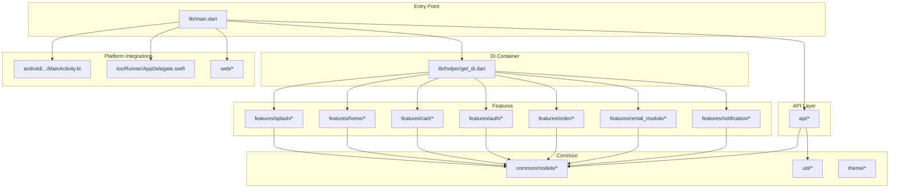
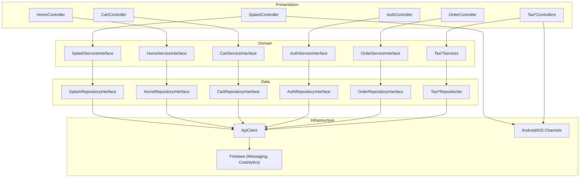
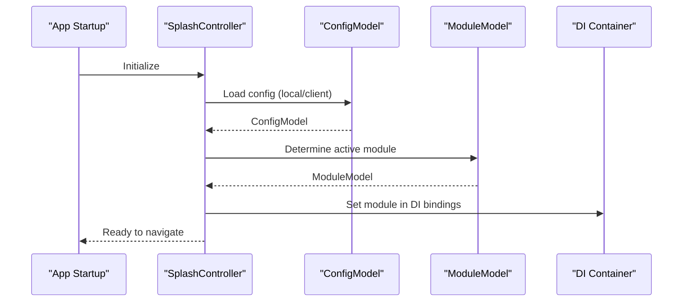
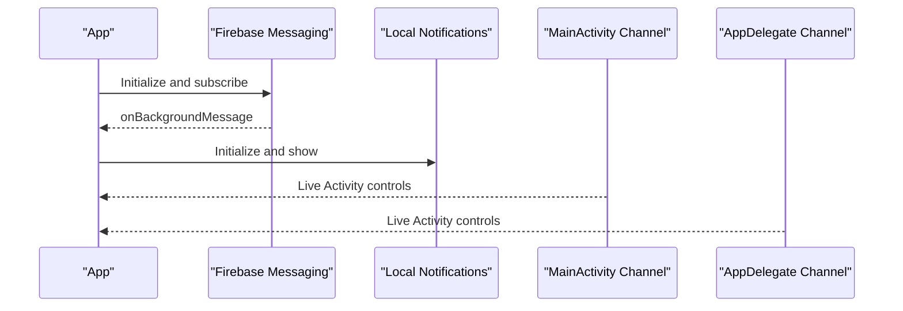
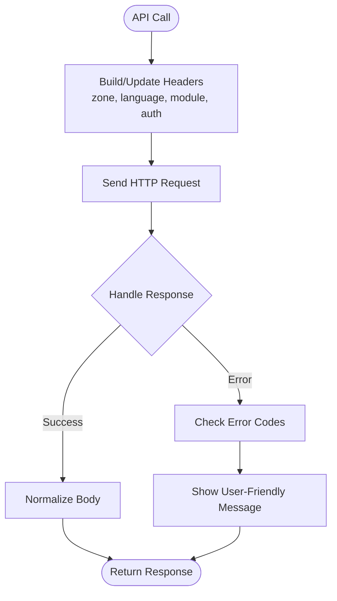
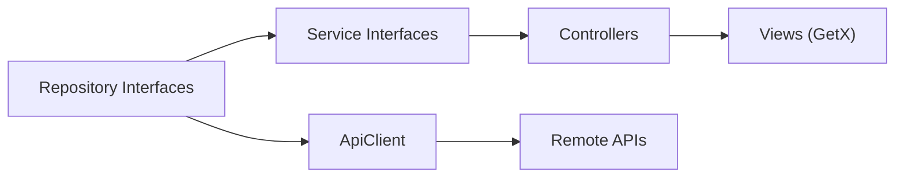

# Project Overview

<cite>
**Referenced Files in This Document**
- [README.md](file://README.md)
- [pubspec.yaml](file://pubspec.yaml)
- [lib/main.dart](file://lib/main.dart)
- [lib/helper/get_di.dart](file://lib/helper/get_di.dart)
- [lib/util/app_constants.dart](file://lib/util/app_constants.dart)
- [lib/util/messages.dart](file://lib/util/messages.dart)
- [lib/common/models/config_model.dart](file://lib/common/models/config_model.dart)
- [lib/common/models/module_model.dart](file://lib/common/models/module_model.dart)
- [lib/api/api_client.dart](file://lib/api/api_client.dart)
- [lib/features/splash/controllers/splash_controller.dart](file://lib/features/splash/controllers/splash_controller.dart)
- [lib/features/notification/domain/models/notification_body_model.dart](file://lib/features/notification/domain/models/notification_body_model.dart)
- [android/app/src/main/kotlin/com/sixamtech/efood_multivendor/MainActivity.kt](file://android/app/src/main/kotlin/com/sixamtech/efood_multivendor/MainActivity.kt)
- [ios/Runner/AppDelegate.swift](file://ios/Runner/AppDelegate.swift)
</cite>

## Table of Contents
1. [Introduction](#introduction)
2. [Project Structure](#project-structure)
3. [Core Components](#core-components)
4. [Architecture Overview](#architecture-overview)
5. [Detailed Component Analysis](#detailed-component-analysis)
6. [Dependency Analysis](#dependency-analysis)
7. [Performance Considerations](#performance-considerations)
8. [Troubleshooting Guide](#troubleshooting-guide)
9. [Conclusion](#conclusion)

## Introduction
Waddi is a comprehensive Flutter-based multi-vendor marketplace designed to serve multiple commerce verticals from a single codebase. It supports food delivery, grocery shopping, pharmacy services, parcel delivery, general e-commerce, rides (taxi), and “places” discovery. The application targets both mobile and web platforms, enabling a unified user experience across Android, iOS, and web environments. Its modular configuration allows operators to enable or tailor features per region or business model, while Firebase integration powers real-time capabilities such as push notifications, crash reporting, and messaging.

Key goals:
- Unified multi-vertical commerce platform
- Real-time engagement via Firebase
- Modular configuration for flexible deployments
- Cross-platform reach (Android, iOS, Web)
- Scalable architecture supporting rapid feature iteration

## Project Structure
The project follows a feature-centric, layered structure with clear separation of concerns:
- Feature modules encapsulate domain-specific screens, controllers, repositories, and services
- Common utilities and models provide shared infrastructure
- API layer abstracts network communication
- DI container initializes controllers and services lazily
- Platform-specific integrations for Android/iOS and web

**Diagram sources**
- [lib/main.dart:35-103](file://lib/main.dart#L35-L103)
- [lib/helper/get_di.dart:220-756](file://lib/helper/get_di.dart#L220-L756)

**Section sources**
- [lib/main.dart:35-103](file://lib/main.dart#L35-L103)
- [lib/helper/get_di.dart:220-756](file://lib/helper/get_di.dart#L220-L756)

## Core Components
- Entry point and initialization:
  - Application bootstraps Firebase, sets URL strategy for web, configures crashlytics, initializes notifications, and runs the app with GetMaterialApp.
- Dependency Injection:
  - A centralized DI initializer registers repositories, services, and controllers, enabling loose coupling and testability.
- Configuration and Modules:
  - ConfigModel and ModuleModel define runtime configuration and module capabilities, including per-module features and availability.
- API client:
  - ApiClient encapsulates HTTP requests, response handling, and dynamic header updates (zone, language, module, auth).
- Localization:
  - Messages class binds localized strings loaded from assets for internationalization.
- Real-time features:
  - Firebase Messaging and local notifications are integrated; Android/iOS expose channels for native features like Live Activities and permission handling.

**Section sources**
- [lib/main.dart:35-103](file://lib/main.dart#L35-L103)
- [lib/helper/get_di.dart:220-756](file://lib/helper/get_di.dart#L220-L756)
- [lib/util/app_constants.dart:6-424](file://lib/util/app_constants.dart#L6-L424)
- [lib/common/models/config_model.dart:1-867](file://lib/common/models/config_model.dart#L1-L867)
- [lib/common/models/module_model.dart:1-106](file://lib/common/models/module_model.dart#L1-L106)
- [lib/api/api_client.dart:18-245](file://lib/api/api_client.dart#L18-L245)
- [lib/util/messages.dart:1-11](file://lib/util/messages.dart#L1-L11)
- [lib/features/notification/domain/models/notification_body_model.dart:1-99](file://lib/features/notification/domain/models/notification_body_model.dart#L1-L99)

## Architecture Overview
The application adopts layered architecture with MVVM-like presentation:
- Presentation: Controllers (GetX) manage UI state and orchestrate business logic
- Domain: Services define use-case boundaries
- Data: Repositories abstract data sources (network, preferences)
- Infrastructure: API client, Firebase, and platform channels

**Diagram sources**
- [lib/features/splash/controllers/splash_controller.dart:32-516](file://lib/features/splash/controllers/splash_controller.dart#L32-L516)
- [lib/helper/get_di.dart:456-739](file://lib/helper/get_di.dart#L456-L739)
- [lib/api/api_client.dart:18-245](file://lib/api/api_client.dart#L18-L245)
- [lib/main.dart:22-103](file://lib/main.dart#L22-L103)

## Detailed Component Analysis

### Technology Stack
- Flutter SDK: >=3.7.2 <4.0.0
- State Management: GetX
- Backend Integration: HTTP client, Firebase Core/Messaging/Crashlytics
- Authentication: Firebase Auth, social providers
- UI/UX: Material Design, responsive helpers
- Platform: Android, iOS, Web
- Additional libraries: connectivity_plus, geolocator, shared_preferences, cached_network_image, etc.

**Section sources**
- [pubspec.yaml:6-8](file://pubspec.yaml#L6-L8)
- [pubspec.yaml:9-98](file://pubspec.yaml#L9-L98)
- [README.md:6-6](file://README.md#L6-L6)

### Multi-Module Approach
The application supports multiple commerce modules (e.g., food, grocery, pharmacy, parcel, taxi, places). Module selection and caching are handled during startup and routing. The configuration model dynamically adapts features based on the active module.

**Diagram sources**
- [lib/features/splash/controllers/splash_controller.dart:115-197](file://lib/features/splash/controllers/splash_controller.dart#L115-L197)
- [lib/common/models/config_model.dart:1-867](file://lib/common/models/config_model.dart#L1-L867)
- [lib/common/models/module_model.dart:1-106](file://lib/common/models/module_model.dart#L1-L106)
- [lib/helper/get_di.dart:220-756](file://lib/helper/get_di.dart#L220-L756)

**Section sources**
- [lib/features/splash/controllers/splash_controller.dart:277-314](file://lib/features/splash/controllers/splash_controller.dart#L277-L314)
- [lib/common/models/config_model.dart:539-616](file://lib/common/models/config_model.dart#L539-L616)
- [lib/common/models/module_model.dart:1-106](file://lib/common/models/module_model.dart#L1-L106)

### Real-Time Features
Real-time capabilities are implemented via Firebase Messaging and local notifications. Android and iOS expose method channels for advanced features such as Live Activities and permission checks.

**Diagram sources**
- [lib/main.dart:54-91](file://lib/main.dart#L54-L91)
- [android/app/src/main/kotlin/com/sixamtech/efood_multivendor/MainActivity.kt:17-92](file://android/app/src/main/kotlin/com/sixamtech/efood_multivendor/MainActivity.kt#L17-L92)
- [ios/Runner/AppDelegate.swift:27-35](file://ios/Runner/AppDelegate.swift#L27-L35)

**Section sources**
- [lib/main.dart:54-91](file://lib/main.dart#L54-L91)
- [android/app/src/main/kotlin/com/sixamtech/efood_multivendor/MainActivity.kt:17-92](file://android/app/src/main/kotlin/com/sixamtech/efood_multivendor/MainActivity.kt#L17-L92)
- [ios/Runner/AppDelegate.swift:27-35](file://ios/Runner/AppDelegate.swift#L27-L35)

### API Layer and Data Flow
The API client manages HTTP requests, response normalization, and dynamic headers (zone, language, module, auth). It supports JSON and multipart uploads and integrates with error handling.

**Diagram sources**
- [lib/api/api_client.dart:46-68](file://lib/api/api_client.dart#L46-L68)
- [lib/api/api_client.dart:70-112](file://lib/api/api_client.dart#L70-L112)
- [lib/api/api_client.dart:198-231](file://lib/api/api_client.dart#L198-L231)

**Section sources**
- [lib/api/api_client.dart:18-245](file://lib/api/api_client.dart#L18-L245)

### Localization and Themes
Localization is driven by a Messages translation class bound to language assets. Themes are controlled via a theme controller and applied at runtime.

**Section sources**
- [lib/util/messages.dart:1-11](file://lib/util/messages.dart#L1-L11)
- [lib/main.dart:154-187](file://lib/main.dart#L154-L187)

## Dependency Analysis
The DI initializer wires repositories, services, and controllers, ensuring low coupling and high cohesion. Each feature module depends on its interfaces, promoting testability and maintainability.

**Diagram sources**
- [lib/helper/get_di.dart:231-739](file://lib/helper/get_di.dart#L231-L739)

**Section sources**
- [lib/helper/get_di.dart:231-739](file://lib/helper/get_di.dart#L231-L739)

## Performance Considerations
- Lazy initialization: Get.lazyPut defers instantiation until first use, reducing startup overhead.
- Conditional platform logic: Debug overrides and platform-specific initialization minimize unnecessary work on web.
- Header reuse: ApiClient caches and reuses headers to avoid redundant computations.
- Asset management: Font and asset lists are declared centrally to streamline loading.

[No sources needed since this section provides general guidance]

## Troubleshooting Guide
- Firebase initialization failures:
  - Verify platform-specific initialization blocks and ensure correct options for web vs. native.
- Network errors:
  - ApiClient handles timeouts and returns user-friendly messages; check headers and base URL.
- Notifications:
  - Confirm onBackgroundMessage handler registration and local notification initialization.
- Live Activities:
  - Validate method channel handlers on Android and iOS delegates.

**Section sources**
- [lib/main.dart:54-91](file://lib/main.dart#L54-L91)
- [lib/api/api_client.dart:70-112](file://lib/api/api_client.dart#L70-L112)
- [android/app/src/main/kotlin/com/sixamtech/efood_multivendor/MainActivity.kt:49-91](file://android/app/src/main/kotlin/com/sixamtech/efood_multivendor/MainActivity.kt#L49-L91)
- [ios/Runner/AppDelegate.swift:27-35](file://ios/Runner/AppDelegate.swift#L27-L35)

## Conclusion
Waddi delivers a scalable, multi-vertical marketplace built on Flutter with a clean layered architecture and robust DI. Its modular configuration enables flexible deployments across diverse commerce domains, while Firebase-powered real-time features enhance user engagement. The codebase emphasizes separation of concerns, testability, and cross-platform compatibility, making it suitable for both beginner contributors and experienced teams.