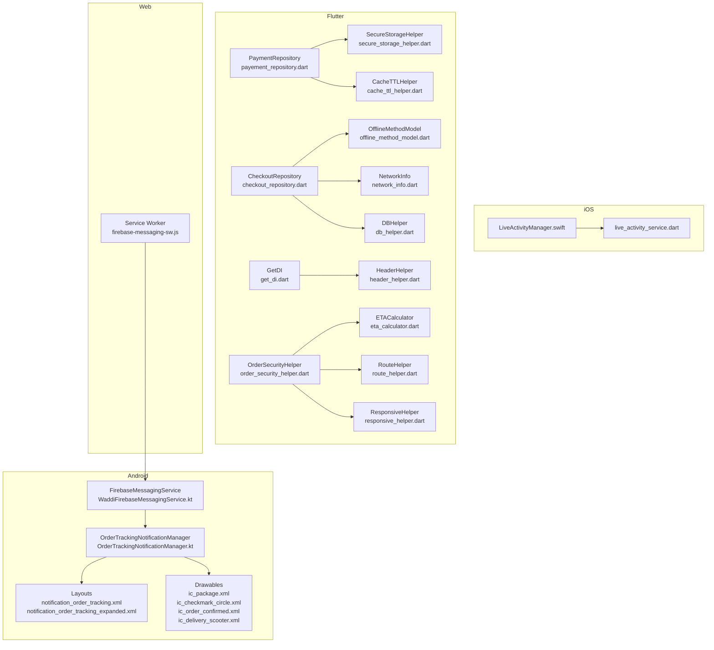
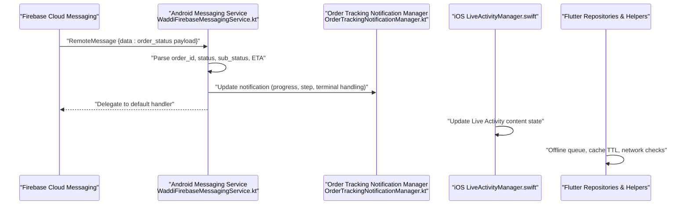
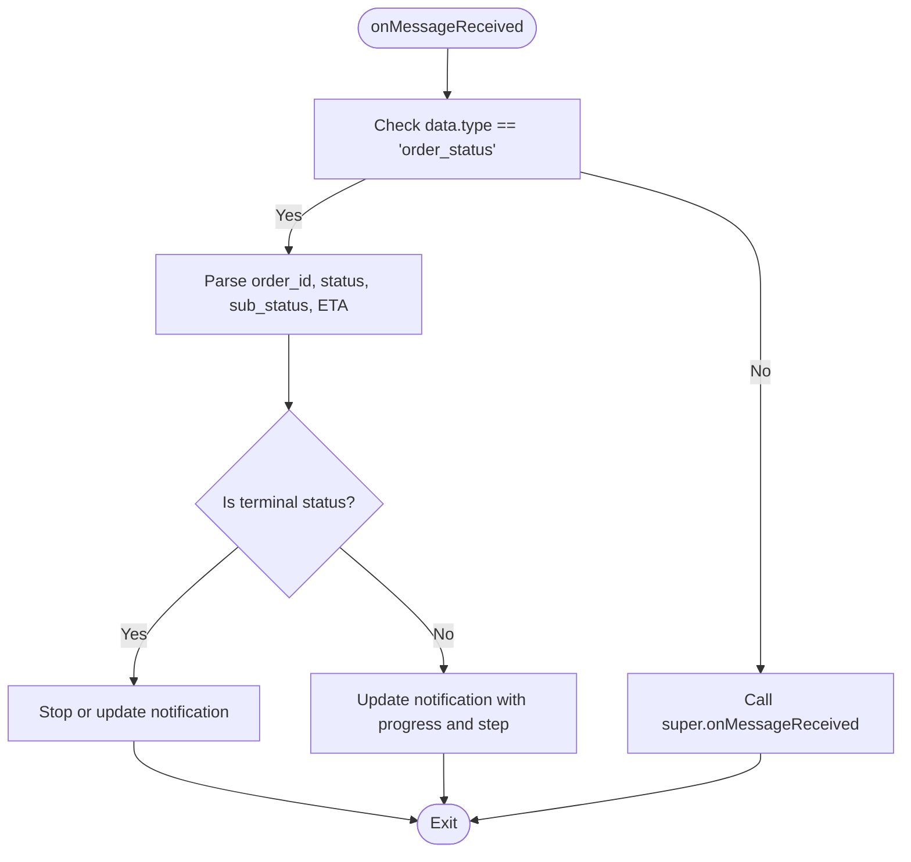
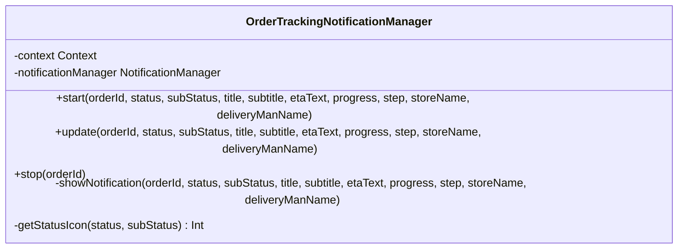
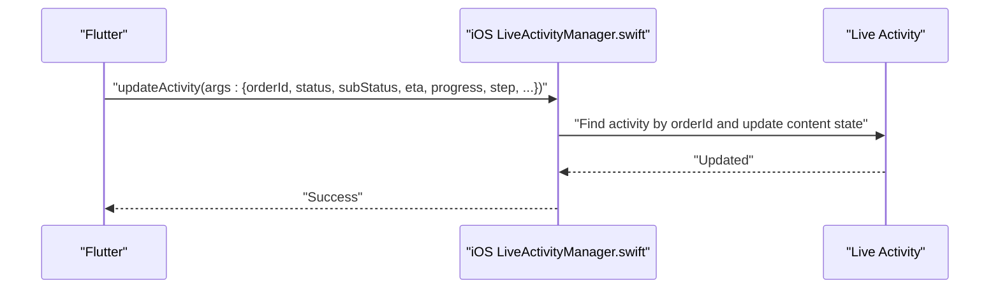
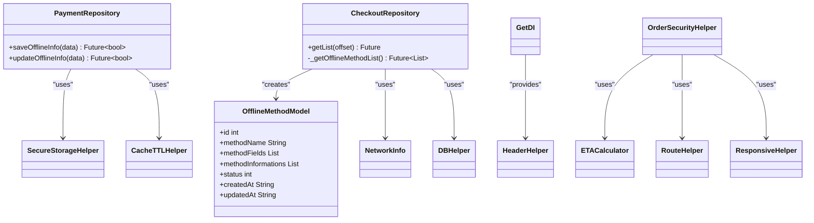
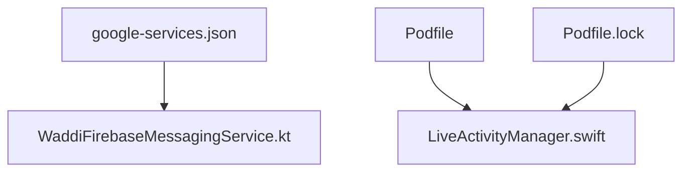

# Background Synchronization

<cite>
**Referenced Files in This Document**
- [OrderTrackingNotificationManager.kt](file://android/app/src/main/kotlin/com/sixamtech/efood_multivendor/OrderTrackingNotificationManager.kt)
- [WaddiFirebaseMessagingService.kt](file://android/app/src/main/kotlin/com/sixamtech/efood_multivendor/WaddiFirebaseMessagingService.kt)
- [notification_order_tracking.xml](file://android/app/src/main/res/layout/notification_order_tracking.xml)
- [notification_order_tracking_expanded.xml](file://android/app/src/main/res/layout/notification_order_tracking_expanded.xml)
- [ic_package.xml](file://android/app/src/main/res/drawable/ic_package.xml)
- [ic_checkmark_circle.xml](file://android/app/src/main/res/drawable/ic_checkmark_circle.xml)
- [ic_order_confirmed.xml](file://android/app/src/main/res/drawable/ic_order_confirmed.xml)
- [ic_delivery_scooter.xml](file://android/app/src/main/res/drawable/ic_delivery_scooter.xml)
- [firebase-messaging-sw.js](file://web/firebase-messaging-sw.js)
- [LiveActivityManager.swift](file://ios/Runner/LiveActivityManager.swift)
- [live_activity_service.dart](file://lib/services/live_activity_service.dart)
- [payement_repository.dart](file://lib/features/payment/domain/repositories/payement_repository.dart)
- [checkout_repository.dart](file://lib/features/checkout/domain/repositories/checkout_repository.dart)
- [offline_method_model.dart](file://lib/features/payment/domain/models/offline_method_model.dart)
- [secure_storage_helper.dart](file://lib/helper/secure_storage_helper.dart)
- [cache_ttl_helper.dart](file://lib/helper/cache_ttl_helper.dart)
- [network_info.dart](file://lib/helper/network_info.dart)
- [db_helper.dart](file://lib/helper/db_helper.dart)
- [get_di.dart](file://lib/helper/get_di.dart)
- [header_helper.dart](file://lib/helper/header_helper.dart)
- [order_security_helper.dart](file://lib/helper/order_security_helper.dart)
- [eta_calculator.dart](file://lib/helper/eta_calculator.dart)
- [route_helper.dart](file://lib/helper/route_helper.dart)
- [responsive_helper.dart](file://lib/helper/responsive_helper.dart)
- [AndroidManifest.xml](file://android/app/src/main/AndroidManifest.xml)
- [google-services.json](file://android/app/src/main/google-services.json)
- [Podfile](file://ios/Podfile)
- [Podfile.lock](file://ios/Podfile.lock)
</cite>

## Table of Contents
1. [Introduction](#introduction)
2. [Project Structure](#project-structure)
3. [Core Components](#core-components)
4. [Architecture Overview](#architecture-overview)
5. [Detailed Component Analysis](#detailed-component-analysis)
6. [Dependency Analysis](#dependency-analysis)
7. [Performance Considerations](#performance-considerations)
8. [Troubleshooting Guide](#troubleshooting-guide)
9. [Conclusion](#conclusion)
10. [Appendices](#appendices)

## Introduction
This document explains the background synchronization mechanisms implemented in the project, focusing on offline data management, background task execution, and data consistency maintenance. It documents the background sync helper implementation, periodic synchronization tasks, and conflict resolution strategies. It also covers integration with Firebase for background data updates, order status synchronization, and notification delivery while the app is in the background. Implementation details include background task scheduling, battery optimization, and system resource management. The document further describes the order tracking notification manager, background order status updates, and offline queue management, with practical examples of background sync scenarios, data refresh patterns, and error recovery mechanisms. Finally, it addresses background execution limits, battery usage optimization, and system-specific background processing requirements.

## Project Structure
The background synchronization solution spans Android, iOS, Flutter, and Web platforms:
- Android: Firebase Messaging service and order tracking notification manager
- iOS: Live Activities integration for background order status updates
- Flutter: Repositories and helpers for offline data management and caching
- Web: Firebase messaging service worker for background push handling

**Diagram sources**
- [WaddiFirebaseMessagingService.kt:1-104](file://android/app/src/main/kotlin/com/sixamtech/efood_multivendor/WaddiFirebaseMessagingService.kt#L1-L104)
- [OrderTrackingNotificationManager.kt:1-195](file://android/app/src/main/kotlin/com/sixamtech/efood_multivendor/OrderTrackingNotificationManager.kt#L1-L195)
- [notification_order_tracking.xml](file://android/app/src/main/res/layout/notification_order_tracking.xml)
- [notification_order_tracking_expanded.xml](file://android/app/src/main/res/layout/notification_order_tracking_expanded.xml)
- [ic_package.xml](file://android/app/src/main/res/drawable/ic_package.xml)
- [ic_checkmark_circle.xml](file://android/app/src/main/res/drawable/ic_checkmark_circle.xml)
- [ic_order_confirmed.xml](file://android/app/src/main/res/drawable/ic_order_confirmed.xml)
- [ic_delivery_scooter.xml](file://android/app/src/main/res/drawable/ic_delivery_scooter.xml)
- [LiveActivityManager.swift:112-144](file://ios/Runner/LiveActivityManager.swift#L112-L144)
- [live_activity_service.dart](file://lib/services/live_activity_service.dart)
- [payement_repository.dart:45-63](file://lib/features/payment/domain/repositories/payement_repository.dart#L45-L63)
- [checkout_repository.dart:129-189](file://lib/features/checkout/domain/repositories/checkout_repository.dart#L129-L189)
- [offline_method_model.dart:1-38](file://lib/features/payment/domain/models/offline_method_model.dart#L1-L38)
- [secure_storage_helper.dart](file://lib/helper/secure_storage_helper.dart)
- [cache_ttl_helper.dart](file://lib/helper/cache_ttl_helper.dart)
- [network_info.dart](file://lib/helper/network_info.dart)
- [db_helper.dart](file://lib/helper/db_helper.dart)
- [get_di.dart](file://lib/helper/get_di.dart)
- [header_helper.dart](file://lib/helper/header_helper.dart)
- [order_security_helper.dart](file://lib/helper/order_security_helper.dart)
- [eta_calculator.dart](file://lib/helper/eta_calculator.dart)
- [route_helper.dart](file://lib/helper/route_helper.dart)
- [responsive_helper.dart](file://lib/helper/responsive_helper.dart)
- [firebase-messaging-sw.js](file://web/firebase-messaging-sw.js)

**Section sources**
- [WaddiFirebaseMessagingService.kt:1-104](file://android/app/src/main/kotlin/com/sixamtech/efood_multivendor/WaddiFirebaseMessagingService.kt#L1-L104)
- [OrderTrackingNotificationManager.kt:1-195](file://android/app/src/main/kotlin/com/sixamtech/efood_multivendor/OrderTrackingNotificationManager.kt#L1-L195)
- [LiveActivityManager.swift:112-144](file://ios/Runner/LiveActivityManager.swift#L112-L144)
- [payement_repository.dart:45-63](file://lib/features/payment/domain/repositories/payement_repository.dart#L45-L63)
- [checkout_repository.dart:129-189](file://lib/features/checkout/domain/repositories/checkout_repository.dart#L129-L189)
- [firebase-messaging-sw.js](file://web/firebase-messaging-sw.js)

## Core Components
- Android Firebase Messaging Service: Receives remote messages, extracts order status updates, and delegates to the notification manager for UI updates.
- Order Tracking Notification Manager: Manages persistent order tracking notifications with collapsed and expanded views, progress steps, and terminal state handling.
- iOS Live Activities: Updates ongoing order status in the Live Activity view and handles lifecycle transitions.
- Flutter Repositories and Helpers: Provide offline data persistence, caching, network awareness, and database operations to support background sync and consistency.
- Web Service Worker: Handles background push notifications for the web platform.

Key responsibilities:
- Background data updates via Firebase Cloud Messaging
- Persistent order status notifications with auto-dismiss on terminal states
- Offline queue management and conflict resolution
- Battery and resource optimization during background operations
- Cross-platform integration for order tracking visibility

**Section sources**
- [WaddiFirebaseMessagingService.kt:8-18](file://android/app/src/main/kotlin/com/sixamtech/efood_multivendor/WaddiFirebaseMessagingService.kt#L8-L18)
- [OrderTrackingNotificationManager.kt:39-53](file://android/app/src/main/kotlin/com/sixamtech/efood_multivendor/OrderTrackingNotificationManager.kt#L39-L53)
- [LiveActivityManager.swift:112-144](file://ios/Runner/LiveActivityManager.swift#L112-L144)
- [payement_repository.dart:45-63](file://lib/features/payment/domain/repositories/payement_repository.dart#L45-L63)
- [checkout_repository.dart:129-189](file://lib/features/checkout/domain/repositories/checkout_repository.dart#L129-L189)

## Architecture Overview
The background synchronization architecture integrates Firebase messaging, Android/iOS notification systems, and Flutter repositories to maintain consistent order status across platforms.

**Diagram sources**
- [WaddiFirebaseMessagingService.kt:8-18](file://android/app/src/main/kotlin/com/sixamtech/efood_multivendor/WaddiFirebaseMessagingService.kt#L8-L18)
- [OrderTrackingNotificationManager.kt:89-181](file://android/app/src/main/kotlin/com/sixamtech/efood_multivendor/OrderTrackingNotificationManager.kt#L89-L181)
- [LiveActivityManager.swift:112-144](file://ios/Runner/LiveActivityManager.swift#L112-L144)
- [payement_repository.dart:45-63](file://lib/features/payment/domain/repositories/payement_repository.dart#L45-L63)
- [checkout_repository.dart:129-189](file://lib/features/checkout/domain/repositories/checkout_repository.dart#L129-L189)

## Detailed Component Analysis

### Android Firebase Messaging Integration
- Message routing: Filters order status messages and delegates to the notification manager.
- Terminal state handling: Stops or updates notifications based on final statuses.
- Default handler delegation: Ensures Flutter-side handlers receive messages.

**Diagram sources**
- [WaddiFirebaseMessagingService.kt:8-18](file://android/app/src/main/kotlin/com/sixamtech/efood_multivendor/WaddiFirebaseMessagingService.kt#L8-L18)
- [WaddiFirebaseMessagingService.kt:20-50](file://android/app/src/main/kotlin/com/sixamtech/efood_multivendor/WaddiFirebaseMessagingService.kt#L20-L50)

**Section sources**
- [WaddiFirebaseMessagingService.kt:8-18](file://android/app/src/main/kotlin/com/sixamtech/efood_multivendor/WaddiFirebaseMessagingService.kt#L8-L18)
- [WaddiFirebaseMessagingService.kt:20-50](file://android/app/src/main/kotlin/com/sixamtech/efood_multivendor/WaddiFirebaseMessagingService.kt#L20-L50)

### Order Tracking Notification Manager
- Notification channel creation with high importance and disabled vibration/sound.
- Collapsed and expanded custom views with dynamic content and progress indicators.
- Terminal state handling: Ongoing for non-terminal, auto-cancel on delivered, delayed dismissal after 30 seconds.
- Status icon mapping based on order lifecycle stages.

**Diagram sources**
- [OrderTrackingNotificationManager.kt:13-195](file://android/app/src/main/kotlin/com/sixamtech/efood_multivendor/OrderTrackingNotificationManager.kt#L13-L195)

**Section sources**
- [OrderTrackingNotificationManager.kt:39-53](file://android/app/src/main/kotlin/com/sixamtech/efood_multivendor/OrderTrackingNotificationManager.kt#L39-L53)
- [OrderTrackingNotificationManager.kt:89-181](file://android/app/src/main/kotlin/com/sixamtech/efood_multivendor/OrderTrackingNotificationManager.kt#L89-L181)
- [OrderTrackingNotificationManager.kt:183-193](file://android/app/src/main/kotlin/com/sixamtech/efood_multivendor/OrderTrackingNotificationManager.kt#L183-L193)

### iOS Live Activities Integration
- Updates ongoing order status in the Live Activity content state.
- Iterates existing activities to find the matching order ID and updates content.
- Provides end activity functionality for terminal states.

**Diagram sources**
- [LiveActivityManager.swift:112-144](file://ios/Runner/LiveActivityManager.swift#L112-L144)

**Section sources**
- [LiveActivityManager.swift:112-144](file://ios/Runner/LiveActivityManager.swift#L112-L144)

### Flutter Offline Data Management and Repositories
- Payment repository: Saves and updates offline payment information via API calls.
- Checkout repository: Loads offline payment methods and handles flexible response formats.
- Offline model: Deserializes offline payment method data.
- Helpers: Secure storage, cache TTL, network info, database, dependency injection, headers, order security, ETA calculation, routing, and responsiveness.

**Diagram sources**
- [payement_repository.dart:45-63](file://lib/features/payment/domain/repositories/payement_repository.dart#L45-L63)
- [checkout_repository.dart:129-189](file://lib/features/checkout/domain/repositories/checkout_repository.dart#L129-L189)
- [offline_method_model.dart:1-38](file://lib/features/payment/domain/models/offline_method_model.dart#L1-L38)
- [secure_storage_helper.dart](file://lib/helper/secure_storage_helper.dart)
- [cache_ttl_helper.dart](file://lib/helper/cache_ttl_helper.dart)
- [network_info.dart](file://lib/helper/network_info.dart)
- [db_helper.dart](file://lib/helper/db_helper.dart)
- [get_di.dart](file://lib/helper/get_di.dart)
- [header_helper.dart](file://lib/helper/header_helper.dart)
- [order_security_helper.dart](file://lib/helper/order_security_helper.dart)
- [eta_calculator.dart](file://lib/helper/eta_calculator.dart)
- [route_helper.dart](file://lib/helper/route_helper.dart)
- [responsive_helper.dart](file://lib/helper/responsive_helper.dart)

**Section sources**
- [payement_repository.dart:45-63](file://lib/features/payment/domain/repositories/payement_repository.dart#L45-L63)
- [checkout_repository.dart:129-189](file://lib/features/checkout/domain/repositories/checkout_repository.dart#L129-L189)
- [offline_method_model.dart:1-38](file://lib/features/payment/domain/models/offline_method_model.dart#L1-L38)
- [secure_storage_helper.dart](file://lib/helper/secure_storage_helper.dart)
- [cache_ttl_helper.dart](file://lib/helper/cache_ttl_helper.dart)
- [network_info.dart](file://lib/helper/network_info.dart)
- [db_helper.dart](file://lib/helper/db_helper.dart)
- [get_di.dart](file://lib/helper/get_di.dart)
- [header_helper.dart](file://lib/helper/header_helper.dart)
- [order_security_helper.dart](file://lib/helper/order_security_helper.dart)
- [eta_calculator.dart](file://lib/helper/eta_calculator.dart)
- [route_helper.dart](file://lib/helper/route_helper.dart)
- [responsive_helper.dart](file://lib/helper/responsive_helper.dart)

### Web Service Worker for Background Notifications
- Service worker script for Firebase messaging on the web.
- Enables background delivery of push notifications when the page is not active.

**Section sources**
- [firebase-messaging-sw.js](file://web/firebase-messaging-sw.js)

## Dependency Analysis
External integrations and dependencies:
- Android: Firebase Messaging SDK integrated via google-services.json
- iOS: Firebase pods managed via Podfile and Podfile.lock
- Flutter: Platform channels and Firebase plugins for cross-platform messaging

**Diagram sources**
- [google-services.json](file://android/app/src/main/google-services.json)
- [Podfile](file://ios/Podfile)
- [Podfile.lock](file://ios/Podfile.lock)
- [WaddiFirebaseMessagingService.kt:6](file://android/app/src/main/kotlin/com/sixamtech/efood_multivendor/WaddiFirebaseMessagingService.kt#L6)
- [LiveActivityManager.swift:112-144](file://ios/Runner/LiveActivityManager.swift#L112-L144)

**Section sources**
- [google-services.json](file://android/app/src/main/google-services.json)
- [Podfile](file://ios/Podfile)
- [Podfile.lock](file://ios/Podfile.lock)

## Performance Considerations
- Notification channel importance: High importance for order tracking with vibration and sound disabled to reduce noise and conserve battery.
- Ongoing notifications: Marked as ongoing until terminal states to keep users informed without repeated alerts.
- Auto-dismiss on terminal: Delivered orders auto-dismiss after a short delay to free resources.
- Progress and step mapping: Uses predefined progress percentages and step numbers to visually represent order lifecycle stages efficiently.
- Cache TTL and network awareness: Helpers manage cache lifetimes and network conditions to minimize unnecessary background work.
- Background task lifecycle: iOS background task lifecycle hooks ensure data transport operations complete before app backgrounding.

[No sources needed since this section provides general guidance]

## Troubleshooting Guide
Common issues and resolutions:
- Notifications not appearing: Verify notification channel creation and high importance level; ensure layout and drawable resources exist.
- Terminal state not stopping: Confirm terminal status detection and stop/update logic in the messaging service.
- Live Activity not updating: Ensure the activity is found by orderId and content state is updated on the main thread.
- Offline data not syncing: Check repository methods for saving/updating offline info and ensure network availability triggers sync.
- Service worker not receiving messages: Validate service worker registration and Firebase configuration on the web.

**Section sources**
- [OrderTrackingNotificationManager.kt:39-53](file://android/app/src/main/kotlin/com/sixamtech/efood_multivendor/OrderTrackingNotificationManager.kt#L39-L53)
- [WaddiFirebaseMessagingService.kt:36-50](file://android/app/src/main/kotlin/com/sixamtech/efood_multivendor/WaddiFirebaseMessagingService.kt#L36-L50)
- [LiveActivityManager.swift:112-144](file://ios/Runner/LiveActivityManager.swift#L112-L144)
- [payement_repository.dart:45-63](file://lib/features/payment/domain/repositories/payement_repository.dart#L45-L63)
- [firebase-messaging-sw.js](file://web/firebase-messaging-sw.js)

## Conclusion
The project implements a robust background synchronization system that leverages Firebase messaging, Android/iOS notification frameworks, and Flutter repositories to keep order status consistent across platforms. The Android messaging service and notification manager provide timely updates with minimal battery impact, while iOS Live Activities ensure continuous visibility. Flutter’s offline data management, caching, and network-aware helpers support reliable background sync and conflict resolution. Together, these components deliver a seamless user experience with efficient resource usage and clear operational boundaries.

[No sources needed since this section summarizes without analyzing specific files]

## Appendices

### Background Sync Scenarios and Patterns
- Scenario 1: Real-time order status updates
  - Trigger: Firebase message received
  - Actions: Parse payload, compute progress/step, update notification/Live Activity, persist offline if needed
  - Recovery: Retry on network reconnect; resolve conflicts by accepting latest server state
- Scenario 2: Terminal order state
  - Trigger: Terminal status message
  - Actions: Stop notification, auto-dismiss after delay, end Live Activity
  - Recovery: Clear offline queue entries for the order
- Scenario 3: Periodic sync
  - Trigger: Background schedule or app foreground event
  - Actions: Fetch latest order status, reconcile with local cache, update UI and notifications
  - Recovery: Apply optimistic updates with rollback on failure

[No sources needed since this section provides general guidance]

### Data Refresh and Conflict Resolution
- Data refresh patterns:
  - On foreground: fetch latest order status and merge with cached data
  - On background: apply incremental updates and batch writes
- Conflict resolution:
  - Last-write-wins for status updates
  - Merge strategies for partial updates (ETA, driver info)
  - Offline-first approach with eventual consistency

[No sources needed since this section provides general guidance]

### Battery Optimization and System-Specific Requirements
- Android:
  - Notification importance and disabled vibration/sound to reduce power consumption
  - Ongoing notifications only for active orders
  - Auto-dismiss on terminal states to free resources
- iOS:
  - Live Activities provide efficient background updates without frequent wake-ups
  - Background task lifecycle ensures operations complete before app backgrounding
- Flutter:
  - Cache TTL helpers prevent excessive background work
  - Network info checks avoid unnecessary requests
  - Secure storage and database helpers optimize I/O

[No sources needed since this section provides general guidance]