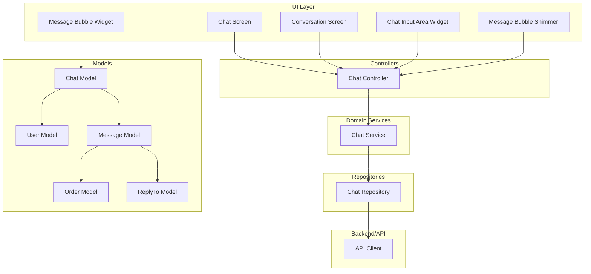
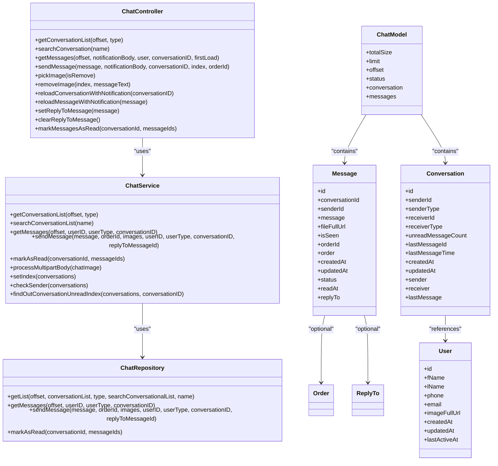
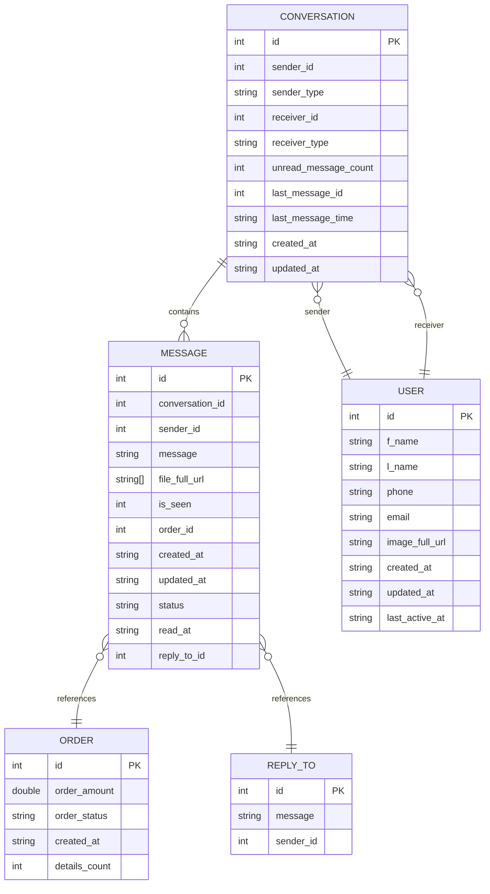
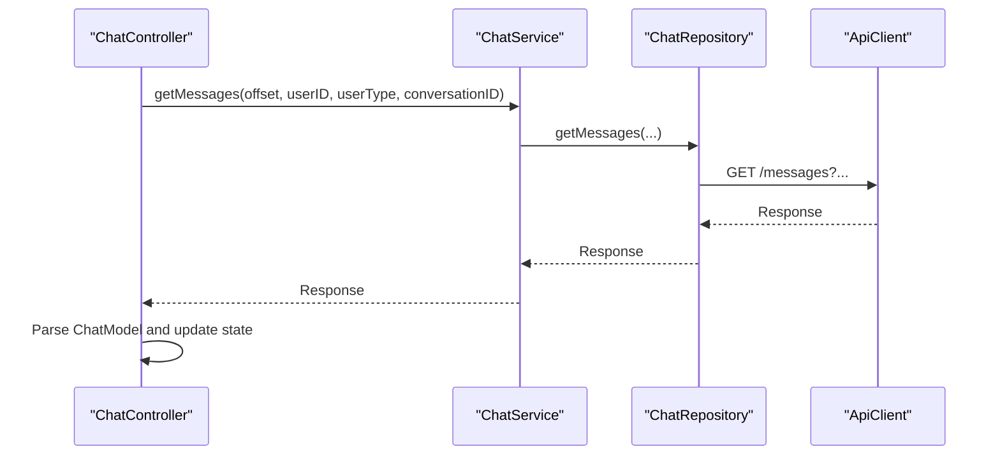
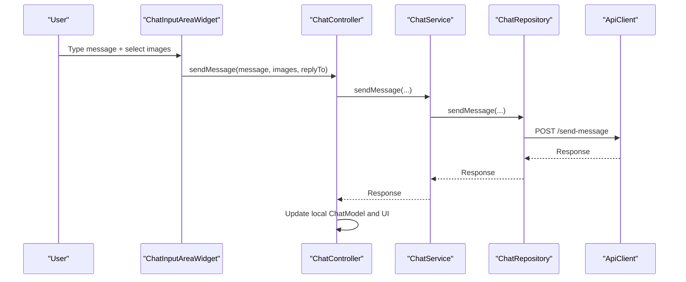
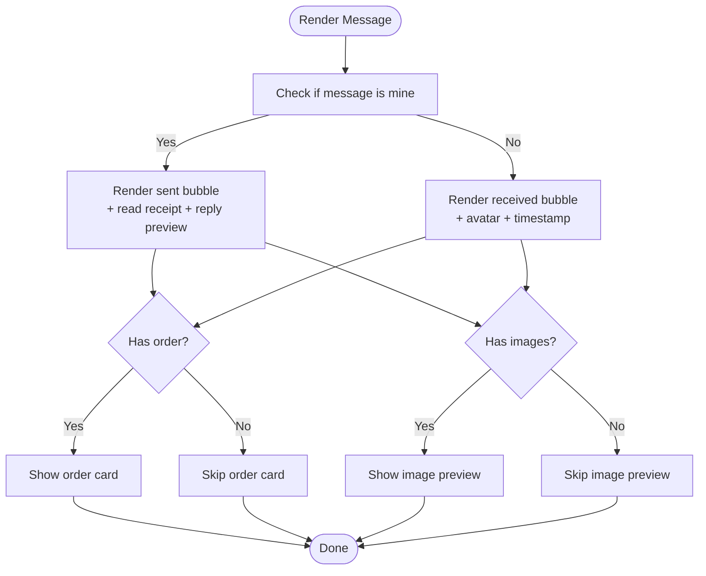
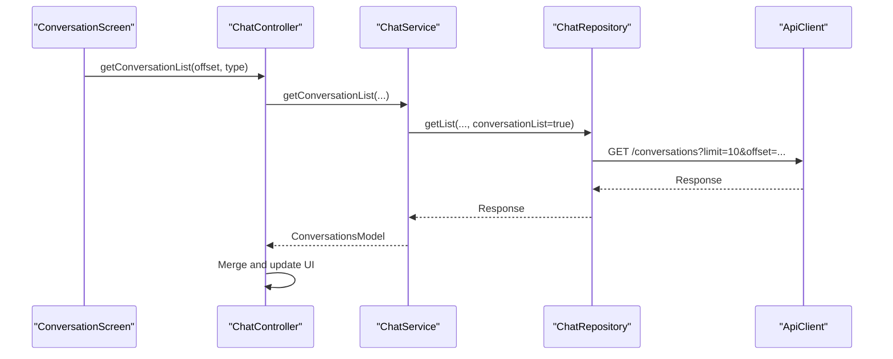
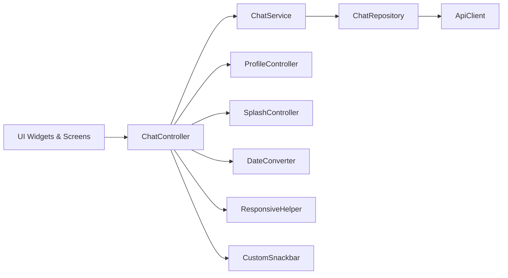

# Chat System

<cite>
**Referenced Files in This Document**
- [chat_controller.dart](file://lib/features/chat/controllers/chat_controller.dart)
- [chat_model.dart](file://lib/features/chat/domain/models/chat_model.dart)
- [conversation_model.dart](file://lib/features/chat/domain/models/conversation_model.dart)
- [chat_repository.dart](file://lib/features/chat/domain/repositories/chat_repository.dart)
- [chat_service.dart](file://lib/features/chat/domain/services/chat_service.dart)
- [message_bubble_widget.dart](file://lib/features/chat/widgets/message_bubble_widget.dart)
- [message_bubble_shimmer.dart](file://lib/features/chat/widgets/message_bubble_shimmer.dart)
- [chat_screen.dart](file://lib/features/chat/screens/chat_screen.dart)
- [conversation_screen.dart](file://lib/features/chat/screens/conversation_screen.dart)
- [chat_input_area_widget.dart](file://lib/features/chat/widgets/chat_input_area_widget.dart)
- [image_file_view_widget.dart](file://lib/features/chat/widgets/image_file_view_widget.dart)
- [api_client.dart](file://lib/api/api_client.dart)
- [config_model.dart](file://lib/common/models/config_model.dart)
- [profile_controller.dart](file://lib/features/profile/controllers/profile_controller.dart)
- [splash_controller.dart](file://lib/features/splash/controllers/splash_controller.dart)
- [date_converter.dart](file://lib/helper/date_converter.dart)
- [responsive_helper.dart](file://lib/helper/responsive_helper.dart)
- [custom_snackbar.dart](file://lib/common/widgets/custom_snackbar.dart)
- [firebase-messaging-sw.js](file://web/firebase-messaging-sw.js)
- [google-services.json](file://android/app/google-services.json)
- [Podfile](file://ios/Podfile)
</cite>

## Table of Contents
1. [Introduction](#introduction)
2. [Project Structure](#project-structure)
3. [Core Components](#core-components)
4. [Architecture Overview](#architecture-overview)
5. [Detailed Component Analysis](#detailed-component-analysis)
6. [Dependency Analysis](#dependency-analysis)
7. [Performance Considerations](#performance-considerations)
8. [Troubleshooting Guide](#troubleshooting-guide)
9. [Conclusion](#conclusion)
10. [Appendices](#appendices)

## Introduction
This document describes the chat system for real-time messaging, user-to-user communication, and customer support integration. It covers message models, repository and service layers, UI components for chat screens and input handling, message display, persistence and queuing strategies, offline handling, and integration points for Firebase Cloud Messaging. It also documents chat room management, message status tracking, and practical guidance for performance and scalability.

## Project Structure
The chat system is organized by feature with clear separation of concerns:
- Domain models define message, conversation, order, and reply-to structures
- Service layer orchestrates repository calls and business logic
- Repository handles HTTP requests to backend APIs
- Controllers manage UI state and coordinate flows
- Widgets render messages, input areas, and loading states
- Screens host the chat UI and conversation lists
- Integration points for Firebase Messaging exist in platform-specific configurations

**Diagram sources**
- [chat_controller.dart:16-554](file://lib/features/chat/controllers/chat_controller.dart#L16-L554)
- [chat_service.dart:9-140](file://lib/features/chat/domain/services/chat_service.dart#L9-L140)
- [chat_repository.dart:9-136](file://lib/features/chat/domain/repositories/chat_repository.dart#L9-L136)
- [chat_model.dart:3-253](file://lib/features/chat/domain/models/chat_model.dart#L3-L253)
- [conversation_model.dart:3-165](file://lib/features/chat/domain/models/conversation_model.dart#L3-L165)
- [message_bubble_widget.dart:14-507](file://lib/features/chat/widgets/message_bubble_widget.dart#L14-L507)
- [message_bubble_shimmer.dart:7-43](file://lib/features/chat/widgets/message_bubble_shimmer.dart#L7-L43)
- [chat_input_area_widget.dart](file://lib/features/chat/widgets/chat_input_area_widget.dart)
- [chat_screen.dart](file://lib/features/chat/screens/chat_screen.dart)
- [conversation_screen.dart](file://lib/features/chat/screens/conversation_screen.dart)
- [api_client.dart](file://lib/api/api_client.dart)

**Section sources**
- [chat_controller.dart:16-554](file://lib/features/chat/controllers/chat_controller.dart#L16-L554)
- [chat_model.dart:3-253](file://lib/features/chat/domain/models/chat_model.dart#L3-L253)
- [conversation_model.dart:3-165](file://lib/features/chat/domain/models/conversation_model.dart#L3-L165)
- [chat_repository.dart:9-136](file://lib/features/chat/domain/repositories/chat_repository.dart#L9-L136)
- [chat_service.dart:9-140](file://lib/features/chat/domain/services/chat_service.dart#L9-L140)
- [message_bubble_widget.dart:14-507](file://lib/features/chat/widgets/message_bubble_widget.dart#L14-L507)
- [message_bubble_shimmer.dart:7-43](file://lib/features/chat/widgets/message_bubble_shimmer.dart#L7-L43)
- [chat_screen.dart](file://lib/features/chat/screens/chat_screen.dart)
- [conversation_screen.dart](file://lib/features/chat/screens/conversation_screen.dart)
- [chat_input_area_widget.dart](file://lib/features/chat/widgets/chat_input_area_widget.dart)

## Core Components
- Message model encapsulates text, files, order attachments, timestamps, and enhanced status fields for read receipts and reply-to references
- Conversation model tracks participants, unread counts, and last message metadata
- Chat controller coordinates fetching messages, sending messages, managing reply-to state, and updating UI
- Chat service provides orchestration between repository and controller
- Chat repository performs HTTP requests to endpoints for conversations, messages, sending, and marking as read
- UI widgets render message bubbles, order previews, image attachments, and shimmer loaders

Key capabilities:
- Multi-entity support: admin, vendor, delivery man
- Reply-to message references
- Read receipts with status tracking
- Order sharing within messages
- Image attachment handling with limits

**Section sources**
- [chat_model.dart:53-132](file://lib/features/chat/domain/models/chat_model.dart#L53-L132)
- [conversation_model.dart:40-114](file://lib/features/chat/domain/models/conversation_model.dart#L40-L114)
- [chat_controller.dart:16-554](file://lib/features/chat/controllers/chat_controller.dart#L16-L554)
- [chat_service.dart:9-140](file://lib/features/chat/domain/services/chat_service.dart#L9-L140)
- [chat_repository.dart:9-136](file://lib/features/chat/domain/repositories/chat_repository.dart#L9-L136)
- [message_bubble_widget.dart:14-507](file://lib/features/chat/widgets/message_bubble_widget.dart#L14-L507)

## Architecture Overview
The system follows a layered architecture:
- Presentation: Screens and widgets
- Controller: State and flow coordination
- Service: Business logic and orchestration
- Repository: Network and persistence abstraction
- Models: Data structures
- Backend: REST endpoints via API client

**Diagram sources**
- [chat_controller.dart:16-554](file://lib/features/chat/controllers/chat_controller.dart#L16-L554)
- [chat_service.dart:9-140](file://lib/features/chat/domain/services/chat_service.dart#L9-L140)
- [chat_repository.dart:9-136](file://lib/features/chat/domain/repositories/chat_repository.dart#L9-L136)
- [chat_model.dart:3-253](file://lib/features/chat/domain/models/chat_model.dart#L3-L253)
- [conversation_model.dart:3-165](file://lib/features/chat/domain/models/conversation_model.dart#L3-L165)

## Detailed Component Analysis

### Message Models
- Message: core unit with text, optional file URLs, order reference, timestamps, read status, read-at, and reply-to metadata
- Conversation: thread metadata including participants, unread count, last message, and timestamps
- User: participant identity with optional last-active indicator
- Order: embedded order details for order-linked messages
- ReplyTo: lightweight reference for reply-to functionality

**Diagram sources**
- [chat_model.dart:53-132](file://lib/features/chat/domain/models/chat_model.dart#L53-L132)
- [conversation_model.dart:40-114](file://lib/features/chat/domain/models/conversation_model.dart#L40-L114)

**Section sources**
- [chat_model.dart:53-132](file://lib/features/chat/domain/models/chat_model.dart#L53-L132)
- [conversation_model.dart:40-114](file://lib/features/chat/domain/models/conversation_model.dart#L40-L114)

### Repository Implementation
- Retrieves conversation lists with pagination and type filtering
- Searches conversations by name
- Fetches paginated messages for admin/vendor/delivery-man contexts
- Sends messages with optional order ID, images, and reply-to references
- Marks messages as read via batch IDs

**Diagram sources**
- [chat_controller.dart:221-320](file://lib/features/chat/controllers/chat_controller.dart#L221-L320)
- [chat_service.dart:34-46](file://lib/features/chat/domain/services/chat_service.dart#L34-L46)
- [chat_repository.dart:54-70](file://lib/features/chat/domain/repositories/chat_repository.dart#L54-L70)
- [api_client.dart](file://lib/api/api_client.dart)

**Section sources**
- [chat_repository.dart:29-136](file://lib/features/chat/domain/repositories/chat_repository.dart#L29-L136)
- [chat_service.dart:14-72](file://lib/features/chat/domain/services/chat_service.dart#L14-L72)
- [chat_controller.dart:87-320](file://lib/features/chat/controllers/chat_controller.dart#L87-L320)

### Real-Time Data Synchronization
- Current implementation relies on polling via pagination and manual refresh triggers
- Read receipts are supported locally with status updates and server-side acknowledgment
- No explicit WebSocket or Firebase Realtime Database integration is present in the analyzed code

Recommendations:
- Integrate Firebase Cloud Messaging for push notifications
- Consider Firestore or RTDB listeners for near real-time updates
- Implement optimistic UI updates with conflict resolution

**Section sources**
- [chat_controller.dart:446-448](file://lib/features/chat/controllers/chat_controller.dart#L446-L448)
- [chat_model.dart:64-67](file://lib/features/chat/domain/models/chat_model.dart#L64-L67)
- [firebase-messaging-sw.js](file://web/firebase-messaging-sw.js)
- [google-services.json](file://android/app/google-services.json)
- [Podfile](file://ios/Podfile)

### Chat Screen Architecture and Input Handling
- Chat screen displays message history and input area
- Input area supports text, image attachments (limited), and reply-to selection
- Message bubble widget renders received vs sent messages, order previews, and read receipts
- Shimmer widget provides loading feedback during initial fetch

**Diagram sources**
- [chat_input_area_widget.dart](file://lib/features/chat/widgets/chat_input_area_widget.dart)
- [chat_controller.dart:354-452](file://lib/features/chat/controllers/chat_controller.dart#L354-L452)
- [chat_service.dart:49-67](file://lib/features/chat/domain/services/chat_service.dart#L49-L67)
- [chat_repository.dart:73-106](file://lib/features/chat/domain/repositories/chat_repository.dart#L73-L106)
- [api_client.dart](file://lib/api/api_client.dart)

**Section sources**
- [chat_screen.dart](file://lib/features/chat/screens/chat_screen.dart)
- [chat_input_area_widget.dart](file://lib/features/chat/widgets/chat_input_area_widget.dart)
- [message_bubble_widget.dart:14-507](file://lib/features/chat/widgets/message_bubble_widget.dart#L14-L507)
- [message_bubble_shimmer.dart:7-43](file://lib/features/chat/widgets/message_bubble_shimmer.dart#L7-L43)
- [chat_controller.dart:322-452](file://lib/features/chat/controllers/chat_controller.dart#L322-L452)

### Message Display Components
- MessageBubbleWidget renders:
  - Received messages with avatar and timestamp
  - Sent messages with avatar, read receipt icons, and reply-to preview
  - Order cards embedded within messages
  - Image attachments with dedicated preview widget
- Read receipt icons reflect status: sent, delivered, read
- Timestamps use localized conversion helpers

**Diagram sources**
- [message_bubble_widget.dart:25-289](file://lib/features/chat/widgets/message_bubble_widget.dart#L25-L289)
- [image_file_view_widget.dart](file://lib/features/chat/widgets/image_file_view_widget.dart)

**Section sources**
- [message_bubble_widget.dart:14-507](file://lib/features/chat/widgets/message_bubble_widget.dart#L14-L507)
- [image_file_view_widget.dart](file://lib/features/chat/widgets/image_file_view_widget.dart)

### Chat Persistence, Queuing, and Offline Handling
- Persistence: messages are fetched via pagination and stored in controller state
- Queuing: no explicit message queue is implemented; send operations rely on immediate network calls
- Offline handling: no offline message storage or retry mechanisms are present

Recommendations:
- Persist recent messages to local storage for offline viewing
- Queue outgoing messages when offline and flush on connectivity
- Implement optimistic updates with rollback on failure

**Section sources**
- [chat_controller.dart:221-320](file://lib/features/chat/controllers/chat_controller.dart#L221-L320)
- [chat_repository.dart:54-106](file://lib/features/chat/domain/repositories/chat_repository.dart#L54-L106)

### Chat Room Management
- Conversation list management includes:
  - Pagination with offset-based loading
  - Search by name with combined results
  - Unread count reset on first load
  - Dynamic admin participant injection for mobile contexts
- Conversation metadata includes sender/receiver types and last message time

**Diagram sources**
- [chat_controller.dart:87-134](file://lib/features/chat/controllers/chat_controller.dart#L87-L134)
- [chat_service.dart:14-23](file://lib/features/chat/domain/services/chat_service.dart#L14-L23)
- [chat_repository.dart:14-41](file://lib/features/chat/domain/repositories/chat_repository.dart#L14-L41)

**Section sources**
- [chat_controller.dart:87-134](file://lib/features/chat/controllers/chat_controller.dart#L87-L134)
- [conversation_model.dart:3-38](file://lib/features/chat/domain/models/conversation_model.dart#L3-L38)

### Message Encryption and Spam Prevention
- No encryption or spam prevention logic is present in the analyzed code
- Recommendations:
  - Apply transport encryption (HTTPS/TLS) via backend APIs
  - Implement rate limiting and content moderation on the server
  - Add client-side sanitization and length limits

**Section sources**
- [chat_model.dart:53-132](file://lib/features/chat/domain/models/chat_model.dart#L53-L132)
- [chat_repository.dart:73-106](file://lib/features/chat/domain/repositories/chat_repository.dart#L73-L106)

## Dependency Analysis
- Controllers depend on services for orchestration
- Services depend on repositories for data access
- Repositories depend on API client for HTTP operations
- UI widgets depend on models and helpers for rendering
- Controllers depend on profile and splash controllers for user/business metadata

**Diagram sources**
- [chat_controller.dart:16-554](file://lib/features/chat/controllers/chat_controller.dart#L16-L554)
- [chat_service.dart:9-140](file://lib/features/chat/domain/services/chat_service.dart#L9-L140)
- [chat_repository.dart:9-136](file://lib/features/chat/domain/repositories/chat_repository.dart#L9-L136)
- [api_client.dart](file://lib/api/api_client.dart)
- [profile_controller.dart](file://lib/features/profile/controllers/profile_controller.dart)
- [splash_controller.dart](file://lib/features/splash/controllers/splash_controller.dart)
- [date_converter.dart](file://lib/helper/date_converter.dart)
- [responsive_helper.dart](file://lib/helper/responsive_helper.dart)
- [custom_snackbar.dart](file://lib/common/widgets/custom_snackbar.dart)

**Section sources**
- [chat_controller.dart:16-554](file://lib/features/chat/controllers/chat_controller.dart#L16-L554)
- [chat_service.dart:9-140](file://lib/features/chat/domain/services/chat_service.dart#L9-L140)
- [chat_repository.dart:9-136](file://lib/features/chat/domain/repositories/chat_repository.dart#L9-L136)

## Performance Considerations
- Pagination: Use offset-based pagination to avoid loading large histories at once
- Virtualization: Implement list virtualization for long message histories
- Image handling: Limit attachment count and compress images before upload
- Read receipts: Batch mark-as-read operations to reduce network calls
- Memory: Clear cached images after use and avoid holding large lists in memory
- Offline: Cache recent messages and images for offline access

[No sources needed since this section provides general guidance]

## Troubleshooting Guide
Common issues and remedies:
- Empty or stale message lists: Trigger manual refresh and verify pagination parameters
- Send button inactive: Ensure text or images are selected; verify controller state updates
- Read receipts not updating: Confirm server-side read endpoint and local status updates
- Image upload failures: Check attachment limits and network connectivity
- Notifications not appearing: Verify Firebase Messaging setup in platform configs

**Section sources**
- [chat_controller.dart:322-452](file://lib/features/chat/controllers/chat_controller.dart#L322-L452)
- [custom_snackbar.dart:5-25](file://lib/common/widgets/custom_snackbar.dart#L5-L25)
- [firebase-messaging-sw.js](file://web/firebase-messaging-sw.js)
- [google-services.json](file://android/app/google-services.json)
- [Podfile](file://ios/Podfile)

## Conclusion
The chat system provides a solid foundation for user-to-user messaging and customer support integration with clear models, service orchestration, and UI components. While it currently relies on polling and lacks native real-time synchronization, the architecture supports incremental enhancements such as Firebase integration, message queuing, and improved offline handling. The modular design enables safe extension for encryption, spam prevention, and performance optimizations.

## Appendices

### API Endpoints Used
- GET /conversations
- GET /search-conversations
- GET /messages
- POST /send-message
- POST /mark-message-read

**Section sources**
- [chat_repository.dart:34-106](file://lib/features/chat/domain/repositories/chat_repository.dart#L34-L106)

### Example Workflows
- User sends a message:
  - Input collected in chat input area
  - Controller invokes service to send message
  - Repository posts to /send-message
  - Controller updates local state and UI
- User receives a notification:
  - Controller reloads messages for the relevant conversation
  - UI updates with latest messages

**Section sources**
- [chat_controller.dart:354-452](file://lib/features/chat/controllers/chat_controller.dart#L354-L452)
- [chat_controller.dart:505-508](file://lib/features/chat/controllers/chat_controller.dart#L505-L508)

### Message Types and Interaction Patterns
- Text messages with optional order attachments
- Image attachments with preview
- Reply-to message references
- Read receipts with status indicators
- Order cards embedded within messages

**Section sources**
- [chat_model.dart:53-132](file://lib/features/chat/domain/models/chat_model.dart#L53-L132)
- [message_bubble_widget.dart:14-507](file://lib/features/chat/widgets/message_bubble_widget.dart#L14-L507)

### Integration Notes
- Firebase Messaging:
  - Web service worker exists for push notifications
  - Android and iOS require Firebase configuration files and pods
- Backend:
  - API client handles HTTP requests to chat endpoints
  - Config model exposes business metadata for admin conversations

**Section sources**
- [firebase-messaging-sw.js](file://web/firebase-messaging-sw.js)
- [google-services.json](file://android/app/google-services.json)
- [Podfile](file://ios/Podfile)
- [config_model.dart:409-484](file://lib/common/models/config_model.dart#L409-L484)