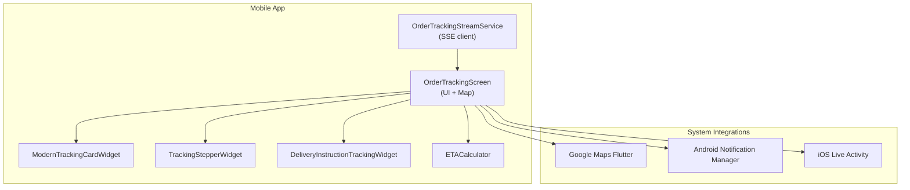
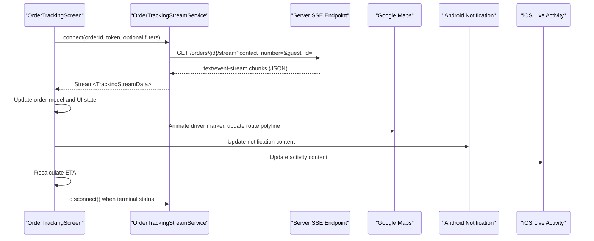
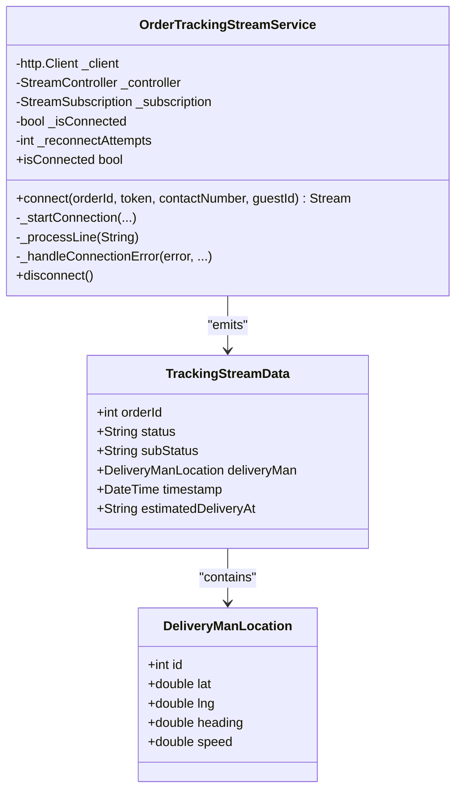
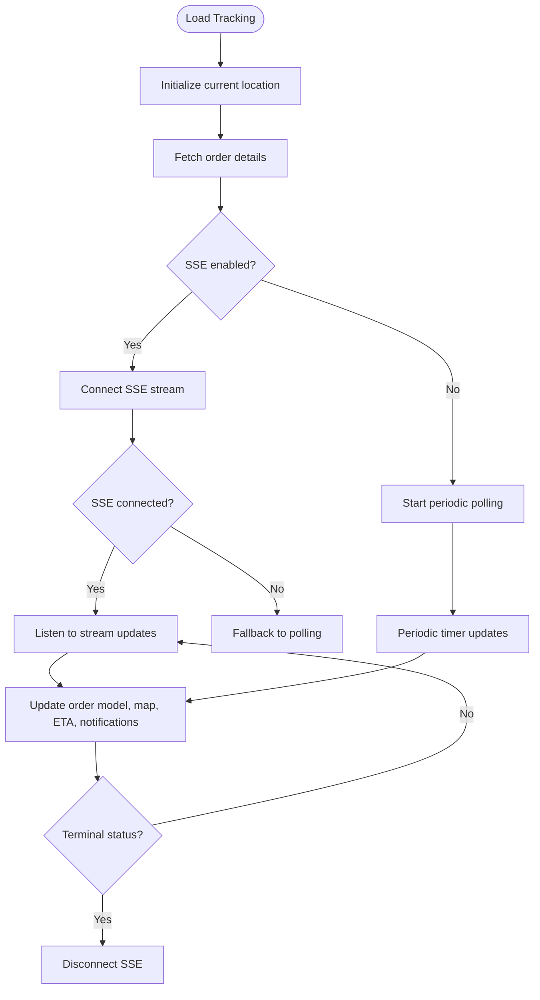
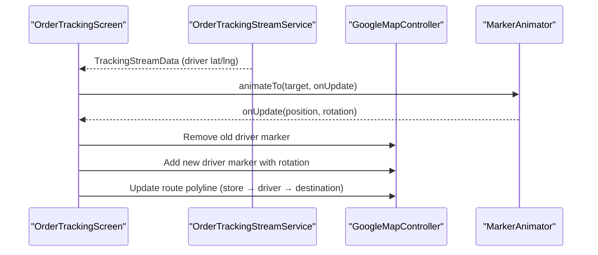
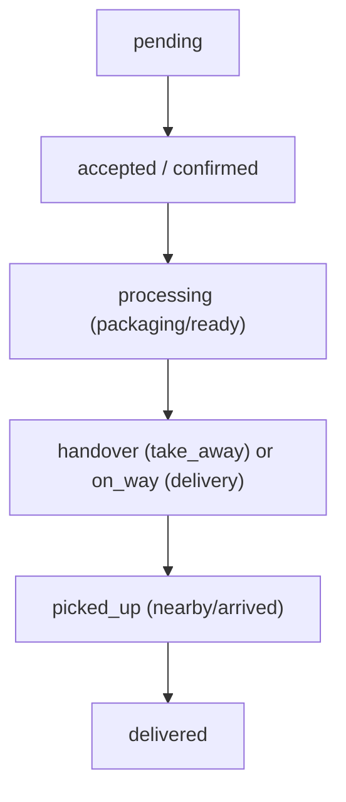
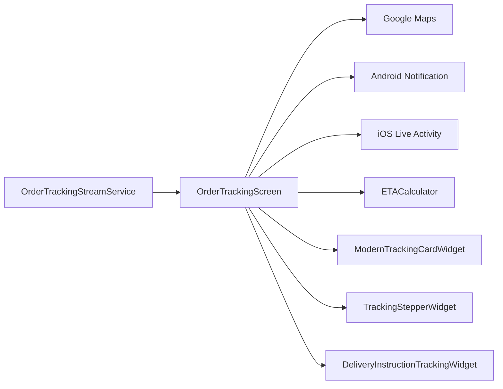

# Live Order Tracking

<cite>
**Referenced Files in This Document**
- [order_tracking_stream_service.dart](file://lib/features/order/domain/services/order_tracking_stream_service.dart)
- [order_tracking_screen.dart](file://lib/features/order/screens/order_tracking_screen.dart)
- [OrderTrackingNotificationManager.kt](file://android/app/src/main/kotlin/com/sixamtech/efood_multivendor/OrderTrackingNotificationManager.kt)
- [OrderTrackingAttributes.swift](file://ios/WaddiLiveActivity/OrderTrackingAttributes.swift)
- [modern_tracking_card_widget.dart](file://lib/features/order/widgets/modern_tracking_card_widget.dart)
- [tracking_stepper_widget.dart](file://lib/features/order/widgets/tracking_stepper_widget.dart)
- [delivery_instruction_tracking_widget.dart](file://lib/features/order/widgets/delivery_instruction_tracking_widget.dart)
- [eta_calculator.dart](file://lib/helper/eta_calculator.dart)
</cite>

## Table of Contents
1. [Introduction](#introduction)
2. [Project Structure](#project-structure)
3. [Core Components](#core-components)
4. [Architecture Overview](#architecture-overview)
5. [Detailed Component Analysis](#detailed-component-analysis)
6. [Dependency Analysis](#dependency-analysis)
7. [Performance Considerations](#performance-considerations)
8. [Troubleshooting Guide](#troubleshooting-guide)
9. [Conclusion](#conclusion)

## Introduction
This document describes the live order tracking system, focusing on real-time order status updates, geolocation tracking, and delivery personnel coordination. It documents the OrderTrackingStreamService implementation for real-time data streaming, order status synchronization, Google Maps integration for live tracking and route visualization, and user notification triggers for status changes. It also covers the order tracking widget architecture, map integration patterns, offline tracking capabilities, and error handling for connectivity issues. Performance considerations for real-time updates and battery optimization are addressed.

## Project Structure
The live order tracking feature spans Dart (Flutter) UI and widgets, Android Kotlin notifications, and iOS Live Activity support. The core runtime is driven by a server-sent events (SSE) stream that pushes order and driver location updates to the client.

**Diagram sources**
- [order_tracking_stream_service.dart:67-259](file://lib/features/order/domain/services/order_tracking_stream_service.dart#L67-L259)
- [order_tracking_screen.dart:40-687](file://lib/features/order/screens/order_tracking_screen.dart#L40-L687)
- [OrderTrackingNotificationManager.kt:13-195](file://android/app/src/main/kotlin/com/sixamtech/efood_multivendor/OrderTrackingNotificationManager.kt#L13-L195)
- [OrderTrackingAttributes.swift:7-24](file://ios/WaddiLiveActivity/OrderTrackingAttributes.swift#L7-L24)
- [modern_tracking_card_widget.dart:6-484](file://lib/features/order/widgets/modern_tracking_card_widget.dart#L6-L484)
- [tracking_stepper_widget.dart:6-54](file://lib/features/order/widgets/tracking_stepper_widget.dart#L6-L54)
- [delivery_instruction_tracking_widget.dart:10-136](file://lib/features/order/widgets/delivery_instruction_tracking_widget.dart#L10-L136)
- [eta_calculator.dart:1-151](file://lib/helper/eta_calculator.dart#L1-L151)

**Section sources**
- [order_tracking_stream_service.dart:67-259](file://lib/features/order/domain/services/order_tracking_stream_service.dart#L67-L259)
- [order_tracking_screen.dart:40-687](file://lib/features/order/screens/order_tracking_screen.dart#L40-L687)

## Core Components
- OrderTrackingStreamService: Implements SSE connection to receive real-time order and driver location updates, with automatic reconnection and error handling.
- OrderTrackingScreen: Orchestrates map rendering, driver marker animation, route polyline updates, ETA calculation, Live Activity updates, and fallback polling.
- ModernTrackingCardWidget: Displays order status progression, ETA, and live indicators.
- TrackingStepperWidget: Visual step indicator for order lifecycle.
- DeliveryInstructionTrackingWidget: Shows voice and text delivery instructions.
- ETACalculator: Computes ETA based on driver-to-destination distance and time-of-day traffic factors.
- Android Notification Manager: Manages ongoing notifications with collapsed and expanded views for live tracking.
- iOS Live Activity: Provides a persistent live tile with order status and ETA.

**Section sources**
- [order_tracking_stream_service.dart:8-64](file://lib/features/order/domain/services/order_tracking_stream_service.dart#L8-L64)
- [order_tracking_stream_service.dart:67-259](file://lib/features/order/domain/services/order_tracking_stream_service.dart#L67-L259)
- [order_tracking_screen.dart:53-414](file://lib/features/order/screens/order_tracking_screen.dart#L53-L414)
- [modern_tracking_card_widget.dart:6-484](file://lib/features/order/widgets/modern_tracking_card_widget.dart#L6-L484)
- [tracking_stepper_widget.dart:6-54](file://lib/features/order/widgets/tracking_stepper_widget.dart#L6-L54)
- [delivery_instruction_tracking_widget.dart:10-136](file://lib/features/order/widgets/delivery_instruction_tracking_widget.dart#L10-L136)
- [eta_calculator.dart:1-151](file://lib/helper/eta_calculator.dart#L1-L151)
- [OrderTrackingNotificationManager.kt:13-195](file://android/app/src/main/kotlin/com/sixamtech/efood_multivendor/OrderTrackingNotificationManager.kt#L13-L195)
- [OrderTrackingAttributes.swift:7-24](file://ios/WaddiLiveActivity/OrderTrackingAttributes.swift#L7-L24)

## Architecture Overview
The system uses an SSE-based real-time stream to push order and driver location updates. On receipt, the UI updates the map, driver marker, route polyline, ETA, and status cards. Notifications and Live Activities keep users informed even when the app is inactive.

**Diagram sources**
- [order_tracking_stream_service.dart:77-192](file://lib/features/order/domain/services/order_tracking_stream_service.dart#L77-L192)
- [order_tracking_screen.dart:95-187](file://lib/features/order/screens/order_tracking_screen.dart#L95-L187)
- [OrderTrackingNotificationManager.kt:55-181](file://android/app/src/main/kotlin/com/sixamtech/efood_multivendor/OrderTrackingNotificationManager.kt#L55-L181)
- [OrderTrackingAttributes.swift:8-19](file://ios/WaddiLiveActivity/OrderTrackingAttributes.swift#L8-L19)

## Detailed Component Analysis

### OrderTrackingStreamService (SSE Streaming)
Implements a robust SSE client that:
- Builds a URL with optional query parameters for guest or contact-based tracking.
- Sets appropriate headers for SSE and handles non-200 responses.
- Streams and parses JSON lines, emitting TrackingStreamData objects.
- Manages reconnection attempts with exponential backoff and limits.
- Supports graceful disconnect and cleanup.

Key behaviors:
- Data parsing: Converts JSON lines into TrackingStreamData and DeliveryManLocation models.
- Error handling: Emits errors on connection failures and triggers reconnection attempts.
- Lifecycle: Broadcast stream with cancellation hook to stop listening.

**Diagram sources**
- [order_tracking_stream_service.dart:8-64](file://lib/features/order/domain/services/order_tracking_stream_service.dart#L8-L64)
- [order_tracking_stream_service.dart:67-259](file://lib/features/order/domain/services/order_tracking_stream_service.dart#L67-L259)

**Section sources**
- [order_tracking_stream_service.dart:77-192](file://lib/features/order/domain/services/order_tracking_stream_service.dart#L77-L192)
- [order_tracking_stream_service.dart:194-242](file://lib/features/order/domain/services/order_tracking_stream_service.dart#L194-L242)
- [order_tracking_stream_service.dart:244-259](file://lib/features/order/domain/services/order_tracking_stream_service.dart#L244-L259)

### OrderTrackingScreen (Real-Time UI and Map Integration)
Responsibilities:
- Initializes location and order tracking on load.
- Starts SSE tracking; falls back to periodic polling if SSE fails.
- Updates order model with status, sub-status, and delivery man coordinates.
- Animates driver marker movement and updates route polyline from store to driver to destination.
- Calculates ETA using ETACalculator and updates UI.
- Manages Live Activity updates and termination on terminal statuses.
- Handles app lifecycle to pause timers when backgrounded.

**Diagram sources**
- [order_tracking_screen.dart:70-92](file://lib/features/order/screens/order_tracking_screen.dart#L70-L92)
- [order_tracking_screen.dart:95-118](file://lib/features/order/screens/order_tracking_screen.dart#L95-L118)
- [order_tracking_screen.dart:330-385](file://lib/features/order/screens/order_tracking_screen.dart#L330-L385)

**Section sources**
- [order_tracking_screen.dart:95-187](file://lib/features/order/screens/order_tracking_screen.dart#L95-L187)
- [order_tracking_screen.dart:189-282](file://lib/features/order/screens/order_tracking_screen.dart#L189-L282)
- [order_tracking_screen.dart:330-385](file://lib/features/order/screens/order_tracking_screen.dart#L330-L385)

### Map Integration and Driver Animation
- Driver marker is animated smoothly to new positions received from the stream.
- Route polyline is dynamically updated to reflect the store → driver → destination path.
- Camera is centered between store and destination, adjusting zoom based on platform and responsive layout.

**Diagram sources**
- [order_tracking_screen.dart:146-158](file://lib/features/order/screens/order_tracking_screen.dart#L146-L158)
- [order_tracking_screen.dart:207-235](file://lib/features/order/screens/order_tracking_screen.dart#L207-L235)
- [order_tracking_screen.dart:238-282](file://lib/features/order/screens/order_tracking_screen.dart#L238-L282)

**Section sources**
- [order_tracking_screen.dart:207-235](file://lib/features/order/screens/order_tracking_screen.dart#L207-L235)
- [order_tracking_screen.dart:238-282](file://lib/features/order/screens/order_tracking_screen.dart#L238-L282)

### ETA Calculation and Display
- Distance computed using spherical law of cosines.
- Speed varies by time-of-day to simulate traffic conditions.
- ETA range shown with buffer; display text adapts to “arriving now” or minute ranges.

**Diagram sources**
- [eta_calculator.dart:4-28](file://lib/helper/eta_calculator.dart#L4-L28)
- [eta_calculator.dart:31-42](file://lib/helper/eta_calculator.dart#L31-L42)
- [order_tracking_screen.dart:190-204](file://lib/features/order/screens/order_tracking_screen.dart#L190-L204)

**Section sources**
- [eta_calculator.dart:1-151](file://lib/helper/eta_calculator.dart#L1-L151)
- [order_tracking_screen.dart:190-204](file://lib/features/order/screens/order_tracking_screen.dart#L190-L204)

### Order Status Transitions and UI Updates
- Status-driven card styling and step progression.
- Sub-status nuances (e.g., packaging, ready, nearby, arrived) refine messaging.
- Terminal statuses trigger SSE disconnection and Live Activity termination.

**Diagram sources**
- [modern_tracking_card_widget.dart:369-459](file://lib/features/order/widgets/modern_tracking_card_widget.dart#L369-L459)
- [order_tracking_screen.dart:182-187](file://lib/features/order/screens/order_tracking_screen.dart#L182-L187)

**Section sources**
- [modern_tracking_card_widget.dart:6-484](file://lib/features/order/widgets/modern_tracking_card_widget.dart#L6-L484)
- [tracking_stepper_widget.dart:6-54](file://lib/features/order/widgets/tracking_stepper_widget.dart#L6-L54)

### Delivery Instructions Widget
- Conditionally visible when order is in active statuses and not take-away.
- Renders voice player and text-based instruction chips with contextual icons.

**Section sources**
- [delivery_instruction_tracking_widget.dart:10-136](file://lib/features/order/widgets/delivery_instruction_tracking_widget.dart#L10-L136)
- [order_tracking_screen.dart:689-697](file://lib/features/order/screens/order_tracking_screen.dart#L689-L697)

### Offline Tracking and Fallback Mechanisms
- SSE failure triggers fallback to periodic polling via a timer.
- Polling continues until terminal order status is reached.
- App lifecycle paused state cancels timers and disposes map resources.

**Section sources**
- [order_tracking_screen.dart:113-118](file://lib/features/order/screens/order_tracking_screen.dart#L113-L118)
- [order_tracking_screen.dart:330-385](file://lib/features/order/screens/order_tracking_screen.dart#L330-L385)
- [order_tracking_screen.dart:396-403](file://lib/features/order/screens/order_tracking_screen.dart#L396-L403)

### Notifications and Live Activities
- Android notification channel created with custom collapsed and expanded views.
- Notification content updates per status, sub-status, ETA, and driver/store metadata.
- iOS Live Activity attributes define state fields for persistent status display.

**Section sources**
- [OrderTrackingNotificationManager.kt:39-53](file://android/app/src/main/kotlin/com/sixamtech/efood_multivendor/OrderTrackingNotificationManager.kt#L39-L53)
- [OrderTrackingNotificationManager.kt:89-181](file://android/app/src/main/kotlin/com/sixamtech/efood_multivendor/OrderTrackingNotificationManager.kt#L89-L181)
- [OrderTrackingAttributes.swift:8-19](file://ios/WaddiLiveActivity/OrderTrackingAttributes.swift#L8-L19)

## Dependency Analysis
The tracking system exhibits clear separation of concerns:
- UI depends on OrderTrackingStreamService for real-time updates.
- Map rendering and animations depend on driver positions and route construction.
- Notifications and Live Activities depend on status and ETA updates.
- ETA calculation is decoupled and reusable.

**Diagram sources**
- [order_tracking_stream_service.dart:67-259](file://lib/features/order/domain/services/order_tracking_stream_service.dart#L67-L259)
- [order_tracking_screen.dart:40-687](file://lib/features/order/screens/order_tracking_screen.dart#L40-L687)
- [OrderTrackingNotificationManager.kt:13-195](file://android/app/src/main/kotlin/com/sixamtech/efood_multivendor/OrderTrackingNotificationManager.kt#L13-L195)
- [OrderTrackingAttributes.swift:7-24](file://ios/WaddiLiveActivity/OrderTrackingAttributes.swift#L7-L24)
- [modern_tracking_card_widget.dart:6-484](file://lib/features/order/widgets/modern_tracking_card_widget.dart#L6-L484)
- [tracking_stepper_widget.dart:6-54](file://lib/features/order/widgets/tracking_stepper_widget.dart#L6-L54)
- [delivery_instruction_tracking_widget.dart:10-136](file://lib/features/order/widgets/delivery_instruction_tracking_widget.dart#L10-L136)
- [eta_calculator.dart:1-151](file://lib/helper/eta_calculator.dart#L1-L151)

**Section sources**
- [order_tracking_stream_service.dart:67-259](file://lib/features/order/domain/services/order_tracking_stream_service.dart#L67-L259)
- [order_tracking_screen.dart:40-687](file://lib/features/order/screens/order_tracking_screen.dart#L40-L687)

## Performance Considerations
- SSE vs. Polling: Prefer SSE for real-time updates; fallback to polling minimizes network overhead while ensuring continuity.
- Map Updates: Batch marker and polyline updates; avoid frequent rebuilds by replacing markers and updating lists efficiently.
- ETA Computation: Keep distance and speed calculations lightweight; cache intermediate values when possible.
- Battery Optimization: Reduce update frequency when the app is backgrounded; cancel timers and subscriptions; dispose map controllers.
- Network Resilience: Limit reconnection attempts and delays to prevent excessive resource usage; surface errors to users when retries are exhausted.

[No sources needed since this section provides general guidance]

## Troubleshooting Guide
Common issues and resolutions:
- SSE connection fails: Verify token and endpoint URL; check network permissions; observe reconnection attempts and error messages.
- No updates on map: Ensure driver coordinates are present in stream data; confirm marker replacement and polyline rebuild logic.
- ETA not updating: Confirm destination coordinates are available; validate distance calculation and ETA result formatting.
- Notifications not appearing: Check notification channel creation and importance level; ensure proper intents and auto-cancel behavior.
- Live Activity not updating: Validate terminal status detection and activity update calls; ensure attributes match expected state.

**Section sources**
- [order_tracking_stream_service.dart:135-145](file://lib/features/order/domain/services/order_tracking_stream_service.dart#L135-L145)
- [order_tracking_stream_service.dart:228-234](file://lib/features/order/domain/services/order_tracking_stream_service.dart#L228-L234)
- [order_tracking_screen.dart:182-187](file://lib/features/order/screens/order_tracking_screen.dart#L182-L187)
- [OrderTrackingNotificationManager.kt:39-53](file://android/app/src/main/kotlin/com/sixamtech/efood_multivendor/OrderTrackingNotificationManager.kt#L39-L53)

## Conclusion
The live order tracking system integrates SSE-based real-time updates with a responsive UI, accurate ETA computation, and persistent notifications/Live Activities. The modular design supports graceful degradation to polling, efficient map rendering, and robust error handling, delivering a smooth user experience across platforms.