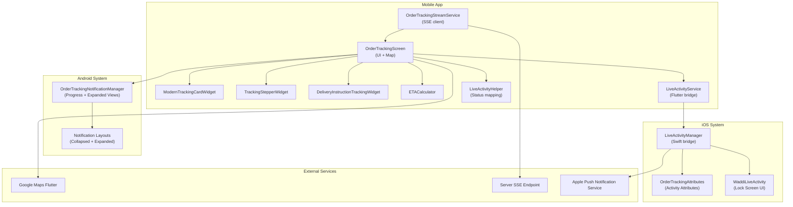
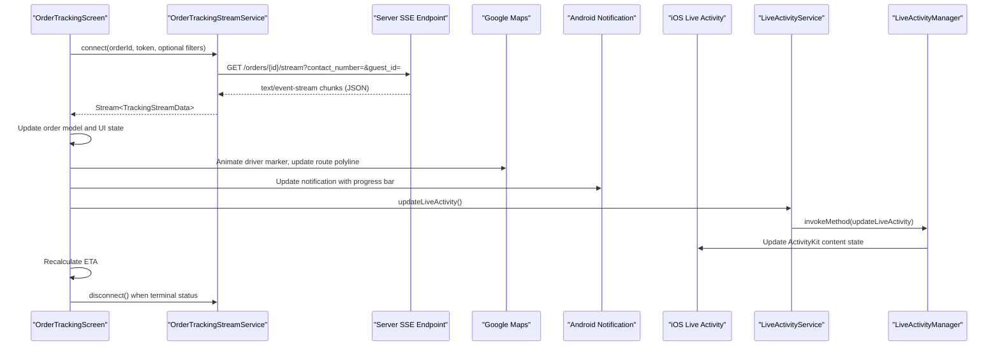
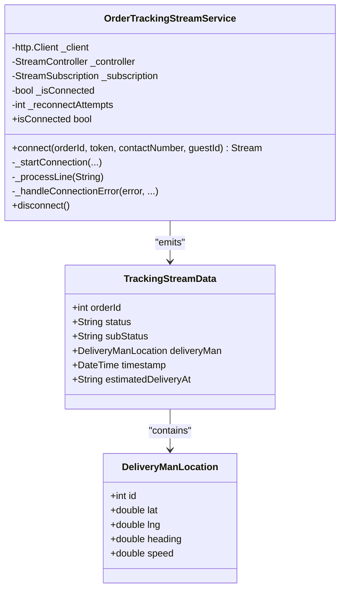
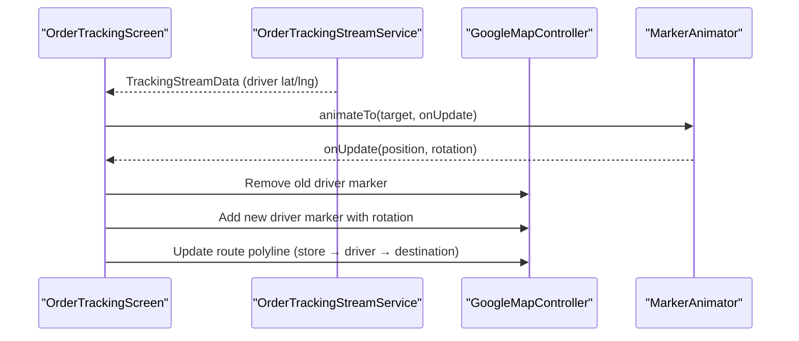
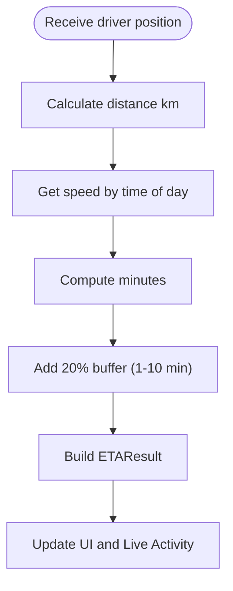
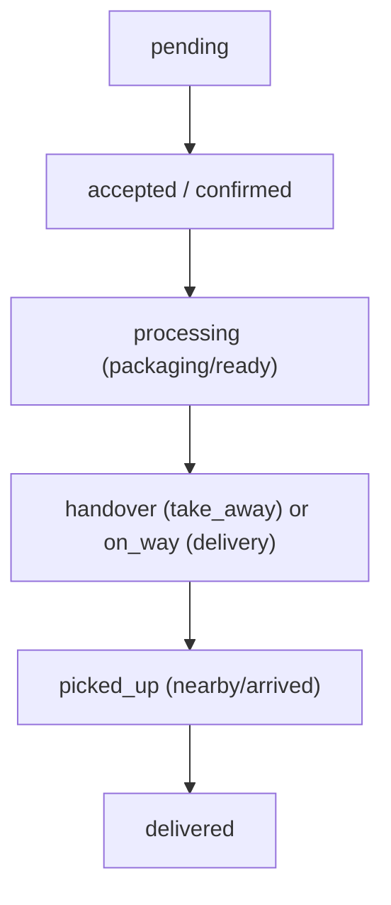
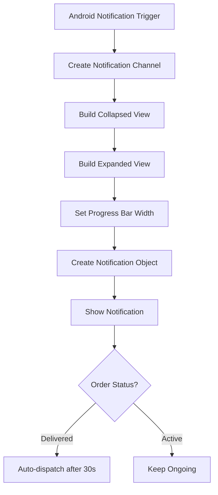
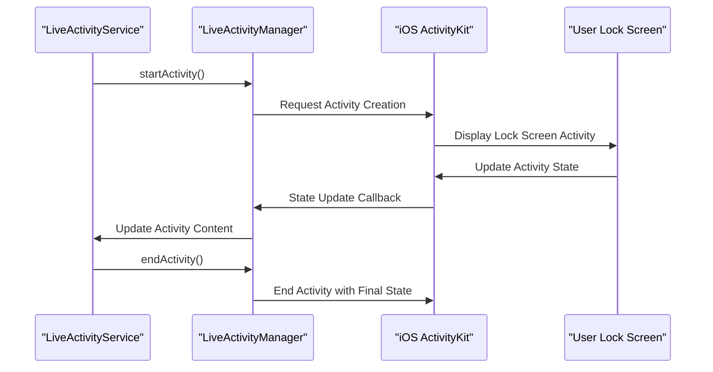
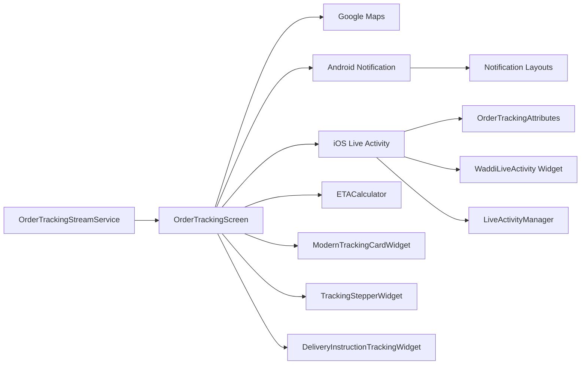

# Live Order Tracking

<cite>
**Referenced Files in This Document**
- [order_tracking_stream_service.dart](file://lib/features/order/domain/services/order_tracking_stream_service.dart)
- [order_tracking_screen.dart](file://lib/features/order/screens/order_tracking_screen.dart)
- [OrderTrackingNotificationManager.kt](file://android/app/src/main/kotlin/com/sixamtech/efood_multivendor/OrderTrackingNotificationManager.kt)
- [OrderTrackingAttributes.swift](file://ios/WaddiLiveActivity/OrderTrackingAttributes.swift)
- [WaddiLiveActivityLiveActivity.swift](file://ios/WaddiLiveActivity/WaddiLiveActivityLiveActivity.swift)
- [LiveActivityManager.swift](file://ios/Runner/LiveActivityManager.swift)
- [LiveActivityService.dart](file://lib/services/live_activity_service.dart)
- [LiveActivityHelper.dart](file://lib/helper/live_activity_helper.dart)
- [notification_order_tracking.xml](file://android/app/src/main/res/layout/notification_order_tracking.xml)
- [notification_order_tracking_expanded.xml](file://android/app/src/main/res/layout/notification_order_tracking_expanded.xml)
- [modern_tracking_card_widget.dart](file://lib/features/order/widgets/modern_tracking_card_widget.dart)
- [tracking_stepper_widget.dart](file://lib/features/order/widgets/tracking_stepper_widget.dart)
- [delivery_instruction_tracking_widget.dart](file://lib/features/order/widgets/delivery_instruction_tracking_widget.dart)
- [eta_calculator.dart](file://lib/helper/eta_calculator.dart)
</cite>

## Update Summary
**Changes Made**
- Enhanced Android notification system with comprehensive progress indicators and expanded view layouts
- Integrated iOS Live Activity framework for persistent lock screen tracking with dynamic island support
- Added sophisticated order status notification system with platform-specific UI components
- Implemented advanced Live Activity management with push token handling and terminal status detection
- Updated notification layouts with progress bars and interactive elements

## Table of Contents
1. [Introduction](#introduction)
2. [Project Structure](#project-structure)
3. [Core Components](#core-components)
4. [Architecture Overview](#architecture-overview)
5. [Detailed Component Analysis](#detailed-component-analysis)
6. [Platform-Specific Features](#platform-specific-features)
7. [Dependency Analysis](#dependency-analysis)
8. [Performance Considerations](#performance-considerations)
9. [Troubleshooting Guide](#troubleshooting-guide)
10. [Conclusion](#conclusion)

## Introduction
This document describes the comprehensive live order tracking system, featuring real-time order status updates, geolocation tracking, and delivery personnel coordination. The system now includes enhanced platform-specific features with Android notification manager supporting progress indicators and iOS Live Activity integration for persistent lock screen tracking. It documents the OrderTrackingStreamService implementation for real-time data streaming, order status synchronization, Google Maps integration for live tracking and route visualization, and sophisticated user notification triggers for status changes across both platforms.

## Project Structure
The live order tracking feature spans Dart (Flutter) UI and widgets, Android Kotlin notifications with progress indicators, and iOS Live Activity support with dynamic island integration. The core runtime is driven by a server-sent events (SSE) stream that pushes order and driver location updates to the client, complemented by platform-specific persistent notification systems.

**Diagram sources**
- [order_tracking_stream_service.dart:67-259](file://lib/features/order/domain/services/order_tracking_stream_service.dart#L67-L259)
- [order_tracking_screen.dart:40-687](file://lib/features/order/screens/order_tracking_screen.dart#L40-L687)
- [OrderTrackingNotificationManager.kt:13-195](file://android/app/src/main/kotlin/com/sixamtech/efood_multivendor/OrderTrackingNotificationManager.kt#L13-L195)
- [OrderTrackingAttributes.swift:7-24](file://ios/WaddiLiveActivity/OrderTrackingAttributes.swift#L7-L24)
- [WaddiLiveActivityLiveActivity.swift:12-282](file://ios/WaddiLiveActivity/WaddiLiveActivityLiveActivity.swift#L12-L282)
- [LiveActivityManager.swift:8-175](file://ios/Runner/LiveActivityManager.swift#L8-L175)
- [LiveActivityService.dart:8-122](file://lib/services/live_activity_service.dart#L8-L122)
- [LiveActivityHelper.dart:25-109](file://lib/helper/live_activity_helper.dart#L25-L109)
- [notification_order_tracking.xml:1-74](file://android/app/src/main/res/layout/notification_order_tracking.xml#L1-L74)
- [notification_order_tracking_expanded.xml:1-118](file://android/app/src/main/res/layout/notification_order_tracking_expanded.xml#L1-L118)

**Section sources**
- [order_tracking_stream_service.dart:67-259](file://lib/features/order/domain/services/order_tracking_stream_service.dart#L67-L259)
- [order_tracking_screen.dart:40-687](file://lib/features/order/screens/order_tracking_screen.dart#L40-L687)

## Core Components
- **OrderTrackingStreamService**: Implements SSE connection to receive real-time order and driver location updates, with automatic reconnection and error handling.
- **OrderTrackingScreen**: Orchestrates map rendering, driver marker animation, route polyline updates, ETA calculation, Live Activity updates, and fallback polling.
- **ModernTrackingCardWidget**: Displays order status progression, ETA, and live indicators with animated progress bars.
- **TrackingStepperWidget**: Visual step indicator for order lifecycle with platform-aware status mapping.
- **DeliveryInstructionTrackingWidget**: Shows voice and text delivery instructions with contextual icons.
- **ETACalculator**: Computes ETA based on driver-to-destination distance and time-of-day traffic factors.
- **OrderTrackingNotificationManager**: Manages Android notifications with comprehensive progress indicators and expanded view layouts.
- **LiveActivityService**: Flutter bridge service for iOS Live Activity management with push token handling.
- **LiveActivityManager**: Swift bridge for Live Activity lifecycle management and state updates.
- **OrderTrackingAttributes**: iOS ActivityKit attributes defining Live Activity state structure.
- **WaddiLiveActivity**: SwiftUI widget implementation for lock screen and dynamic island integration.

**Section sources**
- [order_tracking_stream_service.dart:8-64](file://lib/features/order/domain/services/order_tracking_stream_service.dart#L8-L64)
- [order_tracking_stream_service.dart:67-259](file://lib/features/order/domain/services/order_tracking_stream_service.dart#L67-L259)
- [order_tracking_screen.dart:53-414](file://lib/features/order/screens/order_tracking_screen.dart#L53-L414)
- [modern_tracking_card_widget.dart:6-484](file://lib/features/order/widgets/modern_tracking_card_widget.dart#L6-L484)
- [tracking_stepper_widget.dart:6-54](file://lib/features/order/widgets/tracking_stepper_widget.dart#L6-L54)
- [delivery_instruction_tracking_widget.dart:10-136](file://lib/features/order/widgets/delivery_instruction_tracking_widget.dart#L10-L136)
- [eta_calculator.dart:1-151](file://lib/helper/eta_calculator.dart#L1-L151)
- [OrderTrackingNotificationManager.kt:13-195](file://android/app/src/main/kotlin/com/sixamtech/efood_multivendor/OrderTrackingNotificationManager.kt#L13-L195)
- [OrderTrackingAttributes.swift:7-24](file://ios/WaddiLiveActivity/OrderTrackingAttributes.swift#L7-L24)
- [WaddiLiveActivityLiveActivity.swift:12-282](file://ios/WaddiLiveActivity/WaddiLiveActivityLiveActivity.swift#L12-L282)
- [LiveActivityService.dart:8-122](file://lib/services/live_activity_service.dart#L8-L122)
- [LiveActivityManager.swift:8-175](file://ios/Runner/LiveActivityManager.swift#L8-L175)

## Architecture Overview
The system uses an SSE-based real-time stream to push order and driver location updates. On receipt, the UI updates the map, driver marker, route polyline, ETA, and status cards. Both Android notifications and iOS Live Activities provide persistent tracking even when the app is inactive, with sophisticated progress indicators and dynamic content updates.

**Diagram sources**
- [order_tracking_stream_service.dart:77-192](file://lib/features/order/domain/services/order_tracking_stream_service.dart#L77-L192)
- [order_tracking_screen.dart:95-187](file://lib/features/order/screens/order_tracking_screen.dart#L95-L187)
- [OrderTrackingNotificationManager.kt:55-181](file://android/app/src/main/kotlin/com/sixamtech/efood_multivendor/OrderTrackingNotificationManager.kt#L55-L181)
- [OrderTrackingAttributes.swift:8-19](file://ios/WaddiLiveActivity/OrderTrackingAttributes.swift#L8-L19)
- [LiveActivityService.dart:67-99](file://lib/services/live_activity_service.dart#L67-L99)
- [LiveActivityManager.swift:108-140](file://ios/Runner/LiveActivityManager.swift#L108-L140)

## Detailed Component Analysis

### OrderTrackingStreamService (SSE Streaming)
Implements a robust SSE client that:
- Builds a URL with optional query parameters for guest or contact-based tracking.
- Sets appropriate headers for SSE and handles non-200 responses.
- Streams and parses JSON lines, emitting TrackingStreamData objects.
- Manages reconnection attempts with exponential backoff and limits.
- Supports graceful disconnect and cleanup.

Key behaviors:
- Data parsing: Converts JSON lines into TrackingStreamData and DeliveryManLocation models.
- Error handling: Emits errors on connection failures and triggers reconnection attempts.
- Lifecycle: Broadcast stream with cancellation hook to stop listening.

**Diagram sources**
- [order_tracking_stream_service.dart:8-64](file://lib/features/order/domain/services/order_tracking_stream_service.dart#L8-L64)
- [order_tracking_stream_service.dart:67-259](file://lib/features/order/domain/services/order_tracking_stream_service.dart#L67-L259)

**Section sources**
- [order_tracking_stream_service.dart:77-192](file://lib/features/order/domain/services/order_tracking_stream_service.dart#L77-L192)
- [order_tracking_stream_service.dart:194-242](file://lib/features/order/domain/services/order_tracking_stream_service.dart#L194-L242)
- [order_tracking_stream_service.dart:244-259](file://lib/features/order/domain/services/order_tracking_stream_service.dart#L244-L259)

### OrderTrackingScreen (Real-Time UI and Map Integration)
Responsibilities:
- Initializes location and order tracking on load.
- Starts SSE tracking; falls back to periodic polling if SSE fails.
- Updates order model with status, sub-status, and delivery man coordinates.
- Animates driver marker movement and updates route polyline from store to driver to destination.
- Calculates ETA using ETACalculator and updates UI.
- Manages Live Activity updates and termination on terminal statuses.
- Handles app lifecycle to pause timers when backgrounded.

**Diagram sources**
- [order_tracking_screen.dart:70-92](file://lib/features/order/screens/order_tracking_screen.dart#L70-L92)
- [order_tracking_screen.dart:95-118](file://lib/features/order/screens/order_tracking_screen.dart#L95-L118)
- [order_tracking_screen.dart:330-385](file://lib/features/order/screens/order_tracking_screen.dart#L330-L385)

**Section sources**
- [order_tracking_screen.dart:95-187](file://lib/features/order/screens/order_tracking_screen.dart#L95-L187)
- [order_tracking_screen.dart:189-282](file://lib/features/order/screens/order_tracking_screen.dart#L189-L282)
- [order_tracking_screen.dart:330-385](file://lib/features/order/screens/order_tracking_screen.dart#L330-L385)

### Map Integration and Driver Animation
- Driver marker is animated smoothly to new positions received from the stream.
- Route polyline is dynamically updated to reflect the store → driver → destination path.
- Camera is centered between store and destination, adjusting zoom based on platform and responsive layout.

**Diagram sources**
- [order_tracking_screen.dart:146-158](file://lib/features/order/screens/order_tracking_screen.dart#L146-L158)
- [order_tracking_screen.dart:207-235](file://lib/features/order/screens/order_tracking_screen.dart#L207-L235)
- [order_tracking_screen.dart:238-282](file://lib/features/order/screens/order_tracking_screen.dart#L238-L282)

**Section sources**
- [order_tracking_screen.dart:207-235](file://lib/features/order/screens/order_tracking_screen.dart#L207-L235)
- [order_tracking_screen.dart:238-282](file://lib/features/order/screens/order_tracking_screen.dart#L238-L282)

### ETA Calculation and Display
- Distance computed using spherical law of cosines.
- Speed varies by time-of-day to simulate traffic conditions.
- ETA range shown with buffer; display text adapts to "arriving now" or minute ranges.

**Diagram sources**
- [eta_calculator.dart:4-28](file://lib/helper/eta_calculator.dart#L4-L28)
- [eta_calculator.dart:31-42](file://lib/helper/eta_calculator.dart#L31-L42)
- [order_tracking_screen.dart:190-204](file://lib/features/order/screens/order_tracking_screen.dart#L190-L204)

**Section sources**
- [eta_calculator.dart:1-151](file://lib/helper/eta_calculator.dart#L1-L151)
- [order_tracking_screen.dart:190-204](file://lib/features/order/screens/order_tracking_screen.dart#L190-L204)

### Order Status Transitions and UI Updates
- Status-driven card styling and step progression.
- Sub-status nuances (e.g., packaging, ready, nearby, arrived) refine messaging.
- Terminal statuses trigger SSE disconnection and Live Activity termination.

**Diagram sources**
- [modern_tracking_card_widget.dart:369-459](file://lib/features/order/widgets/modern_tracking_card_widget.dart#L369-L459)
- [order_tracking_screen.dart:182-187](file://lib/features/order/screens/order_tracking_screen.dart#L182-L187)

**Section sources**
- [modern_tracking_card_widget.dart:6-484](file://lib/features/order/widgets/modern_tracking_card_widget.dart#L6-L484)
- [tracking_stepper_widget.dart:6-54](file://lib/features/order/widgets/tracking_stepper_widget.dart#L6-L54)

### Delivery Instructions Widget
- Conditionally visible when order is in active statuses and not take-away.
- Renders voice player and text-based instruction chips with contextual icons.

**Section sources**
- [delivery_instruction_tracking_widget.dart:10-136](file://lib/features/order/widgets/delivery_instruction_tracking_widget.dart#L10-L136)
- [order_tracking_screen.dart:689-697](file://lib/features/order/screens/order_tracking_screen.dart#L689-L697)

### Offline Tracking and Fallback Mechanisms
- SSE failure triggers fallback to periodic polling via a timer.
- Polling continues until terminal order status is reached.
- App lifecycle paused state cancels timers and disposes map resources.

**Section sources**
- [order_tracking_screen.dart:113-118](file://lib/features/order/screens/order_tracking_screen.dart#L113-L118)
- [order_tracking_screen.dart:330-385](file://lib/features/order/screens/order_tracking_screen.dart#L330-L385)
- [order_tracking_screen.dart:396-403](file://lib/features/order/screens/order_tracking_screen.dart#L396-L403)

## Platform-Specific Features

### Android Notification System with Progress Indicators
The Android notification system has been enhanced with comprehensive progress tracking and expanded view layouts:

- **Progress Bar Implementation**: Custom progress bar using `FrameLayout` with `notification_progress_bg` and `notification_progress_fill` drawables
- **Expanded Notification Layout**: Detailed expanded view showing store name, delivery man information, and rate order button
- **Dynamic Content Updates**: Real-time status updates with appropriate icons and text
- **Auto-dismiss Logic**: Automatic dismissal after 30 seconds for delivered orders
- **Interactive Elements**: Tap-to-open functionality and rate order button for delivered items

**Diagram sources**
- [OrderTrackingNotificationManager.kt:89-181](file://android/app/src/main/kotlin/com/sixamtech/efood_multivendor/OrderTrackingNotificationManager.kt#L89-L181)
- [notification_order_tracking.xml:55-71](file://android/app/src/main/res/layout/notification_order_tracking.xml#L55-L71)
- [notification_order_tracking_expanded.xml:101-115](file://android/app/src/main/res/layout/notification_order_tracking_expanded.xml#L101-L115)

**Section sources**
- [OrderTrackingNotificationManager.kt:13-195](file://android/app/src/main/kotlin/com/sixamtech/efood_multivendor/OrderTrackingNotificationManager.kt#L13-L195)
- [notification_order_tracking.xml:1-74](file://android/app/src/main/res/layout/notification_order_tracking.xml#L1-L74)
- [notification_order_tracking_expanded.xml:1-118](file://android/app/src/main/res/layout/notification_order_tracking_expanded.xml#L1-L118)

### iOS Live Activity Integration
The iOS Live Activity system provides persistent tracking on the lock screen with dynamic island support:

- **Activity Attributes**: Structured state management with status, ETA, progress, and metadata
- **Lock Screen Interface**: Full-screen lock screen view with store information and progress tracking
- **Dynamic Island Support**: Compact and expanded representations with step tracking
- **Push Token Management**: Automatic push token collection for APNs integration
- **Terminal Status Handling**: Graceful activity termination with final state updates

**Diagram sources**
- [LiveActivityService.dart:20-65](file://lib/services/live_activity_service.dart#L20-L65)
- [LiveActivityManager.swift:50-106](file://ios/Runner/LiveActivityManager.swift#L50-L106)
- [OrderTrackingAttributes.swift:8-19](file://ios/WaddiLiveActivity/OrderTrackingAttributes.swift#L8-L19)
- [WaddiLiveActivityLiveActivity.swift:12-53](file://ios/WaddiLiveActivity/WaddiLiveActivityLiveActivity.swift#L12-L53)

**Section sources**
- [OrderTrackingAttributes.swift:7-24](file://ios/WaddiLiveActivity/OrderTrackingAttributes.swift#L7-L24)
- [WaddiLiveActivityLiveActivity.swift:12-282](file://ios/WaddiLiveActivity/WaddiLiveActivityLiveActivity.swift#L12-L282)
- [LiveActivityManager.swift:8-175](file://ios/Runner/LiveActivityManager.swift#L8-L175)
- [LiveActivityService.dart:8-122](file://lib/services/live_activity_service.dart#L8-L122)
- [LiveActivityHelper.dart:25-109](file://lib/helper/live_activity_helper.dart#L25-L109)

### Sophisticated Order Status Notification System
Both platforms implement comprehensive status notification systems:

- **Status Mapping**: Consistent status representation across platforms with appropriate icons and text
- **Progress Tracking**: Visual progress indication from order placement to delivery completion
- **ETA Integration**: Real-time ETA display in both collapsed and expanded notification formats
- **Terminal State Handling**: Automatic cleanup and final state presentation for completed orders
- **Platform Adaptation**: Native notification formats optimized for each platform's user experience

**Section sources**
- [OrderTrackingNotificationManager.kt:183-193](file://android/app/src/main/kotlin/com/sixamtech/efood_multivendor/OrderTrackingNotificationManager.kt#L183-L193)
- [WaddiLiveActivityLiveActivity.swift:243-281](file://ios/WaddiLiveActivity/WaddiLiveActivityLiveActivity.swift#L243-L281)
- [LiveActivityHelper.dart:27-103](file://lib/helper/live_activity_helper.dart#L27-L103)

## Dependency Analysis
The tracking system exhibits clear separation of concerns with enhanced platform integration:
- UI depends on OrderTrackingStreamService for real-time updates.
- Map rendering and animations depend on driver positions and route construction.
- Android notifications depend on status and ETA updates with progress indicators.
- iOS Live Activities depend on status mapping and push token management.
- ETA calculation is decoupled and reusable across platforms.

**Diagram sources**
- [order_tracking_stream_service.dart:67-259](file://lib/features/order/domain/services/order_tracking_stream_service.dart#L67-L259)
- [order_tracking_screen.dart:40-687](file://lib/features/order/screens/order_tracking_screen.dart#L40-L687)
- [OrderTrackingNotificationManager.kt:13-195](file://android/app/src/main/kotlin/com/sixamtech/efood_multivendor/OrderTrackingNotificationManager.kt#L13-L195)
- [OrderTrackingAttributes.swift:7-24](file://ios/WaddiLiveActivity/OrderTrackingAttributes.swift#L7-L24)
- [WaddiLiveActivityLiveActivity.swift:12-282](file://ios/WaddiLiveActivity/WaddiLiveActivityLiveActivity.swift#L12-L282)
- [LiveActivityManager.swift:8-175](file://ios/Runner/LiveActivityManager.swift#L8-L175)
- [LiveActivityService.dart:8-122](file://lib/services/live_activity_service.dart#L8-L122)
- [modern_tracking_card_widget.dart:6-484](file://lib/features/order/widgets/modern_tracking_card_widget.dart#L6-L484)
- [tracking_stepper_widget.dart:6-54](file://lib/features/order/widgets/tracking_stepper_widget.dart#L6-L54)
- [delivery_instruction_tracking_widget.dart:10-136](file://lib/features/order/widgets/delivery_instruction_tracking_widget.dart#L10-L136)
- [eta_calculator.dart:1-151](file://lib/helper/eta_calculator.dart#L1-L151)

**Section sources**
- [order_tracking_stream_service.dart:67-259](file://lib/features/order/domain/services/order_tracking_stream_service.dart#L67-L259)
- [order_tracking_screen.dart:40-687](file://lib/features/order/screens/order_tracking_screen.dart#L40-L687)

## Performance Considerations
- **SSE vs. Polling**: Prefer SSE for real-time updates; fallback to polling minimizes network overhead while ensuring continuity.
- **Map Updates**: Batch marker and polyline updates; avoid frequent rebuilds by replacing markers and updating lists efficiently.
- **ETA Computation**: Keep distance and speed calculations lightweight; cache intermediate values when possible.
- **Battery Optimization**: Reduce update frequency when the app is backgrounded; cancel timers and subscriptions; dispose map controllers.
- **Notification Performance**: Android progress updates use efficient RemoteViews; iOS Live Activity updates are optimized for minimal battery impact.
- **Network Resilience**: Limit reconnection attempts and delays to prevent excessive resource usage; surface errors to users when retries are exhausted.
- **Memory Management**: Properly dispose of notification channels and Live Activity instances to prevent memory leaks.

## Troubleshooting Guide
Common issues and resolutions:
- **SSE connection fails**: Verify token and endpoint URL; check network permissions; observe reconnection attempts and error messages.
- **No updates on map**: Ensure driver coordinates are present in stream data; confirm marker replacement and polyline rebuild logic.
- **ETA not updating**: Confirm destination coordinates are available; validate distance calculation and ETA result formatting.
- **Android notifications not appearing**: Check notification channel creation and importance level; ensure proper intents and auto-cancel behavior; verify progress bar layout resources.
- **Live Activity not updating**: Validate terminal status detection and activity update calls; ensure attributes match expected state; check push token availability.
- **Progress indicators not showing**: Verify notification layout XML files exist and are properly referenced; check drawable resources for progress backgrounds.
- **iOS ActivityKit authorization**: Ensure device supports Live Activities and user has granted permission; verify ActivityKit import and availability checks.

**Section sources**
- [order_tracking_stream_service.dart:135-145](file://lib/features/order/domain/services/order_tracking_stream_service.dart#L135-L145)
- [order_tracking_stream_service.dart:228-234](file://lib/features/order/domain/services/order_tracking_stream_service.dart#L228-L234)
- [order_tracking_screen.dart:182-187](file://lib/features/order/screens/order_tracking_screen.dart#L182-L187)
- [OrderTrackingNotificationManager.kt:39-53](file://android/app/src/main/kotlin/com/sixamtech/efood_multivendor/OrderTrackingNotificationManager.kt#L39-L53)
- [LiveActivityManager.swift:43-48](file://ios/Runner/LiveActivityManager.swift#L43-L48)

## Conclusion
The live order tracking system now provides comprehensive real-time tracking across both Android and iOS platforms with sophisticated notification systems. The enhanced Android notification manager delivers progress indicators and expanded view layouts, while iOS Live Activity integration provides persistent lock screen tracking with dynamic island support. The system maintains modular design with SSE-based real-time updates, responsive UI components, accurate ETA computation, and robust error handling, delivering a seamless user experience across all supported platforms.