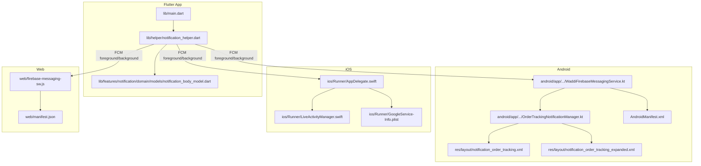
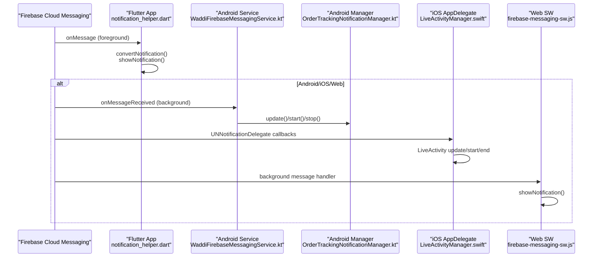
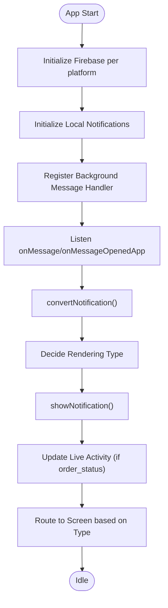
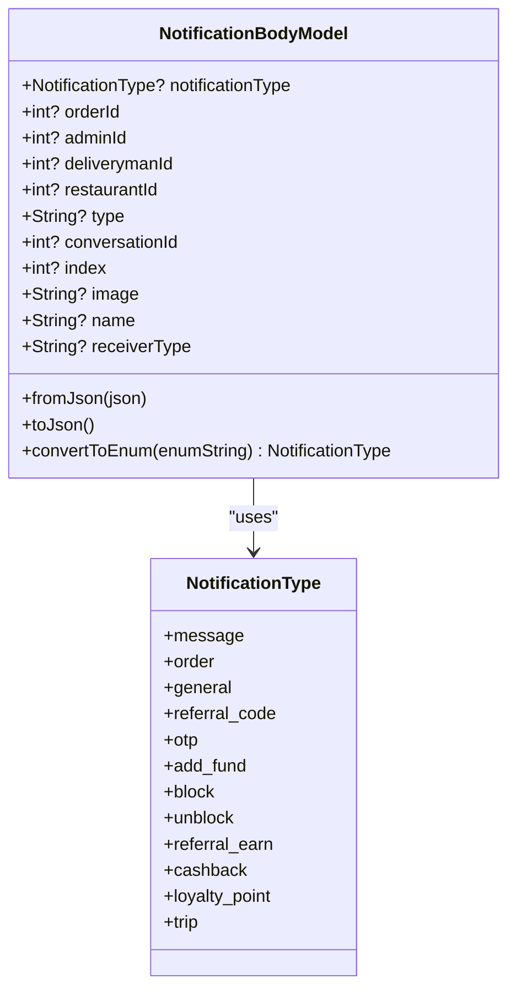
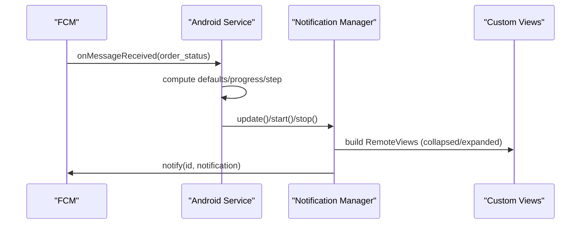
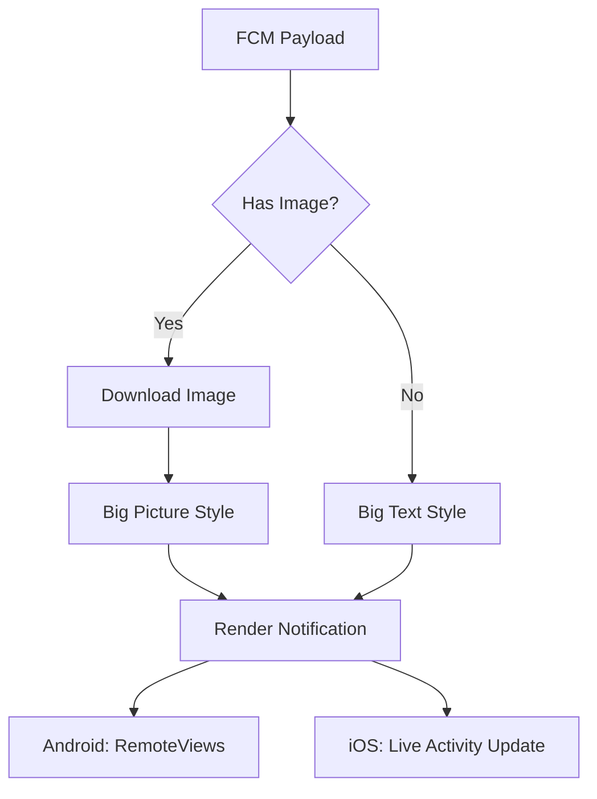
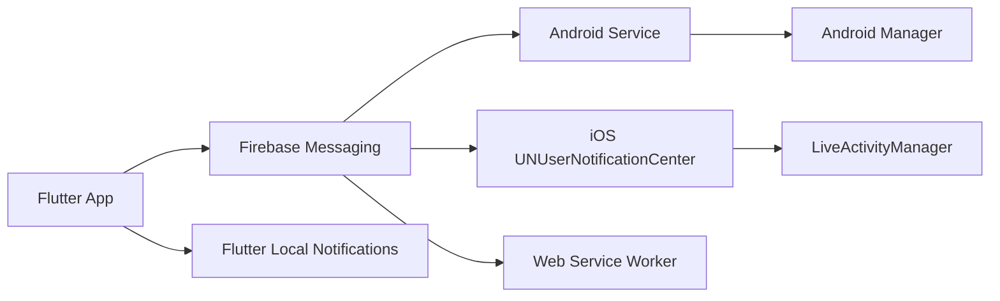

# Push Notifications

<cite>
**Referenced Files in This Document**
- [main.dart](file://lib/main.dart)
- [notification_helper.dart](file://lib/helper/notification_helper.dart)
- [notification_body_model.dart](file://lib/features/notification/domain/models/notification_body_model.dart)
- [WaddiFirebaseMessagingService.kt](file://android/app/src/main/kotlin/com/sixamtech/efood_multivendor/WaddiFirebaseMessagingService.kt)
- [OrderTrackingNotificationManager.kt](file://android/app/src/main/kotlin/com/sixamtech/efood_multivendor/OrderTrackingNotificationManager.kt)
- [AppDelegate.swift](file://ios/Runner/AppDelegate.swift)
- [LiveActivityManager.swift](file://ios/Runner/LiveActivityManager.swift)
- [firebase-messaging-sw.js](file://web/firebase-messaging-sw.js)
- [google-services.json](file://android/app/google-services.json)
- [GoogleService-Info.plist](file://ios/Runner/GoogleService-Info.plist)
- [manifest.json](file://web/manifest.json)
</cite>

## Table of Contents
1. [Introduction](#introduction)
2. [Project Structure](#project-structure)
3. [Core Components](#core-components)
4. [Architecture Overview](#architecture-overview)
5. [Detailed Component Analysis](#detailed-component-analysis)
6. [Dependency Analysis](#dependency-analysis)
7. [Performance Considerations](#performance-considerations)
8. [Troubleshooting Guide](#troubleshooting-guide)
9. [Conclusion](#conclusion)
10. [Appendices](#appendices)

## Introduction
This document explains the push notification system across Android, iOS, and Web platforms. It covers Firebase Cloud Messaging integration, notification handling, cross-platform implementation, the notification controller architecture, notification models, and service-layer logic. It also documents helper utilities, web service worker configuration, native Android/iOS notification services, notification templates, scheduling considerations, permissions, Live Activity integration for order tracking, delivery guarantees, background message processing, and platform-specific behaviors.

## Project Structure
The notification system spans three platforms:
- Android: Native Firebase Messaging service and a dedicated notification manager for order tracking with custom layouts.
- iOS: Firebase setup, UNUserNotificationCenter delegation, and Live Activity management via a method channel.
- Web: Firebase initialization and a service worker for background notifications and message distribution.

**Diagram sources**
- [main.dart:35-103](file://lib/main.dart#L35-L103)
- [notification_helper.dart:27-318](file://lib/helper/notification_helper.dart#L27-L318)
- [notification_body_model.dart:21-98](file://lib/features/notification/domain/models/notification_body_model.dart#L21-L98)
- [WaddiFirebaseMessagingService.kt:6-18](file://android/app/src/main/kotlin/com/sixamtech/efood_multivendor/WaddiFirebaseMessagingService.kt#L6-L18)
- [OrderTrackingNotificationManager.kt:13-194](file://android/app/src/main/kotlin/com/sixamtech/efood_multivendor/OrderTrackingNotificationManager.kt#L13-L194)
- [AppDelegate.swift:9-39](file://ios/Runner/AppDelegate.swift#L9-L39)
- [LiveActivityManager.swift:8-174](file://ios/Runner/LiveActivityManager.swift#L8-L174)
- [firebase-messaging-sw.js:1-40](file://web/firebase-messaging-sw.js#L1-L40)
- [google-services.json:1-29](file://android/app/google-services.json#L1-L29)
- [GoogleService-Info.plist:1-30](file://ios/Runner/GoogleService-Info.plist#L1-L30)
- [manifest.json:1-24](file://web/manifest.json#L1-L24)

**Section sources**
- [main.dart:35-103](file://lib/main.dart#L35-L103)
- [notification_helper.dart:27-318](file://lib/helper/notification_helper.dart#L27-L318)
- [notification_body_model.dart:21-98](file://lib/features/notification/domain/models/notification_body_model.dart#L21-L98)
- [WaddiFirebaseMessagingService.kt:6-18](file://android/app/src/main/kotlin/com/sixamtech/efood_multivendor/WaddiFirebaseMessagingService.kt#L6-L18)
- [OrderTrackingNotificationManager.kt:13-194](file://android/app/src/main/kotlin/com/sixamtech/efood_multivendor/OrderTrackingNotificationManager.kt#L13-L194)
- [AppDelegate.swift:9-39](file://ios/Runner/AppDelegate.swift#L9-L39)
- [LiveActivityManager.swift:8-174](file://ios/Runner/LiveActivityManager.swift#L8-L174)
- [firebase-messaging-sw.js:1-40](file://web/firebase-messaging-sw.js#L1-L40)
- [google-services.json:1-29](file://android/app/google-services.json#L1-L29)
- [GoogleService-Info.plist:1-30](file://ios/Runner/GoogleService-Info.plist#L1-L30)
- [manifest.json:1-24](file://web/manifest.json#L1-L24)

## Core Components
- Flutter entry and initialization:
  - Initializes Firebase differently per platform and registers background message handlers.
  - Retrieves initial messages for mobile and sets up notification helpers.
- Notification helper:
  - Initializes local notifications, handles foreground/background events, routes actions, and updates Live Activity.
  - Converts FCM payloads to structured models and decides notification rendering (text, big text, big picture).
- Notification models:
  - Defines notification types and payload structure for routing and UI.
- Android service and manager:
  - Intercepts FCM messages, parses order status updates, and manages ongoing order tracking notifications with custom views.
- iOS Live Activity:
  - Manages ActivityKit activities for order tracking, supports start/update/end lifecycle, and exposes a method channel for Flutter.
- Web service worker:
  - Initializes Firebase Messaging, forwards background messages to open windows, and displays notifications.

**Section sources**
- [main.dart:35-103](file://lib/main.dart#L35-L103)
- [notification_helper.dart:27-318](file://lib/helper/notification_helper.dart#L27-L318)
- [notification_body_model.dart:21-98](file://lib/features/notification/domain/models/notification_body_model.dart#L21-L98)
- [WaddiFirebaseMessagingService.kt:6-18](file://android/app/src/main/kotlin/com/sixamtech/efood_multivendor/WaddiFirebaseMessagingService.kt#L6-L18)
- [OrderTrackingNotificationManager.kt:13-194](file://android/app/src/main/kotlin/com/sixamtech/efood_multivendor/OrderTrackingNotificationManager.kt#L13-L194)
- [LiveActivityManager.swift:8-174](file://ios/Runner/LiveActivityManager.swift#L8-L174)
- [firebase-messaging-sw.js:1-40](file://web/firebase-messaging-sw.js#L1-L40)

## Architecture Overview
The system integrates Firebase Cloud Messaging across platforms, with platform-specific handlers and a shared Flutter notification helper for routing and rendering.

**Diagram sources**
- [notification_helper.dart:114-249](file://lib/helper/notification_helper.dart#L114-L249)
- [WaddiFirebaseMessagingService.kt:8-18](file://android/app/src/main/kotlin/com/sixamtech/efood_multivendor/WaddiFirebaseMessagingService.kt#L8-L18)
- [OrderTrackingNotificationManager.kt:55-181](file://android/app/src/main/kotlin/com/sixamtech/efood_multivendor/OrderTrackingNotificationManager.kt#L55-L181)
- [LiveActivityManager.swift:50-173](file://ios/Runner/LiveActivityManager.swift#L50-L173)
- [firebase-messaging-sw.js:17-37](file://web/firebase-messaging-sw.js#L17-L37)

## Detailed Component Analysis

### Flutter Notification Controller Architecture
- Initialization:
  - Configures Firebase per platform and registers background message handler.
  - Initializes local notifications and sets up tap-action routing.
- Foreground handling:
  - Listens to onMessage, converts payloads, renders appropriate notifications, and updates Live Activity for order status.
- Background handling:
  - Registers background message handler for Android; web forwards messages to windows and shows notifications.
- Routing:
  - Routes to order details, chat, wallet, loyalty, and taxi screens based on notification type and payload.

**Diagram sources**
- [main.dart:54-91](file://lib/main.dart#L54-L91)
- [notification_helper.dart:28-318](file://lib/helper/notification_helper.dart#L28-L318)

**Section sources**
- [main.dart:54-91](file://lib/main.dart#L54-L91)
- [notification_helper.dart:28-318](file://lib/helper/notification_helper.dart#L28-L318)

### Notification Models
- Enumerates notification types (order, message, trip, wallet promotions, etc.).
- Encapsulates payload fields for routing and UI rendering.
- Provides conversion from JSON and enum mapping.

**Diagram sources**
- [notification_body_model.dart:1-98](file://lib/features/notification/domain/models/notification_body_model.dart#L1-L98)

**Section sources**
- [notification_body_model.dart:1-98](file://lib/features/notification/domain/models/notification_body_model.dart#L1-L98)

### Service Layer Implementation
- Android service:
  - Intercepts onMessageReceived, detects order_status type, computes defaults, progress, and step, and delegates to the notification manager.
  - Handles terminal states by stopping the notification; otherwise updates with ETA and visuals.
- Android notification manager:
  - Creates a high-importance channel, builds custom collapsed/expanded RemoteViews, sets ongoing/auto-cancel semantics, and schedules auto-dismiss for delivered state.
- iOS Live Activity:
  - Exposes method channel to start/update/end activities, validates platform support, and returns push tokens asynchronously.
- Web service worker:
  - Initializes Firebase Messaging, forwards background messages to all window clients, and shows notifications.

**Diagram sources**
- [WaddiFirebaseMessagingService.kt:20-50](file://android/app/src/main/kotlin/com/sixamtech/efood_multivendor/WaddiFirebaseMessagingService.kt#L20-L50)
- [OrderTrackingNotificationManager.kt:55-181](file://android/app/src/main/kotlin/com/sixamtech/efood_multivendor/OrderTrackingNotificationManager.kt#L55-L181)

**Section sources**
- [WaddiFirebaseMessagingService.kt:6-104](file://android/app/src/main/kotlin/com/sixamtech/efood_multivendor/WaddiFirebaseMessagingService.kt#L6-L104)
- [OrderTrackingNotificationManager.kt:13-194](file://android/app/src/main/kotlin/com/sixamtech/efood_multivendor/OrderTrackingNotificationManager.kt#L13-L194)
- [LiveActivityManager.swift:16-174](file://ios/Runner/LiveActivityManager.swift#L16-L174)
- [firebase-messaging-sw.js:17-37](file://web/firebase-messaging-sw.js#L17-L37)

### Notification Templates and Rendering
- Flutter notification helper:
  - Renders text, big text, and big picture notifications with platform-specific details.
  - Downloads images for big picture style and falls back to big text if download fails.
- Android custom layouts:
  - Uses RemoteViews with collapsed and expanded views for order tracking.
  - Includes store name, driver info, and rate button visibility for delivered state.
- iOS Live Activity:
  - Updates content state (status, ETA, progress, step) and ends activity after a short delay upon completion.

**Diagram sources**
- [notification_helper.dart:358-530](file://lib/helper/notification_helper.dart#L358-L530)
- [OrderTrackingNotificationManager.kt:89-181](file://android/app/src/main/kotlin/com/sixamtech/efood_multivendor/OrderTrackingNotificationManager.kt#L89-L181)
- [LiveActivityManager.swift:108-173](file://ios/Runner/LiveActivityManager.swift#L108-L173)

**Section sources**
- [notification_helper.dart:358-530](file://lib/helper/notification_helper.dart#L358-L530)
- [OrderTrackingNotificationManager.kt:89-181](file://android/app/src/main/kotlin/com/sixamtech/efood_multivendor/OrderTrackingNotificationManager.kt#L89-L181)
- [LiveActivityManager.swift:108-173](file://ios/Runner/LiveActivityManager.swift#L108-L173)

### Cross-Platform Permissions and Setup
- Android:
  - Firebase configuration via google-services.json.
  - Notification channel creation with vibration/sound disabled.
- iOS:
  - Firebase configured in AppDelegate; UNUserNotificationCenter delegate registered; Live Activity method channel wired.
  - GoogleService-Info.plist for Firebase configuration.
- Web:
  - Firebase initialized with web config; manifest.json defines PWA metadata.

**Section sources**
- [google-services.json:1-29](file://android/app/google-services.json#L1-L29)
- [OrderTrackingNotificationManager.kt:39-53](file://android/app/src/main/kotlin/com/sixamtech/efood_multivendor/OrderTrackingNotificationManager.kt#L39-L53)
- [AppDelegate.swift:14-35](file://ios/Runner/AppDelegate.swift#L14-L35)
- [GoogleService-Info.plist:1-30](file://ios/Runner/GoogleService-Info.plist#L1-L30)
- [manifest.json:1-24](file://web/manifest.json#L1-L24)

### Background Message Processing and Delivery Guarantees
- Android:
  - onMessageReceived is used for foreground; background delivery is managed by the OS and the service.
- iOS:
  - UNUserNotificationCenter delegate enables foreground/background handling; Live Activity updates occur via ActivityKit.
- Web:
  - Service worker receives background messages and shows notifications; maintains a connection to deliver messages to open windows.

**Section sources**
- [WaddiFirebaseMessagingService.kt:8-18](file://android/app/src/main/kotlin/com/sixamtech/efood_multivendor/WaddiFirebaseMessagingService.kt#L8-L18)
- [AppDelegate.swift:17-23](file://ios/Runner/AppDelegate.swift#L17-L23)
- [firebase-messaging-sw.js:17-37](file://web/firebase-messaging-sw.js#L17-L37)

### Live Activity Integration for Order Tracking
- Flutter triggers Live Activity updates based on order_status FCM payloads.
- iOS LiveActivityManager supports:
  - Start with attributes and content state.
  - Update content state dynamically.
  - End with final state and dismissal policy.
- Android order tracking notifications complement Live Activity with persistent progress bars and actionable buttons.

**Section sources**
- [notification_helper.dart:320-356](file://lib/helper/notification_helper.dart#L320-L356)
- [LiveActivityManager.swift:50-173](file://ios/Runner/LiveActivityManager.swift#L50-L173)
- [OrderTrackingNotificationManager.kt:55-181](file://android/app/src/main/kotlin/com/sixamtech/efood_multivendor/OrderTrackingNotificationManager.kt#L55-L181)

### Notification Scheduling and Triggers
- Triggers:
  - order_status: order lifecycle updates (pending → confirmed → processing → handover → picked_up → delivered).
  - message: chat notifications with conversation routing.
  - trip_status: taxi ride completion with payment prompt.
  - wallet promotions: referral_earn, cashback, loyalty_point, add_fund.
  - demo_reset: special dialog trigger.
- Scheduling:
  - Ongoing notifications for non-terminal statuses.
  - Auto-dismiss for delivered state after a short delay.
  - Live Activity end after a short delay upon terminal status.

**Section sources**
- [WaddiFirebaseMessagingService.kt:12-50](file://android/app/src/main/kotlin/com/sixamtech/efood_multivendor/WaddiFirebaseMessagingService.kt#L12-L50)
- [OrderTrackingNotificationManager.kt:85-181](file://android/app/src/main/kotlin/com/sixamtech/efood_multivendor/OrderTrackingNotificationManager.kt#L85-L181)
- [notification_helper.dart:114-249](file://lib/helper/notification_helper.dart#L114-L249)
- [LiveActivityManager.swift:142-173](file://ios/Runner/LiveActivityManager.swift#L142-L173)

## Dependency Analysis
- Flutter depends on Firebase Messaging and Flutter Local Notifications plugins.
- Android service depends on the notification manager and layout resources.
- iOS depends on ActivityKit and UNUserNotificationCenter.
- Web depends on Firebase Messaging service worker.

**Diagram sources**
- [main.dart:24-33](file://lib/main.dart#L24-L33)
- [notification_helper.dart:16-25](file://lib/helper/notification_helper.dart#L16-L25)
- [WaddiFirebaseMessagingService.kt:3-4](file://android/app/src/main/kotlin/com/sixamtech/efood_multivendor/WaddiFirebaseMessagingService.kt#L3-L4)
- [OrderTrackingNotificationManager.kt:3-11](file://android/app/src/main/kotlin/com/sixamtech/efood_multivendor/OrderTrackingNotificationManager.kt#L3-L11)
- [AppDelegate.swift:4-6](file://ios/Runner/AppDelegate.swift#L4-L6)
- [LiveActivityManager.swift:4-6](file://ios/Runner/LiveActivityManager.swift#L4-L6)
- [firebase-messaging-sw.js:1-2](file://web/firebase-messaging-sw.js#L1-L2)

**Section sources**
- [main.dart:24-33](file://lib/main.dart#L24-L33)
- [notification_helper.dart:16-25](file://lib/helper/notification_helper.dart#L16-L25)
- [WaddiFirebaseMessagingService.kt:3-4](file://android/app/src/main/kotlin/com/sixamtech/efood_multivendor/WaddiFirebaseMessagingService.kt#L3-L4)
- [OrderTrackingNotificationManager.kt:3-11](file://android/app/src/main/kotlin/com/sixamtech/efood_multivendor/OrderTrackingNotificationManager.kt#L3-L11)
- [AppDelegate.swift:4-6](file://ios/Runner/AppDelegate.swift#L4-L6)
- [LiveActivityManager.swift:4-6](file://ios/Runner/LiveActivityManager.swift#L4-L6)
- [firebase-messaging-sw.js:1-2](file://web/firebase-messaging-sw.js#L1-L2)

## Performance Considerations
- Battery usage:
  - Android disables vibration and sound for the order tracking channel to reduce power consumption.
  - Auto-dismiss for delivered notifications prevents long-lived ongoing notifications.
- Rendering:
  - Big picture rendering downloads images; network failures fall back to big text to avoid blocking.
- Background delivery:
  - Android service handles background messages; ensure minimal work in onMessageReceived to keep latency low.
- Web:
  - Service worker forwards messages to open windows; avoid heavy processing in background handlers.

**Section sources**
- [OrderTrackingNotificationManager.kt:39-53](file://android/app/src/main/kotlin/com/sixamtech/efood_multivendor/OrderTrackingNotificationManager.kt#L39-L53)
- [OrderTrackingNotificationManager.kt:175-181](file://android/app/src/main/kotlin/com/sixamtech/efood_multivendor/OrderTrackingNotificationManager.kt#L175-L181)
- [notification_helper.dart:378-406](file://lib/helper/notification_helper.dart#L378-L406)
- [firebase-messaging-sw.js:17-37](file://web/firebase-messaging-sw.js#L17-L37)

## Troubleshooting Guide
- Android notifications not appearing:
  - Verify notification channel creation and importance level.
  - Confirm RemoteViews resource IDs match layouts.
- iOS Live Activity not updating:
  - Ensure device supports ActivityKit and permissions are granted.
  - Validate method channel wiring and argument parsing.
- Web notifications not showing:
  - Confirm service worker registration and Firebase initialization.
  - Check that background message handler is invoked and showNotification is called.
- Foreground vs background:
  - Foreground messages are handled by onMessage; background by platform-specific handlers.
- Payload routing:
  - Ensure notification type is recognized and payload fields are present for routing.

**Section sources**
- [OrderTrackingNotificationManager.kt:39-53](file://android/app/src/main/kotlin/com/sixamtech/efood_multivendor/OrderTrackingNotificationManager.kt#L39-L53)
- [LiveActivityManager.swift:43-48](file://ios/Runner/LiveActivityManager.swift#L43-L48)
- [firebase-messaging-sw.js:17-37](file://web/firebase-messaging-sw.js#L17-L37)
- [notification_helper.dart:114-249](file://lib/helper/notification_helper.dart#L114-L249)

## Conclusion
The push notification system integrates Firebase Cloud Messaging across Android, iOS, and Web with a unified Flutter notification helper for routing and rendering. Android provides persistent order tracking notifications with custom layouts, iOS offers Live Activity integration for real-time order updates, and Web delivers background notifications via a service worker. The system balances user experience with battery efficiency and platform-specific capabilities.

## Appendices
- Example notification triggers:
  - order_status: lifecycle updates with ETA and progress.
  - message: chat conversation routing.
  - trip_status: taxi ride completion with payment prompt.
  - wallet promotions: referral_earn, cashback, loyalty_point, add_fund.
- Custom notification handling:
  - Order tracking uses ongoing notifications with auto-dismiss on terminal states.
  - Live Activity updates mirror order status changes.
- Delivery optimization:
  - Minimal vibration/sound channels, auto-dismiss timers, and efficient rendering fallbacks.