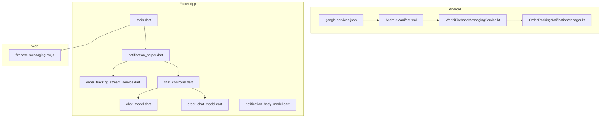
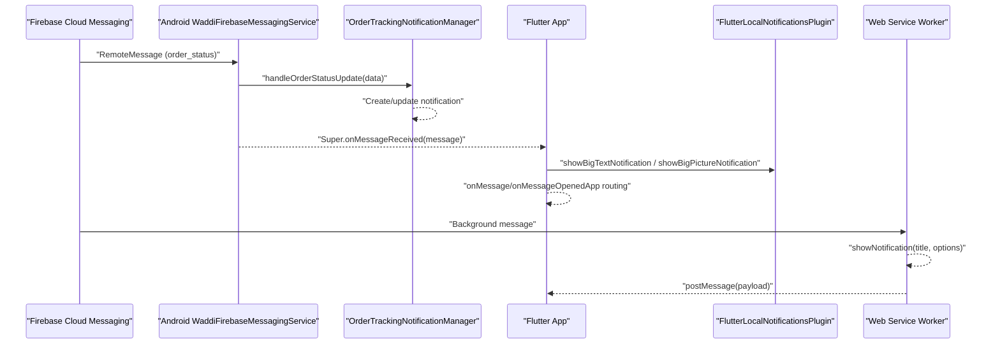
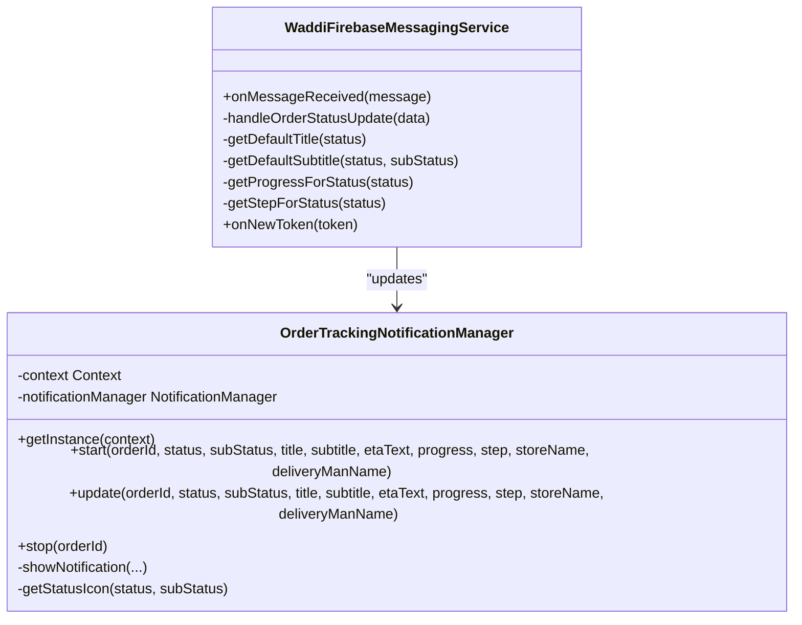
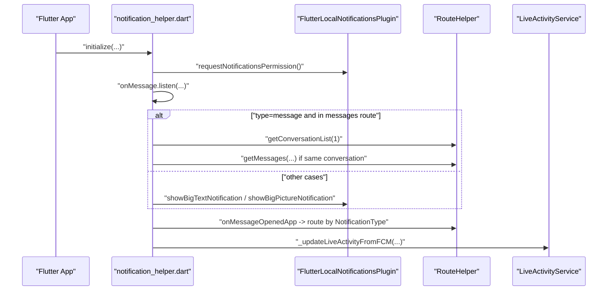
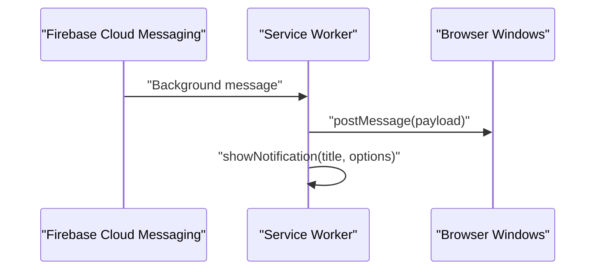
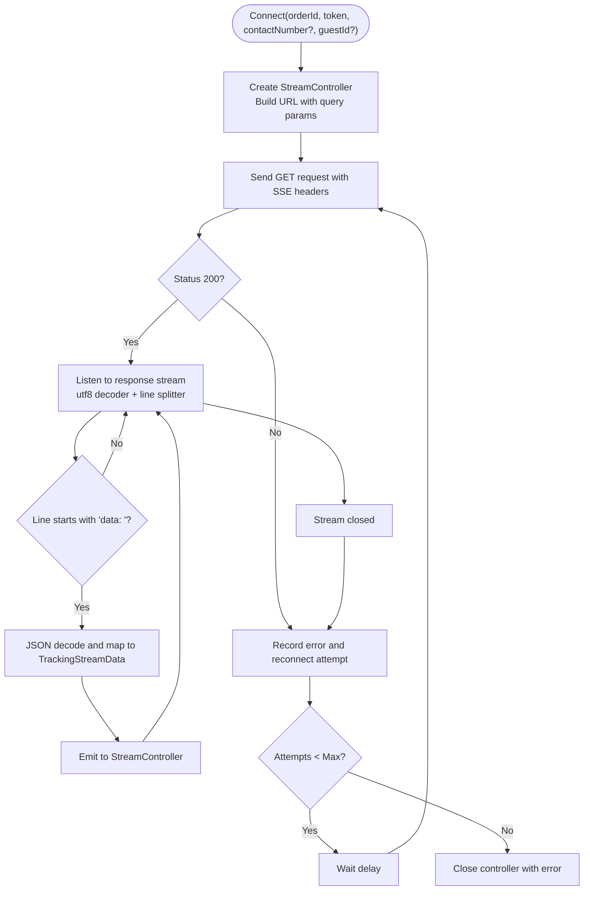
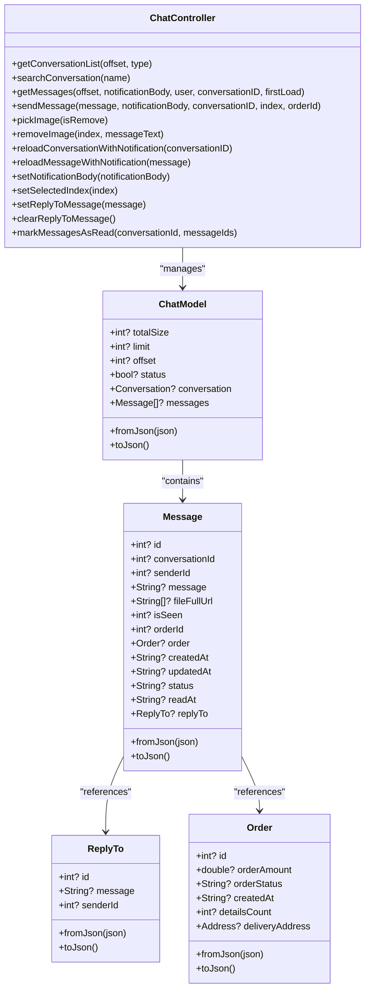
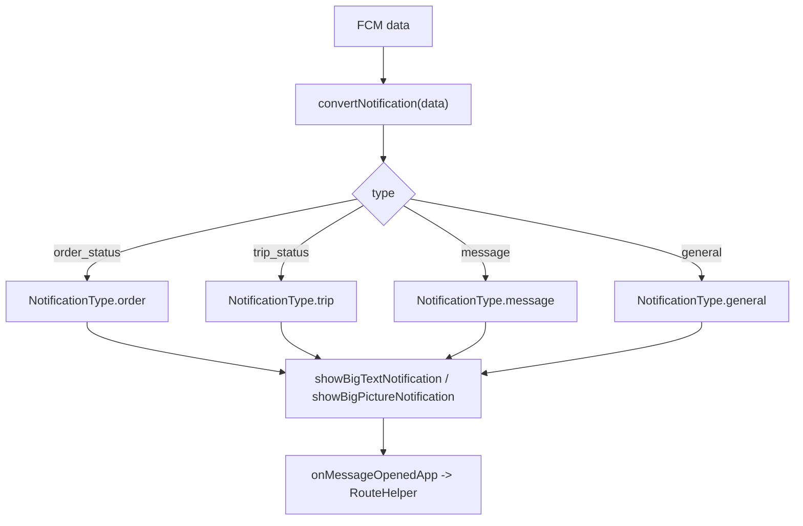
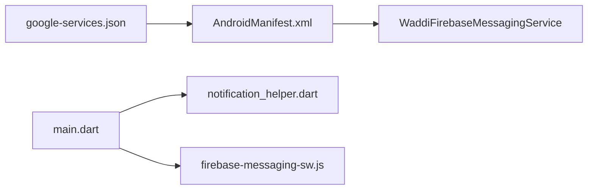
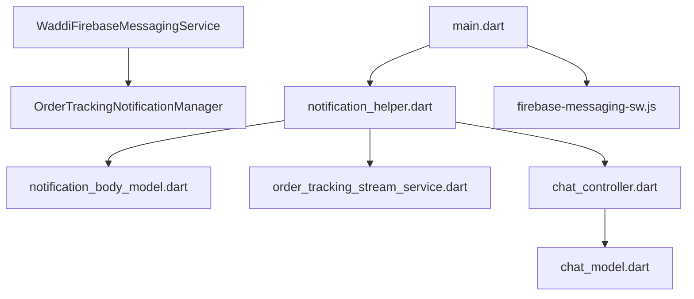

# Real-Time Communication

<cite>
**Referenced Files in This Document**
- [WaddiFirebaseMessagingService.kt](file://android/app/src/main/kotlin/com/sixamtech/efood_multivendor/WaddiFirebaseMessagingService.kt)
- [OrderTrackingNotificationManager.kt](file://android/app/src/main/kotlin/com/sixamtech/efood_multivendor/OrderTrackingNotificationManager.kt)
- [google-services.json](file://android/app/google-services.json)
- [main.dart](file://lib/main.dart)
- [notification_helper.dart](file://lib/helper/notification_helper.dart)
- [firebase-messaging-sw.js](file://web/firebase-messaging-sw.js)
- [AndroidManifest.xml](file://android/app/src/main/AndroidManifest.xml)
- [order_tracking_stream_service.dart](file://lib/features/order/domain/services/order_tracking_stream_service.dart)
- [chat_controller.dart](file://lib/features/chat/controllers/chat_controller.dart)
- [chat_model.dart](file://lib/features/chat/domain/models/chat_model.dart)
- [order_chat_model.dart](file://lib/features/chat/domain/models/order_chat_model.dart)
- [notification_body_model.dart](file://lib/features/notification/domain/models/notification_body_model.dart)
</cite>

## Table of Contents
1. [Introduction](#introduction)
2. [Project Structure](#project-structure)
3. [Core Components](#core-components)
4. [Architecture Overview](#architecture-overview)
5. [Detailed Component Analysis](#detailed-component-analysis)
6. [Dependency Analysis](#dependency-analysis)
7. [Performance Considerations](#performance-considerations)
8. [Troubleshooting Guide](#troubleshooting-guide)
9. [Conclusion](#conclusion)

## Introduction
This document describes the real-time communication system, covering push notifications, live order tracking, chat functionality, and background synchronization. It explains Firebase Cloud Messaging integration, notification handling, and real-time data streaming. It documents the OrderTrackingStreamService implementation, chat system architecture, and background message processing. It also covers notification templates, push notification scheduling, chat message persistence, integration with Firebase services, notification permissions, and cross-platform notification handling. Examples of real-time updates, notification triggers, and chat interactions are included, along with guidance on notification delivery guarantees, chat message synchronization, offline message queuing, performance considerations for real-time data, and battery optimization for background services.

## Project Structure
The real-time communication system spans three primary platforms:
- Android native services for push notifications and order tracking
- Flutter app for foreground/background handling, local notifications, and UI
- Web service worker for browser-based background notifications

**Diagram sources**
- [WaddiFirebaseMessagingService.kt:1-104](file://android/app/src/main/kotlin/com/sixamtech/efood_multivendor/WaddiFirebaseMessagingService.kt#L1-L104)
- [OrderTrackingNotificationManager.kt:1-195](file://android/app/src/main/kotlin/com/sixamtech/efood_multivendor/OrderTrackingNotificationManager.kt#L1-L195)
- [AndroidManifest.xml:1-111](file://android/app/src/main/AndroidManifest.xml#L1-L111)
- [google-services.json:1-29](file://android/app/google-services.json#L1-L29)
- [main.dart:1-249](file://lib/main.dart#L1-L249)
- [notification_helper.dart:1-662](file://lib/helper/notification_helper.dart#L1-L662)
- [order_tracking_stream_service.dart:1-260](file://lib/features/order/domain/services/order_tracking_stream_service.dart#L1-L260)
- [chat_controller.dart:1-554](file://lib/features/chat/controllers/chat_controller.dart#L1-L554)
- [chat_model.dart:1-253](file://lib/features/chat/domain/models/chat_model.dart#L1-L253)
- [order_chat_model.dart:1-22](file://lib/features/chat/domain/models/order_chat_model.dart#L1-L22)
- [notification_body_model.dart:1-99](file://lib/features/notification/domain/models/notification_body_model.dart#L1-L99)
- [firebase-messaging-sw.js:1-40](file://web/firebase-messaging-sw.js#L1-L40)

**Section sources**
- [main.dart:35-103](file://lib/main.dart#L35-L103)
- [AndroidManifest.xml:1-111](file://android/app/src/main/AndroidManifest.xml#L1-L111)

## Core Components
- Android push notification pipeline:
  - WaddiFirebaseMessagingService handles incoming FCM messages and delegates order status updates to the order tracking notification manager.
  - OrderTrackingNotificationManager creates and updates ongoing notifications with custom collapsed and expanded views, progress indicators, and action buttons.
- Flutter foreground/background pipeline:
  - Firebase initialization and background message handler registration.
  - Local notification rendering with big text and big picture styles, and deep-link routing based on notification type.
  - Live activity updates for order tracking events.
- Real-time order tracking:
  - SSE-based streaming service that connects to a server endpoint and emits structured tracking updates.
- Chat system:
  - ChatController orchestrates conversation retrieval, message fetching, sending, media attachments, reply-to features, and read receipts.
  - Message model supports rich content, order references, and reply-to metadata.

**Section sources**
- [WaddiFirebaseMessagingService.kt:8-18](file://android/app/src/main/kotlin/com/sixamtech/efood_multivendor/WaddiFirebaseMessagingService.kt#L8-L18)
- [OrderTrackingNotificationManager.kt:55-87](file://android/app/src/main/kotlin/com/sixamtech/efood_multivendor/OrderTrackingNotificationManager.kt#L55-L87)
- [notification_helper.dart:28-113](file://lib/helper/notification_helper.dart#L28-L113)
- [order_tracking_stream_service.dart:67-89](file://lib/features/order/domain/services/order_tracking_stream_service.dart#L67-L89)
- [chat_controller.dart:16-554](file://lib/features/chat/controllers/chat_controller.dart#L16-L554)

## Architecture Overview
The system integrates Firebase Cloud Messaging across Android, Flutter, and Web:
- Android receives FCM messages and renders order tracking notifications.
- Flutter registers background handlers and displays local notifications with rich content.
- Web service worker intercepts background messages and shows browser notifications.
- SSE streams provide continuous order updates to the UI.

**Diagram sources**
- [WaddiFirebaseMessagingService.kt:8-50](file://android/app/src/main/kotlin/com/sixamtech/efood_multivendor/WaddiFirebaseMessagingService.kt#L8-L50)
- [OrderTrackingNotificationManager.kt:89-181](file://android/app/src/main/kotlin/com/sixamtech/efood_multivendor/OrderTrackingNotificationManager.kt#L89-L181)
- [notification_helper.dart:114-249](file://lib/helper/notification_helper.dart#L114-L249)
- [firebase-messaging-sw.js:17-37](file://web/firebase-messaging-sw.js#L17-L37)

## Detailed Component Analysis

### Android Push Notifications and Order Tracking
- WaddiFirebaseMessagingService:
  - Parses incoming RemoteMessage data and routes order status updates.
  - Computes default titles/subtitles, ETA text, and progress/steps based on status.
  - Delegates to OrderTrackingNotificationManager to start/update/stop notifications.
- OrderTrackingNotificationManager:
  - Creates a high-importance notification channel.
  - Builds custom collapsed and expanded RemoteViews with progress visuals.
  - Handles tap intents to open the app with order context.
  - Auto-dismisses delivered notifications after a short delay.

**Diagram sources**
- [WaddiFirebaseMessagingService.kt:6-103](file://android/app/src/main/kotlin/com/sixamtech/efood_multivendor/WaddiFirebaseMessagingService.kt#L6-L103)
- [OrderTrackingNotificationManager.kt:13-194](file://android/app/src/main/kotlin/com/sixamtech/efood_multivendor/OrderTrackingNotificationManager.kt#L13-L194)

**Section sources**
- [WaddiFirebaseMessagingService.kt:20-50](file://android/app/src/main/kotlin/com/sixamtech/efood_multivendor/WaddiFirebaseMessagingService.kt#L20-L50)
- [OrderTrackingNotificationManager.kt:55-87](file://android/app/src/main/kotlin/com/sixamtech/efood_multivendor/OrderTrackingNotificationManager.kt#L55-L87)

### Flutter Foreground/Background Pipeline and Local Notifications
- main.dart:
  - Initializes Firebase differently per platform and registers background message handler.
  - Retrieves initial notification payload and routes accordingly.
- notification_helper.dart:
  - Initializes local notifications and requests permission.
  - Listens to foreground messages and decides whether to show rich notifications or route to specific screens.
  - Handles special cases like demo reset dialogs and taxi trip completion prompts.
  - Converts FCM payloads into NotificationBodyModel and routes to appropriate screens.
  - Provides multiple notification styles (text, big text, big picture) with optional image download.
  - Updates Live Activity for order status changes when applicable.

**Diagram sources**
- [main.dart:80-91](file://lib/main.dart#L80-L91)
- [notification_helper.dart:28-113](file://lib/helper/notification_helper.dart#L28-L113)
- [notification_helper.dart:114-249](file://lib/helper/notification_helper.dart#L114-L249)
- [notification_helper.dart:320-356](file://lib/helper/notification_helper.dart#L320-L356)

**Section sources**
- [main.dart:54-76](file://lib/main.dart#L54-L76)
- [notification_helper.dart:28-113](file://lib/helper/notification_helper.dart#L28-L113)
- [notification_helper.dart:358-406](file://lib/helper/notification_helper.dart#L358-L406)
- [notification_helper.dart:408-530](file://lib/helper/notification_helper.dart#L408-L530)

### Web Background Notifications
- firebase-messaging-sw.js:
  - Initializes Firebase Messaging in the service worker.
  - Handles background messages by posting them to all window clients and displaying a browser notification.

**Diagram sources**
- [firebase-messaging-sw.js:1-40](file://web/firebase-messaging-sw.js#L1-L40)

**Section sources**
- [firebase-messaging-sw.js:17-37](file://web/firebase-messaging-sw.js#L17-L37)

### Real-Time Order Tracking Streaming
- OrderTrackingStreamService:
  - Establishes an SSE connection to a backend endpoint with optional query parameters for guest or contact-based tracking.
  - Parses server-sent events, decodes JSON data, and emits TrackingStreamData objects.
  - Implements retry logic with capped attempts and delays.
  - Supports cancellation and cleanup of resources.

**Diagram sources**
- [order_tracking_stream_service.dart:77-192](file://lib/features/order/domain/services/order_tracking_stream_service.dart#L77-L192)
- [order_tracking_stream_service.dart:194-242](file://lib/features/order/domain/services/order_tracking_stream_service.dart#L194-L242)

**Section sources**
- [order_tracking_stream_service.dart:67-89](file://lib/features/order/domain/services/order_tracking_stream_service.dart#L67-L89)
- [order_tracking_stream_service.dart:91-192](file://lib/features/order/domain/services/order_tracking_stream_service.dart#L91-L192)
- [order_tracking_stream_service.dart:214-242](file://lib/features/order/domain/services/order_tracking_stream_service.dart#L214-L242)

### Chat System Architecture
- ChatController:
  - Manages conversation lists, message retrieval, and sending logic.
  - Supports multiple recipient types (admin, vendor, delivery man) and conversation-specific queries.
  - Handles media attachments, reply-to messages, and read receipts.
  - Updates UI state and synchronizes with backend APIs.
- Chat models:
  - ChatModel encapsulates pagination metadata and conversation/message collections.
  - Message includes status, readAt timestamps, and reply-to references.
  - Order and Address models enrich messages with order context.

**Diagram sources**
- [chat_controller.dart:16-554](file://lib/features/chat/controllers/chat_controller.dart#L16-L554)
- [chat_model.dart:3-51](file://lib/features/chat/domain/models/chat_model.dart#L3-L51)
- [chat_model.dart:53-132](file://lib/features/chat/domain/models/chat_model.dart#L53-L132)
- [chat_model.dart:134-175](file://lib/features/chat/domain/models/chat_model.dart#L134-L175)
- [chat_model.dart:232-252](file://lib/features/chat/domain/models/chat_model.dart#L232-L252)

**Section sources**
- [chat_controller.dart:87-134](file://lib/features/chat/controllers/chat_controller.dart#L87-L134)
- [chat_controller.dart:221-320](file://lib/features/chat/controllers/chat_controller.dart#L221-L320)
- [chat_controller.dart:354-452](file://lib/features/chat/controllers/chat_controller.dart#L354-L452)
- [chat_model.dart:20-50](file://lib/features/chat/domain/models/chat_model.dart#L20-L50)
- [chat_model.dart:85-108](file://lib/features/chat/domain/models/chat_model.dart#L85-L108)
- [order_chat_model.dart:1-22](file://lib/features/chat/domain/models/order_chat_model.dart#L1-L22)

### Notification Templates and Routing
- Notification templates:
  - Text, big text, and big picture notification styles are supported with optional image downloads.
  - Payload carries structured data for routing and UI hydration.
- Routing:
  - NotificationBodyModel maps FCM types to NotificationType and carries identifiers for targeted navigation.
  - Routes include order details, chat, wallet, loyalty, and general notification screens.

**Diagram sources**
- [notification_helper.dart:544-622](file://lib/helper/notification_helper.dart#L544-L622)
- [notification_helper.dart:358-406](file://lib/helper/notification_helper.dart#L358-L406)
- [notification_helper.dart:251-317](file://lib/helper/notification_helper.dart#L251-L317)
- [notification_body_model.dart:21-47](file://lib/features/notification/domain/models/notification_body_model.dart#L21-L47)

**Section sources**
- [notification_helper.dart:544-622](file://lib/helper/notification_helper.dart#L544-L622)
- [notification_helper.dart:358-406](file://lib/helper/notification_helper.dart#L358-L406)
- [notification_helper.dart:251-317](file://lib/helper/notification_helper.dart#L251-L317)
- [notification_body_model.dart:1-19](file://lib/features/notification/domain/models/notification_body_model.dart#L1-L19)

### Cross-Platform Notification Handling
- Android:
  - Service declared in AndroidManifest to receive MESSAGING_EVENT.
  - Notification channel configured with high importance and vibration disabled.
- Flutter:
  - Local notifications initialized with platform-specific settings.
  - Background message handler registered for app lifecycle handling.
- Web:
  - Service worker script loads Firebase JS SDK and displays notifications.

**Diagram sources**
- [AndroidManifest.xml:101-107](file://android/app/src/main/AndroidManifest.xml#L101-L107)
- [google-services.json:1-29](file://android/app/google-services.json#L1-L29)
- [main.dart:88-90](file://lib/main.dart#L88-L90)
- [firebase-messaging-sw.js:1-13](file://web/firebase-messaging-sw.js#L1-L13)

**Section sources**
- [AndroidManifest.xml:101-107](file://android/app/src/main/AndroidManifest.xml#L101-L107)
- [main.dart:88-90](file://lib/main.dart#L88-L90)
- [firebase-messaging-sw.js:1-13](file://web/firebase-messaging-sw.js#L1-L13)

## Dependency Analysis
- Android depends on:
  - Firebase Messaging SDK for receiving RemoteMessage.
  - NotificationCompat and RemoteViews for custom notifications.
- Flutter depends on:
  - Firebase_messaging for FCM integration.
  - Flutter_local_notifications for local notifications.
  - RouteHelper for navigation based on NotificationType.
- Web depends on:
  - Firebase JS SDK loaded via service worker script.
- Internal dependencies:
  - NotificationHelper depends on NotificationBodyModel and routes.
  - ChatController depends on ChatModel and various enums/services.

**Diagram sources**
- [WaddiFirebaseMessagingService.kt:3-4](file://android/app/src/main/kotlin/com/sixamtech/efood_multivendor/WaddiFirebaseMessagingService.kt#L3-L4)
- [OrderTrackingNotificationManager.kt:3-11](file://android/app/src/main/kotlin/com/sixamtech/efood_multivendor/OrderTrackingNotificationManager.kt#L3-L11)
- [main.dart:24-26](file://lib/main.dart#L24-L26)
- [notification_helper.dart:16-25](file://lib/helper/notification_helper.dart#L16-L25)
- [notification_body_model.dart:21-47](file://lib/features/notification/domain/models/notification_body_model.dart#L21-L47)
- [order_tracking_stream_service.dart:1-7](file://lib/features/order/domain/services/order_tracking_stream_service.dart#L1-L7)
- [chat_controller.dart:8-14](file://lib/features/chat/controllers/chat_controller.dart#L8-L14)
- [chat_model.dart:1-3](file://lib/features/chat/domain/models/chat_model.dart#L1-L3)

**Section sources**
- [notification_helper.dart:16-25](file://lib/helper/notification_helper.dart#L16-L25)
- [chat_controller.dart:8-14](file://lib/features/chat/controllers/chat_controller.dart#L8-L14)

## Performance Considerations
- Real-time order tracking:
  - SSE streaming uses UTF-8 decoding and line splitting; ensure efficient parsing and minimal allocations.
  - Reconnection logic caps attempts and applies exponential backoff; tune max attempts and delay for network conditions.
  - Cancel subscriptions and close client on disconnect to prevent leaks.
- Chat:
  - Media compression and multipart body processing reduce payload sizes.
  - Pagination offsets minimize memory usage during message loading.
  - Read receipts are best-effort and should not block UI updates.
- Notifications:
  - Big picture notifications download images; cache or reuse files to reduce bandwidth.
  - Ongoing notifications for non-terminal statuses improve UX; auto-dismiss terminal statuses to free resources.
- Battery optimization:
  - Disable vibration and custom sounds for high-frequency channels.
  - Batch UI updates and avoid frequent rebuilds in controllers.
  - Use single-top launch mode and clear-top flags to prevent redundant activities.

[No sources needed since this section provides general guidance]

## Troubleshooting Guide
- FCM not received on Android:
  - Verify service declaration and intent filter in AndroidManifest.
  - Confirm google-services.json matches the app package name.
  - Ensure device has Google Play Services and notifications are enabled.
- Notifications not showing on Flutter:
  - Check permission request and initialization sequence.
  - Validate notification channel creation and payload encoding.
- Web background notifications:
  - Confirm service worker is registered and script loads Firebase JS.
  - Inspect browser console for errors in service worker context.
- Order tracking not updating:
  - Verify SSE URL construction with optional query parameters.
  - Review server-sent event format and data: prefix handling.
  - Monitor reconnection attempts and logs for persistent failures.
- Chat synchronization:
  - Ensure conversation IDs match between notifications and chat UI.
  - Confirm read receipt updates are applied locally even if backend fails.

**Section sources**
- [AndroidManifest.xml:101-107](file://android/app/src/main/AndroidManifest.xml#L101-L107)
- [google-services.json:12-12](file://android/app/google-services.json#L12-L12)
- [notification_helper.dart:28-43](file://lib/helper/notification_helper.dart#L28-L43)
- [firebase-messaging-sw.js:1-13](file://web/firebase-messaging-sw.js#L1-L13)
- [order_tracking_stream_service.dart:107-121](file://lib/features/order/domain/services/order_tracking_stream_service.dart#L107-L121)
- [order_tracking_stream_service.dart:194-212](file://lib/features/order/domain/services/order_tracking_stream_service.dart#L194-L212)

## Conclusion
The real-time communication system integrates Android push notifications, Flutter foreground/background handling, Web service workers, and SSE-based order tracking with a robust chat module. Firebase Cloud Messaging is consistently configured across platforms, with tailored notification experiences and deep-link routing. The OrderTrackingStreamService provides resilient streaming with retry logic, while the ChatController manages conversations, messages, media, and read receipts. For production, monitor delivery guarantees, optimize performance for real-time data, and implement battery-conscious background services.

[No sources needed since this section summarizes without analyzing specific files]